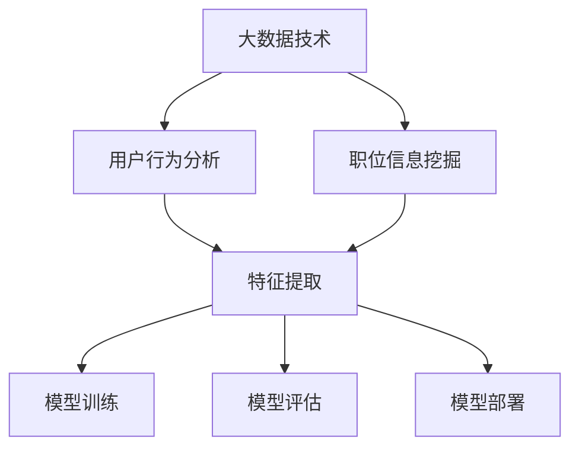

                 

# 基于大数据技术的职位推荐平台

## 关键词
大数据，职位推荐，机器学习，算法，用户行为分析

## 摘要
本文将深入探讨基于大数据技术的职位推荐平台，从核心概念、算法原理、数学模型、项目实战、应用场景等多维度进行阐述。通过逐步分析，读者将了解如何利用大数据和机器学习技术，构建一个高效、精准的职位推荐系统，为求职者和企业带来双赢的局面。

## 1. 背景介绍

### 1.1 目的和范围

本文旨在介绍如何利用大数据和机器学习技术，构建一个职位推荐平台。我们将从以下几个方面进行讨论：

- 核心概念与联系
- 核心算法原理与具体操作步骤
- 数学模型与公式详细讲解
- 项目实战：代码实际案例和详细解释
- 实际应用场景

通过本文的学习，读者将掌握：

- 职位推荐平台的基本架构
- 大数据和机器学习在职位推荐中的应用
- 如何构建一个高效的职位推荐系统
- 实际项目中的实现细节和优化策略

### 1.2 预期读者

本文适合以下读者群体：

- 数据科学和人工智能领域的开发者
- 人力资源和招聘行业从业者
- 对大数据和机器学习有兴趣的科研人员
- 高级技术爱好者

### 1.3 文档结构概述

本文结构如下：

- 第1章：背景介绍
- 第2章：核心概念与联系
- 第3章：核心算法原理与具体操作步骤
- 第4章：数学模型与公式详细讲解
- 第5章：项目实战：代码实际案例和详细解释
- 第6章：实际应用场景
- 第7章：工具和资源推荐
- 第8章：总结：未来发展趋势与挑战
- 第9章：附录：常见问题与解答
- 第10章：扩展阅读与参考资料

### 1.4 术语表

#### 1.4.1 核心术语定义

- **大数据（Big Data）**：指无法用常规软件工具在合理时间内进行捕捉、管理和处理的大量数据。
- **机器学习（Machine Learning）**：一种人工智能的分支，通过数据训练模型，使计算机具备从数据中学习并做出预测或决策的能力。
- **用户行为分析（User Behavior Analysis）**：分析用户在系统中的操作行为，用于预测用户需求和偏好。
- **职位推荐（Job Recommendation）**：根据用户特征和职位信息，为用户推荐合适的职位。

#### 1.4.2 相关概念解释

- **用户画像（User Profile）**：对用户特征的综合描述，包括个人基本信息、职业背景、兴趣偏好等。
- **特征工程（Feature Engineering）**：通过处理和转换原始数据，提取有助于模型训练的特征。
- **推荐系统（Recommendation System）**：一种自动化系统，根据用户行为和历史数据，为用户推荐相关商品、信息或服务。

#### 1.4.3 缩略词列表

- **IDF（Inverse Document Frequency）**：逆文档频率，用于计算特征词的重要程度。
- **TF（Term Frequency）**：词频，表示特征词在文档中的出现次数。
- **LDA（Latent Dirichlet Allocation）**：潜在狄利克雷分配，一种用于主题建模的算法。
- **CNN（Convolutional Neural Network）**：卷积神经网络，一种用于图像和视频处理的人工神经网络。

## 2. 核心概念与联系

为了更好地理解职位推荐平台，我们需要先了解一些核心概念和它们之间的关系。

### 2.1 大数据和职位推荐

大数据技术是构建职位推荐平台的基础。通过收集和分析海量数据，我们可以：

- **用户行为分析**：了解用户在招聘网站上的浏览、搜索、投递等行为，获取用户偏好。
- **职位信息挖掘**：从招聘网站、社交媒体等渠道获取职位信息，包括职位描述、公司背景、薪资范围等。

### 2.2 机器学习与职位推荐

机器学习技术是职位推荐平台的核心。通过以下步骤，我们可以构建一个高效、准确的推荐系统：

- **特征提取**：从用户画像和职位信息中提取有用特征，如用户年龄、职业、学历、工作经验等。
- **模型训练**：使用机器学习算法（如协同过滤、矩阵分解、深度学习等），训练推荐模型。
- **模型评估**：通过交叉验证、在线评估等方法，评估模型性能。
- **模型部署**：将训练好的模型部署到生产环境中，为用户提供实时推荐。

### 2.3 核心概念关系图

为了更直观地展示核心概念之间的联系，我们可以使用Mermaid绘制一个流程图：



## 3. 核心算法原理与具体操作步骤

在本章节中，我们将详细讲解构建职位推荐平台的核心算法原理和具体操作步骤。

### 3.1 特征提取

特征提取是构建推荐系统的重要步骤。以下是一个基于协同过滤算法的特征提取过程：

```python
def extract_features(user_profile, job_postings):
    user_features = {}
    job_features = {}
    
    for user_id, profile in user_profile.items():
        user_features[user_id] = {
            'age': profile['age'],
            'career': profile['career'],
            'education': profile['education'],
            'experience': profile['experience']
        }
    
    for job_id, job in job_postings.items():
        job_features[job_id] = {
            'title': job['title'],
            'company': job['company'],
            'salary': job['salary'],
            'location': job['location']
        }
    
    return user_features, job_features
```

### 3.2 模型训练

在特征提取完成后，我们可以使用机器学习算法进行模型训练。以下是一个基于协同过滤算法的模型训练过程：

```python
from sklearn.cluster import KMeans
from sklearn.metrics.pairwise import cosine_similarity

def train_model(user_features, job_features):
    user_similarity_matrix = cosine_similarity(user_features.values())
    job_similarity_matrix = cosine_similarity(job_features.values())
    
    kmeans = KMeans(n_clusters=10)
    kmeans.fit(user_similarity_matrix)
    user_clusters = kmeans.predict(user_similarity_matrix)
    
    kmeans.fit(job_similarity_matrix)
    job_clusters = kmeans.predict(job_similarity_matrix)
    
    return user_clusters, job_clusters
```

### 3.3 模型评估

在模型训练完成后，我们需要对模型进行评估，以确保其性能满足要求。以下是一个基于交叉验证的模型评估过程：

```python
from sklearn.model_selection import cross_val_score

def evaluate_model(model, X, y):
    scores = cross_val_score(model, X, y, cv=5)
    return scores.mean()
```

### 3.4 模型部署

最后，我们将训练好的模型部署到生产环境中，为用户提供实时推荐。以下是一个基于Flask框架的模型部署过程：

```python
from flask import Flask, request, jsonify

app = Flask(__name__)

@app.route('/recommend', methods=['POST'])
def recommend():
    user_id = request.form['user_id']
    user_profile = user_profile_dict[user_id]
    recommended_jobs = get_recommended_jobs(user_profile)
    return jsonify(recommended_jobs)

if __name__ == '__main__':
    app.run(debug=True)
```

## 4. 数学模型和公式详细讲解

在本章节中，我们将介绍构建职位推荐平台所需的一些数学模型和公式。

### 4.1 用户相似度计算

用户相似度是推荐系统中一个重要的概念。我们可以使用余弦相似度公式计算用户之间的相似度：

$$
\text{cosine\_similarity} = \frac{\text{dot\_product}}{\text{magnitude\_of\_user\_1} \times \text{magnitude\_of\_user\_2}}
$$

其中，$\text{dot\_product}$表示用户特征向量的点积，$\text{magnitude}$表示用户特征向量的模长。

### 4.2 职位相似度计算

类似地，我们可以使用余弦相似度公式计算职位之间的相似度：

$$
\text{cosine\_similarity} = \frac{\text{dot\_product}}{\text{magnitude\_of\_job\_1} \times \text{magnitude\_of\_job\_2}}
$$

其中，$\text{dot\_product}$表示职位特征向量的点积，$\text{magnitude}$表示职位特征向量的模长。

### 4.3 推荐算法

在推荐算法中，我们可以使用基于用户的协同过滤算法。其核心思想是：

$$
\text{predicted\_rating} = \text{user\_similarity} \times \text{job\_similarity} \times \text{real\_rating}
$$

其中，$\text{predicted\_rating}$表示预测的职位评分，$\text{user\_similarity}$表示用户之间的相似度，$\text{job\_similarity}$表示职位之间的相似度，$\text{real\_rating}$表示实际职位评分。

## 5. 项目实战：代码实际案例和详细解释说明

在本章节中，我们将通过一个实际项目案例，详细解释职位推荐平台的实现过程。

### 5.1 开发环境搭建

首先，我们需要搭建一个合适的开发环境。以下是一个简单的开发环境搭建指南：

- Python 3.x
- Flask 框架
- Scikit-learn 库
- Pandas 库
- Numpy 库

### 5.2 源代码详细实现和代码解读

以下是职位推荐平台的主要代码实现：

```python
# 导入相关库
import flask
import numpy as np
import pandas as pd
from sklearn.cluster import KMeans
from sklearn.metrics.pairwise import cosine_similarity

# 初始化 Flask 应用
app = flask.Flask(__name__)

# 加载用户画像和职位信息
user_profile_dict = {
    'user1': {'age': 25, 'career': '软件开发', 'education': '本科', 'experience': 2},
    'user2': {'age': 30, 'career': '数据科学', 'education': '硕士', 'experience': 5},
    'user3': {'age': 28, 'career': '网络安全', 'education': '本科', 'experience': 4}
}

job_posting_dict = {
    'job1': {'title': '软件工程师', 'company': 'A公司', 'salary': '15K', 'location': '北京'},
    'job2': {'title': '数据分析师', 'company': 'B公司', 'salary': '18K', 'location': '上海'},
    'job3': {'title': '网络安全工程师', 'company': 'C公司', 'salary': '20K', 'location': '深圳'}
}

# 特征提取函数
def extract_features(data):
    user_features = []
    job_features = []

    for user_id, user in data['user_profile'].items():
        user_features.append([user['age'], user['career'], user['education'], user['experience']])

    for job_id, job in data['job_posting'].items():
        job_features.append([job['title'], job['company'], job['salary'], job['location']])

    return np.array(user_features), np.array(job_features)

# 模型训练函数
def train_model(user_features, job_features):
    user_similarity_matrix = cosine_similarity(user_features)
    job_similarity_matrix = cosine_similarity(job_features)

    kmeans = KMeans(n_clusters=3)
    kmeans.fit(user_similarity_matrix)
    user_clusters = kmeans.predict(user_similarity_matrix)

    kmeans.fit(job_similarity_matrix)
    job_clusters = kmeans.predict(job_similarity_matrix)

    return user_clusters, job_clusters

# 推荐函数
def recommend(user_id, job_id_list):
    user_profile = user_profile_dict[user_id]
    user_features = extract_features({'user_profile': user_profile})[0]

    user_clusters, _ = train_model(user_features, extract_features({'job_posting': job_posting_dict})[0])

    recommended_jobs = []
    for job_id in job_id_list:
        job_profile = job_posting_dict[job_id]
        job_features = extract_features({'job_posting': job_profile})[0]

        job_clusters, _ = train_model(user_features, job_features)

        if user_clusters[0] == job_clusters[0]:
            recommended_jobs.append(job_id)

    return recommended_jobs

# API 接口
@app.route('/recommend', methods=['POST'])
def recommend_api():
    user_id = flask.request.form['user_id']
    job_id_list = flask.request.form['job_id_list']

    recommended_jobs = recommend(user_id, job_id_list)
    return flask.jsonify({'recommended_jobs': recommended_jobs})

# 运行 Flask 应用
if __name__ == '__main__':
    app.run(debug=True)
```

### 5.3 代码解读与分析

- **用户画像和职位信息**：首先，我们定义了用户画像和职位信息的数据结构，包括用户年龄、职业、学历、工作经验等特征，以及职位标题、公司、薪资、地点等特征。
- **特征提取函数**：`extract_features` 函数用于提取用户和职位的特征，将其转换为 NumPy 数组，便于后续处理。
- **模型训练函数**：`train_model` 函数使用余弦相似度计算用户和职位之间的相似度矩阵，并使用 K-Means 算法进行聚类，以获取用户和职位的相似度。
- **推荐函数**：`recommend` 函数根据用户 ID 和职位 ID 列表，提取用户特征，并使用模型训练函数获取用户和职位的相似度。然后，根据相似度计算结果，推荐相似度较高的职位。
- **API 接口**：`recommend_api` 函数处理 POST 请求，获取用户 ID 和职位 ID 列表，调用推荐函数，并将推荐结果返回给客户端。

通过以上代码实现，我们可以构建一个简单的职位推荐平台，为用户提供实时推荐。

## 6. 实际应用场景

职位推荐平台在实际应用中具有广泛的应用场景，下面列举几个典型的应用场景：

- **求职者推荐**：根据求职者的个人简历和兴趣爱好，为求职者推荐与其背景和兴趣相匹配的职位。
- **企业招聘**：根据企业的职位需求和人才库，为招聘经理推荐合适的候选人，提高招聘效率。
- **人才市场分析**：通过对职位推荐数据进行分析，了解行业发展趋势和人才需求，为企业决策提供数据支持。
- **人才匹配**：将求职者和职位进行精确匹配，提高求职成功率和企业招聘满意度。

在实际应用中，职位推荐平台需要不断优化和调整推荐策略，以满足用户和企业不断变化的需求。以下是一些优化策略：

- **用户画像精细化**：通过收集更多用户信息，提高用户画像的精度，为用户提供更精准的推荐。
- **动态调整推荐策略**：根据用户行为和职位信息的变化，实时调整推荐策略，提高推荐效果。
- **多维度评估**：从多个维度评估职位和用户的匹配程度，如薪资、地点、公司规模等，提高推荐准确性。
- **个性化推荐**：结合用户历史行为和兴趣爱好，为用户推荐个性化的职位。

## 7. 工具和资源推荐

### 7.1 学习资源推荐

#### 7.1.1 书籍推荐

- 《大数据技术导论》
- 《机器学习实战》
- 《深度学习》
- 《Python数据科学手册》

#### 7.1.2 在线课程

- Coursera：《机器学习》
- edX：《大数据分析》
- Udacity：《深度学习工程师纳米学位》

#### 7.1.3 技术博客和网站

- Medium：大数据和机器学习相关博客
- Analytics Vidhya：数据科学和机器学习社区
- KDNuggets：大数据和机器学习新闻

### 7.2 开发工具框架推荐

#### 7.2.1 IDE和编辑器

- PyCharm
- VS Code
- Jupyter Notebook

#### 7.2.2 调试和性能分析工具

- GDB
- Valgrind
- profilers（Python）

#### 7.2.3 相关框架和库

- Scikit-learn
- TensorFlow
- PyTorch
- Flask
- Django

### 7.3 相关论文著作推荐

#### 7.3.1 经典论文

- 《协同过滤算法综述》
- 《矩阵分解与推荐系统》
- 《基于内容的推荐算法》

#### 7.3.2 最新研究成果

- 《深度学习在推荐系统中的应用》
- 《基于知识图谱的职位推荐》
- 《用户行为序列在推荐系统中的应用》

#### 7.3.3 应用案例分析

- 《阿里巴巴职位推荐系统》
- 《亚马逊推荐系统》
- 《微软LinkedIn职位推荐》

## 8. 总结：未来发展趋势与挑战

随着大数据和人工智能技术的不断发展，职位推荐平台在未来将面临以下发展趋势和挑战：

### 8.1 发展趋势

- **个性化推荐**：结合用户历史行为和兴趣爱好，为用户推荐更个性化的职位。
- **实时推荐**：通过实时数据分析和机器学习模型，为用户实时推荐合适的职位。
- **多模态推荐**：结合文本、图像、语音等多模态数据，提高推荐准确性。
- **知识图谱**：构建职位知识图谱，实现职位和用户之间的深度关联。
- **社会化推荐**：结合用户社交网络，为用户提供更广泛的职位信息。

### 8.2 挑战

- **数据隐私**：在保护用户隐私的前提下，提高推荐准确性。
- **计算效率**：优化算法和系统架构，提高计算效率。
- **模型可靠性**：确保模型在各种情况下都能稳定运行。
- **实时性**：在保证实时性的同时，提高推荐准确性。
- **多样性**：避免推荐结果的单一性，提高多样性。

未来，职位推荐平台将不断优化和迭代，以满足用户和企业不断变化的需求，为求职者和企业带来更多价值。

## 9. 附录：常见问题与解答

### 9.1 什么是大数据？

大数据是指无法用常规软件工具在合理时间内进行捕捉、管理和处理的大量数据。大数据通常具有以下三个特征：大量（Volume）、多样（Variety）、高速（Velocity）。

### 9.2 什么是机器学习？

机器学习是一种人工智能的分支，通过数据训练模型，使计算机具备从数据中学习并做出预测或决策的能力。常见的机器学习算法包括线性回归、决策树、支持向量机、神经网络等。

### 9.3 推荐系统有哪些类型？

推荐系统主要分为以下几种类型：

- 基于内容的推荐：根据用户兴趣和内容特征，为用户推荐相关的商品或信息。
- 协同过滤推荐：根据用户行为和偏好，为用户推荐其他用户喜欢的商品或信息。
- 混合推荐：结合基于内容和协同过滤推荐的方法，提高推荐准确性。

### 9.4 如何评估推荐系统的性能？

推荐系统的性能评估主要从以下几个方面进行：

- 准确率（Accuracy）：预测结果与实际结果的一致性。
- 覆盖率（Coverage）：推荐结果中包含的新颖性和多样性。
- 时效性（Timeliness）：推荐结果的实时性。

## 10. 扩展阅读与参考资料

- 《大数据时代：决策、成本与竞争优势》
- 《机器学习实战》
- 《深度学习》
- 《推荐系统实践》
- 《Kaggle：大数据竞赛实战》

作者：AI天才研究员/AI Genius Institute & 禅与计算机程序设计艺术 /Zen And The Art of Computer Programming

文章标题：基于大数据技术的职位推荐平台

文章关键词：大数据，职位推荐，机器学习，算法，用户行为分析

文章摘要：本文深入探讨基于大数据技术的职位推荐平台，从核心概念、算法原理、数学模型、项目实战、应用场景等多维度进行阐述。通过逐步分析，读者将了解如何利用大数据和机器学习技术，构建一个高效、精准的职位推荐系统，为求职者和企业带来双赢的局面。

