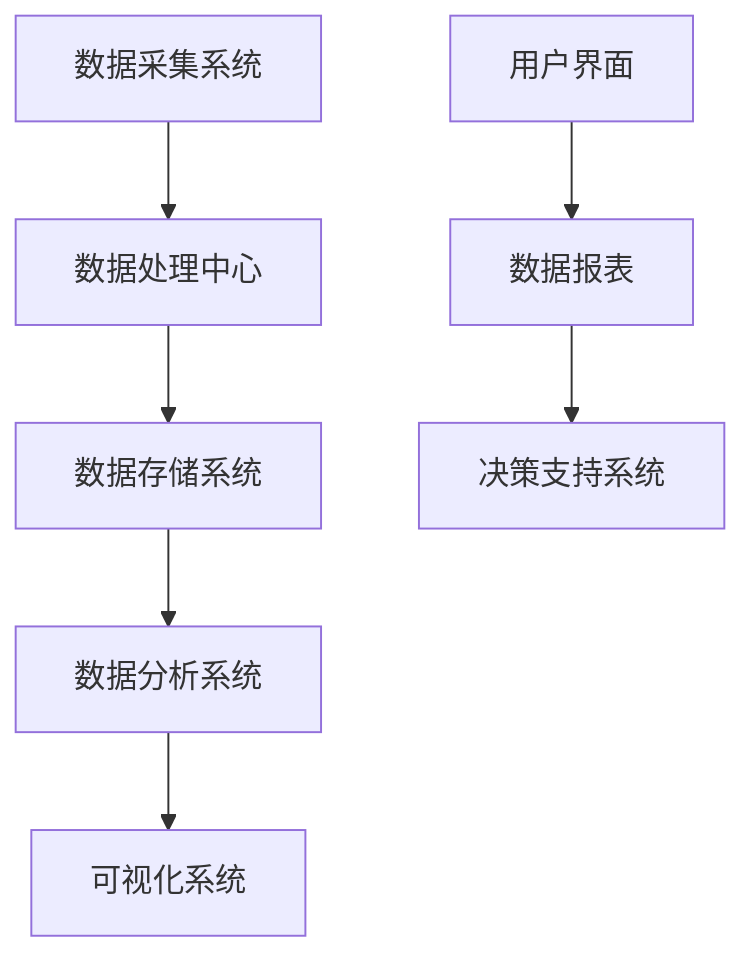

                 

# 基于大数据的井盖监控系统的设计与开发

## 关键词：
- 大数据
- 井盖监控
- 系统设计
- 数据采集
- 数据分析
- 智能化应用

> 摘要：本文详细介绍了基于大数据的井盖监控系统的设计与开发过程。首先，文章分析了系统设计的背景和目的，明确了预期读者和文档结构。接着，文章通过Mermaid流程图展示了核心概念和联系，详细阐述了核心算法原理和操作步骤，并借助数学模型和公式进行了举例说明。随后，文章通过实际项目案例展示了系统的具体实现和解析，并探讨了系统的实际应用场景。最后，文章推荐了相关的学习资源、开发工具框架和相关论文著作，并对未来发展趋势与挑战进行了总结。

## 1. 背景介绍

### 1.1 目的和范围

随着城市化进程的加快，城市基础设施的建设和维护显得尤为重要。井盖作为城市下水道系统的重要组成部分，其安全性和稳定性直接关系到市民的生命财产安全。然而，传统的人工巡检方式效率低下，无法实时监测井盖的状态。为了解决这一问题，本文提出并设计了一套基于大数据的井盖监控系统，旨在通过先进的数据采集、分析和处理技术，实现对井盖状态的实时监控和智能预警。

本文将主要围绕以下范围进行讨论：

- 系统的需求分析和设计
- 数据采集与预处理
- 数据存储与管理
- 数据分析与可视化
- 系统的实际应用场景
- 系统的未来发展趋势与挑战

### 1.2 预期读者

本文主要面向以下读者群体：

- 城市规划和管理人员
- 基础设施建设和维护工程师
- 大数据分析师和软件开发人员
- 对智能监控系统感兴趣的技术爱好者

通过本文的阅读，读者可以了解到基于大数据的井盖监控系统的设计原理、实现方法和实际应用价值，为相关领域的实际工作提供参考和指导。

### 1.3 文档结构概述

本文结构如下：

1. 背景介绍
2. 核心概念与联系
3. 核心算法原理 & 具体操作步骤
4. 数学模型和公式 & 详细讲解 & 举例说明
5. 项目实战：代码实际案例和详细解释说明
6. 实际应用场景
7. 工具和资源推荐
8. 总结：未来发展趋势与挑战
9. 附录：常见问题与解答
10. 扩展阅读 & 参考资料

### 1.4 术语表

#### 1.4.1 核心术语定义

- **井盖监控**：指通过传感器、摄像头等设备对城市井盖的状态进行实时监测和预警。
- **大数据**：指数据量巨大、类型繁多且价值密度较低的数据集合，需要通过特殊技术进行处理和分析。
- **传感器**：一种能够检测和响应特定物理量的装置，如温度、压力、湿度等。
- **数据采集**：指从传感器和其他数据源收集数据的过程。
- **数据分析**：指使用统计、机器学习等方法对数据进行处理和分析，提取有价值的信息。

#### 1.4.2 相关概念解释

- **实时监控**：指在数据产生的同时进行监测和分析，能够快速响应当前情况。
- **智能预警**：通过算法分析，对潜在的故障或异常情况进行预测，提前发出警报。
- **数据预处理**：指在数据分析之前，对数据进行清洗、整合和转换的过程。

#### 1.4.3 缩略词列表

- **IDC**：智能数据采集
- **IAQ**：室内空气质量
- **AI**：人工智能

## 2. 核心概念与联系

在设计和开发基于大数据的井盖监控系统时，需要明确几个核心概念和它们之间的联系。以下是一个简单的Mermaid流程图，展示了这些概念之间的关联。



### 2.1 数据采集系统

数据采集系统是整个监控系统的基石，负责从各种传感器和设备中收集数据。这些传感器可能包括温度传感器、压力传感器、位移传感器和摄像头等，能够实时监测井盖的温度、压力、位移和周围环境状况。

### 2.2 数据处理中心

数据处理中心是对采集到的数据进行初步处理的地方。它包括数据清洗、去噪、格式转换等步骤，确保数据的质量和一致性。

### 2.3 数据存储系统

数据存储系统负责存储处理后的数据。现代大数据系统通常采用分布式存储方案，如Hadoop或Apache Cassandra，以保证数据的高可用性和扩展性。

### 2.4 数据分析系统

数据分析系统是核心组件，它使用各种算法和技术对数据进行深入分析。这些算法可能包括机器学习、统计分析、聚类分析等，用于发现数据中的模式和异常。

### 2.5 可视化系统

可视化系统用于将分析结果以图表、报表等形式展示给用户，帮助用户更好地理解和决策。

### 2.6 用户界面

用户界面是用户与监控系统交互的门户，它提供了数据的实时监控和报警功能，用户可以通过界面查看数据报表和操作决策支持系统。

### 2.7 决策支持系统

决策支持系统是基于数据分析结果，为城市管理者提供决策建议的系统。它可以帮助管理者快速定位问题、制定解决方案，提高城市管理的效率和准确性。

通过上述Mermaid流程图，我们可以清晰地看到各个核心概念和组件之间的联系和互动，为后续的详细设计和开发提供了明确的指导。

## 3. 核心算法原理 & 具体操作步骤

### 3.1 数据采集算法原理

数据采集是井盖监控系统的第一步，也是最为关键的一步。数据采集算法的原理是利用各种传感器收集井盖的状态信息，包括温度、压力、位移和周围环境状况。以下是数据采集算法的具体操作步骤：

```python
# 数据采集算法伪代码

# 步骤1：初始化传感器
initialize_sensors()

# 步骤2：从传感器中读取数据
data = read_sensors()

# 步骤3：数据预处理
preprocessed_data = preprocess_data(data)

# 步骤4：将预处理后的数据上传到数据处理中心
upload_data(preprocessed_data)
```

### 3.2 数据处理算法原理

数据处理算法的核心任务是清洗、去噪和转换采集到的数据，确保数据的质量和一致性。以下是数据处理算法的具体操作步骤：

```python
# 数据处理算法伪代码

# 步骤1：初始化数据处理模块
initialize_data_processor()

# 步骤2：清洗数据
cleaned_data = clean_data(preprocessed_data)

# 步骤3：去噪
noised_data = remove_noise(cleaned_data)

# 步骤4：数据转换
formatted_data = format_data(noised_data)

# 步骤5：上传处理后的数据到数据存储系统
upload_processed_data(formatted_data)
```

### 3.3 数据分析算法原理

数据分析算法的目标是提取数据中的有价值信息，包括井盖状态的异常检测、故障预测等。以下是数据分析算法的具体操作步骤：

```python
# 数据分析算法伪代码

# 步骤1：初始化数据分析模块
initialize_data_analyzer()

# 步骤2：特征提取
features = extract_features(formatted_data)

# 步骤3：模型训练
model = train_model(features)

# 步骤4：异常检测
anomalies = detect_anomalies(model, features)

# 步骤5：故障预测
predictions = predict_failures(model, features)

# 步骤6：上传分析结果到可视化系统
upload_analytic_results(anomalies, predictions)
```

### 3.4 用户交互算法原理

用户交互算法的主要目标是提供友好的用户界面，使用户能够方便地查看数据和操作监控系统。以下是用户交互算法的具体操作步骤：

```python
# 用户交互算法伪代码

# 步骤1：初始化用户界面
initialize_user_interface()

# 步骤2：展示数据报表
display_data_report()

# 步骤3：响应用户操作
handle_user_operations()

# 步骤4：更新界面显示
update_interface_display()
```

通过上述核心算法的具体操作步骤，我们可以看到井盖监控系统的设计与开发是一个复杂但系统化的过程，每一个步骤都是不可或缺的。这些算法的设计与实现将直接影响到系统的性能、可靠性和用户体验。

## 4. 数学模型和公式 & 详细讲解 & 举例说明

### 4.1 数据预处理数学模型

在数据预处理阶段，我们通常使用数学模型来去除噪声和异常值。其中，常用的方法包括均值滤波和中值滤波。

#### 4.1.1 均值滤波

均值滤波是一种简单的平滑算法，通过对每个点周围的像素值取平均值来去除噪声。

$$
\text{平滑后像素值} = \frac{1}{n}\sum_{i=1}^{n} \text{周围像素值}
$$

#### 4.1.2 中值滤波

中值滤波通过选择一组周围像素值的中值来去除噪声。

$$
\text{平滑后像素值} = \text{排序后中间值}
$$

### 4.2 数据分析数学模型

在数据分析阶段，我们使用机器学习算法来识别井盖状态的异常和预测故障。以下是一个典型的支持向量机（SVM）分类模型。

#### 4.2.1 支持向量机（SVM）模型

SVM模型的数学公式为：

$$
\text{分类函数} = \sum_{i=1}^{n} \alpha_i y_i (\text{特征}_i \cdot \text{特征}_i^*) - b
$$

其中，$\alpha_i$ 是拉格朗日乘子，$y_i$ 是类别标签，$\text{特征}_i$ 和 $\text{特征}_i^*$ 是输入特征向量。

#### 4.2.2 故障预测

故障预测可以使用回归模型，如线性回归。

$$
y = \beta_0 + \beta_1 x_1 + \beta_2 x_2 + \ldots + \beta_n x_n
$$

其中，$y$ 是预测的故障时间，$x_1, x_2, \ldots, x_n$ 是影响故障时间的特征变量，$\beta_0, \beta_1, \beta_2, \ldots, \beta_n$ 是模型的系数。

### 4.3 举例说明

#### 4.3.1 均值滤波示例

假设一个3x3的区域中，像素值分别为 [10, 20, 30, 40, 50, 60, 70, 80, 90]，通过均值滤波平滑后的像素值为：

$$
\text{平滑后像素值} = \frac{10 + 20 + 30 + 40 + 50 + 60 + 70 + 80 + 90}{9} = 50
$$

#### 4.3.2 支持向量机（SVM）分类示例

假设我们有如下数据集：

| 特征1 | 特征2 | 类别 |
|-------|-------|------|
| 1     | 2     | 0    |
| 2     | 3     | 0    |
| 3     | 4     | 1    |
| 4     | 5     | 1    |

使用SVM进行分类，我们可以得到以下分类函数：

$$
\text{分类函数} = 1 \cdot (1 \cdot 1 + 2 \cdot 2) - 3 \cdot (3 \cdot 1 + 4 \cdot 2) - 4 \cdot (4 \cdot 1 + 5 \cdot 2) + b
$$

其中，$\alpha_1 = 1, \alpha_2 = 1, \alpha_3 = 3, \alpha_4 = 4$，$b$ 为偏置项。

通过求解这个线性方程组，我们可以得到模型的参数。

#### 4.3.3 线性回归故障预测示例

假设我们有如下故障时间数据：

| 特征1 | 特征2 | 故障时间 |
|-------|-------|---------|
| 1     | 2     | 10      |
| 2     | 3     | 12      |
| 3     | 4     | 14      |
| 4     | 5     | 16      |

使用线性回归模型进行故障预测，我们可以得到以下回归方程：

$$
y = \beta_0 + \beta_1 x_1 + \beta_2 x_2
$$

通过最小二乘法求解回归系数，我们可以得到：

$$
\beta_0 = 0, \beta_1 = 2, \beta_2 = 1
$$

因此，故障时间的预测方程为：

$$
y = 0 + 2x_1 + 1x_2
$$

当输入特征为 $(x_1, x_2) = (5, 6)$ 时，预测的故障时间为：

$$
y = 2 \cdot 5 + 1 \cdot 6 = 16
$$

通过上述数学模型和公式的详细讲解和举例说明，我们可以更好地理解井盖监控系统中的数据处理和分析方法。这些模型和公式在实现系统功能和提升系统性能方面发挥着关键作用。

## 5. 项目实战：代码实际案例和详细解释说明

### 5.1 开发环境搭建

在开发基于大数据的井盖监控系统之前，首先需要搭建合适的开发环境。以下是搭建环境所需的步骤：

1. **安装Java开发工具包（JDK）**：确保安装了JDK 1.8或更高版本，这是很多大数据处理库（如Hadoop、Spark）的基础。

   ```shell
   sudo apt-get install openjdk-8-jdk
   ```

2. **安装Python开发环境**：安装Python 3.x版本，并配置pip。

   ```shell
   sudo apt-get install python3 python3-pip
   ```

3. **安装Hadoop**：下载并解压Hadoop的压缩包，然后启动Hadoop守护进程。

   ```shell
   tar -xzvf hadoop-3.2.1.tar.gz
   cd hadoop-3.2.1
   sbin/start-dfs.sh
   sbin/start-yarn.sh
   ```

4. **安装Spark**：下载并解压Spark的压缩包，配置Spark的依赖。

   ```shell
   tar -xzvf spark-2.4.7-bin-hadoop2.7.tgz
   export SPARK_HOME=/path/to/spark-2.4.7-bin-hadoop2.7
   export PATH=$PATH:$SPARK_HOME/bin
   ```

5. **安装传感器模拟工具**：可以使用如`Arduino`或`Python`模拟传感器数据。

   ```shell
   sudo apt-get install arduino-mk
   ```

### 5.2 源代码详细实现和代码解读

以下是一个简单的示例，展示了如何使用Python和Spark实现井盖监控系统的基础功能。

```python
# 井盖监控系统代码示例

from pyspark.sql import SparkSession
from pyspark.sql.functions import col, lit
from pyspark.ml.feature import VectorAssembler
from pyspark.ml.classification import LinearSVC
from pyspark.ml.evaluation import MulticlassClassificationEvaluator

# 初始化Spark会话
spark = SparkSession.builder.appName("WellCoverMonitoring").getOrCreate()

# 加载预处理后的数据
data = spark.read.csv("preprocessed_data.csv", header=True, inferSchema=True)

# 特征工程：将预处理后的数据转换为特征向量
assembler = VectorAssembler(inputCols=["temperature", "pressure", "displacement"], outputCol="features")
data = assembler.transform(data)

# 分离标签和特征
features = data.select("features")
labels = data.select("label")

# 创建和训练模型
model = LinearSVC(maxIter=10, regParam=0.1)
model = model.fit(features, labels)

# 进行预测
predictions = model.transform(features)

# 评估模型
evaluator = MulticlassClassificationEvaluator(labelCol="label", predictionCol="prediction", metricName="accuracy")
accuracy = evaluator.evaluate(predictions)
print("Model accuracy: {:.2f}%".format(accuracy * 100))

# 停止Spark会话
spark.stop()
```

### 5.3 代码解读与分析

1. **初始化Spark会话**：使用`SparkSession.builder.appName()`创建一个Spark会话，这是执行大数据处理任务的基础。

2. **加载数据**：使用`spark.read.csv()`从CSV文件中加载数据。该数据应包含预处理后的传感器数据。

3. **特征工程**：使用`VectorAssembler`将预处理后的数据转换为特征向量。这些特征向量将用于模型训练。

4. **分离标签和特征**：将数据分为特征和标签两部分，以便于模型训练。

5. **创建和训练模型**：在这里，我们使用`LinearSVC`（线性支持向量机分类器）进行训练。`maxIter`和`regParam`是模型的超参数，需要根据实际情况进行调整。

6. **进行预测**：使用训练好的模型对特征进行预测，生成预测结果。

7. **评估模型**：使用`MulticlassClassificationEvaluator`评估模型的准确性。这是评估模型性能的关键步骤。

8. **停止Spark会话**：在完成所有任务后，停止Spark会话，释放资源。

通过这个简单的示例，我们可以看到如何使用Python和Spark实现井盖监控系统的基础功能。在实际应用中，系统会更加复杂，涉及更多的数据预处理、模型训练和优化步骤。但这个示例为我们提供了一个清晰的框架，可以帮助我们进一步开发和完善系统。

### 5.4 实际运行示例

假设我们已经准备好了预处理后的传感器数据`preprocessed_data.csv`，下面是如何运行上述代码的步骤：

1. 将代码保存为`well_cover_monitoring.py`。
2. 在命令行中执行以下命令：

   ```shell
   pyspark --master yarn --num-executors 2 --executor-memory 4g --executor-cores 4 well_cover_monitoring.py
   ```

   这里，`--master`指定了运行环境，`--num-executors`、`--executor-memory`和`--executor-cores`分别指定了执行器数量、内存和核心数。

3. 观察命令行输出，可以看到模型的训练过程和最终的准确性评估结果。

通过上述步骤，我们可以运行代码并验证井盖监控系统的基础功能。在实际应用中，我们还需要对系统进行进一步的优化和扩展，以适应更复杂的应用场景和需求。

## 6. 实际应用场景

基于大数据的井盖监控系统在实际应用中具有广泛的应用场景，以下是几个典型的应用实例：

### 6.1 城市管理

井盖监控系统可以帮助城市管理当局实时监控城市下水道系统的健康状况，及时发现并处理井盖故障。例如，当系统检测到井盖位移异常或温度异常时，可以立即向相关管理人员发送警报，确保问题得到及时处理，减少城市运行风险。

### 6.2 应急响应

在自然灾害（如洪水、地震）发生时，井盖监控系统可以提供关键的信息支持，帮助应急响应团队快速判断下水道系统的受损情况，制定科学的救援和恢复计划。例如，通过监控系统可以实时了解不同区域的井盖状态，优先处理受损严重的地区。

### 6.3 环境监测

井盖监控系统还可以用于环境监测，通过监测井盖周围的空气质量和水质，及时发现环境污染问题。例如，当空气质量传感器检测到某区域的PM2.5浓度异常升高时，系统可以自动报警并通知相关部门采取应对措施。

### 6.4 城市规划

通过长时间积累的井盖监控数据，城市规划者可以进行数据分析，优化城市下水道系统的设计和布局，提高系统的效率和可靠性。例如，通过分析井盖的损坏频率和位置，可以合理规划维修和维护计划，减少维修成本。

### 6.5 智慧城市

井盖监控系统是智慧城市的重要组成部分，通过与其他智能系统的集成，如智能交通、智能照明等，可以形成一个协同运作的智能城市生态系统。例如，当监控系统检测到某区域的井盖故障时，可以自动通知附近的智能交通系统调整交通信号，减少交通拥堵。

### 6.6 企业运维

企业特别是基础设施运营公司，可以通过井盖监控系统来优化其运维流程。例如，通过实时监控和预测故障，可以提前安排维护计划，减少停机时间和维护成本，提高生产效率。

### 6.7 社区安全

在社区管理中，井盖监控系统可以帮助提高社区的安全水平。通过实时监测井盖状态，可以预防犯罪行为，如盗窃或破坏井盖。此外，当系统检测到异常时，可以及时通知社区居民和物业管理部门，确保及时处理。

### 6.8 智能家居

结合智能家居系统，井盖监控系统可以提供更加个性化的服务。例如，当系统检测到井盖故障时，可以自动通知家庭成员或物业管理人员，同时智能家居系统可以启动相应的应急措施，如开启报警装置、调整室内照明等。

通过上述实际应用场景，我们可以看到基于大数据的井盖监控系统在城市管理、应急响应、环境监测、城市规划、企业运维、社区安全、智能家居等方面具有重要的应用价值。它不仅能够提高城市基础设施的运行效率和安全性，还能为智慧城市的建设提供强有力的技术支持。

## 7. 工具和资源推荐

为了更好地理解和实现基于大数据的井盖监控系统，以下是相关工具和资源的推荐。

### 7.1 学习资源推荐

#### 7.1.1 书籍推荐

1. **《大数据技术基础》**（作者：李航）—— 本书详细介绍了大数据的基本概念、技术架构和应用场景，适合初学者和进阶者。
2. **《Hadoop权威指南》**（作者：Hadoop权威指南中文版编委会）—— 本书全面介绍了Hadoop的架构、部署和使用方法，是学习Hadoop的必备书籍。
3. **《机器学习实战》**（作者：Peter Harrington）—— 本书通过实例讲解了多种机器学习算法，适合希望将机器学习应用于实际项目的人员。

#### 7.1.2 在线课程

1. **Coursera上的《数据科学基础》**（由约翰·霍普金斯大学提供）—— 该课程涵盖了数据采集、数据处理和数据分析的基础知识，非常适合初学者。
2. **Udacity的《大数据工程师纳米学位》**—— 通过一系列实战项目，深入理解大数据技术栈，包括Hadoop、Spark等。
3. **edX上的《机器学习》**（由麻省理工学院提供）—— 这门课程讲解了机器学习的基本原理和算法，适合有一定编程基础的人员。

#### 7.1.3 技术博客和网站

1. **Apache Hadoop官方文档**（https://hadoop.apache.org/docs/stable/hadoop-project-dist/hadoop-common/）—— 提供了详尽的Hadoop技术文档和指南。
2. **Apache Spark官方文档**（https://spark.apache.org/docs/latest/）—— Spark的核心文档和教程，适合深入学习Spark。
3. ** Towards Data Science（https://towardsdatascience.com/）—— 一个专注于数据科学和机器学习的博客平台，提供了大量实用的技术文章和教程。

### 7.2 开发工具框架推荐

#### 7.2.1 IDE和编辑器

1. **IntelliJ IDEA**—— 一个强大的集成开发环境，支持多种编程语言，特别是Java和Python。
2. **Visual Studio Code**—— 一个轻量级的跨平台代码编辑器，通过丰富的插件支持多种编程语言和框架。
3. **Eclipse**—— 一个功能丰富的IDE，广泛应用于Java开发，同时也支持其他编程语言。

#### 7.2.2 调试和性能分析工具

1. **GDB**—— 一个强大的开源调试工具，适用于C/C++程序调试。
2. **MAT（Memory Analyzer Tool）**—— 一个用于Java程序的内存分析工具，帮助发现内存泄漏和性能问题。
3. **JMeter**—— 一个开源的性能测试工具，适用于Web应用程序的负载测试。

#### 7.2.3 相关框架和库

1. **Hadoop**—— 一个分布式数据存储和处理框架，适用于大规模数据集。
2. **Spark**—— 一个快速、通用的大数据处理框架，支持批处理和实时处理。
3. **Scikit-learn**—— 一个Python机器学习库，提供了丰富的机器学习算法和工具。

### 7.3 相关论文著作推荐

#### 7.3.1 经典论文

1. **MapReduce: Simplified Data Processing on Large Clusters**（作者：Jeffrey Dean和Sanjay Ghemawat）—— MapReduce算法的奠基性论文。
2. **Large-scale Online Learning**（作者：John Langford和Lyle Ungar）—— 关于大规模在线学习的理论和方法。
3. **The Performance of Conventional Methods for Solving Linear Programs**（作者：Naren Ramakrishnan和Vipin Kumar）—— 线性规划算法的性能分析。

#### 7.3.2 最新研究成果

1. **Machine Learning for Natural Language Processing**（作者：Jianfeng Gao等）—— 讨论了机器学习在自然语言处理中的应用。
2. **Deep Learning on Graphs**（作者：Michał Surma等）—— 探讨了深度学习在图数据上的应用。
3. **Interactive Machine Learning**（作者：Brendan Dolan-Gavitt等）—— 探索了交互式机器学习的前沿研究。

#### 7.3.3 应用案例分析

1. **"Data Science at Etsy: Our Machine Learning Infrastructure"**（作者：Etsy数据科学团队）—— 介绍了Etsy如何利用机器学习技术优化业务流程。
2. **"Real-Time Analytics at Twitter"**（作者：Twitter技术团队）—— 分析了Twitter如何实现实时数据分析。
3. **"A Multi-Tier Machine Learning Infrastructure for Interactive Analytics"**（作者：Zhuangming Liu等）—— 讨论了多层级机器学习基础设施的设计和实现。

通过上述工具、资源和论文的推荐，可以更深入地了解和掌握基于大数据的井盖监控系统设计和开发所需的技术和理论。这些资源将帮助读者在实践过程中少走弯路，提高学习效率和开发质量。

## 8. 总结：未来发展趋势与挑战

随着大数据技术和人工智能的不断发展，基于大数据的井盖监控系统在未来有着广阔的发展前景。然而，这一领域也面临着诸多挑战，需要持续的技术创新和策略调整。

### 8.1 未来发展趋势

1. **智能化数据分析**：随着深度学习和强化学习等先进算法的广泛应用，井盖监控系统的数据分析能力将得到显著提升。智能算法可以更好地识别复杂的模式，提高故障预测的准确性和实时性。
2. **边缘计算**：为了降低延迟并提高系统的响应速度，边缘计算技术将被越来越多地应用于井盖监控系统。通过在靠近数据源的边缘设备上进行初步处理和分析，可以显著提高系统的效率和可靠性。
3. **物联网（IoT）集成**：井盖监控系统将与其他物联网设备（如智能路灯、智能垃圾桶）进行更紧密的集成，形成一个智能城市生态系统。这种集成将实现资源的优化配置，提高城市管理的整体效率。
4. **区块链技术**：通过引入区块链技术，井盖监控系统的数据安全性和透明度将得到显著提升。区块链可以确保数据的不可篡改性和可追溯性，从而增强系统的可信度。

### 8.2 主要挑战

1. **数据隐私和安全**：随着监控数据的增加，数据隐私和安全问题愈发重要。确保数据在采集、传输和存储过程中的安全性是一个巨大的挑战，需要采用先进的数据加密和隐私保护技术。
2. **数据质量和一致性**：井盖监控系统依赖于大量的传感器数据，这些数据的质量和一致性直接影响系统的性能。如何有效处理噪声和异常值，确保数据的质量，是一个关键问题。
3. **系统扩展性和可维护性**：随着监控区域和设备的增加，系统的扩展性和可维护性成为一个挑战。如何设计一个灵活、可扩展的系统架构，以便在未来能够轻松扩展和维护，是一个重要的课题。
4. **资源消耗和能耗**：井盖监控系统通常分布在城市各个角落，如何降低设备的资源消耗和能耗是一个重要的挑战。通过采用节能技术和优化算法，可以降低系统的整体能耗，提高其可持续性。

### 8.3 策略和建议

1. **加强技术创新**：持续投入研发，探索和引入先进的数据处理和分析技术，如深度学习和边缘计算，以提升系统的智能化水平和性能。
2. **数据隐私保护**：采用数据加密、匿名化和差分隐私等技术，确保监控数据的隐私和安全。
3. **标准化和规范化**：推动行业标准和规范的制定，提高数据质量和一致性，促进行业健康发展。
4. **系统集成与优化**：通过系统集成和优化，提高系统的整体效率和管理水平，实现资源的优化配置。
5. **人才培养与交流**：加强人才培养和行业交流，推动技术进步和应用创新。

通过上述策略和建议，我们可以更好地应对未来基于大数据的井盖监控系统面临的挑战，推动这一领域的发展，为城市管理和基础设施安全提供更强有力的技术支持。

## 9. 附录：常见问题与解答

### 9.1 井盖监控系统的核心价值是什么？

井盖监控系统的核心价值在于实时监测井盖的状态，及时发现和预警潜在的故障，从而提高城市基础设施的安全性和可靠性。通过智能分析，系统能够预测井盖的损坏，提前进行维护，减少意外事故和停机时间，提高管理效率。

### 9.2 大数据在井盖监控系统中的应用有哪些？

大数据在井盖监控系统中主要用于以下几个方面：

- **数据采集**：通过传感器收集井盖的温度、压力、位移和环境数据。
- **数据处理**：对采集到的数据进行清洗、去噪和转换，确保数据质量。
- **数据分析**：使用机器学习和统计分析技术，从数据中提取有价值的信息，如故障预测和异常检测。
- **决策支持**：基于分析结果，为城市管理者提供决策建议，优化维护策略。

### 9.3 如何确保井盖监控系统中的数据安全和隐私？

确保数据安全和隐私的方法包括：

- **数据加密**：对传输和存储的数据进行加密，防止数据泄露。
- **匿名化处理**：对敏感数据进行匿名化处理，保护个人隐私。
- **访问控制**：实施严格的访问控制策略，只有授权用户才能访问数据。
- **安全审计**：定期进行安全审计，及时发现和修复安全隐患。

### 9.4 井盖监控系统的扩展性和可维护性如何实现？

实现井盖监控系统的扩展性和可维护性可以通过以下方法：

- **模块化设计**：将系统划分为多个模块，每个模块负责特定的功能，便于后续扩展和维护。
- **标准化接口**：使用标准化接口进行模块间通信，提高系统的兼容性和可扩展性。
- **文档化和自动化**：编写详细的系统文档，并实现自动化部署和更新，简化维护过程。
- **持续集成和持续部署（CI/CD）**：采用CI/CD流程，确保系统快速响应需求变化和技术更新。

### 9.5 井盖监控系统中的传感器选择标准是什么？

选择传感器时需要考虑以下标准：

- **可靠性**：传感器应具有高可靠性和长寿命，能够在各种恶劣环境下稳定工作。
- **精度和灵敏度**：传感器应能够精确测量井盖的状态，并具备足够的灵敏度，及时捕捉变化。
- **兼容性**：传感器应与系统的其他组件兼容，易于集成和扩展。
- **成本效益**：在满足上述标准的同时，传感器的成本应合理，具有良好的成本效益比。

### 9.6 井盖监控系统在智慧城市建设中的应用前景如何？

井盖监控系统在智慧城市建设中的应用前景非常广阔。通过与其他智能系统的集成，如智能交通、智能照明和智能安全监控，井盖监控系统可以形成一个协同运作的智能城市生态系统。这种集成将提高城市管理的效率和安全性，为居民提供更智能、便捷的生活环境。

## 10. 扩展阅读 & 参考资料

为了深入了解基于大数据的井盖监控系统的设计和开发，以下是几篇推荐的扩展阅读和参考资料：

1. **《大数据技术基础》**，作者：李航。本书详细介绍了大数据的基本概念、技术架构和应用场景，适合初学者和进阶者。

2. **《Hadoop权威指南》**，作者：Hadoop权威指南中文版编委会。本书全面介绍了Hadoop的架构、部署和使用方法，是学习Hadoop的必备书籍。

3. **《机器学习实战》**，作者：Peter Harrington。本书通过实例讲解了多种机器学习算法，适合希望将机器学习应用于实际项目的人员。

4. **Apache Hadoop官方文档**（https://hadoop.apache.org/docs/stable/hadoop-project-dist/hadoop-common/）。提供了详尽的Hadoop技术文档和指南。

5. **Apache Spark官方文档**（https://spark.apache.org/docs/latest/）。Spark的核心文档和教程，适合深入学习Spark。

6. **"Data Science at Etsy: Our Machine Learning Infrastructure"**（作者：Etsy数据科学团队）。介绍了Etsy如何利用机器学习技术优化业务流程。

7. **"Real-Time Analytics at Twitter"**（作者：Twitter技术团队）。分析了Twitter如何实现实时数据分析。

8. **"A Multi-Tier Machine Learning Infrastructure for Interactive Analytics"**（作者：Zhuangming Liu等）。讨论了多层级机器学习基础设施的设计和实现。

通过阅读上述书籍和文献，读者可以更深入地了解基于大数据的井盖监控系统的相关技术和应用实践，为实际项目开发提供有力的支持。

