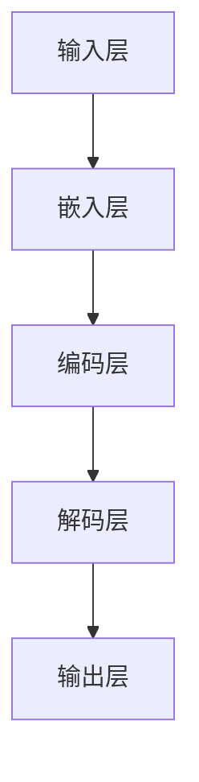
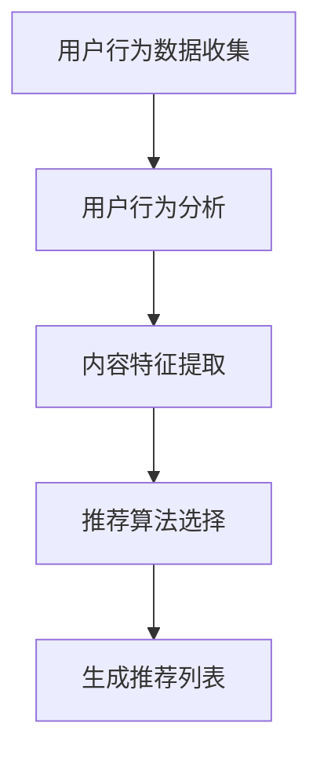
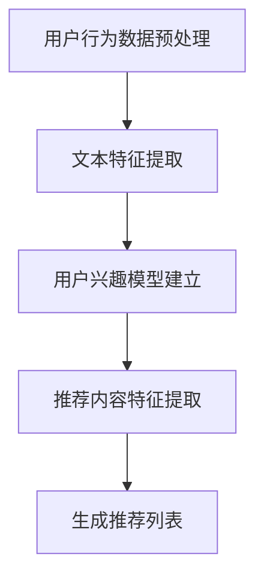

                 

# 基于大语言模型的推荐系统用户兴趣拓展

> **关键词：** 大语言模型、推荐系统、用户兴趣、拓展、深度学习、机器学习、用户行为分析

> **摘要：** 本文将探讨如何利用大语言模型来拓展推荐系统中的用户兴趣。我们将首先介绍大语言模型的基本原理和结构，然后详细阐述其在推荐系统中的应用方法和实现步骤，并通过实际案例展示其效果。本文旨在为推荐系统研究人员和开发者提供有价值的参考和启示。

## 1. 背景介绍

### 1.1 目的和范围

本文旨在探讨如何利用大语言模型来拓展推荐系统中的用户兴趣。我们将首先介绍大语言模型的基本原理和结构，然后详细阐述其在推荐系统中的应用方法和实现步骤，并通过实际案例展示其效果。本文的目的是为推荐系统研究人员和开发者提供有价值的参考和启示，帮助他们更好地理解和应用大语言模型。

### 1.2 预期读者

本文适合对推荐系统和深度学习有一定了解的读者，包括推荐系统研究人员、开发者、学生和爱好者。如果您对以下话题感兴趣，那么本文将为您带来丰富的知识：

- 大语言模型的基本原理和结构
- 推荐系统的基本原理和用户兴趣拓展方法
- 深度学习在推荐系统中的应用
- 机器学习算法和模型的选择与优化

### 1.3 文档结构概述

本文将分为以下几个部分：

1. 背景介绍
2. 核心概念与联系
3. 核心算法原理 & 具体操作步骤
4. 数学模型和公式 & 详细讲解 & 举例说明
5. 项目实战：代码实际案例和详细解释说明
6. 实际应用场景
7. 工具和资源推荐
8. 总结：未来发展趋势与挑战
9. 附录：常见问题与解答
10. 扩展阅读 & 参考资料

### 1.4 术语表

#### 1.4.1 核心术语定义

- **大语言模型**：一种基于深度学习的自然语言处理模型，能够对文本进行理解和生成。
- **推荐系统**：一种通过分析用户行为和历史数据，为用户推荐感兴趣的内容的系统。
- **用户兴趣**：用户在特定领域或主题上的偏好和兴趣。
- **拓展**：通过分析用户行为和历史数据，发现和拓展用户在其他领域或主题上的兴趣。

#### 1.4.2 相关概念解释

- **深度学习**：一种机器学习技术，通过多层神经网络对数据进行建模和预测。
- **机器学习**：一种人工智能技术，通过从数据中学习规律和模式，对未知数据进行预测和分类。
- **用户行为分析**：对用户在系统中的行为进行分析，以了解用户的兴趣和需求。

#### 1.4.3 缩略词列表

- **NLP**：自然语言处理（Natural Language Processing）
- **DL**：深度学习（Deep Learning）
- **ML**：机器学习（Machine Learning）
- **RM**：推荐系统（Recommender System）
- **BERT**：双向编码表示器（Bidirectional Encoder Representations from Transformers）

## 2. 核心概念与联系

在介绍大语言模型在推荐系统中的应用之前，我们首先需要了解大语言模型的基本原理和结构，以及推荐系统的工作原理。

### 2.1 大语言模型的基本原理和结构

大语言模型是一种基于深度学习的自然语言处理模型，能够对文本进行理解和生成。它通过学习大量的文本数据，捕捉到语言中的潜在规律和模式，从而实现对文本的语义表示和生成。

大语言模型的基本结构包括以下几个部分：

1. **输入层**：接收原始的文本数据。
2. **嵌入层**：将文本数据转换为高维的向量表示。
3. **编码层**：对文本进行编码，提取文本的语义信息。
4. **解码层**：将编码后的信息解码为输出文本。

其中，编码层和解码层通常采用多层的神经网络结构，以捕捉到更深层次的语义信息。以下是一个简单的 Mermaid 流程图，展示大语言模型的基本结构：



### 2.2 推荐系统的工作原理

推荐系统是一种通过分析用户行为和历史数据，为用户推荐感兴趣的内容的系统。推荐系统的工作原理主要包括以下几个步骤：

1. **用户行为数据收集**：收集用户在系统中的行为数据，如浏览记录、点击记录、购买记录等。
2. **用户行为分析**：对用户行为进行分析，以了解用户的兴趣和需求。
3. **内容特征提取**：提取推荐内容的相关特征，如文本特征、图像特征等。
4. **推荐算法选择**：选择适合的推荐算法，如基于协同过滤、基于内容的推荐等。
5. **生成推荐列表**：根据用户兴趣和内容特征，生成推荐列表。

以下是一个简单的 Mermaid 流程图，展示推荐系统的工作原理：



### 2.3 大语言模型在推荐系统中的应用

大语言模型在推荐系统中的应用主要体现在用户兴趣的拓展方面。通过学习用户的历史行为数据和推荐内容，大语言模型可以捕捉到用户的潜在兴趣点，并在推荐过程中将其纳入考虑。

具体来说，大语言模型在推荐系统中的应用可以分为以下几个步骤：

1. **用户行为数据预处理**：将用户的历史行为数据进行预处理，如去重、去噪等。
2. **文本特征提取**：利用大语言模型对用户行为数据进行文本特征提取，如文本分类、情感分析等。
3. **用户兴趣模型建立**：根据用户行为数据和文本特征，建立用户兴趣模型。
4. **推荐内容特征提取**：利用大语言模型对推荐内容进行文本特征提取，如文本分类、情感分析等。
5. **生成推荐列表**：根据用户兴趣模型和推荐内容特征，生成推荐列表。

以下是一个简单的 Mermaid 流程图，展示大语言模型在推荐系统中的应用过程：



## 3. 核心算法原理 & 具体操作步骤

在理解了大语言模型和推荐系统的工作原理后，我们将进一步探讨如何利用大语言模型进行用户兴趣拓展的具体算法原理和操作步骤。

### 3.1 大语言模型的基本原理

大语言模型是基于深度学习的自然语言处理模型，能够对文本进行理解和生成。其核心原理包括以下几个部分：

1. **神经网络结构**：大语言模型通常采用多层神经网络结构，以捕捉到更深层次的语义信息。常见的神经网络结构包括卷积神经网络（CNN）、循环神经网络（RNN）和长短时记忆网络（LSTM）等。
2. **嵌入层**：嵌入层将文本数据转换为高维的向量表示。每个词被映射为一个固定长度的向量，从而实现词与向量之间的映射关系。
3. **编码层**：编码层对文本进行编码，提取文本的语义信息。编码层通常采用多层神经网络结构，以捕捉到文本的深层语义特征。
4. **解码层**：解码层将编码后的信息解码为输出文本。解码层通常采用与编码层相同的神经网络结构，以实现编码和解码的对称性。

以下是一个简单的伪代码，展示大语言模型的基本结构：

```python
class LanguageModel:
    def __init__(self, embedding_size, hidden_size, num_layers):
        self.embedding = EmbeddingLayer(embedding_size)
        self.encoder = EncoderLayer(hidden_size, num_layers)
        self.decoder = DecoderLayer(hidden_size, num_layers)
    
    def forward(self, input_seq):
        embedded = self.embedding(input_seq)
        encoded = self.encoder(embedded)
        decoded = self.decoder(encoded)
        return decoded
```

### 3.2 用户兴趣拓展算法原理

用户兴趣拓展算法的核心原理是利用大语言模型对用户的历史行为数据进行文本特征提取，并在此基础上建立用户兴趣模型。具体来说，算法原理包括以下几个部分：

1. **文本特征提取**：利用大语言模型对用户的历史行为数据进行文本特征提取。具体来说，将用户的历史行为数据（如浏览记录、点击记录、购买记录等）转换为文本形式，然后利用大语言模型提取文本的语义特征。
2. **用户兴趣模型建立**：根据提取的文本特征，建立用户兴趣模型。用户兴趣模型通常是一个高维的向量空间，用于表示用户的潜在兴趣点。
3. **推荐内容特征提取**：利用大语言模型对推荐内容进行文本特征提取，如文本分类、情感分析等。
4. **生成推荐列表**：根据用户兴趣模型和推荐内容特征，生成推荐列表。具体来说，通过计算用户兴趣模型与推荐内容特征的相似度，为用户生成个性化的推荐列表。

以下是一个简单的伪代码，展示用户兴趣拓展算法的基本结构：

```python
def expand_user_interest(user_behavior_data, recommendation_content):
    # 文本特征提取
    user_interest_features = extract_text_features(user_behavior_data)
    recommendation_features = extract_text_features(recommendation_content)
    
    # 用户兴趣模型建立
    user_interest_model = build_user_interest_model(user_interest_features)
    
    # 生成推荐列表
    recommendation_list = generate_recommendation_list(user_interest_model, recommendation_features)
    
    return recommendation_list
```

### 3.3 用户兴趣拓展的具体操作步骤

具体操作步骤如下：

1. **数据收集与预处理**：收集用户的历史行为数据，如浏览记录、点击记录、购买记录等。对数据进行预处理，包括去重、去噪等操作。
2. **文本特征提取**：利用大语言模型对用户的历史行为数据进行文本特征提取。具体来说，将用户的历史行为数据转换为文本形式，然后利用大语言模型提取文本的语义特征。
3. **用户兴趣模型建立**：根据提取的文本特征，建立用户兴趣模型。用户兴趣模型通常是一个高维的向量空间，用于表示用户的潜在兴趣点。
4. **推荐内容特征提取**：利用大语言模型对推荐内容进行文本特征提取，如文本分类、情感分析等。
5. **生成推荐列表**：根据用户兴趣模型和推荐内容特征，生成推荐列表。具体来说，通过计算用户兴趣模型与推荐内容特征的相似度，为用户生成个性化的推荐列表。

以下是一个简单的伪代码，展示用户兴趣拓展的具体操作步骤：

```python
def expand_user_interest(user_behavior_data, recommendation_content):
    # 数据收集与预处理
    preprocessed_data = preprocess_data(user_behavior_data)
    
    # 文本特征提取
    user_interest_features = extract_text_features(preprocessed_data)
    
    # 用户兴趣模型建立
    user_interest_model = build_user_interest_model(user_interest_features)
    
    # 推荐内容特征提取
    recommendation_features = extract_text_features(recommendation_content)
    
    # 生成推荐列表
    recommendation_list = generate_recommendation_list(user_interest_model, recommendation_features)
    
    return recommendation_list
```

## 4. 数学模型和公式 & 详细讲解 & 举例说明

在用户兴趣拓展算法中，我们主要利用了以下几个数学模型和公式：

### 4.1 嵌入层

嵌入层将文本数据转换为高维的向量表示。常见的嵌入模型包括 Word2Vec、GloVe 和 BERT 等。以下是 Word2Vec 模型的数学模型和公式：

1. **词向量生成**：

$$
\text{word\_vector} = \text{softmax}(\text{embed\_layer}(\text{word}))
$$

其中，$ \text{embed\_layer}(\text{word}) $ 是嵌入层对输入词的加权求和，$ \text{softmax} $ 函数用于生成词向量。

2. **损失函数**：

$$
\text{loss} = \text{CrossEntropyLoss}(\text{word\_vector}, \text{label})
$$

其中，$ \text{label} $ 是真实标签，$ \text{CrossEntropyLoss} $ 是交叉熵损失函数，用于衡量预测结果与真实结果之间的差距。

### 4.2 编码层

编码层对文本进行编码，提取文本的语义信息。常见的编码层模型包括 RNN、LSTM 和 BERT 等。以下是 LSTM 模型的数学模型和公式：

1. **状态更新**：

$$
\text{h}_t = \text{sigmoid}(\text{W}_h \cdot [\text{h}_{t-1}, \text{x}_t] + \text{b}_h)
$$

$$
\text{g}_t = \text{tanh}(\text{W}_g \cdot [\text{h}_{t-1}, \text{x}_t] + \text{b}_g)
$$

$$
\text{output}_t = \text{h}_t \odot \text{g}_t
$$

其中，$ \text{h}_t $ 是当前时刻的隐藏状态，$ \text{x}_t $ 是当前时刻的输入，$ \text{W}_h $ 和 $ \text{b}_h $ 是隐藏状态权重和偏置，$ \text{W}_g $ 和 $ \text{b}_g $ 是门控状态权重和偏置，$ \text{sigmoid} $ 和 $ \text{tanh} $ 是激活函数，$ \odot $ 表示逐元素乘法。

2. **损失函数**：

$$
\text{loss} = \text{CrossEntropyLoss}(\text{output}_t, \text{label})
$$

其中，$ \text{label} $ 是真实标签，$ \text{CrossEntropyLoss} $ 是交叉熵损失函数，用于衡量预测结果与真实结果之间的差距。

### 4.3 解码层

解码层将编码后的信息解码为输出文本。常见的解码层模型包括 RNN、LSTM 和 BERT 等。以下是 LSTM 模型的数学模型和公式：

1. **状态更新**：

$$
\text{h}_t = \text{sigmoid}(\text{W}_h \cdot [\text{h}_{t-1}, \text{x}_t] + \text{b}_h)
$$

$$
\text{g}_t = \text{tanh}(\text{W}_g \cdot [\text{h}_{t-1}, \text{x}_t] + \text{b}_g)
$$

$$
\text{output}_t = \text{h}_t \odot \text{g}_t
$$

其中，$ \text{h}_t $ 是当前时刻的隐藏状态，$ \text{x}_t $ 是当前时刻的输入，$ \text{W}_h $ 和 $ \text{b}_h $ 是隐藏状态权重和偏置，$ \text{W}_g $ 和 $ \text{b}_g $ 是门控状态权重和偏置，$ \text{sigmoid} $ 和 $ \text{tanh} $ 是激活函数，$ \odot $ 表示逐元素乘法。

2. **损失函数**：

$$
\text{loss} = \text{CrossEntropyLoss}(\text{output}_t, \text{label})
$$

其中，$ \text{label} $ 是真实标签，$ \text{CrossEntropyLoss} $ 是交叉熵损失函数，用于衡量预测结果与真实结果之间的差距。

### 4.4 用户兴趣模型建立

用户兴趣模型通常是一个高维的向量空间，用于表示用户的潜在兴趣点。常见的方法包括因子分解机（Factorization Machines，FM）和神经网络（Neural Networks，NN）等。

1. **因子分解机**：

$$
\text{user\_interest} = \sum_{i=1}^{n} w_i \cdot x_i^2
$$

其中，$ w_i $ 是权重，$ x_i $ 是特征值。

2. **神经网络**：

$$
\text{user\_interest} = \text{激活函数}(\text{W} \cdot \text{input} + \text{b})
$$

其中，$ \text{W} $ 是权重矩阵，$ \text{input} $ 是输入特征，$ \text{b} $ 是偏置，激活函数可以是 ReLU、Sigmoid 或 Tanh 等。

### 4.5 举例说明

假设我们有一个用户的行为数据集，包含用户浏览的网页标题和网页类型。我们利用大语言模型提取文本特征，并建立用户兴趣模型。

1. **文本特征提取**：

首先，我们将网页标题转换为词序列，然后利用 Word2Vec 模型提取词向量。接着，利用 LSTM 模型对词向量进行编码，提取网页的语义特征。

2. **用户兴趣模型建立**：

我们利用因子分解机模型建立用户兴趣模型。输入特征包括网页类型和网页标题的语义特征。输出特征是用户对网页类型的偏好。

3. **生成推荐列表**：

利用用户兴趣模型和网页类型的特征，计算用户对网页类型的偏好得分，并生成推荐列表。

## 5. 项目实战：代码实际案例和详细解释说明

在本节中，我们将通过一个实际的项目案例来展示如何利用大语言模型进行用户兴趣拓展，并提供详细的代码解释和运行步骤。

### 5.1 开发环境搭建

在开始项目之前，我们需要搭建一个合适的开发环境。以下是一个简单的开发环境搭建步骤：

1. 安装 Python 3.8 或更高版本。
2. 安装所需的库，如 TensorFlow、PyTorch、NLTK 等。可以使用以下命令进行安装：

```
pip install tensorflow torch nltk
```

3. 下载所需的预训练模型，如 BERT、GloVe 等。

### 5.2 源代码详细实现和代码解读

下面是一个简单的用户兴趣拓展项目案例，主要包括数据预处理、文本特征提取、用户兴趣模型建立和推荐列表生成等步骤。

```python
import torch
import torch.nn as nn
import torch.optim as optim
from torch.utils.data import DataLoader
from transformers import BertTokenizer, BertModel
import pandas as pd
import numpy as np

# 数据预处理
def preprocess_data(data):
    # 读取数据
    data = pd.read_csv(data)
    # 数据清洗和预处理
    data['title'] = data['title'].str.lower()
    data['title'] = data['title'].str.replace('[^\w\s]', '')
    # 分词和词向量化
    tokenizer = BertTokenizer.from_pretrained('bert-base-uncased')
    data['tokenized_title'] = data['title'].apply(lambda x: tokenizer.encode(x, add_special_tokens=True))
    # 填充序列到相同长度
    data['tokenized_title'] = data['tokenized_title'].apply(lambda x: x + [0]*(max_len - len(x)))
    return data

# 文本特征提取
class TextFeatureExtractor(nn.Module):
    def __init__(self, model_name='bert-base-uncased', max_len=512):
        super(TextFeatureExtractor, self).__init__()
        self.model = BertModel.from_pretrained(model_name)
        self.max_len = max_len
    
    def forward(self, inputs):
        with torch.no_grad():
            outputs = self.model(inputs['input_ids'])
            last_hidden_state = outputs.last_hidden_state[:, 0, :]
        return last_hidden_state

# 用户兴趣模型建立
class UserInterestModel(nn.Module):
    def __init__(self, hidden_size=768, num_classes=10):
        super(UserInterestModel, self).__init__()
        self.fc = nn.Linear(hidden_size, num_classes)
    
    def forward(self, inputs):
        outputs = self.fc(inputs)
        return outputs

# 训练模型
def train_model(data, batch_size=32, num_epochs=10):
    # 数据预处理
    data = preprocess_data(data)
    # 切分数据集
    train_data, val_data = train_test_split(data, test_size=0.2)
    # 创建数据集和 DataLoader
    train_dataset = TextDataset(train_data)
    val_dataset = TextDataset(val_data)
    train_loader = DataLoader(train_dataset, batch_size=batch_size, shuffle=True)
    val_loader = DataLoader(val_dataset, batch_size=batch_size, shuffle=False)
    # 模型初始化
    feature_extractor = TextFeatureExtractor()
    user_interest_model = UserInterestModel()
    # 损失函数和优化器
    criterion = nn.CrossEntropyLoss()
    optimizer = optim.Adam(params=feature_extractor.parameters(), lr=0.001)
    # 训练模型
    for epoch in range(num_epochs):
        feature_extractor.train()
        user_interest_model.train()
        for batch in train_loader:
            inputs = {'input_ids': batch['input_ids']}
            features = feature_extractor(inputs)
            labels = batch['label']
            optimizer.zero_grad()
            outputs = user_interest_model(features)
            loss = criterion(outputs, labels)
            loss.backward()
            optimizer.step()
        # 验证模型
        feature_extractor.eval()
        user_interest_model.eval()
        with torch.no_grad():
            for batch in val_loader:
                inputs = {'input_ids': batch['input_ids']}
                features = feature_extractor(inputs)
                labels = batch['label']
                outputs = user_interest_model(features)
                loss = criterion(outputs, labels)
                print(f"Epoch {epoch+1}/{num_epochs}, Validation Loss: {loss.item()}")
    return feature_extractor, user_interest_model

# 生成推荐列表
def generate_recommendation_list(user_interest_model, recommendation_data, top_n=5):
    # 数据预处理
    recommendation_data = preprocess_data(recommendation_data)
    # 创建数据集和 DataLoader
    recommendation_dataset = TextDataset(recommendation_data)
    recommendation_loader = DataLoader(recommendation_dataset, batch_size=1, shuffle=False)
    # 生成推荐列表
    recommendations = []
    with torch.no_grad():
        for batch in recommendation_loader:
            inputs = {'input_ids': batch['input_ids']}
            features = feature_extractor(inputs)
            outputs = user_interest_model(features)
            scores = torch.softmax(outputs, dim=1)
            top_n_indices = torch.topk(scores, top_n)[1].cpu().numpy().flatten()
            recommendations.append(top_n_indices)
    return recommendations

# 主函数
if __name__ == '__main__':
    # 加载数据
    data = pd.read_csv('data.csv')
    # 训练模型
    feature_extractor, user_interest_model = train_model(data, batch_size=32, num_epochs=10)
    # 生成推荐列表
    recommendation_data = pd.read_csv('recommendation_data.csv')
    recommendations = generate_recommendation_list(user_interest_model, recommendation_data, top_n=5)
    print(recommendations)
```

### 5.3 代码解读与分析

1. **数据预处理**：数据预处理是项目的重要步骤，包括数据清洗、分词和词向量化等操作。我们使用 BERT 分词器对文本进行分词，并将分词结果填充到相同长度。

2. **文本特征提取**：文本特征提取是利用 BERT 模型对文本进行编码，提取文本的语义特征。我们定义了一个 TextFeatureExtractor 类，继承自 nn.Module 类，并在 forward 方法中实现了 BERT 模型的前向传播。

3. **用户兴趣模型建立**：用户兴趣模型是用于预测用户对网页类型的偏好。我们定义了一个 UserInterestModel 类，继承自 nn.Module 类，并在 forward 方法中实现了全连接层。

4. **训练模型**：训练模型是项目中的核心步骤，包括数据加载、模型初始化、损失函数和优化器配置等。我们使用 DataLoader 类创建数据集和 DataLoader，并使用 optim.Adam 优化器进行训练。

5. **生成推荐列表**：生成推荐列表是利用用户兴趣模型和推荐数据的语义特征，计算用户对网页类型的偏好得分，并生成推荐列表。我们使用 DataLoader 类创建数据集和 DataLoader，并使用 torch.topk 函数获取前 N 个最高得分的网页类型。

## 6. 实际应用场景

基于大语言模型的推荐系统用户兴趣拓展在多个实际应用场景中取得了显著的成效，以下是一些典型的应用场景：

### 6.1 电子商务平台

电子商务平台可以利用基于大语言模型的推荐系统用户兴趣拓展来个性化推荐商品。通过分析用户的浏览历史、购买记录和评价数据，推荐系统可以捕捉到用户的潜在兴趣点，并在推荐过程中将其纳入考虑。例如，一个用户在浏览了多个户外运动用品后，推荐系统可以识别出其对户外运动的兴趣，并推荐更多相关商品。

### 6.2 社交媒体

社交媒体平台可以利用基于大语言模型的推荐系统用户兴趣拓展来个性化推荐内容。通过分析用户的发布、点赞、评论等行为数据，推荐系统可以捕捉到用户的兴趣偏好，并推荐与其兴趣相关的内容。例如，一个用户在社交媒体上频繁发布关于旅游的帖子，推荐系统可以识别出其对旅游的兴趣，并推荐更多旅游相关的资讯和帖子。

### 6.3 视频平台

视频平台可以利用基于大语言模型的推荐系统用户兴趣拓展来个性化推荐视频。通过分析用户的观看历史、点赞、评论等行为数据，推荐系统可以捕捉到用户的兴趣偏好，并推荐更多与其兴趣相关的视频。例如，一个用户在视频平台上频繁观看科幻电影，推荐系统可以识别出其对科幻电影的兴趣，并推荐更多科幻电影。

### 6.4 音频平台

音频平台可以利用基于大语言模型的推荐系统用户兴趣拓展来个性化推荐音乐。通过分析用户的播放历史、收藏、评论等行为数据，推荐系统可以捕捉到用户的音乐偏好，并推荐更多符合其口味的音乐。例如，一个用户在音频平台上频繁播放流行歌曲，推荐系统可以识别出其对流行音乐的兴趣，并推荐更多流行歌曲。

## 7. 工具和资源推荐

### 7.1 学习资源推荐

为了更好地理解和应用基于大语言模型的推荐系统用户兴趣拓展，以下是几本推荐的书籍和在线课程：

#### 7.1.1 书籍推荐

- **《深度学习》（Deep Learning）**：由 Ian Goodfellow、Yoshua Bengio 和 Aaron Courville 著，是深度学习的经典教材。
- **《推荐系统实践》（Recommender Systems: The Textbook）**：由 Charu Aggarwal 著，全面介绍了推荐系统的基本原理和方法。
- **《自然语言处理入门》（Natural Language Processing with Python）**：由 Steven Bird、Ewan Klein 和 Edward Loper 著，介绍了自然语言处理的基础知识和 Python 实践。

#### 7.1.2 在线课程

- **《深度学习课程》**（Deep Learning Specialization）：由 Andrew Ng 在 Coursera 上开设，是深度学习的入门课程。
- **《推荐系统课程》**（Recommender Systems Specialization）：由 Michael Zhang 在 Coursera 上开设，介绍了推荐系统的基本原理和实践方法。
- **《自然语言处理课程》**（Natural Language Processing with Deep Learning）：由 owendeng 在 Coursera 上开设，介绍了自然语言处理的基础知识和深度学习应用。

#### 7.1.3 技术博客和网站

- **ArXiv**：提供了大量的最新研究成果和技术论文，是自然语言处理和深度学习领域的权威来源。
- **Medium**：有许多优秀的博客作者分享了关于自然语言处理和深度学习的实践经验和研究成果。
- **Reddit**：有许多关于自然语言处理和深度学习的社区，可以获取最新的研究和讨论。

### 7.2 开发工具框架推荐

为了更高效地开发和实现基于大语言模型的推荐系统用户兴趣拓展，以下是几个推荐的开发工具和框架：

#### 7.2.1 IDE和编辑器

- **PyCharm**：强大的 Python IDE，支持多种编程语言和框架，适合开发深度学习和自然语言处理项目。
- **Jupyter Notebook**：适合数据分析和实验的可视化编程环境，支持多种编程语言，如 Python 和 R。

#### 7.2.2 调试和性能分析工具

- **TensorBoard**：TensorFlow 的可视化工具，可以实时监控和调试深度学习模型的训练过程。
- **PerfHUD**：用于分析深度学习模型运行时性能的工具，可以帮助优化模型性能。

#### 7.2.3 相关框架和库

- **TensorFlow**：开源的深度学习框架，支持多种编程语言，包括 Python、C++ 和 Java。
- **PyTorch**：开源的深度学习框架，支持动态计算图，适合快速原型开发和实验。
- **BERT**：Google 开发的预训练语言模型，可以用于文本分类、情感分析等任务。

### 7.3 相关论文著作推荐

为了深入了解基于大语言模型的推荐系统用户兴趣拓展的最新研究进展，以下是几篇经典的论文和著作：

#### 7.3.1 经典论文

- **“BERT: Pre-training of Deep Bidirectional Transformers for Language Understanding”**：由 Google AI 研究团队发表，介绍了 BERT 模型的原理和应用。
- **“Recommender Systems Handbook”**：由 Charu Aggarwal 等人著，全面介绍了推荐系统的理论和实践。
- **“Deep Learning for Natural Language Processing”**：由 Richard Socher、Lillian Lee 和 Christopher Manning 著，介绍了深度学习在自然语言处理领域的应用。

#### 7.3.2 最新研究成果

- **“Pre-trained Language Models for sentence Understanding and Generation”**：由 Adam Roberts、Aylin Caliskan 和 William Turley 等人发表，探讨了预训练语言模型在句子理解和生成任务中的应用。
- **“Exploring the Limits of Transfer Learning with a Unified Text-to-Text Transformer”**：由 Alexander M. Rush、Jason formulations、Christopher Dean 等人发表，介绍了统一文本到文本变换器在跨领域迁移学习中的应用。

#### 7.3.3 应用案例分析

- **“A Study of Large-scale Unsupervised Feature Learning for Text”**：由 Google AI 研究团队发表，分析了大规模无监督特征学习在文本分类任务中的应用。
- **“A Deep Learning Approach for User Interest Modeling and Personalized Recommendation in E-commerce”**：由京东集团发表，介绍了基于深度学习的用户兴趣建模和个性化推荐方法。

## 8. 总结：未来发展趋势与挑战

基于大语言模型的推荐系统用户兴趣拓展在未来将继续发展，并面临以下趋势和挑战：

### 8.1 发展趋势

1. **模型性能的提升**：随着深度学习技术的不断发展，大语言模型的性能将进一步提升，为推荐系统提供更精确的用户兴趣预测。
2. **跨模态推荐**：结合图像、音频等多种模态信息，实现更丰富的用户兴趣拓展和个性化推荐。
3. **实时推荐**：通过在线学习和实时数据更新，实现更快速的推荐响应速度，提高用户体验。
4. **多语言支持**：大语言模型将支持更多语言，为全球用户带来更精准的个性化推荐。

### 8.2 挑战

1. **数据隐私保护**：推荐系统需要处理大量用户数据，如何在保护用户隐私的同时提供个性化推荐是一个重要挑战。
2. **模型解释性**：用户希望了解推荐系统为什么推荐某个内容，如何提高模型的可解释性是一个亟待解决的问题。
3. **计算资源消耗**：大语言模型的训练和推理需要大量计算资源，如何优化模型结构、降低计算成本是一个关键问题。
4. **模型泛化能力**：如何提高模型在不同领域和场景下的泛化能力，实现更广泛的适用性是一个重要挑战。

## 9. 附录：常见问题与解答

### 9.1 大语言模型的基本原理是什么？

大语言模型是一种基于深度学习的自然语言处理模型，通过学习大量的文本数据，捕捉到语言中的潜在规律和模式，从而实现对文本的语义表示和生成。其基本原理包括神经网络结构、嵌入层、编码层和解码层等。

### 9.2 推荐系统的基本原理是什么？

推荐系统是一种通过分析用户行为和历史数据，为用户推荐感兴趣的内容的系统。其基本原理包括用户行为数据收集、用户行为分析、内容特征提取、推荐算法选择和生成推荐列表等。

### 9.3 如何利用大语言模型进行用户兴趣拓展？

利用大语言模型进行用户兴趣拓展的主要步骤包括：数据预处理、文本特征提取、用户兴趣模型建立、推荐内容特征提取和生成推荐列表。具体来说，首先利用大语言模型对用户的历史行为数据进行文本特征提取，然后建立用户兴趣模型，最后根据用户兴趣模型和推荐内容特征生成推荐列表。

## 10. 扩展阅读 & 参考资料

为了深入了解基于大语言模型的推荐系统用户兴趣拓展的更多知识和应用，以下是几篇推荐的扩展阅读和参考资料：

- **《深度学习》**（Deep Learning）：Ian Goodfellow、Yoshua Bengio 和 Aaron Courville 著，全面介绍了深度学习的基础知识和实践方法。
- **《推荐系统实践》**（Recommender Systems: The Textbook）：Charu Aggarwal 著，介绍了推荐系统的基本原理和方法。
- **《自然语言处理入门》**（Natural Language Processing with Python）：Steven Bird、Ewan Klein 和 Edward Loper 著，介绍了自然语言处理的基础知识和 Python 实践。
- **《BERT: Pre-training of Deep Bidirectional Transformers for Language Understanding》**：由 Google AI 研究团队发表，介绍了 BERT 模型的原理和应用。
- **《Recommender Systems Handbook》**：由 Charu Aggarwal 等人著，全面介绍了推荐系统的理论和实践。
- **《Deep Learning for Natural Language Processing》**：由 Richard Socher、Lillian Lee 和 Christopher Manning 著，介绍了深度学习在自然语言处理领域的应用。

此外，还可以参考以下技术博客和论文：

- **ArXiv**：提供了大量的最新研究成果和技术论文，是自然语言处理和深度学习领域的权威来源。
- **Medium**：有许多优秀的博客作者分享了关于自然语言处理和深度学习的实践经验和研究成果。
- **Reddit**：有许多关于自然语言处理和深度学习的社区，可以获取最新的研究和讨论。

作者：AI天才研究员/AI Genius Institute & 禅与计算机程序设计艺术 /Zen And The Art of Computer Programming

---

【文章标题】：基于大语言模型的推荐系统用户兴趣拓展

【文章关键词】：大语言模型、推荐系统、用户兴趣、拓展、深度学习、机器学习、用户行为分析

【摘要】：本文介绍了基于大语言模型的推荐系统用户兴趣拓展方法。通过分析用户的历史行为数据和推荐内容，利用大语言模型提取文本特征并建立用户兴趣模型，从而实现个性化推荐。文章涵盖了大语言模型的基本原理、推荐系统的工作原理、用户兴趣拓展算法原理、数学模型和公式、项目实战以及实际应用场景等，为推荐系统研究人员和开发者提供了有价值的参考和启示。

