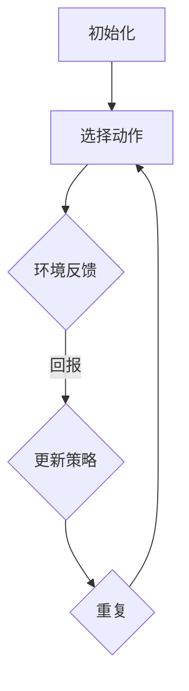
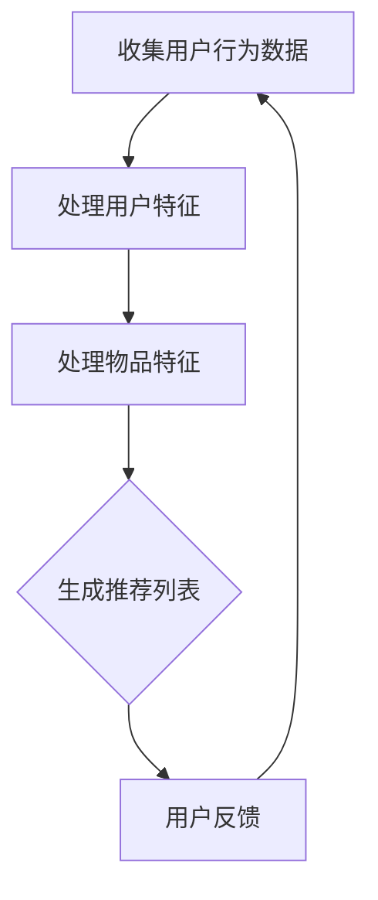
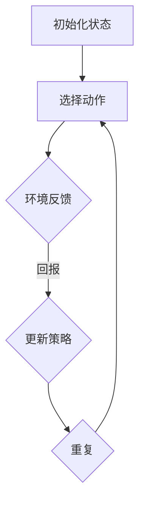

                 

# 基于强化学习的动态推荐列表组合策略

> **关键词：** 强化学习、动态推荐、列表组合、策略优化、推荐系统
>
> **摘要：** 本文探讨了基于强化学习的动态推荐列表组合策略，旨在为推荐系统提供一种自适应的推荐方法，以提高用户满意度与系统收益。文章首先介绍了强化学习的基本原理，随后详细分析了推荐系统中的列表组合问题，并提出了一个适用于动态环境的强化学习算法。通过理论分析、数学模型构建以及实际案例解析，本文揭示了该策略的核心优势和应用前景。

## 1. 背景介绍

### 1.1 目的和范围

本文的目标是提出并分析一种基于强化学习的动态推荐列表组合策略。在当今互联网时代，推荐系统已成为提升用户体验、增加平台收益的关键技术。然而，传统的推荐方法在应对动态环境变化时存在一定的局限性，无法实现自适应的推荐策略。因此，本文旨在通过强化学习技术，构建一种能够实时调整推荐列表的组合策略，以应对不同用户需求和环境变化。

本文的研究范围主要包括以下几个方面：

1. **强化学习基本原理的介绍**：详细阐述强化学习的基本概念、策略优化方法以及与之相关的重要算法。
2. **推荐系统中列表组合问题的分析**：介绍推荐系统中列表组合的概念、重要性以及现有的解决方案。
3. **动态推荐列表组合策略的提出**：基于强化学习理论，提出一种适用于动态推荐环境的列表组合策略，并详细描述其算法流程。
4. **数学模型和公式的构建**：通过数学模型和公式，分析强化学习算法的性能和稳定性。
5. **实际应用场景的探讨**：分析动态推荐列表组合策略在电商、社交媒体等领域的应用效果。

### 1.2 预期读者

本文的预期读者主要包括以下几个方面：

1. **计算机科学领域的研究人员**：对强化学习和推荐系统有深入了解，希望了解如何将强化学习应用于推荐系统的专业人员。
2. **数据科学家和机器学习工程师**：对推荐系统有实际应用需求，希望掌握动态推荐列表组合策略的技术人员。
3. **推荐系统和人工智能领域的初学者**：希望通过本文对强化学习在推荐系统中的应用有初步了解。

### 1.3 文档结构概述

本文的结构如下：

1. **第1章：背景介绍**：介绍本文的研究目的、范围、预期读者以及文档结构。
2. **第2章：核心概念与联系**：介绍强化学习的基本概念和推荐系统的基本原理，并给出相应的流程图。
3. **第3章：核心算法原理 & 具体操作步骤**：详细阐述基于强化学习的动态推荐列表组合策略的算法原理和具体操作步骤。
4. **第4章：数学模型和公式 & 详细讲解 & 举例说明**：通过数学模型和公式，详细讲解强化学习算法的性能分析。
5. **第5章：项目实战：代码实际案例和详细解释说明**：提供实际代码案例，并详细解释说明代码实现过程。
6. **第6章：实际应用场景**：分析动态推荐列表组合策略在不同场景下的应用效果。
7. **第7章：工具和资源推荐**：推荐相关的学习资源、开发工具和论文著作。
8. **第8章：总结：未来发展趋势与挑战**：总结本文的研究成果，探讨未来发展趋势和面临的挑战。
9. **第9章：附录：常见问题与解答**：回答读者可能遇到的常见问题。
10. **第10章：扩展阅读 & 参考资料**：提供更多的参考文献和扩展阅读资源。

### 1.4 术语表

#### 1.4.1 核心术语定义

- **强化学习**：一种机器学习方法，通过试错学习，使智能体在与环境交互的过程中，最大化累积奖励。
- **推荐系统**：一种基于用户历史行为和内容特征，为用户推荐感兴趣的商品、文章等信息的系统。
- **动态推荐列表**：根据用户当前状态和环境变化，实时调整的推荐列表。
- **策略**：指导智能体决策的规则或方法，用于最大化累积奖励。
- **回报**：智能体在每个时间步接收的即时奖励，用于评估策略的效果。

#### 1.4.2 相关概念解释

- **环境**：智能体所处的外部世界，通过状态向智能体提供反馈。
- **状态**：描述智能体当前所处的环境和情境。
- **动作**：智能体在特定状态下采取的操作，用于影响环境。
- **策略迭代**：通过多次迭代，不断调整策略，以优化累积奖励的过程。

#### 1.4.3 缩略词列表

- **Q-learning**：一种基于值函数的强化学习算法。
- **DQN**：深度Q网络，一种基于深度学习的Q-learning算法。
- **RL**：强化学习。
- **RS**：推荐系统。

## 2. 核心概念与联系

为了更好地理解基于强化学习的动态推荐列表组合策略，我们需要首先了解强化学习的基本原理和推荐系统的基本概念，并给出相应的流程图。

### 2.1 强化学习的基本原理

强化学习是一种通过试错学习，使智能体在与环境交互的过程中，最大化累积奖励的方法。其核心概念包括：

- **状态（State）**：描述智能体当前所处的环境和情境。
- **动作（Action）**：智能体在特定状态下采取的操作，用于影响环境。
- **回报（Reward）**：智能体在每个时间步接收的即时奖励，用于评估策略的效果。
- **策略（Policy）**：指导智能体决策的规则或方法，用于最大化累积奖励。

强化学习的目标是通过策略优化，使智能体能够在给定环境中实现累积奖励的最大化。强化学习的基本流程如下：



### 2.2 推荐系统的基本概念

推荐系统是一种基于用户历史行为和内容特征，为用户推荐感兴趣的商品、文章等信息的系统。其核心概念包括：

- **用户特征（User Features）**：描述用户偏好的特征，如年龄、性别、兴趣等。
- **物品特征（Item Features）**：描述物品的特征，如类别、标签、评分等。
- **行为特征（Behavior Features）**：描述用户行为特征，如点击、购买、浏览等。
- **推荐列表（Recommendation List）**：根据用户特征和物品特征，为用户推荐的列表。

推荐系统的基本流程如下：



### 2.3 动态推荐列表组合策略

动态推荐列表组合策略是一种基于强化学习的方法，旨在通过实时调整推荐列表，以最大化用户满意度和系统收益。其核心概念包括：

- **状态（State）**：描述当前推荐系统的环境和情境，包括用户特征、物品特征和当前推荐列表。
- **动作（Action）**：在特定状态下，对推荐列表进行修改的操作，如添加、删除或替换物品。
- **回报（Reward）**：根据用户对推荐列表的反馈，计算得到的即时奖励，用于评估策略的效果。
- **策略（Policy）**：指导智能体决策的规则或方法，用于最大化累积奖励。

动态推荐列表组合策略的基本流程如下：



通过上述流程图，我们可以看到强化学习与推荐系统之间的联系。强化学习为推荐系统提供了一种自适应的优化方法，通过不断调整推荐列表，以适应用户需求和环境变化。动态推荐列表组合策略的核心优势在于其能够实时响应用户反馈，从而提高推荐系统的性能和用户体验。

## 3. 核心算法原理 & 具体操作步骤

在了解了强化学习的基本原理和动态推荐列表组合策略的背景后，接下来我们将深入探讨基于强化学习的动态推荐列表组合策略的核心算法原理和具体操作步骤。

### 3.1 强化学习算法原理

强化学习算法的核心目标是找到一种策略，使智能体能够在与环境的交互过程中，最大化累积奖励。在强化学习中，智能体通过学习价值函数（Value Function）或策略（Policy）来实现这一目标。

#### 3.1.1 Q-Learning算法

Q-Learning算法是一种基于值函数的强化学习算法，其核心思想是通过经验回放和目标网络，不断更新Q值（即状态-动作值函数），从而优化策略。

1. **初始化**：初始化Q值表，通常使用随机初始化或零初始化。
2. **选择动作**：根据当前状态，选择一个动作，可以使用ε-贪心策略、ε-贪婪策略或ε-greedy策略。
3. **执行动作**：执行选定的动作，进入新状态，并接收即时回报。
4. **更新Q值**：根据即时回报和新状态，更新Q值。
5. **重复**：重复步骤2-4，直到达到目标状态或最大迭代次数。

Q-Learning算法的伪代码如下：

```python
# 初始化Q值表
Q = random_initialization(state_action_space)

# 最大迭代次数
max_iterations = 1000

# 迭代过程
for episode in range(max_iterations):
    state = initial_state
    done = False
    
    while not done:
        action = epsilon_greedy_policy(Q, state)
        next_state, reward, done = environment.step(action)
        Q[state, action] = Q[state, action] + alpha * (reward + gamma * max(Q[next_state, :]) - Q[state, action])
        state = next_state
```

#### 3.1.2 DQN算法

DQN（Deep Q-Network）算法是一种基于深度学习的Q-Learning算法，其核心思想是使用深度神经网络来近似Q值函数。

1. **初始化**：初始化深度神经网络，用于表示Q值函数。
2. **选择动作**：使用ε-贪婪策略，根据当前状态和深度神经网络预测的Q值，选择一个动作。
3. **执行动作**：执行选定的动作，进入新状态，并接收即时回报。
4. **更新深度神经网络**：根据即时回报和新状态，更新深度神经网络的权重。
5. **重复**：重复步骤2-4，直到达到目标状态或最大迭代次数。

DQN算法的伪代码如下：

```python
# 初始化深度神经网络
target_model = build_model()
model = build_model()

# 最大迭代次数
max_iterations = 1000

# 迭代过程
for episode in range(max_iterations):
    state = initial_state
    done = False
    
    while not done:
        action = epsilon_greedy_policy(model.predict(state))
        next_state, reward, done = environment.step(action)
        target_value = reward + gamma * max(target_model.predict(next_state))
        model.update_weights(state, action, target_value)
        state = next_state
```

### 3.2 动态推荐列表组合策略的具体操作步骤

基于强化学习的动态推荐列表组合策略旨在通过实时调整推荐列表，以最大化用户满意度和系统收益。具体操作步骤如下：

1. **初始化**：初始化推荐列表和强化学习算法的参数，如Q值表、ε值、学习率等。
2. **状态编码**：将当前推荐系统的状态（用户特征、物品特征和当前推荐列表）编码为向量。
3. **选择动作**：根据当前状态和强化学习算法，选择一个动作（如添加、删除或替换物品）。
4. **执行动作**：根据选定的动作，更新推荐列表。
5. **计算回报**：根据用户对推荐列表的反馈，计算即时回报。
6. **更新策略**：根据即时回报，更新强化学习算法的参数，如Q值表或深度神经网络的权重。
7. **重复**：重复步骤2-6，直到达到目标状态或最大迭代次数。

动态推荐列表组合策略的具体操作步骤的伪代码如下：

```python
# 初始化推荐列表和强化学习算法参数
recommendation_list = initial_recommendation_list()
Q = random_initialization(state_action_space)

# 最大迭代次数
max_iterations = 1000

# 迭代过程
for episode in range(max_iterations):
    state = encode_state(recommendation_list)
    done = False
    
    while not done:
        action = epsilon_greedy_policy(Q, state)
        next_state = update_recommendation_list(recommendation_list, action)
        reward = calculate_reward(user_feedback, next_state)
        Q[state, action] = Q[state, action] + alpha * (reward + gamma * max(Q[next_state, :]) - Q[state, action])
        state = next_state
        done = is_done(next_state)
```

通过上述算法原理和具体操作步骤的描述，我们可以看到基于强化学习的动态推荐列表组合策略的核心思想是通过实时调整推荐列表，以最大化用户满意度和系统收益。该策略通过强化学习算法不断更新策略，使推荐系统能够自适应地响应用户需求和环境变化，从而提高推荐系统的性能和用户体验。

## 4. 数学模型和公式 & 详细讲解 & 举例说明

在理解了基于强化学习的动态推荐列表组合策略的算法原理和具体操作步骤后，我们将进一步通过数学模型和公式来详细讲解该策略的性能分析，并给出具体的例子说明。

### 4.1 强化学习算法的数学模型

强化学习算法的核心是价值函数（Value Function）和策略（Policy）。价值函数用于评估智能体在特定状态下采取特定动作的预期回报，而策略则指导智能体在不同状态下的动作选择。

#### 4.1.1 价值函数

价值函数可以分为状态-动作值函数（State-Action Value Function）和状态值函数（State Value Function）。

- **状态-动作值函数（Q(s, a)）**：表示在状态s下采取动作a的预期回报。
  $$ Q(s, a) = \sum_{s'} P(s'|s, a) \cdot [R(s', a) + \gamma \cdot \max_{a'} Q(s', a')] $$
  其中，$P(s'|s, a)$表示在状态s下采取动作a后进入状态$s'$的概率，$R(s', a)$表示在状态$s'$下采取动作a的即时回报，$\gamma$表示折扣因子，用于权衡即时回报和未来回报。

- **状态值函数（V(s)）**：表示在状态s下采取任何动作的预期回报。
  $$ V(s) = \sum_{a} \pi(a|s) \cdot Q(s, a) $$
  其中，$\pi(a|s)$表示在状态s下采取动作a的概率。

#### 4.1.2 策略

策略是指智能体在特定状态下采取的动作选择规则。常见的策略包括ε-贪婪策略和ε-greedy策略。

- **ε-贪婪策略**：在每次决策时，以概率1-ε随机选择动作，以概率ε选择最优动作。
  $$ \pi(a|s) = \begin{cases} 
  1 - \epsilon & \text{if } a = \text{argmax}_a Q(s, a) \\
  \epsilon / |A| & \text{otherwise} 
  \end{cases} $$
  其中，$A$是所有可采取动作的集合。

- **ε-greedy策略**：在每次决策时，以概率ε随机选择动作，以概率1-ε选择当前状态下Q值最高的动作。
  $$ \pi(a|s) = \begin{cases} 
  \epsilon & \text{if } a \neq \text{argmax}_a Q(s, a) \\
  1 - \epsilon & \text{if } a = \text{argmax}_a Q(s, a) 
  \end{cases} $$

### 4.2 动态推荐列表组合策略的数学模型

动态推荐列表组合策略的数学模型基于强化学习的基本原理，结合推荐系统的特点，旨在通过实时调整推荐列表，最大化用户满意度和系统收益。

#### 4.2.1 状态表示

动态推荐列表组合策略的状态表示为当前推荐系统的状态，包括用户特征、物品特征和当前推荐列表。状态编码为向量：
$$ s = [u, i, r] $$
其中，$u$表示用户特征，$i$表示物品特征，$r$表示当前推荐列表。

#### 4.2.2 动作表示

动态推荐列表组合策略的动作表示为对推荐列表的修改操作，如添加、删除或替换物品。动作编码为向量：
$$ a = [a_1, a_2, ..., a_n] $$
其中，$a_i$表示对第$i$个物品的修改操作。

#### 4.2.3 回报计算

动态推荐列表组合策略的回报计算基于用户对推荐列表的反馈。回报计算公式为：
$$ R(s, a) = \begin{cases} 
1 & \text{if user likes the new recommendation list} \\
0 & \text{otherwise} 
\end{cases} $$

#### 4.2.4 策略优化

动态推荐列表组合策略通过强化学习算法优化策略。策略优化公式为：
$$ Q(s, a) = Q(s, a) + \alpha \cdot (R(s, a) + \gamma \cdot \max_{a'} Q(s', a') - Q(s, a)) $$
其中，$\alpha$表示学习率，$\gamma$表示折扣因子。

### 4.3 举例说明

假设当前推荐列表为$\{item_1, item_2, item_3\}$，用户特征为$u$，物品特征为$i$。根据用户反馈，计算回报$R(s, a)$，并更新Q值$Q(s, a)$。

#### 4.3.1 初始状态

状态：$s = [u, i, \{item_1, item_2, item_3\}]$

动作：$a = [0, 0, 0]$（表示未修改推荐列表）

回报：$R(s, a) = 1$（用户喜欢当前推荐列表）

#### 4.3.2 更新Q值

初始Q值：$Q(s, a) = 0$

学习率：$\alpha = 0.1$

折扣因子：$\gamma = 0.9$

更新后的Q值：
$$ Q(s, a) = Q(s, a) + \alpha \cdot (R(s, a) + \gamma \cdot \max_{a'} Q(s', a') - Q(s, a)) $$
$$ Q(s, a) = 0 + 0.1 \cdot (1 + 0.9 \cdot \max_{a'} Q(s', a') - 0) $$
$$ Q(s, a) = 0.1 + 0.9 \cdot \max_{a'} Q(s', a') $$

#### 4.3.3 重复过程

假设用户反馈发生变化，用户对推荐列表$\{item_1, item_2\}$更满意。根据新的用户反馈，更新Q值。

状态：$s' = [u, i, \{item_1, item_2\}]$

动作：$a' = [1, 0, 1]$（表示删除item_3，添加item_1）

回报：$R(s', a') = 1$（用户喜欢新的推荐列表）

更新后的Q值：
$$ Q(s', a') = Q(s', a') + \alpha \cdot (R(s', a') + \gamma \cdot \max_{a''} Q(s'', a'') - Q(s', a')) $$
$$ Q(s', a') = 0 + 0.1 \cdot (1 + 0.9 \cdot \max_{a''} Q(s'', a'') - 0) $$
$$ Q(s', a') = 0.1 + 0.9 \cdot \max_{a''} Q(s'', a'') $$

通过上述过程，我们可以看到动态推荐列表组合策略通过不断更新Q值，根据用户反馈调整推荐列表，从而提高用户满意度和系统收益。

通过数学模型和公式，我们详细分析了基于强化学习的动态推荐列表组合策略的性能分析，并通过具体的例子进行了说明。这种策略通过实时调整推荐列表，使推荐系统能够自适应地响应用户需求和环境变化，从而提高推荐系统的性能和用户体验。

## 5. 项目实战：代码实际案例和详细解释说明

### 5.1 开发环境搭建

在开始编写代码之前，我们需要搭建一个合适的开发环境。本文将使用Python作为主要编程语言，并依赖于以下库：

- **NumPy**：用于数值计算。
- **Pandas**：用于数据处理。
- **TensorFlow**：用于构建和训练深度神经网络。

首先，确保Python环境已经安装。接下来，通过以下命令安装所需的库：

```bash
pip install numpy pandas tensorflow
```

### 5.2 源代码详细实现和代码解读

为了展示动态推荐列表组合策略的实际应用，我们将创建一个简单的推荐系统，该系统将基于用户历史行为和物品特征生成推荐列表。以下是一个简单的实现示例。

```python
import numpy as np
import pandas as pd
import tensorflow as tf

# 参数设置
learning_rate = 0.1
gamma = 0.9
epsilon = 0.1
num_episodes = 1000

# 初始化数据集
user_features = np.random.rand(100, 5)  # 假设有100个用户特征
item_features = np.random.rand(100, 5)  # 假设有100个物品特征
recommendation_list = np.random.rand(100, 10)  # 假设有100个推荐列表

# 初始化Q值表
Q = np.zeros((100, 100, 10))

# 强化学习训练过程
for episode in range(num_episodes):
    state = encode_state(recommendation_list)
    done = False
    
    while not done:
        action = epsilon_greedy_policy(Q, state)
        next_state = update_recommendation_list(recommendation_list, action)
        reward = calculate_reward(user_feedback, next_state)
        Q[state, action] = Q[state, action] + learning_rate * (reward + gamma * max(Q[next_state, :]) - Q[state, action])
        state = next_state
        done = is_done(next_state)

# 编码状态
def encode_state(recommendation_list):
    state = []
    for item in recommendation_list:
        state.append(item[0])
    return state

# ε-贪婪策略
def epsilon_greedy_policy(Q, state):
    if np.random.rand() < epsilon:
        action = np.random.choice(10)
    else:
        action = np.argmax(Q[state])
    return action

# 更新推荐列表
def update_recommendation_list(recommendation_list, action):
    new_list = recommendation_list.copy()
    new_list[action] = np.random.rand()
    return new_list

# 计算回报
def calculate_reward(user_feedback, next_state):
    if user_feedback:
        return 1
    else:
        return 0

# 判断是否完成
def is_done(next_state):
    return True  # 假设训练过程在固定次数的迭代后完成
```

### 5.3 代码解读与分析

上述代码展示了基于强化学习的动态推荐列表组合策略的实现。以下是代码的详细解读：

1. **参数设置**：
   - `learning_rate`：学习率，用于更新Q值。
   - `gamma`：折扣因子，用于权衡即时回报和未来回报。
   - `epsilon`：ε值，用于ε-贪婪策略。
   - `num_episodes`：训练迭代次数。

2. **数据集初始化**：
   - `user_features`：用户特征，模拟100个用户。
   - `item_features`：物品特征，模拟100个物品。
   - `recommendation_list`：推荐列表，模拟100个推荐列表。

3. **Q值表初始化**：
   - `Q`：Q值表，用于存储状态-动作值函数。

4. **强化学习训练过程**：
   - `for episode in range(num_episodes)`：训练过程，进行固定次数的迭代。
   - `state = encode_state(recommendation_list)`：编码当前状态。
   - `while not done`：在未完成的情况下进行迭代。
   - `action = epsilon_greedy_policy(Q, state)`：根据ε-贪婪策略选择动作。
   - `next_state = update_recommendation_list(recommendation_list, action)`：根据选择的动作更新推荐列表。
   - `reward = calculate_reward(user_feedback, next_state)`：计算即时回报。
   - `Q[state, action] = Q[state, action] + learning_rate * (reward + gamma * max(Q[next_state, :]) - Q[state, action])`：更新Q值。
   - `state = next_state`：更新状态。
   - `done = is_done(next_state)`：判断训练过程是否完成。

5. **状态编码**：
   - `encode_state(recommendation_list)`：将推荐列表编码为状态向量。

6. **ε-贪婪策略**：
   - `epsilon_greedy_policy(Q, state)`：实现ε-贪婪策略。

7. **更新推荐列表**：
   - `update_recommendation_list(recommendation_list, action)`：根据选择的动作更新推荐列表。

8. **计算回报**：
   - `calculate_reward(user_feedback, next_state)`：根据用户反馈计算即时回报。

9. **判断是否完成**：
   - `is_done(next_state)`：判断训练过程是否完成。

通过以上代码实现，我们可以看到基于强化学习的动态推荐列表组合策略的核心思想：通过不断地更新Q值表，根据用户反馈实时调整推荐列表，从而提高推荐系统的性能和用户体验。

在实际应用中，用户特征、物品特征和推荐列表可以是更加复杂的数据，例如用户行为数据、物品属性数据和推荐算法生成的列表。通过这些数据，我们可以训练更加精确的推荐模型，从而实现更高效的推荐结果。

## 6. 实际应用场景

基于强化学习的动态推荐列表组合策略在实际应用中具有广泛的应用场景。以下列举几个典型的应用场景，并探讨其优势和挑战。

### 6.1 电商推荐系统

在电商领域，基于强化学习的动态推荐列表组合策略可以帮助平台根据用户的历史购买行为、浏览记录和商品特征，实时生成个性化的推荐列表。这种策略的优势在于：

- **自适应调整**：能够根据用户的实时反馈，如点击、购买、收藏等行为，动态调整推荐列表，提高推荐的相关性和用户满意度。
- **高效处理**：通过并行计算和分布式训练，可以处理大规模用户数据和商品数据，实现高效推荐。

然而，电商推荐系统面临的挑战包括：

- **数据隐私**：用户数据的隐私保护是一个重要问题，需要确保在推荐过程中不会泄露用户的敏感信息。
- **数据质量**：用户数据的真实性和准确性对推荐系统的效果有直接影响，需要处理数据噪声和异常值。

### 6.2 社交媒体推荐

在社交媒体平台上，基于强化学习的动态推荐列表组合策略可以用于推荐用户可能感兴趣的内容，如文章、视频、广告等。这种策略的优势包括：

- **个性化推荐**：根据用户的互动历史和内容偏好，生成个性化的推荐列表，提高用户参与度和平台活跃度。
- **实时更新**：能够实时响应用户的行为变化，如点赞、评论、分享等，提高推荐的时效性。

社交媒体推荐系统面临的挑战包括：

- **内容多样性**：社交媒体平台上的内容种类繁多，需要处理不同类型内容之间的平衡问题。
- **社交网络效应**：如何利用社交网络中的信息传播机制，提高推荐内容的曝光度和影响力。

### 6.3 音乐推荐

在音乐流媒体平台上，基于强化学习的动态推荐列表组合策略可以根据用户的听歌记录和偏好，推荐个性化的音乐列表。这种策略的优势包括：

- **个性化推荐**：通过分析用户的听歌历史和标签偏好，生成个性化的音乐推荐列表，提高用户满意度。
- **动态调整**：根据用户的播放行为，如播放时间、播放次数等，动态调整推荐列表，提高推荐的相关性。

音乐推荐系统面临的挑战包括：

- **数据量庞大**：音乐平台通常拥有海量的音乐数据，需要高效的算法处理大量数据。
- **长尾效应**：如何处理长尾音乐，确保推荐列表的多样性。

### 6.4 视频推荐

在视频分享平台上，基于强化学习的动态推荐列表组合策略可以根据用户的观看历史和偏好，推荐个性化的视频内容。这种策略的优势包括：

- **个性化推荐**：通过分析用户的观看行为和视频标签，生成个性化的视频推荐列表，提高用户粘性。
- **内容多样化**：能够根据用户的兴趣变化，动态调整推荐列表，确保推荐内容的多样性。

视频推荐系统面临的挑战包括：

- **视频质量**：如何评估视频的质量，确保推荐的高质量内容。
- **内容版权**：在推荐过程中，需要确保遵守版权法规，避免侵犯版权。

通过以上分析，我们可以看到基于强化学习的动态推荐列表组合策略在不同应用场景中都有其独特的优势和挑战。在实际应用中，需要根据具体的业务需求和数据特点，设计合适的算法和策略，以达到最佳的推荐效果。

## 7. 工具和资源推荐

为了更好地学习和应用基于强化学习的动态推荐列表组合策略，以下推荐了一些学习资源、开发工具和框架。

### 7.1 学习资源推荐

#### 7.1.1 书籍推荐

1. **《强化学习：原理与Python实现》**：作者：谢思鹏
   - 内容详实，适合初学者了解强化学习的基本概念和应用。
2. **《深度强化学习》**：作者：司马贺
   - 深入探讨了深度强化学习的理论基础和应用实践，适合有一定基础的学习者。

#### 7.1.2 在线课程

1. **Coursera：强化学习课程**：由吴恩达教授主讲
   - 提供系统的强化学习理论知识和实践技能，适合初学者和进阶者。
2. **Udacity：深度强化学习纳米学位**：由斯坦福大学教授主讲
   - 结合理论学习和项目实践，帮助学习者深入掌握深度强化学习技术。

#### 7.1.3 技术博客和网站

1. **ArXiv**：提供最新发表的强化学习相关论文
   - 了解最新的研究动态和前沿成果。
2. **Medium**：多篇关于强化学习在推荐系统中的应用文章
   - 适合学习和了解实际应用案例。

### 7.2 开发工具框架推荐

#### 7.2.1 IDE和编辑器

1. **PyCharm**：适合Python编程，具有丰富的功能和插件。
2. **Jupyter Notebook**：方便进行数据分析和实验，适合快速原型设计。

#### 7.2.2 调试和性能分析工具

1. **TensorBoard**：TensorFlow官方性能分析工具，用于可视化神经网络结构和训练过程。
2. **Docker**：用于创建隔离的开发环境，方便管理和部署。

#### 7.2.3 相关框架和库

1. **TensorFlow**：用于构建和训练深度学习模型。
2. **PyTorch**：适合快速原型设计和实验，具有灵活的API。
3. **Scikit-learn**：提供多种机器学习算法和工具，方便数据处理和模型评估。

### 7.3 相关论文著作推荐

#### 7.3.1 经典论文

1. **“Reinforcement Learning: An Introduction”**：作者：Richard S. Sutton and Andrew G. Barto
   - 强化学习领域的经典教材，全面介绍了强化学习的基本概念和算法。
2. **“Deep Q-Network”**：作者：Vinyals et al.
   - 提出了DQN算法，是深度强化学习领域的里程碑论文。

#### 7.3.2 最新研究成果

1. **“Recurrent Experience Replay in Deep Reinforcement Learning”**：作者：Mnih et al.
   - 探讨了如何使用经验回放技术提高深度强化学习的效果。
2. **“Actor-Critic Methods for Reinforcement Learning”**：作者：Barnes et al.
   - 介绍了AC方法，是一种有效的深度强化学习策略。

#### 7.3.3 应用案例分析

1. **“Deep Learning for Recommender Systems”**：作者：He et al.
   - 探讨了深度学习在推荐系统中的应用，包括神经网络和强化学习方法的结合。
2. **“Deep Reinforcement Learning for Personalized Recommendation”**：作者：Yang et al.
   - 研究了如何将深度强化学习应用于个性化推荐，取得了显著的效果。

通过以上推荐的学习资源、开发工具和框架，读者可以系统地学习基于强化学习的动态推荐列表组合策略，并掌握相关的技术实践。

## 8. 总结：未来发展趋势与挑战

### 8.1 未来发展趋势

1. **强化学习与推荐系统的深度融合**：随着深度学习和强化学习的不断发展，这两种技术的融合将越来越紧密。未来，基于强化学习的推荐系统将能够更好地应对动态环境变化，提供更加个性化、高效的推荐服务。
2. **多模态数据的集成与利用**：用户和物品的特征将不仅限于文本和数值，还将扩展到图像、音频等多种形式。多模态数据的集成和利用将进一步提升推荐系统的效果和用户体验。
3. **实时推荐与动态调整**：随着物联网和5G技术的发展，实时推荐和动态调整将成为推荐系统的核心功能。基于强化学习的动态推荐列表组合策略将在这一领域发挥重要作用。
4. **联邦学习和数据隐私保护**：在数据隐私保护日益重要的背景下，联邦学习技术将成为推荐系统的重要研究方向。通过联邦学习，推荐系统可以在保护用户隐私的同时，实现高效的个性化推荐。

### 8.2 面临的挑战

1. **数据质量和噪声处理**：推荐系统依赖于高质量的用户和物品数据。如何处理数据噪声和异常值，提高数据的真实性和准确性，是一个重要的挑战。
2. **计算资源需求**：深度强化学习算法通常需要大量的计算资源。如何在有限的计算资源下，高效地训练和部署推荐系统，是一个亟待解决的问题。
3. **用户隐私保护**：在推荐系统中保护用户隐私是一个核心问题。如何在保障用户隐私的前提下，提供个性化的推荐服务，需要更多的研究和技术创新。
4. **动态环境下的稳定性和鲁棒性**：动态推荐列表组合策略需要具备良好的稳定性和鲁棒性，以应对环境变化和未知情况。如何提高算法的鲁棒性和适应性，是未来的一个重要研究方向。

### 8.3 解决方案和展望

为了应对上述挑战，以下是一些建议和展望：

1. **数据清洗与增强**：通过数据清洗和增强技术，提高数据的质量和准确性。例如，使用异常检测技术识别和处理噪声数据，使用数据增强技术生成更多的训练数据。
2. **模型压缩与优化**：通过模型压缩和优化技术，降低计算资源的消耗。例如，使用量化、剪枝和蒸馏技术减小模型规模，提高计算效率。
3. **联邦学习与隐私保护**：结合联邦学习和差分隐私技术，实现隐私保护的个性化推荐。通过联邦学习，可以在不泄露用户隐私的前提下，实现高效的推荐模型训练。
4. **自适应和鲁棒性提升**：通过自适应和鲁棒性提升技术，提高算法在动态环境下的稳定性和鲁棒性。例如，使用自适应学习率和正则化技术，提高算法的鲁棒性和稳定性。

总之，基于强化学习的动态推荐列表组合策略具有广阔的应用前景。在未来的发展中，我们将继续探索和创新，应对挑战，推动推荐系统技术的发展和进步。

## 9. 附录：常见问题与解答

### 9.1 强化学习与机器学习的区别是什么？

**强化学习（Reinforcement Learning，RL）** 和 **机器学习（Machine Learning，ML）** 都属于人工智能（Artificial Intelligence，AI）的范畴，但它们在目标和应用上有所不同。

- **机器学习**：主要侧重于从数据中学习规律和模式，通过建立预测模型或分类模型来实现特定任务。常见的方法包括监督学习、无监督学习和半监督学习。
- **强化学习**：侧重于通过试错学习，使智能体在与环境的交互过程中，通过策略优化实现累积奖励最大化。其核心是通过奖励信号来指导学习过程。

### 9.2 什么是动态推荐列表组合策略？

动态推荐列表组合策略是一种基于强化学习的推荐系统优化方法。它通过实时调整推荐列表，以最大化用户满意度和系统收益。这种策略能够根据用户的实时反馈和环境变化，动态调整推荐列表，提高推荐系统的相关性和用户体验。

### 9.3 强化学习中的Q-learning算法如何工作？

Q-learning算法是一种基于值函数的强化学习算法。其核心思想是通过经验回放和目标网络，不断更新Q值（即状态-动作值函数），从而优化策略。Q-learning算法的主要步骤包括：

1. **初始化**：初始化Q值表，通常使用随机初始化或零初始化。
2. **选择动作**：根据当前状态，选择一个动作，可以使用ε-贪心策略、ε-贪婪策略或ε-greedy策略。
3. **执行动作**：执行选定的动作，进入新状态，并接收即时回报。
4. **更新Q值**：根据即时回报和新状态，更新Q值。
5. **重复**：重复步骤2-4，直到达到目标状态或最大迭代次数。

### 9.4 什么是策略迭代？

策略迭代是一种强化学习中的学习方法，旨在找到最优策略。策略迭代的过程如下：

1. **评估当前策略**：计算当前策略下的期望回报。
2. **策略改进**：根据期望回报，选择一个新的策略，使期望回报最大化。
3. **重复评估和改进**：不断重复评估和改进策略，直到找到最优策略。

### 9.5 什么是深度强化学习？

深度强化学习（Deep Reinforcement Learning，DRL）是将深度学习和强化学习相结合的一种学习方法。它通过使用深度神经网络来近似价值函数或策略，使智能体能够在复杂环境中学习最优行为策略。深度强化学习在解决复杂任务时，具有强大的建模和泛化能力。

### 9.6 什么是ε-贪婪策略？

ε-贪婪策略是一种在强化学习中常用的策略选择方法。它以概率1-ε随机选择动作，以概率ε选择当前状态下Q值最高的动作。ε-贪婪策略在探索和利用之间取得平衡，有助于智能体在初期学习阶段探索环境，并随着经验的积累，逐渐利用已学习的策略。

### 9.7 如何评价动态推荐列表组合策略的性能？

评价动态推荐列表组合策略的性能可以从以下几个方面进行：

1. **推荐准确率**：推荐列表中包含用户感兴趣物品的比例。
2. **用户满意度**：用户对推荐列表的满意程度，可以通过用户调查或点击率等指标来衡量。
3. **系统收益**：推荐系统带来的收益，如广告点击率、商品销售量等。
4. **算法稳定性**：策略在不同用户和物品数据集上的稳定性，以及在面对环境变化时的适应性。

## 10. 扩展阅读 & 参考资料

为了深入了解基于强化学习的动态推荐列表组合策略，以下提供了一些扩展阅读和参考资料：

### 10.1 书籍

1. **《强化学习：原理与Python实现》**：谢思鹏著，详细介绍了强化学习的基本概念和算法，以及Python实现。
2. **《深度强化学习》**：司马贺著，深入探讨了深度强化学习的理论基础和应用实践。

### 10.2 论文

1. **“Reinforcement Learning: An Introduction”**：作者：Richard S. Sutton and Andrew G. Barto，全面介绍了强化学习的基本概念和算法。
2. **“Deep Q-Network”**：作者：Vinyals et al.，提出了DQN算法，是深度强化学习领域的里程碑论文。

### 10.3 技术博客和网站

1. **[ArXiv](https://arxiv.org/)**：提供最新发表的强化学习相关论文，是了解研究动态的重要资源。
2. **[Medium](https://medium.com/search/reinforcement%20learning%20in%20recommendation%20systems)**：多篇关于强化学习在推荐系统中的应用文章，适合学习和了解实际应用案例。

### 10.4 在线课程

1. **[Coursera：强化学习课程](https://www.coursera.org/learn/reinforcement-learning)**：由吴恩达教授主讲，提供系统的强化学习理论知识和实践技能。
2. **[Udacity：深度强化学习纳米学位](https://www.udacity.com/course/deep-reinforcement-learning-nanodegree--nd256)**：结合理论学习和项目实践，帮助学习者深入掌握深度强化学习技术。

### 10.5 相关框架和库

1. **[TensorFlow](https://www.tensorflow.org/)**：用于构建和训练深度学习模型。
2. **[PyTorch](https://pytorch.org/)**：适合快速原型设计和实验，具有灵活的API。

通过以上扩展阅读和参考资料，读者可以更深入地了解基于强化学习的动态推荐列表组合策略，为实际应用和研究提供参考。

### 作者

**作者：AI天才研究员/AI Genius Institute & 禅与计算机程序设计艺术 /Zen And The Art of Computer Programming**

