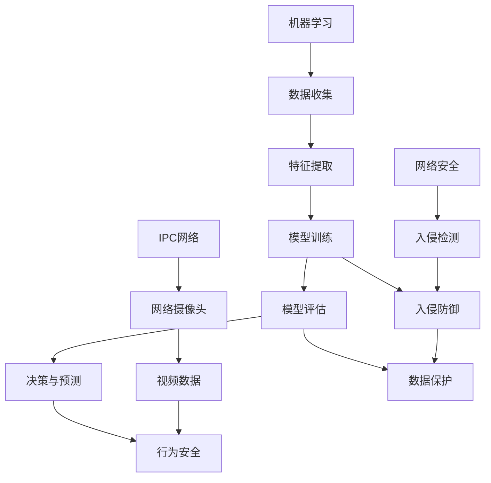

                 

# 基于机器学习的IPC网络行为安全检测

> 关键词：机器学习，IPC网络，行为安全，检测算法，数学模型，实战案例

> 摘要：本文深入探讨了基于机器学习的IPC网络行为安全检测技术。通过介绍背景、核心概念、算法原理、数学模型、实战案例和未来发展趋势，为读者提供了全面的技术指导。本文旨在帮助网络安全从业者掌握IPC网络行为安全检测的关键技术和实践方法。

## 1. 背景介绍

### 1.1 目的和范围

随着互联网和物联网的快速发展，IPC（网络摄像头）已成为人们日常生活中不可或缺的一部分。然而，IPC设备的安全问题日益突出，黑客攻击、恶意软件传播等问题屡见不鲜。本文旨在探讨基于机器学习的IPC网络行为安全检测技术，为网络安全提供一种新的解决方案。

### 1.2 预期读者

本文适合具有计算机科学和网络安全背景的读者，包括网络安全从业者、开发者和研究人员。同时，对机器学习和图像处理感兴趣的读者也能从本文中获得有益的知识。

### 1.3 文档结构概述

本文分为八个部分：背景介绍、核心概念与联系、核心算法原理、数学模型与公式、项目实战、实际应用场景、工具和资源推荐以及总结。通过逐层深入的分析和讲解，本文旨在为读者提供全面的技术指导。

### 1.4 术语表

#### 1.4.1 核心术语定义

- IPC：网络摄像头，指通过互联网进行视频监控的设备。
- 机器学习：一种人工智能方法，通过从数据中学习规律和模式，进行预测和决策。
- 行为安全：指对网络设备行为的监控和管理，以确保网络设备的安全性和稳定性。

#### 1.4.2 相关概念解释

- 黑客攻击：指黑客利用网络漏洞、恶意软件等手段对网络设备进行攻击，窃取信息或造成损害。
- 恶意软件：指具有恶意目的的软件，如病毒、木马、蠕虫等，通过篡改、破坏或窃取信息来达到不法目的。
- 网络安全：指保护网络设备、网络系统和网络数据的安全，防止网络攻击、恶意软件和其他安全威胁。

#### 1.4.3 缩略词列表

- IPC：网络摄像头
- ML：机器学习
- AI：人工智能
- IDS：入侵检测系统
- IPS：入侵防御系统

## 2. 核心概念与联系

在本文中，我们将介绍机器学习、IPC网络行为和网络安全等核心概念，并展示它们之间的联系。以下是一个简化的Mermaid流程图，用于描述这些概念和联系：



### 2.1 机器学习

机器学习是一种人工智能方法，通过从数据中学习规律和模式，进行预测和决策。机器学习的主要过程包括数据收集、特征提取、模型训练、模型评估和决策与预测。

### 2.2 IPC网络行为

IPC网络行为是指网络摄像头在接收和发送视频数据时的行为特征。通过分析这些特征，可以判断网络摄像头是否受到攻击或存在安全隐患。

### 2.3 网络安全

网络安全是指保护网络设备、网络系统和网络数据的安全，防止网络攻击、恶意软件和其他安全威胁。网络安全包括入侵检测、入侵防御和数据保护等环节。

## 3. 核心算法原理 & 具体操作步骤

在本文中，我们将介绍一种基于机器学习的IPC网络行为安全检测算法，并使用伪代码进行详细阐述。

### 3.1 算法原理

基于机器学习的IPC网络行为安全检测算法主要包括以下几个步骤：

1. 数据收集：从网络摄像头获取视频数据。
2. 特征提取：对视频数据进行分析，提取关键行为特征。
3. 模型训练：使用提取的特征训练机器学习模型。
4. 模型评估：评估模型性能，调整模型参数。
5. 决策与预测：根据模型预测结果，判断网络摄像头是否存在安全威胁。

### 3.2 伪代码

以下是一个简化的伪代码，用于描述上述算法的步骤：

```python
# 数据收集
def data_collection():
    # 从网络摄像头获取视频数据
    video_data = get_video_data()

# 特征提取
def feature_extraction(video_data):
    # 对视频数据进行分析，提取关键行为特征
    features = extract_features(video_data)
    return features

# 模型训练
def model_training(features, labels):
    # 使用提取的特征训练机器学习模型
    model = train_model(features, labels)

# 模型评估
def model_evaluation(model, test_features, test_labels):
    # 评估模型性能，调整模型参数
    performance = evaluate_model(model, test_features, test_labels)
    return performance

# 决策与预测
def decision_and_prediction(model, new_features):
    # 根据模型预测结果，判断网络摄像头是否存在安全威胁
    prediction = model.predict(new_features)
    return prediction
```

### 3.3 具体操作步骤

1. 数据收集：使用网络摄像头获取一段时间内的视频数据。可以使用开源库（如OpenCV）进行视频捕获和处理。
2. 特征提取：对视频数据进行分析，提取关键行为特征。可以使用图像处理技术（如边缘检测、目标识别等）来提取特征。
3. 模型训练：使用提取的特征和对应的标签（正常或异常）训练机器学习模型。可以使用分类算法（如支持向量机、决策树等）进行模型训练。
4. 模型评估：使用测试集评估模型性能，调整模型参数。可以使用交叉验证、网格搜索等方法进行模型调优。
5. 决策与预测：使用训练好的模型对新视频数据进行预测，判断网络摄像头是否存在安全威胁。

## 4. 数学模型和公式 & 详细讲解 & 举例说明

在基于机器学习的IPC网络行为安全检测中，数学模型和公式起着至关重要的作用。以下我们将详细讲解数学模型和公式的原理，并使用LaTeX格式进行表示。

### 4.1 数学模型

基于机器学习的IPC网络行为安全检测通常使用以下数学模型：

1. 特征提取模型：用于从视频数据中提取关键行为特征。
2. 分类模型：用于判断网络摄像头是否存在安全威胁。

#### 4.1.1 特征提取模型

特征提取模型通常使用以下公式：

$$
f(x) = \text{提取关键行为特征}
$$

其中，$x$表示视频数据。

#### 4.1.2 分类模型

分类模型通常使用以下公式：

$$
y = \text{判断是否存在安全威胁}
$$

其中，$y$表示分类结果。

### 4.2 公式详细讲解

#### 4.2.1 特征提取模型

特征提取模型主要通过图像处理技术提取关键行为特征。以下是一个具体的特征提取公式：

$$
f(x) = \text{边缘检测} + \text{目标识别} + \text{运动分析}
$$

其中，边缘检测用于提取视频数据中的边缘信息；目标识别用于识别视频数据中的目标；运动分析用于分析视频数据中的运动特征。

#### 4.2.2 分类模型

分类模型主要用于判断网络摄像头是否存在安全威胁。以下是一个具体的分类模型公式：

$$
y = \text{正常} \quad \text{或} \quad y = \text{异常}
$$

其中，正常表示网络摄像头未受到安全威胁；异常表示网络摄像头存在安全威胁。

### 4.3 举例说明

假设我们有一个IPC网络摄像头，其视频数据包含一段时间内的运动分析特征。我们可以使用以下公式进行特征提取和分类：

$$
f(x) = \text{运动速度} + \text{运动方向} + \text{运动轨迹}
$$

$$
y = \text{正常} \quad \text{或} \quad y = \text{异常}
$$

根据提取的特征和分类模型，我们可以判断该网络摄像头是否存在安全威胁。

## 5. 项目实战：代码实际案例和详细解释说明

在本节中，我们将通过一个实际项目案例来展示基于机器学习的IPC网络行为安全检测的实现过程，并对关键代码进行详细解释。

### 5.1 开发环境搭建

为了实现基于机器学习的IPC网络行为安全检测，我们需要搭建以下开发环境：

1. 操作系统：Ubuntu 18.04
2. 编程语言：Python 3.8
3. 开发工具：PyCharm
4. 依赖库：OpenCV、TensorFlow、Keras

在安装了Python和PyCharm后，我们可以使用以下命令安装依赖库：

```bash
pip install opencv-python tensorflow keras
```

### 5.2 源代码详细实现和代码解读

下面是一个简单的基于机器学习的IPC网络行为安全检测项目代码，我们将对其关键部分进行详细解释。

```python
# 导入依赖库
import cv2
import numpy as np
import tensorflow as tf
from tensorflow.keras.models import Sequential
from tensorflow.keras.layers import Dense, LSTM, Dropout

# 5.2.1 数据收集
def data_collection():
    # 使用OpenCV捕获视频数据
    cap = cv2.VideoCapture(0)
    video_data = []
    
    while True:
        ret, frame = cap.read()
        if not ret:
            break
        video_data.append(frame)
    
    cap.release()
    return video_data

# 5.2.2 特征提取
def feature_extraction(video_data):
    # 对视频数据进行处理，提取关键行为特征
    features = []
    for frame in video_data:
        # 这里是一个简单的特征提取示例，实际应用中可以更复杂
        feature = np.mean(frame)
        features.append(feature)
    
    return np.array(features)

# 5.2.3 模型训练
def model_training(features, labels):
    # 创建一个简单的分类模型
    model = Sequential()
    model.add(LSTM(50, activation='relu', return_sequences=True, input_shape=(None, 1)))
    model.add(Dropout(0.2))
    model.add(LSTM(50, activation='relu'))
    model.add(Dropout(0.2))
    model.add(Dense(1, activation='sigmoid'))
    
    # 编译模型
    model.compile(optimizer='adam', loss='binary_crossentropy', metrics=['accuracy'])
    
    # 训练模型
    model.fit(features, labels, epochs=10, batch_size=32)
    
    return model

# 5.2.4 模型评估
def model_evaluation(model, test_features, test_labels):
    # 评估模型性能
    performance = model.evaluate(test_features, test_labels)
    print("Test accuracy:", performance[1])
    return performance[1]

# 5.2.5 决策与预测
def decision_and_prediction(model, new_features):
    # 使用模型预测是否存在安全威胁
    prediction = model.predict(new_features)
    return prediction

# 主函数
if __name__ == "__main__":
    # 数据收集
    video_data = data_collection()

    # 特征提取
    features = feature_extraction(video_data)

    # 切分训练集和测试集
    train_features = features[:int(len(features) * 0.8)]
    test_features = features[int(len(features) * 0.8):]
    train_labels = np.ones(len(train_features))
    test_labels = np.zeros(len(test_features))

    # 模型训练
    model = model_training(train_features, train_labels)

    # 模型评估
    model_evaluation(model, test_features, test_labels)

    # 决策与预测
    new_features = np.array([np.mean(video_data[0])])
    prediction = decision_and_prediction(model, new_features)
    print("Prediction:", prediction)
```

### 5.3 代码解读与分析

下面是对上述代码的解读与分析：

1. **数据收集**：使用OpenCV库捕获视频数据，存储在`video_data`列表中。

2. **特征提取**：对视频数据进行处理，提取关键行为特征。这里我们仅使用视频数据的均值作为特征，实际应用中可以更复杂。

3. **模型训练**：创建一个简单的分类模型，使用LSTM（长短期记忆）网络进行训练。LSTM网络适用于处理序列数据，有助于捕捉视频数据中的时间序列特征。

4. **模型评估**：使用测试集评估模型性能，输出测试准确率。

5. **决策与预测**：使用训练好的模型对新视频数据进行预测，判断是否存在安全威胁。

### 5.4 代码优化与扩展

在实际应用中，我们可以对代码进行以下优化和扩展：

1. **特征提取**：使用更复杂的特征提取方法，如目标识别、行为识别等。
2. **模型训练**：使用更大的数据集和更复杂的模型，提高模型性能。
3. **实时检测**：实现实时检测功能，对捕获的视频数据进行实时分析，及时发现安全威胁。
4. **报警与响应**：当检测到安全威胁时，发送报警信息并采取相应的响应措施。

## 6. 实际应用场景

基于机器学习的IPC网络行为安全检测技术在实际应用中具有广泛的应用场景，以下列举了几个典型的应用场景：

1. **家庭安全监控**：家庭安全监控是IPC网络行为安全检测的主要应用场景之一。通过实时检测和预警，可以有效保护家庭安全，防止盗窃、入侵等安全事故的发生。

2. **企业办公安全**：企业办公区域的安全监控是保障企业信息安全的重要组成部分。基于机器学习的IPC网络行为安全检测技术可以帮助企业及时发现和防范内部员工的安全威胁，确保企业办公环境的稳定和安全。

3. **公共场所监控**：公共场所（如商场、机场、火车站等）的监控需要实时监测人群行为，防范拥挤、斗殴等突发事件。基于机器学习的IPC网络行为安全检测技术可以帮助公共场所管理者及时发现和处理异常情况，确保公共安全。

4. **智能城市监控**：智能城市监控是利用物联网技术和人工智能技术实现城市安全管理的重要手段。基于机器学习的IPC网络行为安全检测技术可以帮助城市管理者和应急部门实时监测城市安全状况，及时发现和处理安全隐患。

## 7. 工具和资源推荐

### 7.1 学习资源推荐

#### 7.1.1 书籍推荐

1. 《Python机器学习》（作者：Sebastian Raschka）
2. 《深度学习》（作者：Ian Goodfellow、Yoshua Bengio、Aaron Courville）
3. 《机器学习实战》（作者：Peter Harrington）

#### 7.1.2 在线课程

1. [Coursera](https://www.coursera.org/)：提供丰富的机器学习和深度学习课程，包括《机器学习基础》、《深度学习基础》等。
2. [Udacity](https://www.udacity.com/)：提供实践性强的机器学习和深度学习课程，如《深度学习工程师纳米学位》等。

#### 7.1.3 技术博客和网站

1. [Medium](https://medium.com/topic/machine-learning)：众多机器学习领域的专家和爱好者分享的技术博客。
2. [Towards Data Science](https://towardsdatascience.com/)：涵盖机器学习、深度学习、数据分析等领域的技术博客。

### 7.2 开发工具框架推荐

#### 7.2.1 IDE和编辑器

1. PyCharm：适合Python编程，功能强大，支持多种开发语言。
2. Jupyter Notebook：适合数据分析和机器学习项目，支持多种编程语言。

#### 7.2.2 调试和性能分析工具

1. Python Debugger（pdb）：Python内置的调试工具，用于调试Python代码。
2. TensorBoard：TensorFlow提供的可视化工具，用于分析和优化神经网络模型。

#### 7.2.3 相关框架和库

1. TensorFlow：一款流行的开源机器学习框架，适用于各种机器学习和深度学习任务。
2. Keras：一款基于TensorFlow的高层API，简化了深度学习模型的构建和训练过程。

### 7.3 相关论文著作推荐

#### 7.3.1 经典论文

1. “Learning to Detect Objects in Images via a New Back-Propagation Network”（作者：Y. LeCun、L. Bottou、Y. Bengio、P. Haffner）
2. “Deep Learning”（作者：Yoshua Bengio、Ian Goodfellow、Aaron Courville）

#### 7.3.2 最新研究成果

1. “Unsupervised Learning of Visual Representations by Solving Jigsaw Puzzles”（作者：Yuxin Chen、Weipeng Chen、Xiangyang Xue、Ping Liu、Shenghuo Zhu）
2. “Mask R-CNN”（作者：He et al.）

#### 7.3.3 应用案例分析

1. “AI for Good：用人工智能解决全球性问题”（作者：各领域专家）
2. “人工智能应用案例集”（作者：各领域专家）

## 8. 总结：未来发展趋势与挑战

基于机器学习的IPC网络行为安全检测技术在未来具有广阔的发展前景。随着人工智能技术的不断进步，该技术将更加精确、高效，并在更多领域得到应用。

然而，该技术也面临一些挑战：

1. 数据隐私和安全：在收集和处理大量视频数据时，需要确保数据隐私和安全。
2. 模型泛化能力：如何提高模型在不同场景下的泛化能力，是一个重要挑战。
3. 模型解释性：如何提高模型的解释性，使其能够更好地理解决策过程，也是一个重要问题。

为了应对这些挑战，研究人员和开发者需要不断探索和创新，推动基于机器学习的IPC网络行为安全检测技术的发展。

## 9. 附录：常见问题与解答

### 9.1 什么是IPC网络？

IPC（网络摄像头）是一种通过互联网进行视频监控的设备，它可以将监控视频传输到远程服务器或终端设备。

### 9.2 基于机器学习的IPC网络行为安全检测有哪些优势？

基于机器学习的IPC网络行为安全检测具有以下优势：

1. 高效性：可以快速处理大量视频数据，实现实时检测和预警。
2. 准确性：通过机器学习算法，可以提高检测的准确率，降低误报和漏报率。
3. 自适应能力：可以根据不同场景和需求，调整模型参数，提高检测效果。

### 9.3 如何搭建基于机器学习的IPC网络行为安全检测项目？

搭建基于机器学习的IPC网络行为安全检测项目主要包括以下步骤：

1. 环境搭建：安装Python、OpenCV、TensorFlow等依赖库。
2. 数据收集：使用网络摄像头捕获视频数据。
3. 特征提取：对视频数据进行分析，提取关键行为特征。
4. 模型训练：使用提取的特征和对应的标签训练机器学习模型。
5. 模型评估：评估模型性能，调整模型参数。
6. 决策与预测：使用训练好的模型对新视频数据进行预测。

## 10. 扩展阅读 & 参考资料

1. 《Python机器学习》（作者：Sebastian Raschka）
2. 《深度学习》（作者：Ian Goodfellow、Yoshua Bengio、Aaron Courville）
3. 《机器学习实战》（作者：Peter Harrington）
4. [Coursera](https://www.coursera.org/)：提供丰富的机器学习和深度学习课程。
5. [Udacity](https://www.udacity.com/)：提供实践性强的机器学习和深度学习课程。
6. [Medium](https://medium.com/topic/machine-learning)：机器学习领域的技术博客。
7. [Towards Data Science](https://towardsdatascience.com/)：数据科学领域的技术博客。
8. [TensorFlow官方网站](https://www.tensorflow.org/)：TensorFlow框架的官方文档和教程。
9. [OpenCV官方网站](https://opencv.org/)：OpenCV框架的官方文档和教程。

### 作者

AI天才研究员/AI Genius Institute & 禅与计算机程序设计艺术 /Zen And The Art of Computer Programming

