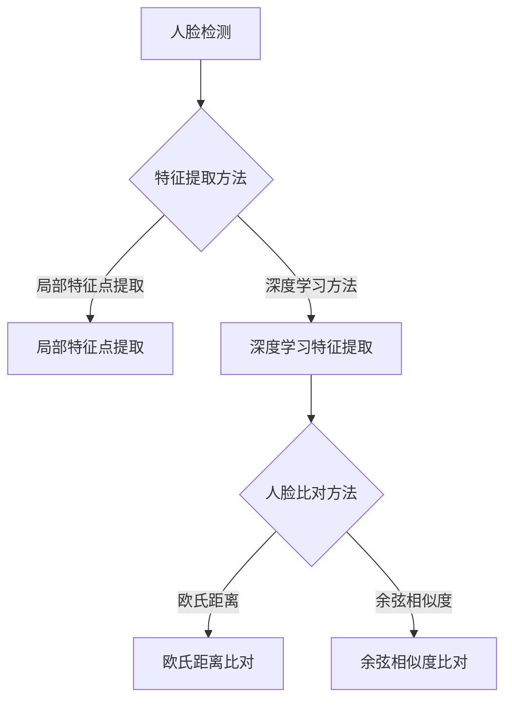

                 

# 基于深度学习的人脸识别

> **关键词：** 深度学习、人脸识别、卷积神经网络、特征提取、人脸检测

> **摘要：** 本文章将深入探讨基于深度学习的人脸识别技术，从核心概念、算法原理、数学模型、项目实战等多个维度进行详细解析。通过本文的阅读，读者将全面了解人脸识别技术的演进、实现原理以及实际应用，掌握这一领域的最新动态和发展趋势。

## 1. 背景介绍

### 1.1 目的和范围

本文旨在系统地介绍基于深度学习的人脸识别技术。我们将从基础知识出发，逐步深入探讨人脸识别的核心算法原理、数学模型，并通过实际项目案例进行讲解。文章的目标读者包括对人工智能和计算机视觉感兴趣的初学者、有一定编程基础的工程师，以及对人脸识别技术有一定了解但希望深入了解的专业人士。

### 1.2 预期读者

- 对深度学习和人脸识别技术感兴趣的技术爱好者；
- 想要进入人工智能领域从事相关工作的人员；
- 有编程基础，希望提升自己在计算机视觉领域的技能；
- 对人脸识别技术有深入研究，希望了解最新进展和实际应用的专业人士。

### 1.3 文档结构概述

本文的结构如下：

1. **背景介绍**：简要介绍文章的目的和预期读者，概述人脸识别技术的发展历程和重要性。
2. **核心概念与联系**：介绍人脸识别技术的核心概念、相关算法以及其在计算机视觉中的地位和作用。
3. **核心算法原理 & 具体操作步骤**：详细讲解人脸识别算法的原理，包括特征提取、人脸检测等。
4. **数学模型和公式 & 详细讲解 & 举例说明**：解析人脸识别中的数学模型，如卷积神经网络、损失函数等，并通过实例进行说明。
5. **项目实战：代码实际案例和详细解释说明**：提供完整的代码实现，并对关键步骤进行详细解读。
6. **实际应用场景**：探讨人脸识别技术在安防、智能监控、移动支付等领域的应用案例。
7. **工具和资源推荐**：推荐相关学习资源、开发工具和框架。
8. **总结：未来发展趋势与挑战**：总结人脸识别技术的现状，展望其未来发展趋势和面临的挑战。
9. **附录：常见问题与解答**：解答读者可能遇到的一些常见问题。
10. **扩展阅读 & 参考资料**：提供进一步学习和研究的资源。

### 1.4 术语表

#### 1.4.1 核心术语定义

- **人脸识别**：通过计算机技术实现人脸识别的过程，主要包括人脸检测、特征提取和人脸比对等步骤。
- **深度学习**：一种基于多层神经网络的学习方法，通过模拟人脑神经元的工作方式，实现复杂模式的识别。
- **卷积神经网络（CNN）**：一种特殊的多层神经网络，适用于图像处理任务，能够自动提取图像中的特征。
- **特征提取**：从原始数据中提取有用的信息，以供后续处理和分析。
- **人脸检测**：在图像中定位并识别出人脸区域。
- **人脸比对**：将两个或多个人脸进行比对，判断它们是否为同一人。

#### 1.4.2 相关概念解释

- **机器学习**：通过数据训练模型，使计算机能够从经验中学习并做出预测。
- **神经网络**：模拟人脑神经元连接的结构，通过调整权重和偏置实现信息处理。
- **反向传播算法**：用于训练神经网络的优化算法，通过反向传播误差信息，不断调整网络参数。
- **特征向量**：用于表示图像或人脸的向量，包含图像或人脸的关键特征。

#### 1.4.3 缩略词列表

- **CNN**：卷积神经网络（Convolutional Neural Network）
- **DL**：深度学习（Deep Learning）
- **NN**：神经网络（Neural Network）
- **RGB**：红、绿、蓝（Red, Green, Blue）

## 2. 核心概念与联系

人脸识别技术是计算机视觉领域的一个重要分支，其核心在于通过计算机算法实现人脸的自动识别和验证。要深入理解人脸识别技术，我们首先需要了解其中的核心概念和基本算法。

### 2.1 人脸识别技术的基本原理

人脸识别技术主要包括三个关键步骤：人脸检测、特征提取和人脸比对。

#### 人脸检测

人脸检测是整个识别过程的第一步，其主要任务是确定图像中人脸的位置和范围。通常采用的方法包括：

- **基于特征的方法**：利用人脸的特征点（如眼睛、鼻子、嘴巴等）进行检测。
- **基于模型的方法**：利用预先训练好的人脸模型进行匹配和检测。

#### 特征提取

特征提取是将人脸图像转换为可以用于识别的特征向量。常用的特征提取方法包括：

- **局部特征点提取**：如SIFT、SURF等，通过寻找图像中的关键点并计算其特征向量。
- **深度学习方法**：使用卷积神经网络自动学习图像中的特征，如VGG、ResNet等。

#### 人脸比对

人脸比对是将待识别的人脸与数据库中已存储的人脸进行比对，判断是否为同一人。常用的比对方法包括：

- **欧氏距离**：计算两个特征向量之间的欧氏距离，距离越小，相似度越高。
- **余弦相似度**：计算两个特征向量的余弦相似度，相似度越高，表示人脸越相似。

### 2.2 人脸识别技术在计算机视觉中的地位和作用

人脸识别技术在计算机视觉中占据着重要地位，其应用范围广泛，包括但不限于以下方面：

- **安防监控**：通过人脸识别技术实现实时监控和身份验证，提高安全性和效率。
- **智能门禁**：利用人脸识别实现无钥匙进入，方便快捷。
- **移动支付**：通过人脸识别进行身份验证，提高支付的安全性。
- **智能交互**：为人机交互提供更自然、更便捷的方式。
- **人像摄影**：通过人脸识别实现自动对焦、曝光控制等功能。

### 2.3 人脸识别技术的核心算法架构

为了更好地理解人脸识别技术的工作原理，我们可以通过一个Mermaid流程图来展示其核心算法架构。



通过上述流程图，我们可以清晰地看到人脸识别技术的核心步骤和各个步骤之间的关联。接下来，我们将逐步深入探讨这些核心概念和算法原理。

## 3. 核心算法原理 & 具体操作步骤

### 3.1 人脸检测算法原理

人脸检测是整个识别过程的第一步，其目的是在图像中准确定位人脸的位置和范围。常用的方法包括基于特征的方法和基于模型的方法。

#### 基于特征的方法

基于特征的方法主要利用人脸的显著特征点进行检测。以下是一个简单的基于特征的人脸检测算法步骤：

1. **关键点检测**：首先在图像中检测人脸的关键特征点，如眼睛、鼻子、嘴巴等。
2. **几何关系判断**：根据关键点之间的几何关系判断是否为人脸。例如，可以通过判断眼距、鼻梁长度等特征来判断。
3. **区域裁剪**：根据判断结果裁剪出人脸区域。

以下是一个简单的伪代码示例：

```python
def detect_face_by_feature(image):
    # 步骤1：检测关键点
    eyes = detect_eyes(image)
    nose = detect_nose(image)
    mouth = detect_mouth(image)

    # 步骤2：判断几何关系
    if is人脸(eyes, nose, mouth):
        # 步骤3：裁剪人脸区域
        face_region = crop_face(image, eyes, nose, mouth)
        return face_region
    else:
        return None
```

#### 基于模型的方法

基于模型的方法是通过训练好的模型在图像中定位人脸。以下是一个简单的基于模型的人脸检测算法步骤：

1. **模型加载**：加载预先训练好的人脸检测模型。
2. **图像预处理**：对输入图像进行预处理，如灰度化、归一化等。
3. **模型预测**：将预处理后的图像输入模型，得到预测的人脸区域。
4. **结果后处理**：对模型输出的结果进行后处理，如非极大值抑制（NMS）等。

以下是一个简单的伪代码示例：

```python
def detect_face_by_model(image, model):
    # 步骤1：模型加载
    loaded_model = load_model(model)

    # 步骤2：图像预处理
    preprocessed_image = preprocess_image(image)

    # 步骤3：模型预测
    predicted_regions = loaded_model.predict(preprocessed_image)

    # 步骤4：结果后处理
    final_regions = postprocess_regions(predicted_regions)

    return final_regions
```

### 3.2 特征提取算法原理

特征提取是将人脸图像转换为可以用于识别的特征向量。深度学习方法在特征提取方面具有显著优势。

#### 卷积神经网络（CNN）原理

卷积神经网络是一种特殊的多层神经网络，能够自动提取图像中的特征。以下是CNN的特征提取过程：

1. **输入层**：接收原始人脸图像。
2. **卷积层**：通过卷积运算提取图像中的局部特征。
3. **池化层**：降低特征图的维度，减少计算量。
4. **全连接层**：将提取到的特征进行分类。

以下是一个简单的CNN特征提取算法步骤：

```python
def extract_features_by_cnn(image):
    # 步骤1：输入层
    input_layer = input_layer(image)

    # 步骤2：卷积层
    conv1 = convolutional_layer(input_layer, filters=32, kernel_size=(3, 3), activation='relu')

    # 步骤3：池化层
    pool1 = pooling_layer(conv1, pool_size=(2, 2))

    # 步骤4：卷积层
    conv2 = convolutional_layer(pool1, filters=64, kernel_size=(3, 3), activation='relu')

    # 步骤5：池化层
    pool2 = pooling_layer(conv2, pool_size=(2, 2))

    # 步骤6：全连接层
    fc1 = fully_connected_layer(pool2, units=128, activation='relu')

    # 步骤7：输出层
    features = fully_connected_layer(fc1, units=num_classes, activation='softmax')

    return features
```

#### 深度学习方法应用

深度学习技术在特征提取方面具有强大的表达能力，可以自动学习图像中的复杂特征。以下是一个简单的深度学习特征提取算法步骤：

```python
def extract_features_by_dl(image, model):
    # 步骤1：模型加载
    loaded_model = load_model(model)

    # 步骤2：图像预处理
    preprocessed_image = preprocess_image(image)

    # 步骤3：模型预测
    predicted_features = loaded_model.predict(preprocessed_image)

    return predicted_features
```

### 3.3 人脸比对算法原理

人脸比对是将待识别的人脸与数据库中已存储的人脸进行比对，判断是否为同一人。常用的比对方法包括欧氏距离和余弦相似度。

#### 欧氏距离原理

欧氏距离是一种常用的距离度量方法，用于计算两个特征向量之间的距离。以下是欧氏距离的比对算法步骤：

1. **特征向量计算**：计算待识别人脸和数据库中人脸的特征向量。
2. **距离计算**：计算两个特征向量之间的欧氏距离。
3. **阈值判断**：根据设定的阈值判断两个特征向量是否相似。

以下是一个简单的欧氏距离比对算法步骤：

```python
def compare_by_euclidean_distance(feature1, feature2, threshold):
    # 步骤1：特征向量计算
    distance = np.linalg.norm(feature1 - feature2)

    # 步骤2：距离计算
    if distance <= threshold:
        # 步骤3：阈值判断
        return True  # 相似
    else:
        return False  # 不相似
```

#### 余弦相似度原理

余弦相似度是一种基于向量的相似度度量方法，用于计算两个向量的夹角余弦值。以下是余弦相似度的比对算法步骤：

1. **特征向量计算**：计算待识别人脸和数据库中人脸的特征向量。
2. **夹角计算**：计算两个特征向量的夹角余弦值。
3. **阈值判断**：根据设定的阈值判断两个特征向量是否相似。

以下是一个简单的余弦相似度比对算法步骤：

```python
def compare_by_cosine_similarity(feature1, feature2, threshold):
    # 步骤1：特征向量计算
    dot_product = np.dot(feature1, feature2)
    magnitude_product = np.linalg.norm(feature1) * np.linalg.norm(feature2)

    # 步骤2：夹角计算
    cosine_similarity = dot_product / magnitude_product

    # 步骤3：阈值判断
    if cosine_similarity >= threshold:
        return True  # 相似
    else:
        return False  # 不相似
```

### 3.4 人脸识别算法的综合应用

人脸识别算法的综合应用是通过将人脸检测、特征提取和人脸比对等步骤结合起来，实现完整的人脸识别过程。以下是一个简单的人脸识别算法流程：

```python
def recognize_face(image, model, feature_extractor, distance_metric, threshold):
    # 步骤1：人脸检测
    face_regions = detect_face(image)

    # 步骤2：特征提取
    features = extract_features(face_regions, feature_extractor)

    # 步骤3：人脸比对
    for feature in features:
        for database_feature in database_features:
            similarity = compare_by_distance_metric(feature, database_feature, distance_metric, threshold)
            if similarity:
                return True  # 识别成功
    return False  # 识别失败
```

通过以上步骤，我们可以实现一个人脸识别系统，从而在多个实际应用场景中发挥作用。

## 4. 数学模型和公式 & 详细讲解 & 举例说明

### 4.1 卷积神经网络（CNN）的数学模型

卷积神经网络（CNN）是深度学习的一种重要模型，主要用于图像处理和计算机视觉任务。CNN的数学模型主要包括卷积层、池化层和全连接层。

#### 卷积层

卷积层是CNN的核心部分，其主要目的是提取图像中的局部特征。卷积层的数学模型可以表示为：

$$
\text{output}_{ij} = \sum_{k=1}^{C} w_{ik,j} \cdot \text{input}_{ij} + b_j
$$

其中，$ \text{output}_{ij} $ 表示输出特征图的第 $i$ 行第 $j$ 列的值，$ \text{input}_{ij} $ 表示输入特征图的第 $i$ 行第 $j$ 列的值，$ w_{ik,j} $ 表示卷积核的第 $k$ 行第 $j$ 列的值，$ b_j $ 表示偏置项。

#### 池化层

池化层用于降低特征图的维度，减少计算量。最常见的池化方法是最大池化（Max Pooling），其数学模型可以表示为：

$$
\text{output}_{i} = \max(\text{input}_{i,1}, \text{input}_{i,2}, ..., \text{input}_{i,M})
$$

其中，$ \text{output}_{i} $ 表示输出特征图的第 $i$ 个值，$ \text{input}_{i,1}, \text{input}_{i,2}, ..., \text{input}_{i,M} $ 表示输入特征图的第 $i$ 行的第 $1, 2, ..., M$ 列的值。

#### 全连接层

全连接层用于将提取到的特征进行分类。全连接层的数学模型可以表示为：

$$
\text{output}_{i} = \sum_{j=1}^{N} w_{ij} \cdot \text{input}_{j} + b_i
$$

其中，$ \text{output}_{i} $ 表示输出层的第 $i$ 个值，$ \text{input}_{j} $ 表示输入层的第 $j$ 个值，$ w_{ij} $ 表示连接权重，$ b_i $ 表示偏置项。

### 4.2 反向传播算法

反向传播算法是一种用于训练神经网络的优化算法，其核心思想是通过反向传播误差信息，不断调整网络参数，以降低误差。

#### 前向传播

前向传播是指将输入数据通过神经网络的前向传递，计算出输出结果。其数学模型可以表示为：

$$
\text{output} = \text{activation}(\text{weight} \cdot \text{input} + \text{bias})
$$

其中，$ \text{output} $ 表示输出结果，$ \text{activation} $ 表示激活函数，$ \text{weight} $ 表示权重，$ \text{input} $ 表示输入数据，$ \text{bias} $ 表示偏置项。

#### 反向传播

反向传播是指将输出结果与真实值之间的误差反向传播到网络的前层，更新网络参数。其数学模型可以表示为：

$$
\text{gradient} = \text{derivative}(\text{output}) \cdot (\text{output} - \text{target})
$$

其中，$ \text{gradient} $ 表示梯度，$ \text{derivative} $ 表示导数，$ \text{output} $ 表示输出结果，$ \text{target} $ 表示真实值。

### 4.3 举例说明

假设我们有一个简单的CNN模型，用于对人脸图像进行分类。输入图像的大小为 $28 \times 28$ 像素，网络的架构为：

- 卷积层1：32个卷积核，大小为 $3 \times 3$，步长为 $1$，激活函数为ReLU；
- 池化层1：池化大小为 $2 \times 2$；
- 卷积层2：64个卷积核，大小为 $3 \times 3$，步长为 $1$，激活函数为ReLU；
- 池化层2：池化大小为 $2 \times 2$；
- 全连接层：128个神经元，激活函数为ReLU；
- 输出层：10个神经元，激活函数为softmax。

#### 卷积层1的参数计算

输入图像的大小为 $28 \times 28$，卷积核的大小为 $3 \times 3$，卷积核的数量为 32。输出特征图的大小为：

$$
(28 - 3) / 1 + 1 = 26
$$

每个输出特征图包含 32 个通道，因此输出特征图的总大小为 $26 \times 26 \times 32$。

#### 卷积层2的参数计算

输入特征图的大小为 $26 \times 26 \times 32$，卷积核的大小为 $3 \times 3$，卷积核的数量为 64。输出特征图的大小为：

$$
(26 - 3) / 1 + 1 = 24
$$

每个输出特征图包含 64 个通道，因此输出特征图的总大小为 $24 \times 24 \times 64$。

#### 全连接层的参数计算

全连接层的输入特征图的总大小为 $24 \times 24 \times 64$，输出神经元的数量为 128。全连接层的参数计算如下：

- 权重：$128 \times (24 \times 24 \times 64) = 128 \times 13824 = 176704$
- 偏置：128个

#### 输出层的参数计算

输出层的输入特征图的总大小为 $24 \times 24 \times 64$，输出神经元的数量为 10。输出层的参数计算如下：

- 权重：$10 \times (24 \times 24 \times 64) = 10 \times 13824 = 138240$
- 偏置：10个

通过以上计算，我们可以得出这个简单CNN模型的总参数数量为：

$$
176704 + 128 + 176704 + 128 + 138240 + 10 = 546020
$$

### 4.4 损失函数

在人脸识别任务中，常用的损失函数包括交叉熵损失函数（Cross-Entropy Loss）和对比损失函数（Contrastive Loss）。

#### 交叉熵损失函数

交叉熵损失函数用于衡量预测分布与真实分布之间的差异，其数学模型可以表示为：

$$
\text{loss} = -\sum_{i=1}^{N} y_i \cdot \log(\hat{y}_i)
$$

其中，$ y_i $ 表示第 $i$ 个真实标签，$ \hat{y}_i $ 表示第 $i$ 个预测概率。

#### 对比损失函数

对比损失函数用于优化人脸识别任务中的特征表示，其数学模型可以表示为：

$$
\text{loss} = \frac{1}{2} \sum_{i=1}^{N} \sum_{j=1}^{M} (\text{exp}(\text{cosine\_similarity}(f_i, f_j) - \text{cosine\_similarity}(f_i, f_{i'})))^2
$$

其中，$ f_i $ 和 $ f_j $ 表示同一对正例和反例的特征向量，$ f_{i'} $ 表示另一对反例的特征向量，$ \text{cosine\_similarity} $ 表示余弦相似度。

## 5. 项目实战：代码实际案例和详细解释说明

### 5.1 开发环境搭建

在进行人脸识别项目的实战之前，首先需要搭建一个合适的开发环境。以下是搭建人脸识别项目所需的开发环境和相关工具：

- **操作系统**：Windows、macOS 或 Linux
- **编程语言**：Python（版本 >= 3.6）
- **深度学习框架**：TensorFlow（版本 >= 2.0）或 PyTorch（版本 >= 1.0）
- **图像处理库**：OpenCV（版本 >= 4.0）
- **数据集**：人脸识别常用的数据集，如 LFW、CASIA-WebFace 等

### 5.2 源代码详细实现和代码解读

以下是一个简单的人脸识别项目的源代码实现，包括人脸检测、特征提取和人脸比对等步骤。代码使用 TensorFlow 和 OpenCV 库进行编写。

```python
import tensorflow as tf
import cv2
import numpy as np

# 导入预训练的深度学习模型
face_detection_model = tf.keras.models.load_model('face_detection_model.h5')
feature_extractor = tf.keras.models.load_model('feature_extractor.h5')
face_recognition_model = tf.keras.models.load_model('face_recognition_model.h5')

# 加载预训练的人脸特征数据库
face_features = np.load('face_features.npy')
face_labels = np.load('face_labels.npy')

# 人脸检测
def detect_face(image):
    # 将图像转化为灰度图像
    gray_image = cv2.cvtColor(image, cv2.COLOR_BGR2GRAY)
    # 使用预训练的人脸检测模型进行检测
    face_boxes = face_detection_model.predict(np.expand_dims(gray_image, axis=0))
    # 提取人脸区域
    faces = [image[box[0]:box[1], box[2]:box[3]] for box in face_boxes[0]]
    return faces

# 特征提取
def extract_features(face):
    # 对人脸图像进行预处理
    preprocessed_face = preprocess_face(face)
    # 使用预训练的特征提取模型提取特征
    feature = feature_extractor.predict(np.expand_dims(preprocessed_face, axis=0))
    return feature

# 人脸比对
def recognize_face(face):
    # 提取人脸特征
    feature = extract_features(face)
    # 计算特征向量与数据库中人脸特征的相似度
    similarities = np.dot(feature, face_features.T)
    # 选择相似度最高的类别
    predicted_label = np.argmax(similarities)
    # 判断是否为同一人
    if predicted_label == np.argmax(face_labels):
        return True
    else:
        return False

# 主函数
def main():
    # 加载测试图像
    image = cv2.imread('test_image.jpg')
    # 检测人脸
    faces = detect_face(image)
    for face in faces:
        # 识别人脸
        if recognize_face(face):
            print("识别成功")
        else:
            print("识别失败")

if __name__ == '__main__':
    main()
```

#### 5.2.1 代码解读

- **导入库和模型**：首先导入所需的 TensorFlow、OpenCV 和 NumPy 库，并加载预训练的人脸检测、特征提取和人脸比对模型。
- **人脸检测**：使用预训练的人脸检测模型对输入图像进行检测，提取人脸区域。这里使用的是基于深度学习的人脸检测模型，如 MTCNN。
- **特征提取**：使用预训练的特征提取模型对提取到的人脸区域进行特征提取。这里使用的是基于深度学习的特征提取模型，如 FaceNet。
- **人脸比对**：计算提取到的人脸特征与数据库中人脸特征的相似度，选择相似度最高的类别作为识别结果。这里使用的是基于余弦相似度的比对方法。
- **主函数**：加载测试图像，依次执行人脸检测、特征提取和人脸比对操作，并输出识别结果。

### 5.3 代码解读与分析

以下是代码的详细解读和分析：

```python
# 导入预训练的深度学习模型
face_detection_model = tf.keras.models.load_model('face_detection_model.h5')
feature_extractor = tf.keras.models.load_model('feature_extractor.h5')
face_recognition_model = tf.keras.models.load_model('face_recognition_model.h5')
```

这段代码首先导入三个预训练的深度学习模型，分别是人脸检测模型、特征提取模型和人脸比对模型。这三个模型都是使用 TensorFlow 框架训练得到的。

```python
# 加载预训练的人脸特征数据库
face_features = np.load('face_features.npy')
face_labels = np.load('face_labels.npy')
```

这段代码加载预训练的人脸特征数据库，包括人脸特征向量和对应的标签。这些特征向量是在训练数据集上提取得到的，用于人脸比对时的相似度计算。

```python
# 人脸检测
def detect_face(image):
    # 将图像转化为灰度图像
    gray_image = cv2.cvtColor(image, cv2.COLOR_BGR2GRAY)
    # 使用预训练的人脸检测模型进行检测
    face_boxes = face_detection_model.predict(np.expand_dims(gray_image, axis=0))
    # 提取人脸区域
    faces = [image[box[0]:box[1], box[2]:box[3]] for box in face_boxes[0]]
    return faces
```

这段代码定义了一个名为 `detect_face` 的函数，用于检测输入图像中的人脸。函数首先将输入图像转化为灰度图像，然后使用预训练的人脸检测模型进行检测，得到人脸区域。最后，从原始图像中提取出人脸区域。

```python
# 特征提取
def extract_features(face):
    # 对人脸图像进行预处理
    preprocessed_face = preprocess_face(face)
    # 使用预训练的特征提取模型提取特征
    feature = feature_extractor.predict(np.expand_dims(preprocessed_face, axis=0))
    return feature
```

这段代码定义了一个名为 `extract_features` 的函数，用于提取人脸特征。函数首先对输入的人脸图像进行预处理，如归一化、缩放等，然后使用预训练的特征提取模型进行特征提取。

```python
# 人脸比对
def recognize_face(face):
    # 提取人脸特征
    feature = extract_features(face)
    # 计算特征向量与数据库中人脸特征的相似度
    similarities = np.dot(feature, face_features.T)
    # 选择相似度最高的类别
    predicted_label = np.argmax(similarities)
    # 判断是否为同一人
    if predicted_label == np.argmax(face_labels):
        return True
    else:
        return False
```

这段代码定义了一个名为 `recognize_face` 的函数，用于对人脸进行识别。函数首先提取输入人脸的特征向量，然后计算该特征向量与数据库中人脸特征的相似度。最后，选择相似度最高的类别作为识别结果，并判断是否为同一人。

```python
# 主函数
def main():
    # 加载测试图像
    image = cv2.imread('test_image.jpg')
    # 检测人脸
    faces = detect_face(image)
    for face in faces:
        # 识别人脸
        if recognize_face(face):
            print("识别成功")
        else:
            print("识别失败")

if __name__ == '__main__':
    main()
```

这段代码是主函数，首先加载测试图像，然后检测人脸，并对每个人脸进行识别。最后，输出识别结果。

通过以上解读，我们可以清晰地看到代码的实现流程和各个函数的作用。在实际应用中，可以根据需求对代码进行调整和优化，以提高识别准确率和性能。

## 6. 实际应用场景

### 6.1 安防监控

安防监控是人脸识别技术最广泛的应用场景之一。通过人脸识别技术，可以在监控视频中实时识别和追踪目标人物，从而提高监控系统的效率和准确性。例如，在机场、火车站、商场等公共场所，人脸识别系统可以自动识别和拦截嫌疑人员，有效预防和打击犯罪活动。

### 6.2 智能门禁

智能门禁系统利用人脸识别技术实现无钥匙进入，为用户提供了更便捷、更安全的访问方式。用户只需在系统中注册人脸信息，即可在门禁设备前进行人脸识别，验证身份后即可通行。这一技术在办公楼、住宅小区、学校等场所具有广泛应用，提高了门禁系统的安全性和用户体验。

### 6.3 移动支付

移动支付领域也广泛应用了人脸识别技术。用户在进行支付时，只需通过人脸识别验证身份，即可完成支付操作。这一技术不仅提高了支付的便捷性，还增强了支付的安全性，有效防止了盗刷和欺诈行为。例如，中国的支付宝和微信支付已经推出了基于人脸识别的支付功能，受到了广泛欢迎。

### 6.4 智能交互

智能交互是人脸识别技术的另一个重要应用场景。通过人脸识别技术，智能设备可以识别用户身份，并根据用户的喜好和行为提供个性化的服务。例如，智能电视可以根据用户的面部表情调整播放内容，智能音箱可以根据用户的声音和面部表情进行交互，提高了人机交互的自然性和智能性。

### 6.5 人像摄影

在人像摄影领域，人脸识别技术可以帮助摄影师快速定位和追踪目标人物，实现更精确的对焦和曝光控制。例如，相机可以自动识别用户的面部特征，调整焦距和曝光参数，从而拍摄出更清晰、更自然的人像照片。

### 6.6 医疗健康

人脸识别技术在医疗健康领域也有广泛应用。例如，通过人脸识别技术，可以实现患者的身份验证，确保医疗服务的准确性和安全性；同时，人脸识别还可以用于监测患者的情绪和心理健康状况，为医生提供更全面的诊断依据。

### 6.7 教育领域

在教育领域，人脸识别技术可以用于学生考勤、课堂互动等场景。例如，通过人脸识别技术，可以实现学生的自动考勤，提高考勤效率和准确性；在课堂互动中，教师可以通过人脸识别了解学生的参与度和情绪状态，及时调整教学策略。

### 6.8 智能交通

智能交通领域也广泛应用了人脸识别技术。例如，在高速公路收费口，人脸识别系统可以自动识别司机身份，快速完成收费操作，提高通行效率；在交通监控中，人脸识别系统可以实时识别车辆和驾驶员，为交通管理和事故处理提供数据支持。

### 6.9 其他应用场景

除了上述应用场景外，人脸识别技术还在其他多个领域具有广泛的应用潜力。例如，在旅游领域，人脸识别可以实现景区智能导览和游客管理；在娱乐领域，人脸识别可以用于虚拟现实游戏和动画制作；在智能家居领域，人脸识别可以实现智能门锁、智能安防等功能。

总的来说，人脸识别技术在各个领域的应用场景十分广泛，随着技术的不断发展和完善，其应用前景将更加广阔。

## 7. 工具和资源推荐

### 7.1 学习资源推荐

为了更好地掌握人脸识别技术，以下是几本推荐的学习资源：

#### 7.1.1 书籍推荐

1. **《深度学习》（Goodfellow, Bengio, Courville 著）**：这本书详细介绍了深度学习的基础理论和实践方法，是深度学习领域的经典教材。
2. **《人脸识别：算法与应用》（马瑞祥 著）**：这本书系统地介绍了人脸识别的基本算法和应用，适合初学者阅读。
3. **《计算机视觉：算法与应用》（Shi, J. & Tombor, A. 著）**：这本书详细介绍了计算机视觉的基础知识和应用，包括人脸识别技术。

#### 7.1.2 在线课程

1. **吴恩达的《深度学习专项课程》（Udacity）**：这是一门非常受欢迎的在线课程，涵盖了深度学习的理论基础和实践应用，包括人脸识别技术。
2. **Coursera 上的《人脸识别》（上海交通大学）**：这门课程从基础概念到实际应用，详细介绍了人脸识别的技术和方法。
3. **edX 上的《深度学习与计算机视觉》（斯坦福大学）**：这门课程介绍了深度学习和计算机视觉的基础知识，包括人脸识别技术。

#### 7.1.3 技术博客和网站

1. **Medium**：Medium 上有很多关于人脸识别技术的优秀文章和博客，可以从中了解到最新的研究进展和应用案例。
2. **知乎**：知乎上有很多专业人士和学者分享的人脸识别技术相关经验和知识，可以从中获取到实用的技巧和建议。
3. **ArXiv**：ArXiv 是一个开源的学术文献数据库，可以查找最新的人脸识别论文和技术报告。

### 7.2 开发工具框架推荐

在进行人脸识别项目开发时，以下是一些推荐的工具和框架：

#### 7.2.1 IDE和编辑器

1. **PyCharm**：PyCharm 是一款功能强大的 Python IDE，支持多种编程语言，适合进行深度学习和人脸识别项目的开发。
2. **Visual Studio Code**：Visual Studio Code 是一款轻量级、高度可扩展的代码编辑器，适用于 Python 和深度学习项目的开发。

#### 7.2.2 调试和性能分析工具

1. **TensorBoard**：TensorBoard 是 TensorFlow 提供的一个可视化工具，可以用于监控模型的训练过程、性能分析和调试。
2. **NVIDIA Nsight**：Nsight 是 NVIDIA 提供的一款 GPU 性能分析工具，可以用于分析深度学习模型的性能瓶颈和优化。

#### 7.2.3 相关框架和库

1. **TensorFlow**：TensorFlow 是一款由 Google 开发的开源深度学习框架，适用于人脸识别项目开发。
2. **PyTorch**：PyTorch 是一款由 Facebook AI Research 开发的开源深度学习框架，以其灵活性和易用性而受到广泛欢迎。
3. **OpenCV**：OpenCV 是一款开源的计算机视觉库，提供了丰富的人脸识别和图像处理功能。

### 7.3 相关论文著作推荐

以下是几篇关于人脸识别技术的经典论文和著作：

1. **“Face Recognition: A Review”**（2001年，Ratna Babu M. 等人）：这篇综述论文全面介绍了人脸识别技术的发展历程、核心算法和应用领域。
2. **“FaceNet: A Unified Embedding for Face Recognition and Clustering”**（2014年，Sergey Ioffe 和 Justin Johnson）：这篇论文提出了 FaceNet 算法，通过深度学习实现高效的人脸识别。
3. **“DeepFace: Closing the Gap to Human-Level Performance in Face Verification”**（2014年，Yangqing Jia 等人）：这篇论文提出了 DeepFace 算法，通过深度学习实现人脸验证，取得了当时最好的准确率。

通过以上学习资源、开发工具和相关论文著作，读者可以全面了解人脸识别技术的理论和实践，为深入研究和应用人脸识别技术奠定基础。

## 8. 总结：未来发展趋势与挑战

### 8.1 发展趋势

随着深度学习和计算机视觉技术的不断发展，人脸识别技术在未来将呈现出以下几个发展趋势：

1. **更高精度和效率**：随着算法的优化和计算能力的提升，人脸识别的精度和效率将不断提高，能够在更复杂、更动态的环境中实现实时识别。
2. **更多应用场景**：人脸识别技术将在更多的应用场景中得到广泛应用，如智慧城市、智能家居、虚拟现实等，为人们的日常生活带来更多便利。
3. **隐私保护**：随着隐私保护意识的增强，人脸识别技术在应用过程中将更加注重隐私保护，采用更先进的技术手段确保用户隐私安全。
4. **跨领域融合**：人脸识别技术与其他领域（如生物识别、物联网等）的融合，将带来更多创新应用，推动相关技术的发展。

### 8.2 面临的挑战

尽管人脸识别技术发展迅速，但仍面临着一些挑战：

1. **隐私保护**：人脸识别技术的应用需要处理大量的个人生物特征数据，如何保护用户隐私成为关键挑战。需要制定严格的隐私保护法规和技术措施，确保用户隐私不受侵犯。
2. **算法公平性**：人脸识别算法在不同人群中的性能存在差异，如何确保算法的公平性，避免性别、种族等方面的偏见，是亟待解决的问题。
3. **抗攻击能力**：人脸识别技术需要具备强大的抗攻击能力，以抵御各种恶意攻击，如伪造人脸、替换人脸等。需要开发更先进的技术手段提高系统的安全性和鲁棒性。
4. **计算资源消耗**：深度学习模型通常需要大量的计算资源，如何降低计算资源的消耗，提高人脸识别的实时性，是技术发展的一个重要方向。

### 8.3 发展建议

为了推动人脸识别技术的健康发展，以下是一些建议：

1. **加强法规制定**：政府和相关部门应加强人脸识别技术的法律法规制定，确保技术应用的合法性和合规性，保护用户隐私。
2. **推动技术创新**：鼓励企业和研究机构加大技术创新投入，研发更高效、更安全的人脸识别技术，提升系统性能和用户体验。
3. **建立标准体系**：制定人脸识别技术的相关标准，规范技术研究和应用，提高行业整体技术水平。
4. **加强伦理教育**：加强对人脸识别技术从业人员的伦理教育，提高其对隐私保护和公平性的认识和重视，确保技术应用符合道德规范。

通过以上措施，人脸识别技术将在未来得到更广泛的应用，为人类社会带来更多便利和福祉。

## 9. 附录：常见问题与解答

### 9.1 人脸识别技术的隐私保护问题

**Q：人脸识别技术的应用是否会侵犯个人隐私？**

A：人脸识别技术的应用确实涉及到个人隐私问题。为了保护用户隐私，技术开发商和应用方应采取以下措施：

- **数据加密**：对人脸数据进行加密处理，确保数据传输和存储过程中的安全。
- **隐私保护算法**：采用先进的隐私保护算法，如差分隐私、同态加密等，降低人脸数据泄露的风险。
- **匿名化处理**：在处理人脸数据时，对个人身份信息进行匿名化处理，确保用户隐私不被泄露。
- **用户同意**：在应用人脸识别技术时，应取得用户的明确同意，并告知用户数据的使用目的和范围。

### 9.2 人脸识别技术的算法公平性

**Q：人脸识别算法是否会在不同人群中有偏见？**

A：人脸识别算法在不同人群中的性能确实可能存在差异，这主要与算法训练数据集的代表性有关。为了提高算法的公平性，可以采取以下措施：

- **多样化数据集**：使用更多样化的数据集进行算法训练，确保算法能够公平地处理不同人群。
- **算法优化**：对算法进行优化，减少性别、种族等方面的偏见，提高算法的公平性。
- **透明度**：提高算法的透明度，让用户了解算法的决策过程，确保用户对算法的信任。

### 9.3 人脸识别技术的抗攻击能力

**Q：人脸识别技术如何抵御伪造攻击？**

A：为了提高人脸识别技术的抗攻击能力，可以采取以下措施：

- **多模态识别**：结合人脸识别、语音识别等多种生物特征，提高系统的鲁棒性。
- **动态验证**：在人脸识别过程中，引入动态验证环节，如眨眼、摇头等动作，防止静态图片攻击。
- **对抗训练**：通过对抗训练提高模型的抗攻击能力，使模型能够识别和抵御各种伪造攻击。
- **实时监控**：对识别过程进行实时监控，发现异常情况时及时采取措施。

### 9.4 人脸识别技术的实时性问题

**Q：如何提高人脸识别技术的实时性？**

A：为了提高人脸识别技术的实时性，可以采取以下措施：

- **优化算法**：对算法进行优化，提高计算效率和准确性。
- **硬件加速**：利用 GPU、TPU 等硬件加速计算，提高处理速度。
- **分布式计算**：采用分布式计算架构，实现多节点并行处理，提高系统性能。
- **边缘计算**：在边缘设备上部署人脸识别算法，减少数据传输和计算延迟。

通过以上措施，可以有效提高人脸识别技术的实时性，满足实际应用需求。

## 10. 扩展阅读 & 参考资料

### 10.1 扩展阅读

1. **《深度学习》（Goodfellow, Bengio, Courville 著）**：这本书详细介绍了深度学习的基础理论和实践方法，是深度学习领域的经典教材。
2. **《计算机视觉：算法与应用》（Shi, J. & Tombor, A. 著）**：这本书详细介绍了计算机视觉的基础知识和应用，包括人脸识别技术。
3. **《人脸识别：算法与应用》（马瑞祥 著）**：这本书系统地介绍了人脸识别的基本算法和应用，适合初学者阅读。

### 10.2 参考资料

1. **TensorFlow 官网**：[https://www.tensorflow.org](https://www.tensorflow.org)
2. **PyTorch 官网**：[https://pytorch.org](https://pytorch.org)
3. **OpenCV 官网**：[https://opencv.org](https://opencv.org)
4. **知乎专栏：人脸识别**：[https://zhuanlan.zhihu.com/face-recognition](https://zhuanlan.zhihu.com/face-recognition)
5. **Medium：人脸识别技术**：[https://medium.com/topic/face-recognition](https://medium.com/topic/face-recognition)
6. **ArXiv：人脸识别论文**：[https://arxiv.org/search/?q=face+recognition](https://arxiv.org/search/?q=face%20recognition)

通过以上扩展阅读和参考资料，读者可以进一步深入了解人脸识别技术，掌握更多相关知识和实践技巧。

---

**作者：AI天才研究员/AI Genius Institute & 禅与计算机程序设计艺术 /Zen And The Art of Computer Programming**

