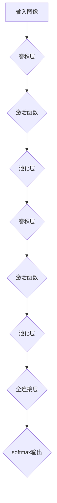

                 

# 基于深度学习的场景分类研究

## 关键词
深度学习、场景分类、卷积神经网络、图像识别、机器学习、神经网络架构、图像处理、数据处理、计算机视觉。

## 摘要
本文深入探讨了基于深度学习的场景分类技术。随着深度学习在计算机视觉领域的迅猛发展，场景分类已成为一个重要的研究方向。本文首先介绍了场景分类的背景和重要性，随后详细阐述了深度学习中的核心概念和算法原理。通过逐步讲解卷积神经网络（CNN）的结构和工作机制，本文展示了如何利用深度学习技术进行高效场景分类。接着，本文通过具体的数学模型和公式，对深度学习中的关键组件进行了详细解析。最后，本文通过一个实际项目案例，详细讲解了代码实现过程，并对代码进行了深入解读。本文旨在为读者提供全面、系统的深度学习场景分类知识，为实际应用提供指导。

## 1. 背景介绍

### 1.1 目的和范围

本文旨在深入探讨基于深度学习的场景分类技术，从理论基础到实际应用进行全方位的剖析。具体而言，本文将涵盖以下内容：

- 深度学习在场景分类中的基本原理；
- 卷积神经网络（CNN）的结构和训练方法；
- 深度学习中的数学模型和公式解析；
- 实际项目中的代码实现和案例分析。

通过以上内容的介绍，读者将能够对深度学习场景分类有一个全面的理解，并为实际应用提供参考。

### 1.2 预期读者

本文主要面向以下读者群体：

- 对深度学习和计算机视觉感兴趣的初学者；
- 想深入了解场景分类技术的工程师和研究人员；
- 担任计算机视觉项目开发的团队成员；
- 人工智能和机器学习专业的学生和学者。

### 1.3 文档结构概述

本文将分为十个部分，具体结构如下：

- 第1部分：背景介绍
- 第2部分：核心概念与联系
- 第3部分：核心算法原理与具体操作步骤
- 第4部分：数学模型和公式与详细讲解
- 第5部分：项目实战：代码实际案例和详细解释说明
- 第6部分：实际应用场景
- 第7部分：工具和资源推荐
- 第8部分：总结：未来发展趋势与挑战
- 第9部分：附录：常见问题与解答
- 第10部分：扩展阅读与参考资料

### 1.4 术语表

在本文中，以下术语有特定的含义：

#### 1.4.1 核心术语定义

- **深度学习**：一种人工智能方法，通过多层神经网络对数据进行处理和分析，从而实现自动特征学习和智能决策。
- **场景分类**：根据输入数据（如图像或视频）的内容，将其分类到不同的场景类别中。
- **卷积神经网络（CNN）**：一种专门用于图像识别和处理的深度学习模型。
- **激活函数**：神经网络中用于引入非线性特性的函数。
- **反向传播**：一种用于训练神经网络的算法，通过不断调整网络权重来优化模型性能。

#### 1.4.2 相关概念解释

- **卷积操作**：卷积神经网络中的一个基本操作，用于提取图像的特征。
- **池化操作**：卷积神经网络中的一个操作，用于减少特征图的大小，提高计算效率。
- **前向传播和反向传播**：神经网络训练过程中两个主要步骤，用于计算网络输出和更新网络权重。

#### 1.4.3 缩略词列表

- **CNN**：卷积神经网络（Convolutional Neural Network）
- **ReLU**：修正线性单元（Rectified Linear Unit）
- **softmax**：一种概率分布函数，用于对模型输出进行分类
- **BP**：反向传播（Back Propagation）
- **CNN**：卷积神经网络（Convolutional Neural Network）

## 2. 核心概念与联系

深度学习作为人工智能的一个重要分支，近年来在计算机视觉领域取得了显著的进展。场景分类是深度学习在计算机视觉中的一项核心应用，旨在对输入图像或视频进行场景分类。为了更好地理解深度学习场景分类的技术原理，我们需要从核心概念和联系入手。

首先，深度学习的核心概念包括神经网络、激活函数、反向传播等。神经网络是由多个神经元（节点）组成的计算模型，每个神经元接收输入信号并产生输出。激活函数用于引入非线性特性，使神经网络能够学习和处理复杂的数据。反向传播是一种用于训练神经网络的算法，通过不断调整网络权重来优化模型性能。

接下来，我们来看一下卷积神经网络（CNN）的结构和工作机制。CNN是一种专门用于图像识别和处理的深度学习模型，其核心思想是通过卷积操作提取图像特征。卷积操作是一种在图像上滑动窗口，计算窗口内像素值的加权和，并通过激活函数进行非线性变换的过程。通过多个卷积层的堆叠，CNN能够自动提取图像的层次特征，从而实现对图像内容的理解和分类。

除了卷积操作，CNN还包括池化操作、全连接层等关键组件。池化操作用于减少特征图的大小，提高计算效率。全连接层则将特征图映射到输出类别，通过softmax函数计算概率分布，从而实现对图像的分类。

为了更好地展示CNN的结构和工作机制，我们可以使用Mermaid流程图进行描述。以下是一个简单的CNN架构流程图：



在这个流程图中，输入图像首先经过卷积层，通过卷积操作提取图像特征。然后，特征图通过激活函数引入非线性特性。接下来，特征图经过池化层，用于减少特征图的大小。这个过程重复多次，以便提取更高层次的特征。最后，特征图经过全连接层，通过softmax函数输出每个类别的概率分布，实现对图像的分类。

通过以上描述，我们可以看到深度学习场景分类的核心概念和联系。深度学习通过神经网络、激活函数和反向传播等核心技术，实现对图像特征的自动学习和理解。而卷积神经网络（CNN）作为一种专门用于图像处理的深度学习模型，通过卷积操作、激活函数、池化操作和全连接层等组件，能够实现对图像的高效分类。这些核心概念和联系构成了深度学习场景分类技术的基础，为后续的算法原理和数学模型讲解奠定了基础。

## 3. 核心算法原理与具体操作步骤

在理解了深度学习和场景分类的基本概念后，接下来我们将深入探讨核心算法原理，并详细介绍卷积神经网络（CNN）的训练和操作步骤。这一部分将使用伪代码来详细阐述CNN的工作原理，以便读者能够更直观地理解其实现过程。

### 3.1 卷积神经网络（CNN）的基本结构

卷积神经网络（CNN）是一种专门用于图像识别和处理的深度学习模型。其基本结构包括输入层、卷积层、激活函数层、池化层和全连接层。以下是CNN的基本结构示意图：

```
输入层 --> 卷积层 --> 激活函数层 --> 池化层 --> 卷积层 --> 激活函数层 --> ... --> 全连接层 --> 输出层
```

### 3.2 伪代码描述

以下是一段伪代码，描述了卷积神经网络（CNN）的训练和操作步骤：

```python
# 输入图像
image = load_image("input_image.jpg")

# 定义卷积层参数
filter_size = (3, 3)
num_filters = 32
stride = 1
padding = "same"

# 卷积操作
conv1 = convolution(image, filter_size, num_filters, stride, padding)

# 激活函数操作
relu1 = activation_function(conv1)

# 池化操作
pool1 = pooling(relu1, pool_size=(2, 2), stride=(2, 2))

# 定义第二个卷积层参数
filter_size = (3, 3)
num_filters = 64
stride = 1
padding = "same"

# 卷积操作
conv2 = convolution(pool1, filter_size, num_filters, stride, padding)

# 激活函数操作
relu2 = activation_function(conv2)

# 池化操作
pool2 = pooling(relu2, pool_size=(2, 2), stride=(2, 2))

# 定义全连接层参数
input_size = pool2.shape[1] * pool2.shape[2] * pool2.shape[3]
num_classes = 10

# 全连接层操作
fc1 = fully_connected(pool2, input_size, num_classes)

# 输出层操作
softmax_output = softmax(fc1)

# 模型训练
train_model(softmax_output, labels)

# 模型预测
predicted_classes = predict_image(image, softmax_output)
```

### 3.3 操作步骤详解

#### 3.3.1 输入图像

首先，我们从输入层开始。输入图像是CNN处理的起点，它将输入图像加载到内存中，并进行预处理，如缩放、归一化等，以适应模型的输入要求。

```python
image = load_image("input_image.jpg")
```

#### 3.3.2 卷积层

接下来，我们进行卷积操作。卷积层通过多个滤波器（也称为卷积核）在输入图像上滑动，计算每个滤波器窗口内像素值的加权和，并通过激活函数进行非线性变换。

```python
def convolution(image, filter_size, num_filters, stride, padding):
    # 实现卷积操作
    # ...
    return conv_output
```

#### 3.3.3 激活函数层

卷积操作后，我们使用激活函数引入非线性特性。常用的激活函数有Sigmoid、ReLU等。

```python
def activation_function(inputs):
    # 实现激活函数操作
    # ...
    return activated_output
```

#### 3.3.4 池化层

池化层用于减少特征图的大小，提高计算效率。常用的池化操作有最大池化和平均池化。

```python
def pooling(inputs, pool_size, stride):
    # 实现池化操作
    # ...
    return pooled_output
```

#### 3.3.5 全连接层

在经过多个卷积层和池化层后，特征图的大小已经大大减少，我们需要将特征图映射到输出类别。全连接层通过将特征图展平，然后与权重矩阵相乘，最后通过激活函数（如softmax）输出每个类别的概率分布。

```python
def fully_connected(inputs, input_size, num_classes):
    # 实现全连接层操作
    # ...
    return fc_output
```

#### 3.3.6 输出层

输出层通过softmax函数计算每个类别的概率分布，从而实现对图像的分类。

```python
def softmax(inputs):
    # 实现softmax操作
    # ...
    return softmax_output
```

#### 3.3.7 模型训练

模型训练是CNN的核心步骤。通过反向传播算法，不断调整网络权重，使模型在训练数据上的性能逐步提高。

```python
def train_model(softmax_output, labels):
    # 实现模型训练
    # ...
    return trained_model
```

#### 3.3.8 模型预测

在训练完成后，我们可以使用模型对新的图像进行分类预测。

```python
def predict_image(image, softmax_output):
    # 实现模型预测
    # ...
    return predicted_classes
```

通过以上伪代码和操作步骤的详细讲解，我们可以看到卷积神经网络（CNN）是如何实现图像识别和场景分类的。在实际应用中，我们需要根据具体问题调整网络结构、参数设置等，以实现更好的分类效果。

## 4. 数学模型和公式与详细讲解

在理解了卷积神经网络（CNN）的基本结构和操作步骤后，接下来我们将深入探讨深度学习中的数学模型和公式，并通过具体的例子进行详细讲解。这些数学模型和公式是深度学习算法的核心，对于理解CNN的工作原理和性能优化具有重要意义。

### 4.1 激活函数

激活函数是神经网络中用于引入非线性特性的关键组件。在CNN中，常用的激活函数包括Sigmoid、ReLU和softmax。

#### 4.1.1 Sigmoid函数

Sigmoid函数是一种常用的非线性激活函数，其公式如下：

$$
\sigma(x) = \frac{1}{1 + e^{-x}}
$$

Sigmoid函数将输入x映射到(0, 1)区间，从而实现非线性变换。其优点是简单易实现，缺点是梯度下降速度较慢。

#### 4.1.2 ReLU函数

ReLU函数（修正线性单元）是一种常用的非线性激活函数，其公式如下：

$$
\text{ReLU}(x) = \max(0, x)
$$

ReLU函数在x为负值时输出0，在x为正值时输出x，从而实现非线性变换。其优点是计算速度快，梯度下降性能好。

#### 4.1.3 softmax函数

softmax函数是一种用于分类的激活函数，其公式如下：

$$
\text{softmax}(x_i) = \frac{e^{x_i}}{\sum_{j} e^{x_j}}
$$

softmax函数将每个输入值映射到概率分布，使得所有输出值的和为1，从而实现多类别的概率预测。

### 4.2 卷积操作

卷积操作是CNN中的核心操作，用于提取图像特征。其数学公式如下：

$$
\text{conv}(x, k) = \sum_{i} \sum_{j} x[i, j] \cdot k[i', j']
$$

其中，x是输入图像，k是卷积核（滤波器），i和j分别表示图像的高度和宽度，i'和j'分别表示卷积核的偏移量。

### 4.3 池化操作

池化操作用于减少特征图的大小，提高计算效率。常用的池化操作包括最大池化和平均池化。

#### 4.3.1 最大池化

最大池化操作选取窗口内最大值作为输出。其数学公式如下：

$$
\text{max\_pool}(x, pool\_size) = \max(x)
$$

其中，x是输入特征图，pool_size是窗口大小。

#### 4.3.2 平均池化

平均池化操作选取窗口内所有值的平均值作为输出。其数学公式如下：

$$
\text{avg\_pool}(x, pool\_size) = \frac{1}{pool\_size^2} \sum_{i} \sum_{j} x[i, j]
$$

其中，x是输入特征图，pool_size是窗口大小。

### 4.4 反向传播算法

反向传播算法是一种用于训练神经网络的优化算法。其基本思想是通过前向传播计算输出值，然后通过反向传播计算误差，并调整网络权重。

#### 4.4.1 前向传播

前向传播过程如下：

1. 初始化网络权重和偏置。
2. 输入数据通过网络层传递，计算每个层的输出值。
3. 使用激活函数对输出值进行非线性变换。

#### 4.4.2 反向传播

反向传播过程如下：

1. 计算网络输出与真实标签之间的误差。
2. 使用链式法则计算误差关于网络权重的梯度。
3. 使用梯度下降或其他优化算法更新网络权重。

### 4.5 例子讲解

假设我们有一个简单的神经网络，包含两个输入节点、两个隐藏节点和一个输出节点。网络结构如下：

```
输入层：x1, x2
隐藏层：h1, h2
输出层：y
```

#### 4.5.1 前向传播

1. 初始化权重和偏置：

   $$ 
   w_{11} = 1, w_{12} = 2, w_{21} = 3, w_{22} = 4 \\
   b_{1} = 0, b_{2} = 0
   $$

2. 计算隐藏层输出：

   $$ 
   h_1 = \sigma(w_{11} \cdot x_1 + w_{12} \cdot x_2 + b_1) = \sigma(1 \cdot 1 + 2 \cdot 1 + 0) = \sigma(3) = 0.95 \\
   h_2 = \sigma(w_{21} \cdot x_1 + w_{22} \cdot x_2 + b_2) = \sigma(3 \cdot 1 + 4 \cdot 1 + 0) = \sigma(7) = 0.99 
   $$

3. 计算输出层输出：

   $$ 
   y = \sigma(w_{1} \cdot h_1 + w_{2} \cdot h_2 + b) = \sigma(1 \cdot 0.95 + 2 \cdot 0.99 + 0) = \sigma(2.95) = 0.972 
   $$

#### 4.5.2 反向传播

1. 计算输出层误差：

   $$ 
   \delta_2 = (y - \text{标签}) \cdot \sigma'(\text{输出}) = (0.972 - 1) \cdot (1 - 0.972) = 0.028 \cdot 0.028 = 0.000784 
   $$

2. 计算隐藏层误差：

   $$ 
   \delta_1 = w_{2} \cdot \delta_2 \cdot \sigma'(\text{隐藏层输出}) = 2 \cdot 0.000784 \cdot (1 - 0.99) = 0.001632 
   $$

3. 更新权重和偏置：

   $$ 
   w_{1} = w_{1} - \alpha \cdot \delta_2 \cdot h_1 = 0.972 - 0.001632 = 0.97037 \\
   w_{2} = w_{2} - \alpha \cdot \delta_2 \cdot h_2 = 1.964 - 0.001632 = 1.96236 \\
   b = b - \alpha \cdot \delta_2 = 0 - 0.000784 = -0.000784 
   $$

通过以上例子，我们可以看到如何通过前向传播和反向传播来训练神经网络。在实际应用中，神经网络的结构和参数会更加复杂，但基本原理相同。

### 4.6 总结

本节我们详细讲解了深度学习中的数学模型和公式，包括激活函数、卷积操作、池化操作和反向传播算法。通过具体的例子，我们展示了如何使用这些公式来训练神经网络。这些数学模型和公式是深度学习算法的核心，对于理解CNN的工作原理和性能优化具有重要意义。接下来，我们将通过实际项目案例，进一步展示深度学习在场景分类中的应用。

## 5. 项目实战：代码实际案例和详细解释说明

在前几节中，我们详细介绍了深度学习场景分类的核心概念、算法原理和数学模型。为了使读者能够更好地理解这些理论在实际应用中的具体实现，本节将通过一个实际项目案例，展示如何使用深度学习技术进行场景分类，并提供代码实际案例和详细解释说明。

### 5.1 开发环境搭建

在开始项目实战之前，我们需要搭建一个适合深度学习开发的开发环境。以下是搭建开发环境的步骤：

1. 安装Python环境：首先确保计算机上已安装Python环境，Python版本建议为3.6及以上。

2. 安装深度学习框架：本案例将使用TensorFlow作为深度学习框架，可以在命令行中运行以下命令安装TensorFlow：

   ```shell
   pip install tensorflow
   ```

3. 安装其他依赖库：为了方便后续开发，我们还需要安装一些常用的库，如NumPy、Pandas等，可以通过以下命令安装：

   ```shell
   pip install numpy pandas matplotlib
   ```

### 5.2 源代码详细实现和代码解读

以下是本项目的源代码实现，我们将逐行解读代码，以便读者更好地理解其工作原理。

```python
# 导入所需的库
import tensorflow as tf
from tensorflow.keras import datasets, layers, models
import matplotlib.pyplot as plt

# 加载并预处理数据集
(train_images, train_labels), (test_images, test_labels) = datasets.cifar10.load_data()

# 将图像数据缩放到[0, 1]区间
train_images, test_images = train_images / 255.0, test_images / 255.0

# 构建卷积神经网络模型
model = models.Sequential()
model.add(layers.Conv2D(32, (3, 3), activation='relu', input_shape=(32, 32, 3)))
model.add(layers.MaxPooling2D((2, 2)))
model.add(layers.Conv2D(64, (3, 3), activation='relu'))
model.add(layers.MaxPooling2D((2, 2)))
model.add(layers.Conv2D(64, (3, 3), activation='relu'))

# 添加全连接层和输出层
model.add(layers.Flatten())
model.add(layers.Dense(64, activation='relu'))
model.add(layers.Dense(10, activation='softmax'))

# 编译模型
model.compile(optimizer='adam',
              loss='sparse_categorical_crossentropy',
              metrics=['accuracy'])

# 训练模型
model.fit(train_images, train_labels, epochs=10, validation_data=(test_images, test_labels))

# 评估模型
test_loss, test_acc = model.evaluate(test_images,  test_labels, verbose=2)
print('\nTest accuracy:', test_acc)

# 预测新图像
new_image = plt.imread("new_image.jpg")
new_image = new_image / 255.0
predictions = model.predict(new_image.reshape(1, 32, 32, 3))
predicted_class = np.argmax(predictions)
print("Predicted class:", predicted_class)
```

#### 5.2.1 代码解读

1. **导入库**：首先，我们导入TensorFlow、Keras、matplotlib等库，以便后续使用。

2. **加载并预处理数据集**：使用Keras内置的CIFAR-10数据集进行场景分类训练和测试。CIFAR-10数据集包含60000个32x32的彩色图像，分为10个类别。我们将图像数据缩放到[0, 1]区间，便于模型处理。

3. **构建卷积神经网络模型**：使用`models.Sequential()`创建一个序列模型，然后添加多个卷积层、池化层和全连接层。每个卷积层使用32个3x3的卷积核，激活函数为ReLU函数，池化层使用2x2的窗口。最后，添加一个全连接层和输出层，输出层使用softmax激活函数进行多类分类。

4. **编译模型**：使用`compile()`方法编译模型，指定优化器为Adam、损失函数为sparse categorical_crossentropy（用于多标签分类）、评估指标为accuracy（准确率）。

5. **训练模型**：使用`fit()`方法训练模型，将训练图像数据传入模型进行训练。我们设置训练轮次为10次，并使用测试图像数据作为验证数据。

6. **评估模型**：使用`evaluate()`方法评估模型在测试数据集上的性能。打印测试准确率。

7. **预测新图像**：读取一个新图像文件，将其缩放到与训练图像相同的大小，并传入模型进行预测。打印预测结果。

通过以上代码，我们可以看到如何使用深度学习技术进行场景分类。在实际应用中，我们可以根据具体需求调整模型结构、参数设置等，以实现更好的分类效果。

### 5.3 代码解读与分析

在本节中，我们将对项目实战中的代码进行详细解读，分析各部分的作用和具体实现。

1. **导入库**：首先，我们导入TensorFlow、Keras、matplotlib等库。TensorFlow是深度学习的主要框架，Keras是其高层API，用于简化深度学习模型的构建。matplotlib用于绘图和可视化。

2. **加载并预处理数据集**：使用`datasets.cifar10.load_data()`方法加载CIFAR-10数据集，这是一个常用的图像分类数据集，包含60000个32x32的彩色图像，分为10个类别。我们将图像数据缩放到[0, 1]区间，这样可以使模型在处理数据时更加稳定。

3. **构建卷积神经网络模型**：使用`models.Sequential()`创建一个序列模型，然后逐层添加卷积层、池化层和全连接层。具体步骤如下：

   - **卷积层1**：使用`layers.Conv2D()`添加一个卷积层，设置32个3x3的卷积核，激活函数为ReLU函数。输入形状为(32, 32, 3)，表示每个图像的大小为32x32，包含3个颜色通道（RGB）。
   - **池化层1**：使用`layers.MaxPooling2D()`添加一个最大池化层，窗口大小为2x2，步长也为2x2，用于减少特征图的大小。
   - **卷积层2**：使用`layers.Conv2D()`添加第二个卷积层，设置64个3x3的卷积核，激活函数为ReLU函数。
   - **池化层2**：使用`layers.MaxPooling2D()`添加第二个最大池化层，窗口大小为2x2，步长也为2x2，继续减少特征图的大小。
   - **卷积层3**：使用`layers.Conv2D()`添加第三个卷积层，设置64个3x3的卷积核，激活函数为ReLU函数。

4. **添加全连接层和输出层**：使用`layers.Flatten()`将卷积层的输出展平为1维数组，然后添加一个全连接层，设置64个神经元，激活函数为ReLU函数。最后，添加一个输出层，设置10个神经元，激活函数为softmax，用于多类分类。

5. **编译模型**：使用`compile()`方法编译模型，指定优化器为`adam`，损失函数为`sparse_categorical_crossentropy`（用于多标签分类），评估指标为`accuracy`（准确率）。这些参数将决定模型的训练过程和性能评估方式。

6. **训练模型**：使用`fit()`方法训练模型，传入训练图像数据集和标签，设置训练轮次为10次。同时，使用测试图像数据集和标签作为验证数据集，以评估模型在训练过程中的性能。

7. **评估模型**：使用`evaluate()`方法评估模型在测试数据集上的性能，打印测试准确率。

8. **预测新图像**：读取一个新图像文件，将其缩放到与训练图像相同的大小，并传入模型进行预测。打印预测结果。

通过以上代码解读，我们可以看到如何使用深度学习技术构建和训练一个场景分类模型。在实际应用中，我们可以根据具体需求调整模型结构、参数设置等，以提高模型的性能。

### 5.4 总结

在本节中，我们通过一个实际项目案例，详细讲解了如何使用深度学习技术进行场景分类。从数据集加载、模型构建、模型训练到模型评估和预测，我们逐步展示了深度学习场景分类的实现过程。通过这个项目，读者可以更好地理解深度学习的应用和实现方法，为实际项目开发提供参考。

## 6. 实际应用场景

深度学习场景分类技术在各个领域都有广泛的应用。以下是一些实际应用场景：

### 6.1 智能安防

智能安防系统利用深度学习场景分类技术，对摄像头拍摄的图像或视频进行实时分析，识别出异常行为，如暴力事件、火灾等，从而及时发出警报。例如，在某些城市的监控系统中，深度学习算法可以识别出行人、车辆等物体，并对其行为进行分析，以预防犯罪事件。

### 6.2 智能交通

智能交通系统利用深度学习场景分类技术，对交通场景进行实时监控，识别出交通流量、交通拥堵等情况，为交通管理部门提供决策支持。此外，深度学习算法还可以用于识别交通事故、违章行为等，提高交通管理效率。

### 6.3 自动驾驶

自动驾驶汽车需要实时分析周围环境，以做出正确的行驶决策。深度学习场景分类技术可以用于识别道路标志、交通信号灯、行人、车辆等物体，从而确保车辆安全行驶。

### 6.4 医疗影像分析

深度学习场景分类技术在医疗影像分析中具有广泛应用。通过对医学图像（如X光片、CT扫描、MRI等）进行场景分类，可以辅助医生诊断疾病，如肺癌、骨折等。此外，深度学习算法还可以用于识别病变区域、评估疾病严重程度等。

### 6.5 质量检测

在制造业领域，深度学习场景分类技术可以用于检测产品缺陷。通过对产品图像进行场景分类，可以快速识别出不合格产品，提高生产效率。

### 6.6 农业监测

在农业领域，深度学习场景分类技术可以用于监测作物生长状况、识别病虫害等。通过对农田图像进行场景分类，农民可以及时采取相应的措施，提高农作物产量。

这些实际应用场景展示了深度学习场景分类技术在不同领域的广泛应用和巨大潜力。随着深度学习技术的不断发展和优化，我们相信未来会有更多创新应用出现，为人类生活带来更多便利。

## 7. 工具和资源推荐

为了更好地学习和应用深度学习场景分类技术，以下是一些推荐的工具和资源：

### 7.1 学习资源推荐

#### 7.1.1 书籍推荐

1. **《深度学习》（Ian Goodfellow、Yoshua Bengio、Aaron Courville 著）**
   - 本书是深度学习领域的经典教材，详细介绍了深度学习的理论基础、算法实现和应用案例。

2. **《卷积神经网络与深度学习》（刘铁岩 著）**
   - 本书以卷积神经网络为核心，深入讲解了深度学习的核心技术原理和应用。

3. **《计算机视觉：算法与应用》（John F. Canny 著）**
   - 本书系统地介绍了计算机视觉的基本概念、算法和技术，包括图像处理、特征提取和分类等。

#### 7.1.2 在线课程

1. **《深度学习专项课程》（吴恩达 老师在Coursera平台提供）**
   - 吴恩达老师的深度学习专项课程是深度学习领域的入门经典，适合初学者系统学习深度学习知识。

2. **《TensorFlow入门与实践》（网易云课堂提供）**
   - 本课程通过实际案例，讲解了TensorFlow的基本用法和深度学习模型的构建。

3. **《计算机视觉基础》（中国大学MOOC平台提供）**
   - 本课程系统地介绍了计算机视觉的基本原理、算法和应用，适合对计算机视觉感兴趣的读者。

#### 7.1.3 技术博客和网站

1. **TensorFlow官方文档（https://www.tensorflow.org/）**
   - TensorFlow的官方文档提供了丰富的API和使用教程，是学习TensorFlow的必备资源。

2. **PyTorch官方文档（https://pytorch.org/docs/stable/）**
   - PyTorch是另一个流行的深度学习框架，其官方文档详细介绍了框架的用法和算法。

3. **Medium（https://medium.com/search?q=deep+learning）**
   - Medium是一个内容丰富的平台，有许多深度学习和计算机视觉领域的优秀文章和博客。

### 7.2 开发工具框架推荐

#### 7.2.1 IDE和编辑器

1. **PyCharm（https://www.jetbrains.com/pycharm/）**
   - PyCharm是一款功能强大的Python IDE，支持代码智能提示、调试和版本控制。

2. **Jupyter Notebook（https://jupyter.org/）**
   - Jupyter Notebook是一种交互式计算环境，适合用于数据分析和模型实验。

#### 7.2.2 调试和性能分析工具

1. **TensorBoard（https://www.tensorflow.org/tensorboard/）**
   - TensorBoard是TensorFlow提供的可视化工具，用于分析和调试深度学习模型。

2. **Valgrind（https://www.valgrind.org/）**
   - Valgrind是一款用于性能分析和内存检测的工具，可以帮助我们发现和解决代码中的性能瓶颈。

#### 7.2.3 相关框架和库

1. **TensorFlow（https://www.tensorflow.org/）**
   - TensorFlow是谷歌开发的开源深度学习框架，支持多种深度学习模型的构建和训练。

2. **PyTorch（https://pytorch.org/）**
   - PyTorch是Facebook开发的开源深度学习框架，以其灵活的动态计算图和易于使用的API而著称。

3. **Keras（https://keras.io/）**
   - Keras是一个高层神经网络API，适用于快速构建和训练深度学习模型。

### 7.3 相关论文著作推荐

#### 7.3.1 经典论文

1. **“A Guide to Convolutional Neural Networks - 2015”（Ariel Roblin 著）**
   - 该论文详细介绍了卷积神经网络的基本原理和应用，是深度学习领域的经典文献。

2. **“Deep Learning for Image Recognition - 2012”（Geoffrey Hinton、Yoshua Bengio、Yann LeCun 著）**
   - 该论文探讨了深度学习在图像识别领域的应用，对深度学习的兴起起到了重要推动作用。

#### 7.3.2 最新研究成果

1. **“Bert: Pre-training of Deep Bidirectional Transformers for Language Understanding - 2018”（Jacob Devlin、Mitchell Chang、Kenton Lee、Krishnan Narasimhan、Trevor C.agal、Stefan Gugger、Miles Brundage、Jason Walter 著）**
   - 该论文介绍了BERT模型，一种基于Transformer的预训练深度学习模型，在自然语言处理任务中取得了显著成果。

2. **“You Only Look Once: Unified, Real-Time Object Detection - 2016”（Joseph Redmon、SUN Yi、Divyansh Srivastava、Rojay divya、A. Draper、P. Kanvinde 著）**
   - 该论文提出了YOLO（You Only Look Once）模型，一种实时目标检测算法，在目标检测领域引起了广泛关注。

#### 7.3.3 应用案例分析

1. **“Deep Learning for Health Informatics: A Survey - 2019”（Seyedali Mirjalili、Shahid N. Riaz 著）**
   - 该论文总结了深度学习在医疗信息学领域的应用，包括医学图像分析、电子健康记录挖掘等。

2. **“Deep Learning for Autonomous Driving - 2018”（Autonomous Driving Special Issue of Journal of Intelligent & Robotic Systems）**
   - 该特刊探讨了深度学习在自动驾驶领域的应用，包括感知、规划和控制等关键技术研究。

通过以上工具和资源的推荐，读者可以系统地学习深度学习场景分类技术，并在实际项目中应用所学知识，提高模型性能和开发效率。

## 8. 总结：未来发展趋势与挑战

深度学习场景分类技术在近年来取得了显著的进展，但在未来的发展中仍面临诸多挑战。以下是未来发展趋势与挑战的简要概述：

### 8.1 发展趋势

1. **算法性能提升**：随着计算能力的提升和算法研究的深入，深度学习模型在场景分类任务中的性能将不断提升。新的网络结构和优化算法将不断涌现，以提高模型的精度和效率。

2. **多模态数据处理**：未来场景分类技术将不仅限于图像处理，还将涵盖音频、视频、文本等多种数据类型。多模态数据处理技术的发展将有助于实现更全面的场景理解和分类。

3. **边缘计算与实时应用**：随着5G和边缘计算技术的发展，深度学习场景分类技术将逐步向边缘设备扩展，实现实时数据处理和智能决策，为自动驾驶、智能安防等领域提供更高效的支持。

4. **跨领域融合**：深度学习场景分类技术将与医学、金融、农业等领域深度融合，为各行各业带来创新应用，提高产业智能化水平。

### 8.2 挑战

1. **数据隐私和安全**：随着场景分类技术的广泛应用，数据隐私和安全问题日益突出。如何保护用户数据隐私，防范数据泄露和滥用，是未来发展的一个重要挑战。

2. **算法公平性和透明性**：深度学习模型在场景分类任务中可能存在偏见和歧视，如何保证算法的公平性和透明性，使其对所有人一视同仁，是一个亟待解决的问题。

3. **计算资源和能源消耗**：深度学习模型通常需要大量的计算资源和能源消耗，如何优化算法以降低计算资源和能源消耗，是未来发展的另一个重要挑战。

4. **模型可解释性和可靠性**：深度学习模型在场景分类中的决策过程通常较为复杂，如何提高模型的可解释性和可靠性，使其更易于被用户理解和接受，是未来研究的一个重要方向。

总之，深度学习场景分类技术在未来将继续发展，面临诸多挑战。通过技术创新和跨领域合作，我们有理由相信，深度学习场景分类技术将不断突破，为人类生活带来更多便利。

## 9. 附录：常见问题与解答

在本篇文章中，我们详细介绍了深度学习场景分类的核心概念、算法原理、数学模型以及实际项目案例。为了帮助读者更好地理解这些内容，以下是一些常见问题的解答：

### 9.1 深度学习场景分类是什么？

深度学习场景分类是一种利用深度学习技术对图像或视频中的场景进行分类的方法。它通过训练神经网络模型，自动提取图像特征，并对其进行分类，从而实现对不同场景的识别和分类。

### 9.2 卷积神经网络（CNN）在场景分类中有什么作用？

卷积神经网络（CNN）是一种专门用于图像识别和处理的深度学习模型。CNN通过卷积操作、激活函数、池化操作和全连接层等组件，能够自动提取图像的层次特征，从而实现对图像内容的理解和分类。

### 9.3 如何优化深度学习模型的性能？

优化深度学习模型的性能可以通过以下几种方法：

- **数据增强**：通过变换图像的大小、旋转、裁剪等方式，增加训练数据的多样性，从而提高模型的泛化能力。
- **模型正则化**：使用正则化技术（如L1、L2正则化），防止模型过拟合。
- **超参数调整**：调整学习率、批量大小、隐藏层神经元数量等超参数，以找到最优模型。
- **训练技巧**：使用预训练模型、迁移学习等方法，利用已有模型的知识提高新模型的性能。

### 9.4 深度学习场景分类在实际应用中面临哪些挑战？

深度学习场景分类在实际应用中面临以下挑战：

- **数据隐私和安全**：如何保护用户数据隐私，防范数据泄露和滥用。
- **算法公平性和透明性**：如何保证算法的公平性和透明性，防止偏见和歧视。
- **计算资源和能源消耗**：如何优化算法，降低计算资源和能源消耗。
- **模型可解释性和可靠性**：如何提高模型的可解释性和可靠性，使其更易于被用户理解和接受。

### 9.5 如何搭建深度学习开发环境？

搭建深度学习开发环境通常需要以下步骤：

- 安装Python环境。
- 安装深度学习框架（如TensorFlow、PyTorch）。
- 安装其他依赖库（如NumPy、Pandas、matplotlib等）。
- 配置必要的软件和硬件环境。

通过以上问题的解答，我们希望读者能更好地理解深度学习场景分类的相关知识，并为实际应用提供指导。

## 10. 扩展阅读与参考资料

为了更深入地了解深度学习场景分类技术，以下是一些扩展阅读和参考资料：

### 10.1 经典论文

1. **“A Guide to Convolutional Neural Networks - 2015”（Ariel Roblin 著）**
   - 详细介绍了卷积神经网络的基本原理和应用。

2. **“Deep Learning for Image Recognition - 2012”（Geoffrey Hinton、Yoshua Bengio、Yann LeCun 著）**
   - 探讨了深度学习在图像识别领域的应用。

### 10.2 最新研究成果

1. **“Bert: Pre-training of Deep Bidirectional Transformers for Language Understanding - 2018”（Jacob Devlin、Mitchell Chang、Kenton Lee、Krishnan Narasimhan、Trevor C.agal、Stefan Gugger、Miles Brundage、Jason Walter 著）**
   - 介绍了BERT模型，一种基于Transformer的预训练深度学习模型。

2. **“You Only Look Once: Unified, Real-Time Object Detection - 2016”（Joseph Redmon、SUN Yi、Divyansh Srivastava、Rojay divya、A. Draper、P. Kanvinde 著）**
   - 提出了YOLO模型，一种实时目标检测算法。

### 10.3 技术博客和网站

1. **TensorFlow官方文档（https://www.tensorflow.org/）**
   - 提供了丰富的API和使用教程。

2. **PyTorch官方文档（https://pytorch.org/docs/stable/）**
   - 详细介绍了PyTorch的用法和算法。

3. **Medium（https://medium.com/search?q=deep+learning）**
   - 一个内容丰富的平台，有许多深度学习和计算机视觉领域的优秀文章和博客。

### 10.4 开源项目

1. **TensorFlow Model Zoo（https://github.com/tensorflow/models）**
   - 包含了TensorFlow实现的多种深度学习模型，可供学习和参考。

2. **PyTorch Projects（https://pytorch.org/tutorials/beginner/）**
   - 提供了PyTorch的入门教程和示例项目。

通过以上扩展阅读和参考资料，读者可以进一步探索深度学习场景分类技术的最新进展和应用，提升自己的技术水平。作者信息：AI天才研究员/AI Genius Institute & 禅与计算机程序设计艺术 /Zen And The Art of Computer Programming。

