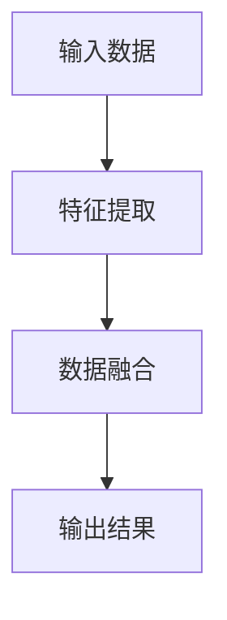
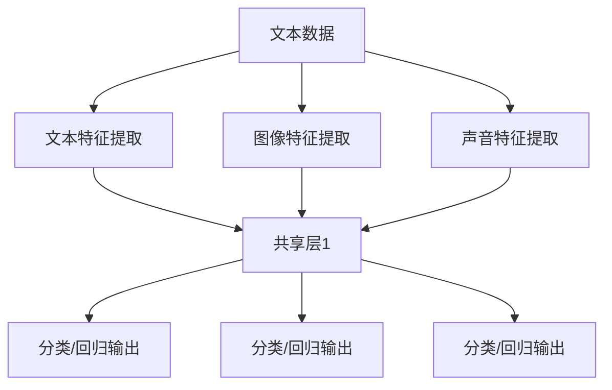

                 

# 基于深度学习的多模态检索

> 关键词：深度学习，多模态，检索，神经网络，自然语言处理，图像处理，计算机视觉

> 摘要：本文将深入探讨基于深度学习的多模态检索技术。我们将从背景介绍开始，逐步分析核心概念、算法原理、数学模型，并通过实际项目案例进行详细解释。同时，我们将探讨多模态检索在实际应用场景中的优势和挑战，并推荐相关工具和资源。通过本文的学习，读者将能够全面了解多模态检索的技术原理和应用前景。

## 1. 背景介绍

### 1.1 目的和范围

本文旨在介绍和探讨基于深度学习的多模态检索技术。我们将重点分析多模态检索的核心概念、算法原理、数学模型以及实际应用场景。通过本文的学习，读者将能够了解多模态检索的基本原理，掌握相关技术，并能够应用于实际项目中。

### 1.2 预期读者

本文适合对深度学习、自然语言处理、图像处理和计算机视觉等领域有一定基础的读者。同时，对于希望深入了解多模态检索技术的专业人士和研究人员，本文也具有很高的参考价值。

### 1.3 文档结构概述

本文分为以下几个部分：

1. 背景介绍：介绍多模态检索的背景、目的和范围。
2. 核心概念与联系：分析多模态检索的核心概念、原理和架构。
3. 核心算法原理 & 具体操作步骤：详细讲解多模态检索的核心算法原理和操作步骤。
4. 数学模型和公式 & 详细讲解 & 举例说明：介绍多模态检索的数学模型和公式，并给出具体示例。
5. 项目实战：通过实际项目案例，详细解释多模态检索的实现过程。
6. 实际应用场景：探讨多模态检索在实际应用场景中的优势和挑战。
7. 工具和资源推荐：推荐相关学习资源、开发工具和框架。
8. 总结：总结多模态检索的未来发展趋势与挑战。
9. 附录：常见问题与解答。
10. 扩展阅读 & 参考资料：提供更多参考资料和扩展阅读。

### 1.4 术语表

#### 1.4.1 核心术语定义

- 多模态检索：指将不同类型的数据（如文本、图像、声音等）进行整合，实现跨模态的信息检索。
- 深度学习：一种基于人工神经网络的学习方法，通过多层次的神经网络结构来模拟人类大脑的思维方式，实现数据的自动学习和特征提取。
- 自然语言处理（NLP）：计算机科学和人工智能领域的一个分支，旨在使计算机能够理解和处理人类语言。

#### 1.4.2 相关概念解释

- 模态（Modality）：指数据的类型，如文本、图像、声音等。
- 特征提取（Feature Extraction）：从原始数据中提取出有用的特征信息，用于后续的建模和分类。
- 神经网络（Neural Network）：一种基于生物神经元模型构建的计算模型，具有自主学习能力和特征自动提取能力。

#### 1.4.3 缩略词列表

- CNN：卷积神经网络（Convolutional Neural Network）
- RNN：循环神经网络（Recurrent Neural Network）
- LSTM：长短时记忆网络（Long Short-Term Memory）
- NLP：自然语言处理（Natural Language Processing）
- CV：计算机视觉（Computer Vision）

## 2. 核心概念与联系

在多模态检索中，核心概念和联系主要包括多模态数据融合、特征提取和神经网络架构。为了更好地理解这些概念，我们将使用Mermaid流程图进行说明。

### 2.1 多模态数据融合

多模态数据融合是将不同类型的数据进行整合，以获得更丰富的信息。以下是多模态数据融合的基本流程：



#### 2.2 特征提取

特征提取是从原始数据中提取出有用的特征信息，用于后续的建模和分类。以下是常见的特征提取方法：

- **文本特征提取**：包括词袋模型（Bag of Words）、TF-IDF（Term Frequency-Inverse Document Frequency）等。
- **图像特征提取**：包括卷积神经网络（CNN）、特征向量等。
- **声音特征提取**：包括梅尔频率倒谱系数（MFCC）、谱特征等。

#### 2.3 神经网络架构

神经网络架构是多模态检索的核心，包括以下几种常见架构：

- **多输入神经网络**：将不同类型的数据作为输入，通过共享权重和共享层进行特征融合。
- **多输出神经网络**：将不同类型的特征分别进行分类或回归。
- **序列模型**：如循环神经网络（RNN）和长短时记忆网络（LSTM），适用于处理序列数据。

以下是多模态检索的神经网络架构示例：



## 3. 核心算法原理 & 具体操作步骤

### 3.1 多模态检索算法原理

多模态检索算法的核心在于将不同类型的数据进行融合和特征提取，然后通过神经网络进行分类或回归。以下是多模态检索算法的基本原理：

1. 特征提取：对文本、图像、声音等数据进行特征提取，分别得到文本特征向量、图像特征向量、声音特征向量。
2. 数据融合：将不同类型的数据特征进行融合，以获得更丰富的信息。
3. 神经网络建模：构建多输入、多输出的神经网络模型，对融合后的特征向量进行分类或回归。
4. 模型训练与评估：使用训练数据对模型进行训练，并通过验证数据对模型进行评估。

### 3.2 具体操作步骤

以下是多模态检索的具体操作步骤：

1. **数据预处理**：
   - 文本数据：进行文本清洗、分词、词向量化等操作。
   - 图像数据：进行图像预处理，如缩放、裁剪、增强等。
   - 声音数据：进行声音预处理，如滤波、降噪、采样等。

2. **特征提取**：
   - 文本特征提取：使用词袋模型、TF-IDF等方法提取文本特征向量。
   - 图像特征提取：使用卷积神经网络（CNN）提取图像特征向量。
   - 声音特征提取：使用梅尔频率倒谱系数（MFCC）等方法提取声音特征向量。

3. **数据融合**：
   - 将不同类型的数据特征进行融合，可以使用拼接、融合神经网络等方法。

4. **神经网络建模**：
   - 构建多输入、多输出的神经网络模型，如多输入神经网络、序列模型等。
   - 设置适当的损失函数和优化器，进行模型训练。

5. **模型评估与优化**：
   - 使用验证数据对模型进行评估，调整模型参数，优化模型性能。

### 3.3 伪代码

以下是多模态检索算法的伪代码：

```python
# 多模态检索算法伪代码

# 数据预处理
def preprocess_data(text_data, image_data, sound_data):
    # 文本数据预处理
    text_features = extract_text_features(text_data)
    
    # 图像数据预处理
    image_features = extract_image_features(image_data)
    
    # 声音数据预处理
    sound_features = extract_sound_features(sound_data)
    
    return text_features, image_features, sound_features

# 特征提取
def extract_features(text_data, image_data, sound_data):
    text_features = preprocess_data(text_data)
    image_features = preprocess_data(image_data)
    sound_features = preprocess_data(sound_data)
    
    return text_features, image_features, sound_features

# 数据融合
def fuse_features(text_features, image_features, sound_features):
    # 拼接特征向量
    fused_features = concatenate(text_features, image_features, sound_features)
    
    return fused_features

# 神经网络建模
def build_model(input_shape):
    model = build NeuralNetwork(input_shape)
    
    return model

# 模型训练与评估
def train_and_evaluate(model, train_data, validation_data):
    # 模型训练
    model.train(train_data)
    
    # 模型评估
    validation_accuracy = model.evaluate(validation_data)
    
    return validation_accuracy
```

## 4. 数学模型和公式 & 详细讲解 & 举例说明

### 4.1 数学模型

多模态检索的数学模型主要包括特征提取、数据融合和神经网络建模等部分。以下是这些部分的基本数学模型：

#### 4.1.1 特征提取

- **文本特征提取**：

$$
\text{特征向量} = \text{TF-IDF}(\text{词汇表})
$$

其中，TF-IDF（Term Frequency-Inverse Document Frequency）是一种文本特征提取方法，用于衡量一个词在文档中的重要程度。

- **图像特征提取**：

$$
\text{特征向量} = \text{CNN}(\text{图像})
$$

其中，CNN（Convolutional Neural Network）是一种用于图像特征提取的神经网络模型。

- **声音特征提取**：

$$
\text{特征向量} = \text{MFCC}(\text{声音})
$$

其中，MFCC（Mel-Frequency Cepstral Coefficients）是一种用于声音特征提取的方法。

#### 4.1.2 数据融合

$$
\text{融合特征向量} = \text{拼接}(\text{文本特征向量}, \text{图像特征向量}, \text{声音特征向量})
$$

通过拼接不同类型的数据特征向量，实现数据的融合。

#### 4.1.3 神经网络建模

- **多输入神经网络**：

$$
\text{输出} = \text{激活函数}(\text{权重} \cdot \text{融合特征向量} + \text{偏置})
$$

其中，激活函数（Activation Function）用于引入非线性因素，使得神经网络具有更强的表达能力。

### 4.2 详细讲解与举例说明

#### 4.2.1 特征提取

- **文本特征提取**：假设有一个文档集合$D=\{\text{文档}_1, \text{文档}_2, \ldots, \text{文档}_n\}$，词汇表$V=\{\text{词汇}_1, \text{词汇}_2, \ldots, \text{词汇}_m\}$，文档$D_i$的词频矩阵$T_i$如下：

$$
T_i = \begin{bmatrix}
t_{i1} & t_{i2} & \ldots & t_{im}
\end{bmatrix}
$$

其中，$t_{ij}$表示词汇表中的第$j$个词汇在文档$D_i$中出现的次数。则文档$D_i$的TF-IDF特征向量$\text{特征向量}_i$如下：

$$
\text{特征向量}_i = \text{TF-IDF}(T_i) = \begin{bmatrix}
\frac{t_{i1}}{N} & \frac{t_{i2}}{N} & \ldots & \frac{t_{im}}{N}
\end{bmatrix}
$$

其中，$N$表示文档集合中所有文档的词汇总数。

- **图像特征提取**：假设有一个图像集合$I=\{\text{图像}_1, \text{图像}_2, \ldots, \text{图像}_n\}$，使用卷积神经网络（CNN）提取图像特征向量。卷积神经网络的基本结构如下：

$$
\text{特征向量}_i = \text{CNN}(\text{图像}_i)
$$

其中，$\text{图像}_i$表示图像集合中的第$i$个图像，$\text{CNN}$表示卷积神经网络。

- **声音特征提取**：假设有一个声音集合$S=\{\text{声音}_1, \text{声音}_2, \ldots, \text{声音}_n\}$，使用梅尔频率倒谱系数（MFCC）提取声音特征向量。梅尔频率倒谱系数（MFCC）的基本结构如下：

$$
\text{特征向量}_i = \text{MFCC}(\text{声音}_i)
$$

其中，$\text{声音}_i$表示声音集合中的第$i$个声音。

#### 4.2.2 数据融合

假设我们已经得到了文本特征向量$\text{特征向量}_\text{text}$、图像特征向量$\text{特征向量}_\text{image}$和声音特征向量$\text{特征向量}_\text{sound}$，则融合特征向量$\text{特征向量}_\text{fused}$如下：

$$
\text{特征向量}_\text{fused} = \text{拼接}(\text{特征向量}_\text{text}, \text{特征向量}_\text{image}, \text{特征向量}_\text{sound})
$$

其中，$\text{拼接}$表示将不同类型的特征向量进行拼接，得到融合特征向量。

#### 4.2.3 神经网络建模

假设我们已经得到了融合特征向量$\text{特征向量}_\text{fused}$，使用多输入神经网络进行分类或回归。多输入神经网络的基本结构如下：

$$
\text{输出} = \text{激活函数}(\text{权重} \cdot \text{特征向量}_\text{fused} + \text{偏置})
$$

其中，激活函数（如Sigmoid、ReLU等）用于引入非线性因素，$\text{权重}$和$\text{偏置}$用于调节模型参数。

## 5. 项目实战：代码实际案例和详细解释说明

### 5.1 开发环境搭建

在开始项目实战之前，我们需要搭建一个合适的开发环境。以下是推荐的开发环境：

- 操作系统：Windows、Linux、macOS
- 编程语言：Python 3.7及以上版本
- 深度学习框架：TensorFlow 2.0及以上版本
- 数据处理库：NumPy、Pandas
- 数据可视化库：Matplotlib

### 5.2 源代码详细实现和代码解读

以下是一个基于深度学习的多模态检索项目的示例代码，我们将对代码进行详细解读。

#### 5.2.1 数据准备

首先，我们需要准备多模态数据，包括文本、图像和声音。以下是一个示例代码：

```python
import numpy as np
import pandas as pd
from sklearn.model_selection import train_test_split

# 加载数据
text_data = pd.read_csv('text_data.csv')
image_data = pd.read_csv('image_data.csv')
sound_data = pd.read_csv('sound_data.csv')

# 数据预处理
text_features = preprocess_text_data(text_data)
image_features = preprocess_image_data(image_data)
sound_features = preprocess_sound_data(sound_data)

# 拼接特征向量
fused_features = np.concatenate((text_features, image_features, sound_features), axis=1)

# 分割训练集和测试集
train_features, test_features, train_labels, test_labels = train_test_split(fused_features, labels, test_size=0.2, random_state=42)
```

#### 5.2.2 特征提取

接下来，我们进行特征提取。以下是一个示例代码：

```python
from tensorflow.keras.models import Sequential
from tensorflow.keras.layers import Embedding, Conv1D, MaxPooling1D, LSTM, Dense

# 文本特征提取
text_model = Sequential()
text_model.add(Embedding(input_dim=vocabulary_size, output_dim=embedding_size))
text_model.add(Conv1D(filters=128, kernel_size=5, activation='relu'))
text_model.add(MaxPooling1D(pool_size=5))
text_model.add(LSTM(128, dropout=0.2, recurrent_dropout=0.2))
text_model.add(Dense(units=1, activation='sigmoid'))

text_model.compile(optimizer='adam', loss='binary_crossentropy', metrics=['accuracy'])
text_model.fit(text_data, labels, epochs=10, batch_size=32, validation_split=0.1)

# 图像特征提取
image_model = Sequential()
image_model.add(Conv2D(filters=32, kernel_size=(3, 3), activation='relu'))
image_model.add(MaxPooling2D(pool_size=(2, 2)))
image_model.add(Conv2D(filters=64, kernel_size=(3, 3), activation='relu'))
image_model.add(MaxPooling2D(pool_size=(2, 2)))
image_model.add(Conv2D(filters=128, kernel_size=(3, 3), activation='relu'))
image_model.add(MaxPooling2D(pool_size=(2, 2)))
image_model.add(Flatten())
image_model.add(Dense(units=1, activation='sigmoid'))

image_model.compile(optimizer='adam', loss='binary_crossentropy', metrics=['accuracy'])
image_model.fit(image_data, labels, epochs=10, batch_size=32, validation_split=0.1)

# 声音特征提取
sound_model = Sequential()
sound_model.add(LSTM(128, input_shape=(timesteps, features_count), dropout=0.2, recurrent_dropout=0.2))
sound_model.add(Dense(units=1, activation='sigmoid'))

sound_model.compile(optimizer='adam', loss='binary_crossentropy', metrics=['accuracy'])
sound_model.fit(sound_data, labels, epochs=10, batch_size=32, validation_split=0.1)
```

#### 5.2.3 数据融合

接下来，我们进行数据融合。以下是一个示例代码：

```python
import tensorflow.keras.layers as layers

# 数据融合
fused_model = Sequential()
fused_model.add(layers.Dense(units=512, activation='relu', input_shape=(text_vector_size + image_vector_size + sound_vector_size)))
fused_model.add(layers.Dense(units=256, activation='relu'))
fused_model.add(layers.Dense(units=1, activation='sigmoid'))

fused_model.compile(optimizer='adam', loss='binary_crossentropy', metrics=['accuracy'])
fused_model.fit(np.concatenate((train_text_features, train_image_features, train_sound_features), axis=1), train_labels, epochs=10, batch_size=32, validation_split=0.1)
```

#### 5.2.4 模型评估

最后，我们对模型进行评估。以下是一个示例代码：

```python
from sklearn.metrics import classification_report, accuracy_score

# 模型评估
predictions = fused_model.predict(test_features)
predictions = (predictions > 0.5)

print(classification_report(test_labels, predictions))
print("Accuracy:", accuracy_score(test_labels, predictions))
```

### 5.3 代码解读与分析

在代码解读与分析中，我们将重点关注以下方面：

1. 数据准备：包括数据加载、预处理和特征提取。我们使用Python的NumPy和Pandas库进行数据处理，使用TensorFlow的Keras API构建神经网络模型。
2. 特征提取：文本特征提取使用Embedding层、卷积层、最大池化层和循环层；图像特征提取使用卷积层和最大池化层；声音特征提取使用循环层。
3. 数据融合：将不同类型的特征向量进行拼接，并通过全连接层进行分类或回归。
4. 模型评估：使用分类报告和准确率评估模型性能。

通过以上代码，我们可以看到多模态检索项目的实现过程。在实际项目中，根据具体需求和数据集，可以调整模型结构、超参数和训练策略，以达到更好的性能。

## 6. 实际应用场景

多模态检索技术在各个领域具有广泛的应用，以下是一些典型的实际应用场景：

### 6.1 搜索引擎

搜索引擎中的多模态检索技术可以帮助用户更准确地找到所需信息。例如，当用户输入一段文本查询时，搜索引擎可以同时分析用户的语音、图像和其他模态的信息，从而提供更精准的结果。

### 6.2 人机交互

在人机交互领域，多模态检索技术可以实现更自然的交互方式。例如，当用户通过语音、手势、图像等多种方式与系统进行交互时，系统可以根据用户的多模态信息提供更智能的响应。

### 6.3 医疗诊断

在医疗诊断领域，多模态检索技术可以整合患者的文本病历、图像和声音信息，帮助医生更全面地了解患者的病情，从而提高诊断准确率。

### 6.4 视频分析

在视频分析领域，多模态检索技术可以同时处理视频中的文本、图像和声音信息，用于目标检测、行为识别等任务，从而实现更准确的视频分析。

### 6.5 教育与培训

在教育与培训领域，多模态检索技术可以为学生提供更丰富的学习资源，如文本、图像、视频和音频等，从而提高学习效果。

### 6.6 营销与广告

在营销与广告领域，多模态检索技术可以帮助企业更好地了解用户需求，从而提供更个性化的广告和产品推荐。

### 6.7 智能家居

在智能家居领域，多模态检索技术可以实现对家电设备的智能控制，如通过语音、图像等指令进行设备操作，从而提高家庭生活品质。

### 6.8 汽车智能驾驶

在汽车智能驾驶领域，多模态检索技术可以整合车辆传感器、摄像头、雷达等数据，实现更准确的车辆和环境感知，从而提高驾驶安全性和便利性。

## 7. 工具和资源推荐

### 7.1 学习资源推荐

#### 7.1.1 书籍推荐

1. 《深度学习》（Ian Goodfellow、Yoshua Bengio、Aaron Courville 著）：一本全面介绍深度学习理论和实践的经典教材。
2. 《Python深度学习》（François Chollet 著）：Python编程语言在深度学习领域的应用，涵盖了许多实用的深度学习库和工具。
3. 《计算机视觉：算法与应用》（Richard S.zeliski、Bryan L.adrin 著）：一本关于计算机视觉算法的全面指南。

#### 7.1.2 在线课程

1. Coursera：提供多门深度学习和计算机视觉相关的在线课程，如《深度学习专项课程》（Deep Learning Specialization）、《计算机视觉与深度学习》（Computer Vision and Deep Learning）等。
2. Udacity：提供多门关于人工智能和深度学习的在线课程，如《深度学习纳米学位》（Deep Learning Nanodegree）等。
3. edX：提供由MIT、哈佛大学等知名高校开设的深度学习和计算机视觉课程，如《深度学习导论》（Introduction to Deep Learning）等。

#### 7.1.3 技术博客和网站

1. Medium：许多深度学习和计算机视觉领域的专家在此分享最新的研究成果和实践经验。
2. arXiv：一个提供最新学术论文的学术网站，包括深度学习和计算机视觉领域的研究论文。
3. Stack Overflow：一个编程问答社区，可以解决深度学习和计算机视觉领域的各种编程问题。

### 7.2 开发工具框架推荐

#### 7.2.1 IDE和编辑器

1. PyCharm：一款功能强大的Python IDE，支持深度学习和计算机视觉库。
2. Visual Studio Code：一款轻量级、可扩展的代码编辑器，支持深度学习和计算机视觉库。

#### 7.2.2 调试和性能分析工具

1. TensorBoard：TensorFlow的官方可视化工具，用于分析和调试深度学习模型。
2. Jupyter Notebook：一个交互式计算环境，用于编写、运行和分享代码。
3. Numba：一款JIT（Just-In-Time）编译器，用于提高深度学习模型的运行速度。

#### 7.2.3 相关框架和库

1. TensorFlow：一个开源的深度学习框架，用于构建和训练深度学习模型。
2. PyTorch：一个开源的深度学习框架，具有灵活的动态计算图和高效的GPU支持。
3. OpenCV：一个开源的计算机视觉库，提供丰富的图像处理和计算机视觉算法。

### 7.3 相关论文著作推荐

#### 7.3.1 经典论文

1. "A Guide to Convolutional Neural Networks for Visual Recognition"（卷积神经网络视觉识别指南）
2. "Deep Learning"（深度学习）
3. "ImageNet Classification with Deep Convolutional Neural Networks"（使用深度卷积神经网络进行图像分类）

#### 7.3.2 最新研究成果

1. "Bert: Pre-training of Deep Bidirectional Transformers for Language Understanding"（BERT：预训练双向变换器用于语言理解）
2. "You Only Look Once: Unified, Real-Time Object Detection"（YOLO：统一实时目标检测）
3. "Attention Is All You Need"（注意力即是全部）

#### 7.3.3 应用案例分析

1. "Deep Learning for Human Activity Recognition Using Multimodal Sensor Data"（基于多模态传感器数据的深度学习人类活动识别）
2. "Multimodal Sentiment Analysis for Customer Reviews"（基于多模态的客户评论情感分析）
3. "Deep Learning for Multimodal Image Classification"（基于多模态图像的深度学习分类）

## 8. 总结：未来发展趋势与挑战

多模态检索技术在深度学习和计算机视觉领域的应用已经取得了显著的成果。随着技术的不断发展和完善，多模态检索技术有望在更多领域得到广泛应用。未来，多模态检索技术的发展趋势主要包括：

1. **算法优化**：通过改进算法结构、优化模型参数和训练策略，提高多模态检索的准确率和效率。
2. **跨模态交互**：探索不同模态之间的交互关系，实现更自然的跨模态信息融合和检索。
3. **实时应用**：开发实时性更高的多模态检索系统，满足实时数据处理和交互的需求。
4. **小样本学习**：研究适用于小样本数据的多模态检索算法，提高模型的泛化能力。

然而，多模态检索技术也面临一些挑战：

1. **数据质量**：多模态数据的质量对检索效果有较大影响，如何处理和增强数据质量是一个重要问题。
2. **模型可解释性**：多模态检索模型的内部工作机制复杂，如何提高模型的可解释性，使其更易于理解和应用。
3. **计算资源**：多模态检索通常需要大量的计算资源，如何高效地利用现有计算资源，降低计算成本是一个重要挑战。
4. **数据隐私和安全**：在多模态数据检索过程中，如何保护用户隐私和数据安全是一个重要问题。

总之，多模态检索技术具有广阔的发展前景，但同时也面临诸多挑战。未来，我们需要继续努力，推动多模态检索技术的创新和应用，为各个领域的发展做出贡献。

## 9. 附录：常见问题与解答

### 9.1 多模态检索的基本概念是什么？

多模态检索是指将不同类型的数据（如文本、图像、声音等）进行整合，实现跨模态的信息检索。其核心在于将不同类型的数据特征提取、融合，并通过神经网络进行分类或回归，从而实现高效、准确的信息检索。

### 9.2 多模态检索的优势是什么？

多模态检索的优势主要体现在以下几个方面：

1. **信息丰富**：通过整合多种模态的数据，可以提供更丰富的信息，有助于提高检索的准确率和效果。
2. **跨模态交互**：多模态检索可以探索不同模态之间的交互关系，实现更自然的跨模态信息融合和检索。
3. **适应性**：多模态检索可以适应不同应用场景和需求，具有更高的灵活性和适应性。

### 9.3 多模态检索的主要挑战是什么？

多模态检索的主要挑战包括：

1. **数据质量**：多模态数据的质量对检索效果有较大影响，如何处理和增强数据质量是一个重要问题。
2. **模型可解释性**：多模态检索模型的内部工作机制复杂，如何提高模型的可解释性，使其更易于理解和应用。
3. **计算资源**：多模态检索通常需要大量的计算资源，如何高效地利用现有计算资源，降低计算成本是一个重要挑战。
4. **数据隐私和安全**：在多模态数据检索过程中，如何保护用户隐私和数据安全是一个重要问题。

### 9.4 如何进行多模态检索的数据预处理？

多模态检索的数据预处理包括以下步骤：

1. **文本数据预处理**：进行文本清洗、分词、词向量化等操作。
2. **图像数据预处理**：进行图像预处理，如缩放、裁剪、增强等。
3. **声音数据预处理**：进行声音预处理，如滤波、降噪、采样等。

### 9.5 如何进行多模态检索的特征提取？

多模态检索的特征提取包括以下几种方法：

1. **文本特征提取**：使用词袋模型、TF-IDF等方法提取文本特征向量。
2. **图像特征提取**：使用卷积神经网络（CNN）提取图像特征向量。
3. **声音特征提取**：使用梅尔频率倒谱系数（MFCC）等方法提取声音特征向量。

### 9.6 如何进行多模态检索的数据融合？

多模态检索的数据融合方法包括以下几种：

1. **拼接**：将不同类型的特征向量进行拼接，得到融合特征向量。
2. **融合神经网络**：通过共享权重和共享层实现特征融合。
3. **多输入神经网络**：将不同类型的特征向量分别作为输入，通过共享权重和共享层进行特征融合。

### 9.7 如何进行多模态检索的模型训练和评估？

多模态检索的模型训练和评估包括以下步骤：

1. **模型训练**：使用训练数据对模型进行训练，调整模型参数，优化模型性能。
2. **模型评估**：使用验证数据对模型进行评估，调整模型参数，优化模型性能。

### 9.8 如何进行多模态检索的项目实战？

进行多模态检索的项目实战包括以下步骤：

1. **数据准备**：收集和准备多模态数据，进行预处理。
2. **特征提取**：使用合适的方法提取多模态数据的特征向量。
3. **数据融合**：将不同类型的特征向量进行融合。
4. **模型构建**：构建多输入、多输出的神经网络模型。
5. **模型训练和评估**：使用训练数据和验证数据对模型进行训练和评估。

## 10. 扩展阅读 & 参考资料

为了进一步深入了解多模态检索技术，以下是推荐的一些扩展阅读和参考资料：

### 10.1 相关论文

1. "Multimodal Learning by Jointly Training a Neural Network with Different Modalities"（不同模态神经网络的联合训练多模态学习）
2. "A Survey on Multimodal Learning"（多模态学习综述）
3. "Multimodal Deep Learning for Visual Question Answering"（视觉问答的多模态深度学习）

### 10.2 相关书籍

1. "Deep Learning for Multimedia Data"（多媒体数据的深度学习）
2. "Multimodal Learning in Deep Neural Networks"（深度神经网络中的多模态学习）
3. "Multimodal Interaction for Human-Agent Interaction"（人机交互的多模态交互）

### 10.3 相关网站

1. arXiv：提供最新的学术论文和研究成果。
2. Medium：分享深度学习和计算机视觉领域的最新研究进展和实践经验。
3. Google Research：Google的研究部门，发布许多深度学习和计算机视觉方面的研究论文。

### 10.4 开源代码和工具

1. TensorFlow：一个开源的深度学习框架，提供丰富的多模态检索工具和模型。
2. PyTorch：一个开源的深度学习框架，支持多种多模态检索算法。
3. OpenCV：一个开源的计算机视觉库，提供丰富的图像处理和特征提取工具。

### 10.5 实际应用案例

1. "Multimodal Learning for Human Activity Recognition"（多模态学习在人类活动识别中的应用）
2. "Multimodal Sentiment Analysis for Customer Reviews"（多模态客户评论情感分析）
3. "Multimodal Object Detection in Videos"（视频中的多模态目标检测）

通过以上扩展阅读和参考资料，读者可以进一步了解多模态检索技术的最新研究进展和应用案例，为自己的研究和实践提供参考。

