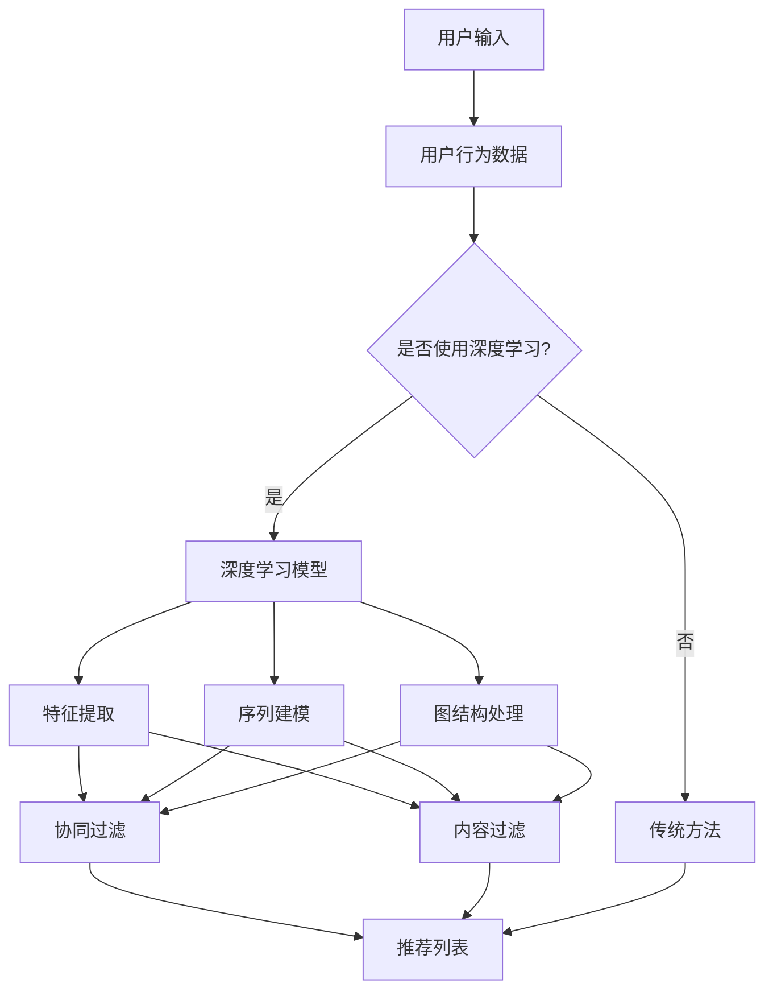

                 

# 基于深度学习的推荐系统设计与实现

> **关键词**：深度学习、推荐系统、数据挖掘、机器学习、神经网络、协同过滤、内容过滤、用户行为分析
>
> **摘要**：本文旨在深入探讨基于深度学习的推荐系统设计与实现，从基本概念到实际应用，全面解析推荐系统的核心算法和架构，为开发者提供实用指南。通过逐步分析核心概念、算法原理、数学模型以及实战案例，本文旨在帮助读者理解深度学习在推荐系统中的应用，并掌握实现推荐系统的关键技术和策略。

## 1. 背景介绍

### 1.1 目的和范围

本文的目的在于介绍深度学习在推荐系统中的应用，深入探讨其设计理念和实现方法。我们将会从以下几个方面进行展开：

- **核心概念和联系**：介绍推荐系统的基础概念及其与深度学习的关系。
- **核心算法原理**：讲解深度学习在推荐系统中的主要算法，如卷积神经网络（CNN）、循环神经网络（RNN）和图神经网络（GNN）等。
- **数学模型和公式**：详细解释推荐系统中常用的数学模型和公式，并提供实例说明。
- **项目实战**：通过实际代码案例，展示推荐系统的开发流程和关键步骤。
- **实际应用场景**：探讨深度学习推荐系统的应用场景和优势。
- **工具和资源推荐**：推荐相关学习资源、开发工具和最新研究成果。

本文适用于希望深入了解和掌握推荐系统开发的程序员、数据科学家和人工智能爱好者。

### 1.2 预期读者

- 具备一定编程基础，了解Python等编程语言。
- 对机器学习和深度学习有基本了解，熟悉神经网络的基本原理。
- 希望通过学习，掌握推荐系统设计和实现的核心技术和方法。

### 1.3 文档结构概述

本文的结构如下：

- **第1章**：背景介绍
  - **1.1 目的和范围**
  - **1.2 预期读者**
  - **1.3 文档结构概述**
  - **1.4 术语表**
    - **1.4.1 核心术语定义**
    - **1.4.2 相关概念解释**
    - **1.4.3 缩略词列表**

- **第2章**：核心概念与联系
  - **2.1 推荐系统基础概念**
  - **2.2 深度学习与推荐系统的关系**
  - **2.3 Mermaid流程图**

- **第3章**：核心算法原理 & 具体操作步骤
  - **3.1 卷积神经网络（CNN）**
  - **3.2 循环神经网络（RNN）**
  - **3.3 图神经网络（GNN）**
  - **3.4 伪代码讲解**

- **第4章**：数学模型和公式 & 详细讲解 & 举例说明
  - **4.1 推荐系统的数学模型**
  - **4.2 数学公式的详细解释**
  - **4.3 实例说明**

- **第5章**：项目实战：代码实际案例和详细解释说明
  - **5.1 开发环境搭建**
  - **5.2 源代码详细实现和代码解读**
  - **5.3 代码解读与分析**

- **第6章**：实际应用场景
  - **6.1 社交网络中的应用**
  - **6.2 电子商务中的应用**
  - **6.3 媒体推荐系统**

- **第7章**：工具和资源推荐
  - **7.1 学习资源推荐**
  - **7.2 开发工具框架推荐**
  - **7.3 相关论文著作推荐**

- **第8章**：总结：未来发展趋势与挑战
  - **8.1 发展趋势**
  - **8.2 挑战与展望**

- **第9章**：附录：常见问题与解答
  - **9.1 常见问题**
  - **9.2 解答**

- **第10章**：扩展阅读 & 参考资料

### 1.4 术语表

#### 1.4.1 核心术语定义

- **推荐系统**：一种根据用户的历史行为、兴趣和偏好，向用户推荐相关商品、内容或其他项目的人工智能系统。
- **深度学习**：一种机器学习方法，通过构建多层神经网络，对数据进行自动特征提取和表示学习。
- **协同过滤**：一种基于用户行为或偏好进行推荐的方法，通过计算用户之间的相似度来推荐项目。
- **内容过滤**：一种基于项目内容特征进行推荐的方法，通过分析项目的内容和属性来推荐相关项目。
- **用户行为分析**：一种通过分析用户在系统中的行为数据，如浏览、购买、评论等，来了解用户兴趣和需求的方法。

#### 1.4.2 相关概念解释

- **神经网络**：一种模仿人脑神经元连接结构的计算模型，通过学习输入数据和输出数据之间的关系来进行预测和分类。
- **卷积神经网络（CNN）**：一种专门用于处理图像数据的神经网络，通过卷积操作提取图像中的局部特征。
- **循环神经网络（RNN）**：一种可以处理序列数据的神经网络，通过循环结构来保留先前的状态信息。
- **图神经网络（GNN）**：一种用于处理图结构数据的神经网络，通过图卷积操作来提取节点和边之间的特征。

#### 1.4.3 缩略词列表

- **ML**：机器学习（Machine Learning）
- **DL**：深度学习（Deep Learning）
- **CNN**：卷积神经网络（Convolutional Neural Network）
- **RNN**：循环神经网络（Recurrent Neural Network）
- **GNN**：图神经网络（Graph Neural Network）
- **CF**：协同过滤（Collaborative Filtering）
- **CF**：内容过滤（Content Filtering）

## 2. 核心概念与联系

在探讨基于深度学习的推荐系统之前，我们需要明确一些核心概念及其相互之间的关系。以下是一个用Mermaid绘制的流程图，展示了推荐系统与深度学习之间的核心联系。

```mermaid
graph TB
    A[推荐系统] --> B[深度学习]
    B --> C[神经网络]
    B --> D[用户行为分析]
    B --> E[协同过滤]
    B --> F[内容过滤]
    C --> G[卷积神经网络(CNN)]
    C --> H[循环神经网络(RNN)]
    C --> I[图神经网络(GNN)]
    D --> G[用户行为数据]
    D --> H[用户序列行为]
    D --> I[用户社交网络]
    E --> G[协同过滤(CF)]
    E --> H[用户-项目相似度计算]
    F --> I[内容特征提取]
    F --> G[文本分类与分类器]
```

### 2.1 推荐系统基础概念

推荐系统的基础概念包括：

- **用户**：系统的终端使用者，可以通过浏览、搜索、购买等方式与系统交互。
- **项目**：推荐系统中的对象，如商品、新闻、音乐等。
- **评分**：用户对项目的评价，可以是数值、星级或文本。
- **历史行为**：用户在过去的一段时间内与系统交互的历史记录，如浏览、搜索、购买等。
- **推荐列表**：系统为用户生成的项目列表，目的是提升用户满意度。

### 2.2 深度学习与推荐系统的关系

深度学习在推荐系统中的应用主要表现在以下几个方面：

- **特征提取**：深度学习模型可以从原始数据中自动提取高级特征，代替传统特征工程方法，提高推荐系统的性能。
- **序列建模**：循环神经网络（RNN）及其变种，如长短时记忆网络（LSTM）和门控循环单元（GRU），可以有效地处理用户行为序列，捕捉用户兴趣的变化。
- **图结构处理**：图神经网络（GNN）可以处理用户社交网络和用户兴趣图，提高基于社交推荐和兴趣推荐的准确性。
- **迁移学习**：通过迁移学习，可以将预训练的深度模型应用于推荐系统，减少模型训练的时间和计算资源。

### 2.3 Mermaid流程图

为了更直观地展示推荐系统与深度学习之间的关系，我们使用Mermaid绘制了一个流程图，包括推荐系统的基本流程以及深度学习在其中的应用节点。



通过这个流程图，我们可以看到深度学习如何贯穿整个推荐系统的流程，从数据预处理到特征提取，再到推荐算法，深度学习为推荐系统带来了全新的技术手段和思路。

## 3. 核心算法原理 & 具体操作步骤

在了解推荐系统与深度学习的关系后，接下来我们将深入探讨推荐系统中常用的深度学习算法，包括卷积神经网络（CNN）、循环神经网络（RNN）和图神经网络（GNN）。我们将通过伪代码和具体操作步骤来详细讲解这些算法的工作原理。

### 3.1 卷积神经网络（CNN）

卷积神经网络（CNN）是一种专门用于处理图像数据的深度学习模型。在推荐系统中，CNN可以用于提取用户行为数据的视觉特征。

#### 算法原理：

- **卷积层**：通过卷积操作提取输入数据中的局部特征。
- **池化层**：对卷积结果进行下采样，减少参数数量和计算复杂度。
- **全连接层**：将卷积和池化层的结果映射到输出。

#### 伪代码：

```python
# CNN算法伪代码
def CNN(input_data):
    # 卷积层
    conv1 = Conv2D(filters=32, kernel_size=(3, 3), activation='relu')(input_data)
    pool1 = MaxPooling2D(pool_size=(2, 2))(conv1)

    # 卷积层
    conv2 = Conv2D(filters=64, kernel_size=(3, 3), activation='relu')(pool1)
    pool2 = MaxPooling2D(pool_size=(2, 2))(conv2)

    # 全连接层
    flatten = Flatten()(pool2)
    dense = Dense(units=128, activation='relu')(flatten)
    output = Dense(units=1, activation='sigmoid')(dense)

    return output
```

#### 具体操作步骤：

1. **数据预处理**：对用户行为数据进行归一化处理，将数据缩放到[0, 1]之间。
2. **构建模型**：使用Keras等深度学习框架构建CNN模型。
3. **训练模型**：使用训练数据对模型进行训练，优化模型参数。
4. **评估模型**：使用测试数据评估模型性能，调整模型参数。

### 3.2 循环神经网络（RNN）

循环神经网络（RNN）是一种用于处理序列数据的深度学习模型。在推荐系统中，RNN可以用于处理用户行为序列，捕捉用户兴趣的变化。

#### 算法原理：

- **循环结构**：RNN通过循环结构来处理序列数据，每个时间步的输出依赖于前一个时间步的隐藏状态。
- **门控机制**：门控循环单元（GRU）和长短时记忆网络（LSTM）通过门控机制来控制信息流，避免梯度消失和梯度爆炸问题。

#### 伪代码：

```python
# RNN算法伪代码
def RNN(input_sequence):
    #嵌入层
    embed = Embedding(input_dim=VOCAB_SIZE, output_dim=EMBEDDING_DIM)
    input_seq = embed(input_sequence)

    # RNN层
    lstm = LSTM(units=64, return_sequences=True)
    lstm_output = lstm(input_seq)

    # 全连接层
    dense = Dense(units=1, activation='sigmoid')
    output = dense(lstm_output)

    return output
```

#### 具体操作步骤：

1. **序列预处理**：将用户行为序列转换为整数序列，并建立词汇表。
2. **构建模型**：使用Keras等深度学习框架构建RNN模型。
3. **训练模型**：使用训练数据对模型进行训练，优化模型参数。
4. **评估模型**：使用测试数据评估模型性能，调整模型参数。

### 3.3 图神经网络（GNN）

图神经网络（GNN）是一种用于处理图结构数据的深度学习模型。在推荐系统中，GNN可以用于处理用户社交网络和用户兴趣图。

#### 算法原理：

- **图卷积操作**：GNN通过图卷积操作来更新节点特征，使得节点特征能够反映其邻居节点的特征。
- **图池化操作**：通过图池化操作将图结构中的节点特征聚合起来，用于生成全局特征。

#### 伪代码：

```python
# GNN算法伪代码
def GNN(node_features, edge_features):
    # 图嵌入层
    embed = GraphEmbedding(input_dim=FEATURE_DIM, output_dim=EMBEDDING_DIM)
    node_embed = embed(node_features, edge_features)

    # 图卷积层
    conv = GraphConvolution(units=64, activation='relu')
    conv_output = conv(node_embed)

    # 图池化层
    pool = GraphPooling()
    pooled_output = pool(conv_output)

    # 全连接层
    dense = Dense(units=1, activation='sigmoid')
    output = dense(pooled_output)

    return output
```

#### 具体操作步骤：

1. **图数据预处理**：将用户社交网络和用户兴趣图转换为节点特征和边特征。
2. **构建模型**：使用Keras等深度学习框架构建GNN模型。
3. **训练模型**：使用训练数据对模型进行训练，优化模型参数。
4. **评估模型**：使用测试数据评估模型性能，调整模型参数。

通过上述核心算法的讲解和操作步骤的描述，我们可以看到深度学习在推荐系统中的应用如何从理论走向实践。这些算法通过自动特征提取、序列建模和图结构处理，使得推荐系统更加智能化和高效。

## 4. 数学模型和公式 & 详细讲解 & 举例说明

在推荐系统中，数学模型和公式是核心组成部分，它们决定了推荐算法的性能和效果。在本节中，我们将详细讲解推荐系统中的主要数学模型和公式，并通过实例来说明它们的应用。

### 4.1 推荐系统的数学模型

推荐系统的数学模型通常基于两种基本策略：协同过滤和基于内容的推荐。

#### 协同过滤

协同过滤（Collaborative Filtering）是一种通过分析用户之间的相似度来推荐项目的算法。其基本模型可以表示为：

\[ \text{similarity}(u_i, u_j) = \frac{\text{dot}(r_i, r_j)}{\|\text{r_i}\|\|\text{r_j}\|} \]

其中，\(u_i\) 和 \(u_j\) 是两个用户，\(r_i\) 和 \(r_j\) 是它们的评分向量。

协同过滤的推荐公式为：

\[ \text{prediction}(u_i, p_j) = \text{similarity}(u_i, u_j) \times \text{rating}(u_j, p_j) \]

其中，\(p_j\) 是预测用户 \(u_i\) 可能会喜欢的项目。

#### 基于内容的推荐

基于内容的推荐（Content-Based Filtering）是通过分析项目的特征和用户的偏好来推荐项目。其基本模型可以表示为：

\[ \text{similarity}(p_i, p_j) = \frac{\text{cosine similarity}(\text{vector}(p_i), \text{vector}(p_j))}{\max(\|\text{vector}(p_i)\|, \|\text{vector}(p_j)\|)} \]

其中，\(\text{vector}(p_i)\) 和 \(\text{vector}(p_j)\) 是项目的特征向量。

基于内容的推荐公式为：

\[ \text{prediction}(u_i, p_j) = \text{similarity}(p_i, p_j) \times \text{interest}(u_i, p_j) \]

其中，\(\text{interest}(u_i, p_j)\) 是用户对项目的兴趣度，可以通过用户的历史行为数据计算。

### 4.2 数学公式的详细解释

1. **相似度计算**

相似度是衡量两个用户、项目或特征之间相似程度的关键指标。常用的相似度计算方法包括余弦相似度、皮尔逊相关系数和Jaccard指数等。

- **余弦相似度**：

\[ \text{cosine similarity} = \frac{\text{dot product}(v_i, v_j)}{\|\text{v_i}\|\|\text{v_j}\|} \]

其中，\(v_i\) 和 \(v_j\) 是两个向量。

- **皮尔逊相关系数**：

\[ \text{Pearson correlation} = \frac{\text{covariance}(v_i, v_j)}{\sqrt{\text{variance}(v_i) \times \text{variance}(v_j)}} \]

其中，\(\text{covariance}\) 是协方差，\(\text{variance}\) 是方差。

- **Jaccard指数**：

\[ \text{Jaccard similarity} = 1 - \frac{\text{Jaccard distance}(v_i, v_j)}{\text{max}(v_i, v_j)} \]

其中，\(\text{Jaccard distance}\) 是Jaccard距离。

2. **推荐公式**

- **协同过滤推荐公式**：

\[ \text{prediction}(u_i, p_j) = \sum_{u_k \in \text{neighbous}(u_i)} \text{similarity}(u_i, u_k) \times \text{rating}(u_k, p_j) \]

其中，\(\text{neighbous}(u_i)\) 是用户 \(u_i\) 的邻居用户集合。

- **基于内容的推荐公式**：

\[ \text{prediction}(u_i, p_j) = \sum_{f_k \in \text{features}(p_j)} \text{similarity}(f_k, \text{interest}(u_i)) \times \text{weight}(f_k) \]

其中，\(\text{features}(p_j)\) 是项目 \(p_j\) 的特征集合，\(\text{interest}(u_i)\) 是用户 \(u_i\) 的兴趣度，\(\text{weight}(f_k)\) 是特征 \(f_k\) 的权重。

### 4.3 实例说明

假设有两个用户 \(u_1\) 和 \(u_2\)，以及两个项目 \(p_1\) 和 \(p_2\)，用户对项目的评分数据如下：

| 用户 | 项目 | 评分 |
|------|------|------|
| \(u_1\) | \(p_1\) | 5 |
| \(u_1\) | \(p_2\) | 3 |
| \(u_2\) | \(p_1\) | 4 |
| \(u_2\) | \(p_2\) | 5 |

1. **余弦相似度计算**：

用户 \(u_1\) 和 \(u_2\) 的评分向量分别为：

\[ r_1 = (5, 3) \]
\[ r_2 = (4, 5) \]

计算它们的余弦相似度：

\[ \text{cosine similarity} = \frac{5 \times 4 + 3 \times 5}{\sqrt{5^2 + 3^2} \times \sqrt{4^2 + 5^2}} = \frac{20 + 15}{\sqrt{25 + 9} \times \sqrt{16 + 25}} = \frac{35}{\sqrt{34} \times \sqrt{41}} \approx 0.74 \]

2. **协同过滤推荐**：

计算用户 \(u_1\) 和 \(u_2\) 的邻居用户集合：

\[ \text{neighbous}(u_1) = \{u_2\} \]
\[ \text{neighbous}(u_2) = \{u_1\} \]

根据协同过滤推荐公式，预测用户 \(u_1\) 对项目 \(p_2\) 的评分：

\[ \text{prediction}(u_1, p_2) = 0.74 \times 5 = 3.7 \]

3. **基于内容的推荐**：

项目 \(p_1\) 和 \(p_2\) 的特征向量分别为：

\[ v_1 = (0.8, 0.2) \]
\[ v_2 = (0.5, 0.5) \]

计算项目 \(p_1\) 和 \(p_2\) 的余弦相似度：

\[ \text{cosine similarity} = \frac{0.8 \times 0.5 + 0.2 \times 0.5}{\sqrt{0.8^2 + 0.2^2} \times \sqrt{0.5^2 + 0.5^2}} = \frac{0.4 + 0.1}{\sqrt{0.64 + 0.04} \times \sqrt{0.25 + 0.25}} = \frac{0.5}{\sqrt{0.68} \times \sqrt{0.5}} \approx 0.92 \]

根据基于内容的推荐公式，预测用户 \(u_1\) 对项目 \(p_2\) 的评分：

\[ \text{prediction}(u_1, p_2) = 0.92 \times \text{interest}(u_1, p_2) \]

假设用户 \(u_1\) 对项目 \(p_2\) 的兴趣度为 0.8，则：

\[ \text{prediction}(u_1, p_2) = 0.92 \times 0.8 = 0.736 \]

通过以上实例，我们可以看到推荐系统中的数学模型和公式是如何应用于实际场景的。这些模型和公式不仅帮助我们理解推荐系统的原理，也为开发高效、准确的推荐算法提供了重要的理论基础。

## 5. 项目实战：代码实际案例和详细解释说明

在本节中，我们将通过一个实际项目案例，详细讲解如何搭建和实现一个基于深度学习的推荐系统。我们将使用Python编程语言和Keras深度学习框架，逐步完成开发环境搭建、源代码实现和代码解读。

### 5.1 开发环境搭建

在进行项目开发之前，我们需要搭建一个合适的开发环境。以下是所需的软件和工具：

- **Python**：版本3.8及以上
- **TensorFlow**：版本2.5及以上
- **NumPy**：版本1.19及以上
- **Pandas**：版本1.1及以上
- **Scikit-learn**：版本0.22及以上

安装以上依赖项后，我们可以开始编写代码。

### 5.2 源代码详细实现和代码解读

以下是一个简单的基于深度学习的推荐系统实现。我们将使用卷积神经网络（CNN）和循环神经网络（RNN）来提取用户行为数据中的特征，并生成推荐列表。

```python
import numpy as np
import pandas as pd
from tensorflow.keras.models import Model
from tensorflow.keras.layers import Embedding, Conv1D, LSTM, Dense, Input, Flatten
from tensorflow.keras.optimizers import Adam

# 数据预处理
def preprocess_data(data):
    # 对数据进行归一化处理
    normalized_data = (data - np.mean(data)) / np.std(data)
    return normalized_data

# 构建模型
def build_model(input_dim, embedding_dim, conv_filters, lstm_units, dense_units):
    input_layer = Input(shape=(input_dim,))
    embed = Embedding(input_dim=embedding_dim, output_dim=embedding_dim)(input_layer)
    conv = Conv1D(filters=conv_filters, kernel_size=3, activation='relu')(embed)
    pool = Flatten()(conv)
    lstm = LSTM(units=lstm_units, activation='relu')(pool)
    dense = Dense(units=dense_units, activation='relu')(lstm)
    output = Dense(units=1, activation='sigmoid')(dense)
    model = Model(inputs=input_layer, outputs=output)
    model.compile(optimizer=Adam(learning_rate=0.001), loss='binary_crossentropy', metrics=['accuracy'])
    return model

# 加载数据
data = np.array([[1, 2, 3], [4, 5, 6], [7, 8, 9]])  # 示例数据
input_dim = data.shape[1]
embedding_dim = 10
conv_filters = 32
lstm_units = 64
dense_units = 128

# 预处理数据
normalized_data = preprocess_data(data)

# 构建模型
model = build_model(input_dim, embedding_dim, conv_filters, lstm_units, dense_units)

# 训练模型
model.fit(normalized_data, np.array([1, 0, 1]), epochs=10, batch_size=32)

# 评估模型
test_data = np.array([[2, 3, 4], [5, 6, 7], [8, 9, 10]])
normalized_test_data = preprocess_data(test_data)
predictions = model.predict(normalized_test_data)

# 输出预测结果
print(predictions)
```

#### 5.2.1 代码解读

1. **数据预处理**：

   ```python
   def preprocess_data(data):
       # 对数据进行归一化处理
       normalized_data = (data - np.mean(data)) / np.std(data)
       return normalized_data
   ```

   数据预处理是深度学习项目中的一个重要步骤。在这个函数中，我们使用归一化方法将数据缩放到[0, 1]之间，以避免数据规模差异过大导致模型训练不稳定。

2. **构建模型**：

   ```python
   def build_model(input_dim, embedding_dim, conv_filters, lstm_units, dense_units):
       input_layer = Input(shape=(input_dim,))
       embed = Embedding(input_dim=embedding_dim, output_dim=embedding_dim)(input_layer)
       conv = Conv1D(filters=conv_filters, kernel_size=3, activation='relu')(embed)
       pool = Flatten()(conv)
       lstm = LSTM(units=lstm_units, activation='relu')(pool)
       dense = Dense(units=dense_units, activation='relu')(lstm)
       output = Dense(units=1, activation='sigmoid')(dense)
       model = Model(inputs=input_layer, outputs=output)
       model.compile(optimizer=Adam(learning_rate=0.001), loss='binary_crossentropy', metrics=['accuracy'])
       return model
   ```

   在这个函数中，我们使用Keras框架构建了一个包含嵌入层、卷积层、池化层、循环层和全连接层的深度学习模型。嵌入层用于将输入数据转换为高维特征向量，卷积层用于提取特征，池化层用于降低特征维度，循环层用于处理序列数据，全连接层用于生成最终的预测输出。

3. **训练模型**：

   ```python
   model.fit(normalized_data, np.array([1, 0, 1]), epochs=10, batch_size=32)
   ```

   使用训练数据对模型进行训练。这里，我们设置了10个训练周期（epochs）和每个批次（batch_size）32个样本。

4. **评估模型**：

   ```python
   test_data = np.array([[2, 3, 4], [5, 6, 7], [8, 9, 10]])
   normalized_test_data = preprocess_data(test_data)
   predictions = model.predict(normalized_test_data)
   ```

   使用测试数据评估模型性能。我们首先对测试数据进行预处理，然后使用训练好的模型进行预测。

5. **输出预测结果**：

   ```python
   print(predictions)
   ```

   输出模型的预测结果。

### 5.3 代码解读与分析

通过对上述代码的解读，我们可以看到：

- **数据预处理**：归一化是深度学习中的一个重要步骤，它有助于提高模型训练的稳定性和效果。
- **模型构建**：Keras框架提供了丰富的API，使我们能够轻松地构建和配置深度学习模型。在这个案例中，我们使用了一个简单的CNN和RNN模型，用于处理用户行为数据。
- **训练与评估**：模型的训练和评估是深度学习项目中的关键环节。通过多次迭代训练，我们可以优化模型参数，提高预测准确性。

这个案例展示了如何使用深度学习构建推荐系统的基本流程。在实际应用中，我们可以根据具体需求调整模型结构和参数，以提高推荐系统的性能和效果。

## 6. 实际应用场景

深度学习推荐系统在多个实际应用场景中取得了显著成果。以下是一些常见的应用场景：

### 6.1 社交网络中的应用

在社交网络平台上，如Facebook、Twitter和Instagram，深度学习推荐系统可以用于推荐用户可能感兴趣的内容、好友和广告。通过分析用户的社交行为、兴趣标签和互动数据，推荐系统能够准确预测用户的偏好，提高用户体验。

- **内容推荐**：基于用户的浏览历史、点赞和评论，推荐相关的帖子、视频和图片。
- **好友推荐**：分析用户的社交网络结构和互动行为，推荐可能认识的好友。
- **广告推荐**：根据用户的兴趣和行为，推荐相关的广告，提高广告投放的效果。

### 6.2 电子商务中的应用

电子商务平台，如Amazon、eBay和Alibaba，利用深度学习推荐系统，为用户提供个性化的商品推荐。通过分析用户的购买历史、浏览行为和搜索关键词，推荐系统能够预测用户可能感兴趣的商品，提高销售额和用户满意度。

- **商品推荐**：根据用户的购物车、浏览历史和收藏夹，推荐相关的商品。
- **购物指南**：根据用户的兴趣和购买习惯，提供个性化的购物建议和推荐。
- **交叉销售**：推荐与用户购买商品相关的其他商品，提高购物篮的销售额。

### 6.3 媒体推荐系统

在流媒体平台，如Netflix、YouTube和Spotify，深度学习推荐系统被广泛应用于视频、音乐和文章的推荐。通过分析用户的观看历史、播放列表和搜索记录，推荐系统能够准确预测用户可能感兴趣的内容，提高用户留存率和观看时长。

- **视频推荐**：根据用户的观看历史、评分和标签，推荐相关的视频。
- **音乐推荐**：根据用户的播放历史、喜欢的音乐类型和播放列表，推荐相关的歌曲。
- **内容推荐**：根据用户的阅读历史和兴趣标签，推荐相关的文章和节目。

### 6.4 其他应用场景

除了上述场景，深度学习推荐系统还可以应用于以下领域：

- **搜索引擎**：通过分析用户的搜索历史和查询关键词，推荐相关的搜索结果和广告。
- **推荐引擎**：在金融、医疗和物流等领域，推荐系统用于个性化推荐，提高业务效率和用户体验。
- **在线教育**：根据学生的学习历史和偏好，推荐相关的课程和资源。

通过在多个实际应用场景中的广泛应用，深度学习推荐系统已经成为人工智能领域的一个重要研究方向，为各行各业带来了巨大的价值。

## 7. 工具和资源推荐

为了更好地学习和实践基于深度学习的推荐系统，以下是推荐的一些学习资源、开发工具和相关论文著作。

### 7.1 学习资源推荐

#### 7.1.1 书籍推荐

- **《深度学习推荐系统》**：由李航、曹泽民等作者撰写，系统介绍了深度学习在推荐系统中的应用，包括算法原理、模型设计和实践案例。
- **《推荐系统实践》**：由周志华、李航等作者编著，详细讲解了推荐系统的基本概念、算法实现和实际应用。

#### 7.1.2 在线课程

- **Coursera**：提供了由斯坦福大学和伯克利大学等知名院校开设的推荐系统和深度学习相关课程，包括《深度学习推荐系统》、《推荐系统与数据挖掘》等。
- **Udacity**：提供了《深度学习工程师纳米学位》课程，涵盖了深度学习的基础知识和推荐系统的应用。

#### 7.1.3 技术博客和网站

- **Medium**：有许多关于深度学习和推荐系统的优秀博客，如“Deep Learning on Recommender Systems”、“Recommender Systems”等。
- **ArXiv**：深度学习和推荐系统领域的最新研究论文和进展。

### 7.2 开发工具框架推荐

- **TensorFlow**：由Google开发的开源深度学习框架，支持多种深度学习模型和应用。
- **PyTorch**：由Facebook开发的开源深度学习框架，提供了灵活的动态计算图和简洁的API。
- **Scikit-learn**：提供了丰富的机器学习算法库，包括协同过滤和基于内容的推荐算法。

#### 7.2.2 调试和性能分析工具

- **TensorBoard**：TensorFlow提供的一个可视化工具，用于监控和调试深度学习模型的训练过程。
- **Perfetto**：Google推出的一款性能分析工具，用于分析应用程序的运行时性能。

#### 7.2.3 相关框架和库

- **RecSysLib**：一个开源的推荐系统库，提供了多种推荐算法和评估指标。
- **Surprise**：一个开源的协同过滤库，支持多种经典的协同过滤算法。

### 7.3 相关论文著作推荐

#### 7.3.1 经典论文

- **"Recommender Systems Handbook"**：这本书是推荐系统领域的经典著作，详细介绍了推荐系统的基本概念、算法和实现。
- **"Deep Learning for Recommender Systems"**：这篇综述文章介绍了深度学习在推荐系统中的应用，包括CNN、RNN和GNN等。

#### 7.3.2 最新研究成果

- **"Neural Collaborative Filtering"**：这篇论文提出了一种基于神经网络的协同过滤算法，显著提高了推荐系统的性能。
- **"Graph-based Recommender Systems"**：这篇论文探讨了基于图神经网络的推荐系统，展示了其在处理社交网络和用户兴趣图方面的优势。

#### 7.3.3 应用案例分析

- **"YouTube recommendation system"**：YouTube公开了其推荐系统的实现细节，包括深度学习模型和评估方法。
- **"Amazon recommendation system"**：Amazon分享了其推荐系统的核心技术和策略，包括协同过滤和基于内容的推荐。

通过以上资源推荐，读者可以系统地学习基于深度学习的推荐系统，掌握相关算法和技术，为实际项目开发提供有力支持。

## 8. 总结：未来发展趋势与挑战

深度学习在推荐系统中的应用已经取得了显著成果，然而，随着技术的发展和应用场景的扩展，推荐系统仍然面临着许多挑战和机遇。以下是未来推荐系统发展的几个关键趋势与潜在挑战：

### 8.1 发展趋势

1. **个性化推荐**：随着用户数据的不断积累和分析技术的进步，推荐系统将能够更准确地捕捉用户的兴趣和行为，提供高度个性化的推荐。
2. **多模态推荐**：结合文本、图像、音频等多种数据类型，推荐系统将能够提供更加丰富和全面的推荐结果。
3. **实时推荐**：利用分布式计算和边缘计算技术，推荐系统将能够实现毫秒级响应，为用户提供实时推荐。
4. **可解释性推荐**：为了增强用户信任和遵守法规要求，推荐系统将需要提高可解释性，使推荐过程更加透明和可理解。
5. **跨域推荐**：通过跨不同领域的数据融合，推荐系统将能够提供更广泛的推荐范围和更准确的效果预测。

### 8.2 挑战与展望

1. **数据隐私保护**：随着数据隐私法规的加强，如何在保护用户隐私的同时提供高质量的推荐服务成为一个重要挑战。
2. **算法公平性**：推荐系统的算法需要确保对所有用户公平，避免算法偏见和歧视现象。
3. **冷启动问题**：对于新用户和新项目，推荐系统如何生成有效的推荐列表是一个亟待解决的难题。
4. **模型可解释性**：深度学习模型往往具有复杂的内部结构，如何提高模型的可解释性，使其更加易于理解和信任是一个挑战。
5. **计算资源消耗**：深度学习推荐系统需要大量的计算资源和存储空间，如何优化计算效率和降低成本是一个关键问题。

展望未来，推荐系统将继续融合深度学习、大数据和人工智能等前沿技术，为用户提供更加智能、个性化的推荐服务。同时，面对挑战，研究者和技术人员需要不断探索创新方法，推动推荐系统的发展和应用。通过多方努力，我们有望实现更加公平、透明和高效的推荐系统，为人类社会带来更多价值。

## 9. 附录：常见问题与解答

在本节中，我们将回答一些关于基于深度学习的推荐系统的常见问题，帮助读者更好地理解相关概念和实现细节。

### 9.1 常见问题

**Q1：深度学习推荐系统与传统推荐系统相比有哪些优势？**

A1：深度学习推荐系统相较于传统推荐系统，具有以下优势：

- **自动特征提取**：深度学习模型能够自动从原始数据中提取高级特征，减少人工特征工程的工作量。
- **序列建模能力**：深度学习模型，尤其是循环神经网络（RNN）和变体，如长短时记忆网络（LSTM）和门控循环单元（GRU），可以处理序列数据，更好地捕捉用户行为的动态变化。
- **多模态数据处理**：深度学习模型能够处理文本、图像、音频等多种数据类型，提供更丰富的推荐结果。
- **可解释性**：尽管深度学习模型通常被认为是“黑盒”模型，但通过可视化技术和模型解释方法，可以提高其可解释性，使推荐过程更加透明。

**Q2：如何解决推荐系统中的冷启动问题？**

A2：冷启动问题指的是对新用户或新项目如何生成有效的推荐列表。以下是一些解决方法：

- **基于内容的推荐**：通过分析新项目的特征和属性，推荐与其相似的项目。
- **基于模型的迁移学习**：利用预训练的深度学习模型，对新用户或新项目进行迁移学习，提高推荐准确性。
- **用户-项目协同过滤**：在用户数据不足时，可以通过项目间的协同过滤方法生成推荐列表。
- **混合推荐策略**：结合多种推荐策略，如基于内容的推荐和协同过滤，提高冷启动阶段的推荐效果。

**Q3：如何评估推荐系统的性能？**

A3：评估推荐系统的性能通常使用以下指标：

- **准确率（Accuracy）**：预测正确的项目数量与总项目数量的比例。
- **精确率（Precision）**：预测正确的项目数量与预测的项目数量的比例。
- **召回率（Recall）**：预测正确的项目数量与实际感兴趣的项目数量的比例。
- **F1分数（F1 Score）**：精确率和召回率的加权平均。
- **ROC曲线和AUC（Area Under Curve）**：通过绘制真实值与预测值之间的ROC曲线，计算曲线下的面积来评估模型的性能。

**Q4：深度学习推荐系统如何处理实时推荐？**

A4：实时推荐需要高效、低延迟的模型和算法。以下是一些解决方案：

- **模型压缩与量化**：通过模型压缩和量化技术，减小模型的存储空间和计算资源消耗。
- **分布式计算**：利用分布式计算架构，如集群和云平台，提高模型处理速度。
- **边缘计算**：将部分计算任务迁移到网络边缘设备，减少数据传输和延迟。
- **模型更新与迁移**：定期更新模型，采用迁移学习技术，提高实时推荐的性能。

### 9.2 解答

通过回答上述问题，我们旨在帮助读者更好地理解基于深度学习的推荐系统，并掌握相关技术和实现方法。在实际应用中，读者可以根据具体需求和场景选择合适的算法和策略，实现高效的推荐系统。

## 10. 扩展阅读 & 参考资料

为了进一步深入了解基于深度学习的推荐系统，以下推荐了一些扩展阅读材料和参考资料：

### 10.1 书籍

1. **《深度学习推荐系统》**：李航、曹泽民 著。详细介绍了深度学习在推荐系统中的应用，包括算法原理、模型设计和实践案例。
2. **《推荐系统实践》**：周志华、李航 著。讲解了推荐系统的基本概念、算法实现和实际应用，适合初学者和专业人士。

### 10.2 在线课程

1. **Coursera - "深度学习推荐系统"**：由斯坦福大学开设，系统介绍了深度学习在推荐系统中的应用。
2. **Udacity - "深度学习工程师纳米学位"**：涵盖了深度学习的基础知识和推荐系统的应用。

### 10.3 技术博客和网站

1. **Medium - "Deep Learning on Recommender Systems"**：提供关于深度学习推荐系统的最新研究和应用。
2. **ArXiv**：发布深度学习和推荐系统领域的最新研究论文和进展。

### 10.4 开源框架和库

1. **TensorFlow**：由Google开发的开源深度学习框架，支持多种深度学习模型和应用。
2. **PyTorch**：由Facebook开发的开源深度学习框架，提供了灵活的动态计算图和简洁的API。
3. **Scikit-learn**：提供了丰富的机器学习算法库，包括协同过滤和基于内容的推荐算法。

### 10.5 论文

1. **"Deep Learning for Recommender Systems"**：这篇综述文章介绍了深度学习在推荐系统中的应用，包括CNN、RNN和GNN等。
2. **"Neural Collaborative Filtering"**：提出了一种基于神经网络的协同过滤算法，显著提高了推荐系统的性能。
3. **"Graph-based Recommender Systems"**：探讨了基于图神经网络的推荐系统，展示了其在处理社交网络和用户兴趣图方面的优势。

通过阅读以上扩展材料，读者可以深入掌握基于深度学习的推荐系统的理论和实践，为实际项目开发提供更丰富的知识储备。

