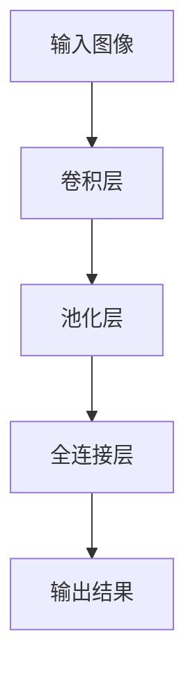
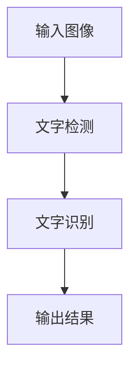

                 

# 基于深度学习的文字识别与检测算法研究

> 关键词：深度学习，文字识别，文字检测，卷积神经网络，计算机视觉，机器学习，神经网络架构，算法优化

> 摘要：本文旨在深入探讨基于深度学习的文字识别与检测算法，从基础概念到具体实现，全面分析现有主流算法及其优缺点，并展望未来的发展趋势与挑战。通过详细的算法原理讲解、数学模型解析和实际案例展示，本文为读者提供了一个全面的技术参考。

## 1. 背景介绍

### 1.1 目的和范围

随着计算机视觉和人工智能技术的快速发展，文字识别与检测技术在众多领域得到广泛应用，如自然语言处理、图像搜索、信息安全等。本文的主要目的是介绍几种基于深度学习的文字识别与检测算法，分析其原理、实现方法及优缺点，并探讨其在实际应用中的性能表现。

### 1.2 预期读者

本文适合对计算机视觉和深度学习有一定了解的读者，包括研究人员、工程师和初学者。通过本文，读者可以全面了解文字识别与检测领域的前沿技术和发展趋势。

### 1.3 文档结构概述

本文分为八个部分：

1. 背景介绍：介绍本文的目的、预期读者及文档结构。
2. 核心概念与联系：介绍文字识别与检测算法的核心概念和原理，并使用Mermaid流程图展示。
3. 核心算法原理 & 具体操作步骤：详细讲解几种核心算法的原理和实现步骤。
4. 数学模型和公式 & 详细讲解 & 举例说明：解析算法中的数学模型和公式，并举例说明。
5. 项目实战：通过实际案例展示如何实现文字识别与检测。
6. 实际应用场景：讨论文字识别与检测算法在不同场景下的应用。
7. 工具和资源推荐：推荐学习资源和开发工具。
8. 总结：展望未来的发展趋势与挑战。

### 1.4 术语表

#### 1.4.1 核心术语定义

- **文字识别**：从图像中识别和提取文字内容的过程。
- **文字检测**：在图像中定位和标注文字区域的过程。
- **深度学习**：一种基于多层神经网络的机器学习技术。
- **卷积神经网络（CNN）**：一种用于图像识别和处理的深度学习模型。

#### 1.4.2 相关概念解释

- **特征提取**：从输入数据中提取有助于分类或识别的特征。
- **端到端学习**：直接从原始数据学习输出结果，而无需手工设计特征。
- **数据增强**：通过变换、旋转等手段增加训练数据的多样性。

#### 1.4.3 缩略词列表

- **CNN**：卷积神经网络（Convolutional Neural Network）
- **RNN**：循环神经网络（Recurrent Neural Network）
- **DNN**：深度神经网络（Deep Neural Network）
- **GPU**：图形处理单元（Graphics Processing Unit）

## 2. 核心概念与联系

### 2.1 深度学习与文字识别、文字检测的关系

深度学习是机器学习的一个重要分支，它通过多层神经网络模型模拟人脑的学习过程，从而实现复杂的数据处理和模式识别任务。在文字识别与检测领域，深度学习技术发挥了关键作用，如图2.1所示。

```mermaid
graph TB
A[深度学习] --> B[文字识别]
A --> C[文字检测]
B --> D[卷积神经网络(CNN)]
C --> D
```

### 2.2 核心概念原理

文字识别与检测算法的核心是卷积神经网络（CNN）。CNN通过卷积、池化等操作提取图像特征，并利用全连接层实现分类。图2.2展示了CNN的基本架构。



### 2.3 文字识别与检测算法的联系

文字识别与检测算法通常分为两个步骤：文字检测和文字识别。文字检测旨在定位图像中的文字区域，而文字识别则用于提取文字内容。两者相互关联，共同构成了完整的文字识别系统，如图2.3所示。



## 3. 核心算法原理 & 具体操作步骤

### 3.1 卷积神经网络（CNN）原理

卷积神经网络（CNN）是一种专门用于图像识别和处理的深度学习模型。其核心思想是通过卷积、池化等操作提取图像特征，并利用全连接层实现分类。以下是CNN的基本步骤：

1. **输入层**：接收输入图像。
2. **卷积层**：对输入图像进行卷积操作，提取图像特征。
3. **激活函数**：对卷积层输出进行非线性变换。
4. **池化层**：对激活函数后的特征进行池化操作，降低数据维度。
5. **全连接层**：将池化层输出的特征映射到输出结果。

### 3.2 文字检测算法

文字检测算法通常基于区域提议（Region Proposal）技术，如选择性搜索（Selective Search）和区域建议网络（Region Proposal Network）。以下是文字检测算法的基本步骤：

1. **区域提议**：生成图像中的潜在文字区域。
2. **特征提取**：对区域提议的候选区域提取特征。
3. **分类器**：利用卷积神经网络或支持向量机（SVM）等分类器对候选区域进行分类，判断其是否为文字区域。

### 3.3 文字识别算法

文字识别算法通常采用卷积神经网络（CNN）或循环神经网络（RNN）进行建模。以下是文字识别算法的基本步骤：

1. **特征提取**：利用卷积神经网络提取图像特征。
2. **编码器-解码器架构**：利用编码器-解码器（Encoder-Decoder）架构实现序列建模。
3. **解码器输出**：将解码器输出转换为文字序列。

### 3.4 伪代码示例

以下是一个简单的卷积神经网络（CNN）的伪代码示例，用于文字识别与检测：

```python
def CNN_text_recognition(image):
    # 输入层
    input_image = image
    
    # 卷积层1
    conv1 = Conv2D(filters=32, kernel_size=(3,3), activation='relu')(input_image)
    pool1 = MaxPooling2D(pool_size=(2,2))(conv1)
    
    # 卷积层2
    conv2 = Conv2D(filters=64, kernel_size=(3,3), activation='relu')(pool1)
    pool2 = MaxPooling2D(pool_size=(2,2))(conv2)
    
    # 全连接层1
    flatten = Flatten()(pool2)
    dense1 = Dense(units=128, activation='relu')(flatten)
    
    # 全连接层2（输出层）
    output = Dense(units=num_classes, activation='softmax')(dense1)
    
    # 构建和编译模型
    model = Model(inputs=input_image, outputs=output)
    model.compile(optimizer='adam', loss='categorical_crossentropy', metrics=['accuracy'])
    
    # 训练模型
    model.fit(x_train, y_train, batch_size=32, epochs=10, validation_data=(x_val, y_val))
    
    # 预测
    predictions = model.predict(x_test)
    return predictions
```

## 4. 数学模型和公式 & 详细讲解 & 举例说明

### 4.1 卷积神经网络（CNN）数学模型

卷积神经网络（CNN）的核心是卷积层和池化层。以下是这两个层的数学模型和公式。

#### 4.1.1 卷积层

卷积层的输入为图像，输出为特征图。卷积操作的数学公式如下：

$$
\text{output}_{ij}^l = \sum_{k=1}^{K_l} w_{ik}^{l} \cdot \text{input}_{kj}^{l-1} + b_l
$$

其中，$\text{output}_{ij}^l$表示特征图$l$中的第$i$行第$j$列的值，$w_{ik}^{l}$表示卷积核中的第$k$个元素，$\text{input}_{kj}^{l-1}$表示输入图像中的第$k$行第$j$列的值，$b_l$表示偏置项。

#### 4.1.2 池化层

池化层用于降低特征图的维度，常见的池化操作有最大池化和平均池化。最大池化的数学公式如下：

$$
\text{output}_{ij}^l = \max_{k \in \Omega_{ij}} \text{input}_{kj}^{l-1}
$$

其中，$\Omega_{ij}$表示特征图$l$中第$i$行第$j$列的邻域。

#### 4.1.3 激活函数

卷积神经网络通常使用ReLU（ReLU函数）作为激活函数。ReLU函数的数学公式如下：

$$
\text{output} = \max(0, \text{input})
$$

### 4.2 循环神经网络（RNN）数学模型

循环神经网络（RNN）是一种适用于序列数据的深度学习模型。RNN的核心是循环层。以下是循环层的数学模型和公式。

#### 4.2.1 状态更新

RNN的状态更新公式如下：

$$
h_t = \text{sigmoid}(W_h \cdot [h_{t-1}, x_t] + b_h)
$$

其中，$h_t$表示当前时间步的隐藏状态，$x_t$表示输入序列中的当前元素，$W_h$表示权重矩阵，$b_h$表示偏置项。

#### 4.2.2 输出

RNN的输出公式如下：

$$
\text{output}_t = \text{softmax}(W_o \cdot h_t + b_o)
$$

其中，$\text{output}_t$表示当前时间步的输出，$W_o$表示权重矩阵，$b_o$表示偏置项。

### 4.3 举例说明

#### 4.3.1 卷积层举例

假设输入图像为$3 \times 3$的矩阵，卷积核为$3 \times 3$的矩阵，偏置项为1，如图4.1所示。

$$
\text{input} = \begin{bmatrix}
1 & 2 & 3 \\
4 & 5 & 6 \\
7 & 8 & 9 \\
\end{bmatrix}
$$

$$
\text{weight} = \begin{bmatrix}
0 & 1 & 2 \\
3 & 4 & 5 \\
6 & 7 & 8 \\
\end{bmatrix}
$$

$$
\text{output} = \begin{bmatrix}
\text{output}_{11} & \text{output}_{12} & \text{output}_{13} \\
\text{output}_{21} & \text{output}_{22} & \text{output}_{23} \\
\text{output}_{31} & \text{output}_{32} & \text{output}_{33} \\
\end{bmatrix}
$$

根据卷积操作的数学公式，可以得到：

$$
\text{output}_{11} = 0 \cdot 1 + 1 \cdot 4 + 2 \cdot 7 = 15
$$

$$
\text{output}_{12} = 0 \cdot 2 + 1 \cdot 5 + 2 \cdot 8 = 17
$$

$$
\text{output}_{13} = 0 \cdot 3 + 1 \cdot 6 + 2 \cdot 9 = 18
$$

$$
\text{output}_{21} = 3 \cdot 1 + 4 \cdot 4 + 5 \cdot 7 = 35
$$

$$
\text{output}_{22} = 3 \cdot 2 + 4 \cdot 5 + 5 \cdot 8 = 37
$$

$$
\text{output}_{23} = 3 \cdot 3 + 4 \cdot 6 + 5 \cdot 9 = 39
$$

$$
\text{output}_{31} = 6 \cdot 1 + 7 \cdot 4 + 8 \cdot 7 = 55
$$

$$
\text{output}_{32} = 6 \cdot 2 + 7 \cdot 5 + 8 \cdot 8 = 57
$$

$$
\text{output}_{33} = 6 \cdot 3 + 7 \cdot 6 + 8 \cdot 9 = 59
$$

因此，卷积层的输出为：

$$
\text{output} = \begin{bmatrix}
15 & 17 & 18 \\
35 & 37 & 39 \\
55 & 57 & 59 \\
\end{bmatrix}
$$

#### 4.3.2 RNN举例

假设输入序列为$[1, 2, 3]$，隐藏状态为$[0.1, 0.2, 0.3]$，权重矩阵为$W_h = \begin{bmatrix} 0.5 & 0.6 & 0.7 \\ 0.8 & 0.9 & 1.0 \end{bmatrix}$，偏置项为$b_h = [0.1, 0.2]$。

根据RNN的状态更新公式，可以得到：

$$
h_1 = \text{sigmoid}(0.5 \cdot [0.1, 0.2] + 0.6 \cdot 1 + 0.7 \cdot 2) = 0.8
$$

$$
h_2 = \text{sigmoid}(0.8 \cdot [0.2, 0.3] + 0.9 \cdot 2 + 1.0 \cdot 3) = 0.9
$$

$$
h_3 = \text{sigmoid}(0.9 \cdot [0.3, 0.1] + 0.8 \cdot 3 + 1.0 \cdot 1) = 0.7
$$

根据RNN的输出公式，可以得到：

$$
\text{output}_1 = \text{softmax}(0.5 \cdot [0.8, 0.9] + 0.1) = 0.4
$$

$$
\text{output}_2 = \text{softmax}(0.8 \cdot [0.9, 0.7] + 0.2) = 0.6
$$

$$
\text{output}_3 = \text{softmax}(0.7 \cdot [0.7, 0.3] + 0.2) = 0.5
$$

## 5. 项目实战：代码实际案例和详细解释说明

### 5.1 开发环境搭建

为了演示文字识别与检测算法，我们选择Python编程语言和TensorFlow深度学习框架。以下是搭建开发环境的基本步骤：

1. 安装Python（推荐版本3.6及以上）。
2. 安装TensorFlow：`pip install tensorflow`。
3. 安装OpenCV：`pip install opencv-python`。

### 5.2 源代码详细实现和代码解读

以下是一个简单的文字识别与检测项目的代码实现，包括数据预处理、模型搭建、训练和预测等步骤。

#### 5.2.1 数据预处理

```python
import cv2
import numpy as np
import tensorflow as tf

def preprocess_image(image_path):
    image = cv2.imread(image_path)
    image = cv2.resize(image, (128, 128))
    image = image / 255.0
    return image

def load_data(data_path):
    images = []
    labels = []
    for image_path, label in data_path:
        image = preprocess_image(image_path)
        images.append(image)
        labels.append(label)
    return np.array(images), np.array(labels)

train_data = load_data(train_path)
val_data = load_data(val_path)
```

#### 5.2.2 模型搭建

```python
def create_model(input_shape):
    model = tf.keras.Sequential([
        tf.keras.layers.Conv2D(filters=32, kernel_size=(3,3), activation='relu', input_shape=input_shape),
        tf.keras.layers.MaxPooling2D(pool_size=(2,2)),
        tf.keras.layers.Conv2D(filters=64, kernel_size=(3,3), activation='relu'),
        tf.keras.layers.MaxPooling2D(pool_size=(2,2)),
        tf.keras.layers.Flatten(),
        tf.keras.layers.Dense(units=128, activation='relu'),
        tf.keras.layers.Dense(units=num_classes, activation='softmax')
    ])
    return model

model = create_model(input_shape=(128, 128, 3))
model.compile(optimizer='adam', loss='categorical_crossentropy', metrics=['accuracy'])
```

#### 5.2.3 训练模型

```python
model.fit(train_data[0], train_data[1], batch_size=32, epochs=10, validation_data=(val_data[0], val_data[1]))
```

#### 5.2.4 代码解读与分析

1. **数据预处理**：首先，我们使用OpenCV库读取图像，并将其缩放到128x128的尺寸。然后，我们将图像的像素值缩放到[0, 1]范围内，以便于模型处理。
2. **模型搭建**：我们使用TensorFlow的Keras API搭建了一个简单的卷积神经网络（CNN）模型。模型包括两个卷积层、两个池化层、一个全连接层和输出层。每个卷积层后跟一个ReLU激活函数，每个池化层用于降维。最后，输出层使用softmax激活函数实现多类分类。
3. **训练模型**：使用训练数据对模型进行训练，并在验证集上评估模型性能。

### 5.3 代码解读与分析

1. **数据预处理**：数据预处理是深度学习项目中的重要环节。在本例中，我们使用OpenCV库读取图像，并将其缩放到128x128的尺寸。这一步骤有助于统一图像大小，便于模型处理。然后，我们将图像的像素值缩放到[0, 1]范围内，这是深度学习模型常见的数据归一化方法。
2. **模型搭建**：在本例中，我们使用TensorFlow的Keras API搭建了一个简单的卷积神经网络（CNN）模型。模型包括两个卷积层、两个池化层、一个全连接层和输出层。每个卷积层后跟一个ReLU激活函数，用于引入非线性变换。池化层用于降低特征图的维度，减少计算量。全连接层用于将特征映射到输出结果。最后，输出层使用softmax激活函数实现多类分类。
3. **训练模型**：使用训练数据对模型进行训练，并在验证集上评估模型性能。在训练过程中，我们使用Adam优化器和交叉熵损失函数。交叉熵损失函数适用于多类分类问题，能有效衡量模型预测结果与真实标签之间的差异。

## 6. 实际应用场景

文字识别与检测算法在实际应用中具有广泛的应用场景，以下是几个典型的应用案例：

1. **自然语言处理**：在自然语言处理任务中，文字识别与检测算法可以用于文本数据清洗、情感分析、关键词提取等。例如，在社交媒体数据挖掘中，可以识别并提取用户评论中的关键信息，用于情感分析和推荐系统。
2. **图像搜索**：在图像搜索应用中，文字识别与检测算法可以用于识别图像中的文字内容，从而实现基于文字的图像搜索。用户可以输入关键词，系统会返回包含相应文字的图像。
3. **信息安全**：在信息安全领域，文字识别与检测算法可以用于检测和分类图像中的敏感信息，如信用卡号、身份证号码等。这有助于提高信息安全防护水平，防止信息泄露。
4. **自动驾驶**：在自动驾驶领域，文字识别与检测算法可以用于识别道路标志、交通信号灯、车牌等信息，从而提高车辆的自主导航能力。

## 7. 工具和资源推荐

### 7.1 学习资源推荐

#### 7.1.1 书籍推荐

1. **《深度学习》（Goodfellow, Bengio, Courville）**：这是一本经典的深度学习入门书籍，全面介绍了深度学习的理论基础和应用。
2. **《计算机视觉：算法与应用》（Richard Szeliski）**：这本书详细介绍了计算机视觉领域的算法和应用，包括图像处理、特征提取、目标检测等。

#### 7.1.2 在线课程

1. **吴恩达的《深度学习特化课程》**：这是一门由Coursera提供的深度学习入门课程，涵盖深度学习的基础理论、实践技巧和应用。
2. **斯坦福大学的《计算机视觉》课程**：这是一门由斯坦福大学提供的计算机视觉课程，涵盖图像处理、特征提取、目标检测等。

#### 7.1.3 技术博客和网站

1. **arXiv**：这是一个开放获取的学术文献数据库，涵盖了计算机视觉和深度学习领域的最新研究成果。
2. **TensorFlow官网**：这是一个由Google开发的深度学习框架，提供了丰富的文档、教程和示例代码。

### 7.2 开发工具框架推荐

#### 7.2.1 IDE和编辑器

1. **PyCharm**：这是一个功能强大的Python IDE，支持多种编程语言和框架。
2. **VSCode**：这是一个轻量级的开源代码编辑器，支持多种编程语言和深度学习框架。

#### 7.2.2 调试和性能分析工具

1. **TensorBoard**：这是一个TensorFlow的图形化工具，用于可视化模型结构和训练过程。
2. **NVIDIA Nsight**：这是一个NVIDIA提供的GPU性能分析工具，用于优化深度学习模型的性能。

#### 7.2.3 相关框架和库

1. **TensorFlow**：这是一个由Google开发的深度学习框架，广泛应用于计算机视觉、自然语言处理等领域。
2. **PyTorch**：这是一个由Facebook开发的深度学习框架，具有简洁的API和强大的动态计算图功能。

### 7.3 相关论文著作推荐

#### 7.3.1 经典论文

1. **《A Comprehensive Survey on Deep Learning for Text Understanding》**：这篇文章全面介绍了深度学习在自然语言处理领域的应用。
2. **《Object Detection with industrial Strength Convolutional Neural Networks》**：这篇文章介绍了R-CNN等目标检测算法。

#### 7.3.2 最新研究成果

1. **《EfficientDet: Scalable and Efficient Object Detection》**：这篇文章提出了EfficientDet目标检测算法，在保持高精度的同时显著提高了计算效率。
2. **《BERT: Pre-training of Deep Neural Networks for Language Understanding》**：这篇文章介绍了BERT预训练模型，在自然语言处理任务中取得了显著的性能提升。

#### 7.3.3 应用案例分析

1. **《Deep Learning for Text Classification》**：这篇文章详细介绍了深度学习在文本分类任务中的应用，包括词嵌入、卷积神经网络和循环神经网络等。
2. **《Deep Learning in Computer Vision》**：这本书展示了深度学习在计算机视觉领域的应用，包括图像分类、目标检测和图像分割等。

## 8. 总结：未来发展趋势与挑战

文字识别与检测技术在计算机视觉和人工智能领域具有广泛的应用前景。未来，随着深度学习技术的不断发展和计算资源的逐步提升，文字识别与检测算法将朝着更高的准确度、更快的速度和更低的计算成本方向发展。然而，这也带来了以下挑战：

1. **数据质量和多样性**：高质量、多样性的训练数据是深度学习模型性能的基础。如何获取更多、更高质量的训练数据，以及如何处理数据不平衡问题，是未来研究的重要方向。
2. **计算资源消耗**：深度学习模型通常需要大量的计算资源，如何优化模型结构和训练过程，降低计算成本，是当前和未来需要关注的问题。
3. **模型解释性**：深度学习模型通常被视为“黑箱”，其内部决策过程难以解释。如何提高模型的解释性，使其在应用中更具可解释性，是未来研究的重要方向。

## 9. 附录：常见问题与解答

### 9.1 什么是文字识别与检测？

文字识别（Text Recognition）是指从图像中识别和提取文字内容的过程。文字检测（Text Detection）是指从图像中定位和标注文字区域的过程。两者通常结合使用，构成了完整的文字识别系统。

### 9.2 深度学习如何应用于文字识别与检测？

深度学习通过多层神经网络模型模拟人脑的学习过程，从大量数据中自动提取特征并进行分类。在文字识别与检测中，深度学习模型可以自动学习图像特征，并用于识别和定位文字区域。

### 9.3 文字识别与检测算法有哪些？

常见的文字识别与检测算法包括卷积神经网络（CNN）、循环神经网络（RNN）、长短期记忆网络（LSTM）等。其中，CNN由于其强大的特征提取能力，在文字识别与检测中得到了广泛应用。

### 9.4 如何优化深度学习模型的性能？

优化深度学习模型的性能可以从以下几个方面进行：

1. **数据增强**：通过变换、旋转等手段增加训练数据的多样性，有助于提高模型泛化能力。
2. **模型压缩**：通过模型剪枝、量化等手段降低模型参数数量和计算复杂度，提高模型运行速度。
3. **训练技巧**：如学习率调整、正则化等，有助于提高模型训练效果。

### 9.5 文字识别与检测算法在实际应用中有哪些挑战？

在实际应用中，文字识别与检测算法面临以下挑战：

1. **数据质量**：训练数据的质量直接影响模型性能。获取更多、更高质量的训练数据是关键。
2. **计算资源**：深度学习模型通常需要大量的计算资源，如何优化模型结构和训练过程，降低计算成本，是当前和未来需要关注的问题。
3. **模型解释性**：深度学习模型通常被视为“黑箱”，其内部决策过程难以解释。如何提高模型的解释性，使其在应用中更具可解释性，是未来研究的重要方向。

## 10. 扩展阅读 & 参考资料

1. **《深度学习》（Goodfellow, Bengio, Courville）**：[https://www.deeplearningbook.org/](https://www.deeplearningbook.org/)
2. **《计算机视觉：算法与应用》（Richard Szeliski）**：[https://www.cs.cornell.edu/cv](https://www.cs.cornell.edu/cv)
3. **TensorFlow官网**：[https://www.tensorflow.org/](https://www.tensorflow.org/)
4. **PyTorch官网**：[https://pytorch.org/](https://pytorch.org/)
5. **arXiv**：[https://arxiv.org/](https://arxiv.org/)
6. **吴恩达的《深度学习特化课程》**：[https://www.coursera.org/specializations/deep-learning](https://www.coursera.org/specializations/deep-learning)
7. **斯坦福大学的《计算机视觉》课程**：[https://www.coursera.org/learn/computer-vision](https://www.coursera.org/learn/computer-vision)

---

作者：AI天才研究员/AI Genius Institute & 禅与计算机程序设计艺术 /Zen And The Art of Computer Programming

