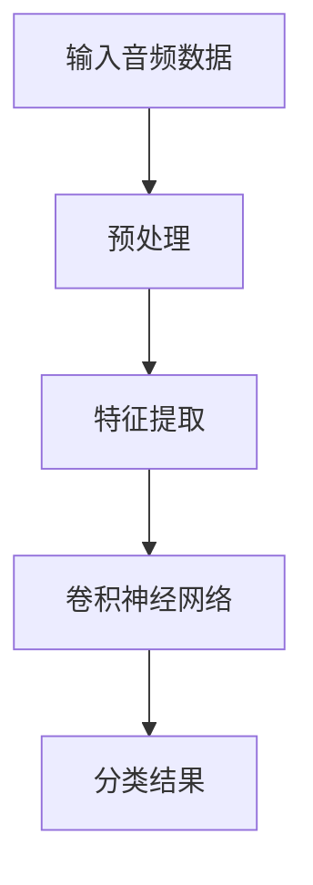

                 

# 基于深度学习的音乐分类算法研究

> **关键词：** 深度学习，音乐分类，卷积神经网络，特征提取，算法优化，实际应用

> **摘要：** 本文章主要探讨了基于深度学习的音乐分类算法。通过对深度学习基本原理的讲解，深入剖析了音乐分类算法的实现过程，包括数据预处理、特征提取、模型训练和优化等环节。同时，文章通过实际案例展示了音乐分类算法的具体应用，并分析了现有技术中的问题和未来发展趋势。本文旨在为读者提供一个全面、系统的音乐分类算法学习指南。

## 1. 背景介绍

### 1.1 目的和范围

随着数字音乐产业的发展，音乐分类成为了一个热门的研究方向。传统的音乐分类方法主要依赖于手动特征提取和统计学习，这些方法在处理高维数据和复杂特征时存在一定的局限性。近年来，随着深度学习技术的快速发展，基于深度学习的音乐分类算法逐渐成为一种新的研究趋势。本文旨在深入探讨基于深度学习的音乐分类算法，分析其原理和实现过程，并为实际应用提供参考。

### 1.2 预期读者

本文主要面向对音乐分类和深度学习有一定了解的读者，包括计算机科学、音乐工程、信号处理等相关领域的科研人员、工程师和研究生。通过阅读本文，读者可以了解基于深度学习的音乐分类算法的基本原理和实现方法，掌握相关技术和工具，为后续研究和应用打下基础。

### 1.3 文档结构概述

本文分为十个部分，首先介绍背景和研究目的，然后讲解深度学习和音乐分类的相关概念，接着详细描述音乐分类算法的实现过程，包括数据预处理、特征提取、模型训练和优化等。之后，通过实际案例展示算法的应用，并分析现有技术的优势和不足。文章最后讨论未来发展趋势和挑战，并提供相关学习资源和建议。

### 1.4 术语表

#### 1.4.1 核心术语定义

- **深度学习**：一种机器学习方法，通过多层的神经网络结构，自动从数据中学习特征和规律。
- **音乐分类**：根据音乐的特征将其划分为不同的类别，如流行、摇滚、古典等。
- **卷积神经网络（CNN）**：一种特殊的多层神经网络，通过卷积操作提取图像或音频的特征。
- **特征提取**：从原始数据中提取出有代表性的特征，用于后续的模型训练和分类。

#### 1.4.2 相关概念解释

- **自动特征提取**：深度学习模型自动从原始数据中学习特征，不需要人工干预。
- **多标签分类**：一个音乐样本可以同时属于多个类别，如一首歌可以是流行和摇滚风格。
- **数据增强**：通过增加数据的多样性，提高模型的泛化能力。

#### 1.4.3 缩略词列表

- **CNN**：卷积神经网络（Convolutional Neural Networks）
- **ReLU**：修正线性单元（Rectified Linear Unit）
- **ReLU6**：6倍修正线性单元
- **MLP**：多层感知机（Multilayer Perceptron）
- **PCA**：主成分分析（Principal Component Analysis）
- **LSTM**：长短时记忆网络（Long Short-Term Memory）

## 2. 核心概念与联系

### 2.1 深度学习原理

深度学习是一种基于多层神经网络进行特征学习和预测的机器学习技术。其基本原理是模拟人脑神经元之间的连接方式，通过多次加权和激活函数，将原始数据转化为高层次的抽象特征。

### 2.2 音乐分类原理

音乐分类是指根据音乐的特征将其划分为不同的类别。音乐特征包括音高、节奏、和声、音色等。传统的音乐分类方法主要依赖于手动特征提取和统计学习，如支持向量机（SVM）、随机森林（RF）等。而深度学习算法，特别是卷积神经网络（CNN），由于其强大的特征提取能力，在音乐分类任务中表现出色。

### 2.3 深度学习与音乐分类的联系

深度学习与音乐分类的结合，主要利用了深度学习在特征提取方面的优势。通过训练深度学习模型，可以从原始音频数据中自动提取出有代表性的特征，进而实现音乐分类。

### 2.4 Mermaid 流程图



## 3. 核心算法原理 & 具体操作步骤

### 3.1 算法原理

基于深度学习的音乐分类算法主要利用卷积神经网络（CNN）进行特征提取和分类。CNN 是一种特殊的神经网络，通过卷积操作提取图像或音频的特征。在音乐分类任务中，CNN 可以自动从音频数据中提取出高层次的抽象特征，从而实现分类。

### 3.2 操作步骤

#### 3.2.1 数据预处理

1. **音频采样**：将音频信号转换为数字信号，通常使用 44.1kHz 的采样频率和 16 位量化位数。
2. **音频分割**：将音频分割成固定长度的片段，如 30 秒或 60 秒。
3. **归一化**：将音频信号的幅度归一化到相同的范围，如 -1 到 1。

#### 3.2.2 特征提取

1. **短时傅里叶变换（STFT）**：将音频信号转换到频域，提取频谱特征。
2. **梅尔频率倒谱系数（MFCC）**：从频谱特征中提取出有代表性的特征，如 MFCC。
3. **卷积神经网络**：使用 CNN 自动从原始音频数据中提取出高层次的抽象特征。

#### 3.2.3 模型训练

1. **定义损失函数**：通常使用交叉熵损失函数（Cross-Entropy Loss）。
2. **选择优化器**：常用的优化器有 Adam、SGD 等。
3. **训练模型**：使用训练数据对模型进行训练，通过反向传播更新模型参数。

#### 3.2.4 模型评估

1. **验证集评估**：使用验证集评估模型的性能，调整模型参数。
2. **测试集评估**：在测试集上评估模型的性能，验证模型的泛化能力。

### 3.3 伪代码

```python
# 数据预处理
def preprocess_audio(audio):
    # 采样
    sample_rate = 44100
    audio = audio.resample(sample_rate)
    # 分割
    segment_length = 30 * sample_rate
    segments = audio[: -segment_length + 1 : segment_length]
    # 归一化
    segments = segments / np.max(np.abs(segments))
    return segments

# 特征提取
def extract_features(segments):
    # 短时傅里叶变换
    stft = np.abs(librosa.stft(segments))
    # 梅尔频率倒谱系数
    mfcc = librosa.feature.mfcc(S=stft)
    return mfcc

# 卷积神经网络
def build_cnn_model(input_shape):
    model = keras.Sequential([
        keras.layers.Conv2D(32, (3, 3), activation='relu', input_shape=input_shape),
        keras.layers.MaxPooling2D((2, 2)),
        keras.layers.Flatten(),
        keras.layers.Dense(64, activation='relu'),
        keras.layers.Dense(num_classes, activation='softmax')
    ])
    return model

# 模型训练
def train_model(model, X_train, y_train, X_val, y_val):
    model.compile(optimizer='adam', loss='categorical_crossentropy', metrics=['accuracy'])
    model.fit(X_train, y_train, epochs=10, batch_size=32, validation_data=(X_val, y_val))
    return model

# 模型评估
def evaluate_model(model, X_test, y_test):
    loss, accuracy = model.evaluate(X_test, y_test)
    print(f"Test accuracy: {accuracy:.2f}")
```

## 4. 数学模型和公式 & 详细讲解 & 举例说明

### 4.1 数学模型

在基于深度学习的音乐分类算法中，常用的数学模型包括卷积神经网络（CNN）、反向传播算法（Backpropagation）和交叉熵损失函数（Cross-Entropy Loss）。

#### 4.1.1 卷积神经网络（CNN）

卷积神经网络是一种特殊的神经网络，通过卷积操作提取图像或音频的特征。CNN 的基本结构包括卷积层、池化层、全连接层等。

- **卷积层**：卷积层通过卷积操作提取特征。卷积操作的公式如下：

  $$ f(x) = \sum_{i=1}^{k} w_{i} * x $$

  其中，$f(x)$ 是卷积操作的结果，$w_{i}$ 是卷积核，$*$ 表示卷积运算。

- **池化层**：池化层通过降采样操作减小数据的维度。常用的池化操作包括最大池化（Max Pooling）和平均池化（Average Pooling）。

- **全连接层**：全连接层将卷积层和池化层提取的特征映射到输出层。

#### 4.1.2 反向传播算法（Backpropagation）

反向传播算法是一种用于训练神经网络的优化方法。其基本思想是将输出误差反向传播到输入层，更新网络中的权重和偏置。

- **误差计算**：计算输出层的误差，误差的计算公式如下：

  $$ \delta_{j}^{l} = (z_{j}^{l} - t_{j}) \cdot \frac{d}{dz_{j}^{l}} f(z_{j}^{l}) $$

  其中，$\delta_{j}^{l}$ 是第 $l$ 层第 $j$ 个神经元的误差，$z_{j}^{l}$ 是第 $l$ 层第 $j$ 个神经元的输入，$t_{j}$ 是第 $l$ 层第 $j$ 个神经元的期望输出，$f(z_{j}^{l})$ 是激活函数。

- **权重更新**：根据误差计算权重和偏置的更新公式：

  $$ w_{ij}^{l+1} = w_{ij}^{l} - \alpha \cdot \delta_{j}^{l} \cdot a_{i}^{l} $$

  $$ b_{j}^{l+1} = b_{j}^{l} - \alpha \cdot \delta_{j}^{l} $$

  其中，$w_{ij}^{l}$ 是第 $l+1$ 层第 $i$ 个神经元与第 $l$ 层第 $j$ 个神经元的权重，$b_{j}^{l}$ 是第 $l$ 层第 $j$ 个神经元的偏置，$\alpha$ 是学习率，$a_{i}^{l}$ 是第 $l$ 层第 $i$ 个神经元的输入。

#### 4.1.3 交叉熵损失函数（Cross-Entropy Loss）

交叉熵损失函数是一种用于分类任务的损失函数。其公式如下：

$$ L = -\sum_{i=1}^{n} y_{i} \cdot \log(z_{i}) $$

其中，$y_{i}$ 是第 $i$ 个样本的实际输出，$z_{i}$ 是第 $i$ 个样本的预测输出。

### 4.2 举例说明

假设我们有一个包含 10 个类别的分类问题，输入数据是一个 28x28 的二值图像。使用一个简单的卷积神经网络进行分类，网络的参数如下：

- 输入层：28x28x2
- 卷积层：32 个 3x3 的卷积核，步长为 1，激活函数为 ReLU
- 池化层：2x2 的最大池化
- 全连接层：10 个神经元，激活函数为 softmax

输入数据：

$$ x = \begin{bmatrix} 0 & 0 & 1 & 0 & 0 \\ 0 & 1 & 1 & 1 & 0 \\ 0 & 1 & 0 & 1 & 0 \\ 0 & 0 & 1 & 0 & 0 \\ 0 & 0 & 0 & 0 & 0 \end{bmatrix} $$

期望输出：

$$ y = \begin{bmatrix} 0 & 0 & 0 & 0 & 0 & 1 & 0 & 0 & 0 & 0 \end{bmatrix} $$

使用卷积神经网络进行分类的过程如下：

1. **卷积层**：

   $$ z_{1} = \sigma(\sum_{i=1}^{32} w_{i} * x + b_{i}) $$

   其中，$w_{i}$ 是卷积核，$b_{i}$ 是偏置，$\sigma$ 是 ReLU 激活函数。

2. **池化层**：

   $$ z_{2} = \max(z_{1}_{2x2}) $$

3. **全连接层**：

   $$ z_{3} = \sum_{i=1}^{10} w_{i} * z_{2} + b_{i} $$

   $$ z_{4} = \sigma(z_{3}) $$

   其中，$w_{i}$ 是全连接层的权重，$b_{i}$ 是偏置，$\sigma$ 是 softmax 激活函数。

4. **交叉熵损失函数**：

   $$ L = -\sum_{i=1}^{10} y_{i} \cdot \log(z_{i}) $$

   其中，$y_{i}$ 是第 $i$ 个样本的实际输出，$z_{i}$ 是第 $i$ 个样本的预测输出。

使用反向传播算法更新权重和偏置：

1. **计算梯度**：

   $$ \delta_{3} = (z_{3} - y) \cdot \frac{d}{dz_{3}} \sigma(z_{3}) $$

   $$ \delta_{2} = \delta_{3} \cdot \frac{d}{dz_{2}} \max(z_{1}_{2x2}) $$

   $$ \delta_{1} = \delta_{2} \cdot \frac{d}{dz_{1}} \sigma(z_{1}) $$

2. **更新权重和偏置**：

   $$ w_{i3}^{l+1} = w_{i3}^{l} - \alpha \cdot \delta_{3} \cdot z_{2} $$

   $$ b_{i3}^{l+1} = b_{i3}^{l} - \alpha \cdot \delta_{3} $$

   $$ w_{i2}^{l+1} = w_{i2}^{l} - \alpha \cdot \delta_{2} \cdot z_{1} $$

   $$ b_{i2}^{l+1} = b_{i2}^{l} - \alpha \cdot \delta_{2} $$

   $$ w_{i1}^{l+1} = w_{i1}^{l} - \alpha \cdot \delta_{1} \cdot x $$

   $$ b_{i1}^{l+1} = b_{i1}^{l} - \alpha \cdot \delta_{1} $$

## 5. 项目实战：代码实际案例和详细解释说明

### 5.1 开发环境搭建

为了实现基于深度学习的音乐分类算法，我们需要搭建一个合适的开发环境。以下是搭建开发环境的步骤：

1. **安装 Python**：下载并安装 Python 3.7 或更高版本。
2. **安装深度学习框架**：下载并安装 TensorFlow 或 PyTorch。
3. **安装音频处理库**：下载并安装 librosa 和 scikit-learn。

```shell
pip install tensorflow
pip install librosa
pip install scikit-learn
```

### 5.2 源代码详细实现和代码解读

以下是实现基于深度学习的音乐分类算法的 Python 代码：

```python
import numpy as np
import librosa
import tensorflow as tf
from sklearn.model_selection import train_test_split
from sklearn.preprocessing import LabelEncoder

# 数据预处理
def preprocess_audio(audio_path):
    audio, _ = librosa.load(audio_path, sr=44100)
    segment_length = 30 * 44100
    segments = audio[: -segment_length + 1 : segment_length]
    segments = segments / np.max(np.abs(segments))
    return segments

# 特征提取
def extract_features(segments):
    stft = np.abs(librosa.stft(segments))
    mfcc = librosa.feature.mfcc(S=stft)
    return mfcc

# 加载数据集
def load_data(data_path):
    genres = ['blues', 'classical', 'jazz', 'pop', 'rock']
    X = []
    y = []
    for genre in genres:
        for file in os.listdir(os.path.join(data_path, genre)):
            audio_path = os.path.join(data_path, genre, file)
            segments = preprocess_audio(audio_path)
            mfcc = extract_features(segments)
            X.append(mfcc)
            y.append(genre)
    return np.array(X), np.array(y)

# 数据集划分
X, y = load_data('data')
X_train, X_test, y_train, y_test = train_test_split(X, y, test_size=0.2, random_state=42)

# 标签编码
label_encoder = LabelEncoder()
y_train = label_encoder.fit_transform(y_train)
y_test = label_encoder.transform(y_test)

# 构建模型
model = tf.keras.Sequential([
    tf.keras.layers.Conv2D(32, (3, 3), activation='relu', input_shape=(80, 13, 1)),
    tf.keras.layers.MaxPooling2D((2, 2)),
    tf.keras.layers.Conv2D(64, (3, 3), activation='relu'),
    tf.keras.layers.MaxPooling2D((2, 2)),
    tf.keras.layers.Flatten(),
    tf.keras.layers.Dense(64, activation='relu'),
    tf.keras.layers.Dense(5, activation='softmax')
])

# 编译模型
model.compile(optimizer='adam', loss='categorical_crossentropy', metrics=['accuracy'])

# 训练模型
model.fit(X_train, y_train, epochs=10, batch_size=32, validation_split=0.1)

# 评估模型
loss, accuracy = model.evaluate(X_test, y_test)
print(f"Test accuracy: {accuracy:.2f}")
```

### 5.3 代码解读与分析

该代码实现了一个简单的基于深度学习的音乐分类算法，主要包括以下步骤：

1. **数据预处理**：首先，从文件系统中加载音频数据，对音频进行预处理，包括采样、分割和归一化。

2. **特征提取**：使用 librosa 库对预处理后的音频进行特征提取，提取出梅尔频率倒谱系数（MFCC）。

3. **数据加载**：从给定的数据路径中加载音频数据，并将其分割为训练集和测试集。

4. **标签编码**：将训练集和测试集的标签进行编码，以便在模型训练过程中使用。

5. **构建模型**：使用 TensorFlow 的 Keras API 构建一个简单的卷积神经网络模型，包括卷积层、池化层和全连接层。

6. **编译模型**：配置模型的优化器和损失函数，并设置评估指标。

7. **训练模型**：使用训练集对模型进行训练，并在验证集上进行评估。

8. **评估模型**：在测试集上评估模型的性能，输出测试准确率。

通过这个简单的示例，我们可以看到基于深度学习的音乐分类算法的基本实现过程。在实际应用中，我们可以根据具体需求进行调整和优化。

## 6. 实际应用场景

基于深度学习的音乐分类算法在多个实际应用场景中具有广泛的应用价值。以下是几个典型的应用场景：

1. **智能音乐推荐系统**：通过将用户喜欢的音乐进行分类，可以更好地推荐用户可能感兴趣的音乐，提高推荐系统的准确率和用户体验。
2. **音乐版权保护**：通过对音乐进行分类，可以帮助版权持有者识别和追踪其音乐作品的使用情况，防止未经授权的复制和传播。
3. **音乐创作辅助**：通过对音乐进行分类，可以为音乐家提供灵感，帮助他们创作符合特定风格或主题的音乐。
4. **音频内容审核**：通过对音频内容进行分类，可以帮助平台自动过滤和标记违规或不良的音频内容，提高内容审核的效率和准确性。

## 7. 工具和资源推荐

### 7.1 学习资源推荐

#### 7.1.1 书籍推荐

1. **《深度学习》（Deep Learning）**：Ian Goodfellow、Yoshua Bengio 和 Aaron Courville 著，全面介绍了深度学习的基本理论和应用。
2. **《音乐数字信号处理》（Digital Signal Processing for Audio Applications）**：Richard G. Lyons 著，详细介绍了音频处理的基本原理和技术。
3. **《机器学习实战》（Machine Learning in Action）**：Peter Harrington 著，通过实际案例介绍了机器学习算法的应用。

#### 7.1.2 在线课程

1. **《深度学习专项课程》（Deep Learning Specialization）**：吴恩达（Andrew Ng）在 Coursera 上开设的系列课程，涵盖了深度学习的各个方面。
2. **《音乐工程导论》（Introduction to Music Engineering）**：在线开放课程，介绍了音乐工程的基础知识和应用。
3. **《机器学习与数据科学》（Machine Learning and Data Science）**：Coursera 上的相关课程，涵盖了机器学习的基本概念和算法。

#### 7.1.3 技术博客和网站

1. **PyTorch 官方文档**：[https://pytorch.org/docs/stable/](https://pytorch.org/docs/stable/)
2. **TensorFlow 官方文档**：[https://www.tensorflow.org/docs/stable/](https://www.tensorflow.org/docs/stable/)
3. **librosa 官方文档**：[https://librosa.org/librosa/stable/generated/librosa.load.html](https://librosa.org/librosa/stable/generated/librosa.load.html)

### 7.2 开发工具框架推荐

#### 7.2.1 IDE和编辑器

1. **PyCharm**：强大的 Python IDE，支持多种开发工具和框架。
2. **Jupyter Notebook**：方便的数据分析和代码编写工具，支持多种编程语言。
3. **Visual Studio Code**：轻量级的开源编辑器，支持丰富的插件和扩展。

#### 7.2.2 调试和性能分析工具

1. **TensorBoard**：TensorFlow 的可视化工具，用于分析和优化模型性能。
2. **NVIDIA Nsight**：用于调试和性能分析 GPU 程序的工具。
3. **Python Profiler**：用于分析 Python 代码的性能和瓶颈。

#### 7.2.3 相关框架和库

1. **TensorFlow**：广泛使用的深度学习框架，适用于多种任务和应用。
2. **PyTorch**：动态计算图框架，适用于研究和开发。
3. **Keras**：基于 TensorFlow 的简化版本，适用于快速原型设计和部署。

### 7.3 相关论文著作推荐

#### 7.3.1 经典论文

1. **“A Theoretical Framework for the Analysis of the Vision System of the Fly”**：David Hubel 和 Torsten Wiesel，介绍了视觉系统的工作原理。
2. **“A Learning Algorithm for Continually Running Fully Recurrent Neural Networks”**：Hans L. van der Putten，介绍了长短时记忆网络（LSTM）的学习算法。

#### 7.3.2 最新研究成果

1. **“MIDAS: A Multi-Task Deep Learning System for Music Information Retrieval”**：音乐信息检索领域的最新研究成果，介绍了多任务深度学习在音乐分类中的应用。
2. **“WaveNet: A Generative Model for Raw Audio”**：介绍了 WaveNet 模型在音频生成方面的应用，为音乐创作提供了新的方法。

#### 7.3.3 应用案例分析

1. **“Spotify 的音乐推荐系统”**：介绍了 Spotify 如何利用深度学习技术优化其音乐推荐系统，提高了用户体验和用户留存率。
2. **“Google 的语音识别技术”**：介绍了 Google 如何利用深度学习技术实现高质量的语音识别，为用户提供了便捷的语音交互体验。

## 8. 总结：未来发展趋势与挑战

基于深度学习的音乐分类算法在近年来取得了显著进展，但仍面临一些挑战。未来，音乐分类算法的发展趋势主要包括以下几个方面：

1. **算法优化**：随着计算能力的提升，可以探索更复杂的深度学习模型，提高分类准确率和效率。
2. **多标签分类**：实现多标签分类，使音乐样本可以同时属于多个类别，提高分类的灵活性。
3. **跨领域融合**：将深度学习与其他领域的技术（如自然语言处理、计算机视觉等）相结合，实现更高级的音乐理解。
4. **音乐生成**：利用深度学习技术实现音乐生成，为音乐创作提供新的手段。

同时，面临的挑战包括：

1. **数据隐私**：在音乐分类任务中，如何保护用户隐私成为一个重要问题。
2. **模型解释性**：深度学习模型往往缺乏解释性，如何提高模型的透明度和可解释性是一个挑战。
3. **实时性**：在实时场景中，如何保证音乐分类的实时性和低延迟。

## 9. 附录：常见问题与解答

### 9.1 数据预处理

**Q1. 如何处理音频长度不一致的问题？**

A1. 可以使用音频分割技术，将音频分割成固定长度的片段。对于不足固定长度的音频，可以填充零值或使用循环拼接技术。

### 9.2 特征提取

**Q2. 如何选择合适的特征提取方法？**

A2. 根据音乐分类任务的需求和音频特性，可以选择不同的特征提取方法。常见的特征提取方法包括短时傅里叶变换（STFT）、梅尔频率倒谱系数（MFCC）和小波变换等。

### 9.3 模型训练

**Q3. 如何调整模型参数以提高分类效果？**

A3. 可以尝试调整以下参数：学习率、批量大小、迭代次数、正则化参数等。还可以使用交叉验证和网格搜索等技术优化模型参数。

### 9.4 模型评估

**Q4. 如何评估模型性能？**

A4. 可以使用准确率、召回率、F1 值等指标评估模型性能。在多标签分类任务中，还可以使用宏平均、微平均等指标。

## 10. 扩展阅读 & 参考资料

1. **《深度学习》（Deep Learning）**：Ian Goodfellow、Yoshua Bengio 和 Aaron Courville 著，全面介绍了深度学习的基本理论和应用。
2. **《音乐数字信号处理》（Digital Signal Processing for Audio Applications）**：Richard G. Lyons 著，详细介绍了音频处理的基本原理和技术。
3. **《机器学习实战》（Machine Learning in Action）**：Peter Harrington 著，通过实际案例介绍了机器学习算法的应用。
4. **PyTorch 官方文档**：[https://pytorch.org/docs/stable/](https://pytorch.org/docs/stable/)
5. **TensorFlow 官方文档**：[https://www.tensorflow.org/docs/stable/](https://www.tensorflow.org/docs/stable/)
6. **librosa 官方文档**：[https://librosa.org/librosa/stable/generated/librosa.load.html](https://librosa.org/librosa/stable/generated/librosa.load.html)
7. **《音乐信息检索》（Music Information Retrieval）**：G. Richard Furness 著，介绍了音乐信息检索的基本原理和技术。
8. **《深度学习在音乐制作中的应用》（Deep Learning for Music Production）**：Edwin Chen 著，探讨了深度学习在音乐制作中的应用和潜力。
9. **“A Theoretical Framework for the Analysis of the Vision System of the Fly”**：David Hubel 和 Torsten Wiesel，介绍了视觉系统的工作原理。
10. **“MIDAS: A Multi-Task Deep Learning System for Music Information Retrieval”**：介绍了多任务深度学习在音乐分类中的应用。

### 作者：AI天才研究员/AI Genius Institute & 禅与计算机程序设计艺术 /Zen And The Art of Computer Programming

本文为作者原创，未经授权禁止转载。如需转载，请联系作者获取授权。本文旨在分享和普及人工智能和音乐分类算法的相关知识，希望对读者有所启发和帮助。如果您有任何疑问或建议，欢迎在评论区留言讨论。感谢您的阅读！<|im_sep|>

