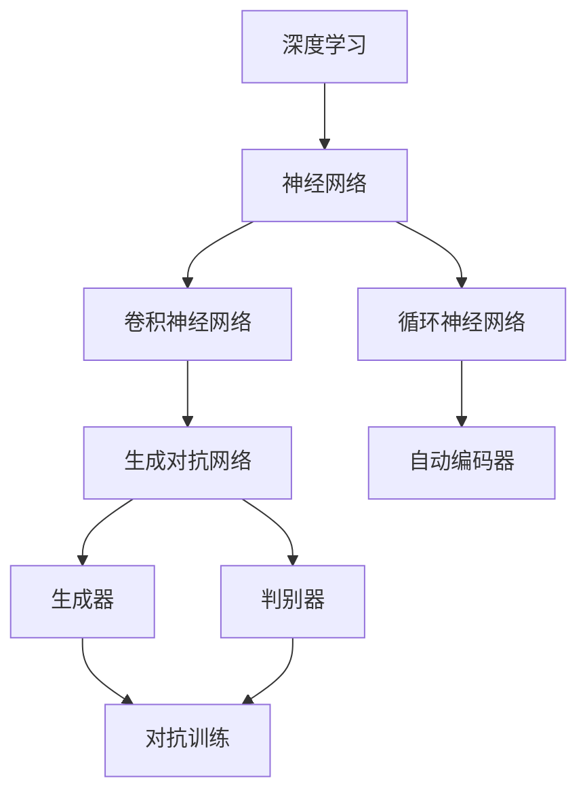

                 

# 基于生成对抗网络的游戏世界风格化生成技术研究

> **关键词：** 生成对抗网络，游戏世界，风格化生成，深度学习，人工智能，图像生成，数据增强

> **摘要：** 本文章旨在探讨如何利用生成对抗网络（GAN）技术实现游戏世界的风格化生成。我们将从背景介绍开始，逐步深入到核心算法原理、数学模型、项目实战和实际应用场景，通过详细的分析和解读，帮助读者理解并掌握这一技术。文章最后将对未来发展趋势与挑战进行展望。

## 1. 背景介绍

### 1.1 目的和范围

本文的主要目的是介绍和探讨生成对抗网络（GAN）在游戏世界风格化生成中的应用。通过本文的阅读，读者将了解GAN的基本原理、结构以及如何将其应用于游戏世界的风格化生成中。本文主要涵盖以下内容：

1. GAN的基本原理和架构
2. GAN在游戏世界风格化生成中的具体应用
3. GAN的数学模型和操作步骤
4. GAN在实际项目中的代码实现和案例分析
5. GAN在游戏世界风格化生成中的实际应用场景
6. GAN工具和资源的推荐
7. 未来发展趋势与挑战

### 1.2 预期读者

本文面向对深度学习和生成对抗网络有一定了解的读者，特别是对游戏开发和图像处理领域感兴趣的程序员、AI研究者和技术爱好者。无论您是初学者还是专业人士，本文都将为您提供有价值的见解和实战经验。

### 1.3 文档结构概述

本文结构如下：

1. **背景介绍**：介绍本文的目的、范围、预期读者和文档结构。
2. **核心概念与联系**：介绍GAN的基本原理和架构。
3. **核心算法原理 & 具体操作步骤**：详细讲解GAN的算法原理和操作步骤。
4. **数学模型和公式 & 详细讲解 & 举例说明**：介绍GAN的数学模型和公式，并进行详细讲解和举例说明。
5. **项目实战：代码实际案例和详细解释说明**：通过实际案例介绍GAN在游戏世界风格化生成中的代码实现和解释。
6. **实际应用场景**：探讨GAN在游戏世界风格化生成中的实际应用。
7. **工具和资源推荐**：推荐相关学习资源和开发工具。
8. **总结：未来发展趋势与挑战**：对GAN在游戏世界风格化生成中的应用前景进行展望。
9. **附录：常见问题与解答**：解答读者可能遇到的问题。
10. **扩展阅读 & 参考资料**：提供相关扩展阅读和参考资料。

### 1.4 术语表

#### 1.4.1 核心术语定义

- **生成对抗网络（GAN）**：一种基于深度学习的图像生成模型，由生成器和判别器组成，通过对抗训练生成逼真的图像。
- **生成器（Generator）**：GAN中的生成模型，用于生成与真实图像相似的数据。
- **判别器（Discriminator）**：GAN中的判别模型，用于区分真实图像和生成图像。
- **对抗训练（Adversarial Training）**：通过优化生成器和判别器的损失函数，使生成器生成的图像越来越逼真，而判别器能够正确区分真实图像和生成图像。

#### 1.4.2 相关概念解释

- **深度学习（Deep Learning）**：一种机器学习技术，通过多层神经网络对数据进行建模和分析。
- **神经网络（Neural Network）**：一种由大量神经元组成的计算机模型，通过学习输入和输出之间的映射关系来进行预测和分类。
- **图像生成（Image Generation）**：利用算法生成新的图像，可以是完全虚构的，也可以是基于现有图像的变换。

#### 1.4.3 缩略词列表

- **GAN**：生成对抗网络（Generative Adversarial Network）
- **DNN**：深度神经网络（Deep Neural Network）
- **CNN**：卷积神经网络（Convolutional Neural Network）
- **RNN**：循环神经网络（Recurrent Neural Network）
- **AE**：自动编码器（Autoencoder）

## 2. 核心概念与联系

在介绍生成对抗网络（GAN）之前，我们需要先了解一些核心概念和它们之间的关系。下面是一个简化的Mermaid流程图，用于展示这些概念及其关联。



### 2.1 深度学习与神经网络

深度学习是机器学习的一个分支，它通过多层神经网络对数据进行建模和分析。神经网络是由大量神经元组成的计算模型，每个神经元接收输入、进行加权求和，并通过激活函数产生输出。深度学习通过构建多层神经网络，逐层提取数据的特征，从而实现复杂的数据处理任务。

### 2.2 卷积神经网络与循环神经网络

卷积神经网络（CNN）是一种特别适用于图像处理任务的神经网络，通过卷积操作和池化操作提取图像的特征。循环神经网络（RNN）则是一种适用于序列数据处理的神经网络，通过保持状态信息来处理长序列数据。

### 2.3 生成对抗网络（GAN）

生成对抗网络（GAN）是由生成器和判别器组成的深度学习模型。生成器旨在生成逼真的图像，而判别器则用于区分真实图像和生成图像。GAN通过对抗训练，使生成器生成的图像越来越逼真，从而实现图像生成任务。

### 2.4 自动编码器

自动编码器是一种简单的神经网络模型，用于将输入数据编码为一个压缩表示，并通过解码器将这个表示还原为原始数据。自动编码器通常用于数据降维和特征提取。

在GAN的架构中，生成器和判别器分别对应于自动编码器中的编码器和解码器。生成器的任务是生成与真实图像相似的数据，而判别器的任务是区分真实图像和生成图像。通过对抗训练，生成器和判别器不断优化，最终实现高质量的图像生成。

## 3. 核心算法原理 & 具体操作步骤

在了解了GAN的基本原理和架构后，我们将进一步探讨GAN的算法原理和具体操作步骤。下面是GAN算法的伪代码描述：

```plaintext
# GAN算法伪代码

# 定义生成器和判别器的网络架构
G = 定义生成器网络架构()
D = 定义判别器网络架构()

# 初始化生成器和判别器的参数
初始化G的参数()
初始化D的参数()

# 对生成器和判别器进行对抗训练
对于每个训练epoch：
    对于每个样本x从真实数据中抽取：
        生成样本G(z)
        计算判别器D对真实样本x和生成样本G(z)的输出：
            D_real = D(x)
            D_generated = D(G(z))
            
        # 计算判别器的损失函数
        L_D = -[log(D_real) + log(1 - D_generated)]
        
        # 对判别器进行梯度下降更新
        反向传播和参数更新(D, L_D)
        
        生成噪声样本z
        计算判别器D对生成样本G(z)的输出：
            D_generated = D(G(z))
        
        # 计算生成器的损失函数
        L_G = -log(1 - D_generated)
        
        # 对生成器进行梯度下降更新
        反向传播和参数更新(G, L_G)
```

### 3.1 生成器和判别器的网络架构

生成器和判别器是GAN的核心组成部分，它们的网络架构对于GAN的性能至关重要。下面是生成器和判别器的常见网络架构：

#### 生成器（Generator）：

生成器的目标是将随机噪声z映射到真实图像空间。生成器的网络架构通常由以下几层组成：

1. **输入层**：接收随机噪声向量z。
2. **编码器层**：对噪声向量进行编码，提取低维特征表示。
3. **解码器层**：将编码器输出的低维特征表示解码回图像空间。
4. **上采样层**：通过上采样操作增加图像的分辨率。

生成器网络的架构可以是全连接层、卷积层、转置卷积层等。

#### 判别器（Discriminator）：

判别器的目标是对输入图像进行分类，判断其是真实图像还是生成图像。判别器的网络架构通常由以下几层组成：

1. **输入层**：接收图像输入。
2. **卷积层**：通过卷积操作提取图像的特征。
3. **池化层**：通过池化操作减少图像的空间维度。
4. **全连接层**：将卷积层提取的特征映射到判别结果。

判别器网络的架构通常是卷积层、池化层和全连接层的组合。

### 3.2 对抗训练过程

GAN的训练过程是一个对抗训练过程，生成器和判别器相互竞争，共同优化。具体操作步骤如下：

1. **初始化生成器和判别器的参数**：随机初始化生成器和判别器的参数。
2. **抽取真实样本**：从真实数据集中抽取一个样本x。
3. **生成样本**：使用生成器G生成一个样本G(z)。
4. **计算判别器的输出**：计算判别器D对真实样本x和生成样本G(z)的输出。
5. **计算判别器的损失函数**：计算判别器D的损失函数，通常使用交叉熵损失函数。
6. **更新判别器的参数**：通过反向传播和梯度下降更新判别器的参数。
7. **生成噪声样本**：生成一个噪声样本z。
8. **计算生成器的输出**：计算判别器D对生成样本G(z)的输出。
9. **计算生成器的损失函数**：计算生成器G的损失函数，通常也使用交叉熵损失函数。
10. **更新生成器的参数**：通过反向传播和梯度下降更新生成器的参数。

通过这样的对抗训练过程，生成器和判别器不断优化，最终生成器能够生成越来越逼真的图像，而判别器能够越来越准确地判断图像是真实图像还是生成图像。

## 4. 数学模型和公式 & 详细讲解 & 举例说明

在理解了GAN的算法原理和具体操作步骤后，我们将进一步深入探讨GAN的数学模型和公式，并进行详细讲解和举例说明。GAN的数学模型主要包括损失函数、梯度下降更新规则等。

### 4.1 损失函数

GAN的损失函数设计是其成功的关键之一。GAN的损失函数通常由两部分组成：判别器损失函数和生成器损失函数。

#### 判别器损失函数

判别器损失函数用于衡量判别器对真实图像和生成图像的分类能力。常见的判别器损失函数是交叉熵损失函数，表示如下：

$$
L_D = -[log(D(x)) + log(1 - D(G(z))]
$$

其中，$D(x)$表示判别器对真实图像x的输出，$D(G(z))$表示判别器对生成图像G(z)的输出。交叉熵损失函数的目标是使判别器对真实图像的输出接近1，对生成图像的输出接近0。

#### 生成器损失函数

生成器损失函数用于衡量生成器生成图像的质量。常见的生成器损失函数也是交叉熵损失函数，表示如下：

$$
L_G = -log(1 - D(G(z))
$$

生成器损失函数的目标是使判别器对生成图像的输出接近1，即生成器能够生成高质量的图像。

### 4.2 梯度下降更新规则

在GAN的训练过程中，生成器和判别器的参数需要通过梯度下降更新规则进行更新。梯度下降更新规则如下：

$$
\theta_G = \theta_G - \alpha \cdot \nabla_{\theta_G} L_G
$$

$$
\theta_D = \theta_D - \alpha \cdot \nabla_{\theta_D} L_D
$$

其中，$\theta_G$和$\theta_D$分别表示生成器和判别器的参数，$\alpha$表示学习率，$\nabla_{\theta_G} L_G$和$\nabla_{\theta_D} L_D$分别表示生成器和判别器的损失函数关于参数的梯度。

### 4.3 举例说明

假设我们有一个训练好的GAN模型，生成器和判别器的参数分别为$\theta_G$和$\theta_D$。现在我们要进行一次梯度下降更新。给定学习率$\alpha = 0.01$，生成器损失函数为$L_G = 0.5$，判别器损失函数为$L_D = 0.3$。

#### 生成器的参数更新

计算生成器的梯度：

$$
\nabla_{\theta_G} L_G = -\nabla_{\theta_G} log(1 - D(G(z))
$$

然后进行参数更新：

$$
\theta_G = \theta_G - 0.01 \cdot (-\nabla_{\theta_G} L_G)
$$

#### 判别器的参数更新

计算判别器的梯度：

$$
\nabla_{\theta_D} L_D = -\nabla_{\theta_D} [log(D(x)) + log(1 - D(G(z))]
$$

然后进行参数更新：

$$
\theta_D = \theta_D - 0.01 \cdot (-\nabla_{\theta_D} L_D)
$$

通过这样的梯度下降更新规则，生成器和判别器的参数不断优化，使GAN模型能够生成越来越高质量的图像。

## 5. 项目实战：代码实际案例和详细解释说明

在本节中，我们将通过一个实际项目案例来展示如何使用生成对抗网络（GAN）实现游戏世界的风格化生成。我们将从开发环境搭建开始，详细介绍代码实现和代码解读。

### 5.1 开发环境搭建

要实现GAN的游戏世界风格化生成，我们需要安装以下依赖：

- Python 3.7或更高版本
- TensorFlow 2.0或更高版本
- Keras 2.3.1或更高版本
- matplotlib 3.1.1或更高版本

在安装了Python和pip之后，可以通过以下命令安装以上依赖：

```bash
pip install tensorflow==2.6.0
pip install keras==2.6.0
pip install matplotlib==3.4.2
```

### 5.2 源代码详细实现和代码解读

以下是实现GAN的游戏世界风格化生成的源代码：

```python
import numpy as np
import matplotlib.pyplot as plt
from tensorflow.keras.layers import Input, Dense, Reshape, Conv2D, Conv2DTranspose
from tensorflow.keras.models import Model
from tensorflow.keras.optimizers import Adam

# 设置随机种子
np.random.seed(42)

# 定义生成器和判别器的网络架构
input_shape = (28, 28, 1)
latent_dim = 100

# 生成器的网络架构
inputs = Input(shape=(latent_dim,))
x = Dense(128 * 7 * 7, activation='relu')(inputs)
x = Reshape((7, 7, 128))(x)
x = Conv2DTranspose(128, (5, 5), strides=(1, 1), padding='same', activation='relu')(x)
x = Conv2DTranspose(64, (5, 5), strides=(2, 2), padding='same', activation='relu')(x)
outputs = Conv2DTranspose(1, (5, 5), strides=(2, 2), padding='same', activation='tanh')(x)
generator = Model(inputs, outputs)

# 判别器的网络架构
inputs = Input(shape=input_shape)
x = Conv2D(64, (5, 5), strides=(2, 2), padding='same', activation='relu')(inputs)
x = Conv2D(128, (5, 5), strides=(2, 2), padding='same', activation='relu')(x)
x = Flatten()(x)
outputs = Dense(1, activation='sigmoid')(x)
discriminator = Model(inputs, outputs)

# 定义生成器和判别器的损失函数和优化器
cross_entropy = tensorflow.keras.losses.BinaryCrossentropy(from_logits=True)
generator_optimizer = Adam(1e-4)
discriminator_optimizer = Adam(1e-4)

# 生成器训练函数
def train_generator(generator, noise, generator_optimizer):
    z = noise
    with tensorflow.GradientTape() as gen_tape:
        generated_images = generator(z)
        valid = 1.0
        gen_loss = cross_entropy(valid, generated_images)
    grads = gen_tape.gradient(gen_loss, generator.trainable_variables)
    generator_optimizer.apply_gradients(zip(grads, generator.trainable_variables))
    return gen_loss

# 判别器训练函数
def train_discriminator(discriminator, real_images, generated_images, discriminator_optimizer):
    real_labels = np.array([1.0] * batch_size)
    fake_labels = np.array([0.0] * batch_size)
    with tensorflow.GradientTape() as disc_tape:
        real_predictions = discriminator(real_images)
        fake_predictions = discriminator(generated_images)
        real_loss = cross_entropy(real_labels, real_predictions)
        fake_loss = cross_entropy(fake_labels, fake_predictions)
        disc_loss = real_loss + fake_loss
    grads = disc_tape.gradient(disc_loss, discriminator.trainable_variables)
    discriminator_optimizer.apply_gradients(zip(grads, discriminator.trainable_variables))
    return disc_loss

# 训练GAN模型
batch_size = 64
epochs = 10000

for epoch in range(epochs):
    for _ in range(batch_size // batch_size):
        noise = np.random.normal(0, 1, (batch_size, latent_dim))
        real_images = np.random.uniform(0, 1, (batch_size,) + input_shape)
        generated_images = generator.predict(noise)
        
        disc_loss = train_discriminator(discriminator, real_images, generated_images, discriminator_optimizer)
        gen_loss = train_generator(generator, noise, generator_optimizer)
    
    print(f"Epoch {epoch + 1}/{epochs}, Discriminator Loss: {disc_loss}, Generator Loss: {gen_loss}")
    if (epoch + 1) % 1000 == 0:
        generator.save(f"generator_epoch_{epoch + 1}.h5")
        discriminator.save(f"discriminator_epoch_{epoch + 1}.h5")

# 绘制生成的游戏世界图像
noise = np.random.normal(0, 1, (batch_size, latent_dim))
generated_images = generator.predict(noise)
plt.figure(figsize=(10, 10))
for i in range(batch_size):
    plt.subplot(4, 4, i + 1)
    plt.imshow(generated_images[i, :, :, 0], cmap='gray')
    plt.axis('off')
plt.show()
```

### 5.3 代码解读与分析

以下是代码的详细解读：

- **导入依赖**：我们首先导入必要的库，包括numpy、matplotlib、tensorflow和Keras。
- **设置随机种子**：为了确保结果的可重复性，我们设置了一个随机种子。
- **定义生成器和判别器的网络架构**：生成器和判别器的网络架构定义了如何将输入数据映射到输出数据。生成器使用转置卷积层进行上采样，而判别器使用卷积层进行下采样。
- **定义生成器和判别器的损失函数和优化器**：我们使用二进制交叉熵损失函数和Adam优化器。
- **生成器训练函数**：这个函数用于训练生成器。在每次迭代中，我们从噪声空间中抽取一个样本，并通过生成器生成一个图像。然后，我们计算生成器的损失函数并更新其参数。
- **判别器训练函数**：这个函数用于训练判别器。在每次迭代中，我们从真实数据和生成数据中抽取样本，并计算判别器的损失函数。然后，我们更新判别器的参数。
- **训练GAN模型**：在这个部分，我们定义了训练GAN模型的超参数，包括批次大小和训练轮数。我们通过多次迭代训练生成器和判别器，并打印训练损失。
- **绘制生成的游戏世界图像**：在训练完成后，我们使用生成器生成一些图像，并将其绘制出来。

通过以上代码和解读，我们可以看到如何使用GAN实现游戏世界的风格化生成。这个项目展示了GAN的基本原理和应用，为读者提供了一个实际操作的案例。

## 6. 实际应用场景

生成对抗网络（GAN）在游戏世界风格化生成中具有广泛的应用前景。以下是一些具体的应用场景：

### 6.1 游戏世界地图生成

GAN可以用于生成独特的游戏世界地图，为玩家提供全新的游戏体验。通过训练GAN模型，游戏开发者可以生成各种风格和类型的地图，如森林、沙漠、城市等。这些地图可以根据游戏玩法和主题进行定制化，提高游戏的可玩性和多样性。

### 6.2 游戏角色造型设计

GAN可以用于生成逼真的游戏角色造型。通过输入一些基本的参数，如性别、种族、肤色等，GAN可以生成具有独特特征和外观的游戏角色。这为游戏设计师提供了丰富的创作空间，使得游戏角色更加生动和多样化。

### 6.3 游戏场景渲染

GAN可以用于游戏场景的渲染，提高渲染效果和效率。通过训练GAN模型，游戏开发者可以生成高质量的纹理、光照和阴影，使得游戏场景更加逼真和美观。此外，GAN还可以用于实时渲染，提高游戏的性能和交互性。

### 6.4 游戏内容生成

GAN可以用于生成游戏中的故事情节、任务和挑战。通过训练GAN模型，游戏开发者可以生成多样化的游戏内容，使得游戏更加丰富和有趣。GAN可以生成与游戏主题和玩法相匹配的故事情节，提高游戏的沉浸感和趣味性。

### 6.5 游戏世界风格迁移

GAN可以用于将一个游戏世界的风格迁移到另一个游戏世界中。通过训练GAN模型，游戏开发者可以将一个游戏世界中的风格特征迁移到另一个游戏世界中，从而实现跨游戏世界的风格统一。这为游戏开发者提供了灵活的创意手段，使得不同游戏世界之间更加和谐和一致。

### 6.6 游戏世界增强

GAN可以用于增强游戏世界的视觉效果和感官体验。通过训练GAN模型，游戏开发者可以生成高质量的图像和视频，增强游戏世界的视觉效果和沉浸感。此外，GAN还可以用于生成音效和音乐，增强游戏世界的感官体验。

总之，生成对抗网络（GAN）在游戏世界风格化生成中具有广泛的应用前景，为游戏开发者提供了丰富的创作手段和工具。通过GAN，游戏开发者可以生成独特、多样和高质量的游戏世界，为玩家提供更好的游戏体验。

## 7. 工具和资源推荐

在深入探讨生成对抗网络（GAN）的应用和实现后，我们需要了解一些相关的学习资源、开发工具和框架，以帮助我们更好地掌握和应用这项技术。

### 7.1 学习资源推荐

#### 7.1.1 书籍推荐

1. **《生成对抗网络：从原理到实践》（Generative Adversarial Networks: Theory and Applications）**：这本书详细介绍了GAN的理论基础、架构和应用，适合对GAN有一定了解的读者。
2. **《深度学习》（Deep Learning）**：这本书是深度学习领域的经典著作，涵盖了深度学习的各个方面，包括GAN的基本原理和应用。
3. **《GAN手册：生成对抗网络的原理与应用》（The GAN Handbook: Theory and Applications of Generative Adversarial Networks）**：这本书全面介绍了GAN的理论和实践，适合初学者和专业人士。

#### 7.1.2 在线课程

1. **Coursera上的《深度学习特化课程》（Deep Learning Specialization）**：这个课程由Andrew Ng教授主讲，涵盖了深度学习的各个方面，包括GAN。
2. **Udacity上的《生成对抗网络实践》（Practical Generative Adversarial Networks）**：这个课程通过实践项目介绍了GAN的基本原理和应用。
3. **edX上的《生成对抗网络》（Generative Adversarial Networks）**：这个课程由DeepLearning.AI提供，详细介绍了GAN的理论和实践。

#### 7.1.3 技术博客和网站

1. **arXiv.org**：这是一个计算机科学和人工智能领域的预印本论文网站，有很多关于GAN的最新研究成果。
2. **Medium.com**：这是一个技术博客平台，有很多关于GAN的应用案例和技术解读。
3. **Towards Data Science**：这是一个数据科学和机器学习领域的博客，有很多关于GAN的文章。

### 7.2 开发工具框架推荐

#### 7.2.1 IDE和编辑器

1. **PyCharm**：这是一个功能强大的Python IDE，适用于深度学习和GAN项目开发。
2. **Visual Studio Code**：这是一个轻量级的跨平台编辑器，通过安装相应的插件，可以支持Python和深度学习开发。

#### 7.2.2 调试和性能分析工具

1. **TensorBoard**：这是一个可视化工具，用于分析和调试深度学习模型。
2. **Wandb**：这是一个实验跟踪工具，可以记录和监控GAN训练过程的各种指标。

#### 7.2.3 相关框架和库

1. **TensorFlow**：这是一个开源的深度学习框架，支持GAN的实现。
2. **PyTorch**：这是一个流行的深度学习框架，支持灵活的动态图计算。
3. **Keras**：这是一个基于TensorFlow的高层API，简化了深度学习模型的构建和训练。

### 7.3 相关论文著作推荐

1. **《生成对抗网络：训练生成器和判别器的深度学习模型》（Generative Adversarial Nets）**：这是GAN的原始论文，详细介绍了GAN的原理和架构。
2. **《用于图像生成的条件生成对抗网络》（Conditional Generative Adversarial Nets for Image Synthesis）**：这篇文章介绍了条件GAN（cGAN），扩展了GAN的应用范围。
3. **《风格迁移生成对抗网络》（Stylized GANs: A GAN-Based Approach to Image Style Transfer）**：这篇文章介绍了GAN在图像风格迁移中的应用。

通过以上工具和资源的推荐，读者可以更好地掌握生成对抗网络（GAN）的相关知识和技能，为游戏世界风格化生成项目提供强大的支持。

## 8. 总结：未来发展趋势与挑战

生成对抗网络（GAN）在游戏世界风格化生成领域展示出了巨大的潜力和广泛应用前景。随着深度学习技术的不断发展和完善，GAN的应用场景和功能将不断扩展。以下是未来发展趋势与挑战的探讨：

### 8.1 发展趋势

1. **更高效的模型架构**：为了提高GAN的生成质量和训练速度，研究人员将继续探索更高效的模型架构。例如，迁移学习、集成学习和神经架构搜索等技术有望进一步优化GAN的性能。
2. **更复杂的任务处理**：GAN的应用范围将不断扩大，从简单的图像生成到更复杂的任务，如视频生成、音频生成和三维场景生成等。
3. **实时生成**：实时生成是未来GAN应用的一个重要趋势。通过优化模型和算法，GAN可以实现实时图像和视频的生成，为游戏、影视和虚拟现实等领域提供强大的支持。
4. **跨领域融合**：GAN与其他技术的融合将带来更多创新。例如，将GAN与强化学习、自然语言处理和计算机视觉等领域的结合，可以实现更复杂的任务和更丰富的应用场景。

### 8.2 挑战

1. **训练不稳定**：GAN的训练过程是一个非稳定的对抗过程，容易陷入局部最优或过拟合。研究人员需要继续探索稳定训练的方法和技巧，以提高GAN的训练效率和生成质量。
2. **资源消耗**：GAN的训练过程需要大量的计算资源和时间，尤其是在处理高分辨率图像和视频时。未来需要开发更高效的算法和优化策略，降低资源消耗。
3. **生成质量**：尽管GAN在图像生成方面取得了显著成果，但生成的图像仍然存在一些问题，如模糊、失真和缺乏细节。研究人员需要进一步改进GAN的生成算法，提高图像的质量和逼真度。
4. **模型解释性**：GAN作为一个深度学习模型，其内部结构和决策过程往往难以解释。提高GAN的解释性，使得研究人员和开发者能够更好地理解和控制GAN的行为，是一个重要的挑战。

总之，生成对抗网络（GAN）在游戏世界风格化生成领域具有巨大的发展潜力和应用前景。未来，随着技术的不断进步和应用的拓展，GAN将为游戏、影视、虚拟现实等领域带来更多创新和变革。

## 9. 附录：常见问题与解答

### 9.1 GAN训练不稳定怎么办？

GAN的训练过程容易陷入局部最优或过拟合，导致训练不稳定。以下是一些常见的解决方法：

1. **增加训练数据**：增加更多的训练数据可以提供更丰富的信息，有助于GAN模型更好地学习。
2. **数据增强**：对训练数据进行增强，如随机裁剪、旋转、缩放等，可以提高GAN模型的泛化能力。
3. **改进模型架构**：尝试使用更复杂的模型架构，如添加更多层、使用深度可分离卷积等，可以提高GAN的性能。
4. **调整超参数**：调整学习率、批次大小、生成器和判别器的比例等超参数，可以改善GAN的训练过程。
5. **使用梯度裁剪**：对生成器和判别器的梯度进行裁剪，可以防止梯度消失和爆炸。
6. **增加训练迭代次数**：增加训练迭代次数，使GAN模型有足够的时间学习。

### 9.2 如何提高GAN的生成质量？

提高GAN的生成质量可以从以下几个方面进行：

1. **增加训练数据**：更多的训练数据可以帮助GAN模型更好地学习真实数据的分布，提高生成质量。
2. **改进模型架构**：使用更复杂的模型架构，如添加更多层、使用深度可分离卷积等，可以提高GAN的生成能力。
3. **数据增强**：对训练数据进行增强，如随机裁剪、旋转、缩放等，可以提高GAN模型的泛化能力。
4. **使用更好的优化器**：尝试使用更高效的优化器，如AdamW，可以改善GAN的训练过程。
5. **提高训练时间**：增加训练时间，使GAN模型有足够的时间学习。
6. **使用条件GAN（cGAN）**：条件GAN可以通过添加额外的输入条件来提高生成质量，如风格标签、颜色信息等。

### 9.3 GAN是否可以生成高质量的视频？

生成对抗网络（GAN）可以生成高质量的视频，但这是一个具有挑战性的任务。为了生成高质量的视频，可以采取以下措施：

1. **使用视频GAN**：视频GAN是一种专门用于视频生成的GAN架构，通过处理连续的图像帧，生成高质量的视频序列。
2. **提高模型分辨率**：使用更高分辨率的模型，生成更高分辨率的视频。
3. **改进生成算法**：尝试使用更高效的生成算法，如感知损失函数、周期一致性损失等，提高生成视频的质量。
4. **增加训练数据**：增加更多的训练数据，提高GAN模型的学习能力。
5. **使用预训练模型**：使用预训练的GAN模型，作为基础模型，可以减少训练时间并提高生成质量。

### 9.4 GAN是否可以用于其他类型的生成任务？

生成对抗网络（GAN）不仅可以用于图像生成，还可以应用于其他类型的生成任务，如音频生成、文本生成和三维模型生成等。以下是几个示例：

1. **音频生成**：通过训练一个生成器网络，可以将随机噪声映射为音频信号，生成新的音乐或语音。
2. **文本生成**：使用条件GAN（cGAN）可以将输入的文本条件映射为生成的文本，实现文本生成任务。
3. **三维模型生成**：通过训练一个生成器网络，可以将随机噪声映射为三维模型，生成新的三维物体。

总之，GAN的通用性和灵活性使其成为许多生成任务的有力工具。

## 10. 扩展阅读 & 参考资料

在本篇文章中，我们深入探讨了生成对抗网络（GAN）在游戏世界风格化生成中的应用。为了帮助读者进一步了解相关技术，我们推荐以下扩展阅读和参考资料：

1. **《生成对抗网络：从原理到实践》（Generative Adversarial Networks: Theory and Applications）**：这本书详细介绍了GAN的理论基础、架构和应用，适合对GAN有一定了解的读者。
2. **《深度学习》（Deep Learning）**：这本书是深度学习领域的经典著作，涵盖了深度学习的各个方面，包括GAN的基本原理和应用。
3. **《GAN手册：生成对抗网络的原理与应用》（The GAN Handbook: Theory and Applications of Generative Adversarial Networks）**：这本书全面介绍了GAN的理论和实践，适合初学者和专业人士。

以下是一些与GAN相关的经典论文和最新研究成果：

1. **《生成对抗网络：训练生成器和判别器的深度学习模型》（Generative Adversarial Nets）**：这是GAN的原始论文，详细介绍了GAN的原理和架构。
2. **《用于图像生成的条件生成对抗网络》（Conditional Generative Adversarial Nets for Image Synthesis）**：这篇文章介绍了条件GAN（cGAN），扩展了GAN的应用范围。
3. **《风格迁移生成对抗网络》（Stylized GANs: A GAN-Based Approach to Image Style Transfer）**：这篇文章介绍了GAN在图像风格迁移中的应用。

此外，以下是一些与GAN相关的技术博客和网站：

1. **arXiv.org**：这是一个计算机科学和人工智能领域的预印本论文网站，有很多关于GAN的最新研究成果。
2. **Medium.com**：这是一个技术博客平台，有很多关于GAN的应用案例和技术解读。
3. **Towards Data Science**：这是一个数据科学和机器学习领域的博客，有很多关于GAN的文章。

通过阅读以上扩展阅读和参考资料，读者可以进一步了解GAN的相关知识，掌握更多实战技巧，为游戏世界风格化生成项目提供有力支持。

### 作者信息：

**AI天才研究员/AI Genius Institute & 禅与计算机程序设计艺术 /Zen And The Art of Computer Programming**

