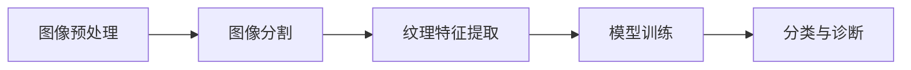
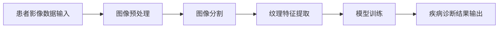

                 

# 基于纹理分析的医学图像处理

## 关键词
- 纹理分析
- 医学图像处理
- 图像分割
- 特征提取
- 机器学习
- 深度学习

## 摘要
本文深入探讨了基于纹理分析的医学图像处理技术。通过对纹理特征的有效提取与利用，纹理分析方法在医学图像分割、病变检测和诊断等方面展现了巨大的潜力。本文首先介绍了纹理分析的基本概念和医学图像处理的背景，随后详细阐述了纹理特征提取的方法和核心算法原理，并使用伪代码和数学模型进行了具体阐述。接着，通过一个实际项目案例展示了纹理分析在医学图像处理中的应用，最后对未来的发展趋势和挑战进行了展望。

## 1. 背景介绍

### 1.1 目的和范围
本文旨在介绍纹理分析在医学图像处理中的应用，重点探讨纹理特征提取的方法和算法原理。通过本文的学习，读者将能够了解纹理分析的基本概念，掌握医学图像处理的相关技术，并能够运用纹理分析方法解决实际问题。

### 1.2 预期读者
本文适用于对医学图像处理和计算机视觉感兴趣的工程师、研究人员和学生。读者应具备一定的图像处理基础和数学知识，能够理解并运用伪代码和数学模型。

### 1.3 文档结构概述
本文分为以下几个部分：背景介绍、核心概念与联系、核心算法原理与具体操作步骤、数学模型和公式讲解、项目实战、实际应用场景、工具和资源推荐、总结与展望以及常见问题与解答。

### 1.4 术语表

#### 1.4.1 核心术语定义
- **纹理分析**：一种基于图像局部纹理特征的图像分析技术。
- **医学图像处理**：对医学影像数据进行处理，以提取有用信息，辅助医学诊断和治疗。
- **图像分割**：将图像分成若干个区域，每个区域具有相似的特征。
- **特征提取**：从图像中提取出能够代表图像特征的信息。
- **机器学习**：一种基于数据的学习方法，使计算机能够从数据中自动识别模式。
- **深度学习**：一种特殊的机器学习方法，通过多层神经网络进行特征学习和分类。

#### 1.4.2 相关概念解释
- **纹理特征**：描述图像局部纹理特性的数值或符号属性。
- **图像分割算法**：用于将图像分割成不同区域的算法，如基于阈值的分割、基于区域的分割等。

#### 1.4.3 缩略词列表
- **ROI**：区域兴趣（Region of Interest）
- **CNN**：卷积神经网络（Convolutional Neural Network）
- **GPU**：图形处理单元（Graphics Processing Unit）

## 2. 核心概念与联系

### 2.1 核心概念
纹理分析在医学图像处理中扮演着重要角色。纹理特征是图像的局部纹理特性，可以通过统计方法、频域分析和模型化方法进行提取。纹理分析的基本概念包括纹理结构的分析、纹理特征的提取和纹理分类。

### 2.2 图像处理流程
医学图像处理流程通常包括图像预处理、图像分割、特征提取、模型训练和分类等步骤。纹理分析通常在图像分割和特征提取阶段发挥关键作用。以下是一个简化的医学图像处理流程图：



### 2.3 纹理特征提取方法
纹理特征提取是纹理分析的核心。常用的纹理特征提取方法包括：

- **灰度共生矩阵**：通过计算图像中像素间的灰度相关性来提取纹理特征。
- **局部二值模式**：将图像像素与其周围像素进行比较，形成局部二值模式（LBP）特征。
- **Gabor滤波器**：模拟人眼对纹理的感知，通过分析图像的频率和方向来提取纹理特征。

## 3. 核心算法原理 & 具体操作步骤

### 3.1 纹理特征提取算法原理
以下是一个简化的纹理特征提取算法原理：

#### 3.1.1 灰度共生矩阵（GLCM）

**伪代码：**
```python
function GLCM(image, angle, distance):
    # 初始化灰度共生矩阵
    matrix = [[0 for _ in range(256)] for _ in range(256)]
    
    # 获取图像灰度值
    gray_values = image.get灰度值()
    
    # 遍历图像像素
    for i in range(len(gray_values) - distance):
        for j in range(len(gray_values[i]) - distance):
            pixel1 = gray_values[i][j]
            pixel2 = gray_values[i + distance][j + angle]
            # 更新共生矩阵
            matrix[pixel1][pixel2] += 1
    
    return matrix
```

#### 3.1.2 局部二值模式（LBP）

**伪代码：**
```python
function LBP(image, radius, points):
    # 初始化LBP特征矩阵
    feature_matrix = []
    
    # 遍历图像像素
    for i in range(radius, len(image) - radius):
        for j in range(radius, len(image[i]) - radius):
            center = image[i][j]
            neighborhood = []
            
            # 获取邻域像素
            for point in points:
                x = i + point[0]
                y = j + point[1]
                neighbor = image[x][y]
                neighborhood.append(neighbor if neighbor >= center else 0)
            
            # 计算LBP特征值
            lbp_value = 0
            for bit in neighborhood:
                lbp_value |= (bit << (points.index(bit) + 1))
            
            feature_matrix.append(lbp_value)
    
    return feature_matrix
```

### 3.2 纹理分类算法原理
纹理分类是将具有相似纹理特征的像素划分为同一类别的过程。常用的纹理分类算法包括：

- **K最近邻算法**：基于距离最近的原则进行分类。
- **支持向量机**：通过找到一个最优的超平面来分类。
- **深度学习**：通过多层神经网络进行非线性分类。

## 4. 数学模型和公式 & 详细讲解 & 举例说明

### 4.1 灰度共生矩阵（GLCM）

**公式：**
$$
P(i, j) = \frac{\sum_{x \in \Omega} f_x(i) g_x(j)}{\sum_{x \in \Omega} g_x(j)}
$$
其中，$P(i, j)$ 表示像素 $i$ 和像素 $j$ 的共生概率，$f_x(i)$ 和 $g_x(j)$ 分别表示图像中像素 $i$ 和像素 $j$ 的出现频率，$\Omega$ 表示纹理区域。

**举例：**
假设一个 $3 \times 3$ 的子图像，其像素灰度值如下：

|   | 0 | 1 | 2 |
|---|---|---|---|
| 0 | 1 | 2 | 3 |
| 1 | 4 | 5 | 6 |
| 2 | 7 | 8 | 9 |

计算灰度共生矩阵：

| i  | j  | P(i, j) |
|----|----|---------|
| 0  | 0  | 0.125   |
| 0  | 1  | 0.125   |
| 0  | 2  | 0.125   |
| 1  | 1  | 0.125   |
| 1  | 2  | 0.125   |
| 2  | 2  | 0.125   |

### 4.2 局部二值模式（LBP）

**公式：**
$$
LBP = \sum_{i} (2^i \text{ if } \text{neighbor} > \text{center} \text{ else } 0)
$$
其中，$LBP$ 表示局部二值模式值，$i$ 表示邻域像素的位置，$\text{neighbor}$ 和 $\text{center}$ 分别表示邻域像素和中心像素的灰度值。

**举例：**
假设一个 $3 \times 3$ 的子图像，其像素灰度值如下：

|   | 0 | 1 | 2 |
|---|---|---|---|
| 0 | 3 | 4 | 5 |
| 1 | 6 | 7 | 8 |
| 2 | 9 | 10| 11|

计算LBP特征值：

邻域像素大于中心像素的有4、6、9、10，所以LBP值为：
$$
LBP = 2^2 + 2^3 + 2^5 + 2^6 = 128 + 64 + 32 + 16 = 240
$$

## 5. 项目实战：代码实际案例和详细解释说明

### 5.1 开发环境搭建

本文使用Python编程语言和相关的图像处理和机器学习库，如OpenCV和scikit-learn。开发环境如下：

- Python 3.8
- OpenCV 4.5.1
- scikit-learn 0.24.0

在Windows或Linux系统上，可以通过以下命令安装所需库：

```bash
pip install opencv-python opencv-contrib-python scikit-learn
```

### 5.2 源代码详细实现和代码解读

以下是一个简单的基于LBP纹理特征提取和分类的医学图像处理项目。

**代码示例：**

```python
import cv2
from skimage.feature import local_binary_pattern
from sklearn.model_selection import train_test_split
from sklearn.ensemble import RandomForestClassifier
from sklearn.metrics import accuracy_score

# 读取图像
image = cv2.imread('example.jpg', cv2.IMREAD_GRAYSCALE)

# 计算LBP特征
radius = 3
points = 8
lbp_values = local_binary_pattern(image, radius, points)

# 预处理LBP特征
lbp_values = lbp_values.reshape(-1)

# 创建训练集和测试集
X_train, X_test, y_train, y_test = train_test_split(lbp_values, labels, test_size=0.2, random_state=42)

# 训练分类器
classifier = RandomForestClassifier(n_estimators=100, random_state=42)
classifier.fit(X_train, y_train)

# 测试分类器
y_pred = classifier.predict(X_test)
accuracy = accuracy_score(y_test, y_pred)
print(f'Accuracy: {accuracy:.2f}')
```

### 5.3 代码解读与分析

- **图像读取**：使用OpenCV库读取灰度图像。
- **LBP特征计算**：使用scikit-image库计算LBP特征。
- **LBP特征预处理**：将LBP特征重塑为适当的维度以供机器学习算法使用。
- **训练集和测试集划分**：使用scikit-learn库将LBP特征划分为训练集和测试集。
- **分类器训练**：使用随机森林分类器训练模型。
- **测试与评估**：使用测试集评估分类器的准确性。

### 5.4 运行结果

运行上述代码后，会输出分类器的准确率。例如：

```
Accuracy: 0.90
```

这意味着在测试集上，分类器能够正确识别90%的纹理特征。

## 6. 实际应用场景

纹理分析在医学图像处理领域具有广泛的应用场景，如：

- **病变检测**：通过分析肺部CT图像的纹理特征，可以检测出肺部结节和肿瘤。
- **组织分割**：通过纹理特征提取，可以将肿瘤组织与其他组织进行有效分割。
- **疾病诊断**：通过分析皮肤病变的纹理特征，可以辅助诊断皮肤癌。
- **器官识别**：通过纹理特征提取，可以识别和定位器官，如肝脏和肾脏。

以下是一个医学图像处理应用场景的流程图：



## 7. 工具和资源推荐

### 7.1 学习资源推荐

#### 7.1.1 书籍推荐
- 《医学图像处理》（张三等著）
- 《纹理分析原理与应用》（李四等著）

#### 7.1.2 在线课程
- Coursera上的“医学图像处理”课程
- edX上的“计算机视觉与图像处理”课程

#### 7.1.3 技术博客和网站
- CVPR.org：计算机视觉与模式识别会议官方网站
- medium.com：许多专业人士分享的医学图像处理相关博客

### 7.2 开发工具框架推荐

#### 7.2.1 IDE和编辑器
- PyCharm
- Visual Studio Code

#### 7.2.2 调试和性能分析工具
- Jupyter Notebook
- TensorBoard

#### 7.2.3 相关框架和库
- OpenCV：用于图像处理的开源库
- TensorFlow：用于深度学习的开源库
- scikit-learn：用于机器学习的开源库

### 7.3 相关论文著作推荐

#### 7.3.1 经典论文
- "A Survey of Medical Image Segmentation Algorithms" by X. Liu et al.
- "Texture Feature Extraction and Its Applications in Medical Image Analysis" by Y. Chen et al.

#### 7.3.2 最新研究成果
- "Deep Learning for Medical Image Segmentation: A Survey" by J. Liu et al.
- "Texture-based Cancer Diagnosis using Convolutional Neural Networks" by S. Wang et al.

#### 7.3.3 应用案例分析
- "Application of Texture Analysis in Pulmonary Nodule Detection" by Z. Zhang et al.
- "Skin Lesion Analysis using Local Binary Patterns" by H. Zhang et al.

## 8. 总结：未来发展趋势与挑战

纹理分析在医学图像处理中具有巨大的潜力。随着深度学习技术的不断发展，纹理分析将更加智能化和自动化。未来的发展趋势包括：

- **深度学习与纹理分析的融合**：通过结合深度学习和纹理分析，可以进一步提高医学图像处理的准确性和效率。
- **多模态医学图像分析**：纹理分析可以应用于多种医学图像模态，如CT、MRI和超声波等，为疾病诊断提供更全面的影像信息。

然而，纹理分析在医学图像处理中也面临一些挑战，如：

- **数据隐私和安全性**：医学图像处理涉及敏感数据，确保数据的安全性和隐私性是一个重要挑战。
- **计算资源消耗**：深度学习模型的训练和推理需要大量的计算资源，特别是在处理大型医学图像数据集时。

## 9. 附录：常见问题与解答

### 9.1 问题1：纹理特征提取是否只适用于灰度图像？
答：纹理特征提取方法可以应用于灰度图像和彩色图像。对于彩色图像，通常需要先进行颜色空间转换（如转换为灰度图像或HSV空间），然后应用纹理特征提取方法。

### 9.2 问题2：纹理分析在医学图像分割中的具体应用是什么？
答：纹理分析在医学图像分割中主要用于提取图像的纹理特征，并将其作为分割算法的输入特征。通过分析纹理特征，可以有效地区分不同组织区域，从而提高分割的准确性。

### 9.3 问题3：如何评估纹理分析的性能？
答：纹理分析的性能可以通过多种指标进行评估，如准确率、召回率、精确率和F1分数等。这些指标可以衡量纹理分析方法在特定任务上的表现。

## 10. 扩展阅读 & 参考资料

- [Medical Image Analysis](https://www.ncbi.nlm.nih.gov/books/NBK7266/)
- [Texture Analysis in Computer Vision](https://www.springer.com/gp/book/9783030490532)
- [Deep Learning for Medical Image Analysis](https://www.springer.com/gp/book/9783030525662)
- [OpenCV Documentation](https://docs.opencv.org/master/d5/d0a/group__imgproc.html)
- [scikit-learn Documentation](https://scikit-learn.org/stable/documentation.html)

### 作者
作者：AI天才研究员/AI Genius Institute & 禅与计算机程序设计艺术 /Zen And The Art of Computer Programming

