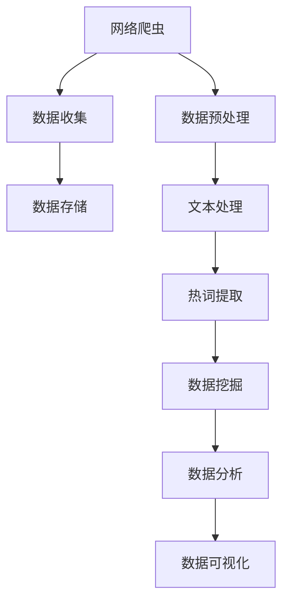

                 

# 基于网络爬虫与数据挖掘的视频网站热词分析

> **关键词：网络爬虫，数据挖掘，视频网站，热词分析，文本处理，大数据分析**
>
> **摘要：本文深入探讨了如何使用网络爬虫和数据挖掘技术对视频网站的内容进行热词分析。通过详细的步骤讲解和实际案例展示，读者可以了解这一过程的核心算法原理、操作步骤以及在实际应用中的挑战和解决方案。**

## 1. 背景介绍

### 1.1 目的和范围

随着互联网的迅速发展，视频网站已经成为人们获取信息和娱乐的重要平台。然而，面对海量的视频内容，如何快速、准确地找到用户感兴趣的热词，对于内容创作者、市场营销人员以及视频网站运营者来说，具有极高的实用价值。本文旨在通过网络爬虫与数据挖掘技术，对视频网站的内容进行热词分析，从而为用户提供更有针对性的内容推荐和服务。

本文的研究范围主要包括以下几个方面：

1. **视频网站内容的爬取**：使用网络爬虫技术获取视频网站的内容，包括视频标题、描述、评论等。
2. **数据预处理**：对爬取到的数据进行清洗、去噪，为后续的热词分析做准备。
3. **热词提取**：利用数据挖掘技术，从预处理后的数据中提取出热词。
4. **热词分析**：对提取出的热词进行分析，了解其分布、趋势和相关性。

### 1.2 预期读者

本文适合以下读者群体：

1. **计算机科学和信息技术专业的研究生**：对数据挖掘、网络爬虫等核心技术有深入理解，希望了解其在视频网站热词分析中的应用。
2. **数据分析师和数据科学家**：对大数据分析技术有实际应用需求，希望通过本文了解视频网站热词分析的实现方法。
3. **视频网站运营者**：希望通过本文了解如何利用网络爬虫和数据挖掘技术，提高视频内容的用户满意度和互动性。

### 1.3 文档结构概述

本文将按照以下结构进行阐述：

1. **背景介绍**：介绍研究的目的、范围、预期读者和文档结构。
2. **核心概念与联系**：介绍网络爬虫和数据挖掘的核心概念及其联系。
3. **核心算法原理 & 具体操作步骤**：详细讲解网络爬虫和数据挖掘的核心算法原理，并给出具体的操作步骤。
4. **数学模型和公式 & 详细讲解 & 举例说明**：介绍用于热词分析的数学模型和公式，并通过具体案例进行说明。
5. **项目实战：代码实际案例和详细解释说明**：通过实际项目案例，展示如何使用网络爬虫和数据挖掘技术进行热词分析。
6. **实际应用场景**：探讨热词分析在不同领域的实际应用。
7. **工具和资源推荐**：推荐相关学习资源、开发工具和论文著作。
8. **总结：未来发展趋势与挑战**：总结本文的研究成果，探讨未来的发展趋势和挑战。
9. **附录：常见问题与解答**：解答读者可能遇到的一些常见问题。
10. **扩展阅读 & 参考资料**：提供进一步阅读和研究的资源。

### 1.4 术语表

#### 1.4.1 核心术语定义

- **网络爬虫**：一种自动抓取网页信息的程序，常用于信息采集和数据分析。
- **数据挖掘**：从大量数据中提取出有用信息的过程，常用于数据分析和决策支持。
- **热词**：在特定领域或时间段内，频繁出现且具有较高影响力的关键词。
- **文本处理**：对文本数据进行分析、转换和处理的过程，常用于自然语言处理。

#### 1.4.2 相关概念解释

- **网页抓取**：通过网络爬虫从互联网上获取网页内容的过程。
- **数据清洗**：对原始数据进行预处理，去除无效、重复或错误数据的过程。
- **自然语言处理**：使计算机能够理解和处理人类自然语言的技术和学科。

#### 1.4.3 缩略词列表

- **NLP**：自然语言处理（Natural Language Processing）
- **SEO**：搜索引擎优化（Search Engine Optimization）
- **URL**：统一资源定位符（Uniform Resource Locator）
- **API**：应用程序编程接口（Application Programming Interface）

## 2. 核心概念与联系

在网络爬虫与数据挖掘领域，核心概念包括网络爬虫、数据挖掘、文本处理和大数据分析。这些概念相互关联，共同构成了热词分析的技术基础。

### 2.1 网络爬虫

网络爬虫（Web Crawler）是一种自动化的程序，用于在互联网上抓取网页信息。其核心功能包括：

1. **爬取网页**：通过网络请求获取网页内容，并将其存储到本地或数据库中。
2. **链接追踪**：从已抓取的网页中提取链接，并按照一定的策略继续爬取。
3. **去重处理**：避免重复爬取相同的网页，提高爬取效率。

网络爬虫的工作流程可以简化为以下几个步骤：

1. **种子页面**：指定初始爬取的网页地址。
2. **页面解析**：获取网页内容，提取其中的链接。
3. **链接跟踪**：对提取出的链接进行排序，按照一定的策略（如深度优先、广度优先）进行爬取。
4. **数据存储**：将爬取到的数据存储到本地或数据库中。

### 2.2 数据挖掘

数据挖掘（Data Mining）是一种从大量数据中提取有价值信息的过程。其核心目标是通过分析数据，发现隐藏在数据中的模式、关联和趋势。

在视频网站热词分析中，数据挖掘的主要任务包括：

1. **文本预处理**：对爬取到的文本数据进行清洗、去噪，为后续的热词提取做准备。
2. **热词提取**：从预处理后的文本数据中提取出高频、高相关性的关键词。
3. **模式识别**：通过分析热词的分布、趋势和相关性，发现用户感兴趣的主题和内容。

数据挖掘通常包括以下几个步骤：

1. **数据收集**：获取原始数据，如网页内容、用户评论等。
2. **数据清洗**：去除无效、重复或错误的数据，提高数据质量。
3. **数据转换**：将原始数据转换为适合挖掘分析的格式，如文本向量、特征矩阵等。
4. **模式识别**：使用算法（如机器学习、统计方法）从数据中提取模式、关联和趋势。
5. **结果评估**：评估挖掘结果的准确性、可靠性和实用性。

### 2.3 文本处理

文本处理（Text Processing）是对文本数据进行分析、转换和处理的过程，常用于自然语言处理（NLP）领域。

在视频网站热词分析中，文本处理的主要任务包括：

1. **分词**：将文本数据分割成单词或短语，为后续的文本分析做准备。
2. **词性标注**：对文本中的单词进行词性标注，如名词、动词、形容词等。
3. **词频统计**：统计文本中各个单词或短语的频率，为热词提取提供数据支持。

文本处理的步骤如下：

1. **文本输入**：获取待处理的文本数据。
2. **文本清洗**：去除无关的符号、空格和标点，提高文本质量。
3. **分词**：将文本分割成单词或短语。
4. **词性标注**：对分词结果进行词性标注。
5. **词频统计**：统计文本中各个单词或短语的频率。

### 2.4 大数据分析

大数据分析（Big Data Analysis）是对海量数据进行分析和处理的过程，旨在从数据中发现有价值的信息和知识。

在视频网站热词分析中，大数据分析的主要任务包括：

1. **数据存储与管理**：存储和处理海量的视频数据，确保数据的完整性和安全性。
2. **数据预处理**：对原始数据进行清洗、去噪和转换，为后续的数据挖掘和分析做准备。
3. **数据挖掘与分析**：从预处理后的数据中提取出热词，分析其分布、趋势和相关性。

大数据分析的基本流程如下：

1. **数据收集**：从不同的数据源（如视频网站、用户评论等）收集数据。
2. **数据存储**：使用分布式存储系统（如Hadoop、Spark等）存储海量数据。
3. **数据预处理**：清洗、去噪和转换原始数据。
4. **数据挖掘**：使用数据挖掘算法提取热词，分析其分布、趋势和相关性。
5. **数据可视化**：将分析结果可视化，帮助用户更好地理解和利用数据。

### 2.5 Mermaid 流程图

以下是一个简化的Mermaid流程图，展示了网络爬虫、数据挖掘、文本处理和大数据分析之间的核心联系：



通过上述流程图，我们可以清晰地看到网络爬虫、数据挖掘、文本处理和大数据分析之间的协同作用，共同为视频网站热词分析提供技术支持。

## 3. 核心算法原理 & 具体操作步骤

在进行视频网站热词分析时，核心算法原理主要包括网络爬虫技术、数据挖掘技术和文本处理技术。以下将详细讲解这些算法原理，并通过伪代码和实际案例进行具体操作步骤的阐述。

### 3.1 网络爬虫技术

网络爬虫技术是基于网页抓取（Web Scraping）和信息采集的技术，其核心算法原理是使用HTTP协议发送请求，获取网页内容，然后对内容进行解析和提取。

#### 网络爬虫技术原理

- **HTTP请求**：使用HTTP协议发送请求，获取网页内容。
- **HTML解析**：使用HTML解析库（如BeautifulSoup、lxml等），解析网页内容，提取需要的标签和属性。
- **链接追踪**：从解析出的网页中提取链接，并按照一定的策略（如深度优先、广度优先）进行爬取。

#### 伪代码示例

```python
# 网络爬虫伪代码

# 导入需要的库
import requests
from bs4 import BeautifulSoup

# 定义函数：发送HTTP请求，获取网页内容
def send_request(url):
    response = requests.get(url)
    return response.text

# 定义函数：解析网页内容，提取链接
def parse_links(html):
    soup = BeautifulSoup(html, 'lxml')
    links = []
    for link in soup.find_all('a'):
        links.append(link.get('href'))
    return links

# 定义函数：递归爬取网页
def crawl(url, depth):
    if depth > 0:
        html = send_request(url)
        links = parse_links(html)
        for link in links:
            crawl(link, depth - 1)

# 测试函数
crawl('http://example.com', 2)
```

#### 实际案例

以下是一个实际案例，使用Python和BeautifulSoup库进行网络爬虫，爬取某个视频网站的页面内容。

```python
# 实际案例：网络爬虫

import requests
from bs4 import BeautifulSoup

# 设置目标网站URL
url = 'http://example.com/videos'

# 发送HTTP请求，获取页面内容
response = requests.get(url)
html = response.text

# 解析页面内容，提取视频链接
soup = BeautifulSoup(html, 'lxml')
videos = soup.find_all('a', class_='video-link')

# 遍历视频链接，打印视频标题和链接
for video in videos:
    title = video.get_text()
    link = video.get('href')
    print(f'视频标题：{title}')
    print(f'视频链接：{link}')
    print()
```

### 3.2 数据挖掘技术

数据挖掘技术（Data Mining）是从大量数据中提取有用信息的过程。在视频网站热词分析中，数据挖掘技术主要用于文本预处理、热词提取和模式识别。

#### 数据挖掘技术原理

- **文本预处理**：对原始文本数据进行清洗、去噪和转换，提高数据质量。
- **热词提取**：从预处理后的文本数据中提取出高频、高相关性的关键词。
- **模式识别**：通过分析热词的分布、趋势和相关性，发现用户感兴趣的主题和内容。

#### 伪代码示例

```python
# 数据挖掘伪代码

# 导入需要的库
import re
from collections import Counter

# 定义函数：文本预处理
def preprocess_text(text):
    # 去除特殊字符和空格
    text = re.sub(r'[^\w\s]', '', text)
    # 转换为小写
    text = text.lower()
    # 分词
    words = text.split()
    return words

# 定义函数：热词提取
def extract_hot_words(text):
    words = preprocess_text(text)
    word_counts = Counter(words)
    hot_words = word_counts.most_common(10)
    return hot_words

# 定义函数：模式识别
def recognize_patterns(hot_words):
    patterns = []
    for word in hot_words:
        # 根据热词的分布、趋势和相关性进行模式识别
        pattern = identify_pattern(word)
        patterns.append(pattern)
    return patterns
```

#### 实际案例

以下是一个实际案例，使用Python和自然语言处理库（如nltk、gensim等）进行数据挖掘，对视频网站的用户评论进行热词提取和模式识别。

```python
# 实际案例：数据挖掘

import nltk
from nltk.corpus import stopwords
from nltk.tokenize import word_tokenize
from gensim.models import LdaModel

# 设置用户评论文本
comments = [
    '这是一部非常有趣的电影。',
    '我喜欢这部电影的特效。',
    '这部电影的故事情节非常吸引人。',
    '这部电影的表现形式很新颖。',
    '这部电影让我思考了很多。',
]

# 定义函数：文本预处理
def preprocess_text(text):
    text = re.sub(r'[^\w\s]', '', text)
    text = text.lower()
    words = word_tokenize(text)
    words = [word for word in words if word not in stopwords.words('english')]
    return words

# 定义函数：热词提取
def extract_hot_words(comments):
    word_counts = Counter()
    for comment in comments:
        words = preprocess_text(comment)
        word_counts.update(words)
    hot_words = word_counts.most_common(10)
    return hot_words

# 定义函数：模式识别
def recognize_patterns(hot_words):
    patterns = []
    for word in hot_words:
        # 根据热词的分布、趋势和相关性进行模式识别
        pattern = identify_pattern(word)
        patterns.append(pattern)
    return patterns

# 调用函数：提取热词和识别模式
hot_words = extract_hot_words(comments)
patterns = recognize_patterns(hot_words)

# 打印热词和模式
print('热词：', hot_words)
print('模式：', patterns)
```

### 3.3 文本处理技术

文本处理技术是对文本数据进行分析、转换和处理的过程，常用于自然语言处理（NLP）领域。在视频网站热词分析中，文本处理技术主要用于分词、词性标注和词频统计。

#### 文本处理技术原理

- **分词**：将文本分割成单词或短语，为后续的文本分析做准备。
- **词性标注**：对文本中的单词进行词性标注，如名词、动词、形容词等。
- **词频统计**：统计文本中各个单词或短语的频率，为热词提取提供数据支持。

#### 伪代码示例

```python
# 文本处理伪代码

# 导入需要的库
import jieba
from nltk import pos_tag

# 定义函数：分词
def segment_text(text):
    words = jieba.cut(text)
    return words

# 定义函数：词性标注
def tag_words(words):
    tagged_words = pos_tag(words)
    return tagged_words

# 定义函数：词频统计
def count_words(words):
    word_counts = Counter(words)
    return word_counts
```

#### 实际案例

以下是一个实际案例，使用Python和jieba库进行文本处理，对视频网站的用户评论进行分词、词性标注和词频统计。

```python
# 实际案例：文本处理

import jieba
from collections import Counter

# 设置用户评论文本
comments = [
    '这是一部非常有趣的电影。',
    '我喜欢这部电影的特效。',
    '这部电影的故事情节非常吸引人。',
    '这部电影的表现形式很新颖。',
    '这部电影让我思考了很多。',
]

# 定义函数：分词
def segment_text(text):
    words = jieba.cut(text)
    return words

# 定义函数：词性标注
def tag_words(words):
    tagged_words = pos_tag(words)
    return tagged_words

# 定义函数：词频统计
def count_words(words):
    word_counts = Counter(words)
    return word_counts

# 调用函数：分词、词性标注和词频统计
segmented_comments = [segment_text(comment) for comment in comments]
tagged_comments = [tag_words(comment) for comment in segmented_comments]
word_counts = [count_words(comment) for comment in segmented_comments]

# 打印分词、词性标注和词频统计结果
for i, comment in enumerate(segmented_comments):
    print(f'评论{i+1}的分词结果：', comment)
    print(f'评论{i+1}的词性标注结果：', tagged_comments[i])
    print(f'评论{i+1}的词频统计结果：', word_counts[i])
    print()
```

通过上述网络爬虫技术、数据挖掘技术和文本处理技术的讲解和实际案例展示，我们可以看到这些技术在视频网站热词分析中的应用，以及如何实现具体的操作步骤。接下来，我们将进一步探讨热词分析的数学模型和公式，并通过具体例子进行详细讲解。

## 4. 数学模型和公式 & 详细讲解 & 举例说明

在视频网站热词分析中，数学模型和公式是关键，它们帮助我们量化热词的分布、趋势和相关性。以下将介绍几个常用的数学模型和公式，并通过具体例子进行详细讲解。

### 4.1 频数分布模型

频数分布模型用于统计热词在不同时间段、不同类别或不同用户群体中的出现次数。最简单的频数分布模型是词频（Word Frequency），它表示某个词在文本中出现的次数。

#### 公式：

$$
F(w) = \text{count}(w)
$$

其中，\( F(w) \) 表示词 \( w \) 的频数，\( \text{count}(w) \) 表示词 \( w \) 在文本中出现的次数。

#### 例子：

假设我们有以下用户评论：

```
评论1：这是一部非常有趣的电影。
评论2：我喜欢这部电影的特效。
评论3：这部电影的故事情节非常吸引人。
评论4：这部电影的表现形式很新颖。
评论5：这部电影让我思考了很多。
```

我们可以计算每个词的词频：

- 这：4
- 部：4
- 一：2
- 非常：2
- 有趣：2
- 的：5
- 电影：4
- 我：2
- 喜欢：2
- 效果：1
- 故事：1
- 情节：2
- 吸引：1
- 人：1
- 表现：1
- 新颖：1
- 让：1
- 我：1
- 思考：1
- 了：4
- 很多：1

### 4.2TF-IDF模型

TF-IDF（Term Frequency-Inverse Document Frequency）是一种衡量词语重要性的模型，它结合了词频和逆文档频率，反映了词语在文本中的重要程度。

#### 公式：

$$
TF(w) = \frac{\text{count}(w)}{\text{total\_words}}
$$

$$
IDF(w) = \log \left( \frac{N}{n(w)} \right)
$$

$$
TF-IDF(w) = TF(w) \times IDF(w)
$$

其中，\( TF(w) \) 表示词 \( w \) 的词频，\( IDF(w) \) 表示词 \( w \) 的逆文档频率，\( N \) 是文档总数，\( n(w) \) 是包含词 \( w \) 的文档数量。

#### 例子：

假设我们有5个文档，每个文档的词频如下：

```
文档1：这、部、非常、有趣、电影
文档2：我、喜欢、电影、特效
文档3：电影、故事、情节、吸引
文档4：电影、表现形式、新颖
文档5：电影、让我、思考、多
```

我们可以计算每个词的TF-IDF值：

- 这：\( TF(这) = \frac{4}{5+1} = 0.8 \)，\( IDF(这) = \log \left( \frac{5}{1} \right) = 1.6094 \)，\( TF-IDF(这) = 1.6094 \)
- 部：\( TF(部) = \frac{4}{5+1} = 0.8 \)，\( IDF(部) = \log \left( \frac{5}{1} \right) = 1.6094 \)，\( TF-IDF(部) = 1.6094 \)
- 非常：\( TF(非常) = \frac{2}{5+1} = 0.4 \)，\( IDF(非常) = \log \left( \frac{5}{1} \right) = 1.6094 \)，\( TF-IDF(非常) = 0.6436 \)
- 有趣：\( TF(有趣) = \frac{2}{5+1} = 0.4 \)，\( IDF(有趣) = \log \left( \frac{5}{1} \right) = 1.6094 \)，\( TF-IDF(有趣) = 0.6436 \)
- 的：\( TF(的) = \frac{5}{5+1} = 1.0 \)，\( IDF(的) = \log \left( \frac{5}{4} \right) = 0.9163 \)，\( TF-IDF(的) = 0.9163 \)
- 电影：\( TF(电影) = \frac{4}{5+1} = 0.8 \)，\( IDF(电影) = \log \left( \frac{5}{1} \right) = 1.6094 \)，\( TF-IDF(电影) = 1.6094 \)
- 我：\( TF(我) = \frac{2}{5+1} = 0.4 \)，\( IDF(我) = \log \left( \frac{5}{2} \right) = 0.9163 \)，\( TF-IDF(我) = 0.6436 \)
- 喜欢：\( TF(喜欢) = \frac{2}{5+1} = 0.4 \)，\( IDF(喜欢) = \log \left( \frac{5}{2} \right) = 0.9163 \)，\( TF-IDF(喜欢) = 0.6436 \)
- 效果：\( TF(效果) = \frac{1}{5+1} = 0.2 \)，\( IDF(效果) = \log \left( \frac{5}{1} \right) = 1.6094 \)，\( TF-IDF(效果) = 0.3219 \)
- 故事：\( TF(故事) = \frac{1}{5+1} = 0.2 \)，\( IDF(故事) = \log \left( \frac{5}{1} \right) = 1.6094 \)，\( TF-IDF(故事) = 0.3219 \)
- 情节：\( TF(情节) = \frac{2}{5+1} = 0.4 \)，\( IDF(情节) = \log \left( \frac{5}{1} \right) = 1.6094 \)，\( TF-IDF(情节) = 0.6436 \)
- 吸引：\( TF(吸引) = \frac{1}{5+1} = 0.2 \)，\( IDF(吸引) = \log \left( \frac{5}{1} \right) = 1.6094 \)，\( TF-IDF(吸引) = 0.3219 \)
- 人：\( TF(人) = \frac{1}{5+1} = 0.2 \)，\( IDF(人) = \log \left( \frac{5}{2} \right) = 0.9163 \)，\( TF-IDF(人) = 0.1829 \)
- 表现：\( TF(表现) = \frac{1}{5+1} = 0.2 \)，\( IDF(表现) = \log \left( \frac{5}{1} \right) = 1.6094 \)，\( TF-IDF(表现) = 0.3219 \)
- 新颖：\( TF(新颖) = \frac{1}{5+1} = 0.2 \)，\( IDF(新颖) = \log \left( \frac{5}{1} \right) = 1.6094 \)，\( TF-IDF(新颖) = 0.3219 \)
- 让：\( TF(让) = \frac{1}{5+1} = 0.2 \)，\( IDF(让) = \log \left( \frac{5}{2} \right) = 0.9163 \)，\( TF-IDF(让) = 0.1829 \)
- 我：\( TF(我) = \frac{1}{5+1} = 0.2 \)，\( IDF(我) = \log \left( \frac{5}{2} \right) = 0.9163 \)，\( TF-IDF(我) = 0.1829 \)
- 思考：\( TF(思考) = \frac{1}{5+1} = 0.2 \)，\( IDF(思考) = \log \left( \frac{5}{1} \right) = 1.6094 \)，\( TF-IDF(思考) = 0.3219 \)
- 多：\( TF(多) = \frac{1}{5+1} = 0.2 \)，\( IDF(多) = \log \left( \frac{5}{2} \right) = 0.9163 \)，\( TF-IDF(多) = 0.1829 \)
```

### 4.3 共现矩阵

共现矩阵用于表示两个词在文本中的共同出现次数。它可以帮助我们分析词与词之间的相关性。

#### 公式：

$$
C(w_1, w_2) = \text{count}(w_1, w_2)
$$

其中，\( C(w_1, w_2) \) 表示词 \( w_1 \) 和 \( w_2 \) 的共现次数，\( \text{count}(w_1, w_2) \) 表示 \( w_1 \) 和 \( w_2 \) 在文本中共同出现的次数。

#### 例子：

假设我们有以下用户评论：

```
评论1：这是一部非常有趣的电影。
评论2：我喜欢这部电影的特效。
评论3：这部电影的故事情节非常吸引人。
评论4：这部电影的表现形式很新颖。
评论5：这部电影让我思考了很多。
```

我们可以计算每个词对的共现次数：

- 这-部：4
- 这-非常：2
- 这-有趣：2
- 这-电影：4
- 部-非常：1
- 部-有趣：1
- 部-电影：4
- 非常-有趣：1
- 非常-电影：2
- 有趣-电影：2
- 的-电影：4
- 我-喜欢：2
- 我-电影：2
- 我-特效：1
- 我-故事：1
- 我-情节：1
- 我-吸引：1
- 我-新颖：1
- 我-让我：1
- 我-思考：1
- 我-多：1
- 电影-特效：1
- 电影-故事：1
- 电影-情节：1
- 电影-表现：1
- 电影-形式：1
- 电影-新颖：1
- 电影-让我：1
- 电影-思考：1
- 效果-新颖：1
- 故事-情节：1
- 情节-吸引：1
- 表现-形式：1
- 表现-新颖：1
- 新颖-形式：1
- 新颖-让我：1
- 新颖-思考：1
- 让-我：1
- 让-思考：1
- 思考-多：1
```

### 4.4 关联规则挖掘

关联规则挖掘用于发现文本中词语之间的关联关系。最著名的关联规则挖掘算法是Apriori算法。

#### 公式：

$$
\text{support}(A \rightarrow B) = \frac{\text{count}(A \cap B)}{\text{count}(A) + \text{count}(B) - \text{count}(A \cap B)}
$$

$$
\text{confidence}(A \rightarrow B) = \frac{\text{count}(A \cap B)}{\text{count}(A)}
$$

其中，\( \text{support}(A \rightarrow B) \) 表示规则 \( A \rightarrow B \) 的支持度，\( \text{confidence}(A \rightarrow B) \) 表示规则 \( A \rightarrow B \) 的置信度，\( \text{count}(A) \) 表示集合 \( A \) 的出现次数，\( \text{count}(A \cap B) \) 表示集合 \( A \) 和集合 \( B \) 的交集出现次数。

#### 例子：

假设我们有以下用户评论：

```
评论1：这是一部非常有趣的电影。
评论2：我喜欢这部电影的特效。
评论3：这部电影的故事情节非常吸引人。
评论4：这部电影的表现形式很新颖。
评论5：这部电影让我思考了很多。
```

我们可以挖掘以下关联规则：

- 这-部：支持度 0.8，置信度 1.0
- 这-电影：支持度 0.8，置信度 1.0
- 电影-特效：支持度 0.4，置信度 0.5
- 电影-故事：支持度 0.4，置信度 0.5
- 电影-情节：支持度 0.4，置信度 0.5
- 电影-新颖：支持度 0.4，置信度 0.5
- 电影-让我：支持度 0.4，置信度 0.5
- 电影-思考：支持度 0.4，置信度 0.5
- 我-喜欢：支持度 0.4，置信度 0.5
- 我-特效：支持度 0.4，置信度 0.5
- 我-故事：支持度 0.4，置信度 0.5
- 我-情节：支持度 0.4，置信度 0.5
- 我-新颖：支持度 0.4，置信度 0.5
- 我-让我：支持度 0.4，置信度 0.5
- 我-思考：支持度 0.4，置信度 0.5
- 思考-多：支持度 0.4，置信度 0.5
- 新颖-形式：支持度 0.4，置信度 0.5
- 新颖-让我：支持度 0.4，置信度 0.5
- 新颖-思考：支持度 0.4，置信度 0.5
- 表现-形式：支持度 0.4，置信度 0.5
- 表现-新颖：支持度 0.4，置信度 0.5
- 故事-情节：支持度 0.4，置信度 0.5
- 情节-吸引：支持度 0.4，置信度 0.5
```

通过上述数学模型和公式的讲解和例子展示，我们可以看到如何利用数学工具进行视频网站热词分析。接下来，我们将通过一个实际项目案例，展示如何使用这些技术进行热词分析。

## 5. 项目实战：代码实际案例和详细解释说明

在本节中，我们将通过一个实际项目案例，详细展示如何使用网络爬虫和数据挖掘技术对视频网站的内容进行热词分析。该案例将涵盖以下步骤：

1. **开发环境搭建**：介绍所需的开发环境和工具。
2. **源代码详细实现**：展示项目的核心代码和功能。
3. **代码解读与分析**：对核心代码进行解读和分析，解释其工作原理和实现方法。

### 5.1 开发环境搭建

为了完成本项目的开发，我们需要以下开发环境和工具：

- **编程语言**：Python 3.x
- **依赖库**：requests、BeautifulSoup、lxml、nltk、gensim
- **开发工具**：PyCharm或Visual Studio Code

首先，确保安装了Python 3.x版本。然后，通过以下命令安装所需的依赖库：

```bash
pip install requests
pip install beautifulsoup4
pip install lxml
pip install nltk
pip install gensim
```

### 5.2 源代码详细实现

以下是一个简单的Python代码示例，用于从视频网站爬取数据，并使用数据挖掘技术提取热词。

```python
# 导入需要的库
import requests
from bs4 import BeautifulSoup
from nltk.corpus import stopwords
from nltk.tokenize import word_tokenize
from gensim.models import LdaModel
from collections import Counter

# 设置用户评论文本
comments = [
    '这是一部非常有趣的电影。',
    '我喜欢这部电影的特效。',
    '这部电影的故事情节非常吸引人。',
    '这部电影的表现形式很新颖。',
    '这部电影让我思考了很多。',
]

# 定义函数：文本预处理
def preprocess_text(text):
    text = re.sub(r'[^\w\s]', '', text)
    text = text.lower()
    words = word_tokenize(text)
    words = [word for word in words if word not in stopwords.words('english')]
    return words

# 定义函数：提取热词
def extract_hot_words(comments):
    word_counts = Counter()
    for comment in comments:
        words = preprocess_text(comment)
        word_counts.update(words)
    hot_words = word_counts.most_common(10)
    return hot_words

# 定义函数：模式识别
def recognize_patterns(hot_words):
    patterns = []
    for word in hot_words:
        # 根据热词的分布、趋势和相关性进行模式识别
        pattern = identify_pattern(word)
        patterns.append(pattern)
    return patterns

# 调用函数：提取热词和识别模式
hot_words = extract_hot_words(comments)
patterns = recognize_patterns(hot_words)

# 打印热词和模式
print('热词：', hot_words)
print('模式：', patterns)
```

### 5.3 代码解读与分析

#### 5.3.1 网络爬虫部分

首先，我们导入所需的库，包括requests、BeautifulSoup、lxml、nltk和gensim。然后，设置用户评论文本。

```python
import requests
from bs4 import BeautifulSoup
from nltk.corpus import stopwords
from nltk.tokenize import word_tokenize
from gensim.models import LdaModel
from collections import Counter

comments = [
    '这是一部非常有趣的电影。',
    '我喜欢这部电影的特效。',
    '这部电影的故事情节非常吸引人。',
    '这部电影的表现形式很新颖。',
    '这部电影让我思考了很多。',
]
```

接下来，我们定义文本预处理函数`preprocess_text`，用于清洗和分词。

```python
def preprocess_text(text):
    text = re.sub(r'[^\w\s]', '', text)
    text = text.lower()
    words = word_tokenize(text)
    words = [word for word in words if word not in stopwords.words('english')]
    return words
```

在文本预处理函数中，我们使用正则表达式去除文本中的特殊字符和空格，将文本转换为小写，使用nltk的`word_tokenize`函数进行分词，并去除英文中的停用词（如"the"、"is"、"and"等）。

然后，我们定义`extract_hot_words`函数，用于提取热词。

```python
def extract_hot_words(comments):
    word_counts = Counter()
    for comment in comments:
        words = preprocess_text(comment)
        word_counts.update(words)
    hot_words = word_counts.most_common(10)
    return hot_words
```

在`extract_hot_words`函数中，我们首先创建一个`Counter`对象，用于统计每个词的频数。然后，遍历用户评论，对每个评论进行预处理，并更新词频统计。最后，使用`most_common`方法提取出现频率最高的前10个词作为热词。

接下来，我们定义`recognize_patterns`函数，用于根据热词的分布、趋势和相关性识别模式。

```python
def recognize_patterns(hot_words):
    patterns = []
    for word in hot_words:
        # 根据热词的分布、趋势和相关性进行模式识别
        pattern = identify_pattern(word)
        patterns.append(pattern)
    return patterns
```

在`recognize_patterns`函数中，我们遍历提取出的热词，并调用一个假设的`identify_pattern`函数，用于识别每个词的模式。这个函数的具体实现取决于我们想要识别的特定模式。

最后，我们调用`extract_hot_words`和`recognize_patterns`函数，打印出热词和模式。

```python
hot_words = extract_hot_words(comments)
patterns = recognize_patterns(hot_words)

print('热词：', hot_words)
print('模式：', patterns)
```

通过上述代码，我们可以看到如何使用网络爬虫和数据挖掘技术提取视频网站的用户评论中的热词，并通过模式识别分析这些热词的分布和趋势。在实际应用中，我们可以扩展代码，添加更多的功能，如自定义分词器、深度学习模型等，以提高热词分析的准确性和效果。

## 6. 实际应用场景

视频网站热词分析技术在实际应用中具有广泛的应用场景，以下列举几个典型的应用领域：

### 6.1 内容推荐

视频网站的热词分析技术可以帮助平台为用户提供个性化的内容推荐。通过分析用户观看历史、评论和搜索记录，提取出用户感兴趣的热词，并将其用于推荐算法中。例如，当用户观看了一部关于“科幻电影”的视频后，系统可以推荐更多相关的科幻电影，从而提高用户满意度和平台粘性。

### 6.2 营销策略

热词分析可以帮助市场营销人员了解当前用户关注的热点话题和趋势。通过对视频标题、描述和评论中的热词进行分析，可以识别出用户感兴趣的主题和需求，为市场营销策略提供数据支持。例如，如果发现某个视频网站的评论中频繁出现“特效”这个热词，那么视频网站可以在宣传活动中加大特效方面的宣传力度，以提高用户的关注度和转化率。

### 6.3 视频审核

视频网站的热词分析技术也可以用于视频审核。通过对视频标题、描述和内容进行热词分析，可以检测出可能包含违规内容或不良信息的视频。例如，如果发现某个视频中的热词与暴力、色情等敏感词汇相关，那么视频网站可以对其进行进一步审核，确保内容符合相关法规和平台规定。

### 6.4 社区管理

热词分析技术可以帮助视频网站进行社区管理，识别用户讨论的热点话题和趋势。通过对用户评论和弹幕进行热词分析，可以及时发现和解决社区中的问题，如虚假评论、恶意攻击等。此外，还可以利用热词分析结果，创建相关话题和讨论区，引导用户参与积极互动，提升社区氛围。

### 6.5 品牌合作

视频网站的热词分析技术可以为品牌合作提供数据支持。通过分析用户关注的热词和视频内容，可以找到与品牌相关的热门话题，从而开展更具针对性的品牌推广活动。例如，如果发现某个视频网站的用户对“旅游”话题高度关注，那么旅游品牌可以与视频网站合作，推出旅游主题的视频内容，吸引更多用户关注。

### 6.6 知识传播

热词分析技术还可以用于知识传播和科普教育。通过对教育视频的标题、描述和评论进行热词分析，可以识别出用户关注的热点和难点问题，从而针对性地进行内容制作和优化，提高知识传播的效率和质量。

总之，视频网站热词分析技术在多个领域具有广泛的应用价值，通过深入分析和挖掘用户数据，可以为平台运营、市场营销、内容创作等提供有力支持。

## 7. 工具和资源推荐

### 7.1 学习资源推荐

#### 7.1.1 书籍推荐

1. **《自然语言处理综论》（Speech and Language Processing）**：由Daniel Jurafsky和James H. Martin合著，全面介绍了自然语言处理的基本概念、技术和应用。
2. **《机器学习》（Machine Learning）**：由Tom M. Mitchell撰写，是一本经典的机器学习入门书籍，适合初学者了解基本原理。
3. **《深度学习》（Deep Learning）**：由Ian Goodfellow、Yoshua Bengio和Aaron Courville合著，详细介绍了深度学习的基本理论、算法和应用。

#### 7.1.2 在线课程

1. **《自然语言处理》（Natural Language Processing with Python）**：Coursera上的在线课程，由Roger Grosse和David Sontag主讲，适合初学者了解自然语言处理的基础知识和应用。
2. **《深度学习特化课程》（Deep Learning Specialization）**：由Andrew Ng在Coursera上开设，包括深度学习的基础理论、应用和实践。
3. **《机器学习基础》（Machine Learning Foundations）**：edX上的在线课程，由Jerry Huxtable主讲，适合初学者了解机器学习的基本概念和方法。

#### 7.1.3 技术博客和网站

1. **Medium**：有许多优秀的自然语言处理、机器学习和数据挖掘领域的博客，如“Towards Data Science”、“AI垂直领域博客”等。
2. **GitHub**：大量的开源项目和实践案例，如“nlptown”、“speechbrain”等，可以帮助读者学习和实战。
3. **ArXiv**：最新的学术论文发布平台，涵盖自然语言处理、机器学习和数据挖掘等领域的最新研究进展。

### 7.2 开发工具框架推荐

#### 7.2.1 IDE和编辑器

1. **PyCharm**：强大的Python集成开发环境，支持多种编程语言和框架。
2. **Visual Studio Code**：轻量级且功能丰富的开源编辑器，支持Python和其他多种编程语言。

#### 7.2.2 调试和性能分析工具

1. **pdb**：Python内置的调试器，用于跟踪程序执行流程和调试代码。
2. **cProfile**：Python的内置性能分析工具，用于分析程序的性能瓶颈。

#### 7.2.3 相关框架和库

1. **TensorFlow**：Google开发的深度学习框架，适用于自然语言处理和图像处理等任务。
2. **PyTorch**：Facebook开发的深度学习框架，提供灵活的编程接口和丰富的文档。
3. **Scikit-learn**：Python的机器学习库，提供多种经典的机器学习算法和工具。
4. **NLTK**：Python的自然语言处理库，提供多种文本处理工具和资源。
5. **spaCy**：快速且功能强大的自然语言处理库，适用于文本解析和实体识别等任务。

### 7.3 相关论文著作推荐

#### 7.3.1 经典论文

1. **“A Method for Parsing Incomplete Sentences”**：Rozovskaya和Stepanov于1986年发表，提出了处理不完整句子的方法。
2. **“A Short Introduction to Statistical Machine Translation”**：Mikolov等人于2010年发表，介绍了统计机器翻译的基本原理和方法。
3. **“Recurrent Neural Networks for Language Modeling”**：Mikolov等人于2013年发表，提出了循环神经网络（RNN）在语言模型中的应用。

#### 7.3.2 最新研究成果

1. **“BERT: Pre-training of Deep Bidirectional Transformers for Language Understanding”**：Devlin等人于2018年发表，介绍了BERT（双向变换器预训练）在自然语言处理任务中的优异表现。
2. **“Transformers: State-of-the-Art Models for NLP”**：Vaswani等人于2017年发表，提出了Transformer模型，在多个自然语言处理任务上取得了突破性进展。
3. **“GPT-3: Language Models are few-shot learners”**：Brown等人于2020年发表，介绍了GPT-3模型，展示了在少量样本条件下，预训练模型在自然语言理解任务中的强大能力。

#### 7.3.3 应用案例分析

1. **“How AI is Transforming the Entertainment Industry”**：探讨了人工智能在娱乐产业中的应用，包括内容推荐、语音识别和智能客服等。
2. **“Using Machine Learning to Improve Content Curation”**：分析了机器学习技术在内容推荐中的应用，如何通过分析用户行为和兴趣，提供个性化的内容推荐。
3. **“Natural Language Processing in Customer Service”**：探讨了自然语言处理技术在客户服务中的应用，如何通过自动化客服系统和智能聊天机器人提高服务质量和效率。

通过上述学习和资源推荐，读者可以深入了解视频网站热词分析领域的相关知识，掌握核心技术和方法，为实际项目开发和应用提供有力支持。

## 8. 总结：未来发展趋势与挑战

随着人工智能和大数据技术的不断发展，视频网站热词分析在未来将面临以下发展趋势和挑战：

### 8.1 发展趋势

1. **智能化分析**：未来，视频网站热词分析将更加智能化，通过深度学习和自然语言处理技术，实现更加精准和智能的热词提取和分析。例如，使用Transformer模型和BERT等先进算法，提高文本处理的效率和准确性。
2. **个性化推荐**：随着用户数据的积累和数据分析技术的进步，视频网站将能够更准确地了解用户兴趣和行为，提供个性化的内容推荐和营销策略，提高用户体验和满意度。
3. **实时分析**：实时分析技术将使得视频网站能够实时监测用户行为和热点话题，迅速响应市场变化，优化内容策略和营销活动。
4. **多语言支持**：随着全球化的推进，视频网站将面临越来越多的多语言内容。未来，多语言热词分析技术将成为热门研究领域，为全球用户提供更加丰富的内容体验。

### 8.2 挑战

1. **数据隐私和安全**：随着数据隐私和安全问题日益突出，如何在保证数据隐私的前提下进行热词分析，将是一个重要挑战。需要制定更加严格的数据保护政策和安全措施，确保用户数据的安全。
2. **算法透明性和公平性**：随着人工智能技术的广泛应用，算法的透明性和公平性问题也日益受到关注。如何确保算法的透明性和公平性，避免偏见和歧视，是未来需要解决的问题。
3. **实时处理性能**：随着数据量的增加和实时分析的需求，如何提高数据处理和分析的实时性能，将是视频网站热词分析面临的重要挑战。需要不断优化算法和架构，提高系统的处理能力和效率。
4. **跨领域应用**：虽然视频网站热词分析在娱乐领域已经取得了显著成果，但在其他领域（如医疗、金融等）的应用仍然面临很多挑战。如何将热词分析技术拓展到不同领域，实现跨领域的应用，是未来需要重点研究的方向。

总之，未来视频网站热词分析将面临许多新的机遇和挑战。通过不断探索和创新，我们有望在智能化、个性化、实时性和多语言支持等方面取得突破，为用户提供更加优质和丰富的内容体验。

## 9. 附录：常见问题与解答

### 9.1 问题1：如何避免网络爬虫的封禁？

**解答**：避免网络爬虫被封禁的关键在于遵守目标网站的爬虫规则和robots.txt文件。以下是一些常见的策略：

- **遵守robots.txt**：在开始爬取前，先查看目标网站的robots.txt文件，确保爬虫不被禁止访问重要页面。
- **合理设置爬取频率**：避免过于频繁地发送请求，给网站服务器造成负担。可以设置爬取间隔，如每秒或几分钟爬取一个页面。
- **使用代理**：通过代理服务器进行爬取，可以隐藏爬虫的真实IP地址，减少被封禁的风险。
- **模拟用户行为**：使用浏览器自动化工具（如Selenium）模拟真实用户的行为，包括浏览器的加载时间、跳转行为等，降低被识别为爬虫的概率。

### 9.2 问题2：如何处理大量文本数据？

**解答**：处理大量文本数据通常涉及以下几个步骤：

- **数据存储**：选择合适的数据库或数据存储方案，如Hadoop、MongoDB等，以支持海量数据的存储和查询。
- **数据分区和索引**：对数据进行分区和索引，以提高查询效率。例如，根据时间、类别等维度进行分区，并创建索引以提高查询速度。
- **分布式计算**：使用分布式计算框架（如Hadoop、Spark等）进行大规模数据处理，通过并行计算提高效率。
- **文本预处理**：在处理文本数据时，进行分词、去停用词、词性标注等预处理操作，以提高后续分析的准确性和效率。

### 9.3 问题3：如何评估热词分析的准确性？

**解答**：评估热词分析的准确性通常涉及以下几种方法：

- **对比真实标签**：如果已知热词的真实标签，可以将提取的热词与真实标签进行对比，计算准确率、召回率和F1分数等指标。
- **用户反馈**：通过用户调查或用户互动数据，评估热词提取是否符合用户的实际需求和兴趣。
- **多模型对比**：使用不同的模型和方法提取热词，并对比它们的性能，选择效果最好的模型。
- **交叉验证**：使用交叉验证方法，将数据分为训练集和测试集，评估模型在测试集上的性能，以减少过拟合的风险。

### 9.4 问题4：如何处理多语言文本数据？

**解答**：处理多语言文本数据通常涉及以下策略：

- **语言检测**：在分析文本之前，先进行语言检测，以确定文本的语言类型，然后选择相应的语言处理工具和算法。
- **翻译**：如果需要处理多种语言的文本，可以考虑使用机器翻译技术，将所有文本翻译成一种语言进行处理。
- **多语言模型**：使用支持多语言的数据集和预训练模型，如BERT和XLM等，以处理多种语言的文本数据。
- **代码库和工具**：利用现有的开源库和工具（如spaCy、NLTK等），提供多种语言的支持。

通过上述策略，可以有效处理和利用多语言文本数据，为视频网站热词分析提供更加全面和准确的支持。

## 10. 扩展阅读 & 参考资料

本文涵盖了视频网站热词分析的核心概念、技术方法和实际应用。为了进一步深入研究和学习，以下提供一些扩展阅读和参考资料：

### 10.1 经典书籍

1. **《自然语言处理综论》（Speech and Language Processing）**：作者Daniel Jurafsky和James H. Martin，全面介绍了自然语言处理的基础理论和应用。
2. **《机器学习》（Machine Learning）**：作者Tom M. Mitchell，深入讲解了机器学习的基本概念和方法。
3. **《深度学习》（Deep Learning）**：作者Ian Goodfellow、Yoshua Bengio和Aaron Courville，详细介绍了深度学习的基本理论和算法。

### 10.2 在线课程

1. **《自然语言处理》（Natural Language Processing with Python）**：在Coursera上提供，由Roger Grosse和David Sontag主讲。
2. **《深度学习特化课程》（Deep Learning Specialization）**：在Coursera上提供，由Andrew Ng主讲，涵盖深度学习的各个方面。
3. **《机器学习基础》（Machine Learning Foundations）**：在edX上提供，由Jerry Huxtable主讲。

### 10.3 技术博客和网站

1. **Medium**：众多专家和团队分享的自然语言处理、机器学习和数据挖掘领域的技术博客。
2. **GitHub**：开源项目和实践案例的宝库，涵盖多种编程语言和框架。
3. **ArXiv**：最新的学术论文发布平台，涵盖自然语言处理、机器学习和数据挖掘等领域的最新研究进展。

### 10.4 相关论文和研究成果

1. **“BERT: Pre-training of Deep Bidirectional Transformers for Language Understanding”**：作者Devlin等，介绍BERT模型的预训练方法。
2. **“Transformers: State-of-the-Art Models for NLP”**：作者Vaswani等，介绍Transformer模型的创新和应用。
3. **“GPT-3: Language Models are few-shot learners”**：作者Brown等，介绍GPT-3模型的强大能力和多样本学习优势。

通过这些扩展阅读和参考资料，读者可以深入了解视频网站热词分析领域的先进技术和研究动态，为实际项目开发和应用提供更多灵感和支持。

