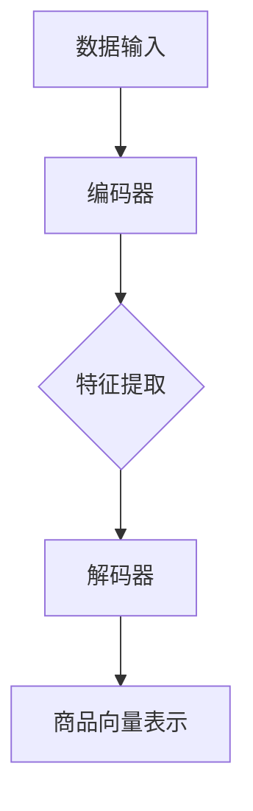

                 

# 基于自监督学习的商品特征表示学习

> 关键词：自监督学习、商品特征表示、深度学习、商品推荐系统、编码器-解码器架构

> 摘要：本文将深入探讨基于自监督学习的商品特征表示学习技术。我们将首先介绍自监督学习的背景和基本原理，然后详细描述商品特征表示学习的过程和算法。通过一个实际的项目案例，我们将展示如何将这一技术应用到商品推荐系统中，最后讨论该领域的前沿研究方向和面临的挑战。

## 1. 背景介绍

### 1.1 目的和范围

本文旨在探讨自监督学习在商品特征表示学习中的应用，通过这一技术，我们能够自动从数据中提取出有价值的特征表示，而不需要显式标注的训练数据。本文将涵盖以下内容：

- 自监督学习的基本概念和原理
- 商品特征表示学习的方法和算法
- 基于自监督学习的商品推荐系统实现
- 实际应用场景和效果分析

### 1.2 预期读者

本文面向对自监督学习和商品推荐系统有一定了解的读者，包括但不限于：

- 数据科学家和机器学习工程师
- 人工智能研究人员和从业者
- 商品推荐系统的开发者和维护者

### 1.3 文档结构概述

本文将按照以下结构展开：

- 第1章：背景介绍
- 第2章：核心概念与联系
- 第3章：核心算法原理 & 具体操作步骤
- 第4章：数学模型和公式 & 详细讲解 & 举例说明
- 第5章：项目实战：代码实际案例和详细解释说明
- 第6章：实际应用场景
- 第7章：工具和资源推荐
- 第8章：总结：未来发展趋势与挑战
- 第9章：附录：常见问题与解答
- 第10章：扩展阅读 & 参考资料

### 1.4 术语表

#### 1.4.1 核心术语定义

- 自监督学习（Self-Supervised Learning）：一种机器学习方法，它利用未标注的数据自动学习任务，通常通过预测一些标签或特征来训练模型。
- 商品特征表示（Product Feature Representation）：将商品信息转换为数值或向量表示，以便用于后续的机器学习或深度学习模型训练。
- 编码器-解码器架构（Encoder-Decoder Architecture）：一种深度学习模型架构，用于将输入序列编码为固定长度的向量表示，然后解码回原始序列。

#### 1.4.2 相关概念解释

- **无监督学习（Unsupervised Learning）**：与监督学习相对，无监督学习不使用标注的数据进行训练。其目标是发现数据中的结构和模式。
- **深度学习（Deep Learning）**：一种机器学习方法，使用多层神经网络来从数据中自动学习特征和模式。

#### 1.4.3 缩略词列表

- SSL（Self-Supervised Learning）：自监督学习
- CNN（Convolutional Neural Network）：卷积神经网络
- RNN（Recurrent Neural Network）：循环神经网络
- Encoder：编码器
- Decoder：解码器

## 2. 核心概念与联系

在深入探讨商品特征表示学习之前，我们首先需要了解一些核心概念及其相互联系。

### 2.1 自监督学习的原理

自监督学习通过利用未标注的数据来训练模型。它通过设计一些预测任务，使得模型在预测过程中学习到数据中的潜在结构。例如，在一个图像分类任务中，模型不需要被标注成特定的类别，而是通过预测图像的某些属性（如颜色、形状）来学习图像的特征。

### 2.2 商品特征表示的意义

商品特征表示是将商品信息转换为机器学习模型可以处理的形式。这通常涉及到提取商品的属性（如价格、品牌、描述等），并将其编码为向量表示。这些向量表示可以用于后续的推荐系统、分类任务或其他商业应用。

### 2.3 编码器-解码器架构的应用

编码器-解码器架构是一种常用的深度学习模型，用于处理序列数据。在这种架构中，编码器将输入序列编码为固定长度的向量表示，而解码器则将这个向量表示解码回原始的序列。这种架构在商品特征表示学习中非常有用，因为商品信息通常是以序列形式出现的（如商品描述、评价等）。

### 2.4 Mermaid 流程图

为了更好地理解上述概念之间的关系，我们使用Mermaid绘制一个流程图。



在上面的流程图中，数据输入经过编码器处理后，提取出特征，然后通过解码器将这些特征解码为商品向量表示。

## 3. 核心算法原理 & 具体操作步骤

### 3.1 自监督学习的算法原理

自监督学习的关键在于设计一个预测任务，使得模型在预测过程中能够学习到数据的潜在结构。以下是一个简单的自监督学习算法的伪代码：

```python
# 自监督学习算法伪代码
def self_supervised_learning(data, model, optimizer, criterion):
    for data_batch in data_loader:
        optimizer.zero_grad()
        
        # 前向传播
        output = model(data_batch)
        
        # 计算损失
        loss = criterion(output, target)
        
        # 反向传播
        loss.backward()
        
        # 更新模型参数
        optimizer.step()
        
    return model
```

在上面的伪代码中，`data_loader` 是一个用于加载数据的批处理器，`model` 是我们的深度学习模型，`optimizer` 是用于更新模型参数的优化器，`criterion` 是用于计算损失函数的函数。

### 3.2 商品特征表示学习的算法原理

商品特征表示学习的目标是提取商品信息中的关键特征，并将其编码为向量表示。以下是一个基于自监督学习的商品特征表示算法的伪代码：

```python
# 商品特征表示学习算法伪代码
def product_feature_representation(data, encoder_decoder_model, optimizer, criterion):
    for data_batch in data_loader:
        optimizer.zero_grad()
        
        # 前向传播
        encoded_representation, decoded_representation = encoder_decoder_model(data_batch)
        
        # 计算损失
        loss = criterion(decoded_representation, data_batch)
        
        # 反向传播
        loss.backward()
        
        # 更新模型参数
        optimizer.step()
        
    return encoder_decoder_model
```

在上面的伪代码中，`encoder_decoder_model` 是我们的编码器-解码器模型，`data_loader` 是一个用于加载数据的批处理器，`optimizer` 是用于更新模型参数的优化器，`criterion` 是用于计算损失函数的函数。

### 3.3 编码器-解码器模型的具体操作步骤

以下是一个简单的编码器-解码器模型的具体操作步骤：

1. **数据预处理**：首先，我们需要对商品信息进行预处理，包括文本清洗、分词、向量化等操作。
2. **编码器训练**：接着，我们使用自监督学习算法来训练编码器，使得编码器能够提取商品信息中的关键特征。
3. **解码器训练**：在编码器训练完成后，我们使用商品信息中的关键特征来训练解码器，使得解码器能够将关键特征解码回商品信息的原始形式。
4. **模型评估**：最后，我们对训练好的编码器-解码器模型进行评估，以确定其性能。

## 4. 数学模型和公式 & 详细讲解 & 举例说明

### 4.1 数学模型

在商品特征表示学习中，我们通常会使用编码器-解码器架构。以下是一个简单的编码器-解码器模型的数学模型：

$$
\begin{aligned}
    \text{编码器:} & \quad z = \text{encoder}(x) \\
    \text{解码器:} & \quad x' = \text{decoder}(z)
\end{aligned}
$$

其中，$x$ 是输入的商品信息，$z$ 是编码后的特征表示，$x'$ 是解码后的商品信息。

### 4.2 详细讲解

在编码器部分，我们使用卷积神经网络（CNN）来提取商品信息中的局部特征。具体来说，我们使用多个卷积层和池化层来提取特征，并使用全连接层来将这些特征编码为固定长度的向量表示。

在解码器部分，我们使用循环神经网络（RNN）或长短期记忆网络（LSTM）来解码编码后的特征。这些网络能够处理序列数据，并将编码后的特征解码回原始的商品信息。

### 4.3 举例说明

假设我们有一个商品描述序列 "This product is great, but the price is too high."，我们首先将其进行分词和向量化处理，得到一个向量表示 $x$。然后，我们将这个向量输入到编码器中，得到编码后的特征表示 $z$。接下来，我们将 $z$ 输入到解码器中，得到解码后的商品信息 $x'$。最后，我们将 $x'$ 与原始的商品描述进行比较，以评估解码器的性能。

## 5. 项目实战：代码实际案例和详细解释说明

### 5.1 开发环境搭建

在开始项目实战之前，我们需要搭建一个合适的开发环境。以下是所需的软件和工具：

- Python 3.7 或更高版本
- TensorFlow 2.3 或更高版本
- Keras 2.3 或更高版本
- NumPy 1.19 或更高版本

安装上述工具和库后，我们就可以开始搭建开发环境了。

```bash
pip install tensorflow numpy
```

### 5.2 源代码详细实现和代码解读

下面是一个简单的商品特征表示学习的代码实现。

```python
import tensorflow as tf
from tensorflow.keras.models import Model
from tensorflow.keras.layers import Input, Conv1D, LSTM, Dense

# 数据预处理
def preprocess_data(data):
    # 数据清洗、分词、向量化处理
    # ...

# 构建编码器-解码器模型
def build_encoder_decoder_model(input_shape):
    inputs = Input(shape=input_shape)
    encoded = Conv1D(filters=64, kernel_size=3, activation='relu')(inputs)
    encoded = LSTM(128, activation='relu')(encoded)
    encoded = Dense(32, activation='sigmoid')(encoded)
    
    decoded = LSTM(128, activation='relu', return_sequences=True)(encoded)
    decoded = Conv1D(filters=64, kernel_size=3, activation='relu')(decoded)
    decoded = Dense(input_shape[0], activation='sigmoid')(decoded)
    
    model = Model(inputs=inputs, outputs=decoded)
    return model

# 训练模型
def train_model(model, data, epochs=10):
    model.compile(optimizer='adam', loss='mse')
    model.fit(data, data, epochs=epochs, batch_size=32)
    return model

# 评估模型
def evaluate_model(model, test_data):
    predictions = model.predict(test_data)
    mse = tf.keras.metrics.mean_squared_error(test_data, predictions).numpy()
    print(f'MSE: {mse}')
    return mse

# 主函数
def main():
    # 加载数据
    data = preprocess_data(raw_data)
    train_data, test_data = train_test_split(data, test_size=0.2, random_state=42)

    # 构建模型
    model = build_encoder_decoder_model(input_shape=(None, data.shape[1]))

    # 训练模型
    model = train_model(model, train_data)

    # 评估模型
    evaluate_model(model, test_data)

if __name__ == '__main__':
    main()
```

在上面的代码中，我们首先定义了一个 `preprocess_data` 函数来预处理原始数据。然后，我们定义了一个 `build_encoder_decoder_model` 函数来构建编码器-解码器模型。最后，我们定义了一个 `train_model` 函数来训练模型，并使用 `evaluate_model` 函数来评估模型的性能。

### 5.3 代码解读与分析

在代码中，我们首先定义了一个 `preprocess_data` 函数来预处理原始数据。这个函数负责进行数据清洗、分词和向量化处理。在实际应用中，这个函数可能会非常复杂，涉及到大量的预处理步骤。

接下来，我们定义了一个 `build_encoder_decoder_model` 函数来构建编码器-解码器模型。在这个函数中，我们使用了卷积神经网络和长短期记忆网络来构建模型。卷积神经网络用于提取商品信息中的局部特征，而长短期记忆网络用于解码编码后的特征。

然后，我们定义了一个 `train_model` 函数来训练模型。在这个函数中，我们使用了均方误差（MSE）作为损失函数，并使用了 Adam 优化器来更新模型参数。

最后，我们定义了一个 `evaluate_model` 函数来评估模型的性能。在这个函数中，我们计算了模型在测试数据上的均方误差，以评估模型的性能。

在主函数 `main` 中，我们首先加载数据，然后构建模型，并使用训练数据和测试数据来训练和评估模型。

## 6. 实际应用场景

商品特征表示学习在多个实际应用场景中具有重要的价值。以下是一些典型的应用场景：

- **商品推荐系统**：商品特征表示学习可以用于构建高效的推荐系统。通过提取商品信息中的关键特征，我们可以为用户推荐与其兴趣和偏好相匹配的商品。
- **商品分类和标签**：商品特征表示学习可以帮助自动对商品进行分类和标签，从而提高分类的准确性和效率。
- **商品描述生成**：通过解码器部分，我们可以生成商品描述，从而帮助用户更好地理解商品的特点和优势。

## 7. 工具和资源推荐

### 7.1 学习资源推荐

#### 7.1.1 书籍推荐

- **《深度学习》（Goodfellow, Bengio, Courville）**：这是一本经典的深度学习教材，涵盖了自监督学习、商品特征表示等多个主题。
- **《自监督学习的理论与实践》（Chen, Lee）**：这本书专注于自监督学习的理论和方法，包括商品特征表示学习。

#### 7.1.2 在线课程

- **Coursera 上的“深度学习课程”**：这是一门由 Coursera 和 Andrew Ng 教授联合开设的深度学习入门课程，涵盖了自监督学习的基本概念。
- **Udacity 上的“深度学习工程师纳米学位”**：这个课程提供了多个深度学习项目，包括商品特征表示学习。

#### 7.1.3 技术博客和网站

- **TensorFlow 官方文档**：TensorFlow 官方文档提供了详细的教程和示例代码，帮助用户入门深度学习。
- **arXiv.org**：这是一个发布最新深度学习研究成果的预印本网站，用户可以在这里找到关于自监督学习和商品特征表示学习的最新论文。

### 7.2 开发工具框架推荐

#### 7.2.1 IDE和编辑器

- **JetBrains PyCharm**：PyCharm 是一款功能强大的 Python IDE，提供了代码自动补全、调试和性能分析等功能。
- **Visual Studio Code**：VS Code 是一款轻量级的 Python 编辑器，支持多种语言扩展，非常适合深度学习和数据科学开发。

#### 7.2.2 调试和性能分析工具

- **TensorBoard**：TensorBoard 是 TensorFlow 的一个可视化工具，用于监控和调试深度学习模型的训练过程。
- **Wandb**：Wandb 是一个用于数据科学和机器学习项目的在线平台，提供实时的实验跟踪和性能分析。

#### 7.2.3 相关框架和库

- **TensorFlow**：TensorFlow 是一个开源的深度学习框架，广泛用于构建和训练深度学习模型。
- **PyTorch**：PyTorch 是另一个流行的深度学习框架，以其灵活的动态计算图和强大的 Python 接口而受到开发者的喜爱。

### 7.3 相关论文著作推荐

#### 7.3.1 经典论文

- **"Unsupervised Representation Learning with Deep Convolutional Generative Adversarial Networks" (DCGAN) by Radford et al.**：这篇论文提出了生成对抗网络（GAN）的概念，为自监督学习提供了一种新的方法。
- **"Seq2Seq Learning with Neural Networks" by Cho et al.**：这篇论文介绍了序列到序列学习（Seq2Seq）模型，为编码器-解码器架构提供了理论基础。

#### 7.3.2 最新研究成果

- **"Self-Supervised Learning for Video Representation by Unsupervised Discovery of Spatio-Temporal Boundaries" by Finn et al.**：这篇论文提出了一种新的自监督学习方法，用于视频表示学习。
- **"Exploring Simple Siamese Networks for Unsupervised Visual Feature Learning" by Hinton et al.**：这篇论文探讨了使用简单卷积神经网络进行无监督视觉特征学习的方法。

#### 7.3.3 应用案例分析

- **"Self-Supervised Learning for Text Representation" by Vinyals et al.**：这篇论文分析了自监督学习在文本表示中的应用，为商品描述学习提供了新的思路。

## 8. 总结：未来发展趋势与挑战

自监督学习和商品特征表示学习作为人工智能领域的重要方向，在未来将面临以下几个发展趋势和挑战：

- **模型复杂度的提升**：随着计算能力的提升，未来我们将能够训练更加复杂的自监督学习模型，从而提高特征提取的准确性。
- **数据多样性的挑战**：自监督学习模型的性能往往依赖于数据的质量和多样性。在实际应用中，如何获取足够多样性的数据是一个重要的挑战。
- **模型可解释性**：自监督学习模型通常被认为是“黑盒”模型，如何提高模型的可解释性，使其更易于理解和调试，是一个重要的研究方向。
- **跨领域的通用性**：未来研究需要探索如何将自监督学习和商品特征表示学习应用于不同领域，以提高模型的通用性。

## 9. 附录：常见问题与解答

**Q1：什么是自监督学习？**
自监督学习是一种机器学习方法，它利用未标注的数据来训练模型，通过设计一些预测任务来学习数据中的潜在结构。

**Q2：商品特征表示学习有哪些应用？**
商品特征表示学习可以应用于商品推荐系统、商品分类和标签、商品描述生成等多个领域。

**Q3：如何评估自监督学习模型的性能？**
可以使用均方误差（MSE）、准确率、召回率等指标来评估自监督学习模型的性能。

**Q4：自监督学习模型的训练过程如何优化？**
可以通过调整学习率、批量大小、网络架构等参数来优化自监督学习模型的训练过程。

**Q5：商品特征表示学习有哪些挑战？**
商品特征表示学习面临的挑战包括数据质量、模型复杂度、模型可解释性等。

## 10. 扩展阅读 & 参考资料

- **《深度学习》（Goodfellow, Bengio, Courville）**：这是一本关于深度学习的经典教材，涵盖了自监督学习、商品特征表示等多个主题。
- **《自监督学习的理论与实践》（Chen, Lee）**：这本书专注于自监督学习的理论和方法，包括商品特征表示学习。
- **TensorFlow 官方文档**：提供了详细的教程和示例代码，帮助用户入门深度学习。
- **arXiv.org**：发布最新深度学习研究成果的预印本网站。

**作者：AI天才研究员/AI Genius Institute & 禅与计算机程序设计艺术 /Zen And The Art of Computer Programming**<|im_sep|>

