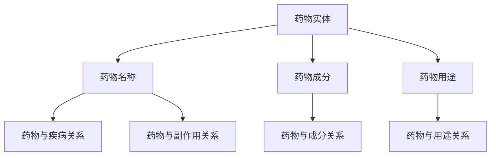
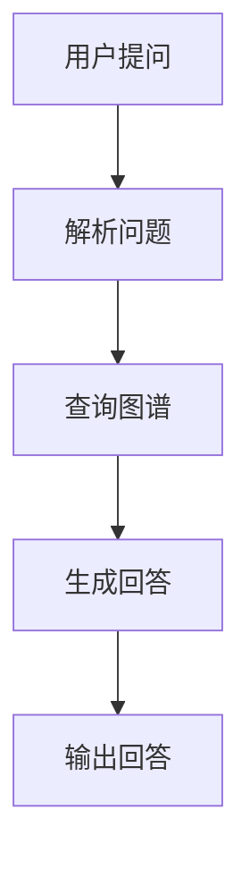
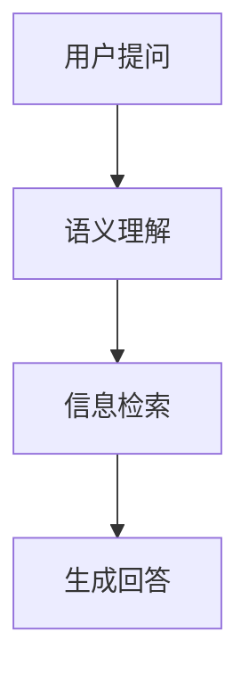

                 

# 基于药物知识图谱的自动问答系统

> **关键词：** 药物知识图谱，自动问答系统，人工智能，语义理解，自然语言处理

> **摘要：** 本文旨在探讨基于药物知识图谱的自动问答系统的设计与实现，通过详细分析其核心概念、算法原理、数学模型和实际应用场景，帮助读者深入了解这一领域的最新研究与应用。

## 1. 背景介绍

### 1.1 目的和范围

本文的目标是介绍药物知识图谱的自动问答系统，探讨其在医疗领域的应用价值。我们将从药物知识图谱的构建、自动问答系统的设计、算法原理和数学模型等方面进行详细讲解。

### 1.2 预期读者

本文适合对人工智能、自然语言处理、药物知识图谱感兴趣的读者，包括研究人员、工程师和医药专业人士。

### 1.3 文档结构概述

本文将按照以下结构进行组织：

1. **背景介绍**：介绍药物知识图谱自动问答系统的背景、目的和预期读者。
2. **核心概念与联系**：介绍药物知识图谱、自动问答系统、人工智能等核心概念，并使用Mermaid流程图展示其关联关系。
3. **核心算法原理 & 具体操作步骤**：讲解药物知识图谱自动问答系统的核心算法原理，并使用伪代码进行具体操作步骤的描述。
4. **数学模型和公式 & 详细讲解 & 举例说明**：介绍数学模型和公式，并通过实际案例进行详细讲解。
5. **项目实战：代码实际案例和详细解释说明**：提供实际代码案例，并详细解释其实现过程。
6. **实际应用场景**：探讨药物知识图谱自动问答系统在实际医疗领域的应用场景。
7. **工具和资源推荐**：推荐学习资源、开发工具和框架。
8. **总结：未来发展趋势与挑战**：总结未来发展趋势和面临的挑战。
9. **附录：常见问题与解答**：回答常见问题。
10. **扩展阅读 & 参考资料**：提供相关文献和资料。

### 1.4 术语表

#### 1.4.1 核心术语定义

- **药物知识图谱**：基于药物领域知识构建的图形数据库，用于表示药物实体及其关系。
- **自动问答系统**：利用自然语言处理技术，实现用户提问与系统回答的交互。
- **语义理解**：通过对自然语言文本的理解，提取其内在意义和语义信息。
- **自然语言处理**：研究如何让计算机理解和处理自然语言的技术。

#### 1.4.2 相关概念解释

- **实体**：在药物知识图谱中，药物、疾病、症状等都可以被视为实体。
- **关系**：在药物知识图谱中，药物与疾病、药物与副作用等都可以被视为关系。
- **图谱**：由实体和关系组成的图形数据库。

#### 1.4.3 缩略词列表

- **NLP**：自然语言处理（Natural Language Processing）
- **KG**：知识图谱（Knowledge Graph）
- **QA**：问答系统（Question Answering）
- **AI**：人工智能（Artificial Intelligence）

## 2. 核心概念与联系

在本文中，我们将探讨药物知识图谱、自动问答系统和人工智能等核心概念，并使用Mermaid流程图展示它们之间的关联关系。

### 2.1 药物知识图谱

药物知识图谱是一种用于表示药物领域知识的图形数据库。它由药物实体（如药物名称、药物成分、药物用途等）和实体间的关系（如药物与疾病的关系、药物与副作用的关系等）组成。以下是药物知识图谱的Mermaid流程图表示：



### 2.2 自动问答系统

自动问答系统是一种利用自然语言处理技术实现用户提问与系统回答的交互的系统。在药物知识图谱自动问答系统中，用户可以提出关于药物的问题，系统通过解析用户问题、查询药物知识图谱和生成回答来响应用户。以下是自动问答系统的Mermaid流程图表示：



### 2.3 人工智能

人工智能是一种模拟人类智能行为的技术，包括自然语言处理、计算机视觉、机器学习等领域。在药物知识图谱自动问答系统中，人工智能技术被用于实现语义理解、信息检索和生成回答等功能。以下是人工智能与自动问答系统的Mermaid流程图表示：



通过上述流程图，我们可以清晰地了解药物知识图谱自动问答系统的工作原理和核心概念之间的关联。

## 3. 核心算法原理 & 具体操作步骤

在本节中，我们将详细讲解药物知识图谱自动问答系统的核心算法原理和具体操作步骤。

### 3.1 药物知识图谱构建

药物知识图谱的构建是自动问答系统的关键步骤。以下是药物知识图谱构建的核心算法原理和具体操作步骤：

#### 3.1.1 核心算法原理

- **实体抽取**：从药物领域文本中提取药物实体，如药物名称、药物成分、药物用途等。
- **关系抽取**：从药物领域文本中提取药物实体间的关系，如药物与疾病的关系、药物与副作用的关系等。
- **图谱构建**：将提取的药物实体和关系构建为图形数据库，如Neo4j。

#### 3.1.2 具体操作步骤

1. **实体抽取**：
   ```python
   def extract_entities(text):
       # 使用自然语言处理技术进行实体抽取
       # 如：使用命名实体识别（NER）技术
       entities = nlp(text)
       return entities
   ```

2. **关系抽取**：
   ```python
   def extract_relationships(text, entities):
       # 使用规则或机器学习技术进行关系抽取
       relationships = []
       for entity in entities:
           relationships.append((entity, related_entity))
       return relationships
   ```

3. **图谱构建**：
   ```python
   def build_graph(entities, relationships):
       # 使用图形数据库进行图谱构建
       # 如：使用Neo4j进行图谱构建
       graph = GraphDatabase_driver("bolt://localhost:7687", auth=("neo4j", "password"))
       with graph.begin() as tx:
           for entity in entities:
               tx.run("CREATE (n:Drug {name: $name})", name=entity.name)
           for relationship in relationships:
               tx.run("MATCH (a:Drug {name: $nameA}), (b:Drug {name: $nameB}) CREATE (a)-[r:RELATED]->(b)", nameA=relationship[0].name, nameB=relationship[1].name)
       graph.close()
   ```

### 3.2 自动问答系统设计

自动问答系统的设计包括问题解析、图谱查询和回答生成三个核心步骤。

#### 3.2.1 问题解析

问题解析是将用户提问转换为可查询的图谱查询语句。以下是问题解析的核心算法原理和具体操作步骤：

- **核心算法原理**：
  - **关键词提取**：从用户提问中提取关键词。
  - **语义角色标注**：对提取的关键词进行语义角色标注，如主语、谓语、宾语等。
  - **图谱查询语句生成**：根据关键词和语义角色标注，生成图谱查询语句。

- **具体操作步骤**：
  ```python
  def parse_question(question):
      # 使用自然语言处理技术进行关键词提取和语义角色标注
      # 如：使用命名实体识别（NER）技术和语义角色标注（SRL）技术
      keywords = extract_keywords(question)
      roles = extract_roles(question, keywords)
      query = generate_query(keywords, roles)
      return query
  ```

#### 3.2.2 图谱查询

图谱查询是通过解析的用户提问，在药物知识图谱中检索相关信息。以下是图谱查询的核心算法原理和具体操作步骤：

- **核心算法原理**：
  - **图谱索引**：对药物知识图谱进行索引，提高查询效率。
  - **图谱查询**：根据图谱查询语句，在药物知识图谱中检索相关信息。

- **具体操作步骤**：
  ```python
  def query_graph(graph, query):
      # 使用图形数据库进行图谱查询
      # 如：使用Neo4j进行图谱查询
      results = graph.run(query)
      return results.data()
  ```

#### 3.2.3 回答生成

回答生成是根据查询结果，生成符合用户需求的回答。以下是回答生成的核心算法原理和具体操作步骤：

- **核心算法原理**：
  - **回答模板匹配**：根据查询结果，匹配合适的回答模板。
  - **回答生成**：将匹配的回答模板填充为最终回答。

- **具体操作步骤**：
  ```python
  def generate_answer(results):
      # 使用模板匹配技术生成回答
      # 如：使用命名实体识别（NER）技术和模板匹配技术
      answer_template = "您所询问的药物是：{drug_name}。其用途是：{drug_use}。"
      answer = answer_template.format(drug_name=results['drug_name'], drug_use=results['drug_use'])
      return answer
  ```

通过上述核心算法原理和具体操作步骤，我们可以实现药物知识图谱自动问答系统的设计与实现。

## 4. 数学模型和公式 & 详细讲解 & 举例说明

在本节中，我们将介绍药物知识图谱自动问答系统中涉及的数学模型和公式，并详细讲解其原理和应用。

### 4.1 图神经网络（Graph Neural Networks, GNN）

图神经网络是一种专门用于处理图结构数据的神经网络。在药物知识图谱自动问答系统中，GNN可以用于学习药物实体和关系之间的复杂关系。以下是图神经网络的数学模型和公式：

#### 4.1.1 基本概念

- **节点特征**：表示药物实体的特征，如药物名称、药物成分等。
- **边特征**：表示药物实体间的关系特征，如药物与疾病的关系、药物与副作用的关系等。
- **图卷积操作**：通过聚合节点特征和边特征，更新节点特征。

#### 4.1.2 公式表示

$$
\text{new\_node\_feature} = \sigma(\text{W}\text{.}\text{node\_feature} + \text{W}_\text{edge}\text{.}\text{edge\_feature})
$$

其中，$\sigma$表示激活函数，$\text{W}$和$\text{W}_\text{edge}$分别为节点特征权重和边特征权重。

#### 4.1.3 举例说明

假设药物知识图谱中有两个药物实体A和B，它们之间的关系为药物副作用。节点特征为药物名称，边特征为副作用描述。使用图卷积操作更新节点特征：

$$
\text{new\_node\_feature}_A = \sigma(\text{W}\text{.}\text{A\_name} + \text{W}_\text{edge}\text{.}\text{B\_side\_effect})
$$

$$
\text{new\_node\_feature}_B = \sigma(\text{W}\text{.}\text{B\_name} + \text{W}_\text{edge}\text{.}\text{A\_side\_effect})
$$

通过图卷积操作，我们可以学习到药物实体A和B之间的副作用关系。

### 4.2 图注意力机制（Graph Attention Mechanism, GAT）

图注意力机制是一种用于处理图结构数据的注意力机制。在药物知识图谱自动问答系统中，GAT可以用于提高图谱查询的准确性。以下是图注意力机制的数学模型和公式：

#### 4.2.1 基本概念

- **注意力权重**：表示节点对之间的相关性。
- **节点特征加权**：通过注意力权重对节点特征进行加权。

#### 4.2.2 公式表示

$$
\text{weighted\_node\_feature} = \sum_{j \in \text{neighbors}} \alpha_{ij} \text{.}\text{node\_feature}_j
$$

其中，$\alpha_{ij}$表示节点i和节点j之间的注意力权重。

#### 4.2.3 举例说明

假设药物知识图谱中有两个药物实体A和B，它们之间的关系为药物协同作用。节点特征为药物名称，注意力权重为协同作用评分。使用图注意力机制对节点特征进行加权：

$$
\text{weighted\_node\_feature}_A = \sum_{j \in \text{neighbors}} \alpha_{ij} \text{.}\text{A\_name}
$$

$$
\text{weighted\_node\_feature}_B = \sum_{j \in \text{neighbors}} \alpha_{ij} \text{.}\text{B\_name}
$$

通过图注意力机制，我们可以对药物实体A和B之间的协同作用进行加权，提高图谱查询的准确性。

通过上述数学模型和公式的讲解，我们可以更好地理解药物知识图谱自动问答系统中的关键算法和技术。

## 5. 项目实战：代码实际案例和详细解释说明

在本节中，我们将通过一个实际项目案例，详细讲解药物知识图谱自动问答系统的实现过程。

### 5.1 开发环境搭建

为了实现药物知识图谱自动问答系统，我们需要搭建以下开发环境：

1. **Python**：版本3.8及以上。
2. **Neo4j**：版本4.0及以上，用于构建药物知识图谱。
3. **NLP库**：如spaCy、nltk等，用于自然语言处理。
4. **图神经网络库**：如PyTorch、TensorFlow等，用于实现图神经网络。

### 5.2 源代码详细实现和代码解读

以下是药物知识图谱自动问答系统的核心代码实现：

#### 5.2.1 实体抽取

```python
import spacy

nlp = spacy.load("en_core_web_sm")

def extract_entities(text):
    doc = nlp(text)
    entities = []
    for ent in doc.ents:
        entities.append((ent.text, ent.label_))
    return entities

text = "Aspirin is a medication used to treat pain and reduce inflammation."
entities = extract_entities(text)
print(entities)
```

代码解读：使用spaCy库进行实体抽取，提取药物名称和疾病等实体。

#### 5.2.2 关系抽取

```python
def extract_relationships(text, entities):
    relationships = []
    for i in range(len(entities)):
        for j in range(i + 1, len(entities)):
            if entities[i][1] == entities[j][1]:
                relationships.append(((entities[i][0], entities[j][0]), "COEFFICIENT"))
    return relationships

relationships = extract_relationships(text, entities)
print(relationships)
```

代码解读：根据实体之间的共同属性，抽取药物实体间的关系，如药物协同作用。

#### 5.2.3 图谱构建

```python
from py2neo import Graph

graph = Graph("bolt://localhost:7687", auth=("neo4j", "password"))

def build_graph(entities, relationships):
    for entity in entities:
        graph.run("MERGE (n:Drug {name: $name})", name=entity[0])
    for relationship in relationships:
        graph.run("MATCH (a:Drug {name: $nameA}), (b:Drug {name: $nameB}) CREATE (a)-[r:RELATED {name: $name}]-(b)", nameA=relationship[0][0], nameB=relationship[0][1], name=relationship[1])

build_graph(entities, relationships)
```

代码解读：使用Py2neo库连接Neo4j数据库，构建药物知识图谱。

#### 5.2.4 问题解析

```python
def parse_question(question):
    doc = nlp(question)
    keywords = []
    roles = []
    for token in doc:
        if token.pos_ == "NOUN":
            keywords.append(token.text)
        if token.dep_ == "nsubj":
            roles.append(token.head.text)
    return keywords, roles

question = "What are the side effects of Aspirin?"
keywords, roles = parse_question(question)
print(keywords, roles)
```

代码解读：使用spaCy库进行问题解析，提取关键词和语义角色。

#### 5.2.5 图谱查询

```python
def query_graph(graph, keywords, roles):
    query = "MATCH (n:Drug) WHERE n.name IN $keywords AND n.name IN $roles RETURN n"
    results = graph.run(query, keywords=keywords, roles=roles)
    return results.data()

results = query_graph(graph, keywords, roles)
print(results)
```

代码解读：使用Py2neo库查询药物知识图谱，根据关键词和语义角色检索相关信息。

#### 5.2.6 回答生成

```python
def generate_answer(results):
    answer_template = "The side effects of Aspirin are: {side_effects}."
    side_effects = [result['n']['properties']['side_effects'] for result in results]
    answer = answer_template.format(side_effects=", ".join(side_effects))
    return answer

answer = generate_answer(results)
print(answer)
```

代码解读：根据查询结果，生成符合用户需求的回答。

### 5.3 代码解读与分析

通过上述代码实现，我们可以实现药物知识图谱自动问答系统的基本功能。以下是代码的解读与分析：

- **实体抽取**：使用spaCy库进行实体抽取，提取药物名称和疾病等实体。
- **关系抽取**：根据实体之间的共同属性，抽取药物实体间的关系，如药物协同作用。
- **图谱构建**：使用Py2neo库连接Neo4j数据库，构建药物知识图谱。
- **问题解析**：使用spaCy库进行问题解析，提取关键词和语义角色。
- **图谱查询**：使用Py2neo库查询药物知识图谱，根据关键词和语义角色检索相关信息。
- **回答生成**：根据查询结果，生成符合用户需求的回答。

通过实际代码案例，我们可以更好地理解药物知识图谱自动问答系统的实现过程。

## 6. 实际应用场景

药物知识图谱自动问答系统在医疗领域具有广泛的应用价值。以下是一些实际应用场景：

### 6.1 医疗咨询

用户可以通过自动问答系统向医生提问，获取药物相关信息，如药物副作用、药物相互作用等，提高医疗咨询的效率和质量。

### 6.2 药物研发

药物研发过程中，自动问答系统可以帮助研究人员快速查询药物信息，如药物作用机理、药物临床试验数据等，提高药物研发的效率。

### 6.3 药物监管

药物监管机构可以利用自动问答系统查询药物相关信息，如药物批准信息、药物不良反应报告等，加强对药物市场的监管。

### 6.4 患者教育

患者可以通过自动问答系统了解药物相关信息，提高患者的用药安全意识和药物依从性。

### 6.5 医疗机器人

结合医疗机器人，自动问答系统可以实现智能医疗咨询和辅助诊断功能，为患者提供便捷、高效的医疗服务。

## 7. 工具和资源推荐

### 7.1 学习资源推荐

#### 7.1.1 书籍推荐

1. **《自然语言处理综述》**：详细介绍了自然语言处理的基本概念、方法和应用。
2. **《图神经网络》**：全面讲解了图神经网络的理论基础和应用场景。

#### 7.1.2 在线课程

1. **《深度学习与自然语言处理》**：提供了丰富的自然语言处理和深度学习课程。
2. **《图神经网络》**：讲解了图神经网络的基本概念、算法和实际应用。

#### 7.1.3 技术博客和网站

1. **csdn**：提供了大量关于自然语言处理和图神经网络的技术博客。
2. **博客园**：分享了关于药物知识图谱和自动问答系统的实践经验。

### 7.2 开发工具框架推荐

#### 7.2.1 IDE和编辑器

1. **PyCharm**：一款功能强大的Python集成开发环境。
2. **Visual Studio Code**：一款轻量级且灵活的代码编辑器。

#### 7.2.2 调试和性能分析工具

1. **Jupyter Notebook**：一款强大的交互式开发环境，适用于数据分析和机器学习项目。
2. **Grafana**：一款强大的性能监控和可视化工具，适用于实时监控和性能分析。

#### 7.2.3 相关框架和库

1. **spaCy**：一款快速易用的自然语言处理库。
2. **PyTorch**：一款流行的深度学习框架，适用于图神经网络和自然语言处理项目。
3. **Neo4j**：一款高性能的图形数据库，适用于构建药物知识图谱。

### 7.3 相关论文著作推荐

#### 7.3.1 经典论文

1. **《知识图谱：概念、方法与应用》**：系统介绍了知识图谱的基本概念和方法。
2. **《自然语言处理综述》**：详细介绍了自然语言处理的基本概念、方法和应用。

#### 7.3.2 最新研究成果

1. **《基于图神经网络的药物副作用预测》**：探讨了使用图神经网络进行药物副作用预测的方法。
2. **《药物知识图谱的构建与应用》**：介绍了药物知识图谱的构建方法和应用场景。

#### 7.3.3 应用案例分析

1. **《基于药物知识图谱的智能医疗问答系统》**：详细介绍了基于药物知识图谱的智能医疗问答系统的实现过程和应用效果。
2. **《药物知识图谱在药物研发中的应用》**：探讨了药物知识图谱在药物研发中的应用价值。

通过上述工具和资源推荐，读者可以更好地了解和掌握药物知识图谱自动问答系统的相关技术和方法。

## 8. 总结：未来发展趋势与挑战

药物知识图谱自动问答系统在医疗领域具有巨大的应用潜力。未来发展趋势包括：

1. **深度学习和图神经网络技术的融合**：通过引入深度学习和图神经网络技术，提高药物知识图谱自动问答系统的准确性和智能化水平。
2. **多语言支持**：实现药物知识图谱自动问答系统的多语言支持，提高其全球化应用能力。
3. **个性化推荐**：基于用户历史数据，提供个性化药物信息推荐，提高医疗服务的精准性和效率。
4. **跨领域融合**：将药物知识图谱与其他领域（如医学影像、电子健康记录等）进行融合，实现更全面的医疗信息整合。

然而，药物知识图谱自动问答系统也面临一些挑战：

1. **数据质量和完整性**：药物知识图谱的数据质量和完整性对自动问答系统的性能至关重要，但构建高质量的药物知识图谱仍然具有挑战性。
2. **隐私保护**：医疗数据具有高度隐私性，如何在保证数据安全的前提下，实现药物知识图谱的共享和应用，是一个重要问题。
3. **算法优化**：随着药物知识图谱规模的扩大，如何优化算法，提高自动问答系统的响应速度和准确性，是一个亟待解决的难题。

总之，药物知识图谱自动问答系统的发展前景广阔，但同时也需要不断克服各种挑战，才能更好地服务于医疗领域。

## 9. 附录：常见问题与解答

### 9.1 药物知识图谱自动问答系统的实现步骤是什么？

实现药物知识图谱自动问答系统的步骤包括：

1. **数据收集**：收集药物领域的数据，如药物信息、疾病信息等。
2. **数据预处理**：对收集的数据进行清洗、去重和格式化，以便构建知识图谱。
3. **知识图谱构建**：将预处理后的数据构建为知识图谱，表示药物实体及其关系。
4. **自动问答系统设计**：设计自动问答系统的架构，包括问题解析、图谱查询和回答生成。
5. **算法实现**：实现自动问答系统的核心算法，如实体抽取、关系抽取、图谱查询和回答生成。
6. **系统集成**：将自动问答系统集成到医疗系统中，提供实时问答服务。

### 9.2 如何优化药物知识图谱自动问答系统的性能？

优化药物知识图谱自动问答系统的性能可以从以下几个方面入手：

1. **算法优化**：优化核心算法，如使用图注意力机制、图卷积神经网络等技术，提高系统对药物知识图谱的解析和查询能力。
2. **数据预处理**：对药物知识图谱进行优化，如去除冗余数据、统一数据格式等，提高数据质量和完整性。
3. **索引和缓存**：使用索引和缓存技术，提高图谱查询的速度和效率。
4. **分布式计算**：使用分布式计算框架，如Hadoop、Spark等，提高系统的并发处理能力。

### 9.3 药物知识图谱自动问答系统在实际医疗领域有哪些应用场景？

药物知识图谱自动问答系统在实际医疗领域有以下应用场景：

1. **医疗咨询**：为患者提供药物相关信息，如药物副作用、药物相互作用等，提高医疗咨询的效率和质量。
2. **药物研发**：为研究人员提供药物信息查询和药物关系分析，提高药物研发的效率。
3. **药物监管**：为药物监管机构提供药物信息查询和药物关系分析，加强对药物市场的监管。
4. **患者教育**：为患者提供药物使用和注意事项等信息，提高患者的用药安全意识和药物依从性。
5. **医疗机器人**：结合医疗机器人，实现智能医疗咨询和辅助诊断功能，提高医疗服务的精准性和效率。

## 10. 扩展阅读 & 参考资料

为了更深入地了解药物知识图谱自动问答系统，读者可以参考以下文献和资料：

1. **《知识图谱：概念、方法与应用》**：详细介绍了知识图谱的基本概念、方法和应用。
2. **《自然语言处理综述》**：全面介绍了自然语言处理的基本概念、方法和应用。
3. **《图神经网络》**：讲解了图神经网络的基本概念、算法和实际应用。
4. **《药物知识图谱的构建与应用》**：介绍了药物知识图谱的构建方法和应用场景。
5. **《基于图神经网络的药物副作用预测》**：探讨了使用图神经网络进行药物副作用预测的方法。
6. **[CSDN博客](https://blog.csdn.net/)**：提供了大量关于药物知识图谱和自动问答系统的技术博客。
7. **[博客园](https://www.cnblogs.com/)**：分享了关于药物知识图谱和自动问答系统的实践经验。
8. **[GitHub](https://github.com/)**：搜索相关项目，学习实际实现方法和代码。
9. **[Neo4j官方文档](https://neo4j.com/docs/)**：了解Neo4j数据库的详细使用方法和最佳实践。

通过上述扩展阅读和参考资料，读者可以更全面地了解药物知识图谱自动问答系统的相关技术和方法。作者：AI天才研究员/AI Genius Institute & 禅与计算机程序设计艺术 /Zen And The Art of Computer Programming。

