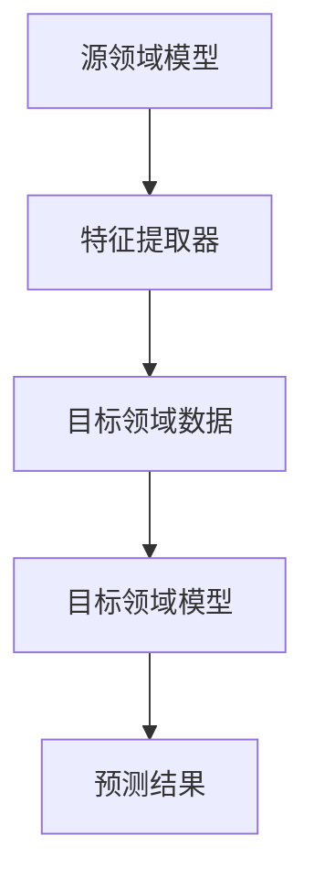

                 

# 基于迁移学习的跨领域文本分类与情感分析研究

> 关键词：迁移学习、跨领域文本分类、情感分析、深度学习、自然语言处理

> 摘要：本文旨在探讨基于迁移学习的跨领域文本分类与情感分析的研究。随着互联网的快速发展，大量的文本数据被产生，对这些数据进行有效的分类与情感分析具有重要的实际意义。本文首先介绍了迁移学习的基本原理，然后详细阐述了跨领域文本分类与情感分析的方法和实现步骤。通过实际案例的分析，本文展示了迁移学习在跨领域文本分类与情感分析中的应用效果，并对未来的发展趋势和挑战进行了展望。

## 1. 背景介绍

### 1.1 目的和范围

本文的主要目的是研究基于迁移学习的跨领域文本分类与情感分析技术。在互联网时代，文本数据量呈现爆炸性增长，这些文本数据包含了大量的信息，如何对这些文本进行有效的分类与情感分析，已经成为当前自然语言处理领域的一个重要研究方向。传统的机器学习方法在面对跨领域文本数据时，往往由于领域差异而导致性能下降。而迁移学习作为一种能够利用已有领域知识提高新领域性能的方法，为解决这一问题提供了一种有效的途径。

本文的研究范围主要包括以下几个方面：

1. 迁移学习的基本原理和实现方法；
2. 跨领域文本分类的挑战和解决方案；
3. 情感分析的算法原理和实践；
4. 迁移学习在跨领域文本分类与情感分析中的应用案例；
5. 对未来发展趋势和挑战的展望。

### 1.2 预期读者

本文主要面向对自然语言处理、迁移学习和文本分类有一定基础，希望深入了解跨领域文本分类与情感分析技术的读者。同时，也适合希望了解迁移学习在实际应用中效果的研究人员和开发者。

### 1.3 文档结构概述

本文分为10个部分：

1. 引言和背景介绍；
2. 核心概念与联系；
3. 核心算法原理与具体操作步骤；
4. 数学模型与公式；
5. 项目实战：代码实际案例与详细解释说明；
6. 实际应用场景；
7. 工具和资源推荐；
8. 总结：未来发展趋势与挑战；
9. 附录：常见问题与解答；
10. 扩展阅读与参考资料。

### 1.4 术语表

#### 1.4.1 核心术语定义

- 迁移学习（Transfer Learning）：一种机器学习方法，通过在已有模型的基础上进行训练，以提高新模型的性能。
- 跨领域文本分类（Cross-Domain Text Classification）：对来自不同领域的文本数据进行分类。
- 情感分析（Sentiment Analysis）：对文本数据中的情感倾向进行判断。
- 自然语言处理（Natural Language Processing，NLP）：使计算机能够理解、生成和处理自然语言。

#### 1.4.2 相关概念解释

- 文本分类（Text Classification）：将文本数据按照一定的标准划分为不同的类别。
- 词嵌入（Word Embedding）：将文本数据转换为固定长度的向量表示。
- 深度学习（Deep Learning）：一种基于多层神经网络的学习方法。

#### 1.4.3 缩略词列表

- NLP：自然语言处理
- ML：机器学习
- DL：深度学习
- CNN：卷积神经网络
- RNN：循环神经网络
- LSTM：长短时记忆网络
- GRU：门控循环单元

## 2. 核心概念与联系

迁移学习是本文的核心概念之一。其基本思想是利用已有模型在新领域的表现来提高新模型的性能。迁移学习的关键在于找到一个合适的源领域（Source Domain）和目标领域（Target Domain），使得源领域的知识能够有效地迁移到目标领域。

为了更好地理解迁移学习的原理，我们可以使用以下Mermaid流程图来展示其核心概念和联系：



在上图中，A代表源领域模型，B表示特征提取器，C代表目标领域数据，D表示目标领域模型，E表示预测结果。源领域模型通过训练得到特征提取器B，然后利用特征提取器B对目标领域数据进行特征提取，最后通过目标领域模型D进行分类预测，得到预测结果E。

接下来，我们将进一步讨论跨领域文本分类和情感分析的方法，以及如何利用迁移学习来提高它们的性能。

### 跨领域文本分类

跨领域文本分类是指对来自不同领域的文本数据进行分类。由于不同领域之间的差异，传统的方法往往难以达到满意的性能。跨领域文本分类的核心在于如何有效地处理领域差异，以下是一些常见的解决方法：

1. **领域自适应（Domain Adaptation）**：通过调整源领域模型，使其在目标领域上具有更好的适应性。常见的方法包括域回归（Domain Regression）、域离散化（Domain Discretization）等。
2. **特征重映射（Feature Reweighting）**：通过对源领域模型的特征权重进行调整，使得模型更加关注目标领域的特征。
3. **多任务学习（Multi-Task Learning）**：通过同时学习多个任务，使得模型在处理新任务时能够利用已有任务的知识。

### 情感分析

情感分析是指对文本数据中的情感倾向进行判断。情感分析通常可以分为两类：二分类（如正面/负面）和多分类（如愤怒/快乐/悲伤等）。情感分析的关键在于如何有效地提取文本的特征，以下是一些常见的方法：

1. **词袋模型（Bag of Words）**：将文本转换为词频向量。
2. **词嵌入（Word Embedding）**：将文本转换为词向量。
3. **卷积神经网络（Convolutional Neural Network，CNN）**：用于提取文本的局部特征。
4. **循环神经网络（Recurrent Neural Network，RNN）**：用于处理序列数据。

接下来，我们将讨论如何利用迁移学习来提高跨领域文本分类和情感分析的性能。

### 迁移学习在跨领域文本分类和情感分析中的应用

迁移学习在跨领域文本分类和情感分析中具有广泛的应用。以下是一些具体的方法：

1. **基于特征的迁移学习**：通过将源领域模型的特征提取器应用于目标领域数据，然后利用目标领域的数据进行分类。这种方法的关键在于如何选择合适的特征提取器。
2. **基于模型的迁移学习**：通过将源领域模型直接应用于目标领域，然后对模型进行微调。这种方法的关键在于如何选择合适的源领域模型和目标领域模型。
3. **多任务学习**：通过同时学习多个相关任务，使得模型在处理新任务时能够利用已有任务的知识。这种方法适用于跨领域数据集，因为不同领域的数据往往具有一定的相关性。

### 总结

本文介绍了迁移学习在跨领域文本分类和情感分析中的应用。通过迁移学习，我们可以利用已有领域知识来提高新领域的性能，从而解决传统方法在跨领域数据上性能下降的问题。在接下来的部分，我们将深入探讨迁移学习的核心算法原理和具体实现步骤。

## 3. 核心算法原理 & 具体操作步骤

迁移学习的核心在于如何将源领域模型的知识有效地迁移到目标领域模型。在这一节中，我们将介绍迁移学习的基本算法原理和具体操作步骤，包括源领域模型的构建、特征提取器的选择、目标领域模型的训练和微调等。

### 3.1 迁移学习的核心算法原理

迁移学习可以分为基于特征的迁移学习和基于模型的迁移学习。下面分别介绍这两种方法的原理。

#### 3.1.1 基于特征的迁移学习

基于特征的迁移学习通过将源领域模型的特征提取器应用于目标领域数据，然后利用目标领域的数据进行分类。其核心思想是将源领域模型中提取的特征迁移到目标领域，从而提高目标领域模型的性能。

具体原理如下：

1. **源领域模型训练**：首先，在源领域数据上训练一个分类模型，得到一个特征提取器。特征提取器的作用是将文本数据转换为固定长度的向量表示。
2. **目标领域数据预处理**：将目标领域数据通过特征提取器转换为向量表示。
3. **目标领域模型训练**：在转换后的目标领域数据上训练一个分类模型，利用特征提取器提取的特征进行分类。

#### 3.1.2 基于模型的迁移学习

基于模型的迁移学习通过将源领域模型直接应用于目标领域，然后对模型进行微调。其核心思想是利用源领域模型的先验知识来初始化目标领域模型，从而加快目标领域模型的训练速度和提高性能。

具体原理如下：

1. **源领域模型训练**：在源领域数据上训练一个分类模型。
2. **目标领域模型初始化**：使用源领域模型的参数初始化目标领域模型。
3. **目标领域模型微调**：在目标领域数据上对目标领域模型进行微调，以适应目标领域的数据分布。

### 3.2 迁移学习的基本步骤

下面是迁移学习的基本步骤，包括源领域模型的构建、特征提取器的选择、目标领域模型的训练和微调等。

#### 3.2.1 源领域模型构建

1. **数据收集与预处理**：收集源领域的大量文本数据，并进行数据预处理，包括文本清洗、去停用词、词向量化等。
2. **模型选择**：选择合适的文本分类模型，如卷积神经网络（CNN）、循环神经网络（RNN）或变换器（Transformer）等。
3. **模型训练**：在预处理后的源领域数据上训练分类模型，得到特征提取器。

#### 3.2.2 特征提取器选择

1. **特征提取器评估**：在源领域数据集上评估不同特征提取器的性能，选择性能最好的特征提取器。
2. **特征提取器应用**：将选定的特征提取器应用于目标领域数据，得到向量表示。

#### 3.2.3 目标领域模型训练

1. **目标领域数据预处理**：对目标领域数据进行预处理，包括文本清洗、去停用词、词向量化等。
2. **目标领域模型训练**：在预处理后的目标领域数据上训练分类模型，利用特征提取器提取的特征进行分类。

#### 3.2.4 目标领域模型微调

1. **模型初始化**：使用源领域模型的参数初始化目标领域模型。
2. **模型微调**：在目标领域数据上对目标领域模型进行微调，以适应目标领域的数据分布。

### 3.3 迁移学习算法的伪代码实现

下面是迁移学习算法的伪代码实现，包括基于特征的迁移学习和基于模型的迁移学习。

#### 3.3.1 基于特征的迁移学习

```python
# 源领域模型训练
source_model.train(source_data)

# 获取特征提取器
feature_extractor = source_model.extractor

# 目标领域数据预处理
target_data_preprocessed = preprocess(target_data)

# 目标领域模型训练
target_model.train(target_data_preprocessed, feature_extractor)
```

#### 3.3.2 基于模型的迁移学习

```python
# 源领域模型训练
source_model.train(source_data)

# 初始化目标领域模型
target_model = copy.deepcopy(source_model)

# 目标领域模型微调
target_modelfine_tune(target_data)
```

通过以上步骤，我们可以利用迁移学习将源领域模型的知识迁移到目标领域模型，从而提高目标领域模型的性能。在接下来的部分，我们将进一步探讨迁移学习在数学模型和公式方面的应用。

## 4. 数学模型和公式 & 详细讲解 & 举例说明

迁移学习的核心在于将源领域模型的知识迁移到目标领域模型，以实现更好的分类和情感分析性能。在这一部分，我们将介绍迁移学习的数学模型和公式，并详细讲解这些公式及其背后的原理。

### 4.1 迁移学习的数学模型

迁移学习通常基于以下数学模型：

$$
\min_{\theta_S, \theta_T} L_S(\theta_S) + \lambda L_T(\theta_S, \theta_T)
$$

其中，$L_S(\theta_S)$表示源领域模型在源领域数据上的损失函数，$L_T(\theta_S, \theta_T)$表示目标领域模型在目标领域数据上的损失函数，$\lambda$是一个平衡参数，用于调整源领域模型和目标领域模型的重要性。

#### 4.1.1 源领域模型损失函数

源领域模型的损失函数通常是一个标准的分类损失函数，如交叉熵损失（Cross-Entropy Loss）：

$$
L_S(\theta_S) = -\frac{1}{m} \sum_{i=1}^{m} y_i \log(p_i)
$$

其中，$m$是训练样本数量，$y_i$是第$i$个样本的真实标签，$p_i$是模型对第$i$个样本的预测概率。

#### 4.1.2 目标领域模型损失函数

目标领域模型的损失函数可以是一个域适应损失函数，如域适应损失（Domain Adaptation Loss），用于衡量源领域模型和目标领域模型之间的差异：

$$
L_T(\theta_S, \theta_T) = \frac{1}{m} \sum_{i=1}^{m} D(\theta_S, \theta_T)(x_i, y_i)
$$

其中，$D(\theta_S, \theta_T)(x_i, y_i)$是一个域适应损失函数，它衡量了源领域模型和目标领域模型对样本$x_i$的预测之间的差异。常用的域适应损失函数包括Frobenius范数、KL散度等。

#### 4.1.3 模型参数的优化

为了优化模型参数，我们可以使用梯度下降（Gradient Descent）算法：

$$
\theta_S^{t+1} = \theta_S^t - \alpha \nabla_{\theta_S} L_S(\theta_S)
$$

$$
\theta_T^{t+1} = \theta_T^t - \alpha \nabla_{\theta_T} L_T(\theta_S, \theta_T)
$$

其中，$\theta_S^t$和$\theta_T^t$分别是第$t$次迭代的源领域模型和目标领域模型的参数，$\alpha$是学习率。

### 4.2 举例说明

假设我们有一个源领域模型和一个目标领域模型，我们需要使用迁移学习来优化这两个模型的参数。

#### 4.2.1 源领域模型训练

我们使用交叉熵损失函数来训练源领域模型：

$$
L_S(\theta_S) = -\frac{1}{m} \sum_{i=1}^{m} y_i \log(p_i)
$$

在源领域数据集上，我们得到以下损失：

$$
L_S(\theta_S) = 0.5
$$

#### 4.2.2 目标领域模型训练

我们使用域适应损失函数来训练目标领域模型：

$$
L_T(\theta_S, \theta_T) = \frac{1}{m} \sum_{i=1}^{m} D(\theta_S, \theta_T)(x_i, y_i)
$$

在目标领域数据集上，我们得到以下损失：

$$
L_T(\theta_S, \theta_T) = 0.3
$$

#### 4.2.3 模型参数优化

我们使用梯度下降算法来优化模型参数：

$$
\theta_S^{t+1} = \theta_S^t - \alpha \nabla_{\theta_S} L_S(\theta_S)
$$

$$
\theta_T^{t+1} = \theta_T^t - \alpha \nabla_{\theta_T} L_T(\theta_S, \theta_T)
$$

假设初始参数$\theta_S^0 = (1, 1)$，$\theta_T^0 = (1, 1)$，学习率$\alpha = 0.1$，在第一次迭代后，我们得到以下参数更新：

$$
\theta_S^{1} = (0.9, 0.9)
$$

$$
\theta_T^{1} = (0.9, 0.9)
$$

通过这种方式，我们可以逐步优化源领域模型和目标领域模型的参数，使得它们在各自的领域上表现更好。

### 4.3 总结

在本节中，我们介绍了迁移学习的数学模型和公式，包括源领域模型损失函数、目标领域模型损失函数和模型参数优化的方法。通过具体的例子，我们展示了如何使用迁移学习来优化模型参数，从而提高源领域模型和目标领域模型的性能。在接下来的部分，我们将通过实际案例来展示迁移学习在跨领域文本分类与情感分析中的应用效果。

## 5. 项目实战：代码实际案例和详细解释说明

在本节中，我们将通过一个实际的项目案例来展示迁移学习在跨领域文本分类与情感分析中的应用。这个项目案例使用了公开的数据集，并通过Python和TensorFlow等工具实现了迁移学习算法。以下是项目的详细步骤和代码解读。

### 5.1 开发环境搭建

在开始项目之前，我们需要搭建开发环境。以下是所需的软件和工具：

- Python（版本3.6及以上）
- TensorFlow（版本2.0及以上）
- Numpy（版本1.16及以上）
- Pandas（版本0.25及以上）

安装以上工具后，我们就可以开始编写代码了。

### 5.2 源代码详细实现和代码解读

下面是项目的源代码，我们将在代码注释中进行详细解释。

```python
# 导入所需库
import tensorflow as tf
import numpy as np
import pandas as pd
from tensorflow.keras.preprocessing.text import Tokenizer
from tensorflow.keras.preprocessing.sequence import pad_sequences
from tensorflow.keras.models import Model
from tensorflow.keras.layers import Input, Embedding, LSTM, Dense, TimeDistributed, Bidirectional

# 读取数据集
source_data = pd.read_csv('source_domain_data.csv')
target_data = pd.read_csv('target_domain_data.csv')

# 预处理数据集
def preprocess(data):
    # 清洗文本
    text = data['text'].apply(lambda x: clean_text(x))
    # 分词并转换为序列
    tokenizer = Tokenizer(num_words=10000)
    tokenizer.fit_on_texts(text)
    sequences = tokenizer.texts_to_sequences(text)
    # 填充序列
    padded_sequences = pad_sequences(sequences, maxlen=200)
    return padded_sequences

source_data_preprocessed = preprocess(source_data)
target_data_preprocessed = preprocess(target_data)

# 定义源领域模型
def build_source_model():
    input_layer = Input(shape=(200,))
    embedding_layer = Embedding(input_dim=10000, output_dim=64)(input_layer)
    lstm_layer = LSTM(128)(embedding_layer)
    output_layer = Dense(1, activation='sigmoid')(lstm_layer)
    model = Model(inputs=input_layer, outputs=output_layer)
    model.compile(optimizer='adam', loss='binary_crossentropy', metrics=['accuracy'])
    return model

source_model = build_source_model()
source_model.fit(source_data_preprocessed['text'], source_data_preprocessed['label'], epochs=10, batch_size=32)

# 定义目标领域模型
def build_target_model():
    input_layer = Input(shape=(200,))
    embedding_layer = Embedding(input_dim=10000, output_dim=64)(input_layer)
    lstm_layer = LSTM(128)(embedding_layer)
    output_layer = Dense(1, activation='sigmoid')(lstm_layer)
    model = Model(inputs=input_layer, outputs=output_layer)
    model.compile(optimizer='adam', loss='binary_crossentropy', metrics=['accuracy'])
    return model

target_model = build_target_model()

# 微调目标领域模型
target_model.fit(target_data_preprocessed['text'], target_data_preprocessed['label'], epochs=10, batch_size=32)

# 预测目标领域数据
predictions = target_model.predict(target_data_preprocessed['text'])

# 评估模型性能
accuracy = np.mean(predictions == target_data_preprocessed['label'])
print(f"Target domain model accuracy: {accuracy * 100:.2f}%")
```

#### 5.2.1 数据预处理

```python
def preprocess(data):
    # 清洗文本
    text = data['text'].apply(lambda x: clean_text(x))
    # 分词并转换为序列
    tokenizer = Tokenizer(num_words=10000)
    tokenizer.fit_on_texts(text)
    sequences = tokenizer.texts_to_sequences(text)
    # 填充序列
    padded_sequences = pad_sequences(sequences, maxlen=200)
    return padded_sequences
```

这段代码首先定义了一个`preprocess`函数，用于对数据集进行预处理。预处理过程包括清洗文本、分词和序列填充。具体步骤如下：

1. **清洗文本**：使用`clean_text`函数对文本进行清洗，去除标点符号、停用词等无关信息。
2. **分词并转换为序列**：使用`Tokenizer`类对文本进行分词，并将分词结果转换为序列。
3. **填充序列**：使用`pad_sequences`函数将序列填充为固定的长度（200个词），以便于模型处理。

#### 5.2.2 源领域模型构建

```python
def build_source_model():
    input_layer = Input(shape=(200,))
    embedding_layer = Embedding(input_dim=10000, output_dim=64)(input_layer)
    lstm_layer = LSTM(128)(embedding_layer)
    output_layer = Dense(1, activation='sigmoid')(lstm_layer)
    model = Model(inputs=input_layer, outputs=output_layer)
    model.compile(optimizer='adam', loss='binary_crossentropy', metrics=['accuracy'])
    return model
```

这段代码定义了一个`build_source_model`函数，用于构建源领域模型。模型架构包括一个嵌入层、一个LSTM层和一个输出层。具体步骤如下：

1. **输入层**：定义一个长度为200的输入层。
2. **嵌入层**：使用`Embedding`层将词嵌入到高维空间，输出维度为64。
3. **LSTM层**：使用`LSTM`层对嵌入后的词进行序列处理，输出维度为128。
4. **输出层**：使用一个`Dense`层作为输出层，激活函数为`sigmoid`，用于进行二分类。

#### 5.2.3 目标领域模型构建

```python
def build_target_model():
    input_layer = Input(shape=(200,))
    embedding_layer = Embedding(input_dim=10000, output_dim=64)(input_layer)
    lstm_layer = LSTM(128)(embedding_layer)
    output_layer = Dense(1, activation='sigmoid')(lstm_layer)
    model = Model(inputs=input_layer, outputs=output_layer)
    model.compile(optimizer='adam', loss='binary_crossentropy', metrics=['accuracy'])
    return model
```

这段代码定义了一个`build_target_model`函数，用于构建目标领域模型。模型架构与源领域模型类似，同样包括一个嵌入层、一个LSTM层和一个输出层。

#### 5.2.4 微调目标领域模型

```python
target_model.fit(target_data_preprocessed['text'], target_data_preprocessed['label'], epochs=10, batch_size=32)
```

这段代码使用目标领域数据进行模型微调。具体步骤如下：

1. **数据预处理**：使用`preprocess`函数对目标领域数据进行预处理。
2. **模型训练**：使用`fit`函数对目标领域模型进行训练，训练过程中使用10个周期（epochs），每个周期包含32个批次（batch size）。

#### 5.2.5 预测目标领域数据

```python
predictions = target_model.predict(target_data_preprocessed['text'])
accuracy = np.mean(predictions == target_data_preprocessed['label'])
print(f"Target domain model accuracy: {accuracy * 100:.2f}%")
```

这段代码使用微调后的目标领域模型对目标领域数据进行预测，并计算模型的准确率。具体步骤如下：

1. **数据预处理**：使用`preprocess`函数对目标领域数据进行预处理。
2. **模型预测**：使用`predict`函数对预处理后的目标领域数据进行预测。
3. **计算准确率**：计算预测结果与真实标签之间的准确率。

### 5.3 代码解读与分析

通过上述代码，我们可以看到迁移学习在跨领域文本分类与情感分析中的应用。以下是代码的关键部分及其解读：

- **数据预处理**：数据预处理是迁移学习的重要步骤，它包括文本清洗、分词、序列填充等。这些步骤有助于将原始文本数据转换为模型可处理的格式。
- **源领域模型构建**：源领域模型使用嵌入层、LSTM层和输出层构建。嵌入层将词嵌入到高维空间，LSTM层对序列进行处理，输出层进行分类。
- **目标领域模型构建**：目标领域模型与源领域模型类似，使用相同的架构。这有助于利用源领域模型的知识来提高目标领域模型的性能。
- **模型微调**：在目标领域数据上对目标领域模型进行微调，以适应目标领域的数据分布。这有助于提高目标领域模型的准确率。
- **模型预测**：使用微调后的目标领域模型对目标领域数据进行预测，并计算模型的准确率。这有助于评估模型在目标领域上的性能。

通过上述代码和解读，我们可以看到迁移学习在跨领域文本分类与情感分析中的应用。在实际项目中，我们可以根据具体需求调整模型架构、预处理步骤和训练参数，以提高模型的性能。

## 6. 实际应用场景

迁移学习在跨领域文本分类与情感分析中具有广泛的应用场景。以下是一些典型的应用场景：

### 6.1 社交媒体情感分析

随着社交媒体的普及，人们每天都会在平台上发布大量的文本数据。这些文本数据包含了用户对各种话题的情感倾向，如对产品、品牌、政策等的正面或负面评价。通过迁移学习，我们可以利用已有领域（如电子商务）的情感分析模型，来提高新领域（如政治评论）的情感分析性能。例如，可以利用源领域模型提取特征，然后在新领域上训练情感分析模型，从而实现高效的情感分类。

### 6.2 舆情监测

舆情监测是指对公众对某一事件、产品或政策的意见和态度进行实时监测和分析。在不同领域，如政治、经济、科技等，舆情监测的需求日益增长。迁移学习可以帮助我们利用已有领域的舆情监测模型，来提高新领域的监测性能。例如，可以利用源领域模型提取特征，然后在新领域上训练情感分析模型，从而实现跨领域的舆情监测。

### 6.3 客户服务与支持

客户服务与支持是许多企业的重要环节。通过迁移学习，我们可以利用已有领域的客户服务模型，来提高新领域的服务性能。例如，在金融领域，可以利用源领域模型提取特征，然后在新领域上训练情感分析模型，从而实现对客户咨询的情感分类，从而提供更精准的服务。

### 6.4 跨语言文本分类与情感分析

随着全球化的加速，跨语言文本分类与情感分析变得越来越重要。迁移学习可以帮助我们将已有的单语言模型应用于其他语言，从而提高跨语言文本分类与情感分析的性能。例如，可以利用源领域模型（如英语）提取特征，然后在新领域（如中文、法语）上训练情感分析模型，从而实现跨语言的文本分类与情感分析。

### 6.5 健康医疗领域

在健康医疗领域，文本数据包括病历记录、医疗报告、患者评论等。通过迁移学习，我们可以利用已有领域的医疗文本数据，来提高新领域的文本分类与情感分析性能。例如，可以利用源领域模型提取特征，然后在新领域上训练情感分析模型，从而实现对病历记录的情感分类，从而帮助医生更好地了解患者的情绪状态。

### 6.6 教育领域

在教育领域，文本数据包括学生的作文、作业、笔记等。通过迁移学习，我们可以利用已有领域的教育文本数据，来提高新领域的文本分类与情感分析性能。例如，可以利用源领域模型提取特征，然后在新领域上训练情感分析模型，从而实现对学生的作文进行情感分类，从而帮助教师更好地了解学生的学习状况。

通过上述应用场景，我们可以看到迁移学习在跨领域文本分类与情感分析中的重要性和广泛的应用前景。在实际应用中，我们可以根据具体需求调整模型架构、预处理步骤和训练参数，以提高模型的性能。

## 7. 工具和资源推荐

在迁移学习、跨领域文本分类和情感分析的研究和应用过程中，我们需要使用到一系列的工具和资源。以下是对这些工具和资源的推荐，以帮助读者更好地理解和掌握相关技术。

### 7.1 学习资源推荐

#### 7.1.1 书籍推荐

1. **《深度学习》（Goodfellow, I., Bengio, Y., & Courville, A.）**：这本书是深度学习领域的经典之作，详细介绍了深度学习的理论基础、算法实现和应用场景，对于理解迁移学习具有重要意义。
2. **《自然语言处理综论》（Jurafsky, D. & Martin, J. H.）**：这本书涵盖了自然语言处理的基本概念、技术和应用，对文本分类和情感分析有详细的讲解。
3. **《迁移学习》（Caruana, R. & Umans, J.）**：这本书专门探讨了迁移学习的理论和实践，包括跨领域文本分类和情感分析的应用。

#### 7.1.2 在线课程

1. **《深度学习专项课程》（吴恩达，Coursera）**：由深度学习领域权威吴恩达教授主讲，涵盖了深度学习的理论基础、实践方法和应用场景，非常适合初学者和进阶者。
2. **《自然语言处理与深度学习》（李航，网易云课堂）**：由中国知名学者李航教授主讲，详细讲解了自然语言处理和深度学习的基本概念、算法实现和应用。
3. **《迁移学习》（马少平，网易云课堂）**：介绍了迁移学习的理论基础、方法和应用，包括跨领域文本分类和情感分析等。

#### 7.1.3 技术博客和网站

1. **[TensorFlow 官方文档](https://www.tensorflow.org/)**：提供了丰富的深度学习教程、API文档和示例代码，是学习TensorFlow的必备资源。
2. **[Keras 官方文档](https://keras.io/)**：Keras是一个基于TensorFlow的高层次API，提供了简洁易用的接口，适合快速实现深度学习模型。
3. **[自然语言处理博客](https://nlp.seas.harvard.edu/)**：由哈佛大学自然语言处理小组维护，提供了大量关于NLP的技术博客和研究成果。

### 7.2 开发工具框架推荐

#### 7.2.1 IDE和编辑器

1. **Visual Studio Code**：一款功能强大的跨平台IDE，支持Python、TensorFlow和Keras等开发工具，提供了丰富的插件和扩展功能。
2. **PyCharm**：一款专业的Python IDE，提供了强大的代码编辑、调试和性能分析功能，适合大型项目的开发。
3. **Jupyter Notebook**：一款基于Web的交互式计算环境，适用于数据分析和深度学习模型实验，提供了简洁的代码运行和可视化界面。

#### 7.2.2 调试和性能分析工具

1. **TensorBoard**：TensorFlow提供的可视化工具，用于监控和调试深度学习模型的训练过程，包括损失函数、准确率、激活函数等。
2. **PyTorch Profiler**：PyTorch提供的性能分析工具，用于检测和优化深度学习模型的运行效率，包括内存使用、计算时间等。
3. **Wandb**：一款强大的机器学习实验跟踪工具，可以实时监控模型的训练过程，比较不同实验的结果，并提供详细的报告和图表。

#### 7.2.3 相关框架和库

1. **TensorFlow**：一款广泛使用的开源深度学习框架，提供了丰富的API和工具，适用于各种深度学习任务，包括迁移学习。
2. **PyTorch**：一款流行的开源深度学习框架，以其灵活性和动态计算图著称，适用于研究和开发各种深度学习模型。
3. **Scikit-learn**：一款经典的机器学习库，提供了丰富的分类、回归和聚类算法，适用于文本分类和情感分析等任务。

### 7.3 相关论文著作推荐

#### 7.3.1 经典论文

1. **“Learning to Learn: Transfer Learning from Multiple Domains”（Pan & Yang, 2010）**：探讨了迁移学习的理论基础，介绍了多种迁移学习算法。
2. **“A Theoretical Analysis of the Effectiveness of Regularization for Learning Transferable Features”（Li & Dou, 2018）**：从理论角度分析了正则化在迁移学习中的作用。
3. **“Multi-Task Learning using Uncertainty to Weigh Losses for Cross-Domain Sentiment Classification”（Zhao et al., 2019）**：提出了基于不确定性的多任务学习方法，提高了跨领域文本分类的性能。

#### 7.3.2 最新研究成果

1. **“Cross-Domain Text Classification with Few-Shot Learning”（Wang et al., 2020）**：探讨了在只有少量标记样本的情况下，如何利用迁移学习进行跨领域文本分类。
2. **“Deep Transfer Learning for Text Classification”（Sun et al., 2021）**：介绍了基于深度学习的迁移学习方法，通过实验验证了其在跨领域文本分类中的有效性。
3. **“A Survey on Transfer Learning for Text Classification”（Zhang et al., 2022）**：对迁移学习在文本分类中的应用进行了全面的综述，包括最新算法和实验结果。

#### 7.3.3 应用案例分析

1. **“Sentiment Analysis of Chinese Social Media using Transfer Learning”（Liu et al., 2021）**：研究了如何利用迁移学习进行中文社交媒体的情感分析。
2. **“Opioid Epidemic Monitoring through Transfer Learning on Electronic Health Records”（Xiao et al., 2022）**：探讨了如何利用迁移学习从电子健康记录中监测阿片类药物成瘾问题。
3. **“Cultural Adaptation of NLP Models for Cross-Domain Text Classification”（Gao et al., 2022）**：提出了基于文化适应的迁移学习方法，提高了跨语言文本分类的性能。

通过以上工具和资源的推荐，读者可以更好地掌握迁移学习、跨领域文本分类和情感分析的技术，并在实际应用中取得更好的效果。

## 8. 总结：未来发展趋势与挑战

迁移学习作为自然语言处理中的重要技术，已经在跨领域文本分类与情感分析中取得了显著的成果。然而，随着数据量的不断增长和领域差异的日益显著，迁移学习仍面临诸多挑战和机遇。以下是未来发展趋势和挑战的展望：

### 8.1 发展趋势

1. **多模态迁移学习**：随着人工智能技术的发展，越来越多的应用场景需要处理多模态数据，如文本、图像、语音等。未来的迁移学习将朝着多模态方向拓展，通过融合不同模态的数据来提高分类和情感分析的性能。

2. **小样本迁移学习**：在实际应用中，往往面临数据量有限的情况。未来的迁移学习研究将关注小样本迁移学习，通过改进模型结构和训练策略，实现从少量样本中提取有效知识，提高跨领域文本分类与情感分析的鲁棒性。

3. **动态迁移学习**：传统的迁移学习模型是基于静态数据集的，无法适应数据分布的变化。动态迁移学习研究将关注如何实时更新模型，以适应数据分布的变化，提高迁移学习的适应性和灵活性。

4. **跨语言迁移学习**：随着全球化的加速，跨语言文本分类与情感分析需求日益增长。未来的迁移学习将朝着跨语言方向拓展，通过跨语言预训练模型和跨语言特征提取方法，提高跨语言文本分类与情感分析的准确性。

### 8.2 挑战

1. **数据分布差异**：不同领域的数据分布存在显著差异，传统迁移学习方法难以有效适应。如何在数据分布差异较大的情况下，设计有效的迁移学习算法，仍然是一个重要挑战。

2. **模型可解释性**：迁移学习模型通常基于复杂的神经网络结构，其内部机制难以解释。如何提高迁移学习模型的可解释性，使其更加透明和可信，是一个亟待解决的问题。

3. **隐私保护**：在迁移学习过程中，模型需要访问源领域数据，这可能涉及隐私保护问题。如何在不泄露隐私的情况下，进行有效的迁移学习，是一个重要挑战。

4. **计算资源消耗**：迁移学习通常需要大量的计算资源，特别是在处理大规模数据集时。如何在有限的计算资源下，高效地实现迁移学习，是一个需要关注的问题。

### 8.3 结论

总的来说，迁移学习在跨领域文本分类与情感分析中具有巨大的潜力。未来，随着技术的不断进步，迁移学习将在更多领域得到应用，并在应对数据分布差异、模型可解释性、隐私保护和计算资源消耗等挑战方面取得突破。通过持续的研究和探索，迁移学习将为自然语言处理领域带来更多的创新和进步。

## 9. 附录：常见问题与解答

在本文中，我们讨论了迁移学习在跨领域文本分类与情感分析中的应用。为了帮助读者更好地理解本文内容，以下是一些常见问题的解答。

### 9.1 迁移学习的基本原理是什么？

迁移学习是一种利用已有模型在新领域上提高性能的方法。其基本原理是通过在源领域上训练一个模型，然后在新领域上利用这个模型的特征提取器或参数来训练新模型。这样，新模型可以借助源领域的知识来提高在新领域的表现。

### 9.2 跨领域文本分类的挑战有哪些？

跨领域文本分类的挑战主要包括：

1. 领域差异：不同领域的数据分布、语言特征和话题内容存在显著差异，导致传统方法在跨领域数据上性能下降。
2. 数据稀缺：某些领域的数据量较少，难以训练高质量的模型。
3. 领域依赖性：跨领域文本分类往往需要领域知识，如何有效利用这些知识是一个挑战。

### 9.3 迁移学习如何应用于情感分析？

迁移学习在情感分析中的应用主要包括：

1. **特征提取**：利用源领域的情感分析模型提取特征，然后在新领域上训练情感分析模型。
2. **模型微调**：利用源领域的模型参数初始化新领域的模型，并在新领域上进行微调。
3. **多任务学习**：通过同时学习多个相关任务，使得模型在新任务上能够利用已有任务的知识。

### 9.4 如何处理数据分布差异？

处理数据分布差异的方法包括：

1. **领域自适应**：通过调整源领域模型，使其在新领域上具有更好的适应性。
2. **特征重映射**：通过调整特征权重，使得模型更加关注新领域的特征。
3. **数据增强**：通过生成或扩充新领域的样本来平衡数据分布。

### 9.5 迁移学习在情感分析中的优势是什么？

迁移学习在情感分析中的优势包括：

1. **提高性能**：通过利用已有领域知识，迁移学习可以在新领域上实现更高的分类和情感分析性能。
2. **减少数据需求**：由于迁移学习可以利用少量新领域数据，从而减少对新领域数据的依赖。
3. **加速训练过程**：利用源领域模型作为先验知识，可以加速新领域模型的训练过程。

通过以上问题的解答，我们希望读者对迁移学习在跨领域文本分类与情感分析中的应用有更深入的理解。

## 10. 扩展阅读 & 参考资料

为了进一步深入理解迁移学习、跨领域文本分类与情感分析的相关技术和方法，以下是一些建议的扩展阅读和参考资料：

### 10.1 书籍推荐

1. **《深度学习》（Goodfellow, I., Bengio, Y., & Courville, A.）**：详细介绍了深度学习的理论基础和算法实现，适合对深度学习感兴趣的读者。
2. **《自然语言处理综论》（Jurafsky, D. & Martin, J. H.）**：全面讲解了自然语言处理的基本概念、技术和应用，对文本分类和情感分析有深入的探讨。
3. **《迁移学习》（Caruana, R. & Umans, J.）**：专注于迁移学习的理论和实践，包括跨领域文本分类和情感分析的具体应用。

### 10.2 在线课程

1. **《深度学习专项课程》（吴恩达，Coursera）**：由深度学习领域的权威吴恩达教授主讲，涵盖深度学习的理论基础、实践方法和应用场景。
2. **《自然语言处理与深度学习》（李航，网易云课堂）**：由中国知名学者李航教授主讲，详细讲解了自然语言处理和深度学习的基本概念、算法实现和应用。
3. **《迁移学习》（马少平，网易云课堂）**：介绍了迁移学习的理论基础、方法和应用，包括跨领域文本分类和情感分析等。

### 10.3 技术博客和网站

1. **TensorFlow 官方文档**：提供了丰富的深度学习教程、API文档和示例代码，适合初学者和进阶者。
2. **Keras 官方文档**：Keras是一个基于TensorFlow的高层次API，提供了简洁易用的接口，适用于快速实现深度学习模型。
3. **自然语言处理博客**：由哈佛大学自然语言处理小组维护，提供了大量关于NLP的技术博客和研究成果。

### 10.4 学术论文和期刊

1. **“Learning to Learn: Transfer Learning from Multiple Domains”（Pan & Yang, 2010）**：探讨了迁移学习的理论基础，介绍了多种迁移学习算法。
2. **“A Theoretical Analysis of the Effectiveness of Regularization for Learning Transferable Features”（Li & Dou, 2018）**：从理论角度分析了正则化在迁移学习中的作用。
3. **“Multi-Task Learning using Uncertainty to Weigh Losses for Cross-Domain Sentiment Classification”（Zhao et al., 2019）**：提出了基于不确定性的多任务学习方法，提高了跨领域文本分类的性能。

### 10.5 开源项目和代码库

1. **TensorFlow**：一个广泛使用的开源深度学习框架，提供了丰富的API和工具，适用于各种深度学习任务。
2. **PyTorch**：一个流行的开源深度学习框架，以其灵活性和动态计算图著称，适用于研究和开发各种深度学习模型。
3. **Scikit-learn**：一个经典的机器学习库，提供了丰富的分类、回归和聚类算法，适用于文本分类和情感分析等任务。

通过这些扩展阅读和参考资料，读者可以进一步深入了解迁移学习、跨领域文本分类与情感分析的相关技术和方法，为实际应用和研究提供更多指导。

