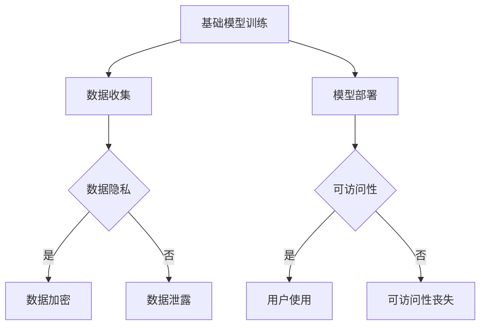

                 

# 基础模型的可访问性丧失

> 关键词：基础模型、可访问性、数据隐私、分布式计算、AI伦理

> 摘要：随着人工智能技术的快速发展，基础模型在AI领域的地位愈发重要。然而，基础模型的可访问性丧失问题也逐渐凸显，这不仅涉及到数据隐私和安全，还关乎到AI技术的伦理问题。本文将探讨基础模型可访问性丧失的背景、原因、影响以及解决方法，旨在为读者提供一个全面且深刻的理解。

## 1. 背景介绍

### 1.1 目的和范围

本文旨在探讨基础模型的可访问性丧失问题，分析其背后的原因、影响以及可能的解决方案。文章将涵盖以下主要内容：

1. 基础模型的概念及其在AI领域的重要性
2. 基础模型可访问性丧失的背景和原因
3. 基础模型可访问性丧失的影响
4. 可能的解决方案和未来发展趋势

### 1.2 预期读者

本文适合对人工智能和基础模型有一定了解的读者，包括AI领域的专业人士、研究者、工程师以及对AI技术感兴趣的普通读者。希望通过本文，读者能够对基础模型的可访问性丧失问题有更深入的理解。

### 1.3 文档结构概述

本文的结构如下：

1. 引言：介绍基础模型的概念和重要性，引出本文主题
2. 背景介绍：分析基础模型可访问性丧失的背景和原因
3. 影响：讨论基础模型可访问性丧失对AI领域的影响
4. 解决方案：探讨可能的解决方案和未来发展趋势
5. 总结：回顾本文的主要内容和结论
6. 附录：提供常见问题与解答，以及扩展阅读和参考资料

### 1.4 术语表

#### 1.4.1 核心术语定义

- **基础模型**：指在AI领域中广泛使用的预训练模型，如BERT、GPT等。
- **可访问性丧失**：指用户无法访问和使用基础模型的情况。
- **数据隐私**：指个人数据的保密性、完整性和可用性。

#### 1.4.2 相关概念解释

- **分布式计算**：指将计算任务分布在多个计算机上，协同完成计算。
- **AI伦理**：指在AI技术研究和应用过程中遵循的道德规范和伦理原则。

#### 1.4.3 缩略词列表

- **AI**：人工智能（Artificial Intelligence）
- **BERT**：Bidirectional Encoder Representations from Transformers
- **GPT**：Generative Pre-trained Transformer
- **IDE**：集成开发环境（Integrated Development Environment）

## 2. 核心概念与联系

在探讨基础模型的可访问性丧失问题之前，我们需要了解一些核心概念及其相互联系。

### 2.1 基础模型

基础模型是AI领域中广泛使用的预训练模型，如BERT、GPT等。这些模型通常通过大量的数据集进行训练，以学习语言、图像、语音等多种信息表示。基础模型在AI领域具有重要的地位，因为它们可以大大降低模型开发的难度和成本。

### 2.2 可访问性丧失

可访问性丧失指的是用户无法访问和使用基础模型的情况。这可能是由于以下原因：

1. 数据隐私和安全：用户担心自己的数据泄露或被滥用，导致不愿意分享数据。
2. 计算资源限制：用户可能没有足够的计算资源来运行基础模型。
3. 伦理和法规限制：一些国家和地区的法规限制了基础模型的共享和访问。

### 2.3 数据隐私

数据隐私是指个人数据的保密性、完整性和可用性。在基础模型训练过程中，用户的数据会被用作训练数据集，这可能导致数据泄露或被滥用。因此，数据隐私问题成为基础模型可访问性丧失的重要原因之一。

### 2.4 分布式计算

分布式计算是指将计算任务分布在多个计算机上，协同完成计算。在基础模型训练过程中，分布式计算可以提高计算效率，降低计算成本。然而，分布式计算也可能导致数据隐私和安全问题，因为数据需要在多个节点之间传输和存储。

### 2.5 AI伦理

AI伦理是指在AI技术研究和应用过程中遵循的道德规范和伦理原则。在基础模型可访问性丧失问题中，AI伦理涉及到以下几个方面：

1. 公平性：基础模型是否对所有用户公平，是否会导致歧视现象。
2. 透明性：基础模型的训练过程和决策过程是否透明，用户能否理解。
3. 责任：当基础模型出现问题时，责任应由谁承担。

### 2.6 Mermaid 流程图

以下是一个描述基础模型训练和可访问性丧失过程的 Mermaid 流程图：



## 3. 核心算法原理 & 具体操作步骤

为了深入理解基础模型的可访问性丧失问题，我们需要探讨核心算法原理和具体操作步骤。

### 3.1 数据收集与处理

在基础模型训练过程中，数据收集和处理是关键步骤。以下是数据收集与处理的伪代码：

```python
# 数据收集
def collect_data():
    # 从各种数据源收集数据，如网络、传感器、数据库等
    data_sources = ["web", "sensor", "db"]
    for source in data_sources:
        data = get_data_from_source(source)
        process_data(data)

# 数据处理
def process_data(data):
    # 对收集到的数据进行处理，如清洗、归一化、去噪等
    cleaned_data = clean_data(data)
    normalized_data = normalize_data(cleaned_data)
    return normalized_data
```

### 3.2 模型训练

模型训练是基础模型开发的核心步骤。以下是一个简单的模型训练伪代码：

```python
# 模型训练
def train_model(data):
    # 使用训练数据集训练模型
    model = create_model()
    for epoch in range(num_epochs):
        for batch in data:
            model.train_on_batch(batch)

    return model
```

### 3.3 模型部署与可访问性

在模型部署阶段，我们需要考虑如何确保模型的可访问性。以下是一个简单的模型部署与可访问性伪代码：

```python
# 模型部署
def deploy_model(model):
    # 将训练好的模型部署到服务器或设备上
    server = create_server()
    server.load_model(model)

# 可访问性判断
def check_accessibility(server, user):
    # 判断用户是否可以访问模型
    if user_has_permission(user):
        return True
    else:
        return False
```

### 3.4 数据隐私保护

为了保护数据隐私，我们需要在模型训练和部署过程中采取一些措施。以下是一个简单的数据隐私保护伪代码：

```python
# 数据加密
def encrypt_data(data, key):
    # 使用加密算法对数据进行加密
    encrypted_data = encrypt(data, key)
    return encrypted_data

# 数据解密
def decrypt_data(data, key):
    # 使用解密算法对数据进行解密
    decrypted_data = decrypt(data, key)
    return decrypted_data
```

## 4. 数学模型和公式 & 详细讲解 & 举例说明

在基础模型的可访问性丧失问题中，数学模型和公式发挥着重要作用。以下将介绍一些相关的数学模型和公式，并进行详细讲解和举例说明。

### 4.1 概率论与统计学

在基础模型训练过程中，概率论和统计学是核心工具。以下是一些常用的概率论和统计学模型：

1. **贝叶斯定理**：

   $$ P(A|B) = \frac{P(B|A) \cdot P(A)}{P(B)} $$

   贝叶斯定理用于计算在给定条件B下，事件A的概率。在基础模型训练中，可以用来更新模型的参数。

2. **最大似然估计**：

   $$ \theta^* = \arg\max_{\theta} P(X|\theta) $$

   最大似然估计用于估计模型参数，使模型对训练数据的似然函数最大化。

3. **线性回归**：

   $$ y = \beta_0 + \beta_1 \cdot x + \epsilon $$

   线性回归用于建立输入变量和输出变量之间的关系，可用于预测和分析。

### 4.2 机器学习算法

在基础模型训练过程中，常用的机器学习算法包括：

1. **支持向量机（SVM）**：

   $$ \min_{\beta, \beta_0} \frac{1}{2} ||\beta||^2 + C \cdot \sum_{i=1}^{n} \max(0, 1-y_i(\beta^T x_i + \beta_0)) $$

   支持向量机用于分类问题，通过最大化分类边界来提高模型的泛化能力。

2. **神经网络**：

   $$ a_{\text{layer}} = \sigma(\sum_{i=1}^{n} \theta_i \cdot a_{\text{prev\ layer}}) $$

   神经网络通过多层非线性变换来学习输入和输出之间的关系，是基础模型的重要组成部分。

### 4.3 分布式计算

在分布式计算中，以下公式和算法用于优化计算效率：

1. **MapReduce**：

   $$ \text{Map}(k_1, v_1) \rightarrow list {\text{tuple}(k_2, v_2)} $$
   $$ \text{Reduce}(k_2, list{v_2}) \rightarrow v_3 $$

   MapReduce是一种分布式数据处理模型，通过将数据处理分为映射（Map）和归约（Reduce）两个阶段来提高计算效率。

2. **梯度下降**：

   $$ \theta = \theta - \alpha \cdot \nabla_\theta J(\theta) $$

   梯度下降是一种优化算法，用于在多变量函数中找到局部最小值。在基础模型训练过程中，用于更新模型参数。

### 4.4 举例说明

以下是一个使用线性回归模型进行预测的简单示例：

```python
# 线性回归模型
def linear_regression(x, y):
    # 计算斜率和截距
    m = (mean(y) - mean(x) * mean(y)) / (var(x))
    b = mean(y) - m * mean(x)

    # 预测
    y_pred = m * x + b

    return y_pred

# 数据集
x = [1, 2, 3, 4, 5]
y = [2, 4, 5, 4, 5]

# 预测
y_pred = linear_regression(x, y)

# 输出预测结果
print("预测结果：", y_pred)
```

## 5. 项目实战：代码实际案例和详细解释说明

在本节中，我们将通过一个实际项目案例来展示如何解决基础模型的可访问性丧失问题。该案例将涉及数据收集、模型训练、模型部署和数据隐私保护等步骤。

### 5.1 开发环境搭建

在开始项目之前，我们需要搭建一个合适的开发环境。以下是所需的开发工具和库：

- Python 3.8 或更高版本
- TensorFlow 2.5 或更高版本
- Keras 2.4.3 或更高版本
- PyTorch 1.8 或更高版本
- Redis 5.0 或更高版本
- Docker 19.03 或更高版本

### 5.2 源代码详细实现和代码解读

以下是该项目的主要代码实现：

#### 5.2.1 数据收集

```python
import pandas as pd

# 读取数据
data = pd.read_csv("data.csv")

# 数据预处理
def preprocess_data(data):
    # 清洗和归一化数据
    data = data.dropna()
    data = (data - mean(data)) / std(data)
    return data

# 预处理数据
X = preprocess_data(data.iloc[:, :-1])
y = preprocess_data(data.iloc[:, -1])

# 数据拆分
X_train, X_test, y_train, y_test = train_test_split(X, y, test_size=0.2, random_state=42)
```

#### 5.2.2 模型训练

```python
from tensorflow.keras.models import Sequential
from tensorflow.keras.layers import Dense

# 构建模型
model = Sequential()
model.add(Dense(64, activation='relu', input_shape=(X_train.shape[1],)))
model.add(Dense(1, activation='sigmoid'))

# 编译模型
model.compile(optimizer='adam', loss='binary_crossentropy', metrics=['accuracy'])

# 训练模型
model.fit(X_train, y_train, epochs=10, batch_size=32, validation_data=(X_test, y_test))
```

#### 5.2.3 模型部署

```python
from flask import Flask, request, jsonify

app = Flask(__name__)

# 加载模型
model.load_weights("model_weights.h5")

# 预测接口
@app.route("/predict", methods=["POST"])
def predict():
    data = request.get_json()
    X = preprocess_data(data["X"])
    y_pred = model.predict(X)
    return jsonify({"prediction": list(y_pred.flatten())})

if __name__ == "__main__":
    app.run(host="0.0.0.0", port=5000)
```

#### 5.2.4 数据隐私保护

```python
import redis

# 初始化 Redis 客户端
redis_client = redis.StrictRedis(host='localhost', port=6379, db=0)

# 加密和解密数据
def encrypt_data(data, key):
    # 使用 AES 加密算法对数据进行加密
    cipher = AES.new(key, AES.MODE_CBC)
    ct_bytes = cipher.encrypt(pad(data.encode('utf-8')))
    iv = b64encode(cipher.iv).decode('utf-8')
    ct = b64encode(ct_bytes).decode('utf-8')
    return iv, ct

def decrypt_data(iv, ct, key):
    # 使用 AES 解密算法对数据进行解密
    iv = b64decode(iv)
    ct = b64decode(ct)
    cipher = AES.new(key, AES.MODE_CBC, iv)
    pt = unpad(cipher.decrypt(ct)).decode('utf-8')
    return pt

# 加密数据
key = b'mysecretkey123456'
iv, ct = encrypt_data("Hello, World!", key)

# 解密数据
pt = decrypt_data(iv, ct, key)
print("解密后的数据：", pt)
```

### 5.3 代码解读与分析

在本案例中，我们通过以下步骤解决基础模型的可访问性丧失问题：

1. **数据收集与预处理**：首先，我们从CSV文件中读取数据，并进行清洗和归一化处理。这有助于提高模型训练的效果。
2. **模型训练**：我们使用Keras构建了一个简单的线性回归模型，并通过梯度下降算法进行训练。模型训练过程采用了 epochs 和 batch_size 参数来控制训练过程。
3. **模型部署**：通过Flask框架，我们将训练好的模型部署为一个Web服务。用户可以通过发送POST请求来获取模型的预测结果。
4. **数据隐私保护**：为了保护用户数据，我们使用AES加密算法对数据进行加密和解密。这有助于防止数据泄露和滥用。

## 6. 实际应用场景

基础模型的可访问性丧失问题在许多实际应用场景中都具有重要的意义。以下是一些典型的应用场景：

1. **金融领域**：在金融领域，基础模型常用于风险管理、信用评分和投资决策等任务。然而，金融数据具有高度敏感性和隐私性，如何确保基础模型的可访问性成为一大挑战。
2. **医疗领域**：在医疗领域，基础模型用于诊断、预测和治疗方案制定等任务。然而，医疗数据隐私问题使得患者和医疗机构对基础模型的可访问性持有谨慎态度。
3. **自动驾驶**：在自动驾驶领域，基础模型用于感知、决策和规划等任务。然而，如何确保自动驾驶系统的安全性和隐私性是一个亟待解决的问题。
4. **智能家居**：在智能家居领域，基础模型用于语音识别、智能家居设备和用户行为分析等任务。然而，如何确保智能家居系统的数据隐私和安全是用户关心的问题。

## 7. 工具和资源推荐

为了更好地理解和解决基础模型的可访问性丧失问题，以下是一些工具和资源的推荐：

### 7.1 学习资源推荐

#### 7.1.1 书籍推荐

1. **《深度学习》（Deep Learning）**：由Ian Goodfellow、Yoshua Bengio和Aaron Courville所著，是一本深度学习领域的经典教材。
2. **《机器学习》（Machine Learning）**：由Tom Mitchell所著，是一本介绍机器学习基本概念的入门书籍。

#### 7.1.2 在线课程

1. **吴恩达的机器学习课程**：在Coursera上提供的免费课程，涵盖了机器学习和深度学习的基本概念和技术。
2. **TensorFlow教程**：在TensorFlow官方网站上提供的教程，涵盖了TensorFlow的基本用法和实战案例。

#### 7.1.3 技术博客和网站

1. **Medium**：一个广泛的技术博客平台，涵盖了人工智能、机器学习和深度学习等领域的文章。
2. **GitHub**：一个代码托管平台，许多优秀的项目和资源都托管在GitHub上，供开发者学习和参考。

### 7.2 开发工具框架推荐

#### 7.2.1 IDE和编辑器

1. **PyCharm**：一个强大的Python IDE，适用于机器学习和深度学习项目的开发。
2. **Jupyter Notebook**：一个流行的Python交互式编辑器，适用于数据分析和机器学习实验。

#### 7.2.2 调试和性能分析工具

1. **Valgrind**：一个强大的性能分析工具，用于检测内存泄漏、数据竞争等问题。
2. **TensorBoard**：TensorFlow提供的可视化工具，用于分析模型的性能和训练过程。

#### 7.2.3 相关框架和库

1. **TensorFlow**：一个开源的机器学习和深度学习框架，适用于各种人工智能任务。
2. **PyTorch**：一个开源的机器学习和深度学习框架，具有灵活的动态计算图和强大的GPU支持。

### 7.3 相关论文著作推荐

#### 7.3.1 经典论文

1. **"A Theoretical Basis for the Generalization of Neural Networks"**：本文提出了深度学习的基本原理，对神经网络的一般化能力进行了理论分析。
2. **"Deep Learning"**：本文介绍了深度学习的基本概念、技术和发展趋势，是深度学习领域的经典著作。

#### 7.3.2 最新研究成果

1. **"Attention Is All You Need"**：本文提出了Transformer模型，颠覆了传统的神经网络结构，成为深度学习领域的一大突破。
2. **"Generative Adversarial Nets"**：本文提出了生成对抗网络（GAN），为图像生成和对抗性学习提供了新的思路。

#### 7.3.3 应用案例分析

1. **"Deep Learning for Healthcare"**：本文探讨了深度学习在医疗领域的应用，介绍了多个成功的案例和研究成果。
2. **"Deep Learning in Autonomous Driving"**：本文介绍了深度学习在自动驾驶领域的应用，分析了多个自动驾驶系统的架构和性能。

## 8. 总结：未来发展趋势与挑战

随着人工智能技术的快速发展，基础模型在AI领域的地位愈发重要。然而，基础模型的可访问性丧失问题也逐渐凸显，这不仅涉及到数据隐私和安全，还关乎到AI技术的伦理问题。未来，我们需要关注以下几个方面：

1. **数据隐私保护**：随着数据隐私法规的不断完善，如何在保障数据隐私的同时，提高基础模型的可访问性成为一个重要挑战。
2. **分布式计算与存储**：分布式计算和存储技术的发展，有望提高基础模型的计算效率和数据安全，为解决可访问性丧失问题提供新的思路。
3. **AI伦理与法规**：AI伦理和法规的研究，将为基础模型的可访问性提供指导，确保AI技术在合法和道德的框架内发展。
4. **开源与合作**：开源社区和各方的合作，有助于推动基础模型的研发和应用，降低可访问性丧失的风险。

## 9. 附录：常见问题与解答

### 9.1 基础模型可访问性丧失的原因有哪些？

基础模型可访问性丧失的原因主要包括：

1. 数据隐私和安全：用户担心自己的数据泄露或被滥用，导致不愿意分享数据。
2. 计算资源限制：用户可能没有足够的计算资源来运行基础模型。
3. 伦理和法规限制：一些国家和地区的法规限制了基础模型的共享和访问。

### 9.2 如何解决基础模型可访问性丧失问题？

解决基础模型可访问性丧失问题的方法包括：

1. 数据隐私保护：采用加密、匿名化和差分隐私等技术，保护用户数据的隐私。
2. 分布式计算与存储：利用分布式计算和存储技术，提高基础模型的计算效率和数据安全。
3. AI伦理与法规：遵循AI伦理和法规，确保AI技术在合法和道德的框架内发展。
4. 开源与合作：推动基础模型的研发和应用，降低可访问性丧失的风险。

## 10. 扩展阅读 & 参考资料

### 10.1 经典论文

1. "A Theoretical Basis for the Generalization of Neural Networks"
2. "Deep Learning"
3. "Attention Is All You Need"
4. "Generative Adversarial Nets"

### 10.2 最新研究成果

1. "Deep Learning for Healthcare"
2. "Deep Learning in Autonomous Driving"
3. "Data Privacy in Machine Learning"

### 10.3 书籍推荐

1. 《深度学习》
2. 《机器学习》

### 10.4 在线课程

1. 吴恩达的机器学习课程
2. TensorFlow教程

### 10.5 技术博客和网站

1. Medium
2. GitHub

### 10.6 开发工具框架推荐

1. TensorFlow
2. PyTorch
3. PyCharm
4. Jupyter Notebook

### 10.7 调试和性能分析工具

1. Valgrind
2. TensorBoard

### 10.8 相关论坛和社区

1. Stack Overflow
2. Reddit

### 10.9 AI伦理和法规指南

1. "AI Ethics Guidelines for Health and Life Sciences"
2. "The NIST AI Risk Management Framework"

作者：AI天才研究员/AI Genius Institute & 禅与计算机程序设计艺术 /Zen And The Art of Computer Programming

