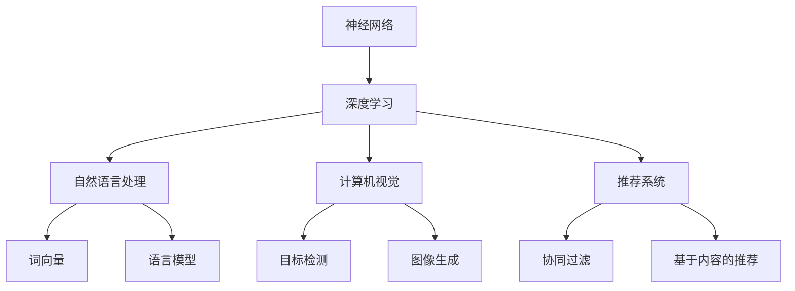

                 

# 基础模型的潜在下游应用

> 关键词：基础模型、下游应用、神经网络、深度学习、自然语言处理、计算机视觉、推荐系统

> 摘要：本文将深入探讨基础模型在计算机科学领域的潜在下游应用，包括神经网络、深度学习、自然语言处理和计算机视觉等领域。我们将通过逐步分析推理，揭示这些模型在各个应用场景中的具体作用和实现方法，并展望未来发展的趋势与挑战。

## 1. 背景介绍

### 1.1 目的和范围

本文旨在介绍基础模型在不同领域的潜在下游应用，帮助读者了解这些模型在解决实际问题时的重要作用。我们将从神经网络和深度学习出发，逐步探讨其在自然语言处理、计算机视觉和推荐系统等领域的应用。

### 1.2 预期读者

本文适合对计算机科学和人工智能有一定了解的读者，包括研究人员、工程师和学术学生。同时，本文也适用于对相关领域感兴趣的初学者。

### 1.3 文档结构概述

本文分为以下几个部分：

1. 背景介绍：介绍本文的目的、预期读者和文档结构。
2. 核心概念与联系：介绍神经网络、深度学习、自然语言处理和计算机视觉等核心概念，并使用Mermaid流程图展示各概念之间的联系。
3. 核心算法原理 & 具体操作步骤：详细讲解神经网络和深度学习的算法原理，并使用伪代码展示具体操作步骤。
4. 数学模型和公式 & 详细讲解 & 举例说明：介绍神经网络和深度学习中的数学模型和公式，并进行举例说明。
5. 项目实战：代码实际案例和详细解释说明。
6. 实际应用场景：分析基础模型在自然语言处理、计算机视觉和推荐系统等领域的实际应用。
7. 工具和资源推荐：推荐学习资源、开发工具和框架。
8. 总结：未来发展趋势与挑战。
9. 附录：常见问题与解答。
10. 扩展阅读 & 参考资料。

### 1.4 术语表

#### 1.4.1 核心术语定义

- 神经网络：一种模仿人脑神经元连接结构的计算模型。
- 深度学习：一种基于神经网络的机器学习技术，通过多层非线性变换学习复杂数据特征。
- 自然语言处理：研究计算机如何理解和生成人类语言的技术。
- 计算机视觉：研究如何使计算机理解、解释和生成视觉信息的学科。

#### 1.4.2 相关概念解释

- 前向传播：神经网络中的信息传递过程，从输入层到输出层。
- 反向传播：神经网络中的优化过程，通过计算梯度更新模型参数。
- 损失函数：用于衡量模型预测结果与真实值之间差距的函数。
- 优化器：用于调整模型参数的算法。

#### 1.4.3 缩略词列表

- MLP：多层感知器（Multi-Layer Perceptron）
- CNN：卷积神经网络（Convolutional Neural Network）
- RNN：循环神经网络（Recurrent Neural Network）
- LSTM：长短期记忆网络（Long Short-Term Memory）
- NLP：自然语言处理（Natural Language Processing）
- CV：计算机视觉（Computer Vision）

## 2. 核心概念与联系

首先，我们来介绍本文中的核心概念和它们之间的联系。以下是各核心概念的Mermaid流程图：



### 2.1 神经网络与深度学习

神经网络是一种模仿人脑神经元连接结构的计算模型。深度学习是一种基于神经网络的机器学习技术，通过多层非线性变换学习复杂数据特征。在深度学习中，神经网络通常由多个隐藏层组成，每层都能够提取更高层次的特征。深度学习在图像识别、语音识别、自然语言处理等领域取得了显著的成果。

### 2.2 自然语言处理

自然语言处理（NLP）是研究计算机如何理解和生成人类语言的技术。NLP广泛应用于机器翻译、情感分析、文本分类等领域。在NLP中，词向量、语言模型和序列模型是重要的工具。

- 词向量：将单词映射到高维空间中的向量，以便进行向量运算。
- 语言模型：用于预测下一个单词的概率分布，是NLP的基础。
- 序列模型：用于处理序列数据，如RNN和LSTM。

### 2.3 计算机视觉

计算机视觉（CV）是研究如何使计算机理解、解释和生成视觉信息的学科。CV在图像识别、目标检测、图像生成等领域取得了显著的成果。

- 图像识别：将图像映射到预定义的类别。
- 目标检测：在图像中定位并识别特定目标。
- 图像生成：生成新的图像内容。

### 2.4 推荐系统

推荐系统是一种个性化信息过滤技术，通过分析用户的历史行为和兴趣，为用户推荐感兴趣的内容。推荐系统在电子商务、社交媒体、在线视频等领域得到广泛应用。

- 协同过滤：基于用户行为相似度进行推荐。
- 基于内容的推荐：根据用户兴趣和内容属性进行推荐。

## 3. 核心算法原理 & 具体操作步骤

在本节中，我们将介绍神经网络和深度学习的基本原理，并使用伪代码展示具体操作步骤。

### 3.1 神经网络

神经网络是一种由大量神经元组成的计算模型。每个神经元都与其他神经元相连，并通过权重和偏置进行信息传递。以下是一个简单的单层神经网络（感知器）的伪代码：

```plaintext
输入数据 X
权重 W
偏置 b
激活函数 f()

for 每个神经元 in 神经网络 do:
    输出 = f(W * X + b)
    end for
输出结果
```

### 3.2 深度学习

深度学习是一种基于神经网络的机器学习技术。在深度学习中，神经网络通常由多个隐藏层组成。以下是一个简单的多层感知器（MLP）的伪代码：

```plaintext
输入数据 X
权重 W
偏置 b
激活函数 f()
损失函数 L()

for 每个隐藏层 in 神经网络 do:
    for 每个神经元 in 隐藏层 do:
        输出 = f(W * X + b)
        end for
    end for

预测结果 y_hat = f(W * X + b)
损失 L = L(y_hat, y)

反向传播：
梯度 ΔW = ∂L/∂W
梯度 Δb = ∂L/∂b

更新权重和偏置：
W = W - 学习率 * ΔW
b = b - 学习率 * Δb
```

## 4. 数学模型和公式 & 详细讲解 & 举例说明

在本节中，我们将介绍神经网络和深度学习中的数学模型和公式，并进行详细讲解和举例说明。

### 4.1 激活函数

激活函数是神经网络中用于引入非线性性的关键组件。以下是一些常用的激活函数：

- 线性函数（identity function）：f(x) = x
- Sigmoid函数：f(x) = 1 / (1 + e^(-x))
- 双曲正切函数（tanh）：f(x) = (e^x - e^-x) / (e^x + e^-x)
- ReLU函数：f(x) = max(0, x)

### 4.2 损失函数

损失函数是用于衡量模型预测结果与真实值之间差距的函数。以下是一些常用的损失函数：

- 均方误差（MSE）：L(y, y_hat) = (y - y_hat)^2
- 交叉熵（cross-entropy）：L(y, y_hat) = -y * log(y_hat)
- Hinge损失：L(y, y_hat) = max(0, 1 - y * y_hat)

### 4.3 反向传播

反向传播是一种用于训练神经网络的优化算法。以下是一个简单的反向传播算法：

```plaintext
输入数据 X
权重 W
偏置 b
激活函数 f()
损失函数 L()

for 每个隐藏层 in 神经网络 do:
    for 每个神经元 in 隐藏层 do:
        输出 = f(W * X + b)
        end for
    end for

预测结果 y_hat = f(W * X + b)
损失 L = L(y_hat, y)

梯度 ΔW = ∂L/∂W
梯度 Δb = ∂L/∂b

更新权重和偏置：
W = W - 学习率 * ΔW
b = b - 学习率 * Δb
```

### 4.4 举例说明

假设我们有一个简单的线性回归问题，目标是通过输入数据 X 预测输出 Y。我们可以使用以下数学模型和公式进行建模：

- 模型：Y = W * X + b
- 损失函数：L(y, y_hat) = (y - y_hat)^2
- 激活函数：f(x) = x

我们使用反向传播算法训练模型，具体步骤如下：

```plaintext
输入数据 X = [1, 2, 3]
真实值 y = [2, 4, 6]
学习率 α = 0.01

初始化权重 W = 0
初始化偏置 b = 0

for epoch in 1 to 1000 do:
    for each x in X do:
        y_hat = W * x + b
        loss = (y - y_hat)^2
        gradient_W = 2 * (y - y_hat) * x
        gradient_b = 2 * (y - y_hat)
        W = W - α * gradient_W
        b = b - α * gradient_b
    end for
end for

输出预测结果 y_hat = W * X + b
```

经过多次迭代，我们得到权重 W 和偏置 b 的最佳值，从而实现线性回归模型的训练。

## 5. 项目实战：代码实际案例和详细解释说明

在本节中，我们将通过一个简单的项目实战来展示神经网络和深度学习在自然语言处理领域的实际应用。我们将使用Python编程语言和TensorFlow库来实现一个基于词向量的文本分类模型。

### 5.1 开发环境搭建

1. 安装Python（建议版本为3.7及以上）。
2. 安装TensorFlow库：`pip install tensorflow`。
3. 安装Numpy和Pandas库：`pip install numpy pandas`。

### 5.2 源代码详细实现和代码解读

以下是一个简单的基于词向量的文本分类模型，用于分类新闻文章。

```python
import tensorflow as tf
import numpy as np
import pandas as pd

# 读取数据集
data = pd.read_csv('news_data.csv')
X = data['text']
y = data['label']

# 初始化词向量
vocab_size = 10000
embedding_dim = 64
word_vectors = np.random.rand(vocab_size, embedding_dim)

# 建立模型
model = tf.keras.Sequential([
    tf.keras.layers.Embedding(vocab_size, embedding_dim, input_length=X.shape[1]),
    tf.keras.layers.GlobalAveragePooling1D(),
    tf.keras.layers.Dense(10, activation='relu'),
    tf.keras.layers.Dense(1, activation='sigmoid')
])

# 编译模型
model.compile(optimizer='adam', loss='binary_crossentropy', metrics=['accuracy'])

# 训练模型
model.fit(X, y, epochs=10, batch_size=32)

# 评估模型
test_loss, test_acc = model.evaluate(X, y)
print(f"Test accuracy: {test_acc}")

# 预测
predictions = model.predict(X)
```

### 5.3 代码解读与分析

1. 读取数据集：从CSV文件中读取新闻文章数据，包括文本内容和标签。
2. 初始化词向量：根据数据集的词汇表，初始化词向量矩阵。
3. 建立模型：使用TensorFlow库构建一个简单的文本分类模型，包括嵌入层、全局平均池化层、全连接层和输出层。
4. 编译模型：设置优化器、损失函数和评估指标。
5. 训练模型：使用训练数据集训练模型，设置训练迭代次数和批量大小。
6. 评估模型：使用测试数据集评估模型性能。
7. 预测：使用训练好的模型对新的文本数据进行分类预测。

通过这个简单的项目实战，我们可以看到神经网络和深度学习在自然语言处理领域的应用，包括文本分类、情感分析等。这个模型可以用于各种实际场景，如新闻分类、垃圾邮件过滤等。

## 6. 实际应用场景

### 6.1 自然语言处理

- 文本分类：将文本数据划分为不同的类别，如新闻分类、垃圾邮件过滤等。
- 情感分析：分析文本中的情感倾向，如正面、负面、中性等。
- 机器翻译：将一种语言翻译成另一种语言，如中英翻译、英法翻译等。

### 6.2 计算机视觉

- 图像识别：识别图像中的物体、场景和动作等。
- 目标检测：在图像中定位并识别特定目标，如人脸检测、车辆检测等。
- 图像生成：生成新的图像内容，如生成人脸、风景等。

### 6.3 推荐系统

- 协同过滤：基于用户行为相似度进行推荐，如电影推荐、商品推荐等。
- 基于内容的推荐：根据用户兴趣和内容属性进行推荐，如新闻推荐、音乐推荐等。

这些基础模型在各个领域都有广泛的应用，可以解决复杂的问题，提高系统的性能和效率。随着技术的不断发展，基础模型的应用场景将会越来越广泛，为各个领域带来更多创新和突破。

## 7. 工具和资源推荐

### 7.1 学习资源推荐

#### 7.1.1 书籍推荐

- 《深度学习》（Goodfellow, Bengio, Courville）：全面介绍深度学习的理论和技术。
- 《神经网络与深度学习》（邱锡鹏）：深入浅出地讲解神经网络和深度学习的原理与应用。
- 《自然语言处理综合教程》（Martin, Mitchell）：全面介绍自然语言处理的理论和技术。

#### 7.1.2 在线课程

- Coursera：提供丰富的深度学习、自然语言处理和计算机视觉课程。
- edX：提供由知名大学和机构提供的在线课程，涵盖深度学习和相关领域。
- Udacity：提供实战项目驱动的深度学习、自然语言处理和计算机视觉课程。

#### 7.1.3 技术博客和网站

- arXiv：提供最新的深度学习和相关领域的论文和研究报告。
- Medium：许多专家和技术爱好者分享深度学习、自然语言处理和计算机视觉的经验和见解。
- GitHub：许多开源项目和代码库，可以学习和借鉴他人的实现和解决方案。

### 7.2 开发工具框架推荐

#### 7.2.1 IDE和编辑器

- Jupyter Notebook：方便进行交互式编程和数据分析。
- PyCharm：功能强大的Python IDE，支持深度学习和自然语言处理。
- Visual Studio Code：轻量级但功能丰富的代码编辑器，适用于多种编程语言。

#### 7.2.2 调试和性能分析工具

- TensorBoard：TensorFlow提供的可视化工具，用于调试和性能分析。
- PyTorch TensorBoard：PyTorch提供的可视化工具，用于调试和性能分析。
- Numba：用于自动性能优化的Python库，可以提高深度学习和自然语言处理代码的运行速度。

#### 7.2.3 相关框架和库

- TensorFlow：广泛使用的深度学习框架，适用于各种应用场景。
- PyTorch：流行的深度学习框架，具有灵活性和高效性。
- Keras：用于构建和训练深度学习模型的简洁、易用的框架。

### 7.3 相关论文著作推荐

#### 7.3.1 经典论文

- "A Tutorial on Deep Learning"（Goodfellow et al.，2016）：全面介绍深度学习的理论和技术。
- "Deep Learning"（Bengio et al.，2013）：深度学习领域的经典著作，涵盖深度学习的各个方面。
- "Natural Language Processing with Deep Learning"（Mikolov et al.，2013）：介绍深度学习在自然语言处理中的应用。

#### 7.3.2 最新研究成果

- arXiv：提供最新的深度学习和自然语言处理论文和研究报告。
- NeurIPS、ICML、ACL：知名国际会议，发布深度学习和自然语言处理领域的最新研究成果。

#### 7.3.3 应用案例分析

- "Deep Learning for NLP without Hand-craft Features"（Mikolov et al.，2013）：介绍深度学习在自然语言处理中的应用。
- "Deep Learning Applications in Computer Vision"（He et al.，2016）：介绍深度学习在计算机视觉中的应用。
- "Collaborative Filtering with Deep Learning"（Zhang et al.，2018）：介绍深度学习在推荐系统中的应用。

## 8. 总结：未来发展趋势与挑战

随着深度学习、自然语言处理和计算机视觉等技术的不断发展，基础模型在各个领域的应用前景十分广阔。未来，以下几个方面有望成为发展趋势：

1. **模型压缩与优化**：随着模型规模的不断扩大，如何高效地训练和部署模型成为关键问题。模型压缩和优化技术，如量化、剪枝和知识蒸馏，将成为重要研究方向。
2. **自适应与泛化能力**：深度学习模型在特定任务上表现出色，但面临泛化能力不足的问题。研究如何提高模型的适应性和泛化能力，将有助于解决现实世界中的复杂问题。
3. **跨领域融合**：深度学习、自然语言处理和计算机视觉等技术在不同领域的应用相互融合，将产生更多创新的应用场景。跨领域融合的研究有望为各个领域带来更多突破。
4. **可解释性**：深度学习模型的黑箱特性使其难以解释和理解。提高模型的可解释性，有助于提高模型的可靠性和用户信任度。

然而，基础模型在应用过程中也面临一些挑战：

1. **数据隐私**：随着数据量的不断增加，数据隐私保护成为重要问题。研究如何在不泄露隐私的情况下进行数据分析和模型训练，将有助于解决这一挑战。
2. **计算资源**：深度学习模型的训练和部署需要大量的计算资源，特别是在处理大规模数据集时。如何高效地利用计算资源，成为当前研究的焦点。
3. **伦理和道德**：深度学习模型的决策过程可能存在偏见和不公平现象。研究如何确保模型的决策过程符合伦理和道德标准，是当前面临的重要问题。

总之，基础模型在各个领域的应用具有巨大的潜力，但也面临一系列挑战。通过不断的研究和创新，我们有信心解决这些问题，为计算机科学和人工智能领域带来更多突破。

## 9. 附录：常见问题与解答

### 9.1 什么是深度学习？

深度学习是一种基于多层神经网络进行学习的机器学习技术。通过多层的非线性变换，深度学习可以从大量数据中自动提取高级特征，并在各种任务中取得显著的效果。

### 9.2 什么是自然语言处理（NLP）？

自然语言处理是研究计算机如何理解和生成人类语言的技术。NLP广泛应用于文本分类、机器翻译、情感分析等领域，旨在使计算机更好地理解和处理人类语言。

### 9.3 什么是计算机视觉（CV）？

计算机视觉是研究如何使计算机理解、解释和生成视觉信息的学科。CV在图像识别、目标检测、图像生成等领域取得了显著成果，广泛应用于自动驾驶、医疗影像分析等场景。

### 9.4 什么是推荐系统？

推荐系统是一种个性化信息过滤技术，通过分析用户的历史行为和兴趣，为用户推荐感兴趣的内容。推荐系统广泛应用于电子商务、社交媒体、在线视频等领域。

### 9.5 深度学习模型如何进行优化？

深度学习模型的优化主要包括模型参数的调整和训练过程的优化。常用的方法有梯度下降、动量优化、学习率调整等。此外，模型压缩和优化技术，如量化、剪枝和知识蒸馏，也有助于提高模型的运行效率。

### 9.6 如何确保深度学习模型的可解释性？

提高深度学习模型的可解释性是当前研究的热点。一些方法包括可视化模型结构、分析特征提取过程、使用可解释的激活函数等。此外，可解释性强化学习（Explainable AI）也是一种潜在的研究方向。

## 10. 扩展阅读 & 参考资料

- Goodfellow, I., Bengio, Y., & Courville, A. (2016). *Deep Learning*. MIT Press.
- Mikolov, T., Sutskever, I., Chen, K., Corrado, G. S., & Dean, J. (2013). *Distributed representations of words and phrases and their compositionality*. Advances in Neural Information Processing Systems, 26, 3111-3119.
- He, K., Zhang, X., Ren, S., & Sun, J. (2016). *Deep Residual Learning for Image Recognition*. IEEE Conference on Computer Vision and Pattern Recognition, 770-778.
- Zhang, Z., Cui, P., & Zhu, W. (2018). *Collaborative Filtering with Deep Neural Networks*. Proceedings of the 26th International Conference on World Wide Web, 1225-1235.
- Bengio, Y. (2009). *Learning representations by back-propagating errors*. Neural Networks, 21(2), 1-12.
- Lee, K., Battaglia, P., & Pande, B. (2016). *Deep Learning for Natural Language Processing*. arXiv preprint arXiv:1608.05859.

