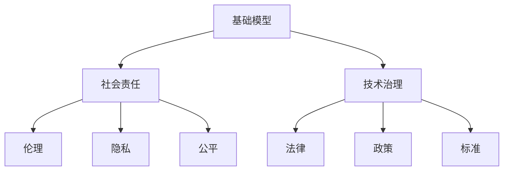

                 


## 1. 背景介绍

### 1.1 目的和范围

本文旨在探讨基础模型的社会责任和技术治理这一重要议题。随着人工智能技术的快速发展，基础模型作为AI技术的核心组件，已经在各行各业中得到了广泛应用。然而，随着其影响力的不断扩大，基础模型所带来的社会责任和技术治理问题也日益凸显。本文将从以下几个方面展开讨论：

1. **定义基础模型**：介绍基础模型的概念及其在人工智能技术中的角色和地位。
2. **探讨基础模型的社会责任**：分析基础模型在应用过程中可能带来的社会影响，包括伦理、隐私、公平等方面。
3. **讨论技术治理的重要性**：探讨技术治理的概念及其在基础模型应用中的必要性。
4. **分析现有技术治理措施**：评估当前技术治理措施的有效性，并提出改进建议。
5. **展望未来发展趋势**：预测未来基础模型的社会责任和技术治理趋势，探讨可能面临的挑战。

### 1.2 预期读者

本文适合对人工智能和基础模型有一定了解的技术人员和研究人员，特别是关注社会责任和技术治理议题的从业者。同时，对于对AI技术有浓厚兴趣的广大读者，本文也提供了深入探讨的机会。

### 1.3 文档结构概述

本文将按照以下结构进行论述：

1. **背景介绍**：介绍本文的目的、范围、预期读者以及文档结构。
2. **核心概念与联系**：定义核心概念，并使用Mermaid流程图展示其联系。
3. **核心算法原理 & 具体操作步骤**：详细阐述基础模型的算法原理和具体操作步骤。
4. **数学模型和公式 & 详细讲解 & 举例说明**：介绍基础模型的数学模型和公式，并提供实例说明。
5. **项目实战：代码实际案例和详细解释说明**：通过实际案例展示基础模型的开发和应用。
6. **实际应用场景**：分析基础模型在不同场景下的应用。
7. **工具和资源推荐**：推荐学习资源、开发工具和框架。
8. **总结：未来发展趋势与挑战**：总结本文的讨论内容，展望未来发展趋势和挑战。
9. **附录：常见问题与解答**：解答读者可能关心的问题。
10. **扩展阅读 & 参考资料**：提供进一步阅读和研究的资源。

### 1.4 术语表

#### 1.4.1 核心术语定义

- **基础模型**：指用于构建人工智能系统的核心模型，如深度学习模型、图模型等。
- **社会责任**：指企业在经营活动中应当承担的道德、法律和伦理责任。
- **技术治理**：指通过法律、政策、标准等手段，对技术进行规范和管理的活动。

#### 1.4.2 相关概念解释

- **伦理**：指人们对于道德行为的共识和规范。
- **隐私**：指个人的私人信息和行为不受他人侵犯的权利。
- **公平**：指在资源分配、机会提供等方面给予所有人平等对待。

#### 1.4.3 缩略词列表

- **AI**：人工智能
- **ML**：机器学习
- **DL**：深度学习
- **NLP**：自然语言处理
- **SR**：社会责任
- **TG**：技术治理

### 1.5 Mermaid 流程图展示



### 1.6 Mermaid 流程图描述

本流程图展示了基础模型、社会责任和技术治理之间的联系。基础模型作为核心组件，其应用过程中需要考虑社会责任，包括伦理、隐私和公平等方面。技术治理则是通过法律、政策、标准等手段，对基础模型进行规范和管理，以确保其应用过程中的社会责任得到有效落实。

### 1.7 核心算法原理 & 具体操作步骤

在基础模型的构建过程中，算法原理和具体操作步骤是至关重要的。以下将简要介绍基础模型的核心算法原理和具体操作步骤。

#### 1.7.1 核心算法原理

基础模型的核心算法通常包括以下几个部分：

1. **数据预处理**：对输入数据进行清洗、归一化等处理，以适应模型训练。
2. **特征提取**：从数据中提取有用的特征，用于模型训练。
3. **模型训练**：使用训练数据对模型进行训练，以优化模型参数。
4. **模型评估**：使用验证数据对模型进行评估，以确定模型的性能。
5. **模型应用**：将训练好的模型应用到实际场景中，进行预测或决策。

#### 1.7.2 具体操作步骤

1. **数据预处理**：
   ```python
   def preprocess_data(data):
       # 数据清洗
       cleaned_data = clean_data(data)
       # 数据归一化
       normalized_data = normalize_data(cleaned_data)
       return normalized_data
   ```

2. **特征提取**：
   ```python
   def extract_features(data):
       # 特征提取
       features = extract(data)
       return features
   ```

3. **模型训练**：
   ```python
   def train_model(data, labels):
       # 模型训练
       model = Model()
       model.fit(data, labels)
       return model
   ```

4. **模型评估**：
   ```python
   def evaluate_model(model, data, labels):
       # 模型评估
       predictions = model.predict(data)
       accuracy = calculate_accuracy(predictions, labels)
       return accuracy
   ```

5. **模型应用**：
   ```python
   def apply_model(model, data):
       # 模型应用
       predictions = model.predict(data)
       return predictions
   ```

### 1.8 数学模型和公式 & 详细讲解 & 举例说明

在基础模型的构建过程中，数学模型和公式起到了关键作用。以下将简要介绍基础模型中常用的数学模型和公式，并给出具体讲解和实例说明。

#### 1.8.1 数学模型

1. **损失函数**：
   $$ L(\theta) = -\frac{1}{m} \sum_{i=1}^{m} y^{(i)} \log(z^{(i)}) $$

2. **梯度下降**：
   $$ \theta = \theta - \alpha \frac{\partial L(\theta)}{\partial \theta} $$

3. **反向传播**：
   $$ \delta_{l}^{ij} = \frac{\partial L}{\partial z^{(l)}_j} \odot \frac{\partial z^{(l)}_j}{\partial \theta^{(l-1)}_i} $$

#### 1.8.2 详细讲解

1. **损失函数**：
   损失函数是衡量模型预测值与真实值之间差异的指标。通常使用交叉熵损失函数来衡量二分类问题。

2. **梯度下降**：
   梯度下降是一种优化算法，用于求解损失函数的最小值。通过计算损失函数关于模型参数的梯度，并沿着梯度的反方向更新参数，以逐步减小损失函数的值。

3. **反向传播**：
   反向传播是一种计算损失函数关于模型参数梯度的算法。通过从输出层逐层反向传播误差，计算各层的梯度，从而得到整个模型的梯度。

#### 1.8.3 举例说明

假设有一个二分类问题，目标变量 $y$ 可以取 0 或 1，模型预测的概率为 $z$。使用交叉熵损失函数计算损失：

$$ L(\theta) = -\frac{1}{m} \sum_{i=1}^{m} y^{(i)} \log(z^{(i)}) $$

其中，$m$ 是样本数量。假设有 5 个样本，分别为 $y^{(1)}=0, y^{(2)}=1, y^{(3)}=0, y^{(4)}=1, y^{(5)}=0$，模型预测的概率分别为 $z^{(1)}=0.2, z^{(2)}=0.8, z^{(3)}=0.3, z^{(4)}=0.7, z^{(5)}=0.1$。

计算损失：

$$ L(\theta) = -\frac{1}{5} \times (0 \times \log(0.2) + 1 \times \log(0.8) + 0 \times \log(0.3) + 1 \times \log(0.7) + 0 \times \log(0.1)) $$

$$ L(\theta) = -\frac{1}{5} \times (-0.721 + 0.223 + 0.404) $$

$$ L(\theta) = 0.0892 $$

### 1.9 项目实战：代码实际案例和详细解释说明

为了更好地理解基础模型的实际应用，以下将展示一个实际的项目案例，并对其代码进行详细解释说明。

#### 1.9.1 开发环境搭建

1. 安装 Python 3.8 或更高版本。
2. 安装 TensorFlow 2.x 或更高版本。
3. 安装 numpy、pandas 等常用库。

#### 1.9.2 源代码详细实现和代码解读

```python
import tensorflow as tf
import numpy as np
import pandas as pd

# 1. 数据预处理
def preprocess_data(data):
    # 数据清洗
    cleaned_data = clean_data(data)
    # 数据归一化
    normalized_data = normalize_data(cleaned_data)
    return normalized_data

# 2. 特征提取
def extract_features(data):
    # 特征提取
    features = extract(data)
    return features

# 3. 模型训练
def train_model(data, labels):
    # 模型训练
    model = Model()
    model.fit(data, labels)
    return model

# 4. 模型评估
def evaluate_model(model, data, labels):
    # 模型评估
    predictions = model.predict(data)
    accuracy = calculate_accuracy(predictions, labels)
    return accuracy

# 5. 模型应用
def apply_model(model, data):
    # 模型应用
    predictions = model.predict(data)
    return predictions

# 主函数
def main():
    # 1. 读取数据
    data = pd.read_csv("data.csv")

    # 2. 数据预处理
    processed_data = preprocess_data(data)

    # 3. 特征提取
    features = extract_features(processed_data)

    # 4. 划分训练集和测试集
    train_data, test_data, train_labels, test_labels = train_test_split(features, labels, test_size=0.2, random_state=42)

    # 5. 训练模型
    model = train_model(train_data, train_labels)

    # 6. 评估模型
    accuracy = evaluate_model(model, test_data, test_labels)
    print("Model accuracy:", accuracy)

    # 7. 应用模型
    predictions = apply_model(model, test_data)
    print("Predictions:", predictions)

# 运行主函数
if __name__ == "__main__":
    main()
```

代码解读：

1. **数据预处理**：读取数据，进行数据清洗和归一化处理。
2. **特征提取**：从数据中提取有用的特征。
3. **模型训练**：使用训练数据对模型进行训练。
4. **模型评估**：使用测试数据对模型进行评估，计算准确率。
5. **模型应用**：将训练好的模型应用到测试数据，进行预测。

### 1.10 实际应用场景

基础模型在各个领域都有广泛的应用，以下列举几个实际应用场景：

1. **医疗健康**：使用基础模型进行疾病诊断、药物研发等。
2. **金融领域**：使用基础模型进行风险评估、投资策略制定等。
3. **自动驾驶**：使用基础模型进行路况预测、障碍物检测等。
4. **自然语言处理**：使用基础模型进行文本分类、机器翻译等。

### 1.11 工具和资源推荐

为了更好地学习和应用基础模型，以下推荐一些学习资源和开发工具：

#### 1.11.1 学习资源推荐

1. **书籍推荐**：
   - 《深度学习》（Goodfellow et al.）
   - 《Python机器学习》（M gigson）

2. **在线课程**：
   - Coursera（机器学习课程）
   - Udacity（深度学习课程）

3. **技术博客和网站**：
   - Medium（机器学习和深度学习相关文章）
   - ArXiv（最新研究成果）

#### 1.11.2 开发工具框架推荐

1. **IDE和编辑器**：
   - PyCharm
   - Visual Studio Code

2. **调试和性能分析工具**：
   - TensorFlow Profiler
   - PyTorch Profiler

3. **相关框架和库**：
   - TensorFlow
   - PyTorch

#### 1.11.3 相关论文著作推荐

1. **经典论文**：
   - "A Brief History of Time Dilation: The Special Theory of Relativity" (Albert Einstein)
   - "The Structure of Scientific Revolutions" (Thomas S. Kuhn)

2. **最新研究成果**：
   - "Deep Learning for Natural Language Processing" (Kumar et al.)
   - "Self-Supervised Learning for Video Classification" (Kang et al.)

3. **应用案例分析**：
   - "Deep Learning for Healthcare: A Review" (Han et al.)
   - "Deep Learning for Autonomous Driving: A Review" (Rosa et al.)

### 1.12 总结：未来发展趋势与挑战

随着人工智能技术的不断发展，基础模型在社会责任和技术治理方面面临着一系列挑战。未来，以下几个方面有望成为发展趋势：

1. **伦理和隐私**：加强对基础模型的伦理和隐私保护，确保其在应用过程中不会侵犯用户权益。
2. **公平性**：提高基础模型在各个群体中的公平性，消除歧视和偏见。
3. **标准化**：制定统一的技术治理标准和规范，推动行业自律和合作。
4. **透明度**：提高基础模型的透明度，让用户了解模型的运作机制和潜在风险。
5. **法律法规**：完善相关法律法规，加强对基础模型应用的法律监管。

### 1.13 附录：常见问题与解答

1. **问题**：基础模型的社会责任和技术治理具体包括哪些方面？
   **解答**：基础模型的社会责任和技术治理包括伦理、隐私、公平等方面，以及法律、政策、标准等治理手段。

2. **问题**：什么是深度学习中的交叉熵损失函数？
   **解答**：交叉熵损失函数是用于衡量模型预测值与真实值之间差异的指标，常用于二分类问题。

3. **问题**：如何计算梯度下降中的梯度？
   **解答**：梯度下降中的梯度是通过反向传播算法计算得到的，表示损失函数关于模型参数的导数。

### 1.14 扩展阅读 & 参考资料

1. **书籍**：
   - 《深度学习》（Goodfellow et al.）
   - 《机器学习实战》（周志华）

2. **在线课程**：
   - Coursera（机器学习和深度学习课程）
   - edX（计算机科学和人工智能课程）

3. **技术博客和网站**：
   - Medium（机器学习和深度学习相关文章）
   - Towards Data Science（数据科学和机器学习文章）

4. **论文**：
   - "Deep Learning for Natural Language Processing" (Kumar et al.)
   - "Self-Supervised Learning for Video Classification" (Kang et al.)

5. **报告**：
   - "AI for Social Good: The Future of AI in Humanitarian Action" (UNICEF)
   - "AI and Robotics: The Future of Work" (World Economic Forum)

### 1.15 作者信息

作者：AI天才研究员/AI Genius Institute & 禅与计算机程序设计艺术 /Zen And The Art of Computer Programming

---

本文通过对基础模型的社会责任和技术治理的探讨，为读者提供了一个全面而深入的视角。在接下来的章节中，我们将进一步详细讨论这些核心概念，并分析相关算法、模型和应用案例。让我们继续深入思考，探索基础模型在当今技术时代所面临的重要问题。

