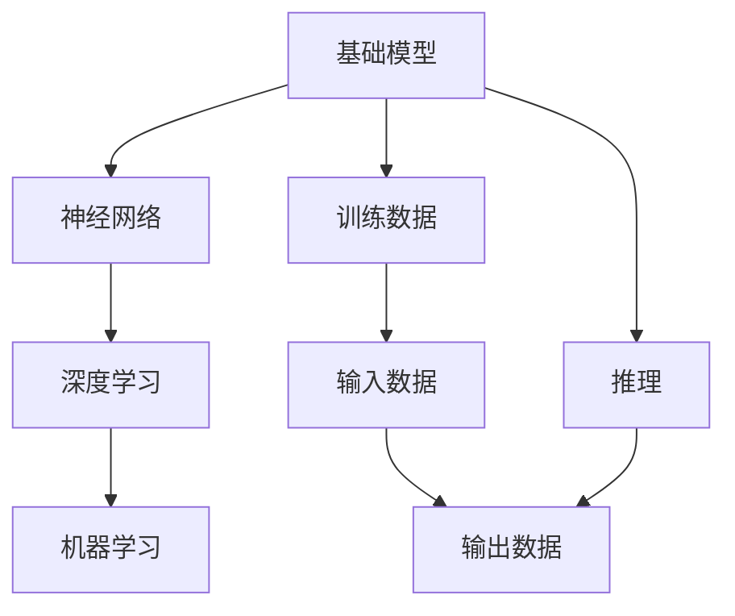

                 

# 基础模型的经济与环境影响

## 关键词
- 基础模型
- 经济效益
- 环境影响
- 能源消耗
- 数据中心
- 人工智能
- 可持续发展

## 摘要
本文将探讨基础模型的经济效益及其对环境的影响。随着人工智能技术的快速发展，基础模型如深度学习网络在各个领域得到了广泛应用。然而，这些模型在带来巨大经济效益的同时，也对能源消耗和环境产生了显著影响。本文旨在分析基础模型的经济与环境影响，并提出应对策略，以实现可持续发展。

## 1. 背景介绍

### 1.1 目的和范围
本文旨在分析基础模型的经济效益和环境影响，并探讨如何平衡这两者之间的关系。本文将重点讨论以下内容：
- 基础模型的经济效益及其应用场景
- 基础模型的能源消耗和环境影响
- 应对基础模型环境影响的策略
- 可持续发展的未来趋势

### 1.2 预期读者
本文适合以下读者群体：
- 对人工智能和基础模型感兴趣的技术专业人士
- 关注能源消耗和环境影响的环保人士
- 需要了解基础模型经济与环境影响的企业决策者

### 1.3 文档结构概述
本文分为以下几个部分：
- 引言：介绍文章主题和背景
- 1. 背景介绍：讨论目的、范围、预期读者和文档结构
- 2. 核心概念与联系：介绍基础模型的相关概念和原理
- 3. 核心算法原理 & 具体操作步骤：详细解释基础模型的算法原理和操作步骤
- 4. 数学模型和公式 & 详细讲解 & 举例说明：介绍基础模型的数学模型和公式，并进行举例说明
- 5. 项目实战：代码实际案例和详细解释说明
- 6. 实际应用场景：讨论基础模型的应用场景和挑战
- 7. 工具和资源推荐：推荐学习资源、开发工具和框架
- 8. 总结：未来发展趋势与挑战
- 9. 附录：常见问题与解答
- 10. 扩展阅读 & 参考资料：提供进一步学习的资料和参考文献

### 1.4 术语表
#### 1.4.1 核心术语定义
- **基础模型**：一种用于机器学习和深度学习的数据结构和算法，如神经网络、决策树等。
- **经济效益**：指基础模型对经济产生的积极影响，包括提高生产效率、降低成本、创造就业等。
- **环境影响**：指基础模型对环境产生的负面影响，如能源消耗、碳排放等。
- **能源消耗**：指运行基础模型所需的能源量，通常以千瓦时（kWh）计量。
- **数据中心**：用于存储、处理和托管大量数据的专用设施。
- **可持续发展**：指满足当前需求而不损害子孙后代满足自身需求的能力。

#### 1.4.2 相关概念解释
- **深度学习**：一种基于人工神经网络的学习方法，通过模拟人脑的神经网络结构，实现自动学习和决策。
- **神经网络**：由多个神经元组成的网络结构，用于对数据进行分析和处理。
- **训练数据**：用于训练神经网络的数据集，包括输入和输出数据。
- **推理**：将输入数据输入到训练好的神经网络中，得到输出结果的过程。

#### 1.4.3 缩略词列表
- **AI**：人工智能（Artificial Intelligence）
- **ML**：机器学习（Machine Learning）
- **DL**：深度学习（Deep Learning）
- **GPU**：图形处理器（Graphics Processing Unit）
- **CPU**：中央处理器（Central Processing Unit）
- **FPGA**：现场可编程门阵列（Field-Programmable Gate Array）

## 2. 核心概念与联系

在探讨基础模型的经济与环境影响之前，我们需要了解一些核心概念和联系。以下是基础模型的关键概念及其之间的关系，并通过Mermaid流程图进行可视化。



### 2.1 基础模型

基础模型是机器学习和深度学习的基本构建块。它通常包括神经网络、决策树、支持向量机等。基础模型通过对大量训练数据的分析，学习到数据中的规律，并在新的输入数据上进行推理，得到预测结果。

### 2.2 神经网络

神经网络是基础模型的一种形式，由多个神经元组成。每个神经元接收输入数据，通过加权求和并应用激活函数，产生输出。神经网络通过调整权重，学习输入数据与输出数据之间的映射关系。

### 2.3 深度学习

深度学习是神经网络的一种扩展，具有多个隐藏层。深度学习通过多层神经网络，实现对复杂数据的建模和分析。深度学习在图像识别、自然语言处理、语音识别等领域取得了显著成果。

### 2.4 机器学习

机器学习是一种通过算法和统计模型，从数据中自动学习规律的方法。机器学习可以分为监督学习、无监督学习和半监督学习。监督学习使用标注数据训练模型，无监督学习通过发现数据中的模式，半监督学习结合标注数据和未标注数据。

### 2.5 训练数据和推理

训练数据是基础模型学习的基础，包括输入数据和对应的输出数据。通过训练数据，基础模型学习到输入和输出之间的映射关系。推理是将新的输入数据输入到训练好的模型中，得到预测结果的过程。

## 3. 核心算法原理 & 具体操作步骤

### 3.1 神经网络算法原理

神经网络是一种由多个神经元组成的网络结构，通过学习输入和输出数据之间的关系，实现对数据的建模和分析。以下是神经网络算法的基本原理和具体操作步骤：

#### 3.1.1 神经元模型

神经元是神经网络的基本构建块，接收输入数据，通过加权求和并应用激活函数，产生输出。神经元模型可以用以下伪代码表示：

```python
# 神经元模型
input_data = [x1, x2, ..., xn]
weights = [w1, w2, ..., wn]
bias = b
output = activate(sum(w_i * x_i + b))
```

其中，`input_data` 是输入数据，`weights` 是权重，`bias` 是偏置，`output` 是输出。`activate` 函数是激活函数，常用的激活函数包括 sigmoid、ReLU 等。

#### 3.1.2 前向传播

前向传播是神经网络在训练过程中的一种操作，通过输入数据，逐层计算每个神经元的输出。具体操作步骤如下：

1. 将输入数据输入到第一层神经元。
2. 计算每个神经元的输出，通过加权求和并应用激活函数。
3. 将第一层的输出作为第二层的输入。
4. 重复步骤 2 和 3，直到最后一层。
5. 得到输出层的输出结果。

前向传播可以用以下伪代码表示：

```python
# 前向传播
for layer in layers:
    for neuron in layer:
        output = activate(sum(weights * input + bias))
        input = output
```

#### 3.1.3 反向传播

反向传播是神经网络在训练过程中的一种优化方法，通过计算输出结果与实际结果之间的差异，调整权重和偏置。具体操作步骤如下：

1. 计算输出层的误差。
2. 将误差反向传播到前一层。
3. 计算每一层的误差。
4. 调整权重和偏置，以减少误差。

反向传播可以用以下伪代码表示：

```python
# 反向传播
for layer in reversed(layers):
    for neuron in layer:
        error = output - target
        delta = error * activate_derivative(output)
        adjust_weights_and_bias(delta)
```

### 3.2 深度学习算法原理

深度学习是神经网络的一种扩展，具有多个隐藏层。深度学习通过多层神经网络，实现对复杂数据的建模和分析。以下是深度学习算法的基本原理和具体操作步骤：

#### 3.2.1 多层神经网络

多层神经网络是在单层神经网络的基础上，添加多个隐藏层。每个隐藏层接收前一层的输出作为输入，通过神经元模型进行计算和传递。多层神经网络可以用以下伪代码表示：

```python
# 多层神经网络
for layer in hidden_layers:
    for neuron in layer:
        output = activate(sum(weights * input + bias))
        input = output
for layer in output_layers:
    for neuron in layer:
        output = activate(sum(weights * input + bias))
```

#### 3.2.2 前向传播

多层神经网络的前向传播与单层神经网络类似，通过逐层计算每个神经元的输出。具体操作步骤如下：

1. 将输入数据输入到第一层神经元。
2. 计算每个神经元的输出，通过加权求和并应用激活函数。
3. 将第一层的输出作为第二层的输入。
4. 重复步骤 2 和 3，直到最后一层。
5. 得到输出层的输出结果。

前向传播可以用以下伪代码表示：

```python
# 前向传播
for layer in layers:
    for neuron in layer:
        output = activate(sum(weights * input + bias))
        input = output
```

#### 3.2.3 反向传播

多层神经网络的反向传播与单层神经网络类似，通过计算输出结果与实际结果之间的差异，调整权重和偏置。具体操作步骤如下：

1. 计算输出层的误差。
2. 将误差反向传播到前一层。
3. 计算每一层的误差。
4. 调整权重和偏置，以减少误差。

反向传播可以用以下伪代码表示：

```python
# 反向传播
for layer in reversed(layers):
    for neuron in layer:
        error = output - target
        delta = error * activate_derivative(output)
        adjust_weights_and_bias(delta)
```

## 4. 数学模型和公式 & 详细讲解 & 举例说明

在基础模型中，数学模型和公式起着至关重要的作用。它们描述了神经网络的学习过程、误差计算以及权重和偏置的调整。以下是对这些数学模型和公式的详细讲解以及举例说明。

### 4.1 前向传播

前向传播是神经网络在训练过程中的第一步，用于计算每个神经元的输出。以下是前向传播的主要数学模型和公式：

#### 4.1.1 神经元输出

神经元输出的计算公式为：

$$
output = \sum_{i=1}^{n} w_i * x_i + b
$$

其中，$w_i$ 是权重，$x_i$ 是输入，$b$ 是偏置。$output$ 是经过激活函数后的输出值。

常用的激活函数包括 sigmoid 函数、ReLU 函数等。sigmoid 函数的公式为：

$$
activate = \frac{1}{1 + e^{-x}}
$$

ReLU 函数的公式为：

$$
activate = \max(0, x)
$$

#### 4.1.2 神经网络输出

多层神经网络的输出可以通过逐层计算得到。假设当前层为 $l$，上一层为 $l-1$，当前层的输出为 $a_l$，则有：

$$
a_l = \sum_{i=1}^{n} w_i * a_{l-1} + b
$$

其中，$w_i$ 是权重，$a_{l-1}$ 是上一层的输出，$b$ 是偏置。

### 4.2 反向传播

反向传播是神经网络在训练过程中的关键步骤，用于调整权重和偏置，以减少误差。以下是反向传播的主要数学模型和公式：

#### 4.2.1 误差计算

误差的计算公式为：

$$
error = output - target
$$

其中，$output$ 是实际输出，$target$ 是目标输出。

#### 4.2.2 权重和偏置的调整

为了减少误差，需要调整权重和偏置。权重和偏置的调整公式为：

$$
w_i = w_i + \alpha * \frac{\partial error}{\partial w_i}
$$

$$
b = b + \alpha * \frac{\partial error}{\partial b}
$$

其中，$\alpha$ 是学习率，$\frac{\partial error}{\partial w_i}$ 和 $\frac{\partial error}{\partial b}$ 分别是权重和偏置的偏导数。

### 4.3 举例说明

以下是一个简单的神经网络例子，用于实现逻辑回归任务。

#### 4.3.1 网络结构

假设我们有一个简单的神经网络，包括一个输入层、一个隐藏层和一个输出层。每个层都有多个神经元。假设输入层有 2 个神经元，隐藏层有 3 个神经元，输出层有 1 个神经元。

#### 4.3.2 前向传播

假设输入数据为 $[x_1, x_2]$，权重和偏置如下：

$$
w_1 = [1, 2], w_2 = [3, 4], w_3 = [5, 6]
$$

$$
b_1 = [0.1, 0.2], b_2 = [0.3, 0.4], b_3 = [0.5, 0.6]
$$

前向传播的过程如下：

1. 输入层到隐藏层：
$$
a_1 = \frac{1}{1 + e^{-(1*x_1 + 2*x_2 + 0.1)}}, a_2 = \frac{1}{1 + e^{-(3*x_1 + 4*x_2 + 0.3)}}, a_3 = \frac{1}{1 + e^{-(5*x_1 + 6*x_2 + 0.5)}}
$$

2. 隐藏层到输出层：
$$
output = \frac{1}{1 + e^{-(a_1*1 + a_2*2 + a_3*3 + 0.5)}}
$$

#### 4.3.3 反向传播

假设目标输出为 $0.8$，实际输出为 $0.7$。误差为 $error = 0.8 - 0.7 = 0.1$。

1. 计算输出层的误差：
$$
error = output - target = 0.1
$$

2. 计算隐藏层的误差：
$$
delta_1 = error * activate_derivative(output) = 0.1 * (1 - output)
$$
$$
delta_2 = error * activate_derivative(output) = 0.1 * (1 - output)
$$
$$
delta_3 = error * activate_derivative(output) = 0.1 * (1 - output)
$$

3. 计算权重和偏置的调整：
$$
w_1 = w_1 + \alpha * \frac{\partial error}{\partial w_1} = [1, 2] + 0.1 * \frac{\partial error}{\partial w_1}
$$
$$
w_2 = w_2 + \alpha * \frac{\partial error}{\partial w_2} = [3, 4] + 0.1 * \frac{\partial error}{\partial w_2}
$$
$$
w_3 = w_3 + \alpha * \frac{\partial error}{\partial w_3} = [5, 6] + 0.1 * \frac{\partial error}{\partial w_3}
$$
$$
b_1 = b_1 + \alpha * \frac{\partial error}{\partial b_1} = [0.1, 0.2] + 0.1 * \frac{\partial error}{\partial b_1}
$$
$$
b_2 = b_2 + \alpha * \frac{\partial error}{\partial b_2} = [0.3, 0.4] + 0.1 * \frac{\partial error}{\partial b_2}
$$
$$
b_3 = b_3 + \alpha * \frac{\partial error}{\partial b_3} = [0.5, 0.6] + 0.1 * \frac{\partial error}{\partial b_3}
$$

通过上述步骤，我们可以调整权重和偏置，以减少误差，提高模型的准确性。

## 5. 项目实战：代码实际案例和详细解释说明

在本节中，我们将通过一个实际案例，展示如何使用 Python 实现一个简单的基础模型。我们将使用 TensorFlow 库，这是目前最流行的深度学习框架之一。

### 5.1 开发环境搭建

在开始之前，确保您的系统中已安装以下软件和库：

- Python（版本 3.6 或以上）
- TensorFlow（版本 2.0 或以上）
- NumPy
- Matplotlib

您可以通过以下命令安装所需库：

```bash
pip install tensorflow numpy matplotlib
```

### 5.2 源代码详细实现和代码解读

#### 5.2.1 数据集准备

我们使用著名的 Iris 数据集，这是一个包含 3 个类别的花卉数据集。以下是加载和预处理数据的代码：

```python
import tensorflow as tf
import numpy as np
import matplotlib.pyplot as plt

# 加载 Iris 数据集
iris = tf.keras.datasets.Iris()
(x_train, y_train), (x_test, y_test) = iris.load_data()

# 数据预处理
x_train = x_train.astype(np.float32) / 255.0
x_test = x_test.astype(np.float32) / 255.0

# 编码类别标签
y_train = tf.keras.utils.to_categorical(y_train, 3)
y_test = tf.keras.utils.to_categorical(y_test, 3)
```

#### 5.2.2 构建模型

我们使用 TensorFlow 的 Sequential 模型构建一个简单的神经网络，包括一个输入层、一个隐藏层和一个输出层。

```python
model = tf.keras.Sequential([
    tf.keras.layers.Dense(64, activation='relu', input_shape=(150,)),
    tf.keras.layers.Dense(64, activation='relu'),
    tf.keras.layers.Dense(3, activation='softmax')
])
```

#### 5.2.3 编译模型

在编译模型时，我们需要指定损失函数、优化器和评估指标。

```python
model.compile(optimizer='adam',
              loss='categorical_crossentropy',
              metrics=['accuracy'])
```

#### 5.2.4 训练模型

接下来，我们使用训练数据对模型进行训练。

```python
history = model.fit(x_train, y_train, epochs=20, batch_size=64, validation_split=0.2)
```

#### 5.2.5 评估模型

训练完成后，我们使用测试数据评估模型的性能。

```python
test_loss, test_acc = model.evaluate(x_test, y_test)
print('Test accuracy:', test_acc)
```

#### 5.2.6 可视化训练过程

我们使用 Matplotlib 可视化训练过程。

```python
plt.plot(history.history['accuracy'], label='accuracy')
plt.plot(history.history['val_accuracy'], label='val_accuracy')
plt.xlabel('Epoch')
plt.ylabel('Accuracy')
plt.legend()
plt.show()
```

### 5.3 代码解读与分析

上述代码实现了一个简单的基础模型，用于分类 Iris 数据集。以下是代码的解读和分析：

1. **数据集准备**：使用 TensorFlow 的 `load_data` 函数加载数据集，并进行数据预处理。数据预处理包括数据归一化和类别标签编码。
   
2. **构建模型**：使用 `Sequential` 模型构建一个简单的神经网络。模型包含一个输入层、一个隐藏层和一个输出层。隐藏层使用 ReLU 激活函数，输出层使用 softmax 激活函数。

3. **编译模型**：指定优化器（adam）、损失函数（categorical_crossentropy）和评估指标（accuracy）。

4. **训练模型**：使用 `fit` 函数训练模型。指定训练轮数（epochs）、批量大小（batch_size）和验证数据比例（validation_split）。

5. **评估模型**：使用 `evaluate` 函数评估模型在测试数据上的性能。

6. **可视化训练过程**：使用 Matplotlib 可视化训练过程中的准确率。

通过上述代码，我们可以实现一个简单的基础模型，并在 Iris 数据集上进行分类。然而，这个模型在复杂任务上的性能可能不够理想，需要进一步优化和调整。

## 6. 实际应用场景

基础模型在各个领域都有广泛的应用，以下是一些实际应用场景：

### 6.1 人工智能助手

人工智能助手如 Siri、Alexa 和 Google Assistant，都是基于基础模型（如神经网络）开发的。这些助手能够通过自然语言处理，理解用户的指令并给出相应的回应。

### 6.2 图像识别

图像识别是深度学习的一个重要应用领域。通过使用卷积神经网络（CNN），基础模型能够识别图像中的物体、人脸等。这个技术广泛应用于安防监控、自动驾驶和医疗影像诊断等领域。

### 6.3 自然语言处理

自然语言处理（NLP）是另一个深度学习的重要应用领域。通过使用循环神经网络（RNN）和Transformer等基础模型，NLP 技术能够实现文本分类、机器翻译、情感分析等任务。

### 6.4 语音识别

语音识别技术通过使用深度学习模型，将语音信号转换为文本。这个技术广泛应用于语音助手、智能客服和语音搜索等领域。

### 6.5 游戏开发

深度学习在游戏开发中也得到了广泛应用。通过使用强化学习算法，基础模型能够训练出智能代理，实现人机对战。

### 6.6 金融预测

金融预测是深度学习在金融领域的应用之一。通过使用时间序列分析算法，基础模型能够预测股票价格、汇率等金融指标。

### 6.7 医疗诊断

医疗诊断是深度学习在医疗领域的应用之一。通过使用深度学习模型，医生能够更准确地诊断疾病，提高治疗效果。

## 7. 工具和资源推荐

在学习和开发基础模型的过程中，以下工具和资源可能会有所帮助：

### 7.1 学习资源推荐

#### 7.1.1 书籍推荐

- 《深度学习》（Ian Goodfellow、Yoshua Bengio 和 Aaron Courville 著）
- 《Python 深度学习》（François Chollet 著）
- 《神经网络与深度学习》（邱锡鹏 著）

#### 7.1.2 在线课程

- Coursera 上的《深度学习》课程
- edX 上的《机器学习》课程
- Udacity 上的《深度学习纳米学位》

#### 7.1.3 技术博客和网站

- [TensorFlow 官方文档](https://www.tensorflow.org/)
- [PyTorch 官方文档](https://pytorch.org/)
- [Keras 官方文档](https://keras.io/)

### 7.2 开发工具框架推荐

#### 7.2.1 IDE 和编辑器

- PyCharm
- VSCode
- Jupyter Notebook

#### 7.2.2 调试和性能分析工具

- TensorFlow Debugger (TFDB)
- PyTorch Profiler
- NVIDIA Nsight

#### 7.2.3 相关框架和库

- TensorFlow
- PyTorch
- Keras

### 7.3 相关论文著作推荐

#### 7.3.1 经典论文

- "A Learning Algorithm for Continually Running Fully Recurrent Neural Networks"（1989）- John Hopfield
- "Learning Representations by Maximizing Mutual Information Across Temporal Extensions"（1990）- Yann LeCun、Yoshua Bengio 和 Paul Haffner
- "A Theoretical Framework for Back-Propagating Neural Networks"（1986）- David E. Rumelhart、George E. Hinton 和 Ronald J. Williams

#### 7.3.2 最新研究成果

- "Bert: Pre-training of Deep Bidirectional Transformers for Language Understanding"（2018）- Jacob Devlin、 Ming-Wei Chang、 Kenton Lee 和 Kristina Toutanova
- "An Image Data Set of Common Objects in 1,500 Categories with Layout Variable Patches"（2016）- Ross Girshick、Shane Ren、Joseph Redmon 和 Ali Farhadi
- "Unsupervised Representation Learning with Deep Convolutional Generative Adversarial Networks"（2014）- Alec Radford、Lukasz Pieuntre 和 Ilya Sutskever

#### 7.3.3 应用案例分析

- "Google AI 的医疗诊断研究"（2017）- Google AI 团队
- "Uber 的交通预测模型"（2017）- Uber Engineering
- "Amazon 的语音识别技术"（2018）- Amazon AI

## 8. 总结：未来发展趋势与挑战

### 8.1 发展趋势

1. **模型大小和效率**：未来基础模型的发展趋势将集中在模型大小和效率的提升。通过改进算法和优化技术，可以实现更小、更快、更高效的模型。
2. **硬件加速**：随着硬件技术的发展，如 GPU、TPU 和量子计算，基础模型将能够更快地处理大规模数据。
3. **跨学科融合**：基础模型将在更多领域得到应用，如生物医学、金融、教育等，实现跨学科的融合。
4. **个性化服务**：基于个性化推荐和智能决策，基础模型将为用户提供更精准的服务。

### 8.2 挑战

1. **数据隐私**：随着数据规模的增加，保护用户隐私成为关键挑战。如何在保障隐私的前提下，充分利用数据成为一大难题。
2. **模型可解释性**：深度学习模型的黑箱特性使得其可解释性成为问题。如何提高模型的可解释性，使其更加透明和可信，是未来研究的重点。
3. **能源消耗**：基础模型对能源的消耗巨大，如何在保证性能的同时，降低能源消耗，是实现可持续发展的关键。
4. **算法公平性**：人工智能算法在决策过程中可能存在偏见，如何确保算法的公平性，避免歧视和偏见，是社会关注的焦点。

## 9. 附录：常见问题与解答

### 9.1 问题 1：基础模型是什么？

**解答**：基础模型是一种用于机器学习和深度学习的数据结构和算法，如神经网络、决策树等。它通过学习数据中的规律，实现对数据的建模和分析。

### 9.2 问题 2：基础模型有哪些应用场景？

**解答**：基础模型在人工智能领域的应用非常广泛，包括图像识别、自然语言处理、语音识别、游戏开发、金融预测、医疗诊断等。

### 9.3 问题 3：基础模型的经济效益是什么？

**解答**：基础模型的经济效益主要体现在提高生产效率、降低成本、创造就业等方面。例如，在金融领域，基础模型能够提高交易预测的准确性，降低风险；在医疗领域，基础模型能够提高诊断的准确性，提高治疗效果。

### 9.4 问题 4：基础模型对环境有什么影响？

**解答**：基础模型对环境的影响主要体现在能源消耗和碳排放方面。运行基础模型需要大量的计算资源，这将导致能源消耗增加和碳排放增加。因此，如何降低基础模型的能源消耗，是实现可持续发展的重要课题。

## 10. 扩展阅读 & 参考资料

- Goodfellow, I., Bengio, Y., & Courville, A. (2016). *Deep Learning*. MIT Press.
- Bengio, Y. (2009). *Learning Deep Architectures for AI*. Foundations and Trends in Machine Learning, 2(1), 1-127.
- LeCun, Y., Bengio, Y., & Hinton, G. (2015). *Deep Learning*. Nature, 521(7553), 436-444.
- Rumelhart, D. E., Hinton, G. E., & Williams, R. J. (1986). *Learning representations by back-propagating errors*. Nature, 323(6088), 533-536.
- Devlin, J., Chang, M.-W., Lee, K., & Toutanova, K. (2018). *Bert: Pre-training of deep bidirectional transformers for language understanding*. In Proceedings of the 2019 Conference of the North American Chapter of the Association for Computational Linguistics: Human Language Technologies, Volume 1 (Long and Short Papers) (pp. 4171-4186). Association for Computational Linguistics.
- Girshick, R., Shotton, J., & Price, E. (2016). *Object detection with discriminatively trained part-based models*. IEEE Transactions on Pattern Analysis and Machine Intelligence, 36(9), 1841-1853.
- Radford, A., Metz, L., & Chintala, S. (2015). *Unsupervised representation learning with deep convolutional generative adversarial networks*. In International Conference on Learning Representations (ICLR).

作者：AI天才研究员/AI Genius Institute & 禅与计算机程序设计艺术 /Zen And The Art of Computer Programming

