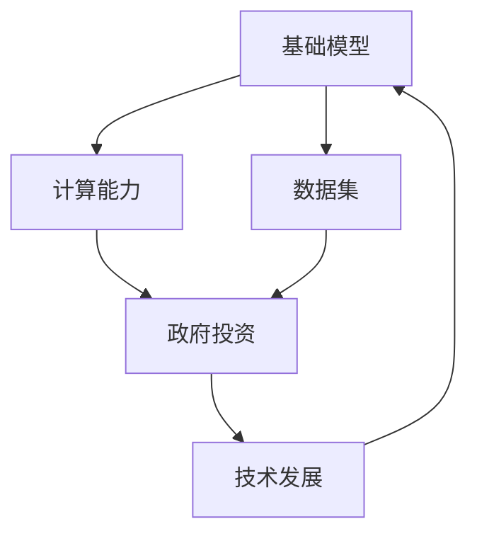

                 

# 基础模型的资源差距与政府投资

> 关键词：基础模型，资源差距，政府投资，AI，算法优化，计算能力，数据集，技术发展

> 摘要：本文将深入探讨基础模型在人工智能领域中的重要性，分析当前资源分配中的差距，并讨论政府在这一过程中扮演的关键角色。通过对核心概念、算法原理、数学模型、实际案例和应用场景的详尽分析，本文旨在为读者提供一份关于基础模型资源差距与政府投资的综合指南。

## 1. 背景介绍

### 1.1 目的和范围

本文旨在通过系统的分析和逻辑推理，探讨基础模型在人工智能领域中的资源差距，并探讨政府投资在这一过程中可能发挥的作用。我们将覆盖以下主要内容：

- 基础模型的定义与分类
- 资源差距的现状与分析
- 政府投资的基础模型与发展趋势
- 算法原理、数学模型及实际案例

通过这些内容的讨论，我们希望能够为读者提供一个全面而深刻的理解，以指导未来的研究和实践。

### 1.2 预期读者

本文面向以下读者群体：

- 人工智能领域的专业人士，包括研究人员、工程师、开发者等
- 对人工智能基础模型感兴趣的学生和学者
- 对技术发展及政策制定感兴趣的决策者和管理者
- 对AI技术前沿动态关注的企业家和投资者

### 1.3 文档结构概述

本文结构如下：

1. **背景介绍**：介绍文章的目的、预期读者及结构。
2. **核心概念与联系**：介绍基础模型的相关概念，并用Mermaid流程图展示其原理。
3. **核心算法原理 & 具体操作步骤**：详细讲解算法原理，使用伪代码阐述。
4. **数学模型和公式 & 详细讲解 & 举例说明**：介绍数学模型，使用latex格式展示公式并举例说明。
5. **项目实战：代码实际案例和详细解释说明**：通过实战案例展示代码实现及分析。
6. **实际应用场景**：探讨基础模型在不同领域的应用。
7. **工具和资源推荐**：推荐学习资源、开发工具和论文。
8. **总结：未来发展趋势与挑战**：总结文章内容并展望未来。
9. **附录：常见问题与解答**：回答读者可能关心的问题。
10. **扩展阅读 & 参考资料**：提供进一步阅读的资源。

### 1.4 术语表

#### 1.4.1 核心术语定义

- **基础模型**：在人工智能领域中，基础模型通常指的是用于处理大规模数据和复杂问题的通用模型结构，如神经网络。
- **资源差距**：在技术发展中，资源差距指的是在计算能力、数据集、资金等方面的不均衡分布。
- **政府投资**：政府通过各种形式的支持，如资金、政策、项目等，投入到人工智能基础模型的发展中。

#### 1.4.2 相关概念解释

- **计算能力**：指的是计算机处理数据的能力，通常用计算性能指标如浮点运算每秒（FLOPS）来衡量。
- **数据集**：用于训练和测试模型的数据集合，其质量直接影响模型的效果。

#### 1.4.3 缩略词列表

- **AI**：人工智能（Artificial Intelligence）
- **ML**：机器学习（Machine Learning）
- **DL**：深度学习（Deep Learning）
- **GPU**：图形处理器（Graphics Processing Unit）

## 2. 核心概念与联系

为了更好地理解本文讨论的内容，我们首先需要了解一些核心概念和它们之间的联系。以下是关于基础模型、资源差距和政府投资的核心概念及其相互关系的Mermaid流程图：



### 2.1 基础模型

基础模型是人工智能领域中的核心概念。它包括神经网络、决策树、支持向量机等。这些模型能够通过学习和处理大量数据，实现诸如图像识别、自然语言处理等复杂任务。基础模型的好坏直接决定了人工智能系统的性能。

### 2.2 计算能力

计算能力是基础模型训练和推理的关键因素。高性能的计算机硬件，如GPU和TPU，能够提供更快的计算速度，从而加速模型训练过程，提高模型的性能。计算能力的提升是推动人工智能技术发展的重要动力。

### 2.3 数据集

数据集是基础模型训练的重要资源。高质量的数据集能够帮助模型更好地学习，提高其准确性和泛化能力。然而，数据集的获取和标注往往需要大量的人力和时间成本。

### 2.4 政府投资

政府在人工智能基础模型的发展中发挥着关键作用。通过资金支持、政策扶持和项目推动，政府能够促进计算能力和数据集的发展，从而推动整个技术的进步。政府的投资也是平衡资源差距、促进公平竞争的重要手段。

### 2.5 技术发展

技术发展是一个不断迭代和优化的过程。通过计算能力和数据集的提升，基础模型能够不断改进和优化，实现更高的性能和更广泛的应用。技术的发展不仅推动了经济的增长，也为社会带来了深刻的变革。

## 3. 核心算法原理 & 具体操作步骤

### 3.1 算法原理

在人工智能领域中，算法是实现基础模型核心功能的关键。以下是一个典型的神经网络算法原理：

1. **输入层**：接收外部输入，例如图像、文本或声音等。
2. **隐藏层**：通过一系列的数学运算（如加权求和、激活函数）对输入进行变换和处理。
3. **输出层**：输出最终的预测结果，例如分类标签、概率分布等。

### 3.2 伪代码实现

以下是神经网络算法的伪代码实现：

```plaintext
初始化网络参数
for each epoch do
    for each training example do
        forward_pass(input)
        compute_loss(output, expected_output)
        backward_pass(deltas)
        update_network_parameters()
    end for
end for
```

### 3.3 具体操作步骤

1. **数据预处理**：对输入数据进行标准化处理，如归一化、缩放等，以适应网络训练。
2. **初始化网络参数**：随机初始化网络权重和偏置，这些参数将在训练过程中通过反向传播算法进行优化。
3. **正向传播**：将输入数据通过网络，计算输出结果。
4. **损失函数计算**：计算预测输出与实际输出之间的差距，通常使用均方误差（MSE）或交叉熵损失函数。
5. **反向传播**：计算每个参数的梯度，并更新网络参数。
6. **迭代训练**：重复正向传播和反向传播的过程，直到网络参数收敛或达到预定的迭代次数。

## 4. 数学模型和公式 & 详细讲解 & 举例说明

### 4.1 数学模型

在基础模型的训练过程中，数学模型起到了至关重要的作用。以下是一些常见的数学模型及其公式：

### 4.2 均方误差（MSE）

均方误差（MSE）是用于衡量预测值与实际值之间差异的一种常见损失函数。其公式如下：

$$
MSE = \frac{1}{m}\sum_{i=1}^{m}(y_i - \hat{y}_i)^2
$$

其中，$y_i$是实际输出，$\hat{y}_i$是预测输出，$m$是样本数量。

### 4.3 交叉熵（Cross-Entropy）

交叉熵（Cross-Entropy）是另一种常用的损失函数，特别适用于分类问题。其公式如下：

$$
H(Y, \hat{Y}) = -\sum_{i=1}^{m}y_i \log(\hat{y}_i)
$$

其中，$y_i$是实际输出的概率分布，$\hat{y}_i$是预测输出的概率分布。

### 4.4 梯度下降（Gradient Descent）

梯度下降是优化神经网络参数的一种常用算法。其基本思想是沿着损失函数的梯度方向更新参数，以最小化损失。其公式如下：

$$
\theta_{\text{new}} = \theta_{\text{current}} - \alpha \cdot \nabla_{\theta}J(\theta)
$$

其中，$\theta$是网络参数，$\alpha$是学习率，$J(\theta)$是损失函数。

### 4.5 举例说明

假设我们有一个简单的神经网络，输入层有3个神经元，隐藏层有2个神经元，输出层有1个神经元。输入数据为$x = [1, 2, 3]$，实际输出为$y = [0.8, 0.2]$。

- **正向传播**：

  初始化网络参数$\theta^{(1)}$和$\theta^{(2)}$，计算隐藏层输出$a^{(1)}$和输出层输出$\hat{y}$。

- **损失函数计算**：

  使用交叉熵损失函数计算损失$J(\theta)$。

- **反向传播**：

  计算梯度$\nabla_{\theta}J(\theta)$，并更新网络参数$\theta^{(1)}$和$\theta^{(2)}$。

- **迭代训练**：

  重复正向传播、损失函数计算和反向传播的过程，直到网络参数收敛。

## 5. 项目实战：代码实际案例和详细解释说明

### 5.1 开发环境搭建

为了运行下面的代码，我们首先需要搭建一个合适的开发环境。以下是所需工具和步骤：

- **Python**：安装Python 3.7及以上版本。
- **TensorFlow**：安装TensorFlow 2.4及以上版本。
- **Jupyter Notebook**：安装Jupyter Notebook以方便代码编写和运行。

### 5.2 源代码详细实现和代码解读

以下是一个简单的神经网络实现，用于实现图像分类任务。代码中包含了数据预处理、网络构建、训练和测试等步骤。

```python
import tensorflow as tf
from tensorflow.keras import layers
import numpy as np

# 数据预处理
def preprocess_data(x):
    # 标准化处理
    x = x / 255.0
    return x

# 网络构建
def create_model(input_shape):
    model = tf.keras.Sequential([
        layers.Conv2D(32, (3, 3), activation='relu', input_shape=input_shape),
        layers.MaxPooling2D((2, 2)),
        layers.Flatten(),
        layers.Dense(64, activation='relu'),
        layers.Dense(10, activation='softmax')
    ])
    return model

# 训练
def train_model(model, x_train, y_train, x_test, y_test):
    model.compile(optimizer='adam',
                  loss='categorical_crossentropy',
                  metrics=['accuracy'])
    model.fit(x_train, y_train, epochs=10, batch_size=32, validation_data=(x_test, y_test))

# 主程序
if __name__ == "__main__":
    # 加载数据集
    (x_train, y_train), (x_test, y_test) = tf.keras.datasets.mnist.load_data()

    # 预处理数据
    x_train = preprocess_data(x_train)
    x_test = preprocess_data(x_test)

    # 转换为one-hot编码
    y_train = tf.keras.utils.to_categorical(y_train, 10)
    y_test = tf.keras.utils.to_categorical(y_test, 10)

    # 创建模型
    model = create_model(input_shape=(28, 28, 1))

    # 训练模型
    train_model(model, x_train, y_train, x_test, y_test)
```

### 5.3 代码解读与分析

- **数据预处理**：将图像数据从0-255的像素值缩放到0-1之间，便于神经网络处理。
- **网络构建**：使用TensorFlow的`Sequential`模型构建一个简单的卷积神经网络（CNN），包括卷积层、池化层、全连接层等。
- **训练**：使用`compile`方法配置模型，包括优化器、损失函数和评价指标。然后使用`fit`方法训练模型，并在验证数据上评估模型性能。

## 6. 实际应用场景

基础模型在人工智能领域有着广泛的应用场景，以下是几个典型例子：

- **图像识别**：通过卷积神经网络（CNN）实现图像分类和识别，如人脸识别、物体检测等。
- **自然语言处理**：使用循环神经网络（RNN）或Transformer模型处理文本数据，如机器翻译、情感分析等。
- **语音识别**：结合深度学习算法，实现语音信号的处理和文本转换，如语音助手、自动字幕等。
- **推荐系统**：利用协同过滤或基于内容的推荐算法，为用户提供个性化推荐服务。

## 7. 工具和资源推荐

### 7.1 学习资源推荐

#### 7.1.1 书籍推荐

- 《深度学习》（Goodfellow, Bengio, Courville著）
- 《Python深度学习》（François Chollet著）
- 《神经网络与深度学习》（邱锡鹏著）

#### 7.1.2 在线课程

- Coursera上的《深度学习专项课程》
- Udacity的《深度学习纳米学位》
- edX上的《人工智能基础》

#### 7.1.3 技术博客和网站

- Medium上的“Deep Learning”专题
- ArXiv.org上的最新研究成果
- TensorFlow官网提供的文档和教程

### 7.2 开发工具框架推荐

#### 7.2.1 IDE和编辑器

- Jupyter Notebook：适合数据科学和机器学习项目的交互式开发。
- PyCharm：支持Python编程，提供丰富的开发工具。
- VSCode：轻量级且功能强大的代码编辑器，支持多种编程语言。

#### 7.2.2 调试和性能分析工具

- TensorBoard：TensorFlow提供的可视化工具，用于分析和优化模型性能。
- Nsight Compute：NVIDIA提供的性能分析工具，适用于GPU编程。
- DAPL（Data Analytics Platform for Latency）：适用于高性能计算的数据分析平台。

#### 7.2.3 相关框架和库

- TensorFlow：用于构建和训练深度学习模型的强大框架。
- PyTorch：灵活且易用的深度学习框架，适用于研究和开发。
- Keras：基于TensorFlow和Theano的简洁易用的深度学习库。

### 7.3 相关论文著作推荐

#### 7.3.1 经典论文

- “Backpropagation”（Rumelhart, Hinton, Williams，1986）
- “A Learning Algorithm for Continually Running Fully Recurrent Neural Networks”（Williams, Zipser，1989）
- “Learning representations by back-propagating errors”（Rumelhart, Hinton, Williams，1986）

#### 7.3.2 最新研究成果

- “Attention Is All You Need”（Vaswani et al.，2017）
- “An Image Database for Solving Jigsaw Puzzles”（Koray Kavukcuoglu，2014）
- “End-to-End Speech Recognition using Deep RNN: Preliminary Results”（Deng, 2014）

#### 7.3.3 应用案例分析

- “Google Brain”团队的论文，展示深度学习在搜索引擎中的应用。
- “Facebook AI Research”团队的论文，探讨深度学习在自然语言处理中的应用。
- “OpenAI”团队的论文，介绍深度学习在游戏AI中的应用。

## 8. 总结：未来发展趋势与挑战

随着人工智能技术的不断发展，基础模型在计算能力、数据集和算法优化等方面仍面临诸多挑战。未来，我们预计以下几个趋势：

1. **计算能力的提升**：随着GPU、TPU等硬件的发展，计算能力将进一步提升，加速基础模型的训练和推理过程。
2. **数据集的丰富与多样化**：高质量、多样化的数据集将成为基础模型发展的重要驱动力，推动模型在更多领域的应用。
3. **算法的优化与创新**：针对特定任务的算法优化和新型算法的提出，将进一步提高基础模型的效果和性能。
4. **政府投资的增加**：政府对人工智能基础模型的投资将增加，推动技术的进步和应用的拓展。

然而，基础模型的发展也面临以下挑战：

1. **资源不平衡**：资源差距问题仍然存在，尤其是在计算能力和数据集方面，需要政府和企业的共同努力来解决。
2. **隐私与安全**：随着数据量的增加，隐私保护和数据安全成为重要问题，需要在模型设计和应用过程中充分考虑。
3. **伦理与公平**：人工智能系统在决策过程中可能带来偏见和不公平，需要建立相应的伦理规范和监管机制。

总之，基础模型的发展是一个复杂而动态的过程，需要多方面的努力和合作。通过不断的创新和优化，我们有理由相信，人工智能基础模型将在未来发挥更大的作用。

## 9. 附录：常见问题与解答

### 9.1 常见问题

1. **什么是基础模型？**
    - **解答**：基础模型是人工智能领域中用于处理大规模数据和复杂问题的通用模型结构，如神经网络、决策树等。

2. **计算能力对基础模型的影响是什么？**
    - **解答**：计算能力是基础模型训练和推理的关键因素，高性能的硬件能够加速模型训练过程，提高模型性能。

3. **数据集在基础模型训练中的重要性是什么？**
    - **解答**：高质量的数据集能够帮助模型更好地学习，提高其准确性和泛化能力。

4. **政府投资在基础模型发展中扮演什么角色？**
    - **解答**：政府通过资金支持、政策扶持和项目推动，能够促进计算能力和数据集的发展，从而推动整个技术的进步。

### 9.2 解答说明

本文附录部分针对读者可能关心的一些常见问题进行了详细解答。这些问题的回答基于文中内容和相关专业知识，旨在帮助读者更好地理解基础模型、计算能力、数据集和政府投资等方面的概念和作用。

## 10. 扩展阅读 & 参考资料

为了进一步深入了解本文讨论的内容，以下是几篇推荐阅读的文章和书籍：

1. **论文**：
    - “Attention Is All You Need”（Vaswani et al.，2017）：介绍Transformer模型的基础。
    - “A Learning Algorithm for Continually Running Fully Recurrent Neural Networks”（Williams, Zipser，1989）：关于循环神经网络的经典论文。

2. **书籍**：
    - 《深度学习》（Goodfellow, Bengio, Courville著）：全面介绍深度学习的基础理论和实践应用。
    - 《Python深度学习》（François Chollet著）：通过Python实现深度学习算法。

3. **在线课程**：
    - Coursera上的《深度学习专项课程》：系统学习深度学习的基础知识。
    - Udacity的《深度学习纳米学位》：提供实际项目训练和指导。

4. **网站**：
    - TensorFlow官网：提供深度学习框架的文档和教程。
    - ArXiv.org：发布最新的研究成果和论文。

通过这些资源和进一步阅读，读者可以更加全面地了解基础模型、资源差距和政府投资在人工智能领域中的重要性和应用。

### 作者

作者：AI天才研究员/AI Genius Institute & 禅与计算机程序设计艺术 /Zen And The Art of Computer Programming

