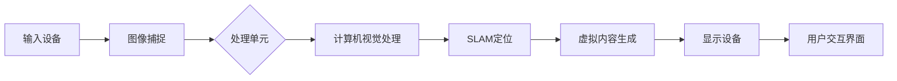

                 

# 增强现实技术：AI的应用

## 摘要

增强现实（AR）技术正在迅速成为现代计算和交互领域的关键组成部分。结合了虚拟内容与真实世界的无缝集成，AR技术为用户提供了丰富的沉浸式体验。本文将深入探讨AR技术的核心概念、发展历程、与人工智能（AI）的深度融合，以及未来可能面临的技术挑战。通过详细的案例分析和算法讲解，读者将更好地理解如何利用AI实现AR技术的创新应用，开启未来智能交互的新篇章。

## 1. 背景介绍

### 1.1 目的和范围

本文旨在探讨增强现实（AR）技术与人工智能（AI）相结合的深入应用，重点分析其在技术原理、算法实现和实际项目中的应用。文章将首先介绍AR技术的基本概念和历史发展，接着详细讨论AR与AI的结合点，展示具体的应用案例。文章还将在最后部分讨论AR技术未来发展的挑战和趋势。

### 1.2 预期读者

本文适用于对增强现实和人工智能技术有一定了解的技术爱好者、开发者、研究人员以及学术研究者。对于希望深入了解AR与AI融合应用的开发者，本文将提供全面的技术解析和实用指南。

### 1.3 文档结构概述

本文结构如下：

1. **背景介绍**：介绍文章的目的、预期读者、文档结构和主要术语定义。
2. **核心概念与联系**：解释AR技术的基本原理及其与AI的联系。
3. **核心算法原理与具体操作步骤**：详细介绍实现AR技术的核心算法和步骤。
4. **数学模型与公式**：讲解AR技术中使用的数学模型和公式，并进行实例说明。
5. **项目实战**：通过实际代码案例展示AR技术的应用。
6. **实际应用场景**：分析AR技术在不同领域的应用实例。
7. **工具和资源推荐**：推荐学习资源和开发工具。
8. **总结与未来趋势**：总结AR技术的发展趋势和面临的挑战。
9. **常见问题与解答**：提供常见问题的解答。
10. **扩展阅读与参考资料**：提供进一步学习的资源。

### 1.4 术语表

#### 1.4.1 核心术语定义

- **增强现实（AR）**：一种实时计算和叠加虚拟信息到真实世界场景的技术。
- **人工智能（AI）**：模拟人类智能行为的计算机系统。
- **机器学习（ML）**：AI的一个分支，通过数据和统计方法训练模型进行预测和决策。
- **计算机视觉**：使计算机能够解释和解读数字图像的各种技术和方法。
- **深度学习**：一种基于神经网络的学习方法，用于解决复杂的计算机视觉任务。

#### 1.4.2 相关概念解释

- **SLAM（同步定位与地图构建）**：一种在未知环境中同时进行位置定位和构建地图的技术。
- **标记识别**：使用AI技术识别图像中的特定标记或对象。
- **追踪**：在AR场景中，追踪设备或用户的位置和运动，以实时更新虚拟内容。

#### 1.4.3 缩略词列表

- **AR**：增强现实（Augmented Reality）
- **AI**：人工智能（Artificial Intelligence）
- **ML**：机器学习（Machine Learning）
- **SLAM**：同步定位与地图构建（Simultaneous Localization and Mapping）
- **VR**：虚拟现实（Virtual Reality）
- **CAD**：计算机辅助设计（Computer-Aided Design）

## 2. 核心概念与联系

### 2.1 增强现实（AR）技术原理

增强现实（AR）技术通过在用户的视野中叠加计算机生成的虚拟图像或信息，使用户能够在真实环境中与虚拟内容进行互动。其核心原理包括：

1. **图像识别与追踪**：利用计算机视觉技术识别现实世界中的物体，并通过追踪技术保持虚拟内容与真实物体的相对位置关系。
2. **SLAM技术**：通过同步定位与地图构建技术，实时构建用户所在环境的3D地图，并在其中定位虚拟内容。

### 2.2 人工智能（AI）与AR的融合

人工智能技术，特别是机器学习和计算机视觉，在AR技术中扮演了至关重要的角色：

- **深度学习模型**：用于图像识别、对象分类和场景理解，提高了AR系统的准确性和智能化程度。
- **实时处理能力**：AI算法能够对实时捕获的图像或视频进行处理，实现快速而准确的增强现实效果。
- **自适应与交互**：通过AI技术，AR系统可以根据用户的动作和行为进行自适应调整，提供更加自然的交互体验。

### 2.3 增强现实架构

增强现实的系统架构通常包括以下几个关键组件：

1. **输入设备**：如摄像头、传感器等，用于捕捉现实世界的图像和动作。
2. **处理单元**：包括计算机视觉算法、SLAM算法等，用于处理输入数据并生成虚拟内容。
3. **显示设备**：如AR眼镜、头戴显示器等，用于向用户展示叠加的虚拟信息。
4. **用户交互界面**：提供用户与虚拟内容交互的接口。

### 2.4 Mermaid 流程图

下面是一个简化的AR系统架构的Mermaid流程图：



## 3. 核心算法原理 & 具体操作步骤

### 3.1 图像识别算法原理

图像识别是AR技术中至关重要的一环，它使得系统能够识别现实世界中的物体和场景。常用的图像识别算法包括：

- **基于特征的识别**：通过提取图像的特征点（如SIFT、SURF）进行匹配和识别。
- **基于深度学习的识别**：使用卷积神经网络（CNN）进行图像分类和识别，具有更高的准确性和鲁棒性。

#### 3.1.1 基于特征的识别算法

以下是一个基于特征的图像识别算法的伪代码：

```pseudo
function feature_matching(image1, image2):
    keypoints1 = detect_keypoints(image1)
    keypoints2 = detect_keypoints(image2)
    descriptor1 = compute_descriptors(keypoints1, image1)
    descriptor2 = compute_descriptors(keypoints2, image2)
    matches = find_matches(descriptor1, descriptor2)
    return matches
```

#### 3.1.2 基于深度学习的识别算法

以下是一个基于深度学习的图像识别算法的伪代码：

```pseudo
class CNNImageRecognizer:
    def __init__(self, model_path):
        self.model = load_model(model_path)

    def predict(self, image):
        processed_image = preprocess_image(image)
        prediction = self.model.predict(processed_image)
        return decode_prediction(prediction)
```

### 3.2 SLAM 定位算法原理

同步定位与地图构建（SLAM）是AR系统实现高精度定位的关键技术。SLAM算法通过连续地捕获图像和传感器数据，同时估计系统的位置和构建环境地图。

#### 3.2.1 SLAM 算法步骤

以下是一个简化的SLAM算法步骤：

1. **图像预处理**：对捕获的图像进行预处理，如去除噪声、校正畸变。
2. **特征点检测与匹配**：检测图像中的特征点，并通过匹配算法找到特征点之间的对应关系。
3. **姿态估计**：利用匹配结果计算系统的运动姿态。
4. **地图构建**：根据连续的姿态估计构建环境地图。
5. **闭环检测与优化**：检测闭环路径并使用优化算法修正位置和地图。

#### 3.2.2 SLAM 算法伪代码

```pseudo
function SLAM(image_sequence, sensor_data):
    initialize_state()
    for image in image_sequence:
        keypoints = detect_keypoints(image)
        matches = feature_matching(keypoints, previous_keypoints)
        pose = estimate_pose(matches, sensor_data)
        update_state(pose)
        map = build_map(state)
        detect_loops(map)
        optimize_map(map)
    return state, map
```

### 3.3 AR 显示与交互算法

AR系统通过将虚拟内容叠加到真实世界图像上来实现增强效果。以下是一个简化的显示与交互算法：

1. **图像配准**：将虚拟内容与真实世界的图像进行配准，确保虚拟内容的位置和大小正确。
2. **渲染**：根据配准结果渲染虚拟内容。
3. **显示**：将渲染后的图像显示在用户面前。
4. **交互**：提供用户与虚拟内容交互的接口，如触摸、手势等。

#### 3.3.1 显示与交互算法伪代码

```pseudo
function AR_display(image, virtual_content, pose):
    registered_content = register_content(virtual_content, image, pose)
    rendered_image = render_content(registered_content)
    return rendered_image

function AR_interaction(rendered_image, user_input):
    interaction = detect_interaction(rendered_image, user_input)
    return interaction
```

## 4. 数学模型和公式 & 详细讲解 & 举例说明

### 4.1 增强现实中的几何变换

在AR系统中，几何变换是确保虚拟内容与真实世界正确配准的关键。以下是一些常用的几何变换公式：

#### 4.1.1 平移变换

平移变换公式为：

$$
T_{\text{translate}} = \begin{bmatrix}
1 & 0 & t_x \\
0 & 1 & t_y \\
0 & 0 & 1
\end{bmatrix}
$$

其中，\(t_x\) 和 \(t_y\) 分别表示沿x轴和y轴的平移量。

#### 4.1.2 旋转变换

旋转变换公式为：

$$
R_{\theta} = \begin{bmatrix}
\cos(\theta) & -\sin(\theta) \\
\sin(\theta) & \cos(\theta)
\end{bmatrix}
$$

其中，\(\theta\) 表示旋转角度。

#### 4.1.3 透视变换

透视变换公式为：

$$
T_{\text{perspective}} = \begin{bmatrix}
1 & 0 & 0 \\
0 & 1 & 0 \\
0 & 0 & 1/f
\end{bmatrix}
$$

其中，\(f\) 表示焦距。

### 4.2 视差校正

视差校正是一种用于减少图像间视差的算法，以提高AR系统的稳定性。以下是一个简单的视差校正模型：

$$
P_{\text{correction}} = T_{\text{translate}} \cdot R_{\theta} \cdot T_{\text{perspective}}
$$

其中，\(T_{\text{translate}}\)、\(R_{\theta}\) 和 \(T_{\text{perspective}}\) 分别表示平移、旋转和透视变换。

#### 4.2.1 实例说明

假设我们需要将一个虚拟图像（坐标原点位于（0,0））叠加到一个已经捕获的现实世界图像上，我们可以使用上述变换来确保虚拟图像的正确位置和大小。

1. **计算透视变换**：根据摄像头的焦距计算透视变换矩阵。
2. **计算旋转和平移**：根据目标位置和方向计算旋转角度和平移量。
3. **应用变换**：将虚拟图像坐标乘以透视变换矩阵，然后乘以旋转和平移矩阵，得到最终的叠加位置。

```latex
\text{透视变换矩阵} = T_{\text{perspective}}(f)
\text{旋转矩阵} = R_{\theta}
\text{平移矩阵} = T_{\text{translate}}(t_x, t_y)
\text{最终变换} = P_{\text{correction}} = T_{\text{translate}} \cdot R_{\theta} \cdot T_{\text{perspective}}
```

通过以上变换，虚拟图像将被准确地叠加到现实世界图像上。

## 5. 项目实战：代码实际案例和详细解释说明

### 5.1 开发环境搭建

为了实现一个简单的AR项目，我们需要以下开发环境：

- **操作系统**：Windows、Linux 或 macOS
- **编程语言**：Python
- **依赖库**：OpenCV、Pillow、numpy、matplotlib

#### 5.1.1 安装Python和依赖库

1. **安装Python**：从Python官方网站（https://www.python.org/downloads/）下载并安装Python。
2. **安装依赖库**：使用pip工具安装所需依赖库：

   ```bash
   pip install opencv-python pillow numpy matplotlib
   ```

### 5.2 源代码详细实现和代码解读

以下是一个简单的AR项目示例，该示例将使用OpenCV和Pillow库在现实世界图像上叠加一个虚拟图像。

```python
import cv2
import numpy as np
from PIL import Image, ImageDraw

# 5.2.1 读取真实世界图像
image = cv2.imread('real_world_image.jpg')

# 5.2.2 读取虚拟图像
virtual_image = Image.open('virtual_image.png')

# 5.2.3 获取虚拟图像的尺寸
virtual_width, virtual_height = virtual_image.size

# 5.2.4 定义透视变换矩阵
# 这里使用一个简单的透视变换，将虚拟图像从左上角移动到图像的中心
matrix = np.float32([
    [1, 0, virtual_width / 2],
    [0, 1, virtual_height / 2]
])

# 5.2.5 应用透视变换
warped_image = cv2.warpPerspective(virtual_image, matrix, (image.shape[1], image.shape[0]))

# 5.2.6 合并图像
output = cv2.add(image, warped_image)

# 5.2.7 显示结果
cv2.imshow('Augmented Reality', output)
cv2.waitKey(0)
cv2.destroyAllWindows()
```

#### 5.2.1 代码解读

- **读取图像**：使用`cv2.imread()`和`Image.open()`函数读取真实世界图像和虚拟图像。
- **获取虚拟图像尺寸**：使用`size`属性获取虚拟图像的宽度和高度。
- **定义透视变换矩阵**：使用`np.float32()`创建一个透视变换矩阵，该矩阵将虚拟图像从左上角移动到图像的中心。
- **应用透视变换**：使用`cv2.warpPerspective()`函数对虚拟图像进行透视变换。
- **合并图像**：使用`cv2.add()`函数将虚拟图像叠加到真实世界图像上。
- **显示结果**：使用`cv2.imshow()`函数显示叠加后的图像。

### 5.3 代码解读与分析

这个简单的AR项目主要使用了OpenCV和Pillow库中的函数来实现。以下是关键步骤的详细解释：

1. **读取图像**：`cv2.imread()`函数用于读取真实世界图像，而`Image.open()`函数用于读取虚拟图像。这两个函数返回图像的numpy数组。
2. **获取虚拟图像尺寸**：使用`size`属性获取虚拟图像的宽度和高度，这对于后续的透视变换非常重要。
3. **定义透视变换矩阵**：透视变换矩阵定义了虚拟图像的变换方式。在这个例子中，我们使用一个简单的矩阵将虚拟图像从左上角移动到图像的中心。透视变换矩阵的创建需要使用`np.float32()`函数，它确保矩阵的元素类型是浮点数。
4. **应用透视变换**：`cv2.warpPerspective()`函数用于对虚拟图像进行透视变换。这个函数接受透视变换矩阵和输出图像的大小作为输入，并返回透视变换后的图像。
5. **合并图像**：`cv2.add()`函数将虚拟图像叠加到真实世界图像上。这个函数接受两个图像作为输入，并返回叠加后的图像。
6. **显示结果**：`cv2.imshow()`函数用于显示叠加后的图像。`cv2.waitKey(0)`用于等待按键事件，`cv2.destroyAllWindows()`用于关闭所有OpenCV窗口。

通过以上步骤，我们可以实现一个简单的AR效果，将虚拟图像叠加到真实世界图像上。这个示例虽然简单，但展示了AR技术的基本原理和实现方法。

## 6. 实际应用场景

增强现实（AR）技术在多个领域取得了显著的应用成果，以下是AR技术在几个关键领域的实际应用场景：

### 6.1 教育

在教学中，AR技术提供了丰富的交互式学习体验。例如，学生可以通过AR应用在书本上看到三维的化学分子结构，从而更直观地理解复杂的概念。AR教材不仅增加了学习趣味，还提高了学生的学习效果。

### 6.2 娱乐与游戏

AR技术为游戏和娱乐体验带来了革命性的变化。通过AR应用，玩家可以在现实世界中与虚拟角色互动，如玩角色扮演游戏或参与城市探险。这种沉浸式体验极大地提升了玩家的参与感和乐趣。

### 6.3 零售

在零售领域，AR技术被广泛应用于虚拟试穿、产品可视化等应用。消费者可以通过手机或AR眼镜尝试不同的商品，如服装、化妆品等，从而提高购物体验和购买意愿。

### 6.4 医疗

在医疗领域，AR技术被用于手术导航、患者教育等。通过将虚拟图像叠加到患者身上，医生可以更精确地进行手术操作，提高手术成功率。此外，AR技术还可以帮助患者更好地理解自己的健康状况和治疗方案。

### 6.5 制造与维修

AR技术可以帮助工程师在制造和维护过程中实时查看设备的状态和操作指南。通过AR眼镜，工程师可以直接在设备上看到维修步骤和注意事项，从而提高工作效率和准确性。

### 6.6 建筑设计

在建筑设计领域，AR技术可以用于模拟建筑物的外观和内部布局，帮助设计师和客户更好地了解设计效果。通过AR眼镜，用户可以在真实环境中查看建筑模型，进行实时反馈和调整。

### 6.7 航空航天

在航空航天领域，AR技术被用于飞行员培训和飞机维护。通过AR应用，飞行员可以在飞行过程中接收实时飞行数据和导航信息，提高飞行安全。在飞机维护过程中，AR技术可以帮助技术人员更快速地识别和解决问题。

### 6.8 安防

AR技术也被广泛应用于安防领域，如智能监控和无人机巡逻。通过AR技术，监控人员可以在实时视频流中叠加分析结果，提高安防效率和准确性。

通过以上应用场景，我们可以看到AR技术在不同领域的重要性和潜力。随着技术的不断进步，AR的应用范围将更加广泛，为社会带来更多便利和变革。

## 7. 工具和资源推荐

### 7.1 学习资源推荐

#### 7.1.1 书籍推荐

- **《增强现实技术：从基础到高级》**：这本书系统地介绍了AR技术的各个方面，包括核心原理、应用实例和开发技巧。
- **《人工智能：一种现代方法》**：这本书详细介绍了人工智能的基本概念、算法和应用，适合希望深入了解AI技术的读者。
- **《计算机视觉：算法与应用》**：这本书涵盖了计算机视觉的核心算法和应用，是计算机视觉领域的重要参考书籍。

#### 7.1.2 在线课程

- **Coursera上的《增强现实与虚拟现实》**：这门课程由加州大学伯克利分校提供，涵盖了AR和VR技术的理论基础和应用。
- **Udacity上的《人工智能基础》**：这门课程介绍了人工智能的基本概念和算法，适合初学者入门。
- **edX上的《计算机视觉》**：这门课程由麻省理工学院提供，深入探讨了计算机视觉的理论和实践。

#### 7.1.3 技术博客和网站

- **AR VR Asia**：这是一个专注于增强现实和虚拟现实技术新闻和资源的网站，提供了丰富的行业动态和技术文章。
- **Medium上的ARVR Blog**：这是一个由AR和VR专业人士撰写的博客，内容涵盖了最新的技术趋势和应用案例。
- **AR Post**：这是一个专门介绍增强现实技术和应用案例的博客，适合对AR技术感兴趣的读者。

### 7.2 开发工具框架推荐

#### 7.2.1 IDE和编辑器

- **PyCharm**：这是一个强大的Python IDE，适合进行AR和AI项目的开发。
- **Visual Studio Code**：这是一个轻量级的跨平台代码编辑器，支持多种编程语言，适合快速开发和调试。

#### 7.2.2 调试和性能分析工具

- **Jupyter Notebook**：这是一个交互式的Python开发环境，适合进行数据分析和实验。
- **MATLAB**：这是一个专业的数学和工程计算软件，提供了丰富的工具和函数库。

#### 7.2.3 相关框架和库

- **OpenCV**：这是一个开源的计算机视觉库，提供了丰富的图像处理和计算机视觉算法。
- **TensorFlow**：这是一个开源的机器学习库，广泛用于深度学习和人工智能应用。
- **PyTorch**：这是一个开源的机器学习库，以其灵活性和高效性受到开发者的青睐。

### 7.3 相关论文著作推荐

#### 7.3.1 经典论文

- **“A Real-Time System for Interactive 3D Visualization of Volume Data”**：这篇文章介绍了Voxels技术，为AR和VR应用提供了有效的数据可视化方法。
- **“Object Recognition as Machine Learning”**：这篇文章探讨了机器学习在计算机视觉中的应用，为AR系统的图像识别提供了理论基础。

#### 7.3.2 最新研究成果

- **“Deep Learning for 3D Object Detection in Real-Time”**：这篇论文介绍了用于实时3D物体检测的深度学习方法，为AR系统提供了高效的物体识别能力。
- **“SLAM for Mobile Robots: A Survey”**：这篇文章综述了移动机器人中的SLAM技术，为AR系统的位置定位提供了最新研究进展。

#### 7.3.3 应用案例分析

- **“AR in Education: Enhancing Learning Experiences”**：这篇文章分析了AR技术在教育领域的应用案例，探讨了AR技术如何提高学习效果。
- **“Enhancing Manufacturing with Augmented Reality”**：这篇文章介绍了AR技术在制造和维护领域的应用案例，展示了AR技术如何提高工作效率和质量。

通过以上学习和资源推荐，读者可以深入了解增强现实（AR）技术和人工智能（AI）的融合应用，掌握最新的技术趋势和开发工具。

## 8. 总结：未来发展趋势与挑战

增强现实（AR）技术结合了虚拟现实（VR）和计算机视觉（CV）的先进理念，正在迅速演变成为下一代人机交互的关键技术。随着人工智能（AI）的不断发展，AR技术不仅在娱乐和游戏领域取得了显著成果，还在医疗、教育、零售等多个行业展现出广阔的应用前景。然而，AR技术要实现更广泛和更深入的应用，仍然面临诸多挑战。

### 未来发展趋势

1. **技术成熟度提升**：随着硬件性能的不断提升和算法的优化，AR技术将变得更加稳定和高效。特别是在图像识别、SLAM定位和实时渲染方面，AI技术的进步将大幅提升AR系统的性能。

2. **沉浸式体验优化**：未来AR设备将提供更加真实的沉浸式体验，包括更高的分辨率、更低的延迟和更好的光学性能。这将使得AR应用在日常生活中的使用更加普遍。

3. **跨平台整合**：随着移动设备和智能眼镜的普及，AR技术将更加集成到各种平台和应用中，从智能手机到头戴显示器，为用户提供一致性和无缝的体验。

4. **个性化与智能化**：基于AI的个性化推荐和自适应调整将成为AR技术的核心优势，用户将能够根据个人偏好和环境自动调整AR内容。

### 挑战

1. **硬件成本与便携性**：尽管硬件性能不断提升，但高性能AR设备的成本依然较高，限制了其大规模普及。此外，设备重量和体积也需要进一步优化，以提供更舒适的佩戴体验。

2. **用户体验与交互**：AR技术的用户体验和交互设计仍然面临挑战。如何提高交互的自然性和便捷性，减少学习成本，是开发者需要重点考虑的问题。

3. **隐私与安全性**：随着AR技术的普及，用户隐私和数据安全的问题日益突出。如何在保障用户隐私的前提下，充分利用AR技术的潜力，是一个重要的伦理和技术挑战。

4. **算法与数据**：AR技术的核心依赖于先进的算法和大量高质量的数据。然而，如何获取和标注这些数据，如何处理数据隐私和版权问题，都是亟需解决的问题。

总之，增强现实技术结合人工智能的未来前景广阔，但也面临诸多挑战。通过不断的技术创新和跨领域合作，我们可以期待AR技术在未来带来更多令人惊叹的应用和改变。

## 9. 附录：常见问题与解答

### 问题 1：什么是增强现实（AR）？

**解答**：增强现实（AR）是一种技术，它通过在用户的视野中叠加计算机生成的虚拟图像或信息，使用户能够在真实环境中与虚拟内容进行互动。AR技术的核心是将虚拟内容与现实世界进行无缝集成，提供增强的视觉体验。

### 问题 2：增强现实与虚拟现实（VR）有什么区别？

**解答**：增强现实（AR）和虚拟现实（VR）虽然都涉及到虚拟内容和现实环境的结合，但两者有显著的区别。VR是一种完全沉浸式的体验，用户在虚拟环境中完全脱离现实世界，而AR则是在现实世界中叠加虚拟内容，用户仍然保持对现实环境的感知。

### 问题 3：增强现实技术主要依赖于哪些核心算法？

**解答**：增强现实技术主要依赖于以下核心算法：
- **计算机视觉算法**：用于识别现实世界中的物体和场景。
- **同步定位与地图构建（SLAM）算法**：用于实时构建环境地图并确定设备的位置。
- **图像识别与追踪算法**：用于追踪虚拟内容在现实世界中的位置和运动。
- **渲染算法**：用于将虚拟内容正确地叠加到现实世界的图像上。

### 问题 4：增强现实技术有哪些主要应用领域？

**解答**：增强现实技术的主要应用领域包括：
- **教育**：提供交互式的学习体验，帮助学生更好地理解复杂概念。
- **娱乐与游戏**：创造沉浸式的娱乐和游戏体验。
- **零售**：通过虚拟试穿、产品可视化等技术提高购物体验。
- **医疗**：用于手术导航、患者教育和健康管理。
- **制造与维修**：提供实时的操作指导和设备状态监控。
- **建筑与设计**：模拟建筑外观和内部布局，进行实时反馈和调整。
- **安防**：用于智能监控和无人机巡逻。

### 问题 5：什么是SLAM技术，它在增强现实中的作用是什么？

**解答**：SLAM（同步定位与地图构建）是一种在未知环境中同时进行位置定位和构建地图的技术。在增强现实（AR）中，SLAM技术用于实时构建用户所在环境的3D地图，并在其中定位虚拟内容。SLAM技术的核心是通过对连续捕获的图像和传感器数据进行处理，估计系统的位置和构建环境地图。

### 问题 6：如何实现增强现实中的图像识别与追踪？

**解答**：增强现实中的图像识别与追踪通常分为以下几个步骤：
1. **图像预处理**：对捕获的图像进行预处理，如去噪、增强、大小调整等。
2. **特征点检测**：使用算法（如SIFT、SURF等）检测图像中的特征点。
3. **特征点匹配**：找到当前图像和先前图像中特征点的对应关系。
4. **追踪与更新**：根据匹配结果计算设备的位置和运动，更新虚拟内容的相对位置。

### 问题 7：如何搭建一个简单的增强现实项目开发环境？

**解答**：搭建一个简单的增强现实项目开发环境通常需要以下步骤：
1. **安装操作系统**：选择Windows、Linux或macOS作为开发平台。
2. **安装Python**：从Python官方网站下载并安装Python。
3. **安装依赖库**：使用pip工具安装OpenCV、Pillow、numpy和matplotlib等依赖库。
4. **选择IDE或编辑器**：使用PyCharm、Visual Studio Code或Jupyter Notebook等IDE或编辑器进行开发。

### 问题 8：在增强现实项目中如何处理实时图像流？

**解答**：处理实时图像流通常包括以下几个步骤：
1. **捕获图像**：使用摄像头或其他图像传感器捕获实时图像。
2. **预处理图像**：对捕获的图像进行预处理，如去噪、增强、大小调整等。
3. **特征点检测与匹配**：使用计算机视觉算法检测特征点，并找到当前图像和先前图像中特征点的对应关系。
4. **位置更新与渲染**：根据匹配结果更新虚拟内容的位置和大小，并在显示设备上渲染。

通过这些常见问题的解答，读者可以更好地理解和掌握增强现实技术的核心概念和应用方法。

## 10. 扩展阅读 & 参考资料

**书籍推荐**：
- **《增强现实技术：从基础到高级》**：作者 John T. Riedl，详细介绍了AR技术的各个方面，适合初学者和高级开发者。
- **《人工智能：一种现代方法》**：作者 Stuart Russell 和 Peter Norvig，系统地介绍了人工智能的基本概念、算法和应用。

**在线课程**：
- **Coursera上的《增强现实与虚拟现实》**：由加州大学伯克利分校提供，涵盖了AR和VR技术的理论基础和应用。
- **Udacity上的《人工智能基础》**：介绍了人工智能的基本概念和算法，适合初学者入门。

**技术博客和网站**：
- **AR VR Asia**：提供了丰富的AR和VR技术新闻和资源。
- **AR VR Blog**：由AR和VR专业人士撰写的博客，内容涵盖了最新的技术趋势和应用案例。

**相关论文和著作**：
- **“A Real-Time System for Interactive 3D Visualization of Volume Data”**：介绍了Voxels技术在AR和VR中的应用。
- **“Object Recognition as Machine Learning”**：探讨了机器学习在计算机视觉中的应用。

通过这些扩展阅读和参考资料，读者可以进一步深入了解增强现实（AR）技术和人工智能（AI）的融合应用，掌握最新的技术趋势和研究成果。

