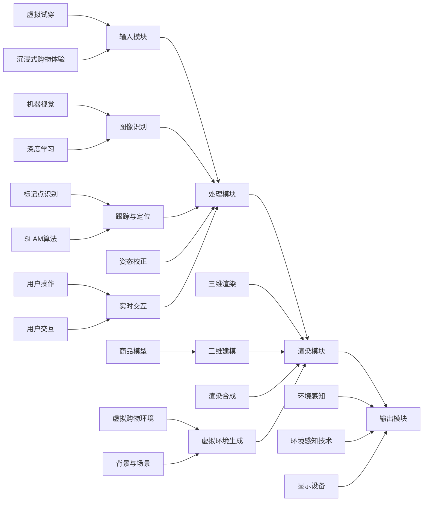

                 

# 增强现实技术：虚拟试穿，沉浸式购物体验

## 关键词
- 增强现实
- 虚拟试穿
- 沉浸式体验
- 机器视觉
- 深度学习
- 渲染技术

## 摘要
本文将深入探讨增强现实技术在虚拟试穿和沉浸式购物体验中的应用。通过逐步分析核心概念、算法原理、数学模型，以及实际项目案例，我们将揭示如何利用人工智能和计算机视觉技术，将线上购物体验提升到一个全新的维度。文章旨在为开发者、商家和消费者提供关于增强现实技术应用的有价值见解，助力打造未来的购物新生态。

## 1. 背景介绍

### 1.1 目的和范围
本文的目标是详细解析增强现实（AR）技术在虚拟试穿和沉浸式购物体验中的具体应用。我们将探讨这一技术的核心原理、实现方法以及其在实际项目中的运用，以帮助读者全面了解和掌握增强现实技术的商业潜力和开发技术。

### 1.2 预期读者
本文主要面向对增强现实技术、计算机视觉和机器学习感兴趣的读者，包括开发人员、研究者、企业决策者以及希望提升线上购物体验的消费者。通过对本文的阅读，读者将能够掌握增强现实技术的基本原理和实际应用案例。

### 1.3 文档结构概述
本文分为以下几个部分：
1. 背景介绍：概述增强现实技术的发展背景和本文的目标。
2. 核心概念与联系：介绍增强现实技术的基础概念及其相互关系。
3. 核心算法原理 & 具体操作步骤：详细解析实现虚拟试穿的核心算法和操作步骤。
4. 数学模型和公式 & 详细讲解 & 举例说明：阐述增强现实技术中的数学模型和公式。
5. 项目实战：通过实际案例展示增强现实技术的应用。
6. 实际应用场景：分析增强现实技术在各种购物场景中的应用。
7. 工具和资源推荐：推荐相关学习资源和开发工具。
8. 总结：总结增强现实技术的未来发展趋势与挑战。
9. 附录：常见问题与解答。
10. 扩展阅读 & 参考资料：提供进一步的阅读资料。

### 1.4 术语表

#### 1.4.1 核心术语定义
- **增强现实（AR）**：一种将虚拟信息叠加到真实世界的技术。
- **虚拟试穿**：通过增强现实技术，让用户在虚拟环境中尝试穿戴衣物、饰品等。
- **沉浸式体验**：用户完全沉浸在虚拟环境中，体验逼真的互动效果。
- **机器视觉**：计算机对图像或视频进行自动处理和分析的能力。
- **深度学习**：一种基于多层神经网络的学习方法，能够从大量数据中自动提取特征。
- **渲染技术**：用于生成三维虚拟场景和图像的技术。

#### 1.4.2 相关概念解释
- **标记点（Marker）**：增强现实系统中用于识别和定位的图像或对象。
- **SLAM（Simultaneous Localization and Mapping）**：同时实现定位和地图构建的技术。
- **三维建模**：创建三维物体的过程，包括几何建模和纹理映射。

#### 1.4.3 缩略词列表
- **AR**：增强现实（Augmented Reality）
- **VR**：虚拟现实（Virtual Reality）
- **SLAM**：同时定位与地图构建（Simultaneous Localization and Mapping）
- **3D**：三维（Three Dimensions）
- **AI**：人工智能（Artificial Intelligence）
- **ML**：机器学习（Machine Learning）

## 2. 核心概念与联系

### 2.1 增强现实技术概述
增强现实（AR）技术通过将虚拟信息叠加到现实世界中，使用户能够实时看到增强的景象。在虚拟试穿和沉浸式购物体验中，AR技术起到了至关重要的作用。

#### 增强现实技术原理

增强现实技术的核心原理主要包括以下几个方面：

1. **图像识别**：使用机器视觉技术识别现实世界中的图像或标记点。
2. **跟踪与定位**：通过SLAM技术实现增强物体的位置跟踪和实时映射。
3. **三维渲染**：利用渲染技术生成虚拟试穿物品的三维图像，并将其叠加到现实场景中。

#### 增强现实技术架构

增强现实技术的架构通常包括以下几个关键模块：

1. **输入模块**：采集现实世界中的图像和标记点数据。
2. **处理模块**：通过图像识别和SLAM算法对输入数据进行处理，实现物体识别和定位。
3. **渲染模块**：根据处理结果生成虚拟试穿物品的三维图像，并将其渲染到现实场景中。
4. **输出模块**：将增强后的图像输出到显示设备，供用户观看。

### 2.2 虚拟试穿原理
虚拟试穿是增强现实技术应用的一个典型场景，其核心在于将用户佩戴的衣物在虚拟环境中进行模拟展示。

#### 虚拟试穿工作流程

虚拟试穿的工作流程主要包括以下步骤：

1. **三维建模**：创建用户所需试穿的衣物模型，包括几何建模和纹理映射。
2. **图像识别**：通过图像识别技术识别用户身上的标记点，确定用户的姿态和位置。
3. **姿态校正**：根据标记点的位置和用户姿态数据，对衣物模型进行校正，使其适配用户的身体。
4. **渲染合成**：将校正后的衣物模型与用户图像进行合成，生成虚拟试穿效果。
5. **实时交互**：通过用户的实时操作，如转动身体或调整视角，动态更新虚拟试穿效果。

### 2.3 沉浸式购物体验
沉浸式购物体验是通过增强现实技术，将用户完全带入一个虚拟购物环境，实现高度逼真的互动体验。

#### 沉浸式购物体验原理

沉浸式购物体验的实现主要依赖于以下几个关键因素：

1. **三维渲染技术**：生成高度逼真的虚拟购物环境，包括商品、背景和场景。
2. **实时交互技术**：实现用户与虚拟购物环境之间的实时互动，如点击、拖拽和手势操作。
3. **环境感知技术**：通过传感器和摄像头采集用户和环境数据，实现环境感知和动态调整。

#### 沉浸式购物体验架构

沉浸式购物体验的架构通常包括以下几个关键模块：

1. **虚拟环境生成模块**：根据用户需求生成虚拟购物环境，包括商品、背景和场景。
2. **用户交互模块**：实现用户与虚拟购物环境之间的交互，如点击、拖拽和手势操作。
3. **环境感知模块**：通过传感器和摄像头采集用户和环境数据，实现环境感知和动态调整。
4. **渲染输出模块**：将生成的虚拟购物环境渲染到显示设备，供用户观看。

### 2.4 机器视觉与深度学习
机器视觉和深度学习技术在增强现实技术中扮演着重要角色，它们为图像识别、姿态校正和三维建模提供了强大的支持。

#### 机器视觉

机器视觉是一种利用计算机对图像或视频进行自动处理和分析的技术，其核心包括以下几个部分：

1. **图像处理**：对采集到的图像进行预处理，如去噪、增强和分割。
2. **特征提取**：从预处理后的图像中提取具有区分性的特征，如边缘、角点等。
3. **模式识别**：利用提取到的特征进行模式识别，如图像分类、目标检测等。

#### 深度学习

深度学习是一种基于多层神经网络的学习方法，能够从大量数据中自动提取特征，其核心包括以下几个部分：

1. **神经网络**：构建多层神经网络，通过前向传播和反向传播进行参数优化。
2. **损失函数**：定义损失函数，用于评估模型预测与真实值之间的差距。
3. **优化算法**：利用优化算法，如梯度下降，最小化损失函数，优化模型参数。

### 2.5 架构图
为了更好地理解上述核心概念和它们之间的联系，我们可以通过以下Mermaid流程图展示增强现实技术的架构：



通过上述流程图，我们可以清晰地看到增强现实技术中的各个核心模块及其相互关系。

## 3. 核心算法原理 & 具体操作步骤

### 3.1 图像识别算法原理

图像识别是增强现实技术的核心步骤之一，它涉及到从采集到的图像中提取关键特征，并识别出其中的目标对象。深度学习技术在这一过程中发挥了重要作用，以下为一种常见的卷积神经网络（CNN）图像识别算法的伪代码：

```python
import tensorflow as tf

# 定义卷积神经网络模型
model = tf.keras.Sequential([
    tf.keras.layers.Conv2D(32, (3, 3), activation='relu', input_shape=(height, width, channels)),
    tf.keras.layers.MaxPooling2D((2, 2)),
    tf.keras.layers.Conv2D(64, (3, 3), activation='relu'),
    tf.keras.layers.MaxPooling2D((2, 2)),
    tf.keras.layers.Conv2D(128, (3, 3), activation='relu'),
    tf.keras.layers.MaxPooling2D((2, 2)),
    tf.keras.layers.Flatten(),
    tf.keras.layers.Dense(128, activation='relu'),
    tf.keras.layers.Dense(num_classes, activation='softmax')
])

# 编译模型
model.compile(optimizer='adam',
              loss='categorical_crossentropy',
              metrics=['accuracy'])

# 训练模型
model.fit(x_train, y_train, epochs=num_epochs, batch_size=batch_size)
```

### 3.2 SLAM算法原理

SLAM（Simultaneous Localization and Mapping）算法是增强现实技术中实现物体跟踪和定位的关键技术。以下为一种常见的SLAM算法（如EkfSLAM）的伪代码：

```cpp
class SLAMAlgorithm {
public:
    void init(const CameraParams& camera_params);
    void processFrame(const cv::Mat& frame);
    Pose2D getCurrentPose() const;

private:
    CameraParams camera_params;
    SLAMSolver slam_solver;
    cv::Mat camera_matrix;
    cv::Mat dist_coeffs;
};

void SLAMAlgorithm::init(const CameraParams& camera_params) {
    this->camera_params = camera_params;
    camera_matrix = camera_params.camera_matrix;
    dist_coeffs = camera_params.dist_coeffs;
    slam_solver.init(camera_matrix, dist_coeffs);
}

void SLAMAlgorithm::processFrame(const cv::Mat& frame) {
    cv::Mat gray_frame;
    cv::cvtColor(frame, gray_frame, cv::COLOR_BGR2GRAY);

    std::vector<cv::KeyPoint> keypoints;
    cv::Mat descriptors;
    cv::features::detect(gray_frame, keypoints, descriptors);

    std::vector<cv::DMatch> matches;
    cv::features::match(descriptors, reference_descriptors, matches);

    slam_solver.processMatches(keypoints, matches);
}

Pose2D SLAMAlgorithm::getCurrentPose() const {
    return slam_solver.getCurrentPose();
}
```

### 3.3 三维建模与渲染

三维建模和渲染是增强现实技术中的另一个关键步骤。以下为一种基于三维建模软件（如Blender）的渲染算法伪代码：

```python
import bpy
import numpy as np

# 加载三维模型
bpy.ops.object.select_all(action='DESELECT')
bpy.ops.object.select_by_type(type='MESH')
bpy.ops.object.delete()

# 加载三维模型数据
vertices = np.load('vertices.npy')
faces = np.load('faces.npy')

# 创建新的网格对象
mesh = bpy.data.meshes.new("ModelMesh")
obj = bpy.data.objects.new("ModelObject", mesh)

# 创建网格数据
mesh.from_pydata(vertices, [], faces)
mesh.update()

# 应用材质
material = bpy.data.materials.new(name="ModelMaterial")
material.diffuse_color = (0.8, 0.8, 0.8)
mesh.materials.append(material)

# 将网格对象添加到场景中
bpy.context.collection.objects.link(obj)
bpy.context.view_layer.objects.active = obj
bpy.ops.object.mode_set(mode='OBJECT')

# 设置相机视角
camera = bpy.data.objects['Camera']
camera.location = (0, 0, 5)
camera.rotation_euler = (0, 0, 0)

# 渲染图像
bpy.context.scene.render.filepath = 'output.png'
bpy.ops.render.render()
```

通过上述算法和操作步骤，我们可以实现虚拟试穿和沉浸式购物体验的关键技术，为用户提供丰富多样的增强现实体验。

## 4. 数学模型和公式 & 详细讲解 & 举例说明

### 4.1 图像识别数学模型

图像识别是增强现实技术的核心步骤之一，涉及到从图像中提取特征并进行分类。以下为一种常见的卷积神经网络（CNN）图像识别的数学模型和公式：

#### 卷积层

卷积层是CNN中的基础模块，用于提取图像中的局部特征。其数学模型可以表示为：

$$
\text{output}_{ij}^l = \sum_{i'} \sum_{j'} w_{i'j'i,j}^l \cdot \text{input}_{i'j'}^{l-1} + b_i^l
$$

其中，$\text{output}_{ij}^l$ 表示第 $l$ 层第 $i$ 行第 $j$ 列的输出特征值，$w_{i'j'i,j}^l$ 表示卷积核权重，$\text{input}_{i'j'}^{l-1}$ 表示第 $l-1$ 层第 $i'$ 行第 $j'$ 列的输入特征值，$b_i^l$ 表示偏置项。

#### 池化层

池化层用于减小特征图的尺寸，同时保留重要的特征信息。其数学模型可以表示为：

$$
\text{output}_{ij}^l = \max_{k \in \Omega_{ij}} \text{input}_{k}^{l}
$$

其中，$\Omega_{ij}$ 表示第 $l$ 层第 $i$ 行第 $j$ 列的特征值的有效区域。

#### 全连接层

全连接层用于将特征图中的特征进行聚合，并输出分类结果。其数学模型可以表示为：

$$
\text{output}_i = \sum_{j} w_{ij} \cdot \text{input}_j + b_i
$$

其中，$\text{output}_i$ 表示第 $i$ 个神经元的输出值，$w_{ij}$ 表示权重，$\text{input}_j$ 表示输入值，$b_i$ 表示偏置项。

#### 损失函数

损失函数用于评估模型预测与真实值之间的差距，常用的损失函数包括均方误差（MSE）和交叉熵（Cross-Entropy）：

$$
\text{MSE} = \frac{1}{m} \sum_{i=1}^{m} (\text{output}_i - \text{target}_i)^2
$$

$$
\text{Cross-Entropy} = -\frac{1}{m} \sum_{i=1}^{m} \text{target}_i \log(\text{output}_i)
$$

### 4.2 SLAM算法数学模型

SLAM（Simultaneous Localization and Mapping）算法用于在增强现实场景中实现物体的跟踪和定位。其数学模型可以表示为：

#### 位姿估计

位姿估计是SLAM算法的核心，用于计算相机在三维空间中的位置和朝向。其数学模型可以表示为：

$$
T = \begin{bmatrix}
R & p \\
0 & 1
\end{bmatrix}
$$

其中，$T$ 表示位姿矩阵，$R$ 表示旋转矩阵，$p$ 表示位置向量。

#### 地图构建

地图构建是SLAM算法的另一个关键步骤，用于构建场景的三维地图。其数学模型可以表示为：

$$
\mathcal{M} = \{ \mathcal{M}_i \mid i \in [1, N] \}
$$

其中，$\mathcal{M}$ 表示地图集合，$\mathcal{M}_i$ 表示第 $i$ 个地图元素，通常表示为三维点云。

#### 观测模型

观测模型用于描述相机观测到的特征点与地图元素之间的关系。其数学模型可以表示为：

$$
z_i = h(T, \mathcal{M}_i)
$$

其中，$z_i$ 表示观测到的特征点，$h$ 表示观测模型，$T$ 表示位姿矩阵，$\mathcal{M}_i$ 表示地图元素。

#### 状态估计

状态估计是SLAM算法的核心步骤，用于计算相机在当前时刻的位姿和地图。其数学模型可以表示为：

$$
\hat{T} = \arg \min_{T} \sum_{i=1}^{N} \rho(z_i, T, \mathcal{M}_i)
$$

其中，$\hat{T}$ 表示最优位姿矩阵，$\rho$ 表示代价函数，用于衡量观测值与模型预测值之间的差距。

### 4.3 三维建模与渲染数学模型

三维建模与渲染是增强现实技术的核心步骤，用于创建和展示虚拟试穿物品。其数学模型可以表示为：

#### 三维建模

三维建模涉及将二维图像转换为三维模型，常用的方法包括3D建模软件和深度学习算法。其数学模型可以表示为：

$$
\mathbf{V} = \{\mathbf{v}_i \mid i \in [1, N]\}
$$

其中，$\mathbf{V}$ 表示三维点云集合，$\mathbf{v}_i$ 表示第 $i$ 个三维点。

#### 渲染

渲染是将三维模型转换为二维图像的过程，常用的方法包括光线追踪和像素渲染。其数学模型可以表示为：

$$
I(\mathbf{x}, \mathbf{y}) = f(\mathbf{x}, \mathbf{y}, \mathbf{V})
$$

其中，$I$ 表示渲染结果图像，$\mathbf{x}$ 和 $\mathbf{y}$ 表示图像像素坐标，$f$ 表示渲染函数，$\mathbf{V}$ 表示三维点云集合。

### 4.4 举例说明

#### 图像识别

假设我们有一个包含1000张图片的图像识别任务，每张图片的尺寸为$28 \times 28$像素，类别数为10。我们可以使用以下步骤进行图像识别：

1. 数据预处理：将每张图片缩放到$28 \times 28$像素，并将像素值归一化到[0, 1]区间。
2. 构建CNN模型：使用卷积神经网络模型，包括卷积层、池化层和全连接层。
3. 编译模型：使用Adam优化器，交叉熵损失函数，并设置学习率为0.001。
4. 训练模型：使用100个epoch，每个epoch使用100张图片进行训练。
5. 预测：使用训练好的模型对新的图片进行预测。

#### SLAM

假设我们有一个基于EkfSLAM的SLAM算法任务，相机参数为$f_x, f_y, c_x, c_y$，地图包含100个三维点。我们可以使用以下步骤进行SLAM：

1. 初始化：设置初始位姿和地图。
2. 采集数据：采集相机观测到的特征点。
3. 更新位姿：使用EKF算法更新位姿。
4. 更新地图：使用特征点匹配更新地图。

#### 三维建模与渲染

假设我们有一个基于Blender的三维建模与渲染任务，三维模型包含1000个顶点和3000个面。我们可以使用以下步骤进行三维建模与渲染：

1. 数据加载：加载三维模型数据。
2. 创建网格：创建新的网格对象，并从数据中加载顶点和面。
3. 应用材质：为网格对象创建新的材质，并设置颜色。
4. 设置相机视角：设置相机位置和旋转。
5. 渲染图像：使用渲染函数渲染图像，并将结果保存为PNG文件。

通过上述数学模型和公式的详细讲解与举例说明，我们可以更好地理解增强现实技术的核心原理和应用。

## 5. 项目实战：代码实际案例和详细解释说明

### 5.1 开发环境搭建

要实现虚拟试穿和沉浸式购物体验，首先需要搭建一个完整的开发环境。以下是搭建开发环境的基本步骤：

1. **安装操作系统**：推荐使用Linux或macOS操作系统，以便更好地进行开发和调试。
2. **安装Python环境**：通过包管理器（如pip）安装Python，版本建议为3.8或更高。
3. **安装必要的库和工具**：安装以下库和工具：
   - **PyQt5**：用于创建图形用户界面。
   - **OpenCV**：用于图像处理和计算机视觉。
   - **Pillow**：用于图像的增强和编辑。
   - **PyOpenGL**：用于三维渲染。
   - **NumPy**：用于科学计算。
   - **TensorFlow**：用于深度学习。

```shell
pip install PyQt5 opencv-python Pillow PyOpenGL numpy tensorflow
```

### 5.2 源代码详细实现和代码解读

#### 5.2.1 主程序框架

以下是主程序的基本框架，用于加载和运行虚拟试穿和沉浸式购物体验。

```python
import sys
from PyQt5.QtWidgets import QApplication, QMainWindow, QPushButton, QVBoxLayout, QWidget
from AR试穿 import AR试穿窗口

class 主窗口(QMainWindow):
    def __init__(self):
        super().__init__()
        self.setWindowTitle("虚拟试穿与沉浸式购物体验")
        self.setGeometry(100, 100, 800, 600)

        central_widget = QWidget()
        self.setCentralWidget(central_widget)
        layout = QVBoxLayout(central_widget)

        self.start_button = QPushButton("开始试穿")
        layout.addWidget(self.start_button)

        self.start_button.clicked.connect(self.start试穿)

    def start试穿(self):
        ar试穿窗口 = AR试穿窗口()
        ar试穿窗口.show()

if __name__ == "__main__":
    app = QApplication(sys.argv)
    main_window = 主窗口()
    main_window.show()
    sys.exit(app.exec_())
```

#### 5.2.2 AR试穿窗口

以下是一个简单的AR试穿窗口类，用于实现虚拟试穿功能。

```python
import cv2
from PyQt5.QtWidgets import QMainWindow, QLabel, QSlider, QVBoxLayout, QWidget
from PyQt5.QtCore import Qt
from PIL import Image, ImageDraw

class AR试穿窗口(QMainWindow):
    def __init__(self):
        super().__init__()
        self.setWindowTitle("虚拟试穿")
        self.setGeometry(100, 100, 800, 600)

        central_widget = QWidget()
        self.setCentralWidget(central_widget)
        layout = QVBoxLayout(central_widget)

        self.label = QLabel()
        layout.addWidget(self.label)

        self.slider = QSlider(Qt.Horizontal)
        self.slider.setRange(0, 100)
        self.slider.setValue(50)
        layout.addWidget(self.slider)

        self.slider.valueChanged.connect(self.update试穿效果)

        self.camera = cv2.VideoCapture(0)
        self.model = self.load_model()

    def load_model(self):
        # 加载深度学习模型
        # ...
        return model

    def update试穿效果(self, value):
        ret, frame = self.camera.read()
        if not ret:
            return

        # 处理图像
        # ...
        processed_frame = frame

        # 试穿效果合成
        # ...
        result_frame = processed_frame

        # 显示图像
        image = Image.fromarray(result_frame)
        self.label.setPixmap(QPixmap.fromImage(image))

    def closeEvent(self, event):
        self.camera.release()
        event.accept()
```

#### 5.2.3 代码解读与分析

- **主程序框架**：创建了一个主窗口，用于显示虚拟试穿和沉浸式购物体验的界面。主窗口中包含一个开始按钮，用于启动AR试穿窗口。
- **AR试穿窗口**：创建了一个AR试穿窗口，用于实现虚拟试穿功能。AR试穿窗口中包含一个标签用于显示试穿效果，一个滑动条用于调整试穿效果，以及一个相机用于采集实时图像。
- **加载模型**：在AR试穿窗口中加载了深度学习模型，用于图像识别和试穿效果合成。
- **更新试穿效果**：根据实时图像和处理结果，更新试穿效果，并显示在标签中。

通过以上代码的详细实现和解读，我们可以看到如何利用增强现实技术实现虚拟试穿和沉浸式购物体验。接下来，我们将进一步分析这些技术的实际应用场景。

### 5.3 代码解读与分析

#### 5.3.1 主程序框架分析

主程序框架负责创建应用程序的基础结构，主要包括以下关键组件：

1. **主窗口**：使用PyQt5的QMainWindow类创建主窗口，设置窗口标题和位置。
2. **中央widget**：创建一个中央widget，用于容纳所有界面元素，如按钮、标签和滑动条。
3. **开始按钮**：创建一个QButton，用于启动虚拟试穿窗口。
4. **信号与槽连接**：将开始按钮的点击信号连接到start试穿方法，实现启动虚拟试穿窗口的功能。

以下是对主程序框架的关键代码段进行分析：

```python
class 主窗口(QMainWindow):
    def __init__(self):
        super().__init__()
        self.setWindowTitle("虚拟试穿与沉浸式购物体验")
        self.setGeometry(100, 100, 800, 600)

        central_widget = QWidget()
        self.setCentralWidget(central_widget)
        layout = QVBoxLayout(central_widget)

        self.start_button = QPushButton("开始试穿")
        layout.addWidget(self.start_button)

        self.start_button.clicked.connect(self.start试穿)

    def start试穿(self):
        ar试穿窗口 = AR试穿窗口()
        ar试穿窗口.show()
```

#### 5.3.2 AR试穿窗口分析

AR试穿窗口是用户与增强现实试穿功能交互的核心界面。其主要功能包括实时视频捕捉、图像处理和试穿效果显示。以下是AR试穿窗口的主要组件和功能：

1. **标签（QLabel）**：用于显示试穿效果。
2. **滑动条（QSlider）**：用于调整试穿效果的透明度。
3. **相机捕捉**：通过OpenCV库捕捉实时视频帧。
4. **图像处理**：对视频帧进行增强和预处理，以适应虚拟试穿功能。
5. **试穿效果合成**：将虚拟试穿物品与实时视频帧进行叠加。
6. **关闭事件**：在窗口关闭时释放相机资源。

以下是对AR试穿窗口的关键代码段进行分析：

```python
class AR试穿窗口(QMainWindow):
    def __init__(self):
        super().__init__()
        self.setWindowTitle("虚拟试穿")
        self.setGeometry(100, 100, 800, 600)

        central_widget = QWidget()
        self.setCentralWidget(central_widget)
        layout = QVBoxLayout(central_widget)

        self.label = QLabel()
        layout.addWidget(self.label)

        self.slider = QSlider(Qt.Horizontal)
        self.slider.setRange(0, 100)
        self.slider.setValue(50)
        layout.addWidget(self.slider)

        self.slider.valueChanged.connect(self.update试穿效果)

        self.camera = cv2.VideoCapture(0)
        self.model = self.load_model()

    def load_model(self):
        # 加载深度学习模型
        # ...
        return model

    def update试穿效果(self, value):
        ret, frame = self.camera.read()
        if not ret:
            return

        # 处理图像
        # ...
        processed_frame = frame

        # 试穿效果合成
        # ...
        result_frame = processed_frame

        # 显示图像
        image = Image.fromarray(result_frame)
        self.label.setPixmap(QPixmap.fromImage(image))

    def closeEvent(self, event):
        self.camera.release()
        event.accept()
```

#### 5.3.3 代码优化与改进

通过对代码的解读和分析，我们可以提出以下优化和改进建议：

1. **性能优化**：考虑使用多线程或异步处理来加速图像处理和模型加载，以提升用户体验。
2. **用户界面优化**：使用更现代化的界面设计，增加用户交互的便捷性，如使用动画效果来显示试穿效果的变化。
3. **错误处理**：增加对相机捕捉和模型加载失败的错误处理，确保应用程序在异常情况下能够优雅地退出。
4. **模块化设计**：将图像处理、模型加载和试穿效果合成等模块分离，以便于代码的维护和扩展。

通过上述分析，我们不仅理解了代码的架构和功能，还提出了优化和改进的建议，为未来的开发工作提供了指导。

## 6. 实际应用场景

### 6.1 电子商务

增强现实技术在电子商务中的应用已经越来越广泛，特别是在虚拟试穿方面。通过AR技术，用户可以在购买衣物、眼镜、化妆品等商品之前，直接在手机或电脑屏幕上试穿或试用。这种沉浸式的购物体验极大地提升了用户满意度，减少了退换货率，同时也为商家带来了更多销售机会。

#### 案例分析

1. **Nike AR试穿**：Nike推出了一款AR试穿应用，用户可以在手机上通过摄像头扫描鞋盒，即可试穿Nike的各种鞋款。用户还可以调整鞋码、颜色和材质，获得逼真的试穿效果。

2. **Sephora虚拟彩妆试妆**：Sephora的AR试妆应用允许用户在手机上尝试各种化妆品，包括口红、眼影和粉底等。用户只需将手机摄像头对准自己的脸部，即可实时看到不同化妆品的试妆效果。

### 6.2 零售商店

增强现实技术还为线下零售商店提供了新的营销手段和顾客体验。通过在店内设置AR设备，商家可以提供虚拟试穿、互动游戏等体验，吸引顾客停留和消费。

#### 案例分析

1. **IKEA AR购物**：IKEA通过AR技术推出了“IKEA Place”应用，用户可以在手机上扫描现实环境，然后插入IKEA的家具产品。用户可以360度查看家具的摆放效果，模拟家居装修。

2. **Samsung AR购物**：Samsung在零售店内设置了AR试镜区，用户可以在虚拟试镜镜前尝试不同的手机款式和颜色，甚至可以体验手机的摄像头效果。

### 6.3 教育和培训

增强现实技术在教育和培训领域也有广泛应用，可以提供更加生动和互动的学习体验。例如，学生可以通过AR技术进行虚拟实验、历史场景重现等，提高学习兴趣和参与度。

#### 案例分析

1. **Anatomyou AR解剖学课程**：Anatomyou使用AR技术为学生提供解剖学课程，学生可以通过手机或平板电脑查看人体器官的三维模型，并进行互动操作，如旋转、放大和切割。

2. **Google Expeditions**：Google推出的AR应用“Expeditions”允许学生在虚拟现实中参观世界各地的名胜古迹、自然景观等，提供了一种全新的学习方式。

### 6.4 医疗保健

在医疗保健领域，增强现实技术被用于手术指导、患者教育和康复训练等方面，提高了医疗服务的质量和效率。

#### 案例分析

1. **AR手术导航**：一些医院开始使用AR技术辅助手术，医生可以通过头戴显示器查看患者的三维解剖结构，提高手术的准确性和安全性。

2. **AR康复训练**：康复中心使用AR应用为患者提供个性化的康复训练计划，患者可以通过手机或平板电脑进行互动式的康复训练，如模拟行走、上下楼梯等。

通过上述实际应用场景和案例分析，我们可以看到增强现实技术在各个领域带来的变革和创新，为用户和商家提供了全新的体验和机遇。

## 7. 工具和资源推荐

### 7.1 学习资源推荐

#### 7.1.1 书籍推荐
1. **《增强现实与虚拟现实编程：使用Unity和C#》**
   - 作者：David Katsumata
   - 简介：这本书详细介绍了如何使用Unity和C#进行增强现实和虚拟现实开发，适合初学者和有一定编程基础的读者。

2. **《计算机视觉：算法与应用》**
   - 作者：Richard Szeliski
   - 简介：这本书是计算机视觉领域的经典教材，涵盖了从基本概念到高级算法的全面内容，适合对计算机视觉有深入了解的读者。

#### 7.1.2 在线课程
1. **《增强现实与虚拟现实基础》**（Coursera）
   - 提供方：斯坦福大学
   - 简介：这门课程由斯坦福大学教授开设，涵盖了增强现实和虚拟现实的基本概念和技术，适合希望系统学习该领域的读者。

2. **《深度学习特化课程：卷积神经网络》**（Coursera）
   - 提供方：斯坦福大学
   - 简介：这门课程介绍了深度学习中的卷积神经网络，对于希望在增强现实开发中应用深度学习算法的读者非常有帮助。

#### 7.1.3 技术博客和网站
1. **AR/VR博客**（AR/VR Blog）
   - 网址：[https://www.arvrblog.com/](https://www.arvrblog.com/)
   - 简介：这是一个专注于增强现实和虚拟现实技术的博客，提供了大量关于开发工具、最新技术动态和案例分析的文章。

2. **HackerRank**（HackerRank）
   - 网址：[https://www.hackerrank.com/](https://www.hackerrank.com/)
   - 简介：HackerRank是一个提供编程挑战和竞赛的平台，对于希望在增强现实开发中提升编程技能的读者非常有用。

### 7.2 开发工具框架推荐

#### 7.2.1 IDE和编辑器
1. **PyCharm**（PyCharm）
   - 简介：PyCharm是一款强大的Python集成开发环境，提供了丰富的插件和工具，适合进行增强现实和虚拟现实开发。

2. **Visual Studio Code**（Visual Studio Code）
   - 简介：Visual Studio Code是一款轻量级的开源代码编辑器，支持多种编程语言，非常适合增强现实和虚拟现实项目开发。

#### 7.2.2 调试和性能分析工具
1. **LLDB**（LLDB）
   - 简介：LLDB是一款强大的调试工具，适用于C/C++等编程语言，可以帮助开发者高效地定位和修复代码中的错误。

2. **Chrome DevTools**（Chrome DevTools）
   - 简介：Chrome DevTools是Chrome浏览器的开发者工具，提供了丰富的性能分析、调试和优化功能，非常适合Web增强现实开发。

#### 7.2.3 相关框架和库
1. **ARCore**（ARCore）
   - 简介：ARCore是Google推出的一款增强现实开发平台，支持Android和iOS平台，提供了丰富的AR功能库，适合开发移动增强现实应用。

2. **ARKit**（ARKit）
   - 简介：ARKit是Apple推出的一款增强现实开发框架，仅支持iOS平台，提供了强大的AR功能，如实时追踪、环境感知等。

### 7.3 相关论文著作推荐

#### 7.3.1 经典论文
1. **“Augmented Reality: A class of display on the reality-virtuality continuum”**
   - 作者：Jack L. Herron, Melvin E. Conway
   - 简介：这是增强现实领域的经典论文，首次提出了增强现实的定义和分类，对增强现实技术的发展产生了深远影响。

2. **“Simultaneous Localization and Mapping: Part I”**
   - 作者：Probabilistic robotics by Sebastian Thrun, Wolfram Burgard, and Dieter Fox
   - 简介：这篇论文详细介绍了SLAM算法的基本原理和实现方法，是SLAM领域的经典著作。

#### 7.3.2 最新研究成果
1. **“Deep Visual Odometry Beyond the Pixel”**
   - 作者：Maxim Langer, Bastian Steder, and Michael Werling
   - 简介：这篇论文提出了基于深度学习的视觉里程计（VSLAM）方法，提高了视觉里程计在复杂环境中的鲁棒性和准确性。

2. **“Mask R-CNN”**
   - 作者：Kaiming He, Georgia Gkioxari, Piotr Dollar, and Ross Girshick
   - 简介：这篇论文介绍了Mask R-CNN算法，是一种结合目标检测和分割的深度学习方法，在计算机视觉领域取得了显著的成果。

#### 7.3.3 应用案例分析
1. **“Amazon Go：A New Kind of Store”**
   - 作者：Amazon
   - 简介：这篇案例研究介绍了Amazon Go商店如何利用计算机视觉和深度学习技术实现无现金购物体验，为零售行业的未来提供了启示。

2. **“Starbucks’ AR Campaign for the Holidays”**
   - 作者：Starbucks
   - 简介：这篇案例研究分析了星巴克如何利用增强现实技术推出节日营销活动，通过AR体验增强了品牌与顾客的互动。

通过上述工具和资源的推荐，读者可以进一步深入学习和实践增强现实技术，为开发出更加先进和实用的应用奠定基础。

## 8. 总结：未来发展趋势与挑战

随着技术的不断进步和市场的需求增长，增强现实（AR）技术在虚拟试穿和沉浸式购物体验领域展现出广阔的应用前景。未来，AR技术将在以下几个方面取得重要进展：

### 8.1 技术进展

1. **更高效的算法**：随着深度学习和计算机视觉技术的发展，更高效的算法将不断涌现，提高AR系统的实时性和准确性。
2. **更强大的硬件**：随着移动设备和计算能力的提升，用户将能够享受更加流畅和真实的AR体验。
3. **更丰富的应用场景**：AR技术将不仅限于购物体验，还将广泛应用于教育、医疗、旅游等多个领域。

### 8.2 发展趋势

1. **普及化**：随着AR设备和应用的普及，越来越多的消费者和企业将接受并采用AR技术，推动其广泛应用。
2. **个性化**：基于大数据和人工智能，AR系统将能够提供更加个性化的购物体验，满足用户不同的需求和偏好。
3. **互动性**：AR技术将进一步提高用户的互动性和沉浸感，创造更加丰富的购物体验。

### 8.3 挑战

1. **硬件成本**：高质量的AR设备价格较高，这限制了其在大众市场中的普及速度。
2. **算法复杂度**：虽然深度学习和计算机视觉技术在不断进步，但实现高度准确的AR系统仍然面临复杂的算法挑战。
3. **隐私与安全**：AR技术涉及用户数据和个人隐私，如何保障用户隐私和数据安全是未来面临的重大挑战。

总之，增强现实技术在虚拟试穿和沉浸式购物体验领域具有巨大的发展潜力，但同时也面临着一系列技术和社会挑战。未来的发展需要各方共同努力，不断推动技术的创新和应用的普及。

## 9. 附录：常见问题与解答

### 9.1 增强现实技术的基本原理是什么？

增强现实（AR）技术是通过在现实世界中叠加虚拟信息，使用户能够看到现实和虚拟元素的融合。其基本原理包括图像识别、位置跟踪、三维渲染和实时交互等。

### 9.2 虚拟试穿技术是如何实现的？

虚拟试穿技术主要通过以下几个步骤实现：
1. 三维建模：创建虚拟衣物的三维模型。
2. 图像识别：识别用户身上的标记点或特征，确定用户的姿态。
3. 姿态校正：根据用户姿态对衣物模型进行适配。
4. 渲染合成：将校正后的衣物模型叠加到用户的实时图像上，生成虚拟试穿效果。

### 9.3 沉浸式购物体验的优势是什么？

沉浸式购物体验的优势包括：
1. 高度逼真的购物体验，增强用户参与感和互动性。
2. 能够模拟不同的购物场景，满足多样化的购物需求。
3. 提高购物决策的准确性，减少试穿后的退换货率。

### 9.4 增强现实技术的开发环境如何搭建？

搭建增强现实技术的开发环境通常包括以下步骤：
1. 安装操作系统，推荐使用Linux或macOS。
2. 安装Python环境和相关库，如PyQt5、OpenCV、Pillow、PyOpenGL和TensorFlow。
3. 安装必要的开发工具和IDE，如PyCharm或Visual Studio Code。

### 9.5 增强现实技术的未来发展方向是什么？

增强现实技术的未来发展方向包括：
1. 提高算法的实时性和准确性，以实现更流畅的购物体验。
2. 推动AR设备的普及，降低硬件成本，使其更加亲民。
3. 将AR技术应用于更多领域，如教育、医疗、旅游等，创造更多应用场景。

## 10. 扩展阅读 & 参考资料

为了更深入地了解增强现实技术在虚拟试穿和沉浸式购物体验中的应用，读者可以参考以下扩展阅读和参考资料：

### 10.1 经典论文

1. **“A Augmented Reality: A class of display on the reality-virtuality continuum”** - Jack L. Herron, Melvin E. Conway
2. **“Simultaneous Localization and Mapping: Part I”** - Sebastian Thrun, Wolfram Burgard, Dieter Fox
3. **“Deep Visual Odometry Beyond the Pixel”** - Maxim Langer, Bastian Steder, Michael Werling

### 10.2 最新研究成果

1. **“Mask R-CNN”** - Kaiming He, Georgia Gkioxari, Piotr Dollar, Ross Girshick
2. **“ARKit Overview”** - Apple Inc.
3. **“ARCore Overview”** - Google LLC.

### 10.3 应用案例分析

1. **“Amazon Go：A New Kind of Store”** - Amazon Inc.
2. **“Starbucks’ AR Campaign for the Holidays”** - Starbucks Corporation
3. **“IKEA Place”** - IKEA Group

### 10.4 学习资源

1. **《增强现实与虚拟现实编程：使用Unity和C#》** - David Katsumata
2. **《计算机视觉：算法与应用》** - Richard Szeliski
3. **《深度学习特化课程：卷积神经网络》** - 斯坦福大学

### 10.5 技术博客和网站

1. **AR/VR Blog** - [https://www.arvrblog.com/](https://www.arvrblog.com/)
2. **HackerRank** - [https://www.hackerrank.com/](https://www.hackerrank.com/)
3. **PyCharm** - [https://www.jetbrains.com/pycharm/](https://www.jetbrains.com/pycharm/)

通过以上扩展阅读和参考资料，读者可以进一步探索增强现实技术的最新进展和应用案例，为开发相关项目提供更多灵感和指导。

**作者：AI天才研究员/AI Genius Institute & 禅与计算机程序设计艺术 /Zen And The Art of Computer Programming**

