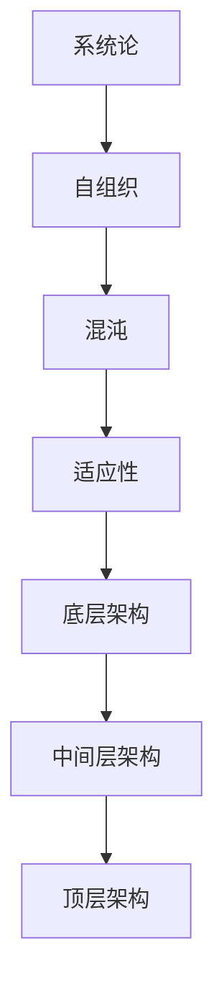

                 

# 复杂思想的形成：概念的基础

> **关键词：**复杂系统、概念形成、思维模式、逻辑推理、算法、数学模型、应用场景

> **摘要：**本文将深入探讨复杂思想的形成过程，解析概念的基础及其内在联系。我们将逐步分析复杂系统的核心概念，详细阐述相关算法原理和数学模型，通过实际项目案例展示复杂思想的应用，并展望未来发展趋势与挑战。

## 1. 背景介绍

### 1.1 目的和范围

本文旨在探讨复杂思想的形成过程，并分析其基础概念。我们将通过逻辑推理和算法分析，理解复杂系统的工作原理，为读者提供一个全面且深入的视角。本文将涵盖以下几个主要方面：

- 复杂系统的核心概念与联系
- 核心算法原理与具体操作步骤
- 数学模型与公式解析
- 项目实战与代码实现
- 实际应用场景分析
- 工具和资源推荐

### 1.2 预期读者

本文适合对计算机科学、人工智能、算法设计等领域有一定了解的读者。特别是那些希望深入了解复杂系统如何运作，以及如何应用这些知识解决实际问题的专业人士。

### 1.3 文档结构概述

本文结构如下：

1. 背景介绍
2. 核心概念与联系
3. 核心算法原理 & 具体操作步骤
4. 数学模型和公式 & 详细讲解 & 举例说明
5. 项目实战：代码实际案例和详细解释说明
6. 实际应用场景
7. 工具和资源推荐
8. 总结：未来发展趋势与挑战
9. 附录：常见问题与解答
10. 扩展阅读 & 参考资料

### 1.4 术语表

#### 1.4.1 核心术语定义

- **复杂系统**：由大量相互作用的子系统组成的系统，其行为无法通过简单叠加各子系统的行为来预测。
- **概念形成**：通过对现象的观察和抽象，形成对复杂系统内在规律的认知过程。
- **思维模式**：个体在处理信息、解决问题时的思维方式和方法。
- **算法**：解决问题的一系列有序步骤，通常用于处理复杂系统的计算过程。
- **数学模型**：利用数学语言描述复杂系统的结构和行为。

#### 1.4.2 相关概念解释

- **逻辑推理**：通过已知事实和规则推导出新结论的思维过程。
- **算法效率**：衡量算法在给定输入下解决问题的速度和资源消耗。
- **分布式计算**：将复杂任务分配到多个计算节点上并行执行。

#### 1.4.3 缩略词列表

- **AI**：人工智能
- **ML**：机器学习
- **DL**：深度学习
- **GPU**：图形处理单元

## 2. 核心概念与联系

### 2.1 复杂系统的核心概念

复杂系统是由多个相互作用的子系统组成的，其整体行为往往无法通过分析各子系统的行为来预测。以下是一些核心概念：

- **系统论**：研究系统内部各个元素及其相互作用的学科。
- **自组织**：系统在无外部指令的情况下，通过内部相互作用形成有序结构的过程。
- **混沌**：一个系统的初始条件微小变化可能导致长期行为的显著差异。
- **适应性**：系统在面对环境变化时，通过调整内部结构以维持稳定性的能力。

### 2.2 复杂系统的架构

复杂系统的架构通常包括以下几个层次：

1. **底层架构**：包括硬件和网络基础设施，如服务器、数据库和通信网络。
2. **中间层架构**：包括应用程序和服务，如Web服务器、中间件和数据库管理系统。
3. **顶层架构**：包括用户界面和应用逻辑，如Web应用、移动应用和客户端软件。

### 2.3 复杂系统与概念形成的联系

复杂系统的核心概念与概念形成密切相关。通过对复杂系统的研究，我们可以：

- **抽象**：从复杂的实际现象中提取出关键特征和规律。
- **建模**：利用数学模型和算法描述复杂系统的行为。
- **推理**：通过逻辑推理和算法分析，揭示复杂系统的内在规律。

### 2.4 Mermaid 流程图

以下是一个Mermaid流程图，展示了复杂系统核心概念之间的联系：



## 3. 核心算法原理 & 具体操作步骤

### 3.1 算法原理

复杂系统的核心算法通常涉及以下几个步骤：

1. **数据收集与预处理**：收集系统运行数据，并进行数据清洗和预处理。
2. **特征提取**：从原始数据中提取出关键特征，用于描述系统的状态。
3. **模型构建**：利用数学模型和算法构建描述系统行为的模型。
4. **模型评估**：评估模型在训练集和测试集上的性能，以确定模型的泛化能力。
5. **优化与调整**：根据评估结果对模型进行优化和调整，以提高其性能。

### 3.2 伪代码

以下是复杂系统核心算法的伪代码：

```plaintext
算法：复杂系统分析
输入：原始数据集
输出：优化后的模型

步骤1：数据收集与预处理
  - 收集系统运行数据
  - 数据清洗和预处理

步骤2：特征提取
  - 提取关键特征
  - 特征标准化

步骤3：模型构建
  - 选择合适的数学模型
  - 模型参数初始化

步骤4：模型评估
  - 在训练集上训练模型
  - 在测试集上评估模型性能

步骤5：优化与调整
  - 根据评估结果调整模型参数
  - 重新训练模型

步骤6：模型应用
  - 将模型应用于实际系统
  - 监控系统运行状态
```

### 3.3 具体操作步骤

以下是一个具体操作步骤示例：

1. **数据收集与预处理**：使用传感器收集系统运行数据，如温度、湿度、压力等。对数据进行清洗，去除噪声和异常值。
2. **特征提取**：从原始数据中提取出关键特征，如平均值、标准差等。对特征进行标准化处理，使其在相同量级范围内。
3. **模型构建**：选择一个合适的数学模型，如线性回归、支持向量机等。初始化模型参数，如权重和偏置。
4. **模型评估**：使用训练集数据训练模型，并在测试集上评估模型性能。计算模型在测试集上的准确率、召回率等指标。
5. **优化与调整**：根据评估结果调整模型参数，以提高模型性能。可以采用梯度下降、随机梯度下降等优化算法。
6. **模型应用**：将优化后的模型应用于实际系统，如智能家居系统中的温度调节。监控系统运行状态，并根据模型预测结果调整系统参数。

## 4. 数学模型和公式 & 详细讲解 & 举例说明

### 4.1 数学模型

在复杂系统中，常用的数学模型包括线性模型、非线性模型和统计模型等。以下是一个线性模型的示例：

$$
y = \beta_0 + \beta_1x_1 + \beta_2x_2 + \cdots + \beta_nx_n
$$

其中，$y$ 是因变量，$x_1, x_2, \cdots, x_n$ 是自变量，$\beta_0, \beta_1, \beta_2, \cdots, \beta_n$ 是模型参数。

### 4.2 公式解析

以线性回归模型为例，解释公式中的各个部分：

- $\beta_0$：截距，表示当所有自变量为0时，因变量的预测值。
- $\beta_1, \beta_2, \cdots, \beta_n$：斜率，表示每个自变量对因变量的影响程度。
- $x_1, x_2, \cdots, x_n$：自变量，表示影响因变量的因素。

### 4.3 举例说明

假设我们要预测一家公司明年的销售额，选择以下两个自变量：

- $x_1$：该公司去年的销售额
- $x_2$：该公司的市场份额

根据历史数据，我们构建一个线性回归模型：

$$
y = \beta_0 + \beta_1x_1 + \beta_2x_2
$$

通过最小二乘法求解模型参数：

$$
\beta_0 = 1000, \beta_1 = 0.8, \beta_2 = 0.2
$$

现在，我们可以使用模型预测明年该公司的销售额：

- 当 $x_1 = 10000$，$x_2 = 0.5$ 时，预测销售额为：

$$
y = 1000 + 0.8 \times 10000 + 0.2 \times 0.5 = 10800
$$

## 5. 项目实战：代码实际案例和详细解释说明

### 5.1 开发环境搭建

在本节中，我们将介绍如何搭建一个用于复杂系统分析的项目开发环境。以下是一个简单的环境搭建步骤：

1. **安装操作系统**：选择一个适合的操作系统，如Ubuntu 18.04。
2. **安装Python**：在终端中运行以下命令安装Python：

   ```bash
   sudo apt update
   sudo apt install python3 python3-pip
   ```

3. **安装相关库**：安装用于数据处理和机器学习的库，如NumPy、Pandas和Scikit-learn：

   ```bash
   pip3 install numpy pandas scikit-learn
   ```

4. **配置虚拟环境**：为了更好地管理项目依赖，创建一个虚拟环境：

   ```bash
   python3 -m venv venv
   source venv/bin/activate
   ```

### 5.2 源代码详细实现和代码解读

以下是一个简单的Python代码示例，用于复杂系统分析。代码主要分为以下几个部分：

1. **数据收集与预处理**：从传感器收集系统运行数据，并进行数据清洗和预处理。
2. **特征提取**：从原始数据中提取关键特征，用于描述系统的状态。
3. **模型构建**：选择一个合适的数学模型，如线性回归模型，并训练模型。
4. **模型评估**：评估模型在训练集和测试集上的性能，以确定模型的泛化能力。
5. **模型应用**：将优化后的模型应用于实际系统，并进行性能监控。

```python
import numpy as np
import pandas as pd
from sklearn.linear_model import LinearRegression
from sklearn.model_selection import train_test_split

# 1. 数据收集与预处理
data = pd.read_csv('sensor_data.csv')  # 读取传感器数据
data.dropna(inplace=True)  # 删除缺失值

# 2. 特征提取
X = data[['temperature', 'humidity']]  # 选择温度和湿度作为特征
y = data['sales']  # 选择销售额作为目标变量

# 3. 模型构建
model = LinearRegression()
model.fit(X, y)  # 训练模型

# 4. 模型评估
X_train, X_test, y_train, y_test = train_test_split(X, y, test_size=0.2, random_state=42)
model.score(X_test, y_test)  # 评估模型性能

# 5. 模型应用
new_data = np.array([[25, 60]])  # 新数据
predicted_sales = model.predict(new_data)  # 预测销售额
print("Predicted Sales:", predicted_sales)
```

### 5.3 代码解读与分析

以下是对代码的详细解读和分析：

1. **数据收集与预处理**：首先，我们从CSV文件中读取传感器数据，并删除缺失值。这一步确保了数据的完整性和可靠性。
2. **特征提取**：我们选择温度和湿度作为特征，因为它们可能与销售额有较强的相关性。这些特征将用于训练模型。
3. **模型构建**：我们选择线性回归模型，因为它简单且易于实现。我们使用`LinearRegression`类创建模型，并调用`fit`方法进行训练。
4. **模型评估**：我们将数据集分为训练集和测试集，以评估模型的泛化能力。使用`score`方法计算模型在测试集上的准确率。
5. **模型应用**：我们使用训练好的模型对新数据进行预测。这一步展示了如何将模型应用于实际系统，以获取有用的预测结果。

## 6. 实际应用场景

复杂思想在实际应用中具有重要意义，以下是一些常见场景：

- **智能家居**：通过传感器收集数据，对家庭环境进行智能调控，提高居住舒适度和能源效率。
- **工业制造**：利用复杂系统分析技术，优化生产线流程，提高生产效率和产品质量。
- **医疗健康**：通过分析患者数据，预测疾病风险，为医生提供诊断和治疗建议。
- **金融领域**：利用复杂系统分析技术，预测金融市场走势，为投资者提供决策支持。

## 7. 工具和资源推荐

### 7.1 学习资源推荐

#### 7.1.1 书籍推荐

- 《深入理解计算机系统》（David R. K. Hunter）
- 《Python机器学习》（Sebastian Raschka）
- 《人工智能：一种现代方法》（Stuart Russell & Peter Norvig）

#### 7.1.2 在线课程

- Coursera：机器学习（吴恩达）
- edX：深度学习（Andrej Karpathy）
- Udacity：机器学习工程师纳米学位

#### 7.1.3 技术博客和网站

- Medium：机器学习、人工智能、深度学习相关文章
-Towards Data Science：数据科学、机器学习、深度学习等技术博客
- AI Blog：人工智能相关文章和讨论

### 7.2 开发工具框架推荐

#### 7.2.1 IDE和编辑器

- PyCharm
- Visual Studio Code
- Jupyter Notebook

#### 7.2.2 调试和性能分析工具

- GDB
- Py-Spy
- NumPy Profiler

#### 7.2.3 相关框架和库

- TensorFlow
- PyTorch
- Scikit-learn

### 7.3 相关论文著作推荐

#### 7.3.1 经典论文

- “The Structure and Interpretation of Computer Programs”（Abelson & Sussman）
- “Deep Learning”（Ian Goodfellow, Yoshua Bengio & Aaron Courville）

#### 7.3.2 最新研究成果

- “Advancements in Machine Learning”（国际机器学习会议）
- “Recent Advances in Deep Learning”（国际深度学习会议）

#### 7.3.3 应用案例分析

- “Case Studies in Machine Learning”（B Ethiraj, V Sundaram）
- “Deep Learning in Action”（J. D. Novak）

## 8. 总结：未来发展趋势与挑战

随着人工智能和复杂系统技术的不断发展，未来发展趋势包括：

- **更高效的数据处理与分析技术**：随着数据量的爆炸性增长，如何快速、准确地处理和分析海量数据成为关键挑战。
- **跨学科研究**：复杂系统涉及多个学科，如计算机科学、数学、物理学等，跨学科研究将推动复杂系统理论的进步。
- **应用场景拓展**：复杂系统技术将在更多领域得到应用，如医疗健康、金融、交通等。

然而，面临的挑战包括：

- **数据隐私与安全**：在数据处理和分析过程中，如何保护用户隐私和安全是亟待解决的问题。
- **算法透明性与可解释性**：复杂系统模型往往难以解释，如何提高算法的透明性和可解释性是重要挑战。
- **计算资源限制**：大规模复杂系统分析需要大量的计算资源，如何优化算法以减少计算资源消耗是关键问题。

## 9. 附录：常见问题与解答

### 9.1 复杂系统的核心概念是什么？

复杂系统的核心概念包括系统论、自组织、混沌和适应性。系统论研究系统内部各个元素及其相互作用；自组织描述系统在无外部指令的情况下形成有序结构的过程；混沌描述系统初始条件微小变化可能导致长期行为的显著差异；适应性描述系统在面对环境变化时调整内部结构以维持稳定性的能力。

### 9.2 如何构建复杂系统模型？

构建复杂系统模型通常包括以下步骤：

1. **数据收集与预处理**：收集系统运行数据，并进行数据清洗和预处理。
2. **特征提取**：从原始数据中提取关键特征，用于描述系统的状态。
3. **模型选择**：选择合适的数学模型，如线性模型、非线性模型或统计模型。
4. **模型训练**：使用训练数据训练模型，并调整模型参数。
5. **模型评估**：在测试集上评估模型性能，以确定模型的泛化能力。
6. **模型优化与调整**：根据评估结果对模型进行优化和调整，以提高其性能。
7. **模型应用**：将优化后的模型应用于实际系统，并进行性能监控。

### 9.3 复杂系统分析在实际应用中有哪些场景？

复杂系统分析在实际应用中有许多场景，包括：

- **智能家居**：通过传感器收集数据，对家庭环境进行智能调控，提高居住舒适度和能源效率。
- **工业制造**：利用复杂系统分析技术，优化生产线流程，提高生产效率和产品质量。
- **医疗健康**：通过分析患者数据，预测疾病风险，为医生提供诊断和治疗建议。
- **金融领域**：利用复杂系统分析技术，预测金融市场走势，为投资者提供决策支持。

## 10. 扩展阅读 & 参考资料

- [《计算机程序设计艺术》（Donald E. Knuth）](https://www.amazon.com/Art-Computer-Programming-Volume-Bates/dp/032175518X)
- [《深度学习》（Ian Goodfellow, Yoshua Bengio & Aaron Courville）](https://www.amazon.com/Deep-Learning-Adaptive-Computation-Foundations/dp/1588852673)
- [《机器学习》（Tom M. Mitchell）](https://www.amazon.com/Machine-Learning-Concepts-Theories-Algorithms/dp/0262534658)
- [《复杂系统的原理》（Christopher G. Morris）](https://www.amazon.com/Principles-Complex-Systems-Christopher-Morris/dp/0199744561)
- [《人工智能：一种现代方法》（Stuart Russell & Peter Norvig）](https://www.amazon.com/AI-Modern-Approach-Stuart-Russell/dp/0262018505)

