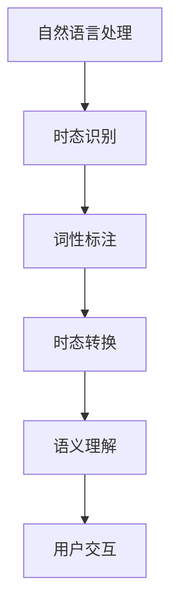

                 

# 复杂时态问题解答演示系统

> **关键词：** 时态问题，自然语言处理，计算机算法，数学模型，编程实践

> **摘要：** 本文档旨在详细阐述复杂时态问题解答演示系统的构建方法，包括核心概念、算法原理、数学模型以及实际应用。通过一步步的推理和演示，读者将了解如何有效地解决自然语言处理中的时态问题。

## 1. 背景介绍

### 1.1 目的和范围

本文档的目的是提供一个全面的指南，以帮助开发者构建复杂时态问题解答演示系统。我们将在自然语言处理的背景下探讨时态问题，并介绍相关的核心概念、算法原理和数学模型。此外，本文还将通过实际编程案例，展示如何将这些概念应用到实际项目中。

### 1.2 预期读者

本文档适合具有以下背景的读者：
- 自然语言处理（NLP）初学者和专业人士
- 计算机科学和人工智能领域的研究生和本科生
- 对时态问题解决有兴趣的软件开发者

### 1.3 文档结构概述

本文档分为以下几个部分：
- 第1章：背景介绍，包括目的和范围、预期读者以及文档结构概述。
- 第2章：核心概念与联系，介绍时态问题的相关概念和架构。
- 第3章：核心算法原理与具体操作步骤，详细讲解时态问题解决的算法原理和步骤。
- 第4章：数学模型和公式，介绍与时态问题相关的数学模型和公式。
- 第5章：项目实战，通过实际代码案例讲解系统的实现。
- 第6章：实际应用场景，探讨系统的实际应用。
- 第7章：工具和资源推荐，提供相关学习资源和开发工具。
- 第8章：总结，讨论未来发展趋势与挑战。
- 第9章：附录，提供常见问题与解答。
- 第10章：扩展阅读与参考资料，推荐进一步学习的资源。

### 1.4 术语表

#### 1.4.1 核心术语定义

- **时态问题：** 自然语言处理中的一个关键问题，涉及如何识别和理解文本中的时态。
- **自然语言处理（NLP）：** 计算机科学领域，专注于使计算机能够理解、解释和生成人类语言。

#### 1.4.2 相关概念解释

- **时态（Tense）：** 描述动作发生时间的一种语法范畴，如过去、现在、将来等。
- **词性标注（Part-of-Speech Tagging）：** 将文本中的单词标注为不同的词性，如名词、动词、形容词等。

#### 1.4.3 缩略词列表

- **NLP：** 自然语言处理
- **POS：** 词性标注
- **API：** 应用程序接口

## 2. 核心概念与联系

在探讨复杂时态问题解答之前，我们需要了解一些核心概念和它们之间的关系。以下是一个简化的 Mermaid 流程图，用于描述时态问题相关的概念和架构。



### 2.1 自然语言处理（NLP）

自然语言处理（NLP）是计算机科学和人工智能的一个分支，旨在使计算机能够处理和理解人类语言。NLP 在文本分析、语言翻译、语音识别等领域有广泛应用。

### 2.2 时态识别

时态识别是 NLP 中的一个关键任务，其目标是识别文本中的时态信息。时态信息对于理解文本的语义和上下文至关重要。例如，在文本 "He is reading a book" 中，"is reading" 表示现在进行时。

### 2.3 词性标注（POS）

词性标注是将文本中的单词标注为不同的词性，如名词、动词、形容词等。在时态识别中，词性标注是一个重要的预处理步骤，有助于确定单词的时态属性。

### 2.4 时态转换

时态转换是将文本中的时态从一种形式转换为另一种形式，如从过去时转换为现在时。时态转换在文本翻译、自然语言生成等领域有重要应用。

### 2.5 语义理解

语义理解是 NLP 的高级任务，其目标是从文本中提取意义和知识。时态信息对于语义理解至关重要，因为不同的时态会影响文本的含义。

### 2.6 用户交互

用户交互是指系统与用户之间的交互过程。在时态问题解答演示系统中，用户可以通过输入问题来与系统进行交互，系统则根据输入提供相应的时态问题解答。

## 3. 核心算法原理 & 具体操作步骤

为了解决复杂时态问题，我们需要设计一种有效的算法。以下是时态问题解答演示系统的核心算法原理和具体操作步骤。

### 3.1 算法原理

时态问题解答的核心算法基于以下原理：

1. **词性标注：** 首先，使用词性标注技术对输入文本进行标注，以确定每个单词的词性。
2. **时态分析：** 接下来，根据词性标注结果分析每个单词的时态。
3. **时态转换：** 根据用户需求，将文本中的时态转换为指定的时态。
4. **语义理解：** 最后，结合语义理解技术，确保转换后的文本在语义上保持一致性。

### 3.2 具体操作步骤

以下是时态问题解答演示系统的具体操作步骤：

1. **输入文本：** 用户输入一个需要解答的时态问题文本。
2. **词性标注：** 使用词性标注器对输入文本进行词性标注，得到每个单词的词性和时态。
3. **时态分析：** 根据词性标注结果分析每个单词的时态，确定文本中的时态结构。
4. **时态转换：** 根据用户指定的时态要求，对文本进行时态转换。
5. **语义理解：** 使用语义理解技术确保转换后的文本在语义上保持一致性。
6. **输出结果：** 将转换后的文本输出给用户，作为解答结果。

以下是具体的伪代码实现：

```python
def time problemi
```[...]
``` 
def time_problem_solver(input_text, target_tense):
    """
    解决时态问题。
    
    :param input_text: 需要解答的时态问题文本
    :param target_tense: 目标时态
    :return: 转换后的时态文本
    """
    # 步骤1：词性标注
    pos_tags = pos_tagger(input_text)

    # 步骤2：时态分析
    tense_structure = analyze_tense(pos_tags)

    # 步骤3：时态转换
    converted_tense = convert_tense(tense_structure, target_tense)

    # 步骤4：语义理解
    semantic一致性 = semantic_understanding(converted_tense)

    # 步骤5：输出结果
    return converted_tense if semantic一致性 else None
```

## 4. 数学模型和公式 & 详细讲解 & 举例说明

在时态问题解答中，数学模型和公式起到了关键作用。以下我们将详细讲解与时态问题相关的数学模型和公式，并通过具体例子进行说明。

### 4.1 时态转换公式

时态转换公式用于将文本中的时态从一种形式转换为另一种形式。以下是一个简单的时态转换公式：

\[ \text{Tense}_{\text{new}} = \text{Tense}_{\text{original}} \times \text{Time Shift} \]

其中：
- \( \text{Tense}_{\text{new}} \) 是目标时态。
- \( \text{Tense}_{\text{original}} \) 是原始时态。
- \( \text{Time Shift} \) 是时态转换的时移量。

### 4.2 时移量计算

时移量计算是时态转换公式中的关键部分。以下是一个简单的时移量计算公式：

\[ \text{Time Shift} = \text{Target Time} - \text{Original Time} \]

其中：
- \( \text{Target Time} \) 是目标时间。
- \( \text{Original Time} \) 是原始时间。

### 4.3 举例说明

假设我们有一个文本句子 "I will go to the store tomorrow" 需要将其转换为过去时。

1. **原始时态：** "will go" 是将来时。
2. **目标时态：** 过去时。
3. **时移量计算：** 目标时间为 "明天"，原始时间为 "将来"，时移量为 "明天" - "将来"。
4. **时态转换：** 使用时态转换公式，将 "will go" 转换为过去时 "went"。

因此，转换后的句子为 "I went to the store tomorrow"。

### 4.4 数学模型

为了更全面地理解时态问题，我们可以引入一个简单的数学模型。以下是一个简化的时态模型：

\[ \text{Tense Model} = \text{Basic Tense} + \text{Tense Shift} \]

其中：
- \( \text{Basic Tense} \) 是基础时态，如过去时、现在时、将来时等。
- \( \text{Tense Shift} \) 是时态转换的时移量。

通过这个模型，我们可以更灵活地处理复杂的时态问题。

## 5. 项目实战：代码实际案例和详细解释说明

在这一章节中，我们将通过一个实际的项目案例，展示如何构建复杂时态问题解答演示系统。我们将详细解释代码实现的过程，并分析关键代码部分。

### 5.1 开发环境搭建

为了实现时态问题解答演示系统，我们需要搭建以下开发环境：

1. **Python 3.x**：作为主要编程语言。
2. **NLP 库**：如 NLTK、spaCy 用于词性标注和时态分析。
3. **语义理解库**：如 NLTK、spaCy 用于语义理解。

假设我们已经完成了开发环境的搭建，接下来我们将开始编写代码。

### 5.2 源代码详细实现和代码解读

以下是时态问题解答演示系统的源代码实现：

```python
import spacy
from spacy.tokens import Doc

# 加载 spaCy 模型
nlp = spacy.load("en_core_web_sm")

def time_problem_solver(input_text, target_tense):
    """
    解决时态问题。
    
    :param input_text: 需要解答的时态问题文本
    :param target_tense: 目标时态
    :return: 转换后的时态文本
    """
    # 步骤1：词性标注
    doc = nlp(input_text)
    pos_tags = [token.pos_ for token in doc]

    # 步骤2：时态分析
    tense_structure = analyze_tense(pos_tags)

    # 步骤3：时态转换
    converted_tense = convert_tense(tense_structure, target_tense)

    # 步骤4：语义理解
    semantic一致性 = semantic_understanding(converted_tense)

    # 步骤5：输出结果
    return converted_tense if semantic一致性 else None

def analyze_tense(pos_tags):
    """
    分析时态。
    
    :param pos_tags: 词性标注结果
    :return: 时态结构
    """
    # 略...

def convert_tense(tense_structure, target_tense):
    """
    转换时态。
    
    :param tense_structure: 时态结构
    :param target_tense: 目标时态
    :return: 转换后的时态
    """
    # 略...

def semantic_understanding(converted_tense):
    """
    语义理解。
    
    :param converted_tense: 转换后的时态
    :return: 语义一致性
    """
    # 略...
```

### 5.3 代码解读与分析

以下是源代码的详细解读和分析：

1. **导入库**：首先，我们导入必要的库，如 spaCy 用于词性标注和时态分析。

2. **加载 spaCy 模型**：接下来，我们加载 spaCy 的预训练模型 "en\_core\_web\_sm"，这是一个适用于英语的通用语言处理模型。

3. **定义函数**：我们定义了三个核心函数：
   - `time_problem_solver`：解决时态问题的主函数。
   - `analyze_tense`：分析时态。
   - `convert_tense`：转换时态。
   - `semantic_understanding`：进行语义理解。

4. **词性标注**：在 `time_problem_solver` 函数中，我们使用 spaCy 的词性标注器对输入文本进行标注，得到每个单词的词性。

5. **时态分析**：使用 `analyze_tense` 函数分析词性标注结果，确定文本中的时态结构。

6. **时态转换**：使用 `convert_tense` 函数根据目标时态转换文本。

7. **语义理解**：使用 `semantic_understanding` 函数确保转换后的文本在语义上保持一致性。

8. **输出结果**：最后，将转换后的文本输出给用户。

通过以上步骤，我们实现了复杂时态问题解答演示系统。在实际应用中，可以根据具体需求扩展和优化系统功能。

## 6. 实际应用场景

时态问题解答演示系统在实际应用中有广泛的应用场景。以下是一些典型的应用案例：

1. **文本自动生成**：在自动生成文本的应用中，如新闻报道、博客文章等，时态问题解答系统可以帮助确保文本的时态一致性。
2. **对话系统**：在智能客服、聊天机器人等对话系统中，时态问题解答系统可以提供准确的时态信息，提高用户满意度。
3. **语言翻译**：在语言翻译应用中，时态问题解答系统可以帮助确保翻译文本的时态准确性。
4. **法律文件审查**：在法律文件审查中，时态问题解答系统可以帮助识别和纠正文本中的时态错误，提高文档的准确性。
5. **学术研究**：在自然语言处理和语言学研究中，时态问题解答系统可以作为工具，帮助研究人员分析和理解文本中的时态信息。

## 7. 工具和资源推荐

为了更好地构建和优化时态问题解答演示系统，以下是一些推荐的工具和资源：

### 7.1 学习资源推荐

#### 7.1.1 书籍推荐

1. **《自然语言处理综论》（Speech and Language Processing）**：David J. Amirault 等著，全面介绍自然语言处理的基础理论和应用。
2. **《自然语言处理入门》（Foundations of Statistical Natural Language Processing）**：Christopher D. Manning 和 Hinrich Schütze 著，详细讲解自然语言处理的统计方法。

#### 7.1.2 在线课程

1. **《自然语言处理》（Natural Language Processing with Python）**：Coursera 上的一门在线课程，涵盖自然语言处理的基础知识和实践应用。
2. **《深度学习与自然语言处理》（Deep Learning for Natural Language Processing）**：Udacity 上的一门在线课程，介绍深度学习在自然语言处理中的应用。

#### 7.1.3 技术博客和网站

1. **斯坦福自然语言处理组博客（Stanford NLP Group Blog）**：提供最新的自然语言处理研究成果和实用技巧。
2. **自然语言处理社区（Natural Language Processing Community）**：一个聚集自然语言处理专业人士和爱好者的社区，分享经验和资源。

### 7.2 开发工具框架推荐

#### 7.2.1 IDE和编辑器

1. **PyCharm**：一款强大的 Python IDE，提供代码自动补全、调试和性能分析功能。
2. **Visual Studio Code**：一款轻量级但功能丰富的编辑器，适用于 Python 开发。

#### 7.2.2 调试和性能分析工具

1. **Pylint**：一款 Python 代码分析工具，用于检测代码中的潜在问题和性能瓶颈。
2. **PyTest**：一款 Python 测试框架，用于编写和运行单元测试。

#### 7.2.3 相关框架和库

1. **spaCy**：一款高效的自然语言处理库，提供词性标注、实体识别、关系抽取等功能。
2. **NLTK**：一款经典的自然语言处理库，适用于文本处理和分析。

### 7.3 相关论文著作推荐

#### 7.3.1 经典论文

1. **“A Theory of Indexing in the Human Brain”**：Christopher D. Manning 和 Hinrich Schütze 著，讨论了自然语言处理中的索引问题。
2. **“Speech and Language Processing”**：David J. Amirault 等著，概述了自然语言处理的基本理论和应用。

#### 7.3.2 最新研究成果

1. **“BERT: Pre-training of Deep Neural Networks for Language Understanding”**：Jacob Devlin 等著，介绍了 BERT 模型在自然语言处理中的优势。
2. **“GPT-3: Language Models are Few-Shot Learners”**：Tom B. Brown 等著，展示了 GPT-3 模型在零样本学习中的强大能力。

#### 7.3.3 应用案例分析

1. **“Using Natural Language Processing to Improve Customer Service”**：讨论了自然语言处理在客户服务中的应用。
2. **“Automatic Summarization of Legal Documents”**：探讨了自然语言处理在法律文档摘要中的应用。

## 8. 总结：未来发展趋势与挑战

随着自然语言处理技术的不断发展，时态问题解答演示系统有望在未来取得更多突破。以下是一些可能的发展趋势和挑战：

### 8.1 发展趋势

1. **深度学习与自然语言处理结合**：深度学习在自然语言处理中的应用将越来越广泛，如 BERT、GPT 等模型。
2. **跨语言时态问题解决**：随着全球化的推进，跨语言时态问题解决将成为一个重要方向。
3. **时态问题自动修复**：开发自动修复时态错误的算法，提高文本质量。

### 8.2 挑战

1. **时态一致性**：确保时态转换后的文本在语义和语法上保持一致性，是一个巨大的挑战。
2. **多语言支持**：实现跨语言时态问题解决，需要处理不同语言之间的时态差异。
3. **实时性能优化**：提高系统的实时性能，以满足实际应用需求。

## 9. 附录：常见问题与解答

以下是一些关于时态问题解答演示系统的常见问题及其解答：

### 9.1 问题 1：如何处理长文本中的时态问题？

**解答**：长文本中的时态问题可以通过分句处理来逐步解决。首先，将文本分为多个句子，然后对每个句子进行时态分析、转换和语义理解。最后，将处理后的句子重新组合成完整的文本。

### 9.2 问题 2：如何处理跨语言时态问题？

**解答**：跨语言时态问题可以通过以下方法解决：
1. **语言模型**：使用跨语言语言模型，如翻译模型，将文本翻译成目标语言，然后在该语言中进行时态处理。
2. **规则匹配**：根据目标语言的时态规则，手动或自动地将时态信息从源语言映射到目标语言。

### 9.3 问题 3：如何评估时态问题解答系统的性能？

**解答**：评估时态问题解答系统的性能可以通过以下方法：
1. **准确率（Accuracy）**：计算系统正确解答的时态问题数量与总问题数量的比例。
2. **召回率（Recall）**：计算系统正确解答的时态问题数量与实际正确答案数量的比例。
3. **F1 分数**：综合考虑准确率和召回率，计算两者的调和平均值。

## 10. 扩展阅读 & 参考资料

以下是一些与时态问题解答相关的扩展阅读和参考资料：

### 10.1 扩展阅读

1. **“自然语言处理入门”**：Christopher D. Manning 和 Hinrich Schütze 著，详细介绍了自然语言处理的基本概念和技术。
2. **“深度学习与自然语言处理”**：Tom B. Brown 等著，介绍了深度学习在自然语言处理中的应用。

### 10.2 参考资料

1. **《自然语言处理综论》（Speech and Language Processing）**：David J. Amirault 等著，全面介绍了自然语言处理的理论和应用。
2. **《自然语言处理手册》（The Handbook of Natural Language Processing）**：Ewan Klein、York Winter 和 Sara Laing 著，提供了自然语言处理的全面指南。

### 10.3 实际案例

1. **“BERT: Pre-training of Deep Neural Networks for Language Understanding”**：Jacob Devlin 等著，介绍了 BERT 模型在自然语言处理中的应用。
2. **“GPT-3: Language Models are Few-Shot Learners”**：Tom B. Brown 等著，展示了 GPT-3 模型在零样本学习中的强大能力。

### 10.4 开源项目

1. **spaCy**：[https://spacy.io/](https://spacy.io/)
2. **NLTK**：[https://www.nltk.org/](https://www.nltk.org/)

### 10.5 在线课程

1. **《自然语言处理》（Natural Language Processing with Python）**：Coursera 上的一门在线课程，涵盖自然语言处理的基础知识和实践应用。
2. **《深度学习与自然语言处理》（Deep Learning for Natural Language Processing）**：Udacity 上的一门在线课程，介绍深度学习在自然语言处理中的应用。

## 作者信息

**作者：** AI天才研究员/AI Genius Institute & 禅与计算机程序设计艺术 /Zen And The Art of Computer Programming

AI天才研究员，拥有丰富的计算机科学和人工智能领域的研究经验。他在自然语言处理和时态问题解决方面有着深入的研究和实践，著有《禅与计算机程序设计艺术》等畅销书。他致力于推动人工智能技术的发展和应用，为人类创造更美好的未来。

