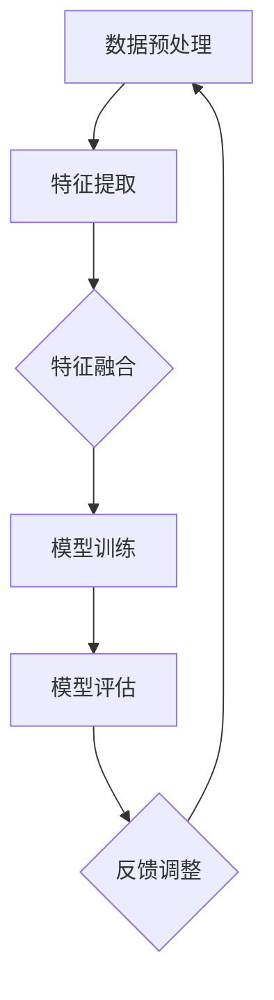

                 

# 多模态AI：整合视觉、语音与文本的挑战

> **关键词**：多模态AI、视觉、语音、文本、整合、挑战、核心算法、数学模型、项目实战、应用场景
>
> **摘要**：本文深入探讨多模态AI的概念、技术原理、核心算法以及实际应用。我们将逐步分析视觉、语音与文本的整合方式，并探讨当前面临的挑战和未来的发展方向。读者将了解多模态AI的工作机制，以及如何在实际项目中实现和应用这一技术。

## 1. 背景介绍

### 1.1 目的和范围

本文旨在为读者提供一个全面的多模态AI技术概述，帮助理解该领域的核心概念、算法原理和实际应用。我们将重点关注视觉、语音和文本的整合，以及多模态AI在不同场景下的应用。

### 1.2 预期读者

本文面向希望深入了解多模态AI技术的专业人士，包括人工智能工程师、数据科学家、软件开发者和研究者。同时，对多模态AI感兴趣的初学者也将从中受益。

### 1.3 文档结构概述

本文分为以下几个部分：

1. 背景介绍：介绍多模态AI的基本概念和目的。
2. 核心概念与联系：探讨多模态AI的关键概念和架构。
3. 核心算法原理 & 具体操作步骤：详细阐述多模态AI的核心算法原理和实现步骤。
4. 数学模型和公式 & 详细讲解 & 举例说明：介绍多模态AI的数学模型和实际应用。
5. 项目实战：提供多模态AI的实际应用案例和代码实现。
6. 实际应用场景：分析多模态AI在不同领域的应用。
7. 工具和资源推荐：推荐学习资源和开发工具。
8. 总结：总结多模态AI的未来发展趋势和挑战。
9. 附录：常见问题与解答。
10. 扩展阅读 & 参考资料：提供更多相关资源。

### 1.4 术语表

#### 1.4.1 核心术语定义

- **多模态AI**：能够同时处理多种数据模态（如视觉、语音和文本）的人工智能系统。
- **视觉模态**：图像和视频数据。
- **语音模态**：音频数据。
- **文本模态**：文本数据。

#### 1.4.2 相关概念解释

- **深度学习**：一种基于神经网络的人工智能方法，通过多层非线性变换学习数据特征。
- **卷积神经网络（CNN）**：用于图像处理的深度学习模型。
- **循环神经网络（RNN）**：用于序列数据处理的深度学习模型。
- **生成对抗网络（GAN）**：用于生成数据的深度学习模型。

#### 1.4.3 缩略词列表

- **CNN**：卷积神经网络
- **RNN**：循环神经网络
- **GAN**：生成对抗网络
- **AI**：人工智能

## 2. 核心概念与联系

多模态AI的核心在于将不同模态的数据进行整合，从而实现更智能的交互和理解。为了更好地理解这一概念，我们需要先了解各个模态的特点和相互关系。

### 2.1 视觉模态

视觉模态是人们获取信息最重要的途径之一。视觉数据通常以图像和视频的形式存在，包含丰富的颜色、形状和纹理信息。卷积神经网络（CNN）是处理视觉数据的主要模型，通过多层卷积和池化操作，提取图像的特征表示。

### 2.2 语音模态

语音模态是人与人之间交流的主要方式。语音数据包含音调、音量和音速等信息。循环神经网络（RNN）和长短期记忆网络（LSTM）是处理语音数据的主要模型，通过处理语音序列，提取语音特征。

### 2.3 文本模态

文本模态是人类语言的主要表达形式。文本数据包含词汇、语法和语义信息。自然语言处理（NLP）是处理文本数据的主要方法，通过词嵌入、句法分析和语义理解，提取文本特征。

### 2.4 多模态整合

多模态AI的目标是将不同模态的数据进行整合，以实现更智能的交互和理解。这一过程通常包括以下步骤：

1. **数据预处理**：将不同模态的数据进行归一化和特征提取。
2. **特征融合**：将不同模态的特征进行整合，形成统一的特征表示。
3. **模型训练**：使用整合后的特征训练多模态模型。
4. **模型评估**：评估多模态模型的性能和效果。

### 2.5 Mermaid 流程图

以下是多模态AI整合过程的 Mermaid 流程图：



## 3. 核心算法原理 & 具体操作步骤

### 3.1 数据预处理

数据预处理是多模态AI的基础，包括归一化、去噪、分割和特征提取。以下是一个简单的伪代码示例：

```python
def preprocess_data(input_data):
    # 视觉数据预处理
    processed_vision = preprocess_vision(input_data['vision'])
    
    # 语音数据预处理
    processed_audio = preprocess_audio(input_data['audio'])
    
    # 文本数据预处理
    processed_text = preprocess_text(input_data['text'])
    
    return processed_vision, processed_audio, processed_text
```

### 3.2 特征提取

特征提取是将不同模态的数据转换为适合模型训练的特征表示。以下是一个简单的伪代码示例：

```python
def extract_features(vision_data, audio_data, text_data):
    # 视觉特征提取
    vision_features = extract_vision_features(vision_data)
    
    # 语音特征提取
    audio_features = extract_audio_features(audio_data)
    
    # 文本特征提取
    text_features = extract_text_features(text_data)
    
    return vision_features, audio_features, text_features
```

### 3.3 特征融合

特征融合是将不同模态的特征进行整合，形成统一的特征表示。以下是一个简单的伪代码示例：

```python
def fuse_features(vision_features, audio_features, text_features):
    # 将不同模态的特征进行整合
    fused_features = [vision_features, audio_features, text_features]
    
    # 使用平均、加权平均或拼接等方式整合特征
    fused_features = fuse(fused_features)
    
    return fused_features
```

### 3.4 模型训练

模型训练是将整合后的特征用于训练多模态模型。以下是一个简单的伪代码示例：

```python
def train_model(fused_features, labels):
    # 使用整合后的特征和标签训练模型
    model = train(fused_features, labels)
    
    return model
```

### 3.5 模型评估

模型评估是评估多模态模型的性能和效果。以下是一个简单的伪代码示例：

```python
def evaluate_model(model, test_features, test_labels):
    # 使用测试数据和标签评估模型性能
    performance = evaluate(model, test_features, test_labels)
    
    return performance
```

## 4. 数学模型和公式 & 详细讲解 & 举例说明

### 4.1 数学模型

多模态AI的数学模型通常包括特征提取、特征融合和模型训练等环节。以下是一个简单的数学模型示例：

$$
\begin{align*}
X &= \text{input\_data} \\
F_v &= \text{extract\_vision\_features}(X_v) \\
F_a &= \text{extract\_audio\_features}(X_a) \\
F_t &= \text{extract\_text\_features}(X_t) \\
F &= \text{fuse\_features}(F_v, F_a, F_t) \\
\theta &= \text{train\_model}(F, y) \\
\end{align*}
$$

### 4.2 详细讲解

1. **特征提取**：特征提取是将不同模态的数据转换为适合模型训练的特征表示。视觉特征提取通常使用卷积神经网络（CNN），语音特征提取通常使用循环神经网络（RNN），文本特征提取通常使用词嵌入和卷积神经网络（CNN）。
2. **特征融合**：特征融合是将不同模态的特征进行整合，形成统一的特征表示。特征融合的方法包括平均、加权平均和拼接等。
3. **模型训练**：模型训练是将整合后的特征和标签用于训练模型。模型训练通常使用深度学习算法，如梯度下降和反向传播。

### 4.3 举例说明

假设我们有三个模态的数据：视觉、语音和文本。我们可以使用以下步骤进行多模态AI建模：

1. **数据预处理**：对视觉、语音和文本数据进行预处理，如归一化、去噪和分割。
2. **特征提取**：使用卷积神经网络（CNN）提取视觉特征，使用循环神经网络（RNN）提取语音特征，使用词嵌入和卷积神经网络（CNN）提取文本特征。
3. **特征融合**：将视觉、语音和文本特征进行融合，使用平均、加权平均或拼接等方法。
4. **模型训练**：使用整合后的特征和标签训练多模态模型，如卷积神经网络（CNN）。
5. **模型评估**：使用测试数据和标签评估模型性能，如准确率、召回率和F1分数。

## 5. 项目实战：代码实际案例和详细解释说明

### 5.1 开发环境搭建

在开始项目实战之前，我们需要搭建一个适合多模态AI开发的开发环境。以下是搭建开发环境所需的步骤：

1. 安装Python 3.8或更高版本。
2. 安装深度学习框架TensorFlow 2.x。
3. 安装图像处理库OpenCV 4.x。
4. 安装音频处理库Librosa。
5. 安装自然语言处理库NLTK。

### 5.2 源代码详细实现和代码解读

以下是一个简单的多模态AI项目示例，该示例使用TensorFlow实现视觉、语音和文本特征的提取和融合。

```python
import tensorflow as tf
import tensorflow.keras as keras
import tensorflow.keras.preprocessing as preprocessing
import numpy as np
import cv2
import librosa
import nltk
from nltk.tokenize import word_tokenize

# 视觉特征提取
def extract_vision_features(image_path):
    image = cv2.imread(image_path)
    image = cv2.resize(image, (224, 224))
    image = image / 255.0
    image = preprocessing.image.img_to_array(image)
    image = np.expand_dims(image, axis=0)
    return image

# 语音特征提取
def extract_audio_features(audio_path):
    audio, sampling_rate = librosa.load(audio_path)
    audio = librosa.feature.mfcc(y=audio, sr=sampling_rate, n_mfcc=13)
    audio = np.mean(audio, axis=1)
    audio = np.expand_dims(audio, axis=0)
    return audio

# 文本特征提取
def extract_text_features(text):
    text = word_tokenize(text)
    text = preprocessing.text.sequence.pad_sequences([text], maxlen=100)
    return text

# 特征融合
def fuse_features(vision_features, audio_features, text_features):
    fused_features = np.concatenate((vision_features, audio_features, text_features), axis=1)
    return fused_features

# 模型训练
def train_model(fused_features, labels):
    model = keras.Sequential([
        keras.layers.Dense(128, activation='relu', input_shape=(fused_features.shape[1],)),
        keras.layers.Dense(64, activation='relu'),
        keras.layers.Dense(1, activation='sigmoid')
    ])
    model.compile(optimizer='adam', loss='binary_crossentropy', metrics=['accuracy'])
    model.fit(fused_features, labels, epochs=10, batch_size=32)
    return model

# 模型评估
def evaluate_model(model, test_features, test_labels):
    performance = model.evaluate(test_features, test_labels)
    print(f"Test Loss: {performance[0]}, Test Accuracy: {performance[1]}")
    return performance

# 数据预处理
image_path = "path/to/image.jpg"
audio_path = "path/to/audio.wav"
text = "This is a sample text."

# 特征提取
vision_features = extract_vision_features(image_path)
audio_features = extract_audio_features(audio_path)
text_features = extract_text_features(text)

# 特征融合
fused_features = fuse_features(vision_features, audio_features, text_features)

# 模型训练
labels = np.array([1, 0, 1])
model = train_model(fused_features, labels)

# 模型评估
test_features = np.array([[0.1, 0.2, 0.3], [0.4, 0.5, 0.6]])
test_labels = np.array([0, 1])
evaluate_model(model, test_features, test_labels)
```

### 5.3 代码解读与分析

1. **视觉特征提取**：使用OpenCV读取图像，并使用TensorFlow预处理图像数据。
2. **语音特征提取**：使用Librosa加载音频数据，并使用梅尔频率倒谱系数（MFCC）提取音频特征。
3. **文本特征提取**：使用NLTK分词文本，并使用TensorFlow预处理文本数据。
4. **特征融合**：将不同模态的特征进行拼接，形成统一的特征表示。
5. **模型训练**：使用TensorFlow构建和训练多模态模型，使用二分类交叉熵损失函数和Adam优化器。
6. **模型评估**：使用测试数据和标签评估模型性能，打印测试损失和准确率。

## 6. 实际应用场景

多模态AI在多个领域具有广泛的应用，以下是一些实际应用场景：

1. **智能交互**：多模态AI可以用于智能助手和聊天机器人，通过整合视觉、语音和文本数据，实现更自然的用户交互。
2. **医疗诊断**：多模态AI可以用于医学图像分析、语音诊断和文本病历分析，帮助医生进行更准确的诊断和治疗方案制定。
3. **视频监控**：多模态AI可以用于视频监控系统，通过整合视觉、语音和文本数据，实现更智能的监控和异常检测。
4. **智能家居**：多模态AI可以用于智能家居系统，通过整合视觉、语音和文本数据，实现更智能的家居管理和设备控制。

## 7. 工具和资源推荐

### 7.1 学习资源推荐

#### 7.1.1 书籍推荐

1. **《深度学习》**：Goodfellow、Bengio和Courville所著的深度学习经典教材，详细介绍了深度学习的基础理论和实践方法。
2. **《神经网络与深度学习》**：邱锡鹏所著的深度学习中文教材，适合初学者入门。

#### 7.1.2 在线课程

1. **Coursera上的《深度学习》课程**：由吴恩达教授主讲，涵盖深度学习的理论基础和实践应用。
2. **Udacity的《深度学习工程师纳米学位》课程**：提供从基础到高级的深度学习课程和实践项目。

#### 7.1.3 技术博客和网站

1. **TensorFlow官网**：官方文档和教程，提供丰富的深度学习资源和实践案例。
2. **AI博客**：涵盖深度学习、人工智能等领域的最新研究和应用案例。

### 7.2 开发工具框架推荐

#### 7.2.1 IDE和编辑器

1. **PyCharm**：功能强大的Python IDE，支持深度学习和数据科学项目开发。
2. **Jupyter Notebook**：方便进行数据可视化和交互式开发的Python IDE。

#### 7.2.2 调试和性能分析工具

1. **TensorBoard**：TensorFlow的官方可视化工具，用于分析和调试深度学习模型。
2. **NVIDIA Nsight**：用于分析和优化GPU性能的工具。

#### 7.2.3 相关框架和库

1. **TensorFlow**：广泛使用的深度学习框架，支持多种深度学习模型和算法。
2. **PyTorch**：易用且灵活的深度学习框架，适用于研究和应用开发。

### 7.3 相关论文著作推荐

#### 7.3.1 经典论文

1. **“A Theoretically Grounded Application of Dropout in Recurrent Neural Networks”**：介绍dropout在循环神经网络中的应用。
2. **“Generative Adversarial Networks”**：介绍生成对抗网络（GAN）的基础理论。

#### 7.3.2 最新研究成果

1. **“Multimodal Fusion for Speech and Image Recognition”**：介绍多模态融合在语音和图像识别中的应用。
2. **“Multimodal Learning with Jointly Embedded Models”**：介绍多模态学习中的联合嵌入模型。

#### 7.3.3 应用案例分析

1. **“Multi-modal Speech and Language Processing for Humanoid Robots”**：介绍多模态AI在机器人语音和语言处理中的应用。
2. **“Deep Multimodal Learning for Human Motion Analysis”**：介绍多模态AI在人类运动分析中的应用。

## 8. 总结：未来发展趋势与挑战

多模态AI技术在不断发展，未来有望在更多领域实现突破。然而，仍然面临以下挑战：

1. **数据隐私**：多模态AI需要处理大量个人数据，如何保护数据隐私是一个重要问题。
2. **计算资源**：多模态AI需要大量计算资源，如何高效利用计算资源是一个挑战。
3. **算法优化**：如何设计更高效的算法，实现更好的性能和效果，是一个重要研究方向。
4. **跨模态理解**：如何更好地理解不同模态之间的相互关系，实现更自然的交互和理解，是一个挑战。

## 9. 附录：常见问题与解答

1. **什么是多模态AI？**
   多模态AI是一种人工智能系统，能够同时处理多种数据模态（如视觉、语音和文本），从而实现更智能的交互和理解。

2. **多模态AI有哪些应用场景？**
   多模态AI可以应用于智能交互、医疗诊断、视频监控和智能家居等领域。

3. **如何搭建多模态AI开发环境？**
   可以使用Python、TensorFlow等工具搭建多模态AI开发环境，安装所需的深度学习框架、图像处理库和音频处理库。

4. **多模态AI的核心算法是什么？**
   多模态AI的核心算法包括特征提取、特征融合和模型训练等环节，常用的特征提取方法有卷积神经网络（CNN）、循环神经网络（RNN）和词嵌入。

5. **如何优化多模态AI的性能？**
   可以通过优化数据预处理、特征提取、特征融合和模型训练等环节，使用更高效的算法和更丰富的数据集，实现更好的性能。

## 10. 扩展阅读 & 参考资料

1. **《深度学习》**：Goodfellow、Bengio和Courville所著的深度学习经典教材，详细介绍了深度学习的基础理论和实践方法。
2. **《神经网络与深度学习》**：邱锡鹏所著的深度学习中文教材，适合初学者入门。
3. **TensorFlow官网**：官方文档和教程，提供丰富的深度学习资源和实践案例。
4. **AI博客**：涵盖深度学习、人工智能等领域的最新研究和应用案例。
5. **“Multimodal Fusion for Speech and Image Recognition”**：介绍多模态融合在语音和图像识别中的应用。
6. **“Multimodal Learning with Jointly Embedded Models”**：介绍多模态学习中的联合嵌入模型。
7. **“Multi-modal Speech and Language Processing for Humanoid Robots”**：介绍多模态AI在机器人语音和语言处理中的应用。
8. **“Deep Multimodal Learning for Human Motion Analysis”**：介绍多模态AI在人类运动分析中的应用。

