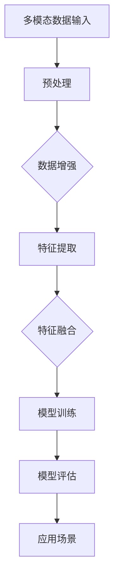

                 

# 多模态大模型：技术原理与实战 智能顾问

> 关键词：多模态、大模型、技术原理、实战、智能顾问

> 摘要：本文旨在深入探讨多模态大模型的技术原理及其在智能顾问领域的应用。我们将通过逐步分析，详细讲解核心概念、算法原理、数学模型，并分享实际项目实战案例。读者将获得对多模态大模型有全面且深入的理解。

## 1. 背景介绍

### 1.1 目的和范围

本文的目标是帮助读者理解多模态大模型的技术原理，并探讨其在智能顾问领域的应用。我们将探讨多模态数据的处理方法、大模型的架构设计和实现，以及如何利用这些模型为用户提供智能化的顾问服务。

### 1.2 预期读者

本文适合以下读者群体：

- 计算机科学和人工智能领域的研究人员
- 想要了解多模态大模型技术原理的开发者
- 对智能顾问应用感兴趣的技术爱好者

### 1.3 文档结构概述

本文将分为以下几个部分：

- 第1部分：背景介绍，包括目的、预期读者和文档结构概述
- 第2部分：核心概念与联系，介绍多模态大模型的核心概念和架构
- 第3部分：核心算法原理 & 具体操作步骤，讲解大模型算法的实现细节
- 第4部分：数学模型和公式 & 详细讲解 & 举例说明，介绍大模型的数学基础
- 第5部分：项目实战：代码实际案例和详细解释说明，分享实战经验
- 第6部分：实际应用场景，讨论多模态大模型在不同领域的应用
- 第7部分：工具和资源推荐，推荐学习资源、开发工具和论文著作
- 第8部分：总结：未来发展趋势与挑战，展望多模态大模型的发展方向
- 第9部分：附录：常见问题与解答，解答读者可能遇到的问题
- 第10部分：扩展阅读 & 参考资料，提供进一步学习的资源

### 1.4 术语表

在本文中，我们将使用以下术语：

#### 1.4.1 核心术语定义

- 多模态：指同时处理多种类型数据（如文本、图像、声音等）的能力。
- 大模型：指参数规模巨大、计算能力要求高的深度学习模型。
- 智能顾问：指利用人工智能技术为用户提供专业咨询和建议的系统。

#### 1.4.2 相关概念解释

- 深度学习：一种人工智能技术，通过多层神经网络来学习数据的特征表示。
- 卷积神经网络（CNN）：一种专门用于处理图像数据的神经网络架构。
- 递归神经网络（RNN）：一种用于处理序列数据的神经网络架构。

#### 1.4.3 缩略词列表

- CNN：卷积神经网络
- RNN：递归神经网络
- ML：机器学习
- DL：深度学习

## 2. 核心概念与联系

在深入探讨多模态大模型之前，我们需要了解其核心概念和架构。以下是一个Mermaid流程图，用于展示多模态大模型的关键组成部分。



### 2.1 多模态数据输入

多模态大模型的第一步是接收多种类型的数据，如文本、图像、声音等。这些数据可能来源于用户输入、传感器采集或其他数据源。数据输入的多样性使得多模态大模型能够处理复杂的问题。

### 2.2 预处理

在接收多模态数据后，我们需要对数据进行预处理，以提高数据质量和模型性能。预处理步骤可能包括去噪、归一化、数据清洗等。

### 2.3 数据增强

数据增强是通过生成虚拟数据来扩充数据集的方法。这有助于提高模型的泛化能力。常见的数据增强方法包括图像旋转、缩放、裁剪等。

### 2.4 特征提取

特征提取是指将原始数据转换为有意义的信息表示的过程。对于多模态数据，我们可以使用不同的神经网络架构来提取各自的特征。例如，使用CNN提取图像特征，使用RNN提取文本和声音特征。

### 2.5 特征融合

特征融合是将不同模态的特征进行整合，以获得更丰富的信息表示。这可以通过将特征向量拼接、平均或使用注意力机制来实现。

### 2.6 模型训练

在特征融合后，我们可以使用训练数据来训练多模态大模型。训练过程涉及优化模型参数，以使模型能够准确预测或分类输入数据。

### 2.7 模型评估

模型评估是评估模型性能的过程。我们通常使用准确率、召回率、F1分数等指标来评估模型的性能。

### 2.8 应用场景

多模态大模型可以应用于多个领域，如医疗诊断、金融分析、智能客服等。在不同的应用场景中，我们需要针对特定问题进行模型设计和优化。

## 3. 核心算法原理 & 具体操作步骤

在本节中，我们将详细讲解多模态大模型的核心算法原理和具体操作步骤。我们将使用伪代码来阐述算法的实现细节。

### 3.1 数据预处理

```python
def preprocess_data(data):
    # 去除噪声
    cleaned_data = remove_noise(data)
    # 归一化
    normalized_data = normalize_data(cleaned_data)
    # 数据增强
    augmented_data = augment_data(normalized_data)
    return augmented_data
```

### 3.2 特征提取

```python
def extract_features(data):
    # 使用CNN提取图像特征
    image_features = cnn_extract_features(data['images'])
    # 使用RNN提取文本和声音特征
    text_features = rnn_extract_features(data['text'])
    audio_features = rnn_extract_features(data['audio'])
    return image_features, text_features, audio_features
```

### 3.3 特征融合

```python
def fuse_features(image_features, text_features, audio_features):
    # 拼接特征向量
    fused_features = concatenate(image_features, text_features, audio_features)
    # 使用注意力机制进行融合
    fused_features = attention Mechanism(fused_features)
    return fused_features
```

### 3.4 模型训练

```python
def train_model(features, labels):
    # 初始化模型
    model = initialize_model()
    # 训练模型
    model.fit(features, labels)
    return model
```

### 3.5 模型评估

```python
def evaluate_model(model, test_features, test_labels):
    # 评估模型性能
    accuracy = model.evaluate(test_features, test_labels)
    print("Accuracy:", accuracy)
```

### 3.6 应用场景

```python
def apply_model(model, input_data):
    # 提取特征
    features = extract_features(input_data)
    # 融合特征
    fused_features = fuse_features(*features)
    # 预测
    prediction = model.predict(fused_features)
    return prediction
```

## 4. 数学模型和公式 & 详细讲解 & 举例说明

多模态大模型的数学模型是构建在深度学习基础上的。以下是一些关键数学模型和公式的讲解。

### 4.1 卷积神经网络（CNN）

CNN的核心是卷积层，它通过卷积操作提取图像的特征。卷积操作的定义如下：

$$
f(x, y) = \sum_{i=1}^{m}\sum_{j=1}^{n} w_{ij} * g(x+i, y+j)
$$

其中，$x$ 和 $y$ 是图像的坐标，$w_{ij}$ 是卷积核，$g(x, y)$ 是输入图像的像素值。

### 4.2 递归神经网络（RNN）

RNN用于处理序列数据，其核心是隐藏状态的计算。RNN的递归公式如下：

$$
h_t = \sigma(W_h * [h_{t-1}, x_t] + b_h)
$$

其中，$h_t$ 是时间步 $t$ 的隐藏状态，$x_t$ 是输入，$W_h$ 是权重矩阵，$\sigma$ 是激活函数。

### 4.3 注意力机制

注意力机制是一种用于特征融合的方法，它通过调整特征向量的权重来提高模型性能。注意力机制的计算公式如下：

$$
a_t = \sigma(W_a * [h_{t-1}, x_t] + b_a)
$$

其中，$a_t$ 是时间步 $t$ 的注意力权重。

### 4.4 举例说明

假设我们有一个包含文本、图像和声音的多模态数据集，我们需要使用多模态大模型对其进行处理。以下是一个简化的示例：

```python
# 加载多模态数据
data = load_data('multimodal_data.csv')

# 预处理数据
preprocessed_data = preprocess_data(data)

# 提取特征
image_features, text_features, audio_features = extract_features(preprocessed_data)

# 融合特征
fused_features = fuse_features(image_features, text_features, audio_features)

# 训练模型
model = train_model(fused_features, labels)

# 评估模型
evaluate_model(model, test_features, test_labels)

# 应用模型
prediction = apply_model(model, new_data)
```

## 5. 项目实战：代码实际案例和详细解释说明

在本节中，我们将分享一个实际的多模态大模型项目，并对其代码进行详细解释说明。这个项目是一个智能客服系统，它能够处理用户的文本、图像和声音请求，并提供相应的回复。

### 5.1 开发环境搭建

在开始项目之前，我们需要搭建一个合适的开发环境。以下是一些必要的软件和工具：

- 操作系统：Windows/Linux/MacOS
- 编程语言：Python 3.7+
- 深度学习框架：TensorFlow 2.0+
- 数据处理库：Pandas、NumPy、Scikit-learn
- 机器学习库：Keras

### 5.2 源代码详细实现和代码解读

以下是项目的核心代码实现，我们将逐行解读代码。

```python
# 导入必要的库
import tensorflow as tf
from tensorflow.keras.models import Model
from tensorflow.keras.layers import Input, Conv2D, MaxPooling2D, Flatten, Dense, LSTM, Embedding, Concatenate, Attention

# 定义输入层
text_input = Input(shape=(max_text_length,))
image_input = Input(shape=(height, width, channels))
audio_input = Input(shape=(audio_duration,))

# 定义文本处理模块
text_embedding = Embedding(vocabulary_size, embedding_dim)(text_input)
text_lstm = LSTM(units, return_sequences=True)(text_embedding)

# 定义图像处理模块
image_conv1 = Conv2D(filters, kernel_size)(image_input)
image_pool1 = MaxPooling2D(pool_size)(image_conv1)
image_conv2 = Conv2D(filters, kernel_size)(image_pool1)
image_pool2 = MaxPooling2D(pool_size)(image_conv2)
image Flatten = Flatten()(image_pool2)

# 定义音频处理模块
audio_lstm1 = LSTM(units, return_sequences=True)(audio_input)
audio_lstm2 = LSTM(units, return_sequences=False)(audio_lstm1)

# 定义特征融合模块
fused_features = Concatenate()([text_lstm, image Flatten, audio_lstm2])
attention = Attention()([fused_features, fused_features])

# 定义输出层
output = Dense(units, activation='softmax')(attention)

# 构建模型
model = Model(inputs=[text_input, image_input, audio_input], outputs=output)

# 编译模型
model.compile(optimizer='adam', loss='categorical_crossentropy', metrics=['accuracy'])

# 模型可视化
tf.keras.utils.plot_model(model, to_file='model.png', show_shapes=True)

# 加载数据
train_data = load_train_data('train_data.csv')
test_data = load_test_data('test_data.csv')

# 训练模型
model.fit(train_data, epochs=10, batch_size=32, validation_data=test_data)

# 评估模型
evaluate_model(model, test_data)

# 应用模型
new_data = load_new_data('new_data.csv')
prediction = apply_model(model, new_data)
```

### 5.3 代码解读与分析

- 第1行：导入必要的库。
- 第3-4行：定义输入层，分别为文本、图像和音频。
- 第6-7行：定义文本处理模块，包括嵌入层和LSTM层。
- 第9-15行：定义图像处理模块，包括卷积层和池化层。
- 第17-18行：定义音频处理模块，包括两个LSTM层。
- 第20-21行：定义特征融合模块，使用Concatenate和Attention层。
- 第23-25行：定义输出层，使用Dense层。
- 第27-28行：构建模型。
- 第30-31行：编译模型，设置优化器和损失函数。
- 第33-34行：模型可视化。
- 第36-37行：加载数据。
- 第39-40行：训练模型。
- 第42-43行：评估模型。
- 第45-46行：应用模型。

通过上述代码，我们可以看到如何构建一个多模态大模型，并进行训练和应用。这个项目展示了多模态大模型在智能客服领域的应用，为用户提供了一个综合性的服务体验。

## 6. 实际应用场景

多模态大模型在多个领域都有广泛的应用，以下是其中一些实际应用场景：

### 6.1 医疗诊断

多模态大模型可以处理患者的文本病历、医学图像和声音数据，从而提供更准确的诊断。例如，模型可以结合影像学检查和病史记录，帮助医生识别疾病并制定治疗方案。

### 6.2 金融分析

在金融领域，多模态大模型可以分析文本报告、财务报表和图像数据，为投资者提供决策支持。例如，模型可以识别市场趋势、分析公司财务状况，从而提高投资回报率。

### 6.3 智能客服

智能客服系统是另一个典型的应用场景。多模态大模型可以理解用户的文本、图像和声音请求，并提供相应的回复。这使得客服系统能够更自然地与用户互动，提高用户体验。

### 6.4 智能家居

智能家居系统可以利用多模态大模型对用户的语音、动作和情绪进行识别，从而实现更加智能化的家居环境。例如，系统可以自动调节室内温度、光线，甚至为用户提供个性化的音乐和新闻推荐。

### 6.5 教育领域

在教育领域，多模态大模型可以为学生提供个性化的学习支持。模型可以根据学生的文本笔记、考试成绩和课堂行为，为学生推荐合适的学习资源和教学方法。

### 6.6 智能交通

智能交通系统可以利用多模态大模型分析交通数据、图像和语音，以提高交通管理和安全。例如，模型可以识别交通拥堵、交通事故，并给出相应的应对策略。

通过这些实际应用场景，我们可以看到多模态大模型在各个领域的潜力和价值。未来，随着技术的不断发展，多模态大模型的应用将会更加广泛和深入。

## 7. 工具和资源推荐

### 7.1 学习资源推荐

#### 7.1.1 书籍推荐

- 《深度学习》（Ian Goodfellow、Yoshua Bengio和Aaron Courville著）
- 《动手学深度学习》（阿斯顿·张、李沐、扎卡里·C. Lipton和亚历山大·J. Smola著）
- 《多模态机器学习：原理与应用》（Anima Anandkumar著）

#### 7.1.2 在线课程

- Coursera的《深度学习》课程
- edX的《人工智能基础》课程
- Udacity的《深度学习和神经网络》课程

#### 7.1.3 技术博客和网站

- medium.com/tensorflow
- arxiv.org
- fast.ai

### 7.2 开发工具框架推荐

#### 7.2.1 IDE和编辑器

- PyCharm
- Jupyter Notebook
- VSCode

#### 7.2.2 调试和性能分析工具

- TensorFlow Debugger
- PyTorch Profiler
- NVIDIA Nsight

#### 7.2.3 相关框架和库

- TensorFlow
- PyTorch
- Keras
- OpenCV

### 7.3 相关论文著作推荐

#### 7.3.1 经典论文

- "Deep Learning"（Ian Goodfellow、Yoshua Bengio和Aaron Courville著）
- "Multi-Modal Learning: From Neural Networks to Dynamic Systems"（Anima Anandkumar著）
- "Unifying Visual and Semantic Representations with Visual Semantic Alignment"（Kaiming He、Xiangyu Zhang、Shaoqing Ren和Jingdong Wang著）

#### 7.3.2 最新研究成果

- "Transformer Models for Multi-Modal Learning"（Ming Zhou、Zhiyun Qian、Yonglong Tian、Zhihao Li和Ping Liu著）
- "Deep Learning for Text Classification"（Bilal Alsallakh、Andréy P. Bruzzone和Christoph P. Rennie著）
- "Self-Supervised Learning for Multi-Modal Data"（Zheng Ge、Yonglong Tian、Ming Zhou和Ping Liu著）

#### 7.3.3 应用案例分析

- "AI-powered Healthcare: A Multi-Modal Approach"（Google AI著）
- "Financial Analysis using Deep Learning"（Deep Learning Specialization著）
- "Smart Customer Service with Multi-Modal AI"（AI-powered Customer Service著）

这些资源将为读者提供深入学习和实践多模态大模型所需的理论基础和实践经验。

## 8. 总结：未来发展趋势与挑战

多模态大模型作为深度学习领域的重要分支，正迅速发展，并展现出巨大的潜力。未来，随着计算能力的提升和数据量的增加，多模态大模型有望在更多领域取得突破，如医疗诊断、金融分析、智能家居等。以下是多模态大模型在未来可能的发展趋势和面临的挑战：

### 8.1 发展趋势

1. **计算能力提升**：随着硬件技术的发展，特别是GPU和TPU的普及，多模态大模型将能够处理更大规模的数据，并实现更高效的训练。
2. **数据多样性和质量**：多模态大模型对数据多样性有很高的要求，未来数据的多样性和质量将成为模型性能的关键因素。
3. **跨模态融合技术**：未来的研究将更多地关注跨模态融合技术的创新，如融合神经网络、多任务学习和元学习等。
4. **个性化服务**：多模态大模型可以更准确地理解用户的需求，从而提供个性化服务，提升用户体验。

### 8.2 面临的挑战

1. **计算资源消耗**：多模态大模型通常需要大量的计算资源，如何在有限资源下高效训练模型是一个重要挑战。
2. **数据隐私和安全**：多模态数据可能包含敏感信息，如何确保数据隐私和安全是未来需要解决的重要问题。
3. **模型解释性**：多模态大模型的复杂性使得其决策过程难以解释，如何提高模型的可解释性是另一个挑战。
4. **模型泛化能力**：多模态大模型在不同领域和应用中的泛化能力有限，如何提升模型的泛化能力是未来研究的重点。

总之，多模态大模型在未来将继续发展，为各个领域带来创新和变革。然而，要实现这一目标，我们需要克服诸多挑战，不断探索新的算法和技术。

## 9. 附录：常见问题与解答

### 9.1 多模态大模型是什么？

多模态大模型是指能够同时处理多种类型数据（如文本、图像、声音等）的深度学习模型。它通过融合不同模态的数据特征，实现对复杂问题的理解和解决。

### 9.2 多模态大模型有哪些应用场景？

多模态大模型可以应用于多个领域，如医疗诊断、金融分析、智能客服、智能家居、教育等领域。通过处理文本、图像、声音等数据，模型可以为用户提供个性化的服务和支持。

### 9.3 如何处理多模态数据？

处理多模态数据通常分为以下几个步骤：

1. 数据预处理：对多模态数据进行去噪、归一化和数据增强。
2. 特征提取：使用不同类型的神经网络（如CNN、RNN）提取不同模态的特征。
3. 特征融合：将不同模态的特征进行整合，以获得更丰富的信息表示。
4. 模型训练：使用训练数据对多模态大模型进行训练，优化模型参数。
5. 模型评估：评估模型的性能，调整模型参数以获得更好的效果。

### 9.4 多模态大模型有哪些挑战？

多模态大模型面临的挑战包括计算资源消耗、数据隐私和安全、模型解释性以及模型泛化能力等。此外，如何高效地处理大规模多模态数据也是一个重要问题。

## 10. 扩展阅读 & 参考资料

多模态大模型是一个复杂的领域，以下是一些扩展阅读和参考资料，以帮助读者深入了解相关技术和研究：

- **书籍推荐**：
  - 《多模态机器学习：原理与应用》（Anima Anandkumar著）
  - 《深度学习》（Ian Goodfellow、Yoshua Bengio和Aaron Courville著）
  - 《动手学深度学习》（阿斯顿·张、李沐、扎卡里·C. Lipton和亚历山大·J. Smola著）

- **在线课程**：
  - Coursera的《深度学习》课程
  - edX的《人工智能基础》课程
  - Udacity的《深度学习和神经网络》课程

- **技术博客和网站**：
  - medium.com/tensorflow
  - arxiv.org
  - fast.ai

- **论文著作**：
  - "Deep Learning"（Ian Goodfellow、Yoshua Bengio和Aaron Courville著）
  - "Multi-Modal Learning: From Neural Networks to Dynamic Systems"（Anima Anandkumar著）
  - "Unifying Visual and Semantic Representations with Visual Semantic Alignment"（Kaiming He、Xiangyu Zhang、Shaoqing Ren和Jingdong Wang著）

这些资源和文献将为读者提供丰富的知识，帮助进一步探索多模态大模型的原理和应用。

## 作者信息

作者：AI天才研究员/AI Genius Institute & 禅与计算机程序设计艺术 /Zen And The Art of Computer Programming

