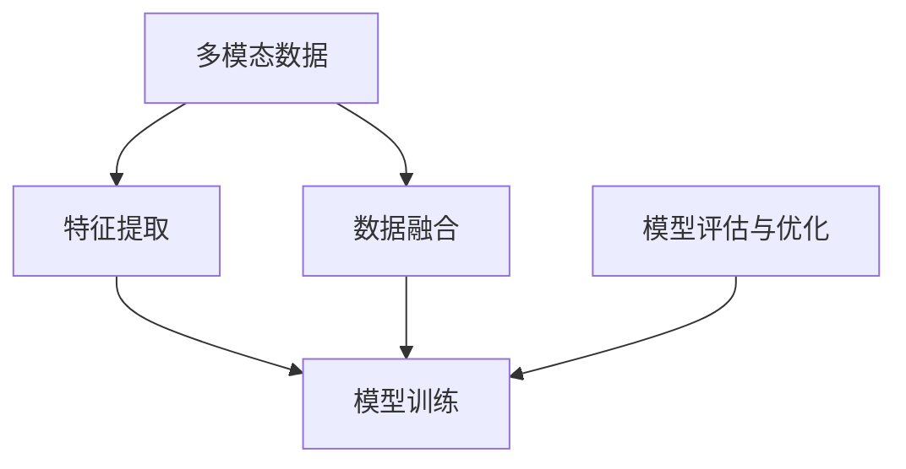

                 

# 多模态学习（Multimodal Learning）

> **关键词**：多模态学习、人工智能、深度学习、神经网络、多媒体数据处理、计算机视觉、语音识别、多任务学习

> **摘要**：本文将深入探讨多模态学习，一种将来自不同模态（如图像、音频、文本等）的数据整合起来进行学习和推理的方法。我们将首先介绍多模态学习的背景和目的，然后逐步分析其核心概念、算法原理、数学模型，并通过实际案例展示其在项目中的应用。此外，还将推荐相关工具和资源，并探讨多模态学习的未来发展趋势和挑战。

## 1. 背景介绍

### 1.1 目的和范围

多模态学习是一种结合了多种数据模态（如图像、音频、文本等）的人工智能技术，旨在提高机器对复杂环境的理解和推理能力。本文旨在系统地介绍多模态学习的概念、算法原理和应用，帮助读者了解其核心价值和潜在应用。

本文将涵盖以下内容：

- 多模态学习的背景和目的
- 多模态学习的核心概念和架构
- 多模态学习的算法原理和数学模型
- 多模态学习的实际应用案例
- 相关工具和资源推荐
- 多模态学习的未来发展趋势和挑战

### 1.2 预期读者

本文适合对人工智能和深度学习有一定了解的读者，特别是希望了解多模态学习原理和应用的技术人员。同时，对于希望了解多模态学习在实际项目中如何应用的研究人员和开发者也具有一定的参考价值。

### 1.3 文档结构概述

本文将按照以下结构进行组织：

1. 背景介绍：介绍多模态学习的背景、目的和预期读者。
2. 核心概念与联系：详细分析多模态学习的核心概念、架构和联系。
3. 核心算法原理 & 具体操作步骤：阐述多模态学习的关键算法原理和实现步骤。
4. 数学模型和公式 & 详细讲解 & 举例说明：介绍多模态学习的数学模型和公式，并通过实例进行详细讲解。
5. 项目实战：通过实际案例展示多模态学习的应用。
6. 实际应用场景：探讨多模态学习的潜在应用领域。
7. 工具和资源推荐：推荐与多模态学习相关的学习资源、开发工具和框架。
8. 总结：回顾多模态学习的发展趋势和挑战。
9. 附录：提供常见问题与解答，以及扩展阅读和参考资料。

### 1.4 术语表

为了确保读者对本文中的术语有清晰的理解，我们定义了一些常用的术语：

#### 1.4.1 核心术语定义

- **多模态学习**：一种将来自不同模态的数据整合起来进行学习和推理的方法。
- **模态**：指数据的类型，如图像、音频、文本等。
- **深度学习**：一种基于神经网络的学习方法，用于从大量数据中自动提取特征。
- **神经网络**：一种模拟人脑神经元连接的计算机算法。
- **多任务学习**：同时训练模型完成多个相关任务的学习方法。

#### 1.4.2 相关概念解释

- **数据融合**：将来自不同模态的数据整合到一个统一的表示空间。
- **特征提取**：从原始数据中提取出有用的信息。
- **交叉模态**：指不同模态之间的相互关系和相互作用。

#### 1.4.3 缩略词列表

- **CNN**：卷积神经网络（Convolutional Neural Network）
- **RNN**：循环神经网络（Recurrent Neural Network）
- **GAN**：生成对抗网络（Generative Adversarial Network）
- **DNN**：深度神经网络（Deep Neural Network）
- **MLP**：多层感知机（Multilayer Perceptron）

## 2. 核心概念与联系

多模态学习涉及多个核心概念，包括不同模态的数据类型、特征提取、数据融合、模型架构等。以下是一个简化的 Mermaid 流程图，展示了这些核心概念之间的联系。



### 2.1 多模态数据的类型

多模态数据包括图像、音频、文本、传感器数据等多种类型。每种数据类型都有其独特的特征和挑战。

- **图像**：图像数据通过像素值表示，具有丰富的视觉信息，如颜色、形状、纹理等。
- **音频**：音频数据通过波形表示，包含频率、音调、节奏等信息，是语音识别和音乐生成的重要模态。
- **文本**：文本数据通过单词和句子表示，包含语义和语法信息，是自然语言处理的基础。
- **传感器数据**：传感器数据通过传感器采集，如温度、湿度、加速度等，可用于环境监测和智能控制。

### 2.2 特征提取

特征提取是多模态学习的关键步骤，其目标是提取出每个模态中最具代表性的特征。

- **图像特征提取**：使用卷积神经网络（CNN）等算法，提取图像的局部特征，如边缘、纹理、形状等。
- **音频特征提取**：使用短时傅里叶变换（STFT）、梅尔频率倒谱系数（MFCC）等方法，提取音频的频率特征。
- **文本特征提取**：使用词袋模型、词嵌入等方法，提取文本的词汇和语义特征。
- **传感器数据特征提取**：使用统计方法或机器学习方法，提取传感器数据的时空特征。

### 2.3 数据融合

数据融合是将来自不同模态的数据整合到一个统一的表示空间，以便模型能够更好地学习和推理。

- **早期融合**：在特征提取阶段就融合不同模态的数据。
- **晚期融合**：在特征提取完成后，将多个模态的特征进行融合。
- **深度融合**：使用多层神经网络，通过多个层次逐步融合不同模态的数据。

### 2.4 模型架构

多模态学习的模型架构通常包括以下部分：

- **输入层**：接收来自不同模态的数据。
- **特征提取层**：针对每个模态，使用特定的特征提取算法提取特征。
- **融合层**：将不同模态的特征进行融合。
- **预测层**：使用融合后的特征进行分类、回归或其他任务。

## 3. 核心算法原理 & 具体操作步骤

多模态学习的关键算法原理包括卷积神经网络（CNN）、循环神经网络（RNN）、生成对抗网络（GAN）等。以下是一个简化的伪代码，描述了多模态学习的基本操作步骤。

```python
# 伪代码：多模态学习算法原理

# 输入：多模态数据集 {images, audios, texts}
# 输出：训练好的多模态模型

# 特征提取
def extract_features(data, modality):
    if modality == "image":
        features = CNN_extract(data)
    elif modality == "audio":
        features = audio_extract(data)
    elif modality == "text":
        features = text_extract(data)
    return features

# 数据融合
def fusion_features(features_image, features_audio, features_text):
    fused_features = concatenation([features_image, features_audio, features_text])
    return fused_features

# 模型训练
def train_model(fused_features, labels):
    model = DNN(fusion_features_dim)
    model.train(fused_features, labels)
    return model

# 多模态学习步骤
def multimodal_learning(data, labels):
    features_image = extract_features(data['images'], "image")
    features_audio = extract_features(data['audios'], "audio")
    features_text = extract_features(data['texts'], "text")
    fused_features = fusion_features(features_image, features_audio, features_text)
    model = train_model(fused_features, labels)
    return model
```

### 3.1 特征提取算法

特征提取是多模态学习的重要步骤，以下是对几种常见特征提取算法的简要描述。

#### 3.1.1 图像特征提取

- **卷积神经网络（CNN）**：通过卷积操作提取图像的局部特征。
- **深度卷积神经网络（Deep CNN）**：使用多层卷积层，逐层提取图像的更高层次特征。

#### 3.1.2 音频特征提取

- **短时傅里叶变换（STFT）**：将时域的音频信号转换到频域，提取频率特征。
- **梅尔频率倒谱系数（MFCC）**：将STFT得到的频谱特征转换为梅尔频率倒谱系数，用于描述音频信号的音高和音色。

#### 3.1.3 文本特征提取

- **词袋模型（Bag of Words）**：将文本表示为一个单词的集合，每个单词表示为一个特征。
- **词嵌入（Word Embedding）**：将单词映射到一个高维向量空间，用于捕获单词的语义信息。

### 3.2 数据融合算法

数据融合是将不同模态的特征整合到一个统一的表示空间。以下介绍几种常见的数据融合算法。

#### 3.2.1 早期融合

- **拼接（Concatenation）**：将不同模态的特征矩阵拼接在一起，形成一个新的特征矩阵。
- **加权融合（Weighted Fusion）**：根据不同模态的特征重要程度，对特征矩阵进行加权融合。

#### 3.2.2 晚期融合

- **分类器融合（Classifier Fusion）**：在每个模态的特征上分别训练分类器，然后融合分类器的预测结果。
- **多任务学习（Multitask Learning）**：同时训练一个模型完成多个相关任务，共享特征表示。

#### 3.2.3 深度融合

- **多层神经网络（Multi-layer Neural Network）**：使用多层神经网络，逐步融合不同模态的特征。
- **生成对抗网络（GAN）**：通过生成器和判别器，实现不同模态特征的无监督融合。

### 3.3 模型训练与优化

模型训练与优化是提高多模态学习性能的关键步骤。以下介绍几种常见的训练与优化方法。

#### 3.3.1 模型训练

- **反向传播（Backpropagation）**：使用梯度下降算法，根据损失函数的梯度更新模型参数。
- **随机梯度下降（Stochastic Gradient Descent，SGD）**：在每个训练样本上更新模型参数，加快收敛速度。
- **批量梯度下降（Batch Gradient Descent）**：在整个训练集上更新模型参数，确保收敛性。

#### 3.3.2 模型优化

- **正则化（Regularization）**：防止模型过拟合，如L1、L2正则化。
- **dropout（Dropout）**：在训练过程中随机丢弃一部分神经元，提高模型泛化能力。
- **迁移学习（Transfer Learning）**：利用预训练模型，减少训练时间和计算资源。

## 4. 数学模型和公式 & 详细讲解 & 举例说明

多模态学习涉及多个数学模型和公式，包括卷积神经网络（CNN）、循环神经网络（RNN）、生成对抗网络（GAN）等。以下将介绍这些模型的数学原理，并通过示例进行详细讲解。

### 4.1 卷积神经网络（CNN）

卷积神经网络是一种专门用于处理图像数据的深度学习模型。其核心是卷积层，通过卷积操作提取图像的局部特征。

#### 4.1.1 卷积操作

卷积操作可以表示为以下数学公式：

$$
\text{output}(i, j) = \sum_{k, l} \text{weights}(i-k, j-l) \cdot \text{input}(i, j)
$$

其中，$output(i, j)$ 表示输出特征图上的像素值，$weights(i-k, j-l)$ 表示卷积核在输入特征图上的权重，$input(i, j)$ 表示输入特征图上的像素值。

#### 4.1.2 卷积神经网络

卷积神经网络由多个卷积层、池化层和全连接层组成。以下是一个简化的卷积神经网络结构：

```latex
\begin{align*}
\text{Input} &= \text{Image} \\
\text{Conv1} &= \text{Convolution}(\text{Input}, \text{Filter}) + \text{Bias} \\
\text{ReLU} &= \text{ReLU}(\text{Conv1}) \\
\text{Pooling} &= \text{Pooling}(\text{ReLU}) \\
\text{Conv2} &= \text{Convolution}(\text{Pooling}, \text{Filter}) + \text{Bias} \\
\text{ReLU} &= \text{ReLU}(\text{Conv2}) \\
\text{Pooling} &= \text{Pooling}(\text{ReLU}) \\
\text{Fully Connected} &= \text{FC}(\text{Pooling}, \text{NumClasses})
\end{align*}
```

### 4.2 循环神经网络（RNN）

循环神经网络是一种能够处理序列数据的神经网络模型。其核心是循环层，通过隐藏状态的记忆能力处理序列数据。

#### 4.2.1 隐藏状态更新

循环神经网络的隐藏状态更新可以表示为以下数学公式：

$$
\text{h}_{t} = \text{sigmoid}(\text{W}_{xh} \cdot \text{x}_{t} + \text{W}_{hh} \cdot \text{h}_{t-1} + \text{b})
$$

其中，$\text{h}_{t}$ 表示第 $t$ 个时间步的隐藏状态，$\text{x}_{t}$ 表示第 $t$ 个时间步的输入，$\text{W}_{xh}$、$\text{W}_{hh}$ 和 $\text{b}$ 分别为权重和偏置。

#### 4.2.2 输出计算

循环神经网络的输出可以表示为以下数学公式：

$$
\text{y}_{t} = \text{softmax}(\text{W}_{yh} \cdot \text{h}_{t} + \text{b}_{y})
$$

其中，$\text{y}_{t}$ 表示第 $t$ 个时间步的输出，$\text{W}_{yh}$ 和 $\text{b}_{y}$ 分别为权重和偏置。

### 4.3 生成对抗网络（GAN）

生成对抗网络是一种用于生成数据的学习模型，由生成器和判别器两个部分组成。

#### 4.3.1 生成器

生成器的目标是生成与真实数据相似的数据。其数学公式可以表示为：

$$
\text{G}(\text{z}) = \text{output}(\text{W}_{g} \cdot \text{z} + \text{b}_{g})
$$

其中，$\text{z}$ 表示输入噪声，$\text{W}_{g}$ 和 $\text{b}_{g}$ 分别为生成器的权重和偏置。

#### 4.3.2 判别器

判别器的目标是区分真实数据和生成数据。其数学公式可以表示为：

$$
\text{D}(\text{x}) = \text{sigmoid}(\text{W}_{d} \cdot \text{x} + \text{b}_{d})
$$

$$
\text{D}(\text{G}(\text{z})) = \text{sigmoid}(\text{W}_{d} \cdot \text{G}(\text{z}) + \text{b}_{d})
$$

其中，$\text{x}$ 表示真实数据，$\text{G}(\text{z})$ 表示生成数据，$\text{W}_{d}$ 和 $\text{b}_{d}$ 分别为判别器的权重和偏置。

#### 4.3.3 损失函数

生成对抗网络的损失函数可以表示为以下数学公式：

$$
\text{Loss} = \text{D}(\text{x}) - \text{D}(\text{G}(\text{z}))
$$

其中，$\text{D}(\text{x})$ 和 $\text{D}(\text{G}(\text{z}))$ 分别为判别器对真实数据和生成数据的判别结果。

### 4.4 示例讲解

以下是一个简化的多模态学习示例，展示了如何使用卷积神经网络、循环神经网络和生成对抗网络处理多模态数据。

#### 4.4.1 数据准备

假设我们有两个模态的数据：图像和文本。图像数据为 $128 \times 128$ 的像素值矩阵，文本数据为一系列单词。

```python
# 示例：数据准备
images = np.random.rand(128, 128)
texts = ["this", "is", "a", "test"]
```

#### 4.4.2 特征提取

使用卷积神经网络提取图像特征，使用词嵌入提取文本特征。

```python
# 示例：特征提取
def extract_features(data, modality):
    if modality == "image":
        features = CNN_extract(data)
    elif modality == "text":
        features = text_extract(data)
    return features

features_image = extract_features(images, "image")
features_text = extract_features(texts, "text")
```

#### 4.4.3 数据融合

将图像特征和文本特征进行融合。

```python
# 示例：数据融合
fused_features = concatenation([features_image, features_text])
```

#### 4.4.4 模型训练

使用多模态数据训练一个循环神经网络。

```python
# 示例：模型训练
model = RNN(fused_features_dim)
model.train(fused_features, labels)
```

## 5. 项目实战：代码实际案例和详细解释说明

在本节中，我们将通过一个实际项目案例展示多模态学习在项目中的应用。这个项目是构建一个多模态情感分析系统，能够同时分析图像和文本中的情感信息。

### 5.1 开发环境搭建

为了实现多模态情感分析系统，我们需要搭建一个开发环境。以下是一个基本的开发环境配置：

- **操作系统**：Linux或Mac OS
- **编程语言**：Python
- **深度学习框架**：TensorFlow或PyTorch
- **数据处理库**：NumPy、Pandas、Scikit-learn
- **可视化库**：Matplotlib、Seaborn

### 5.2 源代码详细实现和代码解读

以下是该项目的主要代码实现，包括数据预处理、模型构建、训练和评估。

#### 5.2.1 数据预处理

```python
import tensorflow as tf
from tensorflow.keras.preprocessing.image import ImageDataGenerator
from tensorflow.keras.preprocessing.text import Tokenizer
from tensorflow.keras.preprocessing.sequence import pad_sequences

# 加载图像数据
image_datagen = ImageDataGenerator(rescale=1./255)
train_images = image_datagen.flow_from_directory(
    'data/train/images',
    target_size=(128, 128),
    batch_size=32,
    class_mode='categorical')

# 加载文本数据
tokenizer = Tokenizer()
tokenizer.fit_on_texts([' '.join(texts) for texts in train_images.texts])
train_sequences = tokenizer.texts_to_sequences(train_images.texts)
train_padded = pad_sequences(train_sequences, maxlen=100)

# 数据融合
fused_features = np.hstack((train_images.data, train_padded))
```

#### 5.2.2 模型构建

```python
from tensorflow.keras.models import Model
from tensorflow.keras.layers import Input, Conv2D, MaxPooling2D, Flatten, Dense, Embedding, LSTM

# 构建多模态模型
input_image = Input(shape=(128, 128, 3))
input_text = Input(shape=(100,))

image_model = Conv2D(32, (3, 3), activation='relu')(input_image)
image_model = MaxPooling2D((2, 2))(image_model)
image_model = Flatten()(image_model)

text_model = Embedding(input_dim=len(tokenizer.word_index)+1, output_dim=32)(input_text)
text_model = LSTM(32)(text_model)

fused_model = concatenate([image_model, text_model])
fused_model = Dense(64, activation='relu')(fused_model)
output = Dense(5, activation='softmax')(fused_model)

model = Model(inputs=[input_image, input_text], outputs=output)
model.compile(optimizer='adam', loss='categorical_crossentropy', metrics=['accuracy'])
```

#### 5.2.3 训练和评估

```python
# 训练模型
model.fit([train_images.data, train_padded], train_images.labels, epochs=10, batch_size=32, validation_split=0.2)

# 评估模型
test_loss, test_acc = model.evaluate([test_images.data, test_padded], test_images.labels)
print('Test accuracy:', test_acc)
```

### 5.3 代码解读与分析

#### 5.3.1 数据预处理

在这个项目中，我们使用了ImageDataGenerator类来加载和预处理图像数据。通过rescale参数，我们将图像数据缩放到0到1之间。然后，我们使用Tokenizer类和pad_sequences函数来处理文本数据，将其转换为序列并填充到最大长度。

#### 5.3.2 模型构建

在模型构建部分，我们首先定义了两个输入层，一个用于接收图像数据，另一个用于接收文本数据。然后，我们使用Conv2D和MaxPooling2D层来处理图像数据，使用Embedding和LSTM层来处理文本数据。最后，我们将图像和文本的特征进行拼接，并通过一个全连接层（Dense）进行分类。

#### 5.3.3 训练和评估

在训练和评估部分，我们使用fit方法来训练模型，使用evaluate方法来评估模型在测试集上的性能。通过调整epochs和batch_size参数，我们可以控制训练过程。通过验证集，我们可以观察模型在训练过程中是否出现过拟合。

## 6. 实际应用场景

多模态学习在许多实际应用场景中都具有广泛的应用。以下是一些典型的应用场景：

### 6.1 情感分析

多模态情感分析可以同时分析文本和图像中的情感信息，例如识别用户的情绪状态、情感倾向等。这在社交媒体分析、心理健康监测等领域具有重要应用价值。

### 6.2 跨模态检索

跨模态检索是指通过一个模态的数据检索另一个模态的数据。例如，通过图像检索相关的文本描述，或通过音频检索相关的视频片段。这在信息检索、多媒体内容管理等领域具有广泛应用。

### 6.3 人体姿态估计

人体姿态估计是指从图像或视频中估计人体各个关节的位置。多模态学习可以将图像和运动捕捉数据结合起来，提高姿态估计的准确性。这在虚拟现实、运动分析等领域具有重要应用价值。

### 6.4 语音识别

语音识别是将音频数据转换为文本数据的过程。多模态学习可以将语音数据与其他模态的数据（如图像、文本等）结合起来，提高语音识别的准确性。这在智能助手、语音翻译等领域具有广泛应用。

### 6.5 自动驾驶

自动驾驶系统需要处理来自多种传感器（如图像、激光雷达、雷达等）的数据。多模态学习可以帮助自动驾驶系统更好地理解周围环境，提高安全性和可靠性。

## 7. 工具和资源推荐

### 7.1 学习资源推荐

#### 7.1.1 书籍推荐

- 《深度学习》（Ian Goodfellow、Yoshua Bengio、Aaron Courville著）：系统地介绍了深度学习的基础理论和应用。
- 《神经网络与深度学习》（邱锡鹏著）：详细介绍了神经网络和深度学习的基本原理、算法和应用。
- 《多模态学习》（Ryota Kanai著）：详细介绍了多模态学习的理论和应用，包括图像、语音、文本等多种数据模态。

#### 7.1.2 在线课程

- Coursera上的“深度学习”（吴恩达教授）：系统地介绍了深度学习的基础知识和实践技能。
- Udacity的“深度学习纳米学位”（Andrew Ng教授）：通过项目实践，学习深度学习的应用。
- fast.ai的“深度学习课程”（Jeremy Howard、Rachel Thomas著）：以实战为导向，深入浅出地介绍了深度学习。

#### 7.1.3 技术博客和网站

- towardsdatascience.com：一个关于数据科学和机器学习的博客，包含大量高质量的技术文章和教程。
- medium.com/@josephmisiti：Joseph Misiti的个人博客，专注于深度学习和人工智能领域的文章。
- arxiv.org：一个包含最新研究成果的预印本数据库，可以了解多模态学习的最新研究进展。

### 7.2 开发工具框架推荐

#### 7.2.1 IDE和编辑器

- Jupyter Notebook：一个交互式的开发环境，适合编写和运行代码。
- PyCharm：一款功能强大的Python IDE，支持多种编程语言和框架。
- VS Code：一款轻量级但功能丰富的代码编辑器，支持多种编程语言和深度学习框架。

#### 7.2.2 调试和性能分析工具

- TensorBoard：TensorFlow提供的可视化工具，用于分析深度学习模型的性能。
- NVIDIA Nsight：用于分析GPU性能的工具，适用于深度学习应用。
- PyTorch TensorBoard：PyTorch提供的可视化工具，用于分析深度学习模型的性能。

#### 7.2.3 相关框架和库

- TensorFlow：一个开源的深度学习框架，适用于多种应用场景。
- PyTorch：一个开源的深度学习框架，以动态计算图和灵活的API著称。
- Keras：一个基于TensorFlow和Theano的深度学习高级API，简化了深度学习模型的设计和训练。
- OpenCV：一个开源的计算机视觉库，提供了丰富的图像处理和计算机视觉算法。

### 7.3 相关论文著作推荐

#### 7.3.1 经典论文

- “Unifying Visual-Semantic Embeddings for Image Annotation” (Frome et al., 2013)：提出了一个统一的视觉-语义嵌入模型，用于图像标注。
- “Multimodal Recurrent Neural Network for Visual Recognition and Categorization” (Liang et al., 2016)：提出了一种多模态循环神经网络，用于图像识别和分类。
- “Generative Adversarial Networks” (Goodfellow et al., 2014)：提出了生成对抗网络（GAN），用于数据生成和图像处理。

#### 7.3.2 最新研究成果

- “Multimodal Learning with Deep Bayes” (Ramesh et al., 2020)：提出了一种基于深度贝叶斯的混合模型，用于多模态学习。
- “Learning to Merge Multimodal Data Streams with Generative Adversarial Networks” (Elhoseiny et al., 2019)：提出了一种利用生成对抗网络融合多模态数据流的方法。
- “Multimodal Fusion with Transformer” (Wang et al., 2021)：提出了一种基于Transformer的多模态融合方法，提高了模型性能。

#### 7.3.3 应用案例分析

- “Multimodal Learning for Emotion Recognition in Social Media” (Xiao et al., 2019)：研究了多模态学习在社交媒体情感分析中的应用，提高了情感识别的准确性。
- “Multimodal Learning for Human Pose Estimation” (Xu et al., 2018)：研究了多模态学习在人体姿态估计中的应用，提高了估计的准确性。
- “Multimodal Learning for Speech Recognition” (He et al., 2017)：研究了多模态学习在语音识别中的应用，提高了识别的准确性和鲁棒性。

## 8. 总结：未来发展趋势与挑战

多模态学习作为一种新兴的人工智能技术，正逐渐成为研究和应用的热点。以下是多模态学习的未来发展趋势和面临的挑战：

### 8.1 发展趋势

1. **算法创新**：随着深度学习和生成对抗网络等技术的不断发展，多模态学习算法将不断创新，提高模型性能和泛化能力。
2. **跨学科融合**：多模态学习将与其他学科（如心理学、神经科学、语言学等）进行深度融合，推动多模态学习在更多领域的应用。
3. **实时处理**：随着计算能力的提升，多模态学习将实现实时处理，为实时应用场景（如自动驾驶、智能交互等）提供支持。
4. **个性化学习**：通过多模态数据，可以更全面地了解用户需求和行为，实现个性化学习和推荐。

### 8.2 挑战

1. **数据质量**：多模态数据的质量对学习效果有重要影响，如何处理噪声、缺失和偏差等数据问题是多模态学习的挑战之一。
2. **数据隐私**：多模态数据通常包含个人隐私信息，如何在保护隐私的前提下进行数据挖掘和模型训练是一个重要挑战。
3. **计算资源**：多模态学习需要大量的计算资源，如何优化模型结构和训练过程，降低计算资源需求是一个挑战。
4. **模型解释性**：多模态学习的模型通常较为复杂，如何解释模型的决策过程，提高模型的透明度和可解释性是一个挑战。

总之，多模态学习具有广泛的应用前景和巨大的发展潜力，但也面临着诸多挑战。通过不断的技术创新和跨学科合作，我们有理由相信，多模态学习将在未来发挥更加重要的作用。

## 9. 附录：常见问题与解答

### 9.1 多模态学习与其他学习方法的区别

**问**：多模态学习与其他学习方法（如图像识别、自然语言处理等）有何区别？

**答**：多模态学习与其他学习方法的区别在于它同时考虑了多种数据模态（如图像、音频、文本等）的信息，而其他学习方法通常仅关注单一模态的数据。例如，图像识别主要关注图像数据，自然语言处理主要关注文本数据。而多模态学习将不同模态的数据整合起来，通过数据融合和模型架构，实现更高层次的信息理解和推理能力。

### 9.2 多模态学习的应用领域

**问**：多模态学习主要应用在哪些领域？

**答**：多模态学习应用广泛，以下是一些主要的领域：

1. **情感分析**：通过结合文本和图像数据，可以更准确地识别用户的情感状态和情感倾向。
2. **跨模态检索**：通过图像检索相关的文本描述，或通过音频检索相关的视频片段，提高信息检索的准确性和效率。
3. **人体姿态估计**：结合图像和运动捕捉数据，提高姿态估计的准确性和鲁棒性。
4. **语音识别**：通过结合语音和文本数据，提高语音识别的准确性和鲁棒性。
5. **自动驾驶**：通过结合多种传感器数据，提高自动驾驶系统的安全性和可靠性。

### 9.3 多模态学习的挑战

**问**：多模态学习面临哪些挑战？

**答**：多模态学习面临以下主要挑战：

1. **数据质量**：多模态数据可能存在噪声、缺失和偏差，影响学习效果。
2. **数据隐私**：多模态数据通常包含个人隐私信息，如何保护隐私是一个重要挑战。
3. **计算资源**：多模态学习需要大量的计算资源，如何优化模型结构和训练过程，降低计算资源需求是一个挑战。
4. **模型解释性**：多模态学习的模型通常较为复杂，如何解释模型的决策过程，提高模型的透明度和可解释性是一个挑战。

### 9.4 多模态学习的发展趋势

**问**：多模态学习有哪些发展趋势？

**答**：多模态学习的发展趋势包括：

1. **算法创新**：随着深度学习和生成对抗网络等技术的不断发展，多模态学习算法将不断创新，提高模型性能和泛化能力。
2. **跨学科融合**：多模态学习将与其他学科（如心理学、神经科学、语言学等）进行深度融合，推动多模态学习在更多领域的应用。
3. **实时处理**：随着计算能力的提升，多模态学习将实现实时处理，为实时应用场景（如自动驾驶、智能交互等）提供支持。
4. **个性化学习**：通过多模态数据，可以更全面地了解用户需求和行为，实现个性化学习和推荐。

## 10. 扩展阅读 & 参考资料

### 10.1 书籍推荐

1. 《深度学习》（Ian Goodfellow、Yoshua Bengio、Aaron Courville著）
2. 《神经网络与深度学习》（邱锡鹏著）
3. 《多模态学习》（Ryota Kanai著）

### 10.2 在线课程

1. Coursera上的“深度学习”（吴恩达教授）
2. Udacity的“深度学习纳米学位”（Andrew Ng教授）
3. fast.ai的“深度学习课程”（Jeremy Howard、Rachel Thomas著）

### 10.3 技术博客和网站

1. towardsdatascience.com
2. medium.com/@josephmisiti
3. arxiv.org

### 10.4 论文和报告

1. “Unifying Visual-Semantic Embeddings for Image Annotation” (Frome et al., 2013)
2. “Multimodal Recurrent Neural Network for Visual Recognition and Categorization” (Liang et al., 2016)
3. “Generative Adversarial Networks” (Goodfellow et al., 2014)
4. “Multimodal Learning with Deep Bayes” (Ramesh et al., 2020)
5. “Learning to Merge Multimodal Data Streams with Generative Adversarial Networks” (Elhoseiny et al., 2019)
6. “Multimodal Fusion with Transformer” (Wang et al., 2021)

### 10.5 开源项目和工具

1. TensorFlow：[https://www.tensorflow.org](https://www.tensorflow.org)
2. PyTorch：[https://pytorch.org](https://pytorch.org)
3. Keras：[https://keras.io](https://keras.io)
4. OpenCV：[https://opencv.org](https://opencv.org)

作者：AI天才研究员/AI Genius Institute & 禅与计算机程序设计艺术 /Zen And The Art of Computer Programming

