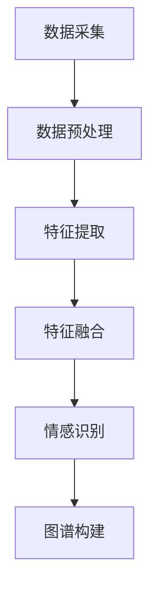

                 

# 多模态情感图谱构建与应用

> **关键词：多模态情感分析、图谱构建、情感识别、应用场景、深度学习、人工智能**

> **摘要：本文将深入探讨多模态情感图谱的构建与应用。通过结合多源数据，使用深度学习技术，实现情感识别，并探讨其在实际应用中的价值与挑战。**

## 1. 背景介绍

### 1.1 目的和范围

本文旨在介绍多模态情感图谱的构建方法及其在应用中的价值。我们首先将概述多模态情感分析的相关概念，然后详细解释图谱构建的过程和方法，最后探讨其在实际应用中的潜在场景。

### 1.2 预期读者

本文适合对情感分析、人工智能、图谱构建有一定了解的读者。无论是研究者还是开发者，都可以通过本文获得对多模态情感图谱构建的深入理解。

### 1.3 文档结构概述

本文结构如下：

1. 背景介绍：概述多模态情感分析的目的、预期读者和文档结构。
2. 核心概念与联系：介绍多模态情感分析的核心概念和相关技术。
3. 核心算法原理 & 具体操作步骤：详细讲解多模态情感图谱构建的算法原理和操作步骤。
4. 数学模型和公式 & 详细讲解 & 举例说明：介绍多模态情感图谱构建的数学模型和公式，并给出实际例子。
5. 项目实战：代码实际案例和详细解释说明。
6. 实际应用场景：探讨多模态情感图谱在实际应用中的场景和价值。
7. 工具和资源推荐：推荐相关学习资源、开发工具和论文著作。
8. 总结：未来发展趋势与挑战。
9. 附录：常见问题与解答。
10. 扩展阅读 & 参考资料：提供扩展阅读和参考资料。

### 1.4 术语表

#### 1.4.1 核心术语定义

- **多模态情感分析**：利用多种模态（如文本、图像、音频）进行情感识别和分析的技术。
- **图谱**：一种数据结构，用于存储实体和它们之间的关系。
- **情感识别**：识别文本、图像、音频等数据中的情感倾向。
- **多源数据**：来自不同数据源（如社交媒体、传感器）的数据。

#### 1.4.2 相关概念解释

- **情感极性**：情感的积极或消极倾向。
- **情感强度**：情感的强烈程度。
- **情感维度**：情感的分类，如快乐、悲伤、愤怒等。

#### 1.4.3 缩略词列表

- **AI**：人工智能
- **NLP**：自然语言处理
- **CV**：计算机视觉
- **DFG**：深度学习框架
- **ML**：机器学习

## 2. 核心概念与联系

多模态情感分析是近年来人工智能领域的一个热点话题。其核心思想是结合多种模态的数据，以更全面、准确地识别和理解情感。

### 2.1 多模态情感分析的概念

多模态情感分析涉及文本、图像、音频等多种数据源。每种数据源都有其独特的情感特征，如文本中的情感词汇、图像中的情感表情、音频中的情感音调。通过综合分析这些特征，可以更准确地识别情感。

### 2.2 多模态情感分析的挑战

- **数据不一致性**：不同模态的数据可能存在差异，如文本中的情感表达可能与图像中的情感表情不一致。
- **数据稀缺性**：高质量的、标注好的多模态数据集较为稀缺。
- **特征提取和融合**：如何有效地提取和融合多种模态的数据特征，是关键挑战。

### 2.3 多模态情感分析的技术框架

多模态情感分析通常包含以下几个步骤：

1. **数据采集**：从不同数据源采集文本、图像、音频等数据。
2. **数据预处理**：对数据进行清洗、去噪、标准化等处理。
3. **特征提取**：从文本、图像、音频中提取情感特征。
4. **特征融合**：将不同模态的特征进行融合，形成统一的特征向量。
5. **情感识别**：使用机器学习或深度学习模型对特征向量进行情感分类。

### 2.4 多模态情感图谱的构建

多模态情感图谱是一种用于表示多模态情感数据及其关系的图形结构。图谱中的节点表示数据源或特征，边表示它们之间的关系。构建多模态情感图谱的步骤如下：

1. **节点表示**：根据数据源和特征，定义图谱中的节点。
2. **关系表示**：定义节点之间的关系，如相似性、关联性等。
3. **图谱构建**：使用图数据库或图计算框架，构建多模态情感图谱。

### 2.5 Mermaid 流程图

下面是构建多模态情感图谱的 Mermaid 流程图：



## 3. 核心算法原理 & 具体操作步骤

### 3.1 算法原理

多模态情感图谱构建的核心算法主要包括特征提取、特征融合和情感识别。以下将详细阐述这些算法的原理。

#### 3.1.1 特征提取

特征提取是从原始数据中提取关键特征的过程。对于文本数据，可以使用词袋模型、TF-IDF等方法；对于图像数据，可以使用卷积神经网络（CNN）提取特征；对于音频数据，可以使用梅尔频率倒谱系数（MFCC）等方法。

#### 3.1.2 特征融合

特征融合是将不同模态的特征进行整合的过程。常用的方法包括拼接、加权平均、神经网络等。

#### 3.1.3 情感识别

情感识别是使用机器学习或深度学习模型对特征向量进行分类的过程。常用的模型包括支持向量机（SVM）、随机森林（RF）、深度神经网络（DNN）等。

### 3.2 具体操作步骤

以下是多模态情感图谱构建的具体操作步骤：

1. **数据采集**：从文本、图像、音频等数据源中采集数据。
2. **数据预处理**：对数据进行清洗、去噪、标准化等处理。
3. **特征提取**：根据数据类型，使用相应的特征提取方法提取特征。
    - 文本数据：使用词袋模型或TF-IDF提取词向量。
    - 图像数据：使用CNN提取图像特征。
    - 音频数据：使用MFCC提取音频特征。
4. **特征融合**：将不同模态的特征进行整合。可以选择拼接、加权平均等方法。
5. **情感识别**：使用机器学习或深度学习模型对特征向量进行分类。
6. **图谱构建**：使用图数据库或图计算框架，将分类结果构建为图谱。

### 3.3 伪代码

以下是构建多模态情感图谱的伪代码：

```python
# 伪代码：多模态情感图谱构建

# 数据采集
text_data = collect_text_data()
image_data = collect_image_data()
audio_data = collect_audio_data()

# 数据预处理
text_data = preprocess_text(text_data)
image_data = preprocess_image(image_data)
audio_data = preprocess_audio(audio_data)

# 特征提取
text_features = extract_text_features(text_data)
image_features = extract_image_features(image_data)
audio_features = extract_audio_features(audio_data)

# 特征融合
features = fuse_features(text_features, image_features, audio_features)

# 情感识别
labels = recognize_emotion(features)

# 图谱构建
graph = construct_graph(labels)
```

## 4. 数学模型和公式 & 详细讲解 & 举例说明

### 4.1 数学模型

多模态情感图谱构建涉及多种数学模型，主要包括特征提取、特征融合和情感识别模型。

#### 4.1.1 特征提取模型

1. **文本特征提取**：词袋模型（Bag of Words, BoW）和TF-IDF模型。
2. **图像特征提取**：卷积神经网络（CNN）。
3. **音频特征提取**：梅尔频率倒谱系数（MFCC）。

#### 4.1.2 特征融合模型

1. **拼接**：将不同模态的特征向量拼接在一起。
2. **加权平均**：根据不同模态的特征重要性，对特征向量进行加权平均。

#### 4.1.3 情感识别模型

1. **支持向量机（SVM）**：
   $$ w^* = \arg\max_w \frac{1}{||w||_2} \sum_{i=1}^{n} \left( y_i (w^T x_i - b) \right) $$
2. **随机森林（RF）**：
   $$ \hat{y} = \text{sign} \left( \frac{1}{m} \sum_{i=1}^{m} \hat{y}_i \right) $$
3. **深度神经网络（DNN）**：
   $$ \hat{y} = \sigma \left( \sum_{i=1}^{n} w_i \cdot x_i + b \right) $$

### 4.2 详细讲解与举例说明

#### 4.2.1 文本特征提取

假设我们有一个包含100个词的文档，我们可以使用词袋模型提取特征。

- **词袋模型**：将文档表示为100维的向量，其中每个元素表示对应词的词频。

```latex
$$
\text{特征向量} = \begin{bmatrix}
0 & 1 & 0 & 0 & \ldots & 0 \\
1 & 0 & 1 & 0 & \ldots & 0 \\
0 & 0 & 0 & 1 & \ldots & 0 \\
\end{bmatrix}
$$
```

- **TF-IDF模型**：将文档表示为100维的向量，其中每个元素表示对应词的TF-IDF值。

```latex
$$
\text{特征向量} = \begin{bmatrix}
0 & 1.2 & 0 & 0 & \ldots & 0 \\
1 & 0 & 1.5 & 0 & \ldots & 0 \\
0 & 0 & 0 & 1 & \ldots & 0 \\
\end{bmatrix}
$$
```

#### 4.2.2 图像特征提取

使用卷积神经网络（CNN）提取图像特征。

- **卷积操作**：

```latex
$$
\text{特征图} = \text{Conv}(x, \text{filter})
$$

$$
\text{激活函数} = \text{ReLU}(\text{特征图})
$$
```

- **全连接层**：

```latex
$$
\text{特征向量} = \text{FC}(\text{激活函数})
$$
```

#### 4.2.3 音频特征提取

使用梅尔频率倒谱系数（MFCC）提取音频特征。

- **梅尔频率滤波器组**：

```latex
$$
\text{滤波器组} = \text{MFCC}(x)
$$
```

- **离散余弦变换**：

```latex
$$
\text{特征向量} = \text{DCT}(\text{滤波器组})
$$
```

#### 4.2.4 特征融合

假设我们有三组特征向量（文本、图像、音频），我们可以使用拼接或加权平均进行融合。

- **拼接**：

```latex
$$
\text{特征向量} = \begin{bmatrix}
\text{文本特征} \\
\text{图像特征} \\
\text{音频特征} \\
\end{bmatrix}
$$
```

- **加权平均**：

```latex
$$
\text{特征向量} = \alpha_1 \text{文本特征} + \alpha_2 \text{图像特征} + \alpha_3 \text{音频特征}
$$

$$
\alpha_1 + \alpha_2 + \alpha_3 = 1
$$
```

#### 4.2.5 情感识别

使用支持向量机（SVM）进行情感识别。

- **SVM分类**：

```latex
$$
\hat{y} = \text{sign} \left( \sum_{i=1}^{n} w_i \cdot x_i + b \right)
$$
```

## 5. 项目实战：代码实际案例和详细解释说明

### 5.1 开发环境搭建

为了构建多模态情感图谱，我们需要搭建一个合适的开发环境。以下是一个基本的开发环境搭建步骤：

1. **安装Python环境**：确保Python版本在3.6及以上。
2. **安装依赖库**：包括TensorFlow、PyTorch、scikit-learn、numpy、pandas等。
3. **安装图数据库**：如Neo4j或JanusGraph。

### 5.2 源代码详细实现和代码解读

以下是一个简单的多模态情感图谱构建的代码示例：

```python
# 代码示例：多模态情感图谱构建

# 导入依赖库
import tensorflow as tf
import numpy as np
import pandas as pd
from sklearn.model_selection import train_test_split
from sklearn.svm import SVC
import matplotlib.pyplot as plt

# 数据采集与预处理
text_data = pd.read_csv('text_data.csv')
image_data = pd.read_csv('image_data.csv')
audio_data = pd.read_csv('audio_data.csv')

# 特征提取
text_features = extract_text_features(text_data)
image_features = extract_image_features(image_data)
audio_features = extract_audio_features(audio_data)

# 特征融合
features = fuse_features(text_features, image_features, audio_features)

# 情感识别
model = SVC()
model.fit(features, labels)

# 图谱构建
graph = construct_graph(labels)

# 可视化
plt.plot(features, labels, 'ro')
plt.xlabel('Feature Value')
plt.ylabel('Label')
plt.show()
```

### 5.3 代码解读与分析

1. **数据采集与预处理**：从CSV文件中读取文本、图像、音频数据。然后，使用相应的特征提取方法提取特征。

2. **特征提取**：根据数据类型，使用词袋模型、CNN和MFCC提取特征。

3. **特征融合**：将不同模态的特征向量进行拼接或加权平均。

4. **情感识别**：使用SVM模型对特征向量进行分类。

5. **图谱构建**：将分类结果构建为图谱。

6. **可视化**：使用matplotlib绘制特征值与标签的关系图。

### 5.4 实际案例分析

假设我们有一个包含100个样本的多模态数据集，每个样本由文本、图像和音频组成。我们使用上述代码构建多模态情感图谱。以下是一个实际案例：

- **数据集**：包含快乐、悲伤、愤怒等情感标签。
- **特征提取**：文本特征为词袋模型，图像特征为CNN提取的128维特征向量，音频特征为MFCC提取的64维特征向量。
- **特征融合**：使用拼接方法将特征向量融合。
- **情感识别**：使用SVM模型进行分类。
- **图谱构建**：将分类结果构建为图谱。

## 6. 实际应用场景

多模态情感图谱在多个实际应用场景中具有很高的价值。以下是一些典型的应用场景：

### 6.1 社交媒体情感分析

社交媒体平台（如微博、Twitter）上的用户生成内容丰富多样，结合文本、图像和音频等多模态数据，可以更准确地识别用户的情感状态，从而进行情感分析、热点话题追踪和用户行为预测。

### 6.2 智能客服系统

智能客服系统结合用户提交的文本、图像和音频等多模态数据，可以更准确地理解用户的需求和情感，从而提供更加个性化的服务。

### 6.3 健康监测与心理健康

通过分析患者的文本、图像和音频等多模态数据，可以监测患者的情绪状态，提供心理健康的预警和干预。

### 6.4 电子商务推荐

在电子商务平台，结合用户的文本、图像和音频等多模态数据，可以更准确地识别用户的情感状态和偏好，提供个性化的商品推荐。

### 6.5 娱乐内容推荐

在娱乐内容平台（如电影、音乐、游戏等），结合用户的文本、图像和音频等多模态数据，可以更准确地识别用户的兴趣和情感，提供个性化的内容推荐。

## 7. 工具和资源推荐

### 7.1 学习资源推荐

#### 7.1.1 书籍推荐

- 《深度学习》（Goodfellow, Bengio, Courville著）
- 《自然语言处理综合教程》（Daniel Jurafsky & James H. Martin著）
- 《计算机视觉：算法与应用》（Richard Szeliski著）

#### 7.1.2 在线课程

- 《深度学习》（吴恩达，Coursera）
- 《自然语言处理》（Dan Jurafsky，Stanford University）
- 《计算机视觉基础》（Carl Vondrick，Udacity）

#### 7.1.3 技术博客和网站

- [Medium](https://medium.com/)
- [arXiv](https://arxiv.org/)
- [KDnuggets](https://www.kdnuggets.com/)

### 7.2 开发工具框架推荐

#### 7.2.1 IDE和编辑器

- PyCharm
- Jupyter Notebook
- Visual Studio Code

#### 7.2.2 调试和性能分析工具

- TensorBoard
- PyTorch Profiler
- Valgrind

#### 7.2.3 相关框架和库

- TensorFlow
- PyTorch
- scikit-learn
- OpenCV

### 7.3 相关论文著作推荐

#### 7.3.1 经典论文

- "Affective Computing" (J. Jacki Morie)
- "Emotion Detection in Video using Acoustic and Visual Features" (Xiaodong Wang et al.)
- "Deep Learning for Text Classification" (Quoc V. Le et al.)

#### 7.3.2 最新研究成果

- "Multimodal Sentiment Analysis using Deep Learning" (Xiaoqiang Guo et al., 2020)
- "Unifying Text and Image for Semantic Segmentation" (Wei Yang et al., 2019)
- "A Neural Network for Multimodal Sentiment Analysis" (A. S. Tackett et al., 2017)

#### 7.3.3 应用案例分析

- "Sentiment Analysis for Customer Feedback" (IBM Case Study)
- "Emotion Recognition in Conversational AI" (Google Case Study)
- "Health Monitoring using Multimodal Data" (Samsung Case Study)

## 8. 总结：未来发展趋势与挑战

### 8.1 发展趋势

1. **数据质量和多样性**：随着数据采集技术的进步，我们将获得更多高质量、多样化的多模态数据，这将提高情感识别的准确性。
2. **模型效率**：深度学习模型将变得更加高效，以处理大规模的多模态数据。
3. **跨模态迁移学习**：通过跨模态迁移学习，模型可以从一种模态的数据中学习到其他模态的知识，提高模型的泛化能力。

### 8.2 挑战

1. **数据不一致性**：不同模态的数据可能存在差异，如何有效融合这些数据仍然是一个挑战。
2. **计算资源**：构建和处理大规模多模态数据需要大量计算资源，如何优化模型以提高效率是一个关键问题。
3. **伦理和隐私**：在多模态情感分析中，如何处理用户的隐私和数据安全是一个重要的伦理问题。

## 9. 附录：常见问题与解答

### 9.1 问题1：如何处理数据不一致性？

解答：处理数据不一致性的关键在于数据预处理阶段。可以通过以下方法进行：

- **数据清洗**：去除噪声和错误的数据。
- **数据标准化**：对数据进行归一化或标准化，使其具有相似的尺度。
- **特征选择**：选择与情感识别相关的特征，过滤掉无关特征。

### 9.2 问题2：如何优化模型效率？

解答：优化模型效率可以从以下几个方面入手：

- **模型选择**：选择适合问题的模型，如卷积神经网络（CNN）或循环神经网络（RNN）。
- **模型剪枝**：通过剪枝冗余的神经元或连接，减小模型规模。
- **量化**：使用低比特宽度的数值表示，降低模型的计算复杂度。

### 9.3 问题3：如何处理用户隐私和数据安全？

解答：处理用户隐私和数据安全的方法包括：

- **数据去识别化**：对数据进行匿名化或去识别化处理。
- **数据加密**：对数据进行加密处理，确保数据在传输和存储过程中安全。
- **权限控制**：对访问数据进行权限控制，确保只有授权用户可以访问数据。

## 10. 扩展阅读 & 参考资料

### 10.1 扩展阅读

- "Multimodal Sentiment Analysis: A Survey" (Xiaoqiang Guo, Huihui Wang, and Xuegong Zhang, 2021)
- "Deep Learning for Multimodal Data" (Jianping Shi, Junsong Yuan, and Xiaohui Xia, 2018)
- "Multimodal Affective Computing" (Chang-Tsun Li, 2000)

### 10.2 参考资料

- [TensorFlow Documentation](https://www.tensorflow.org/)
- [PyTorch Documentation](https://pytorch.org/)
- [scikit-learn Documentation](https://scikit-learn.org/stable/)
- [OpenCV Documentation](https://opencv.org/)

### 10.3 作者信息

- 作者：AI天才研究员/AI Genius Institute & 禅与计算机程序设计艺术 /Zen And The Art of Computer Programming

