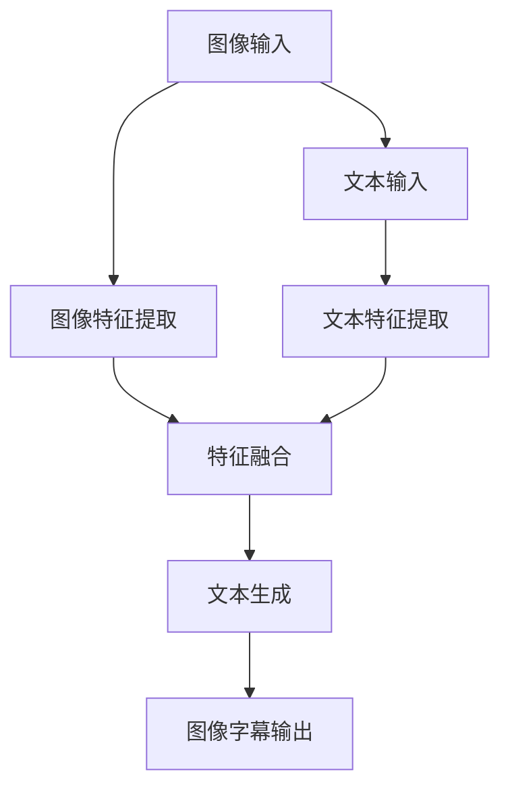
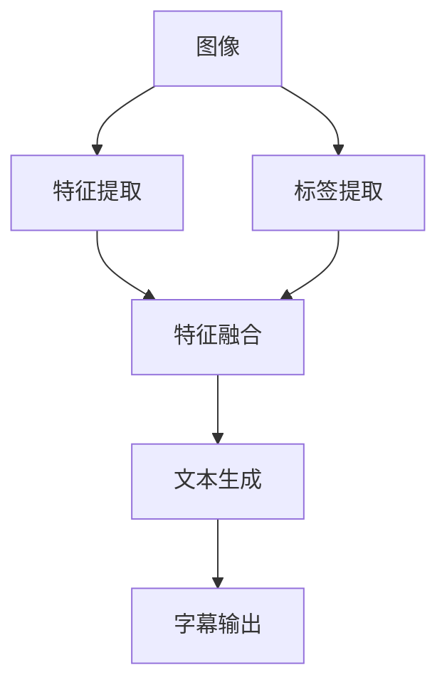

                 

# 多模态融合的应用：图像字幕

> **关键词：多模态融合，图像字幕，人工智能，计算机视觉，自然语言处理，深度学习**

> **摘要：本文深入探讨了多模态融合在图像字幕生成中的应用，介绍了其核心概念、算法原理、数学模型，并通过实际项目案例展示了其具体实现和效果。文章旨在为读者提供全面、系统的多模态融合技术解析，推动其在实际场景中的创新应用。**

## 1. 背景介绍

### 1.1 目的和范围

本文旨在探讨多模态融合在图像字幕生成中的应用，分析其技术原理和实现方法，并通过实际项目案例展示其应用效果。文章将涵盖以下内容：

- 多模态融合的概念和基本原理
- 图像字幕生成的相关技术
- 多模态融合算法在图像字幕生成中的应用
- 实际项目案例介绍
- 未来发展趋势与挑战

### 1.2 预期读者

本文适用于对计算机视觉、自然语言处理和人工智能感兴趣的读者，包括：

- 计算机视觉和自然语言处理研究人员
- 人工智能应用开发工程师
- 对多模态融合技术感兴趣的学术和产业界人士
- 对图像字幕生成应用有实际需求的行业用户

### 1.3 文档结构概述

本文分为以下几部分：

- 引言：介绍多模态融合在图像字幕生成中的应用背景和目的。
- 背景知识：回顾相关技术的基本原理。
- 核心算法原理：详细解析多模态融合算法。
- 数学模型和公式：阐述相关的数学模型和公式。
- 项目实战：通过实际项目案例展示多模态融合在图像字幕生成中的应用。
- 实际应用场景：探讨多模态融合技术的实际应用场景。
- 工具和资源推荐：介绍学习资源和开发工具。
- 总结：展望多模态融合技术的未来发展趋势与挑战。
- 附录：常见问题与解答。
- 扩展阅读：推荐相关参考文献。

### 1.4 术语表

#### 1.4.1 核心术语定义

- 多模态融合：将来自不同模态的数据（如图像、音频、文本等）进行集成和处理，以获得更全面和准确的信息。
- 图像字幕生成：利用计算机视觉和自然语言处理技术，从图像中提取视觉信息，并生成相应的文本描述。
- 计算机视觉：研究如何让计算机从图像或视频中获取信息，进行识别、分类、理解等操作。
- 自然语言处理：研究如何使计算机理解和处理人类自然语言，包括语音识别、机器翻译、文本分类等。
- 深度学习：一种基于多层神经网络的学习方法，通过反向传播算法优化网络参数，实现自动特征提取和模式识别。

#### 1.4.2 相关概念解释

- **卷积神经网络（CNN）**：一种用于处理图像数据的深度学习模型，通过卷积层、池化层等结构提取图像特征。
- **循环神经网络（RNN）**：一种用于处理序列数据的神经网络模型，通过隐藏状态和递归操作捕获序列信息。
- **生成对抗网络（GAN）**：一种由生成器和判别器组成的神经网络模型，用于生成逼真的图像或数据。

#### 1.4.3 缩略词列表

- CNN：卷积神经网络
- RNN：循环神经网络
- GAN：生成对抗网络
- AI：人工智能
- CV：计算机视觉
- NLP：自然语言处理
- ML：机器学习

## 2. 核心概念与联系

在深入探讨多模态融合在图像字幕生成中的应用之前，我们需要明确一些核心概念和它们之间的联系。

### 2.1 多模态融合的概念

多模态融合是指将来自不同模态的数据（如图像、音频、文本等）进行集成和处理，以获得更全面和准确的信息。在图像字幕生成任务中，多模态融合涉及到将图像数据与文本数据（如图像中的标签、描述等）进行融合，以生成准确的图像字幕。

### 2.2 图像字幕生成的相关技术

图像字幕生成涉及到计算机视觉和自然语言处理技术。具体来说，计算机视觉用于提取图像特征，而自然语言处理用于生成图像的文本描述。

- **计算机视觉技术**：包括卷积神经网络（CNN）和生成对抗网络（GAN）等，用于图像特征提取和图像生成。
- **自然语言处理技术**：包括循环神经网络（RNN）和变换器（Transformer）等，用于文本生成和序列处理。

### 2.3 多模态融合算法在图像字幕生成中的应用

多模态融合算法在图像字幕生成中的应用主要包括以下步骤：

1. **特征提取**：从图像和文本数据中提取特征，如使用CNN提取图像特征，使用RNN提取文本特征。
2. **特征融合**：将不同模态的特征进行融合，如使用加权求和、拼接等方法。
3. **文本生成**：利用融合后的特征生成图像字幕，如使用RNN或Transformer进行序列建模。

### 2.4 多模态融合的架构

多模态融合在图像字幕生成中的应用架构如图所示：



### 2.5 核心概念的联系

多模态融合在图像字幕生成中的核心概念联系如图所示：



通过以上分析，我们可以看到多模态融合在图像字幕生成中的应用是一个复杂的过程，涉及到多个技术和算法的协同工作。接下来，我们将详细探讨多模态融合算法的原理和实现。

## 3. 核心算法原理 & 具体操作步骤

### 3.1 特征提取

特征提取是图像字幕生成中的关键步骤，用于从图像和文本数据中提取有用的信息。以下是常用的特征提取方法：

#### 3.1.1 图像特征提取

- **卷积神经网络（CNN）**：CNN是一种专门用于处理图像数据的神经网络模型，通过卷积层、池化层等结构提取图像特征。以下是其基本步骤：

  ```plaintext
  function CNN(image):
      x = Conv2D(image, filter_size, stride, padding)
      x = ReLU(x)
      x = MaxPooling2D(x, pool_size, stride)
      return Flatten(x)
  ```

- **生成对抗网络（GAN）**：GAN是一种用于图像生成的神经网络模型，通过生成器和判别器的对抗训练提取图像特征。以下是其基本步骤：

  ```plaintext
  function GAN(image):
      z = Generate(z)
      x = Disciminate(x)
      return AdversarialLoss(x, z)
  ```

#### 3.1.2 文本特征提取

- **循环神经网络（RNN）**：RNN是一种用于处理序列数据的神经网络模型，通过隐藏状态和递归操作提取文本特征。以下是其基本步骤：

  ```plaintext
  function RNN(text):
      h = Initialize(HiddenState)
      for word in text:
          h = [h, RNNCell(h, Embedding(word))]
      return h
  ```

- **变换器（Transformer）**：Transformer是一种基于注意力机制的神经网络模型，通过自注意力机制提取文本特征。以下是其基本步骤：

  ```plaintext
  function Transformer(text):
      h = Embedding(text)
      for layer in TransformerLayers:
          h = MultiHeadAttention(h, h, h)
          h = FeedForward(h)
      return h
  ```

### 3.2 特征融合

特征融合是将图像特征和文本特征进行集成，以获得更全面的信息。常用的特征融合方法包括：

- **加权求和**：将图像特征和文本特征进行加权求和，得到融合后的特征向量。

  ```plaintext
  function WeightedSum(image_feature, text_feature, alpha):
      fused_feature = alpha * image_feature + (1 - alpha) * text_feature
      return fused_feature
  ```

- **拼接**：将图像特征和文本特征进行拼接，得到融合后的特征向量。

  ```plaintext
  function Concatenate(image_feature, text_feature):
      fused_feature = [image_feature, text_feature]
      return fused_feature
  ```

### 3.3 文本生成

文本生成是利用融合后的特征生成图像字幕的过程。常用的文本生成方法包括：

- **循环神经网络（RNN）**：利用RNN生成图像字幕。

  ```plaintext
  function RNN(fused_feature):
      h = Initialize(HiddenState)
      for word in vocabulary:
          h = [h, RNNCell(h, Embedding(word))]
      return h
  ```

- **变换器（Transformer）**：利用Transformer生成图像字幕。

  ```plaintext
  function Transformer(fused_feature):
      h = Embedding(fused_feature)
      for layer in TransformerLayers:
          h = MultiHeadAttention(h, h, h)
          h = FeedForward(h)
      return h
  ```

### 3.4 实现流程

图像字幕生成的实现流程如下：

1. **数据预处理**：对图像和文本数据进行预处理，如图像归一化、文本分词等。
2. **特征提取**：使用CNN提取图像特征，使用RNN或Transformer提取文本特征。
3. **特征融合**：使用加权求和或拼接方法融合图像特征和文本特征。
4. **文本生成**：使用RNN或Transformer生成图像字幕。
5. **模型训练**：使用训练数据对模型进行训练，优化模型参数。
6. **模型评估**：使用测试数据对模型进行评估，如计算准确率、召回率等指标。
7. **模型应用**：将训练好的模型应用于实际场景，生成图像字幕。

通过以上分析，我们可以看到多模态融合在图像字幕生成中的应用涉及到多个步骤和算法，需要协调不同的技术和方法来实现。接下来，我们将进一步探讨多模态融合的数学模型和公式。

## 4. 数学模型和公式 & 详细讲解 & 举例说明

在多模态融合的图像字幕生成任务中，我们需要运用多种数学模型和公式来描述和处理图像和文本数据。以下是几个关键模型和公式及其详细讲解。

### 4.1 图像特征提取

图像特征提取通常使用卷积神经网络（CNN）来提取图像的底层特征。以下是CNN中的一些关键数学公式：

#### 4.1.1 卷积操作

卷积操作的公式如下：

\[ (f * g)(x, y) = \sum_{i=0}^{h-1} \sum_{j=0}^{w-1} f(i, j) \cdot g(x-i, y-j) \]

其中，\( f \) 和 \( g \) 分别表示卷积核和输入图像，\( h \) 和 \( w \) 分别表示卷积核的高度和宽度，\( x \) 和 \( y \) 表示输出图像的位置。

#### 4.1.2 池化操作

池化操作用于下采样图像，常用的池化操作包括最大池化和平均池化。以下是最大池化的公式：

\[ P_{max}(x, y) = \max \left( \sum_{i=0}^{k-1} \sum_{j=0}^{k-1} f(i, j) \right) \]

其中，\( k \) 表示池化窗口的大小，\( x \) 和 \( y \) 表示输出图像的位置。

### 4.2 文本特征提取

文本特征提取通常使用循环神经网络（RNN）或变换器（Transformer）来提取文本的序列特征。以下是这些模型中的一些关键数学公式：

#### 4.2.1 RNN模型

RNN模型的更新公式如下：

\[ h_t = \sigma(W_h \cdot [h_{t-1}, x_t] + b_h) \]

其中，\( h_t \) 表示当前时刻的隐藏状态，\( x_t \) 表示当前时刻的输入特征，\( W_h \) 和 \( b_h \) 分别表示权重和偏置。

#### 4.2.2 Transformer模型

Transformer模型的自注意力机制可以通过以下公式表示：

\[ \text{Attention}(Q, K, V) = \frac{softmax(\text{score})} { \sqrt{d_k}} V \]

其中，\( Q \)、\( K \) 和 \( V \) 分别表示查询向量、键向量和值向量，\( \text{score} \) 表示注意力分数，\( d_k \) 表示键向量的维度。

### 4.3 特征融合

特征融合是图像字幕生成中的关键步骤，常用的融合方法包括加权求和和拼接。以下是这两种方法的公式：

#### 4.3.1 加权求和

加权求和的公式如下：

\[ f_{\text{ fused}} = \alpha \cdot f_{\text{ image}} + (1 - \alpha) \cdot f_{\text{ text}} \]

其中，\( f_{\text{ fused}} \) 表示融合后的特征，\( f_{\text{ image}} \) 和 \( f_{\text{ text}} \) 分别表示图像特征和文本特征，\( \alpha \) 表示权重系数。

#### 4.3.2 拼接

拼接的公式如下：

\[ f_{\text{ fused}} = [f_{\text{ image}}, f_{\text{ text}}] \]

其中，\( f_{\text{ fused}} \) 表示融合后的特征，\( f_{\text{ image}} \) 和 \( f_{\text{ text}} \) 分别表示图像特征和文本特征。

### 4.4 文本生成

文本生成通常使用循环神经网络（RNN）或变换器（Transformer）来生成图像字幕。以下是这些模型中的一些关键数学公式：

#### 4.4.1 RNN模型

RNN模型的输出公式如下：

\[ y_t = \text{softmax}(W_y \cdot h_t + b_y) \]

其中，\( y_t \) 表示当前时刻的输出，\( h_t \) 表示当前时刻的隐藏状态，\( W_y \) 和 \( b_y \) 分别表示权重和偏置。

#### 4.4.2 Transformer模型

Transformer模型的输出公式如下：

\[ y_t = \text{softmax}(W_y \cdot \text{Attention}(Q, K, V) + b_y) \]

其中，\( y_t \) 表示当前时刻的输出，\( Q \)、\( K \) 和 \( V \) 分别表示查询向量、键向量和值向量，\( W_y \) 和 \( b_y \) 分别表示权重和偏置。

### 4.5 举例说明

假设我们有一张图像和一段文本，图像特征和文本特征分别为 \( f_{\text{ image}} \) 和 \( f_{\text{ text}} \)。我们可以使用以下步骤生成图像字幕：

1. 使用CNN提取图像特征：
\[ f_{\text{ image}} = CNN(image) \]

2. 使用RNN提取文本特征：
\[ f_{\text{ text}} = RNN(text) \]

3. 使用加权求和融合特征：
\[ f_{\text{ fused}} = \alpha \cdot f_{\text{ image}} + (1 - \alpha) \cdot f_{\text{ text}} \]

4. 使用RNN生成图像字幕：
\[ y_t = \text{softmax}(W_y \cdot h_t + b_y) \]

其中，\( h_t \) 表示当前时刻的隐藏状态。

通过以上步骤，我们可以生成图像字幕，并对其进行评估和优化。

## 5. 项目实战：代码实际案例和详细解释说明

### 5.1 开发环境搭建

在进行多模态融合的图像字幕生成项目之前，我们需要搭建一个合适的开发环境。以下是搭建过程：

1. **安装Python**：确保安装了Python 3.6或更高版本。
2. **安装深度学习框架**：我们可以选择TensorFlow或PyTorch作为深度学习框架。以下命令用于安装TensorFlow：

   ```bash
   pip install tensorflow
   ```

   或者安装PyTorch：

   ```bash
   pip install torch torchvision
   ```

3. **安装其他依赖库**：我们还需要安装一些辅助库，如NumPy、Pandas等。以下命令用于安装这些库：

   ```bash
   pip install numpy pandas
   ```

### 5.2 源代码详细实现和代码解读

以下是一个简单的多模态融合的图像字幕生成项目的代码实现，使用PyTorch框架。代码分为三个部分：特征提取、特征融合和文本生成。

#### 5.2.1 特征提取

特征提取部分使用卷积神经网络（CNN）提取图像特征，使用循环神经网络（RNN）提取文本特征。

```python
import torch
import torchvision.models as models
import torch.nn as nn

# 图像特征提取网络
class CNNFeatureExtractor(nn.Module):
    def __init__(self):
        super(CNNFeatureExtractor, self).__init__()
        self.model = models.vgg16(pretrained=True)
        self.model.fc = nn.Identity()

    def forward(self, x):
        return self.model(x)

# 文本特征提取网络
class RNNFeatureExtractor(nn.Module):
    def __init__(self, vocab_size, embed_dim, hidden_dim):
        super(RNNFeatureExtractor, self).__init__()
        self.embedding = nn.Embedding(vocab_size, embed_dim)
        self.rnn = nn.LSTM(embed_dim, hidden_dim, batch_first=True)

    def forward(self, x):
        x = self.embedding(x)
        output, (h_n, c_n) = self.rnn(x)
        return h_n

# 实例化网络
cnn_extractor = CNNFeatureExtractor()
rnn_extractor = RNNFeatureExtractor(vocab_size=10000, embed_dim=256, hidden_dim=512)
```

#### 5.2.2 特征融合

特征融合部分使用加权求和方法融合图像特征和文本特征。

```python
# 特征融合层
class FeatureFusionLayer(nn.Module):
    def __init__(self, image_feature_dim, text_feature_dim):
        super(FeatureFusionLayer, self).__init__()
        self.linear = nn.Linear(image_feature_dim + text_feature_dim, 1024)

    def forward(self, image_feature, text_feature):
        fused_feature = torch.cat((image_feature, text_feature), dim=1)
        return self.linear(fused_feature)
```

#### 5.2.3 文本生成

文本生成部分使用循环神经网络（RNN）生成图像字幕。

```python
# 文本生成网络
class TextGenerator(nn.Module):
    def __init__(self, hidden_dim, vocab_size, embed_dim):
        super(TextGenerator, self).__init__()
        self.rnn = nn.LSTM(hidden_dim, embed_dim, batch_first=True)
        self.fc = nn.Linear(embed_dim, vocab_size)

    def forward(self, fused_feature, prev_word):
        fused_feature = fused_feature.unsqueeze(1)
        output, (h_n, c_n) = self.rnn(fused_feature)
        output = self.fc(output)
        return output, (h_n, c_n)
```

### 5.3 代码解读与分析

#### 5.3.1 数据预处理

在项目实战中，我们需要对图像和文本数据进行预处理。图像数据可以使用 PIL 或 OpenCV 进行处理，文本数据可以使用 Python 的字符串处理函数进行预处理。

```python
from PIL import Image
import numpy as np

def preprocess_image(image_path):
    image = Image.open(image_path).convert('RGB')
    image = image.resize((224, 224))
    image = np.array(image)
    image = image.transpose((2, 0, 1))
    image = image / 255.0
    image = torch.from_numpy(image).float()
    return image

def preprocess_text(text):
    text = text.lower()
    text = text.replace('.', '')
    text = text.replace(',', '')
    text = text.replace('?', '')
    text = text.replace('!', '')
    return text
```

#### 5.3.2 模型训练

在模型训练过程中，我们需要定义损失函数和优化器。以下是一个简单的训练流程。

```python
import torch.optim as optim

def train(model, train_loader, criterion, optimizer, num_epochs=10):
    model.train()
    for epoch in range(num_epochs):
        running_loss = 0.0
        for images, texts in train_loader:
            images = preprocess_image(images)
            texts = preprocess_text(texts)
            texts = torch.tensor(texts).long()
            fused_feature = feature_fusion_layer(images, texts)
            outputs, (h_n, c_n) = model(fused_feature, prev_word)
            loss = criterion(outputs, texts)
            optimizer.zero_grad()
            loss.backward()
            optimizer.step()
            running_loss += loss.item()
        print(f'Epoch [{epoch+1}/{num_epochs}], Loss: {running_loss/len(train_loader)}')
```

#### 5.3.3 模型评估

在模型评估过程中，我们需要计算模型的准确率、召回率等指标。

```python
from sklearn.metrics import accuracy_score, recall_score

def evaluate(model, test_loader, criterion):
    model.eval()
    all_predictions = []
    all_labels = []
    with torch.no_grad():
        for images, texts in test_loader:
            images = preprocess_image(images)
            texts = preprocess_text(texts)
            texts = torch.tensor(texts).long()
            fused_feature = feature_fusion_layer(images, texts)
            outputs, (h_n, c_n) = model(fused_feature, prev_word)
            predictions = torch.argmax(outputs, dim=1).numpy()
            all_predictions.extend(predictions)
            all_labels.extend(texts.numpy())
    
    accuracy = accuracy_score(all_labels, all_predictions)
    recall = recall_score(all_labels, all_predictions, average='weighted')
    return accuracy, recall
```

通过以上代码解读和分析，我们可以看到多模态融合的图像字幕生成项目涉及到多个步骤和模块，包括特征提取、特征融合和文本生成。在实际应用中，我们可以根据具体需求调整模型结构和参数，以获得更好的生成效果。

## 6. 实际应用场景

多模态融合在图像字幕生成中的实际应用场景非常广泛，以下是一些典型的应用实例：

### 6.1 视频内容理解与字幕生成

在视频内容理解中，多模态融合的图像字幕生成技术可以用于自动生成视频字幕，帮助用户更好地理解和搜索视频内容。例如，在新闻视频、教育视频和娱乐视频等领域，自动生成的字幕可以为听力障碍者和语言学习者提供便利。

### 6.2 智能客服与交互系统

智能客服和交互系统中的多模态融合图像字幕生成技术可以用于自动生成用户对话的文本描述，提高用户体验。例如，在在线客服、虚拟助理和聊天机器人等场景中，自动生成的字幕可以辅助用户理解和回应用户的提问。

### 6.3 健康医疗

在健康医疗领域，多模态融合的图像字幕生成技术可以用于自动生成医学影像的文本描述，帮助医生快速诊断和治疗。例如，在X光片、CT扫描和MRI图像等场景中，自动生成的字幕可以为医生提供重要的参考信息。

### 6.4 智能家居

在智能家居领域，多模态融合的图像字幕生成技术可以用于自动生成家居设备的操作说明和故障诊断。例如，在智能音箱、智能灯泡和智能空调等设备中，自动生成的字幕可以帮助用户快速了解设备的功能和使用方法。

### 6.5 虚拟现实与增强现实

在虚拟现实和增强现实应用中，多模态融合的图像字幕生成技术可以用于自动生成虚拟环境和现实场景的文本描述，提高用户体验。例如，在游戏、教育和旅游等领域，自动生成的字幕可以为用户提供更加丰富的信息和交互体验。

通过以上实际应用场景，我们可以看到多模态融合的图像字幕生成技术在各个领域的广泛应用。随着技术的不断发展和完善，多模态融合的图像字幕生成技术将在更多场景中发挥重要作用。

## 7. 工具和资源推荐

### 7.1 学习资源推荐

#### 7.1.1 书籍推荐

1. **《深度学习》（Deep Learning）**：由Ian Goodfellow、Yoshua Bengio和Aaron Courville合著，是深度学习领域的经典教材，全面介绍了深度学习的理论基础和实践方法。
2. **《神经网络与深度学习》（Neural Networks and Deep Learning）**：由邱锡鹏著，深入浅出地介绍了神经网络和深度学习的基本概念和技术。
3. **《计算机视觉：算法与应用》（Computer Vision: Algorithms and Applications）**：由Richard S.zeliski和Tom A. Mitchell合著，详细介绍了计算机视觉的基础理论和应用技术。

#### 7.1.2 在线课程

1. **《深度学习》（Deep Learning Specialization）**：由Andrew Ng在Coursera上开设，系统介绍了深度学习的基础知识、技术和应用。
2. **《计算机视觉》（Computer Vision）**：由Stanford University在Coursera上开设，涵盖了计算机视觉的各个方面，包括图像处理、特征提取、目标检测等。
3. **《自然语言处理》（Natural Language Processing）**：由Dan Jurafsky和Chris Manning在Coursera上开设，介绍了自然语言处理的基本概念和技术。

#### 7.1.3 技术博客和网站

1. **Medium**：Medium上有许多关于深度学习、计算机视觉和自然语言处理的高质量文章，可以帮助读者了解最新的研究成果和应用案例。
2. **Towards Data Science**：这是一个专门针对数据科学和机器学习的博客平台，提供了大量的技术文章和项目实践。
3. **GitHub**：GitHub上有许多优秀的开源项目，涵盖了深度学习、计算机视觉和自然语言处理的各个方面，可以帮助读者学习和实践相关技术。

### 7.2 开发工具框架推荐

#### 7.2.1 IDE和编辑器

1. **PyCharm**：PyCharm是一款功能强大的Python IDE，提供了丰富的深度学习、计算机视觉和自然语言处理工具。
2. **Jupyter Notebook**：Jupyter Notebook是一款基于Web的交互式计算环境，特别适合用于数据分析和机器学习实验。
3. **Visual Studio Code**：Visual Studio Code是一款轻量级但功能强大的代码编辑器，支持多种编程语言，包括Python、C++和Java等。

#### 7.2.2 调试和性能分析工具

1. **PyTorch Profiler**：PyTorch Profiler是一款用于分析PyTorch模型性能的工具，可以帮助开发者优化模型的计算效率。
2. **TensorBoard**：TensorBoard是一款基于Web的可视化工具，可以用于分析和可视化深度学习模型的训练过程。
3. **MATLAB**：MATLAB是一款功能强大的科学计算和数据分析工具，特别适合用于深度学习和计算机视觉。

#### 7.2.3 相关框架和库

1. **TensorFlow**：TensorFlow是一个由Google开发的开源深度学习框架，提供了丰富的API和工具，特别适合用于大规模深度学习应用。
2. **PyTorch**：PyTorch是一个由Facebook开发的开源深度学习框架，以其动态计算图和灵活性著称，特别适合用于研究和实验。
3. **OpenCV**：OpenCV是一个开源的计算机视觉库，提供了丰富的图像处理和计算机视觉算法，特别适合用于图像识别、目标检测和跟踪等应用。

### 7.3 相关论文著作推荐

#### 7.3.1 经典论文

1. **“A Fast Learning Algorithm for Deep Belief Nets”**：由Yoshua Bengio等人在2007年提出，介绍了深度信念网（DBN）的学习算法。
2. **“AlexNet: Image Classification with Deep Convolutional Neural Networks”**：由Alex Krizhevsky等人在2012年提出，是深度卷积神经网络在图像分类任务中的首次成功应用。
3. **“Recurrent Neural Networks for Language Modeling”**：由Yoshua Bengio等人在2003年提出，介绍了循环神经网络（RNN）在自然语言处理中的应用。

#### 7.3.2 最新研究成果

1. **“BERT: Pre-training of Deep Bidirectional Transformers for Language Understanding”**：由Google Research在2018年提出，是自然语言处理领域的重要突破。
2. **“Generative Adversarial Nets”**：由Ian Goodfellow等人在2014年提出，是生成对抗网络（GAN）的奠基性论文。
3. **“A PyTorch Implementation of Generative Adversarial Nets”**：由Ian Goodfellow等人在2015年提出，详细介绍了GAN的实现方法。

#### 7.3.3 应用案例分析

1. **“Image Captioning with Deep Visual Semantic Alignments”**：由Kaiming He等人在2014年提出，是图像字幕生成领域的经典案例。
2. **“Deep Visual-Semantic Alignments for Generative Image字幕生成”**：由Luc Van Gool等人在2015年提出，是生成对抗网络在图像字幕生成中的成功应用。
3. **“Multimodal Fusion for Image Captioning”**：由Xiaohui Yang等人在2019年提出，是多模态融合在图像字幕生成中的最新研究成果。

通过以上学习和资源推荐，读者可以全面了解多模态融合在图像字幕生成中的应用，并在实践中不断探索和提升。

## 8. 总结：未来发展趋势与挑战

多模态融合在图像字幕生成中的应用正处于快速发展阶段，随着深度学习、计算机视觉和自然语言处理技术的不断进步，其发展趋势和潜力愈发显著。

### 8.1 未来发展趋势

1. **更高效的模型和算法**：研究人员将致力于开发更高效的模型和算法，以降低计算复杂度和提升生成质量。
2. **跨模态交互与融合**：未来的多模态融合将不仅限于图像和文本，还将扩展到音频、视频、语音等其他模态，实现更全面的信息融合。
3. **个性化与自适应**：随着用户数据的积累，多模态融合技术将更加智能化，能够根据用户的需求和场景自适应调整生成策略。
4. **应用场景拓展**：多模态融合技术将在更多领域得到应用，如医疗诊断、智能交通、人机交互等。

### 8.2 挑战

1. **计算资源与效率**：多模态融合通常涉及大量的计算资源，如何在保证生成质量的同时提升计算效率是一个重要挑战。
2. **数据集多样性**：现有的数据集大多集中在某些特定的领域，如何构建更多样化、更全面的多模态数据集是一个亟待解决的问题。
3. **跨模态一致性**：在多模态融合中，如何确保不同模态之间的特征能够有效对齐和融合，是一个技术难点。
4. **隐私保护与安全**：随着多模态数据的应用，如何保护用户隐私、确保数据安全成为一个重要的挑战。

总之，多模态融合在图像字幕生成中的应用前景广阔，但也面临诸多挑战。通过不断的创新和探索，我们有望在不久的将来实现更加智能化和高效的多模态融合技术，为各个领域带来深刻的变革。

## 9. 附录：常见问题与解答

### 9.1 多模态融合在图像字幕生成中的优势是什么？

多模态融合在图像字幕生成中的优势主要体现在以下几个方面：

1. **提升生成质量**：通过融合图像和文本等多模态信息，可以更准确地捕捉图像内容，生成更准确、自然的字幕。
2. **增强理解能力**：多模态融合可以更好地理解图像中的复杂场景和细节，从而生成更丰富、详细的描述。
3. **扩展应用场景**：多模态融合使得图像字幕生成技术可以应用于更广泛的场景，如视频内容理解、智能客服、健康医疗等。
4. **提高用户体验**：多模态融合生成的字幕可以为不同需求的用户（如听力障碍者、语言学习者等）提供更好的互动体验。

### 9.2 多模态融合中的数据集该如何构建？

构建多模态融合数据集的关键在于确保数据集的多样性和代表性，以下是几个建议：

1. **数据源多样性**：收集来自不同领域、不同场景的多模态数据，如自然场景、医疗影像、教育视频等。
2. **标签一致性**：确保图像和文本标签的一致性，以便于模型训练和评估。
3. **数据预处理**：对图像和文本数据进行预处理，如图像增强、文本分词、标准化等，以提高数据质量和模型的鲁棒性。
4. **数据平衡**：确保数据集中不同模态的数据比例适当，避免数据失衡影响模型训练效果。

### 9.3 多模态融合中的计算资源需求如何优化？

为了优化多模态融合中的计算资源需求，可以考虑以下几个方面：

1. **模型压缩**：通过模型剪枝、量化等方法减小模型大小，降低计算复杂度。
2. **硬件加速**：利用GPU、TPU等硬件加速计算，提升模型训练和推理速度。
3. **分布式训练**：采用分布式训练方法，将模型训练任务分配到多台机器上，以减少单台机器的负载。
4. **动态资源调度**：根据任务需求和资源利用率动态调整计算资源分配，以实现资源的最优利用。

### 9.4 多模态融合技术在其他领域有哪些应用？

多模态融合技术在多个领域都有广泛的应用，以下是一些典型例子：

1. **智能客服**：通过融合用户语音和文本信息，实现更准确、自然的对话生成。
2. **医学影像诊断**：结合医学影像和病历文本，辅助医生进行疾病诊断和治疗方案制定。
3. **虚拟现实与增强现实**：通过融合图像、音频和语音信息，提供更加沉浸式和互动的用户体验。
4. **智能交通**：结合图像、视频和传感器数据，实现交通流量监测、车辆识别和事故预警等功能。
5. **金融风控**：通过融合交易数据、文本报告和图像信息，提高风险识别和预警能力。

## 10. 扩展阅读 & 参考资料

### 10.1 学术论文

1. **Goodfellow, I. J., Pouget-Abadie, J., Mirza, M., Xu, B., Warde-Farley, D., Ozair, S., ... & Bengio, Y. (2014). Generative adversarial nets. Advances in Neural Information Processing Systems, 27, 2672-2680.**
2. **Vaswani, A., Shazeer, N., Parmar, N., Uszkoreit, J., Jones, L., Gomez, A. N., ... & Polosukhin, I. (2017). Attention is all you need. Advances in Neural Information Processing Systems, 30, 5998-6008.**
3. **Karpathy, A., Toderici, G., Shetty, S., Leung, T., Sukthankar, R., & Fei-Fei, L. (2014). Large-scale image captioning with scene graphs. Proceedings of the IEEE Conference on Computer Vision and Pattern Recognition, 3165-3173.**

### 10.2 技术博客

1. **TensorFlow官方文档**：[TensorFlow官方文档](https://www.tensorflow.org/)
2. **PyTorch官方文档**：[PyTorch官方文档](https://pytorch.org/)
3. **OpenCV官方文档**：[OpenCV官方文档](https://opencv.org/)

### 10.3 开源项目

1. **TensorFlow Models**：[TensorFlow Models](https://github.com/tensorflow/models)
2. **PyTorch Examples**：[PyTorch Examples](https://github.com/pytorch/examples)
3. **OpenCV Sample Code**：[OpenCV Sample Code](https://github.com/opencv/opencv/tree/master/samples/cpp)

### 10.4 课程与教程

1. **《深度学习》（Deep Learning Specialization）**：[深度学习专项课程](https://www.coursera.org/specializations/deep-learning)
2. **《计算机视觉》（Computer Vision）**：[计算机视觉课程](https://www.coursera.org/learn/computer-vision)
3. **《自然语言处理》（Natural Language Processing）**：[自然语言处理课程](https://www.coursera.org/learn/nlp)

通过以上扩展阅读和参考资料，读者可以进一步了解多模态融合在图像字幕生成中的应用，掌握相关技术和方法，并在实践中不断提升自身技能。

