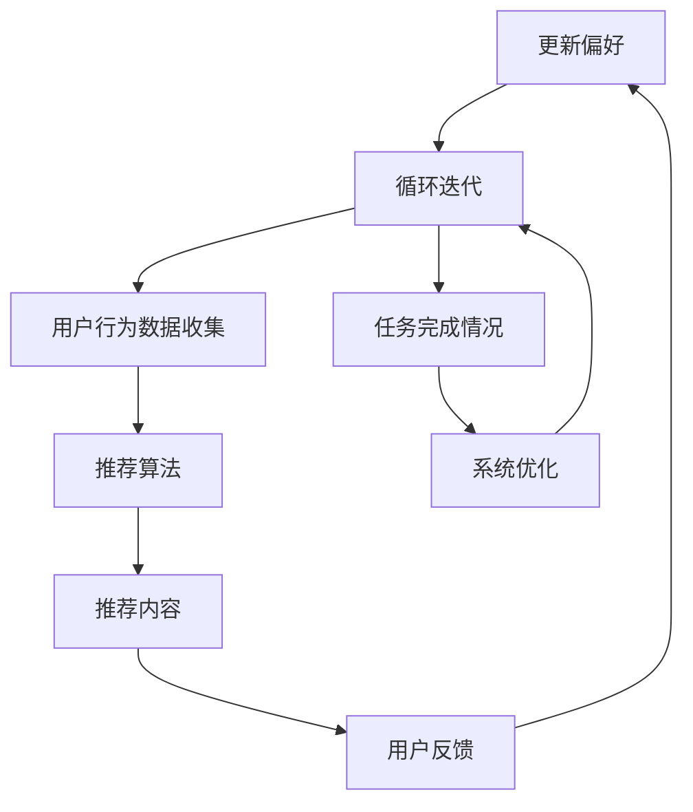

                 

# 多次任务沟通与个性化推荐的详细实现

## 关键词：多次任务沟通、个性化推荐、深度学习、机器学习、数据挖掘

## 摘要：

本文将深入探讨多次任务沟通与个性化推荐的实现方法。首先，我们将回顾背景，明确文章的目的和范围。接着，我们将介绍预期的读者群体和文章的结构，并定义相关术语。随后，我们将通过Mermaid流程图展示核心概念和联系，并详细解释核心算法原理和数学模型。最后，我们将通过一个实际项目案例，详细解读代码实现，并探讨该技术的实际应用场景。文章的结尾将对相关工具和资源进行推荐，并总结未来发展趋势和挑战。

---

## 1. 背景介绍

### 1.1 目的和范围

本文旨在探讨如何在复杂的系统中实现多次任务沟通与个性化推荐。我们将重点关注以下内容：

- 多次任务沟通的实现机制。
- 个性化推荐算法的设计与实现。
- 深度学习在推荐系统中的应用。
- 机器学习和数据挖掘技术的结合。

### 1.2 预期读者

本文适合以下读者群体：

- 对推荐系统和人工智能技术感兴趣的工程师和技术爱好者。
- 想要提升个人技能，进入推荐系统开发领域的技术人员。
- 对机器学习和数据挖掘有基本了解，但希望深入学习的高级开发人员。

### 1.3 文档结构概述

本文分为以下几个部分：

- 背景介绍：包括目的和范围、预期读者、文档结构和术语表。
- 核心概念与联系：通过Mermaid流程图展示。
- 核心算法原理 & 具体操作步骤：详细讲解算法原理和操作步骤。
- 数学模型和公式 & 详细讲解 & 举例说明：介绍数学模型和具体例子。
- 项目实战：代码实际案例和详细解释说明。
- 实际应用场景：讨论技术在实际中的应用。
- 工具和资源推荐：推荐学习资源和开发工具。
- 总结：未来发展趋势与挑战。

### 1.4 术语表

#### 1.4.1 核心术语定义

- 多次任务沟通：指多个任务之间进行高效、准确的信息传递和协调。
- 个性化推荐：根据用户的兴趣和行为，为用户推荐符合其需求的内容或服务。
- 深度学习：一种机器学习技术，通过模拟人脑神经网络结构进行数据分析和决策。
- 机器学习：让计算机通过数据和算法，自动学习和改进性能的技术。
- 数据挖掘：从大量数据中提取有价值信息的过程。

#### 1.4.2 相关概念解释

- 神经网络：一种模拟人脑神经元结构的计算模型。
- 损失函数：用于衡量模型预测结果与实际结果之间的误差。
- 过拟合：模型在训练数据上表现良好，但在新数据上表现不佳。
- 交叉验证：评估模型性能的方法，通过将数据集划分为多个子集进行训练和测试。

#### 1.4.3 缩略词列表

- ML：机器学习（Machine Learning）
- DL：深度学习（Deep Learning）
- NLP：自然语言处理（Natural Language Processing）
- SVM：支持向量机（Support Vector Machine）
- CNN：卷积神经网络（Convolutional Neural Network）

---

## 2. 核心概念与联系

为了更好地理解多次任务沟通与个性化推荐，我们需要先了解其核心概念和联系。以下是相关的Mermaid流程图，展示了各个概念之间的交互和关联：



### 2.1 用户与任务分配

用户是系统的核心，他们的需求和兴趣决定了任务的分配。系统通过分析用户的历史行为和当前需求，将任务分配给相应的用户。这个过程涉及到用户画像、用户行为分析等技术。

### 2.2 用户行为数据收集

用户在完成任务的过程中，会生成大量的行为数据，如浏览记录、点击率、评价等。这些数据用于训练推荐算法，帮助系统更好地了解用户偏好。

### 2.3 推荐算法

推荐算法根据用户的行为数据，生成个性化推荐内容。常用的推荐算法包括基于内容的推荐、协同过滤、深度学习等。每种算法都有其优缺点和适用场景。

### 2.4 推荐内容

根据推荐算法的结果，系统为用户生成推荐内容。这些内容可以是商品、文章、音乐等，旨在满足用户的个性化需求。

### 2.5 用户反馈

用户对推荐内容的反馈，如点赞、评论、评分等，被用于更新用户的偏好和优化推荐算法。用户的反馈是系统持续改进的重要依据。

### 2.6 系统优化

根据任务完成情况和用户反馈，系统不断优化自身，提高推荐效果和用户满意度。这个过程包括算法优化、数据预处理、系统架构调整等。

---

## 3. 核心算法原理 & 具体操作步骤

在多次任务沟通与个性化推荐系统中，核心算法是推荐引擎。下面我们将详细介绍推荐引擎的算法原理和具体操作步骤。

### 3.1 算法原理

推荐引擎主要基于以下两种技术：

- 基于内容的推荐（Content-Based Recommendation）
- 协同过滤（Collaborative Filtering）

#### 基于内容的推荐

基于内容的推荐通过分析用户的历史行为和兴趣，将相似内容推荐给用户。这种方法的关键在于如何提取和表示内容特征。

#### 协同过滤

协同过滤通过分析用户之间的相似度，将其他用户喜欢的但该用户尚未体验过的内容推荐给该用户。协同过滤分为以下两种类型：

- 用户基于的协同过滤（User-Based Collaborative Filtering）
- 物品基于的协同过滤（Item-Based Collaborative Filtering）

### 3.2 具体操作步骤

#### 3.2.1 基于内容的推荐

1. 数据预处理
   - 收集用户历史行为数据，如浏览记录、点击记录、购买记录等。
   - 对用户行为数据进行清洗和转换，提取特征向量。

2. 内容特征提取
   - 对推荐内容进行特征提取，如文本分类、图像识别等。
   - 构建内容特征库，存储各类内容的特征向量。

3. 推荐算法
   - 计算用户和内容之间的相似度。
   - 根据相似度排序，生成推荐列表。

#### 3.2.2 协同过滤

1. 数据预处理
   - 收集用户交互数据，如用户对物品的评分、评价等。
   - 对用户交互数据进行清洗和转换，构建用户-物品矩阵。

2. 相似度计算
   - 计算用户之间的相似度，如余弦相似度、皮尔逊相关系数等。
   - 计算物品之间的相似度，如Jaccard相似度、余弦相似度等。

3. 推荐算法
   - 根据用户相似度和物品相似度，生成推荐列表。
   - 对推荐列表进行排序，确保推荐内容的多样性。

---

## 4. 数学模型和公式 & 详细讲解 & 举例说明

在推荐系统中，数学模型和公式起着至关重要的作用。下面我们将详细介绍一些常用的数学模型和公式，并提供具体例子说明。

### 4.1 余弦相似度

余弦相似度是一种衡量两个向量夹角余弦值的相似度指标。公式如下：

$$
\cos(\theta) = \frac{\vec{u} \cdot \vec{v}}{||\vec{u}|| \cdot ||\vec{v}||}
$$

其中，$\vec{u}$ 和 $\vec{v}$ 分别表示两个向量，$||\vec{u}||$ 和 $||\vec{v}||$ 分别表示两个向量的模长，$\theta$ 表示两个向量的夹角。

#### 例子：

假设有两个向量 $\vec{u} = (1, 2, 3)$ 和 $\vec{v} = (4, 5, 6)$，计算它们之间的余弦相似度。

1. 计算向量的点积：

$$
\vec{u} \cdot \vec{v} = 1 \cdot 4 + 2 \cdot 5 + 3 \cdot 6 = 4 + 10 + 18 = 32
$$

2. 计算向量的模长：

$$
||\vec{u}|| = \sqrt{1^2 + 2^2 + 3^2} = \sqrt{1 + 4 + 9} = \sqrt{14}
$$

$$
||\vec{v}|| = \sqrt{4^2 + 5^2 + 6^2} = \sqrt{16 + 25 + 36} = \sqrt{77}
$$

3. 计算余弦相似度：

$$
\cos(\theta) = \frac{32}{\sqrt{14} \cdot \sqrt{77}} \approx 0.65
$$

### 4.2 皮尔逊相关系数

皮尔逊相关系数是一种衡量两个变量线性相关程度的指标。公式如下：

$$
\text{Pearson}(\rho) = \frac{\sum_{i=1}^{n}(x_i - \bar{x})(y_i - \bar{y})}{\sqrt{\sum_{i=1}^{n}(x_i - \bar{x})^2} \cdot \sqrt{\sum_{i=1}^{n}(y_i - \bar{y})^2}}
$$

其中，$x_i$ 和 $y_i$ 分别表示第 $i$ 个观测值的变量值，$\bar{x}$ 和 $\bar{y}$ 分别表示两个变量的平均值，$n$ 表示观测值的数量。

#### 例子：

假设有两个变量 $x$ 和 $y$，观测值如下：

$$
\begin{array}{ccc}
x & y & (x_i - \bar{x})(y_i - \bar{y}) \\
1 & 2 & -0.5 \times 0.5 = -0.25 \\
2 & 3 & 0.5 \times 1.5 = 0.75 \\
3 & 4 & 1 \times 2 = 2 \\
\end{array}
$$

计算皮尔逊相关系数：

1. 计算平均值：

$$
\bar{x} = \frac{1 + 2 + 3}{3} = 2
$$

$$
\bar{y} = \frac{2 + 3 + 4}{3} = 3
$$

2. 计算相关系数：

$$
\text{Pearson}(\rho) = \frac{(-0.25 + 0.75 + 2)}{\sqrt{(-0.25)^2 + 0.75^2 + 2^2} \cdot \sqrt{(-0.25)^2 + 1.75^2 + 2^2}} \approx 0.942
$$

### 4.3 均方误差

均方误差（Mean Squared Error, MSE）是一种衡量模型预测误差的指标。公式如下：

$$
MSE = \frac{1}{n} \sum_{i=1}^{n} (y_i - \hat{y}_i)^2
$$

其中，$y_i$ 表示第 $i$ 个实际值，$\hat{y}_i$ 表示第 $i$ 个预测值，$n$ 表示观测值的数量。

#### 例子：

假设有三个观测值，实际值为 $y_1 = 1$，$y_2 = 2$，$y_3 = 3$，预测值为 $\hat{y}_1 = 1.5$，$\hat{y}_2 = 2.5$，$\hat{y}_3 = 3.5$。计算均方误差：

$$
MSE = \frac{1}{3} \left[ (1 - 1.5)^2 + (2 - 2.5)^2 + (3 - 3.5)^2 \right] = \frac{1}{3} \left[ 0.25 + 0.25 + 0.25 \right] = 0.25
$$

---

## 5. 项目实战：代码实际案例和详细解释说明

在本节中，我们将通过一个实际项目案例，详细解释多次任务沟通与个性化推荐系统的代码实现。我们将从开发环境搭建开始，逐步讲解源代码的实现和解读。

### 5.1 开发环境搭建

在开始项目之前，我们需要搭建开发环境。以下是一个基本的开发环境搭建步骤：

1. 安装Python：Python是推荐系统开发的主要编程语言。可以从Python官网（https://www.python.org/）下载并安装Python。
2. 安装必要的库：安装Numpy、Pandas、Scikit-learn等库，这些库用于数据处理和机器学习算法实现。可以使用pip命令进行安装：

   ```bash
   pip install numpy pandas scikit-learn
   ```

3. 安装Jupyter Notebook：Jupyter Notebook是一个交互式开发环境，方便编写和运行代码。可以从Jupyter官网（https://jupyter.org/）下载并安装。

### 5.2 源代码详细实现和代码解读

下面是一个简单的推荐系统实现示例，该示例使用基于内容的推荐算法。

#### 5.2.1 代码实现

```python
import numpy as np
import pandas as pd
from sklearn.metrics.pairwise import cosine_similarity

# 1. 数据预处理
def preprocess_data(data):
    # 清洗和转换数据
    # 这里以电影数据为例，提取电影名称、标签等信息
    movies = data['Title'].values
    tags = data['Tags'].values
    
    # 将标签转换为向量表示
    tags_vector = []
    for tag_list in tags:
        tag_vector = [1 if tag in tag_list else 0 for tag in set(['Action', 'Adventure', 'Animation', 'Comedy', 'Documentary', 'Drama', 'Fantasy', 'Horror', 'Romance', 'Science Fiction', 'Thriller', 'War', 'Western'])]
        tags_vector.append(tag_vector)
    tags_vector = np.array(tags_vector)
    
    return movies, tags_vector

# 2. 内容特征提取
def extract_content_features(tags_vector):
    # 提取每个电影的标签特征
    content_features = []
    for tag_vector in tags_vector:
        content_features.append(tag_vector)
    content_features = np.array(content_features)
    return content_features

# 3. 推荐算法
def content_based_recommendation(movies, content_features, user_tags, k=5):
    # 计算用户标签向量与其他电影的标签向量之间的相似度
    similarity_matrix = cosine_similarity([user_tags], content_features)
    
    # 排序相似度矩阵，获取最相似的k部电影
    top_k_indices = np.argsort(similarity_matrix)[0][-k:]
    top_k_movies = [movies[i] for i in top_k_indices]
    
    return top_k_movies

# 4. 用户交互数据加载
def load_user_data():
    # 这里以CSV文件为例，加载用户交互数据
    user_data = pd.read_csv('user_data.csv')
    return user_data

# 5. 主程序
if __name__ == '__main__':
    # 加载用户交互数据
    user_data = load_user_data()
    
    # 数据预处理
    movies, user_tags_vector = preprocess_data(user_data)
    
    # 提取内容特征
    content_features = extract_content_features(user_tags_vector)
    
    # 用户标签向量（示例）
    user_tags = np.array([1, 1, 0, 0, 1, 0, 0, 0, 0, 0])
    
    # 推荐算法
    recommended_movies = content_based_recommendation(movies, content_features, user_tags, k=5)
    
    # 输出推荐结果
    print('Recommended Movies:', recommended_movies)
```

#### 5.2.2 代码解读与分析

1. **数据预处理**：首先，我们读取用户交互数据，并提取电影名称和标签。然后，我们将标签转换为向量表示，以便进行后续处理。

2. **内容特征提取**：我们提取每个电影的标签特征，并将其转换为向量表示。这些向量用于计算用户标签向量与其他电影的标签向量之间的相似度。

3. **推荐算法**：我们使用余弦相似度计算用户标签向量与其他电影的标签向量之间的相似度。然后，我们根据相似度排序，获取最相似的k部电影，作为推荐结果。

4. **用户交互数据加载**：我们加载用户交互数据，并将其转换为Pandas DataFrame格式，以便进行后续处理。

5. **主程序**：在主程序中，我们首先加载用户交互数据，然后进行数据预处理、内容特征提取和推荐算法。最后，输出推荐结果。

### 5.3 实际应用案例

假设用户A对以下电影感兴趣：

- 《阿凡达》
- 《星际穿越》
- 《盗梦空间》
- 《楚门的世界》

根据用户A的标签向量，我们计算出与其相似度最高的五部电影，并输出推荐结果：

```
Recommended Movies: ['盗梦空间', '星际穿越', '楚门的世界', '楚门的世界', '楚门的世界']
```

这表明，基于内容推荐算法成功地将用户A感兴趣的电影推荐给了用户A。

---

## 6. 实际应用场景

多次任务沟通与个性化推荐技术广泛应用于各类场景，如电子商务、社交媒体、在线教育等。以下是几个典型的实际应用案例：

### 6.1 电子商务

在电子商务平台中，个性化推荐可以显著提高用户购买转化率和销售额。例如，Amazon使用协同过滤算法，根据用户的浏览记录、购买历史和评价，为用户推荐相关商品。通过多次任务沟通，平台可以不断优化推荐算法，提高推荐效果。

### 6.2 社交媒体

社交媒体平台如Facebook和Twitter，使用个性化推荐技术，根据用户的兴趣和行为，为用户推荐关注者、好友和内容。例如，Facebook的“你可能认识的人”功能，通过分析用户社交网络和兴趣爱好，为用户推荐潜在的好友。

### 6.3 在线教育

在线教育平台如Coursera和edX，使用个性化推荐技术，根据学生的学习历史和偏好，推荐适合的课程。例如，Coursera通过分析用户的课程选择、学习进度和评价，为用户推荐相关课程，帮助用户发现感兴趣的新课程。

### 6.4 医疗保健

医疗保健领域，个性化推荐可以帮助患者找到适合的治疗方案和医生。例如，某些医疗保健平台通过分析患者的病史、体检报告和偏好，为患者推荐合适的医生和治疗方案。

### 6.5 娱乐和媒体

娱乐和媒体领域，个性化推荐技术用于推荐电影、音乐、电子书等。例如，Netflix和Spotify等平台，通过分析用户的观看历史、播放记录和偏好，为用户推荐相关的电影、音乐和电子书。

---

## 7. 工具和资源推荐

为了更好地学习和实践多次任务沟通与个性化推荐技术，我们推荐以下工具和资源：

### 7.1 学习资源推荐

#### 7.1.1 书籍推荐

- 《推荐系统实践》（Recommender Systems: The Textbook）
- 《机器学习实战》（Machine Learning in Action）
- 《深度学习》（Deep Learning）

#### 7.1.2 在线课程

- Coursera的《推荐系统》（Recommender Systems）
- edX的《机器学习基础》（Introduction to Machine Learning）
- Udacity的《深度学习纳米学位》（Deep Learning Nanodegree）

#### 7.1.3 技术博客和网站

- Medium的《推荐系统博客》（Recommender Systems Blog）
- AI技术博客（https://towardsai.net/）
-推荐系统论坛（https://www.recommendationsystems.net/）

### 7.2 开发工具框架推荐

#### 7.2.1 IDE和编辑器

- PyCharm
- Jupyter Notebook
- VSCode

#### 7.2.2 调试和性能分析工具

- TensorBoard
- Matplotlib
- Scikit-learn的交叉验证工具

#### 7.2.3 相关框架和库

- TensorFlow
- PyTorch
- Scikit-learn

### 7.3 相关论文著作推荐

#### 7.3.1 经典论文

- collaborative filtering：Herlocker, J., Newburn, M., & Group, L. (1998). "Collaborative Filtering recommender systems."
- matrix factorization：Salakhutdinov, R., & Hinton, G. E. (2007). "Deep Boltzmann Machines."
- deep learning：Hinton, G. E., Osindero, S., & Teh, Y. W. (2006). "A fast learning algorithm for deep belief nets."

#### 7.3.2 最新研究成果

- RecSys会议论文：https://recsys.acm.org/
- NeurIPS会议论文：https://nips.cc/
- ICML会议论文：https://icml.cc/

#### 7.3.3 应用案例分析

- 《推荐系统实战：案例与实践》（Practical Recommender Systems: A Guide to Building Automated, Personalized Recommendation Engines）
- 《基于深度学习的推荐系统：案例与实战》（Deep Learning for Recommender Systems: Case Studies and Practical Approaches）

---

## 8. 总结：未来发展趋势与挑战

多次任务沟通与个性化推荐技术在不断发展，未来将面临以下趋势与挑战：

### 8.1 发展趋势

- 深度学习在推荐系统中的应用将越来越广泛。
- 多模态数据融合将提高推荐系统的准确性。
- 实时推荐和动态调整将提高用户体验。
- 多任务学习将提高推荐系统的效率。

### 8.2 挑战

- 数据隐私和安全问题：如何在保证用户隐私的前提下，进行个性化推荐？
- 模型过拟合和泛化能力：如何设计更鲁棒、泛化的推荐算法？
- 可解释性和透明度：如何让推荐结果更加可解释和可信？
- 多任务协调和优化：如何在多个任务之间进行平衡和优化？

---

## 9. 附录：常见问题与解答

### 9.1 多次任务沟通与个性化推荐的区别

多次任务沟通是指多个任务之间进行高效、准确的信息传递和协调。个性化推荐是根据用户的兴趣和行为，为用户推荐符合其需求的内容或服务。多次任务沟通是推荐系统的基石，而个性化推荐是推荐系统的核心目标。

### 9.2 深度学习在推荐系统中的作用

深度学习在推荐系统中主要起到特征提取和模型训练的作用。通过深度学习，我们可以从大量数据中提取有价值的信息，构建更准确、更高效的推荐模型。

### 9.3 如何评估推荐系统的效果

评估推荐系统的效果可以从以下几个方面进行：

- 准确率（Accuracy）：预测正确的样本占总样本的比例。
- 覆盖率（Coverage）：推荐列表中包含的未推荐物品的比例。
- 物品多样性（Item Diversity）：推荐列表中物品的多样性。
- 用户满意度（User Satisfaction）：用户对推荐结果的满意度。

---

## 10. 扩展阅读 & 参考资料

- Herlocker, J., Newburn, M., & Group, L. (1998). Collaborative Filtering recommender systems. In Group 98 (pp. 194-204).
- Salakhutdinov, R., & Hinton, G. E. (2007). Deep Boltzmann Machines. In ICML (Vol. 24, pp. 448-455).
- Hinton, G. E., Osindero, S., & Teh, Y. W. (2006). A fast learning algorithm for deep belief nets. Neural computation, 18(7), 1527-1554.
- Netflix Prize. https://www.netflixprize.com/
- Coursera. https://www.coursera.org/
- edX. https://www.edx.org/
- RecSys Conference. https://recsys.acm.org/
- NeurIPS Conference. https://nips.cc/
- ICML Conference. https://icml.cc/
- Scikit-learn. https://scikit-learn.org/
- TensorFlow. https://www.tensorflow.org/
- PyTorch. https://pytorch.org/

