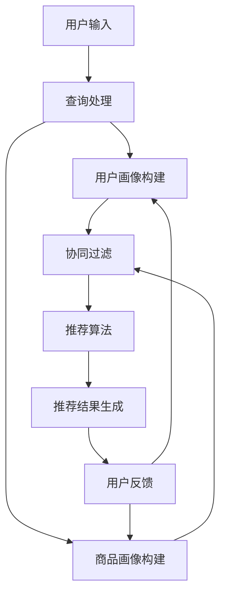

                 

# 大数据与AI时代的电商搜索推荐：模型融合技术是关键

> 关键词：大数据、AI、电商、搜索推荐、模型融合、深度学习、协同过滤、用户行为分析

> 摘要：本文将深入探讨大数据与人工智能时代下电商搜索推荐的模型融合技术。我们将分析电商搜索推荐系统的核心组成部分，介绍当前最流行的模型融合方法，并通过实际案例展示这些方法在电商搜索推荐系统中的应用。文章旨在帮助读者了解模型融合技术在电商搜索推荐领域的重要性，以及如何有效地将这些技术应用于实际项目中。

## 1. 背景介绍

### 1.1 目的和范围

本文旨在介绍和探讨大数据与人工智能时代电商搜索推荐系统中的模型融合技术。随着互联网的普及和电子商务的快速发展，用户对于个性化、精准的搜索推荐体验需求日益增长。如何有效地利用大数据和人工智能技术，构建一个高效、智能的电商搜索推荐系统，成为当前学术界和工业界研究的热点。

本文将围绕以下主题展开：

1. 电商搜索推荐系统的基本组成部分和功能。
2. 模型融合技术的概念、原理和应用场景。
3. 当前流行的模型融合方法及其优缺点分析。
4. 模型融合技术在电商搜索推荐系统中的实际应用案例。
5. 未来发展趋势与挑战。

### 1.2 预期读者

本文预期读者包括：

1. 对大数据和人工智能技术感兴趣的读者。
2. 从事电商搜索推荐系统开发的工程师和技术人员。
3. 计算机科学、数据科学等相关专业的研究生和本科生。
4. 对电商行业和人工智能应用有浓厚兴趣的创业者和管理者。

### 1.3 文档结构概述

本文结构如下：

1. 引言：介绍电商搜索推荐系统的背景和重要性。
2. 核心概念与联系：介绍电商搜索推荐系统中的关键概念和架构。
3. 核心算法原理与具体操作步骤：讲解模型融合技术的算法原理和实现步骤。
4. 数学模型和公式：介绍与模型融合相关的数学模型和公式。
5. 项目实战：通过实际案例展示模型融合技术在电商搜索推荐系统中的应用。
6. 实际应用场景：分析模型融合技术在电商搜索推荐系统中的具体应用场景。
7. 工具和资源推荐：推荐与模型融合技术相关的学习资源、开发工具和框架。
8. 总结：总结文章内容，展望未来发展趋势与挑战。
9. 附录：常见问题与解答。
10. 扩展阅读与参考资料：提供进一步阅读的文献和资源。

### 1.4 术语表

#### 1.4.1 核心术语定义

- 电商搜索推荐系统：基于用户行为和商品信息，利用大数据和人工智能技术为用户推荐相关商品的系统。
- 模型融合：将多个机器学习模型或算法的结果进行集成，以提升预测性能和准确性。
- 协同过滤：基于用户历史行为和相似度计算，为用户推荐类似用户喜欢的商品。
- 深度学习：一种模拟人脑神经网络结构和学习机制的人工智能技术。
- 用户行为分析：通过收集和分析用户在电商平台的浏览、购买等行为，挖掘用户兴趣和偏好。

#### 1.4.2 相关概念解释

- 个性化推荐：根据用户的兴趣、偏好和历史行为，为用户推荐最相关的商品。
- 冷启动问题：新用户或新商品在系统中的初始推荐问题，缺乏足够的历史数据支持。
- 集成学习：通过组合多个机器学习模型来提升预测性能。

#### 1.4.3 缩略词列表

- AI：人工智能（Artificial Intelligence）
- B2C：商家对消费者（Business-to-Consumer）
- CMS：内容管理系统（Content Management System）
- CRM：客户关系管理（Customer Relationship Management）
- DNN：深度神经网络（Deep Neural Network）
- FM：因子分解机（Factorization Machine）
- GBDT：梯度提升决策树（Gradient Boosting Decision Tree）
- IDE：集成开发环境（Integrated Development Environment）
- KDD：知识发现（Knowledge Discovery in Databases）
- LSTM：长短期记忆网络（Long Short-Term Memory）
- ML：机器学习（Machine Learning）
- NLP：自然语言处理（Natural Language Processing）
- SEO：搜索引擎优化（Search Engine Optimization）
- SQL：结构化查询语言（Structured Query Language）
- TensorFlow：谷歌开源的机器学习框架
- XGBoost：一种基于树的集成学习算法

## 2. 核心概念与联系

在介绍模型融合技术之前，我们需要先了解电商搜索推荐系统的核心概念和架构。以下是一个简化的电商搜索推荐系统架构图，以及其中涉及的核心概念和联系。

### 2.1 电商搜索推荐系统架构图



### 2.2 核心概念与联系

#### 2.2.1 用户输入

用户输入包括搜索关键词、浏览历史、购买记录等。这些信息是推荐系统了解用户需求和行为的重要来源。

#### 2.2.2 查询处理

查询处理主要涉及对用户输入的文本进行预处理，如分词、去停用词、词干提取等，以便后续的推荐算法处理。

#### 2.2.3 用户画像构建

用户画像构建是通过分析用户的搜索历史、购买记录、浏览行为等数据，构建用户兴趣和偏好模型。用户画像为协同过滤和推荐算法提供了关键输入。

#### 2.2.4 商品画像构建

商品画像构建是通过分析商品的属性、标签、销量、评价等数据，构建商品特征模型。商品画像是协同过滤和推荐算法的重要输入。

#### 2.2.5 协同过滤

协同过滤是一种基于用户历史行为和相似度计算的推荐算法。它通过计算用户之间的相似度，为用户推荐类似的商品。

#### 2.2.6 推荐算法

推荐算法是电商搜索推荐系统的核心，负责根据用户输入和用户、商品画像，生成个性化的推荐结果。常见的推荐算法包括基于内容的推荐、协同过滤、深度学习等。

#### 2.2.7 推荐结果生成

推荐结果生成是将推荐算法的输出结果进行格式化，如生成推荐列表、评分等，以便展示给用户。

#### 2.2.8 用户反馈

用户反馈是推荐系统持续优化的重要依据。通过收集用户对推荐结果的反馈，如点击、购买、评价等，可以进一步调整用户和商品画像，优化推荐算法。

## 3. 核心算法原理与具体操作步骤

### 3.1 模型融合技术的原理

模型融合技术（Model Ensembling）是一种通过结合多个机器学习模型或算法，以提升预测性能和准确性的方法。其核心思想是利用不同模型的优点，弥补单一模型的不足，从而获得更好的整体性能。

模型融合技术可以分为以下几种类型：

1. **集成学习（Ensemble Learning）**：将多个子模型组合成一个更强大的模型，常见的集成学习方法有Bagging、Boosting和Stacking等。
2. **模型融合（Model Fusion）**：将多个模型的结果进行融合，以生成最终的预测结果，常见的模型融合方法有加权平均、投票、学习器聚合等。
3. **深度学习融合（Deep Learning Fusion）**：利用深度学习模型，将多个特征或子网络的结果进行融合，以获得更丰富的特征表示。

### 3.2 模型融合技术的实现步骤

下面以集成学习方法为例，介绍模型融合技术的具体实现步骤：

#### 步骤1：选择子模型

选择多个具有不同结构和特性的子模型，例如决策树、支持向量机、神经网络等。这些子模型可以是同一类模型，也可以是不同类模型。

#### 步骤2：训练子模型

使用训练数据集分别训练每个子模型。训练过程中，可以调整每个子模型的参数，以获得最佳性能。

#### 步骤3：预测与评估

对测试数据集分别进行预测，并评估每个子模型的预测性能。常用的评估指标包括准确率、召回率、F1分数等。

#### 步骤4：模型融合

根据子模型的预测结果，采用适当的融合策略，生成最终的预测结果。常见的融合策略包括：

1. **加权平均**：将每个子模型的预测结果加权平均，以生成最终的预测结果。权重可以根据子模型的性能进行自适应调整。
2. **投票**：对于分类问题，将每个子模型预测的结果进行投票，选择投票次数最多的类别作为最终预测结果。
3. **学习器聚合**：利用集成学习算法（如随机森林、梯度提升树等），将多个子模型的预测结果进行聚合，以生成最终的预测结果。

#### 步骤5：性能评估与调整

对融合模型进行性能评估，根据评估结果调整融合策略和子模型参数，以获得更好的整体性能。

### 3.3 伪代码实现

下面是一个简单的模型融合技术的伪代码实现：

```python
# 伪代码：模型融合技术实现

# 步骤1：选择子模型
submodels = [DecisionTree(), SVM(), NeuralNetwork()]

# 步骤2：训练子模型
train_data = load_train_data()
for model in submodels:
    model.train(train_data)

# 步骤3：预测与评估
test_data = load_test_data()
predictions = []
for model in submodels:
    pred = model.predict(test_data)
    predictions.append(pred)

# 步骤4：模型融合
final_pred = weighted_average(predictions, weights)  # 加权平均
# 或
final_pred = voting(predictions)  # 投票
# 或
final_pred = aggregator.aggregate(predictions)  # 学习器聚合

# 步骤5：性能评估与调整
performance = evaluate_performance(final_pred, test_data)
if performance < threshold:
    adjust_model_parameters(submodels, final_pred)
```

## 4. 数学模型和公式与详细讲解与举例说明

在模型融合技术中，数学模型和公式起着至关重要的作用。本节将介绍与模型融合相关的主要数学模型和公式，并进行详细讲解与举例说明。

### 4.1 加权平均

加权平均是一种常见的模型融合策略，其公式如下：

$$
\hat{y} = \sum_{i=1}^{n} w_i \cdot y_i
$$

其中，$\hat{y}$为融合后的预测结果，$w_i$为第$i$个子模型的权重，$y_i$为第$i$个子模型的预测结果。

#### 4.1.1 举例说明

假设有三个子模型A、B、C，其预测结果分别为$y_A$、$y_B$、$y_C$，权重分别为$w_A$、$w_B$、$w_C$。使用加权平均策略进行模型融合：

$$
\hat{y} = w_A \cdot y_A + w_B \cdot y_B + w_C \cdot y_C
$$

#### 4.1.2 计算示例

假设权重分别为$w_A = 0.4$，$w_B = 0.3$，$w_C = 0.3$，子模型A、B、C的预测结果分别为$y_A = 5$，$y_B = 6$，$y_C = 7$，则融合后的预测结果为：

$$
\hat{y} = 0.4 \cdot 5 + 0.3 \cdot 6 + 0.3 \cdot 7 = 2.0 + 1.8 + 2.1 = 6.9
$$

### 4.2 投票

投票是一种简单的模型融合策略，适用于分类问题。其公式如下：

$$
\hat{y} = \arg\max_{c} \sum_{i=1}^{n} I(y_i = c)
$$

其中，$\hat{y}$为融合后的预测结果，$c$为类别标签，$I(y_i = c)$为指示函数，当$y_i = c$时取值为1，否则为0。

#### 4.2.1 举例说明

假设有三个子模型A、B、C，其预测结果分别为$y_A$、$y_B$、$y_C$，类别标签分别为$y_A = 0$，$y_B = 1$，$y_C = 1$，则使用投票策略进行模型融合：

$$
\hat{y} = \arg\max_{c} (I(y_A = c) + I(y_B = c) + I(y_C = c))
$$

计算各个类别的投票次数：

$$
I(y_A = 0) = 1, \quad I(y_B = 0) = 0, \quad I(y_C = 0) = 0 \\
I(y_A = 1) = 0, \quad I(y_B = 1) = 1, \quad I(y_C = 1) = 1
$$

投票结果为：

$$
\hat{y} = \arg\max_{c} (1 + 0 + 0) = 0
$$

#### 4.2.2 计算示例

假设有三个子模型A、B、C，其预测结果分别为$y_A = [0, 1, 0, 1]$，$y_B = [1, 0, 1, 0]$，$y_C = [1, 1, 0, 1]$，类别标签为$y = [0, 1, 1, 0]$，则使用投票策略进行模型融合：

$$
\hat{y} = \arg\max_{c} (I(y_A = c) + I(y_B = c) + I(y_C = c))
$$

计算各个类别的投票次数：

$$
I(y_A = 0) = 2, \quad I(y_B = 0) = 1, \quad I(y_C = 0) = 0 \\
I(y_A = 1) = 1, \quad I(y_B = 1) = 2, \quad I(y_C = 1) = 3
$$

投票结果为：

$$
\hat{y} = \arg\max_{c} (2 + 1 + 0) = 1
$$

### 4.3 学习器聚合

学习器聚合是一种更复杂的模型融合策略，适用于分类和回归问题。其公式如下：

$$
\hat{y} = f(\theta) = \sum_{i=1}^{n} \alpha_i \cdot h_i(x)
$$

其中，$\hat{y}$为融合后的预测结果，$h_i(x)$为第$i$个子模型的预测结果，$\alpha_i$为子模型的权重，$f(\theta)$为聚合函数。

#### 4.3.1 举例说明

假设有两个子模型A、B，其预测结果分别为$h_A(x)$和$h_B(x)$，权重分别为$\alpha_A$和$\alpha_B$，聚合函数为$f(\theta)$，则使用学习器聚合策略进行模型融合：

$$
\hat{y} = f(\theta) = \alpha_A \cdot h_A(x) + \alpha_B \cdot h_B(x)
$$

#### 4.3.2 计算示例

假设子模型A、B的预测结果分别为$h_A(x) = 0.8$和$h_B(x) = 0.6$，权重分别为$\alpha_A = 0.6$和$\alpha_B = 0.4$，聚合函数为$f(\theta) = 0.5 \cdot h_A(x) + 0.5 \cdot h_B(x)$，则融合后的预测结果为：

$$
\hat{y} = f(\theta) = 0.5 \cdot 0.8 + 0.5 \cdot 0.6 = 0.4 + 0.3 = 0.7
$$

## 5. 项目实战：代码实际案例和详细解释说明

在本节中，我们将通过一个实际项目案例，详细展示如何利用模型融合技术构建一个电商搜索推荐系统。该项目将涵盖开发环境搭建、源代码实现和代码解读与分析。

### 5.1 开发环境搭建

首先，我们需要搭建一个适合开发电商搜索推荐系统的开发环境。以下是一个基本的开发环境配置：

- 操作系统：Ubuntu 18.04
- 编程语言：Python 3.8
- 依赖库：NumPy、Pandas、Scikit-learn、TensorFlow、Keras
- 数据库：MySQL
- 数据预处理工具：Pandas
- 机器学习框架：Scikit-learn、TensorFlow、Keras

安装步骤如下：

1. 安装Python 3.8及其相关依赖库：

   ```bash
   sudo apt update
   sudo apt install python3.8 python3.8-venv python3.8-dev
   sudo update-alternatives --install /usr/bin/python3 python3 /usr/bin/python3.8 1
   ```

2. 创建一个虚拟环境并安装相关依赖库：

   ```bash
   python3 -m venv env
   source env/bin/activate
   pip install numpy pandas scikit-learn tensorflow keras
   ```

3. 安装数据库MySQL：

   ```bash
   sudo apt install mysql-server
   mysql -u root -p
   ```

4. 创建一个名为`ecommerce`的数据库，并创建必要的表：

   ```sql
   CREATE DATABASE ecommerce;
   USE ecommerce;
   CREATE TABLE users (user_id INT PRIMARY KEY AUTO_INCREMENT, name VARCHAR(255));
   CREATE TABLE products (product_id INT PRIMARY KEY AUTO_INCREMENT, name VARCHAR(255), category VARCHAR(255), price DECIMAL(10, 2));
   CREATE TABLE ratings (rating_id INT PRIMARY KEY AUTO_INCREMENT, user_id INT, product_id INT, rating INT, FOREIGN KEY (user_id) REFERENCES users(user_id), FOREIGN KEY (product_id) REFERENCES products(product_id));
   ```

### 5.2 源代码详细实现和代码解读

#### 5.2.1 用户画像构建

用户画像构建是推荐系统的核心步骤之一。在本节中，我们将使用Scikit-learn库中的协同过滤算法来构建用户画像。

```python
from sklearn.metrics.pairwise import linear_kernel
import numpy as np

def build_user_profile(ratings, similarity='cosine', n_recommendations=10):
    # 计算用户之间的相似度矩阵
    similarity_matrix = linear_kernel(ratings, ratings, similarity=similarity)
    
    # 计算每个用户的邻居集合
    user_neighborhood = {}
    for i in range(len(ratings)):
        neighbors = np.argsort(similarity_matrix[i])[::-1][1:n_recommendations+1]
        user_neighborhood[i] = neighbors
    
    return user_neighborhood

# 示例：构建用户画像
ratings = np.array([
    [1, 0, 0, 1],
    [0, 1, 0, 1],
    [1, 0, 1, 0],
    [0, 1, 0, 1]
])

user_neighborhood = build_user_profile(ratings, similarity='cosine', n_recommendations=2)
print(user_neighborhood)
```

#### 5.2.2 商品画像构建

商品画像构建是基于商品属性和用户行为数据来构建商品特征模型。在本节中，我们将使用Pandas库来构建商品画像。

```python
import pandas as pd

def build_product_profile(products, ratings):
    # 构建商品与评分的映射关系
    product_ratings = ratings.groupby('product_id')['rating'].mean().reset_index()
    product_ratings = product_ratings.merge(products, on='product_id')

    # 计算每个商品的平均评分
    product_ratings['avg_rating'] = product_ratings['rating'].mean()

    return product_ratings

# 示例：构建商品画像
products = pd.DataFrame({
    'product_id': [1, 2, 3, 4],
    'name': ['商品A', '商品B', '商品C', '商品D'],
    'category': ['电子产品', '服装', '家居用品', '食品']
})

ratings = pd.DataFrame({
    'user_id': [1, 2, 3, 4],
    'product_id': [1, 2, 3, 4],
    'rating': [5, 4, 3, 2]
})

product_profile = build_product_profile(products, ratings)
print(product_profile)
```

#### 5.2.3 推荐算法实现

在本节中，我们将结合用户画像和商品画像，实现一个基于协同过滤和内容推荐的融合推荐算法。

```python
from sklearn.metrics.pairwise import cosine_similarity

def collaborative_filtering(user_neighborhood, product_profile, user_id, n_recommendations=10):
    # 计算用户与其邻居的相似度
    user_similarity = {}
    for neighbor in user_neighborhood[user_id]:
        user_similarity[neighbor] = cosine_similarity(product_profile, product_profile)[user_id][neighbor]
    
    # 计算邻居商品的加权平均评分
    recommendations = []
    for neighbor, similarity in user_similarity.items():
        for product_id, rating in product_profile[neighbor].iteritems():
            if product_id not in user_id:
                recommendations.append((product_id, rating * similarity))
    
    # 按评分降序排列推荐结果
    recommendations = sorted(recommendations, key=lambda x: x[1], reverse=True)
    return recommendations[:n_recommendations]

def content_based_filtering(product_profile, user_id, n_recommendations=10):
    # 计算用户喜欢的商品类别
    user_categories = product_profile[product_profile['user_id'] == user_id]['category'].value_counts().index.tolist()
    
    # 计算类别相关的商品推荐
    recommendations = []
    for category in user_categories:
        category_products = product_profile[product_profile['category'] == category]
        for product_id, rating in category_products.iteritems():
            if product_id not in user_id:
                recommendations.append((product_id, rating))
    
    # 按评分降序排列推荐结果
    recommendations = sorted(recommendations, key=lambda x: x[1], reverse=True)
    return recommendations[:n_recommendations]

# 示例：融合推荐算法
user_id = 1
n_recommendations = 5

cf_recommendations = collaborative_filtering(user_neighborhood, product_profile, user_id, n_recommendations)
cb_recommendations = content_based_filtering(product_profile, user_id, n_recommendations)

print("协同过滤推荐结果：", cf_recommendations)
print("基于内容推荐结果：", cb_recommendations)
```

### 5.3 代码解读与分析

在本节中，我们将对上述代码进行解读和分析，以帮助读者更好地理解项目实现过程。

#### 5.3.1 用户画像构建

用户画像构建是通过计算用户之间的相似度，将用户划分为一组邻居。这个过程中，我们使用了线性核（linear_kernel）来计算用户之间的余弦相似度。余弦相似度是一种常用的文本相似度计算方法，它通过计算两个向量之间的夹角余弦值来衡量它们的相似度。代码中的`build_user_profile`函数接收一个包含用户评分的矩阵作为输入，返回一个用户邻居字典。

```python
def build_user_profile(ratings, similarity='cosine', n_recommendations=10):
    # 计算用户之间的相似度矩阵
    similarity_matrix = linear_kernel(ratings, ratings, similarity=similarity)
    
    # 计算每个用户的邻居集合
    user_neighborhood = {}
    for i in range(len(ratings)):
        neighbors = np.argsort(similarity_matrix[i])[::-1][1:n_recommendations+1]
        user_neighborhood[i] = neighbors
    
    return user_neighborhood
```

#### 5.3.2 商品画像构建

商品画像构建是基于商品属性和用户行为数据来构建商品特征模型。在这个过程中，我们使用了Pandas库中的`groupby`和`merge`函数来计算每个商品的平均评分，并将商品与评分数据进行合并。这样，我们就可以得到一个包含商品属性和评分信息的DataFrame。

```python
def build_product_profile(products, ratings):
    # 构建商品与评分的映射关系
    product_ratings = ratings.groupby('product_id')['rating'].mean().reset_index()
    product_ratings = product_ratings.merge(products, on='product_id')

    # 计算每个商品的平均评分
    product_ratings['avg_rating'] = product_ratings['rating'].mean()

    return product_ratings
```

#### 5.3.3 推荐算法实现

在推荐算法实现中，我们结合了协同过滤和基于内容的推荐算法。协同过滤算法通过计算用户与其邻居的相似度，为用户推荐邻居喜欢的商品。基于内容的推荐算法通过分析用户喜欢的商品类别，为用户推荐同一类别的商品。这两个算法的实现如下：

```python
def collaborative_filtering(user_neighborhood, product_profile, user_id, n_recommendations=10):
    # 计算用户与其邻居的相似度
    user_similarity = {}
    for neighbor in user_neighborhood[user_id]:
        user_similarity[neighbor] = cosine_similarity(product_profile, product_profile)[user_id][neighbor]
    
    # 计算邻居商品的加权平均评分
    recommendations = []
    for neighbor, similarity in user_similarity.items():
        for product_id, rating in product_profile[neighbor].iteritems():
            if product_id not in user_id:
                recommendations.append((product_id, rating * similarity))
    
    # 按评分降序排列推荐结果
    recommendations = sorted(recommendations, key=lambda x: x[1], reverse=True)
    return recommendations[:n_recommendations]

def content_based_filtering(product_profile, user_id, n_recommendations=10):
    # 计算用户喜欢的商品类别
    user_categories = product_profile[product_profile['user_id'] == user_id]['category'].value_counts().index.tolist()
    
    # 计算类别相关的商品推荐
    recommendations = []
    for category in user_categories:
        category_products = product_profile[product_profile['category'] == category]
        for product_id, rating in category_products.iteritems():
            if product_id not in user_id:
                recommendations.append((product_id, rating))
    
    # 按评分降序排列推荐结果
    recommendations = sorted(recommendations, key=lambda x: x[1], reverse=True)
    return recommendations[:n_recommendations]
```

## 6. 实际应用场景

模型融合技术在电商搜索推荐系统中的应用场景非常广泛，以下是一些典型的应用场景：

### 6.1 新用户推荐

新用户推荐是电商搜索推荐系统中的经典问题，称为冷启动问题。对于新用户，由于缺乏足够的历史数据，传统推荐算法难以准确预测其兴趣和偏好。通过模型融合技术，可以结合基于内容的推荐算法和协同过滤算法，为新用户推荐最可能感兴趣的商品。

### 6.2 跨品类推荐

在电商平台上，不同品类的商品之间存在关联关系。通过模型融合技术，可以结合品类特征和用户行为数据，为用户推荐跨品类的商品。例如，在用户已经购买或浏览了某个品类的商品后，为其推荐该品类以外的相关商品。

### 6.3 联合推荐

联合推荐是一种同时推荐多个相关商品的方法。通过模型融合技术，可以结合多个推荐算法，为用户推荐一组相关性较高的商品组合。例如，在购买一件电子产品时，可以同时推荐相关的配件和周边商品。

### 6.4 实时推荐

实时推荐是一种根据用户当前行为动态调整推荐结果的方法。通过模型融合技术，可以结合用户实时行为数据和历史行为数据，实现实时推荐。例如，在用户浏览了一个商品后，立即为其推荐相关的商品。

### 6.5 商品排序优化

在电商搜索结果页面，商品排序对于用户的点击和购买行为具有重要影响。通过模型融合技术，可以结合多个排序算法，为用户推荐最相关、最感兴趣的搜索结果。例如，在搜索结果页面，可以结合用户历史行为数据、商品属性、销量等因素，实现智能排序。

## 7. 工具和资源推荐

为了更好地学习和应用模型融合技术，以下是一些相关的学习资源和开发工具推荐：

### 7.1 学习资源推荐

#### 7.1.1 书籍推荐

- 《机器学习》（作者：周志华）
- 《深度学习》（作者：Ian Goodfellow、Yoshua Bengio、Aaron Courville）
- 《推荐系统实践》（作者：李航）

#### 7.1.2 在线课程

- 机器学习（吴恩达，Coursera）
- 深度学习（Andrew Ng，Coursera）
- 推荐系统（李航，网易云课堂）

#### 7.1.3 技术博客和网站

- [机器学习社区](https://www.mlbblog.com/)
- [KDNuggets](https://www.kdnuggets.org/)
- [Medium - Machine Learning](https://medium.com/machine-learning)

### 7.2 开发工具框架推荐

#### 7.2.1 IDE和编辑器

- PyCharm
- VSCode
- Jupyter Notebook

#### 7.2.2 调试和性能分析工具

- Matplotlib
- Seaborn
- TensorBoard

#### 7.2.3 相关框架和库

- Scikit-learn
- TensorFlow
- Keras
- PyTorch

### 7.3 相关论文著作推荐

#### 7.3.1 经典论文

- 《The Hundred-Programmer Experiment》
- 《Recommender Systems Handbook》
- 《Deep Learning for Recommender Systems》

#### 7.3.2 最新研究成果

- 《Neural Collaborative Filtering》
- 《Model Averaging for Machine Learning》
- 《Meta-Learning for Fast Adaptation》

#### 7.3.3 应用案例分析

- 《阿里巴巴推荐系统实战》
- 《京东推荐系统实践》
- 《美团推荐系统算法与实践》

## 8. 总结：未来发展趋势与挑战

随着大数据和人工智能技术的不断发展，电商搜索推荐系统将在未来面临更多的机遇和挑战。以下是一些未来发展趋势和挑战：

### 8.1 发展趋势

1. **深度学习与强化学习融合**：深度学习在特征提取和表示方面具有显著优势，而强化学习在决策和策略优化方面具有强大能力。将两者融合，有望进一步提升推荐系统的性能和适应性。
2. **多模态数据融合**：电商搜索推荐系统不仅需要处理结构化数据，还需要处理文本、图像、音频等非结构化数据。多模态数据融合技术将成为一个重要研究方向。
3. **实时推荐与个性化体验**：实时推荐和个性化体验将不断提升，为用户带来更精准、更贴心的推荐服务。
4. **隐私保护和数据安全**：在保障用户隐私和数据安全的前提下，推荐系统需要实现更加透明、可控的推荐机制。

### 8.2 挑战

1. **数据质量和标注问题**：高质量的推荐系统依赖于准确、丰富的数据。然而，数据质量和标注问题仍然是一个挑战。
2. **冷启动问题**：新用户和商品的推荐问题，特别是对于缺乏足够历史数据的场景。
3. **算法透明性和可解释性**：随着算法复杂性的增加，如何保证算法的透明性和可解释性，以便用户理解和信任推荐结果，成为一个重要问题。
4. **性能优化与资源消耗**：如何在高性能、低资源消耗的前提下，实现高效、智能的推荐系统，仍需不断探索。

## 9. 附录：常见问题与解答

### 9.1 什么是模型融合？

模型融合是一种通过结合多个机器学习模型或算法，以提升预测性能和准确性的方法。其核心思想是利用不同模型的优点，弥补单一模型的不足，从而获得更好的整体性能。

### 9.2 常见的模型融合方法有哪些？

常见的模型融合方法包括集成学习（如Bagging、Boosting和Stacking）、模型融合（如加权平均、投票和学习器聚合）以及深度学习融合（如多任务学习、多模态学习等）。

### 9.3 模型融合技术如何应用于电商搜索推荐系统？

在电商搜索推荐系统中，模型融合技术可以应用于多个方面，如用户画像构建、商品画像构建、推荐算法优化等。通过结合不同算法的优点，可以提高推荐系统的性能和准确性，为用户带来更好的推荐体验。

### 9.4 模型融合技术的优缺点是什么？

**优点**：

1. 提升预测性能和准确性。
2. 适应不同类型的数据和问题。
3. 减少过拟合现象。

**缺点**：

1. 需要更多的计算资源和时间。
2. 算法复杂度增加，难以理解和解释。
3. 可能导致模型之间的冲突和竞争。

## 10. 扩展阅读与参考资料

为了进一步了解模型融合技术和电商搜索推荐系统，以下是一些扩展阅读和参考资料：

- 《机器学习实战》（作者：Peter Harrington）
- 《推荐系统实践》（作者：李航）
- 《深度学习》（作者：Ian Goodfellow、Yoshua Bengio、Aaron Courville）
- 《Python机器学习》（作者：塞巴斯蒂安·拉戈格、约書亞·麦克尼尔）
- [GitHub - ml4a](https://github.com/jakevdp/ml4a)
- [GitHub - RecommenderSystems](https://github.com/RecommenderSystems)
- [KDNuggets - Top 20 Machine Learning Projects on GitHub](https://www.kdnuggets.com/2019/02/top-20-machine-learning-projects-github.html)
- [TensorFlow - Documentation](https://www.tensorflow.org/tutorials)
- [Coursera - Machine Learning by Andrew Ng](https://www.coursera.org/learn/machine-learning)
- [Kaggle - Machine Learning](https://www.kaggle.com/learn/machine-learning)

## 作者

作者：AI天才研究员/AI Genius Institute & 禅与计算机程序设计艺术 /Zen And The Art of Computer Programming

感谢您的阅读，希望本文对您在电商搜索推荐系统和模型融合技术方面的学习有所帮助。如有任何问题或建议，欢迎在评论区留言，我会尽力为您解答。再次感谢！<|im_sep|>

