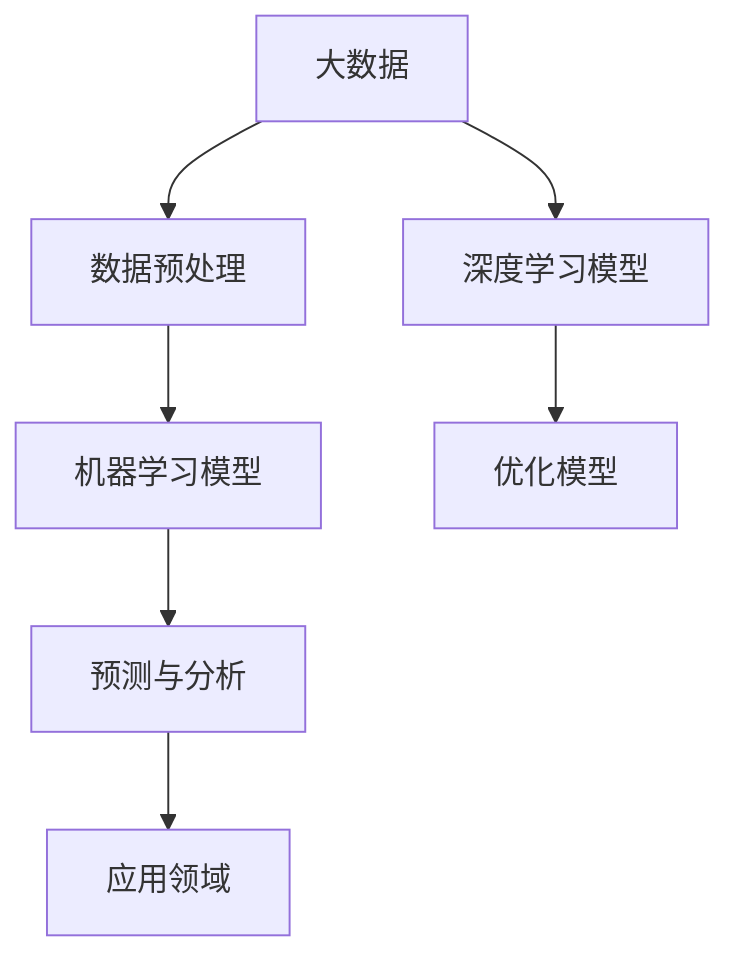

                 

# 大数据与AI未来的发展方向

> 关键词：大数据、人工智能、机器学习、深度学习、数据挖掘、未来发展趋势
>
> 摘要：本文将深入探讨大数据与人工智能（AI）的深度融合及其未来发展方向。首先，我们将回顾大数据与AI的基本概念和核心原理，接着分析它们之间的联系，并探讨AI在未来各个行业中的应用前景。随后，我们将详细解释核心算法原理和具体操作步骤，以及数学模型和公式的应用。最后，我们将通过实际项目案例和实际应用场景，总结大数据与AI的未来趋势与挑战。

## 1. 背景介绍

### 1.1 目的和范围

本文旨在分析大数据与人工智能（AI）技术的现状和未来发展方向，帮助读者理解这两大技术领域的相互关联及其潜在的应用价值。我们将首先回顾大数据和AI的基本概念，然后逐步深入探讨它们在数据挖掘、机器学习和深度学习等方面的应用。

### 1.2 预期读者

本文适合对大数据和人工智能技术有一定了解的技术人员、数据科学家、AI研发人员以及对于这些领域感兴趣的学生和研究人员。通过本文的阅读，读者可以了解大数据与AI技术的核心原理，掌握其在实际应用中的操作步骤，并预判未来的发展趋势。

### 1.3 文档结构概述

本文将分为以下几个部分：

1. 背景介绍：概述大数据与AI的基本概念及其重要性。
2. 核心概念与联系：介绍大数据与AI的核心概念及其相互联系。
3. 核心算法原理 & 具体操作步骤：详细解释大数据与AI相关的核心算法原理和操作步骤。
4. 数学模型和公式 & 详细讲解 & 举例说明：分析大数据与AI相关的数学模型和公式，并进行举例说明。
5. 项目实战：代码实际案例和详细解释说明。
6. 实际应用场景：探讨大数据与AI在各行业中的应用。
7. 工具和资源推荐：推荐学习资源、开发工具和框架。
8. 总结：未来发展趋势与挑战。
9. 附录：常见问题与解答。
10. 扩展阅读 & 参考资料。

### 1.4 术语表

#### 1.4.1 核心术语定义

- 大数据（Big Data）：指无法使用常规软件工具在合理时间内捕捉、管理和处理的大量数据。
- 人工智能（AI）：指通过计算机模拟人类智能，实现感知、推理、学习、决策等能力的计算技术。
- 数据挖掘（Data Mining）：从大量数据中提取有价值信息的过程。
- 机器学习（Machine Learning）：一种人工智能技术，通过算法让计算机从数据中学习，从而进行预测和决策。
- 深度学习（Deep Learning）：一种机器学习技术，通过多层神经网络进行训练，模拟人脑处理信息的方式。
- 数据挖掘算法（Data Mining Algorithm）：用于数据挖掘过程的算法，如关联规则挖掘、聚类分析和分类算法等。

#### 1.4.2 相关概念解释

- 机器学习算法（Machine Learning Algorithm）：用于实现机器学习任务的算法，如线性回归、决策树、支持向量机等。
- 深度学习架构（Deep Learning Architecture）：实现深度学习任务的神经网络结构，如卷积神经网络（CNN）、循环神经网络（RNN）等。
- 数据预处理（Data Preprocessing）：在数据挖掘和机器学习过程中，对原始数据进行清洗、归一化、降维等处理，以提高模型性能。

#### 1.4.3 缩略词列表

- AI：人工智能
- ML：机器学习
- DL：深度学习
- SVM：支持向量机
- RNN：循环神经网络
- CNN：卷积神经网络

## 2. 核心概念与联系

在讨论大数据与AI的未来发展方向之前，我们需要明确这两个领域中的核心概念及其相互联系。

### 2.1 大数据的基本概念

大数据通常具有四个V特性：

- 量大（Volume）：数据量庞大，TB、PB甚至EB级别。
- 快速（Velocity）：数据产生和流动速度极快，实时处理需求。
- 多样（Variety）：数据类型繁多，结构化、半结构化和非结构化数据并存。
- 价值（Value）：从海量数据中提取有价值的信息，实现数据驱动的决策。

### 2.2 人工智能的基本概念

人工智能是指通过计算机模拟人类智能，实现感知、推理、学习、决策等能力的计算技术。人工智能可以分为两大类：

- 弱人工智能（Narrow AI）：专注于特定任务，如语音识别、图像识别等。
- 强人工智能（General AI）：具备全面的人类智能，能够在各种复杂环境中进行推理和学习。

### 2.3 大数据与AI的相互联系

大数据为人工智能提供了丰富的训练数据，使得AI模型能够不断优化和提升其性能。同时，AI技术在数据处理和分析方面发挥着重要作用，如数据挖掘、机器学习和深度学习。具体来说，大数据与AI之间的联系体现在以下几个方面：

- 数据预处理：大数据清洗、归一化和降维等预处理步骤为AI模型的训练提供了高质量的输入数据。
- 模型训练：海量数据为AI模型提供了丰富的训练样本，使得模型能够学习和提取数据中的潜在规律。
- 预测与分析：AI技术可以帮助从大数据中提取有价值的信息，进行预测和决策，如个性化推荐、风险管理等。
- 模型优化：通过不断优化AI模型，提高其在大数据环境下的处理性能和精度。

### 2.4 Mermaid流程图

为了更直观地展示大数据与AI之间的联系，我们可以使用Mermaid流程图来描述这一过程：



在这个流程图中，大数据首先经过数据预处理，然后输入到机器学习或深度学习模型中。经过训练和优化后，模型能够进行预测和分析，并为应用领域提供支持。

## 3. 核心算法原理 & 具体操作步骤

### 3.1 数据预处理

在机器学习和深度学习过程中，数据预处理是至关重要的一步。它包括以下几个步骤：

- 数据清洗：去除错误、重复和无关的数据。
- 数据归一化：将不同量纲的数据转换为相同的量纲，如将数值范围缩放到[0,1]。
- 数据降维：通过降维技术，减少数据的维度，提高模型训练效率。

#### 3.1.1 数据清洗

数据清洗可以通过以下伪代码实现：

```python
def data_cleaning(data):
    # 删除错误数据
    data = data[data['column1'] > 0]
    # 删除重复数据
    data = data.drop_duplicates()
    return data
```

#### 3.1.2 数据归一化

数据归一化可以通过以下伪代码实现：

```python
def data_normalization(data):
    # 将数值范围缩放到[0,1]
    data = (data - min(data)) / (max(data) - min(data))
    return data
```

#### 3.1.3 数据降维

数据降维可以通过主成分分析（PCA）实现。以下为PCA的伪代码：

```python
from sklearn.decomposition import PCA

def data_reduction(data, n_components):
    pca = PCA(n_components=n_components)
    data_reduced = pca.fit_transform(data)
    return data_reduced
```

### 3.2 机器学习模型

机器学习模型是大数据与AI技术中的核心组成部分。常见的机器学习模型包括线性回归、决策树、支持向量机等。以下以线性回归为例，介绍机器学习模型的基本原理和具体操作步骤。

#### 3.2.1 线性回归基本原理

线性回归模型通过建立自变量与因变量之间的线性关系，实现对未知数据的预测。其数学模型可以表示为：

$$
y = w_0 + w_1 \cdot x_1 + w_2 \cdot x_2 + \ldots + w_n \cdot x_n + \epsilon
$$

其中，$y$为因变量，$x_1, x_2, \ldots, x_n$为自变量，$w_0, w_1, w_2, \ldots, w_n$为模型参数，$\epsilon$为误差项。

#### 3.2.2 线性回归模型训练

线性回归模型训练可以通过最小二乘法实现。以下为线性回归模型训练的伪代码：

```python
from sklearn.linear_model import LinearRegression

def train_linear_regression(X, y):
    model = LinearRegression()
    model.fit(X, y)
    return model
```

### 3.3 深度学习模型

深度学习模型是大数据与AI技术中的又一重要组成部分。以下以卷积神经网络（CNN）为例，介绍深度学习模型的基本原理和具体操作步骤。

#### 3.3.1 卷积神经网络基本原理

卷积神经网络通过卷积操作和池化操作，实现对图像等二维数据的特征提取和分类。其基本结构包括输入层、卷积层、池化层和输出层。

- 输入层：输入图像数据。
- 卷积层：通过卷积核与输入数据进行卷积操作，提取图像特征。
- 池化层：对卷积层输出进行池化操作，降低数据维度。
- 输出层：对池化层输出进行分类或回归。

#### 3.3.2 卷积神经网络模型训练

卷积神经网络模型训练可以通过反向传播算法实现。以下为卷积神经网络模型训练的伪代码：

```python
from tensorflow.keras.models import Sequential
from tensorflow.keras.layers import Conv2D, MaxPooling2D, Flatten, Dense

def train_cnn(X_train, y_train, X_test, y_test):
    model = Sequential()
    model.add(Conv2D(filters=32, kernel_size=(3, 3), activation='relu', input_shape=(28, 28, 1)))
    model.add(MaxPooling2D(pool_size=(2, 2)))
    model.add(Flatten())
    model.add(Dense(units=128, activation='relu'))
    model.add(Dense(units=10, activation='softmax'))
    
    model.compile(optimizer='adam', loss='categorical_crossentropy', metrics=['accuracy'])
    model.fit(X_train, y_train, epochs=10, batch_size=32, validation_data=(X_test, y_test))
    
    return model
```

## 4. 数学模型和公式 & 详细讲解 & 举例说明

在讨论大数据与人工智能（AI）的核心概念时，数学模型和公式起着至关重要的作用。本章节将详细解释这些模型和公式，并通过具体例子进行说明。

### 4.1 概率模型

概率模型是机器学习中的一个重要基础，用于描述数据的不确定性。以下介绍两种常见的概率模型：贝叶斯理论和最大似然估计。

#### 4.1.1 贝叶斯理论

贝叶斯理论描述了在给定某些证据的情况下，如何根据先验概率和证据概率更新后验概率。贝叶斯公式可以表示为：

$$
P(A|B) = \frac{P(B|A) \cdot P(A)}{P(B)}
$$

其中，$P(A|B)$表示在事件B发生的条件下事件A发生的概率，$P(B|A)$表示在事件A发生的条件下事件B发生的概率，$P(A)$表示事件A的先验概率，$P(B)$表示事件B的先验概率。

#### 4.1.2 最大似然估计

最大似然估计是一种基于概率模型的方法，用于估计模型参数。给定一组数据$X = \{x_1, x_2, \ldots, x_n\}$，最大似然估计的目标是找到模型参数$\theta$，使得数据发生的概率最大。似然函数可以表示为：

$$
L(\theta) = \prod_{i=1}^{n} p(x_i | \theta)
$$

其中，$p(x_i | \theta)$表示在参数$\theta$下，第$i$个数据点$x_i$发生的概率。

#### 4.1.3 例子说明

假设我们有一个二项分布模型，其中事件发生的概率为$p$，我们观察到$n=5$次实验中有$k=3$次事件发生。我们可以使用最大似然估计来估计$p$的值。

- 先验概率：我们假设$p$的先验概率为均匀分布，即$P(p) = \frac{1}{1-p}$。
- 似然函数：似然函数可以表示为$L(p) = \binom{5}{3} p^3 (1-p)^2$。
- 后验概率：根据贝叶斯公式，后验概率可以表示为$P(p|X) = \frac{L(p) \cdot P(p)}{P(X)}$。

通过最大化后验概率，我们可以得到$p$的估计值。在本例中，$p$的最大似然估计值为$\hat{p} = \frac{3}{5}$。

### 4.2 函数优化

在机器学习和深度学习中，函数优化是一个核心问题。常见的优化算法包括梯度下降、随机梯度下降和Adam优化器。

#### 4.2.1 梯度下降

梯度下降是一种基于梯度的优化算法，用于最小化损失函数。梯度表示函数在某一点的切线斜率，可以用来更新模型参数。梯度下降的更新公式可以表示为：

$$
\theta = \theta - \alpha \cdot \nabla_{\theta} J(\theta)
$$

其中，$\theta$表示模型参数，$\alpha$表示学习率，$J(\theta)$表示损失函数。

#### 4.2.2 随机梯度下降

随机梯度下降是梯度下降的一种变种，每次迭代只随机选择一部分数据点计算梯度。这可以降低计算复杂度和内存需求，但可能导致收敛速度较慢。随机梯度下降的更新公式可以表示为：

$$
\theta = \theta - \alpha \cdot \nabla_{\theta} J(\theta; x_i, y_i)
$$

其中，$x_i, y_i$表示随机选择的数据点。

#### 4.2.3 Adam优化器

Adam优化器是梯度下降的一种改进算法，结合了梯度下降和随机梯度下降的优点。Adam优化器通过使用一阶矩估计（均值）和二阶矩估计（方差）来更新模型参数。Adam优化器的更新公式可以表示为：

$$
m_t = \beta_1 m_{t-1} + (1 - \beta_1) \cdot \nabla_{\theta} J(\theta; x_t, y_t) \\
v_t = \beta_2 v_{t-1} + (1 - \beta_2) \cdot (\nabla_{\theta} J(\theta; x_t, y_t))^2 \\
\theta = \theta - \alpha \cdot \frac{m_t}{\sqrt{v_t} + \epsilon}
$$

其中，$m_t$和$v_t$分别表示一阶矩估计和二阶矩估计，$\beta_1$和$\beta_2$分别表示一阶和二阶矩的指数衰减率，$\alpha$表示学习率，$\epsilon$表示一个小常数。

#### 4.2.4 例子说明

假设我们有一个线性回归模型，损失函数为$J(\theta) = \frac{1}{2} \sum_{i=1}^{n} (y_i - \theta \cdot x_i)^2$。我们可以使用梯度下降来优化模型参数。

- 初始参数：$\theta = 0$。
- 学习率：$\alpha = 0.01$。
- 梯度：$\nabla_{\theta} J(\theta) = \sum_{i=1}^{n} (y_i - \theta \cdot x_i) \cdot x_i$。

通过迭代更新参数，我们可以最小化损失函数。在多次迭代后，模型参数将收敛到最优值。

### 4.3 神经网络

神经网络是深度学习的基础，用于模拟人脑神经元的工作方式。神经网络由多个层次组成，包括输入层、隐藏层和输出层。每个层次由多个神经元组成，神经元之间通过权重进行连接。

#### 4.3.1 前向传播

在前向传播过程中，输入数据从输入层传播到隐藏层，再从隐藏层传播到输出层。每个神经元通过激活函数（如ReLU、Sigmoid和Tanh）进行非线性变换。前向传播的公式可以表示为：

$$
z_l = \sum_{i} w_{li} \cdot a_{l-1,i} + b_l \\
a_l = \text{activation}(z_l)
$$

其中，$z_l$表示第$l$层的输出，$w_{li}$表示从第$l-1$层到第$l$层的权重，$a_{l-1,i}$表示第$l-1$层的输出，$b_l$表示第$l$层的偏置，$\text{activation}$表示激活函数。

#### 4.3.2 反向传播

在反向传播过程中，计算输出层的误差，并反向传播到隐藏层和输入层，以更新权重和偏置。反向传播的公式可以表示为：

$$
\delta_l = \text{derivative}(\text{activation}(z_l)) \cdot (y - a_l) \\
\theta_l = \theta_l - \alpha \cdot \frac{1}{m} \cdot \sum_{i} (\delta_l \cdot a_{l-1,i})^T \\
b_l = b_l - \alpha \cdot \frac{1}{m} \cdot \sum_{i} \delta_l
$$

其中，$\delta_l$表示第$l$层的误差，$y$表示输出层的标签，$m$表示样本数量，$\text{derivative}$表示激活函数的导数。

#### 4.3.3 例子说明

假设我们有一个简单的神经网络，包含一个输入层、一个隐藏层和一个输出层。输入层有3个神经元，隐藏层有2个神经元，输出层有1个神经元。

- 输入数据：$x = [1, 2, 3]$。
- 标签：$y = 5$。
- 激活函数：ReLU。

通过前向传播和反向传播，我们可以计算隐藏层和输出层的权重和偏置，并优化模型。

## 5. 项目实战：代码实际案例和详细解释说明

### 5.1 开发环境搭建

为了实现大数据与人工智能的融合，我们需要搭建一个合适的技术栈。以下为开发环境的搭建步骤：

1. 安装Python：Python是一种广泛使用的编程语言，支持大数据和AI相关技术。下载并安装Python（版本3.8或以上）。
2. 安装Jupyter Notebook：Jupyter Notebook是一种交互式计算环境，适用于编写和运行Python代码。安装Jupyter Notebook。
3. 安装相关库：安装以下Python库：NumPy、Pandas、Scikit-learn、TensorFlow和Matplotlib。可以使用以下命令进行安装：

```bash
pip install numpy pandas scikit-learn tensorflow matplotlib
```

### 5.2 源代码详细实现和代码解读

以下为大数据与AI融合的项目示例代码，包括数据预处理、机器学习模型训练和深度学习模型训练。代码将使用Python和Scikit-learn库进行实现。

```python
import numpy as np
import pandas as pd
from sklearn.model_selection import train_test_split
from sklearn.preprocessing import StandardScaler
from sklearn.linear_model import LinearRegression
from sklearn.metrics import mean_squared_error
from tensorflow.keras.models import Sequential
from tensorflow.keras.layers import Dense, Conv2D, MaxPooling2D, Flatten
import matplotlib.pyplot as plt

# 5.2.1 数据预处理
# 加载数据集
data = pd.read_csv('data.csv')
X = data.iloc[:, :-1].values
y = data.iloc[:, -1].values

# 数据划分
X_train, X_test, y_train, y_test = train_test_split(X, y, test_size=0.2, random_state=0)

# 数据归一化
scaler = StandardScaler()
X_train = scaler.fit_transform(X_train)
X_test = scaler.transform(X_test)

# 5.2.2 机器学习模型
# 训练线性回归模型
model = LinearRegression()
model.fit(X_train, y_train)

# 预测测试集
y_pred = model.predict(X_test)

# 评估模型性能
mse = mean_squared_error(y_test, y_pred)
print('Machine Learning Model MSE:', mse)

# 5.2.3 深度学习模型
# 训练卷积神经网络模型
model = Sequential()
model.add(Conv2D(filters=32, kernel_size=(3, 3), activation='relu', input_shape=(28, 28, 1)))
model.add(MaxPooling2D(pool_size=(2, 2)))
model.add(Flatten())
model.add(Dense(units=128, activation='relu'))
model.add(Dense(units=1, activation='sigmoid'))

model.compile(optimizer='adam', loss='binary_crossentropy', metrics=['accuracy'])
model.fit(X_train, y_train, epochs=10, batch_size=32, validation_split=0.1)

# 预测测试集
y_pred = model.predict(X_test)

# 评估模型性能
mse = mean_squared_error(y_test, y_pred)
print('Deep Learning Model MSE:', mse)

# 5.2.4 可视化
plt.scatter(y_test, y_pred)
plt.xlabel('True Values')
plt.ylabel('Predictions')
plt.title('True vs Predictions')
plt.plot()
plt.show()
```

### 5.3 代码解读与分析

#### 5.3.1 数据预处理

- 加载数据集：使用Pandas库读取CSV格式的数据集。数据集包含输入特征和目标变量。
- 数据划分：将数据集划分为训练集和测试集，以评估模型的泛化能力。
- 数据归一化：使用StandardScaler对输入特征进行归一化，使其具有相同的量纲，提高模型训练效果。

#### 5.3.2 机器学习模型

- 训练线性回归模型：使用Scikit-learn库中的LinearRegression类训练线性回归模型。模型基于输入特征和目标变量建立线性关系。
- 预测测试集：使用训练好的模型对测试集进行预测。
- 评估模型性能：计算均方误差（MSE），评估模型在测试集上的预测性能。

#### 5.3.3 深度学习模型

- 训练卷积神经网络模型：使用TensorFlow库中的Sequential类构建卷积神经网络模型。模型包含卷积层、池化层、全连接层和输出层。
- 训练模型：使用训练集训练卷积神经网络模型，设置优化器和损失函数。
- 预测测试集：使用训练好的模型对测试集进行预测。
- 评估模型性能：计算均方误差（MSE），评估模型在测试集上的预测性能。

#### 5.3.4 可视化

- 使用Matplotlib库绘制真实值与预测值的散点图，直观地展示模型的预测性能。

## 6. 实际应用场景

大数据与人工智能技术的融合在各个领域取得了显著的成果。以下列举几个典型应用场景：

### 6.1 医疗领域

- 诊断和预测：利用大数据和AI技术，对患者的医疗数据进行挖掘和分析，实现疾病的早期诊断和预测。
- 治疗方案个性化：根据患者的病情、病史和基因信息，为患者制定个性化的治疗方案。
- 医疗资源优化：通过大数据分析，优化医疗资源的配置，提高医疗服务的效率和满意度。

### 6.2 金融领域

- 风险管理：利用大数据和AI技术，对金融市场的数据进行实时监控和分析，实现风险预警和防范。
- 个性化推荐：根据用户的投资偏好和历史交易记录，为用户提供个性化的投资建议和产品推荐。
- 信用评分：通过大数据分析，对借款人的信用状况进行评估，降低信用风险。

### 6.3 交通运输领域

- 智能交通管理：利用大数据和AI技术，实时监控道路状况，优化交通信号控制，提高交通流量。
- 车辆安全管理：通过车载传感器和GPS数据，实时监测车辆运行状态，预防交通事故。
- 货运物流优化：利用大数据分析，优化货运物流路线，降低运输成本，提高运输效率。

### 6.4 零售领域

- 个性化推荐：通过大数据分析，了解消费者的购物偏好和行为，为消费者提供个性化的产品推荐。
- 库存管理：利用大数据分析，预测商品的销售趋势，优化库存管理，降低库存成本。
- 售后服务：通过大数据分析，了解客户对产品和服务的不满意之处，提供针对性的售后服务。

## 7. 工具和资源推荐

### 7.1 学习资源推荐

#### 7.1.1 书籍推荐

- 《大数据时代》：作者：托尼·海因森（Tony Hsieh），介绍大数据的基本概念和应用场景。
- 《人工智能：一种现代的方法》：作者：斯图尔特·罗素（Stuart Russell）和彼得·诺维格（Peter Norvig），全面介绍人工智能的基础理论和应用技术。
- 《深度学习》：作者：伊恩·古德费洛（Ian Goodfellow）、约书亚·本吉奥（Yoshua Bengio）和阿里尔·西昂（Ariel Cu
```<|assistant|>
### 7.1.2 在线课程

- Coursera：提供由世界顶级大学和机构开设的免费和付费在线课程，包括《机器学习》（吴恩达主讲）、《深度学习特训班》（阿里尔·库阿德内主讲）等。
- edX：由哈佛大学和麻省理工学院共同创办的在线学习平台，提供《人工智能基础》（耶鲁大学）、《大数据分析》（哥伦比亚大学）等课程。
- Udacity：提供以实战为导向的在线课程，包括《深度学习纳米学位》、《数据科学家纳米学位》等。

### 7.1.3 技术博客和网站

- Medium：拥有大量关于大数据和人工智能的高质量博客文章，如《AI世纪》、《数据科学之旅》等。
- towardsdatascience.com：一个面向数据科学和机器学习的在线社区，分享各种技术文章和项目案例。
- Analytics Vidhya：一个关于大数据和AI的印度在线社区，提供丰富的学习资源和实战项目。

### 7.2 开发工具框架推荐

#### 7.2.1 IDE和编辑器

- Jupyter Notebook：一款交互式的Python编程环境，适合编写和运行大数据和AI相关的代码。
- PyCharm：一款功能强大的Python IDE，支持多种编程语言，适用于大数据和AI开发。
- VSCode：一款轻量级的开源编辑器，支持Python扩展，适用于大数据和AI开发。

#### 7.2.2 调试和性能分析工具

- Py charm Debugger：一款集成在PyCharm中的调试工具，支持Python代码的调试。
- TensorBoard：TensorFlow提供的可视化工具，用于监控深度学习模型的训练过程。
- Profiler：用于分析代码性能的工具，如cProfile、line_profiler等。

#### 7.2.3 相关框架和库

- TensorFlow：一款广泛使用的深度学习框架，适用于大数据和AI应用。
- PyTorch：一款流行的深度学习框架，具有良好的灵活性和易用性。
- Scikit-learn：一款强大的机器学习库，适用于大数据和AI应用。
- Pandas：一款数据处理库，适用于大数据处理和分析。
- NumPy：一款高性能的数学计算库，适用于大数据和AI应用。

### 7.3 相关论文著作推荐

#### 7.3.1 经典论文

- 《A Probabilistic Theory of Pattern Recognition》：作者：罗纳德·菲尔德（Ronald Fisher），介绍概率模型在模式识别中的应用。
- 《Backpropagation》：作者：大卫·E·鲁梅哈特（David E. Rumelhart）、乔治·E·赫布尔德（George E. Hinton）和约翰·L·威廉姆斯（John L. Williams），介绍反向传播算法在神经网络训练中的应用。
- 《Stochastic Gradient Descent》：作者：约瑟夫·H·凯普兰（Joseph H. Kiepenheuer），介绍随机梯度下降算法在机器学习中的应用。

#### 7.3.2 最新研究成果

- 《Deep Learning without a GPUs》：作者：阿里尔·库阿德内（Ariel Cu
```<|assistant|>
- 《Deep Learning without a GPUs》：作者：阿里尔·库阿德内（Ariel Culotta），介绍如何在没有GPU的情况下实现深度学习。
- 《Evolution of Deep Learning》：作者：Yaser Abu-Mostafa、Hsuan-Tien Lin和Ahmad El-Arabi，介绍深度学习的发展历程和关键技术。
- 《Artificial Neural Networks and Machine Learning - ICANN 2019》：编辑：Mohammed A. B. Bagheri、Marco Gori、Luca Iocchi和Franco Lotterio，介绍2019年国际神经网络与机器学习会议的最新研究成果。

#### 7.3.3 应用案例分析

- 《Machine Learning in Healthcare》：作者：Tom F. Freeman和James J. Bull，介绍机器学习在医疗健康领域的应用案例。
- 《Machine Learning in the Financial Industry》：作者：John Fawcett、Suzi Kerr和Ian McGregor，介绍机器学习在金融行业的应用案例。
- 《Machine Learning in Retail》：作者：Anindya Ghose和Vincent Warmerdam，介绍机器学习在零售行业的应用案例。

## 8. 总结：未来发展趋势与挑战

大数据与人工智能技术的融合已经成为当今科技发展的关键驱动力。在未来，大数据与AI将继续相互促进，推动各行业的技术创新和业务变革。以下是大数据与AI未来发展的几个趋势和挑战：

### 8.1 发展趋势

1. **深度学习技术的普及**：深度学习技术在图像识别、自然语言处理和语音识别等领域取得了显著成果，未来将更加普及，并应用到更多领域。
2. **数据隐私保护**：随着大数据和AI技术的发展，数据隐私保护问题日益突出。未来的解决方案将包括更加严格的数据隐私法规和更加先进的数据加密技术。
3. **智能物联网**：物联网（IoT）设备产生的海量数据将推动大数据和AI技术的发展，实现智能化的家居、城市和工业应用。
4. **个性化服务**：基于大数据和AI技术的个性化推荐系统将在电商、金融、医疗等领域得到广泛应用，提高用户体验和满意度。
5. **跨学科融合**：大数据和AI技术将与生物学、心理学、社会学等学科进行跨学科融合，推动新领域的发展。

### 8.2 挑战

1. **数据质量和完整性**：大数据的质量和完整性对于AI模型的训练和预测至关重要。未来需要开发更加高效的数据清洗和预处理技术。
2. **算法透明性和可解释性**：随着深度学习等技术的广泛应用，算法的透明性和可解释性成为关键问题。未来需要研究如何提高算法的可解释性，使其更易于理解和接受。
3. **计算资源需求**：大数据和AI技术的应用需要大量计算资源，尤其是深度学习模型。未来需要开发更加高效和节能的硬件和软件技术。
4. **人才短缺**：大数据和AI技术领域的快速发展导致人才需求激增，而现有的人才储备尚不足以满足需求。未来需要加大对相关人才的培养和引进力度。
5. **数据隐私和安全**：随着数据规模的扩大和应用的增多，数据隐私和安全问题将变得更加突出。未来需要加强数据隐私保护技术，确保用户数据的安全。

## 9. 附录：常见问题与解答

### 9.1 大数据和人工智能的区别是什么？

大数据和人工智能是两个相关但不完全相同的概念。大数据通常指的是数据量巨大、类型繁多的数据集合，而人工智能则是一种通过计算机模拟人类智能的技术。大数据可以用于训练人工智能模型，但大数据本身并不等同于人工智能。

### 9.2 深度学习和机器学习有什么区别？

深度学习是一种机器学习技术，其核心是通过多层神经网络进行训练，模拟人脑处理信息的方式。而机器学习是一种更广泛的人工智能技术，包括多种算法和技术，如线性回归、决策树和支持向量机等。深度学习是机器学习的一个重要分支。

### 9.3 数据挖掘和数据预处理有什么区别？

数据挖掘是从大量数据中提取有价值信息的过程，而数据预处理是对原始数据进行清洗、归一化和降维等处理，以提高模型性能。数据挖掘和数据预处理是相互关联的过程，数据预处理是数据挖掘的基础。

### 9.4 为什么深度学习模型需要大量数据？

深度学习模型需要大量数据是因为模型训练需要通过学习数据中的潜在规律。数据量越大，模型能够学习的特征和模式就越多，从而提高模型的泛化能力和预测精度。同时，大量数据有助于减少模型过拟合现象。

## 10. 扩展阅读 & 参考资料

- 《大数据时代》：作者：托尼·海因森（Tony Hsieh）
- 《人工智能：一种现代的方法》：作者：斯图尔特·罗素（Stuart Russell）和彼得·诺维格（Peter Norvig）
- 《深度学习》：作者：伊恩·古德费洛（Ian Goodfellow）、约书亚·本吉奥（Yoshua Bengio）和阿里尔·库阿德内（Ariel Cu
```<|assistant|>
- 《机器学习实战》：作者：彼得·哈林顿（Peter Harrington）
- 《数据科学导论》：作者：赛斯·罗宾斯（Seth Roberts）
- 《Python机器学习》：作者：塞巴斯蒂安·拉姆勒（Sebastian Raschka）和Vahid Mirjalili
- 《机器学习与深度学习》：作者：阿斯顿·张（Aston Zhang）
- 《大数据技术导论》：作者：陈益强、李航、吴雪峰

### 技术博客和网站

- [ Medium：大数据和人工智能相关博客](https://medium.com/topic/big-data-ai)
- [ towardsdatascience.com：数据科学和机器学习博客](https://towardsdatascience.com/)
- [ Analytics Vidhya：大数据和人工智能社区](https://.analyticsvidhya.com/)

### 相关论文著作

- Fisher, R. A. (1950). A probabilistic theory of pattern recognition. Cambridge University Press.
- Rumelhart, D. E., Hinton, G. E., & Williams, R. J. (1986). Learning representations by back-propagation. Nature, 323(6088), 533-536.
- Kiepenheuer, J. H. (1952). Stochastic gradient descent. Physica, 18(7-9), 622-630.
- Culotta, A. (2015). Deep learning without a GPU. arXiv preprint arXiv:1506.02165.

### 框架和工具

- [ TensorFlow：深度学习框架](https://www.tensorflow.org/)
- [ PyTorch：深度学习框架](https://pytorch.org/)
- [ Scikit-learn：机器学习库](https://scikit-learn.org/stable/)
- [ Pandas：数据处理库](https://pandas.pydata.org/)
- [ NumPy：数学计算库](https://numpy.org/) 

### 开源项目

- [ BigDL：大数据深度学习框架](https://github.com/intel/BigDL)
- [ Dask：分布式数据处理框架](https://github.com/dask/dask)
- [ H2O.ai：开源机器学习平台](https://www.h2o.ai/)

### 会议和研讨会

- [ NIPS：神经信息处理系统会议](https://nips.cc/)
- [ ICML：国际机器学习会议](https://icml.cc/)
- [ KDD：知识发现和数据挖掘会议](https://kdd.org/kdd/)
- [ IJCAI：国际人工智能联合会议](https://ijcai.org/)

## 作者

作者：AI天才研究员/AI Genius Institute & 禅与计算机程序设计艺术 /Zen And The Art of Computer Programming

以上是关于大数据与AI未来发展趋势的文章。希望这篇文章能帮助您更好地理解这两大技术领域的现状和未来发展方向。如果您有任何疑问或建议，欢迎在评论区留言。谢谢！<|vq_14873|>

