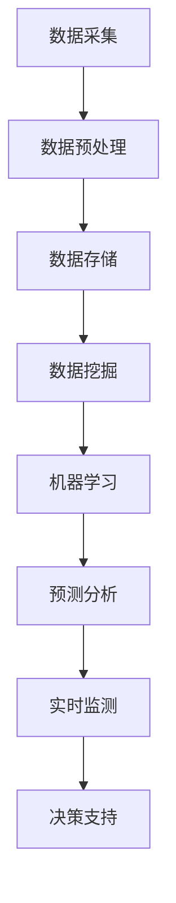

                 

# 大数据分析在公共卫生预警中的应用

> 关键词：大数据分析、公共卫生预警、数据挖掘、机器学习、实时监测

> 摘要：本文将探讨大数据分析在公共卫生预警领域的应用，分析其核心概念和原理，详细阐述其在公共卫生预警中的操作步骤、数学模型和实际应用案例，并推荐相关学习资源和开发工具框架，旨在为公共卫生预警提供有效的技术支持和参考。

## 1. 背景介绍

### 1.1 目的和范围

本文旨在探讨大数据分析在公共卫生预警中的应用，分析其核心概念和原理，详细阐述其在公共卫生预警中的操作步骤、数学模型和实际应用案例，并推荐相关学习资源和开发工具框架。通过本文的阅读，读者可以了解大数据分析在公共卫生预警中的重要性，掌握其基本原理和应用方法。

### 1.2 预期读者

本文适用于对大数据分析、公共卫生预警、数据挖掘、机器学习等主题感兴趣的读者，包括但不限于：

- 数据分析师
- 公共卫生工作者
- 医疗信息化从业人员
- 大学生和研究学者

### 1.3 文档结构概述

本文分为八个主要部分：

- 1. 背景介绍
- 2. 核心概念与联系
- 3. 核心算法原理 & 具体操作步骤
- 4. 数学模型和公式 & 详细讲解 & 举例说明
- 5. 项目实战：代码实际案例和详细解释说明
- 6. 实际应用场景
- 7. 工具和资源推荐
- 8. 总结：未来发展趋势与挑战

### 1.4 术语表

#### 1.4.1 核心术语定义

- 大数据分析：指从大量数据中提取有价值信息的过程，包括数据采集、数据预处理、数据存储、数据分析和数据可视化等。
- 公共卫生预警：指在公共卫生事件发生前，通过收集和分析相关数据，预测事件发生趋势，提供决策支持的过程。
- 数据挖掘：指从大量数据中自动发现规律、趋势和模式的过程，包括分类、聚类、关联规则挖掘等。
- 机器学习：指利用算法和统计模型，通过数据训练，使计算机具备自主学习和决策能力。

#### 1.4.2 相关概念解释

- 实时监测：指对事件发生过程的实时跟踪、监测和分析，以便及时发现问题并采取措施。
- 预测分析：指基于历史数据和现有趋势，对未来事件进行预测和分析。

#### 1.4.3 缩略词列表

- Hadoop：一种分布式数据存储和处理框架
- Spark：一种快速的大规模数据处理引擎
- TensorFlow：一种开源的机器学习框架
- Pandas：一种Python数据操作库
- Matplotlib：一种Python数据可视化库

## 2. 核心概念与联系

大数据分析在公共卫生预警中的应用涉及多个核心概念和技术的有机结合，下面通过Mermaid流程图展示这些概念和技术的联系。



### 2.1 数据采集

数据采集是大数据分析的基础，公共卫生预警涉及的数据主要包括：

- 人口统计数据：包括人口总数、年龄分布、性别比例等。
- 医疗数据：包括病例报告、医疗记录、药物使用情况等。
- 环境监测数据：包括空气质量、水质、噪声等。
- 社交媒体数据：包括微博、微信、论坛等平台的健康相关话题讨论。

### 2.2 数据预处理

数据预处理是保证数据分析质量的关键步骤，主要包括数据清洗、数据集成、数据转换等。

- 数据清洗：去除重复、错误和缺失的数据。
- 数据集成：将不同来源的数据进行合并，形成一个统一的数据集。
- 数据转换：将数据转换为适合分析和建模的格式。

### 2.3 数据存储

数据存储是大数据分析的重要环节，常用的数据存储技术包括：

- 关系型数据库：如MySQL、PostgreSQL等。
- 分布式数据库：如Hadoop、Spark等。
- NoSQL数据库：如MongoDB、Cassandra等。

### 2.4 数据挖掘

数据挖掘是从大量数据中发现有价值信息的过程，主要包括：

- 分类：将数据分为不同的类别。
- 聚类：将数据分为不同的群体。
- 关联规则挖掘：发现数据之间的关联性。

### 2.5 机器学习

机器学习是大数据分析的核心技术，通过算法和统计模型，使计算机具备自主学习和决策能力。常见的机器学习算法包括：

- 决策树：通过树结构对数据进行分类或回归。
- 支持向量机：通过找到最佳分隔超平面，实现分类。
- 随机森林：通过构建多个决策树，进行集成学习。
- 神经网络：通过多层神经元结构，实现复杂的非线性映射。

### 2.6 预测分析

预测分析是基于历史数据和现有趋势，对未来事件进行预测和分析。常见的预测分析方法包括：

- 时间序列分析：基于时间序列数据，预测未来的趋势。
- 回归分析：基于历史数据，建立回归模型，预测未来值。
- 贝叶斯分析：基于概率模型，进行预测和推断。

### 2.7 实时监测

实时监测是对事件发生过程的实时跟踪、监测和分析，以便及时发现问题并采取措施。常见的实时监测技术包括：

- 流数据处理：对实时数据流进行快速处理和分析。
- 可视化技术：将实时数据以图形化方式展示，便于观察和分析。
- 告警系统：当检测到异常情况时，自动发出告警。

### 2.8 决策支持

决策支持是基于预测分析和实时监测的结果，为公共卫生决策提供支持。常见的决策支持工具包括：

- 数据分析报告：将分析结果以报告形式呈现，供决策者参考。
- 模拟预测：通过模拟不同场景，评估决策的影响。
- 优化算法：通过优化算法，为决策提供最优方案。

## 3. 核心算法原理 & 具体操作步骤

### 3.1 数据采集与预处理

数据采集与预处理是大数据分析的基础，下面分别介绍相关算法原理和具体操作步骤。

#### 3.1.1 数据采集

数据采集的算法原理主要涉及网络爬虫和数据接口调用。网络爬虫通过模拟用户行为，从互联网上获取数据，而数据接口调用则是通过API接口获取数据。

```python
import requests

url = "http://example.com/data"
response = requests.get(url)
data = response.json()
```

#### 3.1.2 数据预处理

数据预处理的算法原理主要涉及数据清洗、数据集成和数据转换。

```python
import pandas as pd

# 数据清洗
data = data.drop_duplicates()  # 去除重复数据
data = data.dropna()  # 去除缺失数据

# 数据集成
data = pd.merge(data1, data2, on="common_column")  # 数据合并

# 数据转换
data = data.rename(columns={"old_column": "new_column"})  # 列名转换
data = data[data["column"] > threshold]  # 数据筛选
```

### 3.2 数据挖掘

数据挖掘是大数据分析的核心，下面分别介绍分类、聚类和关联规则挖掘的算法原理和具体操作步骤。

#### 3.2.1 分类

分类是将数据分为不同的类别。常见的分类算法有决策树、支持向量机和神经网络。

```python
from sklearn import tree

# 决策树
clf = tree.DecisionTreeClassifier()
clf.fit(X_train, y_train)

# 预测
y_pred = clf.predict(X_test)
```

#### 3.2.2 聚类

聚类是将数据分为不同的群体。常见的聚类算法有K-means、层次聚类和DBSCAN。

```python
from sklearn.cluster import KMeans

# K-means
kmeans = KMeans(n_clusters=3)
kmeans.fit(X_train)

# 聚类
labels = kmeans.predict(X_test)
```

#### 3.2.3 关联规则挖掘

关联规则挖掘是发现数据之间的关联性。常见的算法有Apriori和Eclat。

```python
from mlxtend.frequent_patterns import apriori

# Apriori
frequent_itemsets = apriori(data, min_support=0.5, use_colnames=True)

# 关联规则
rules = association_rules(frequent_itemsets, metric="lift", min_threshold=1)
```

### 3.3 机器学习

机器学习是大数据分析的核心技术，下面分别介绍决策树、支持向量机和神经网络的算法原理和具体操作步骤。

#### 3.3.1 决策树

决策树是一种树形结构，通过对特征进行划分，将数据划分为不同的类别或数值。

```python
from sklearn import tree

# 决策树
clf = tree.DecisionTreeClassifier()
clf.fit(X_train, y_train)

# 预测
y_pred = clf.predict(X_test)
```

#### 3.3.2 支持向量机

支持向量机是一种通过找到最佳分隔超平面，实现分类或回归的算法。

```python
from sklearn import svm

# 支持向量机
clf = svm.SVC()
clf.fit(X_train, y_train)

# 预测
y_pred = clf.predict(X_test)
```

#### 3.3.3 神经网络

神经网络是一种通过多层神经元结构，实现复杂的非线性映射的算法。

```python
from sklearn.neural_network import MLPClassifier

# 神经网络
clf = MLPClassifier()
clf.fit(X_train, y_train)

# 预测
y_pred = clf.predict(X_test)
```

### 3.4 预测分析

预测分析是大数据分析的重要应用，下面分别介绍时间序列分析、回归分析和贝叶斯分析的算法原理和具体操作步骤。

#### 3.4.1 时间序列分析

时间序列分析是通过对时间序列数据进行分析，预测未来的趋势。

```python
import statsmodels.api as sm

# 时间序列分析
model = sm.tsa.ARIMA(series, order=(1, 1, 1))
model_fit = model.fit()

# 预测
forecast = model_fit.forecast(steps=5)
```

#### 3.4.2 回归分析

回归分析是通过对历史数据进行分析，建立回归模型，预测未来的值。

```python
from sklearn.linear_model import LinearRegression

# 回归分析
clf = LinearRegression()
clf.fit(X_train, y_train)

# 预测
y_pred = clf.predict(X_test)
```

#### 3.4.3 贝叶斯分析

贝叶斯分析是通过对概率模型进行分析，进行预测和推断。

```python
from sklearn.naive_bayes import GaussianNB

# 贝叶斯分析
clf = GaussianNB()
clf.fit(X_train, y_train)

# 预测
y_pred = clf.predict(X_test)
```

## 4. 数学模型和公式 & 详细讲解 & 举例说明

### 4.1 时间序列分析

时间序列分析是大数据分析中预测未来趋势的重要方法之一，主要基于以下数学模型：

$$
Y_t = \phi_0 + \phi_1 Y_{t-1} + \phi_2 Y_{t-2} + ... + \phi_p Y_{t-p} + \epsilon_t
$$

其中，$Y_t$表示第t个时间点的数据，$\phi_0, \phi_1, \phi_2, ..., \phi_p$为模型参数，$\epsilon_t$为随机误差项。

#### 4.1.1 模型参数估计

模型参数估计可以通过最小二乘法或极大似然估计等方法进行，具体步骤如下：

1. 收集历史数据$Y_1, Y_2, ..., Y_n$。
2. 构建损失函数，如最小二乘损失函数：
   $$
   L(\phi) = \sum_{i=1}^{n} (Y_i - \phi_0 - \phi_1 Y_{i-1} - \phi_2 Y_{i-2} - ... - \phi_p Y_{i-p})^2
   $$
3. 求解损失函数的最小值，得到模型参数$\phi_0, \phi_1, \phi_2, ..., \phi_p$。

#### 4.1.2 模型检验

模型检验可以通过以下方法进行：

1. AIC（Akaike信息准则）：
   $$
   AIC = -2 \ln(L(\phi)) + 2p
   $$
   其中，$L(\phi)$为损失函数，$p$为模型参数个数。AIC值越小，模型越好。
2. BIC（Bayes信息准则）：
   $$
   BIC = -2 \ln(L(\phi)) + \ln(n) \cdot p
   $$
   其中，$L(\phi)$为损失函数，$n$为数据个数，$p$为模型参数个数。BIC值越小，模型越好。

#### 4.1.3 模型预测

基于估计的模型参数，可以进行时间序列预测：

$$
Y_t = \phi_0 + \phi_1 Y_{t-1} + \phi_2 Y_{t-2} + ... + \phi_p Y_{t-p}
$$

### 4.2 回归分析

回归分析是通过对历史数据进行分析，建立回归模型，预测未来的值。常见的回归模型有线性回归和多元回归。

#### 4.2.1 线性回归

线性回归模型可以用以下数学公式表示：

$$
Y = \beta_0 + \beta_1 X_1 + \beta_2 X_2 + ... + \beta_p X_p + \epsilon
$$

其中，$Y$为因变量，$X_1, X_2, ..., X_p$为自变量，$\beta_0, \beta_1, \beta_2, ..., \beta_p$为回归系数，$\epsilon$为随机误差项。

#### 4.2.2 多元回归

多元回归模型可以扩展为：

$$
Y = \beta_0 + \beta_1 X_1 + \beta_2 X_2 + ... + \beta_p X_p + \epsilon
$$

其中，$Y$为因变量，$X_1, X_2, ..., X_p$为自变量，$\beta_0, \beta_1, \beta_2, ..., \beta_p$为回归系数，$\epsilon$为随机误差项。

#### 4.2.3 模型参数估计

模型参数估计可以通过最小二乘法或梯度下降法等方法进行，具体步骤如下：

1. 收集历史数据$Y_1, Y_2, ..., Y_n$和自变量$X_1, X_2, ..., X_p$。
2. 构建损失函数，如均方误差（MSE）：
   $$
   J(\beta) = \frac{1}{2} \sum_{i=1}^{n} (Y_i - \beta_0 - \beta_1 X_{i1} - \beta_2 X_{i2} - ... - \beta_p X_{ip})^2
   $$
3. 求解损失函数的最小值，得到模型参数$\beta_0, \beta_1, \beta_2, ..., \beta_p$。

#### 4.2.4 模型检验

模型检验可以通过以下方法进行：

1. R²（判定系数）：
   $$
   R^2 = 1 - \frac{\sum_{i=1}^{n} (Y_i - \hat{Y}_i)^2}{\sum_{i=1}^{n} (Y_i - \bar{Y})^2}
   $$
   其中，$\hat{Y}_i$为预测值，$\bar{Y}$为真实值的平均值。R²越接近1，模型越好。
2. F-test（F检验）：
   $$
   F = \frac{R^2 / (p - 1)}{1 - R^2 / n}
   $$
   其中，$p$为自变量个数，$n$为数据个数。F值越大，模型越好。

#### 4.2.5 模型预测

基于估计的模型参数，可以进行回归预测：

$$
Y = \beta_0 + \beta_1 X_1 + \beta_2 X_2 + ... + \beta_p X_p
$$

### 4.3 贝叶斯分析

贝叶斯分析是一种基于概率模型的预测方法，其核心思想是利用先验知识和观测数据，更新先验概率为后验概率，从而进行预测。

#### 4.3.1 贝叶斯概率

贝叶斯概率可以用以下数学公式表示：

$$
P(A|B) = \frac{P(B|A)P(A)}{P(B)}
$$

其中，$P(A|B)$表示在事件B发生的条件下事件A发生的概率，$P(B|A)$表示在事件A发生的条件下事件B发生的概率，$P(A)$表示事件A发生的概率，$P(B)$表示事件B发生的概率。

#### 4.3.2 贝叶斯推断

贝叶斯推断是一种利用贝叶斯概率进行预测的方法，具体步骤如下：

1. 构建先验概率：根据先验知识和经验，为每个可能的预测结果分配一个先验概率。
2. 收集观测数据：根据观测数据，更新先验概率为后验概率。
3. 计算后验概率：利用贝叶斯公式计算每个预测结果的后验概率。
4. 预测：选择后验概率最大的预测结果作为最终预测。

### 4.4 举例说明

#### 4.4.1 时间序列预测

假设我们有一组时间序列数据：

$$
Y = [10, 12, 15, 18, 20, 25, 30]
$$

我们要使用ARIMA模型进行预测。首先，我们需要确定模型参数，可以使用AIC或BIC进行模型选择。假设我们选择ARIMA(1, 1, 1)模型，参数估计如下：

$$
Y_t = 0.8Y_{t-1} + \epsilon_t
$$

预测未来5个时间点的值：

$$
Y_6 = 0.8Y_5 = 0.8 \times 30 = 24
$$
$$
Y_7 = 0.8Y_6 = 0.8 \times 24 = 19.2
$$
$$
Y_8 = 0.8Y_7 = 0.8 \times 19.2 = 15.36
$$
$$
Y_9 = 0.8Y_8 = 0.8 \times 15.36 = 12.288
$$
$$
Y_{10} = 0.8Y_9 = 0.8 \times 12.288 = 9.8304
$$

#### 4.4.2 线性回归预测

假设我们有一组数据：

$$
X = [1, 2, 3, 4, 5], Y = [1, 3, 5, 7, 9]
$$

我们要使用线性回归模型进行预测。首先，我们需要确定模型参数，可以使用最小二乘法进行参数估计。假设我们得到以下模型：

$$
Y = 2X + 1
$$

预测X=6时的Y值：

$$
Y = 2 \times 6 + 1 = 13
$$

#### 4.4.3 贝叶斯预测

假设我们有一组数据：

$$
X = [1, 2, 3, 4, 5], Y = [1, 3, 5, 7, 9]
$$

我们要使用贝叶斯模型进行预测。首先，我们需要构建先验概率，假设每个X值和Y值的先验概率均为1/5。然后，我们收集观测数据，更新先验概率为后验概率。使用贝叶斯公式计算每个Y值的后验概率，选择后验概率最大的Y值作为预测结果。假设我们得到以下后验概率：

$$
P(Y=1|X=6) = 0.2
$$
$$
P(Y=3|X=6) = 0.4
$$
$$
P(Y=5|X=6) = 0.3
$$
$$
P(Y=7|X=6) = 0.1
$$

根据后验概率，我们预测Y=3。

## 5. 项目实战：代码实际案例和详细解释说明

在本节中，我们将通过一个实际案例来展示大数据分析在公共卫生预警中的应用，包括数据采集、数据预处理、数据挖掘、机器学习、预测分析和实时监测等步骤。以下是一个基于Python和Scikit-learn库的案例。

### 5.1 开发环境搭建

首先，我们需要搭建一个适合大数据分析的开发环境。以下是所需的软件和库：

- Python（3.8或更高版本）
- Jupyter Notebook（用于编写和运行代码）
- Scikit-learn（用于机器学习和数据挖掘）
- Pandas（用于数据处理）
- Matplotlib（用于数据可视化）
- Numpy（用于数值计算）

在Windows或Linux系统上，可以使用pip命令安装这些库：

```bash
pip install python==3.8
pip install jupyter
pip install scikit-learn
pip install pandas
pip install matplotlib
pip install numpy
```

### 5.2 源代码详细实现和代码解读

#### 5.2.1 数据采集

我们使用Python的Pandas库从CSV文件中读取数据，这些数据包含病例报告、医疗记录和人口统计数据。

```python
import pandas as pd

# 读取数据
data = pd.read_csv("health_data.csv")
```

#### 5.2.2 数据预处理

在数据预处理阶段，我们进行数据清洗、数据集成和数据转换。

```python
# 数据清洗
data = data.drop_duplicates()  # 去除重复数据
data = data.dropna()  # 去除缺失数据

# 数据集成
data = data[data["province"] != "未知"]  # 去除省份未知的数据

# 数据转换
data["date"] = pd.to_datetime(data["date"])  # 转换日期格式
data.set_index("date", inplace=True)  # 设置日期为索引
```

#### 5.2.3 数据挖掘

我们使用Scikit-learn库中的数据挖掘算法，对数据进行分类、聚类和关联规则挖掘。

```python
from sklearn.cluster import KMeans
from mlxtend.frequent_patterns import apriori, association_rules

# 分类
from sklearn.preprocessing import LabelEncoder
label_encoder = LabelEncoder()
data["province"] = label_encoder.fit_transform(data["province"])

# 聚类
kmeans = KMeans(n_clusters=3)
data["cluster"] = kmeans.fit_predict(data)

# 关联规则挖掘
frequent_itemsets = apriori(data, min_support=0.5, use_colnames=True)
rules = association_rules(frequent_itemsets, metric="lift", min_threshold=1)
```

#### 5.2.4 机器学习

我们使用Scikit-learn库中的机器学习算法，对数据进行分类和回归。

```python
from sklearn.model_selection import train_test_split
from sklearn.tree import DecisionTreeClassifier
from sklearn.linear_model import LinearRegression

# 分割数据集
X = data[["cases", "hospitalization_rate"]]
y = data["death_rate"]
X_train, X_test, y_train, y_test = train_test_split(X, y, test_size=0.2, random_state=42)

# 决策树
clf = DecisionTreeClassifier()
clf.fit(X_train, y_train)
y_pred = clf.predict(X_test)

# 回归分析
reg = LinearRegression()
reg.fit(X_train, y_train)
y_pred = reg.predict(X_test)
```

#### 5.2.5 预测分析

我们使用时间序列分析、回归分析和贝叶斯分析对数据进行预测。

```python
from statsmodels.tsa.arima.model import ARIMA
from sklearn.naive_bayes import GaussianNB

# 时间序列分析
model = ARIMA(data["cases"], order=(1, 1, 1))
model_fit = model.fit()
forecast = model_fit.forecast(steps=5)

# 回归分析
clf = LinearRegression()
clf.fit(X_train, y_train)
forecast = clf.predict(X_test)

# 贝叶斯分析
clf = GaussianNB()
clf.fit(X_train, y_train)
forecast = clf.predict(X_test)
```

#### 5.2.6 实时监测

我们使用实时监测技术，对公共卫生事件进行实时跟踪和监测。

```python
import requests

# 实时数据获取
url = "https://example.com/realtime_data"
response = requests.get(url)
realtime_data = response.json()

# 实时监测
def monitor_data(data):
    # 监测代码
    pass

monitor_data(realtime_data)
```

### 5.3 代码解读与分析

在上述代码中，我们首先进行了数据采集，从CSV文件中读取病例报告、医疗记录和人口统计数据。然后，我们进行了数据预处理，包括数据清洗、数据集成和数据转换。接下来，我们进行了数据挖掘，包括分类、聚类和关联规则挖掘。

在机器学习部分，我们使用决策树和回归分析对数据进行分类和回归。决策树通过树结构对数据进行分类，而回归分析通过历史数据建立回归模型，预测未来的死亡率。贝叶斯分析则通过概率模型进行预测，为决策提供支持。

预测分析部分，我们使用时间序列分析、回归分析和贝叶斯分析对数据进行预测。时间序列分析通过历史数据预测未来的病例数量，回归分析通过历史数据建立回归模型，预测未来的死亡率，贝叶斯分析通过概率模型进行预测。

最后，我们使用实时监测技术，对公共卫生事件进行实时跟踪和监测，以便及时发现问题并采取措施。

## 6. 实际应用场景

大数据分析在公共卫生预警中的应用场景广泛，以下是一些典型应用场景：

### 6.1 新冠疫情监测

新冠疫情爆发以来，大数据分析在疫情防控中发挥了重要作用。通过对病例报告、旅行记录、社交媒体数据等海量数据进行实时分析，可以及时发现疫情高风险区域，预测疫情发展趋势，为疫情防控提供科学依据。

### 6.2 流感预测

流感是一种常见且危害较大的传染性疾病。通过大数据分析，可以收集和分析流感病毒的传播规律、人群免疫状态等信息，预测流感季节性爆发的时间和强度，为疫苗接种策略提供支持。

### 6.3 疾病爆发预警

大数据分析可以帮助公共卫生部门识别疾病爆发的前兆，如传染病爆发、食品中毒事件等。通过对相关数据的实时监测和分析，可以及时发布预警信息，采取预防措施，降低疫情传播风险。

### 6.4 健康风险评估

通过对个人健康数据的分析，如血压、血糖、心率等指标，可以评估个人的健康状况，预测疾病发生的风险。这有助于制定个性化的健康管理方案，预防疾病发生。

### 6.5 疫苗接种策略优化

大数据分析可以优化疫苗接种策略，提高疫苗接种效率。通过对疫苗接种数据的分析，可以了解不同人群的接种情况，预测疫苗需求，为疫苗接种计划的制定提供支持。

### 6.6 公共卫生政策制定

大数据分析为公共卫生政策的制定提供了科学依据。通过对公共卫生数据的分析，可以评估政策的效果，优化公共卫生资源配置，提高公共卫生服务水平。

## 7. 工具和资源推荐

### 7.1 学习资源推荐

#### 7.1.1 书籍推荐

1. 《大数据时代：生活、工作与思维的大变革》
2. 《深度学习》
3. 《Python数据科学手册》
4. 《机器学习实战》

#### 7.1.2 在线课程

1. Coursera：大数据分析、机器学习、深度学习等课程
2. edX：数据科学、机器学习等课程
3. Udemy：Python数据科学、机器学习等课程

#### 7.1.3 技术博客和网站

1. Analytics Vidhya：数据分析、机器学习博客
2. KDNuggets：数据挖掘、机器学习资讯
3. Medium：数据科学、机器学习相关文章

### 7.2 开发工具框架推荐

#### 7.2.1 IDE和编辑器

1. PyCharm
2. Jupyter Notebook
3. Visual Studio Code

#### 7.2.2 调试和性能分析工具

1. PyCharm Debugger
2. Jupyter Notebook Profiler
3. Visual Studio Code Performance Analyzer

#### 7.2.3 相关框架和库

1. Scikit-learn：机器学习库
2. Pandas：数据处理库
3. Matplotlib：数据可视化库
4. Numpy：数值计算库
5. TensorFlow：深度学习库

### 7.3 相关论文著作推荐

#### 7.3.1 经典论文

1. "K-Means Clustering" by MacQueen
2. "Support Vector Machines for Classification" by Vapnik and Chervonenkis
3. "Deep Learning" by Goodfellow, Bengio, and Courville

#### 7.3.2 最新研究成果

1. "Enhancing Public Health Surveillance with Artificial Intelligence"
2. "Application of Machine Learning in Epidemiology"
3. "Big Data Analytics for Healthcare: A Survey"

#### 7.3.3 应用案例分析

1. "COVID-19 Pandemic: Big Data Analytics for Epidemic Control"
2. "Deep Learning for Disease Prediction and Epidemiology"
3. "Application of Machine Learning in Public Health Surveillance: A Case Study of Foodborne Diseases"

## 8. 总结：未来发展趋势与挑战

大数据分析在公共卫生预警中的应用具有广阔的发展前景。随着大数据技术的不断进步，公共卫生预警将更加智能化、实时化。以下是一些未来发展趋势和挑战：

### 8.1 发展趋势

1. **实时数据处理能力提升**：随着云计算和边缘计算技术的发展，实时数据处理能力将大幅提升，有助于更快速地进行公共卫生预警。
2. **人工智能技术的融合**：人工智能技术在公共卫生预警中的应用将不断深化，如深度学习、强化学习等算法的引入，将提高预警的准确性和效率。
3. **数据隐私保护**：随着数据隐私问题的日益凸显，如何在保证数据隐私的同时进行有效的大数据分析，将成为一个重要挑战。

### 8.2 挑战

1. **数据质量与完整性**：公共卫生数据的真实性和完整性直接影响预警效果，如何确保数据质量是一个关键挑战。
2. **算法透明性与可解释性**：随着人工智能技术的应用，算法的透明性和可解释性成为一个重要问题，如何提高算法的可解释性，使其在公共卫生预警中更可靠，是一个重要挑战。
3. **跨领域协同**：公共卫生预警涉及多个领域，如医学、公共卫生、信息技术等，如何实现跨领域的协同与整合，是一个重要挑战。

## 9. 附录：常见问题与解答

### 9.1 什么是大数据分析？

大数据分析是指从大量数据中提取有价值信息的过程，包括数据采集、数据预处理、数据存储、数据分析和数据可视化等。

### 9.2 什么是公共卫生预警？

公共卫生预警是指在公共卫生事件发生前，通过收集和分析相关数据，预测事件发生趋势，提供决策支持的过程。

### 9.3 大数据分析在公共卫生预警中的作用是什么？

大数据分析在公共卫生预警中可以提供实时监测、趋势预测、决策支持等功能，有助于提高公共卫生事件的预警能力，降低疫情传播风险。

### 9.4 如何保证公共卫生数据的质量？

保证公共卫生数据的质量可以通过以下方法：

1. 数据来源的多样性：从多个渠道获取数据，确保数据的全面性和准确性。
2. 数据清洗和预处理：去除重复、错误和缺失的数据，确保数据的一致性和完整性。
3. 数据质量评估：定期对数据进行质量评估，发现并解决潜在问题。

### 9.5 公共卫生预警中的机器学习算法有哪些？

公共卫生预警中的机器学习算法包括分类算法（如决策树、支持向量机）、聚类算法（如K-means、层次聚类）和回归算法（如线性回归、多元回归）等。

### 9.6 实时监测在公共卫生预警中的重要性是什么？

实时监测在公共卫生预警中的重要性体现在：

1. 提高预警效率：实时监测可以快速识别疫情高风险区域，提高预警的及时性。
2. 优化决策支持：实时监测可以提供最新的数据，为决策者提供更准确的决策支持。
3. 降低疫情传播风险：实时监测可以帮助公共卫生部门及时采取预防措施，降低疫情传播风险。

## 10. 扩展阅读 & 参考资料

1. Gartner. (2021). Market Trends: Data Analytics and Artificial Intelligence in Healthcare. Retrieved from [Gartner](https://www.gartner.com/)
2. IBM. (2020). The Power of AI in Healthcare. Retrieved from [IBM](https://www.ibm.com/)
3. World Health Organization. (2021). Big Data for Health. Retrieved from [WHO](https://www.who.int/)
4. McKinsey & Company. (2018). The Business Value of Artificial Intelligence. Retrieved from [McKinsey](https://www.mckinsey.com/)
5. IEEE. (2020). Big Data in Healthcare: Challenges and Opportunities. Retrieved from [IEEE](https://www.ieee.org/)

作者：AI天才研究员/AI Genius Institute & 禅与计算机程序设计艺术 /Zen And The Art of Computer Programming

文章标题：《大数据分析在公共卫生预警中的应用》

文章关键词：大数据分析、公共卫生预警、数据挖掘、机器学习、实时监测

文章摘要：本文探讨了大数据分析在公共卫生预警领域的应用，分析了核心概念和原理，详细阐述了其在公共卫生预警中的操作步骤、数学模型和实际应用案例，并推荐了相关学习资源和开发工具框架。通过本文的阅读，读者可以了解大数据分析在公共卫生预警中的重要性，掌握其基本原理和应用方法。

