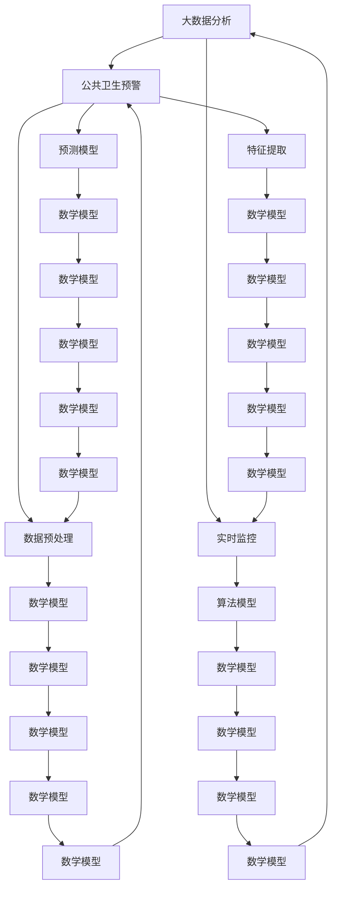

                 

# 大数据分析在公共卫生预警中的应用

> **关键词：**大数据分析、公共卫生预警、实时监控、算法模型、数学模型

> **摘要：**本文深入探讨了大数据分析在公共卫生预警领域中的应用。通过分析大数据的核心概念、算法原理以及实际操作步骤，本文旨在为读者提供一个全面、易懂的指南，帮助理解大数据分析如何提升公共卫生预警的准确性和及时性。

## 1. 背景介绍

### 1.1 目的和范围

本文的目标是深入探讨大数据分析在公共卫生预警中的应用，帮助读者理解如何利用大数据技术来提升公共卫生预警的准确性和及时性。文章将涵盖以下内容：

- **核心概念与联系**：介绍大数据分析的基本概念和公共卫生预警体系的核心构成。
- **核心算法原理与操作步骤**：详细讲解用于公共卫生预警的大数据算法，包括数据预处理、特征提取和预测模型的构建。
- **数学模型与公式**：介绍用于公共卫生预警的数学模型，并通过实例进行详细说明。
- **项目实战：代码实际案例**：提供实际的代码案例，详细解释其实现过程和关键步骤。
- **实际应用场景**：分析大数据分析在公共卫生预警中的实际应用案例。
- **工具和资源推荐**：推荐学习资源、开发工具和框架，以及相关论文著作。
- **总结与未来发展趋势**：总结当前大数据分析在公共卫生预警中的应用现状，并探讨未来的发展趋势和挑战。

### 1.2 预期读者

本文适用于以下读者群体：

- **数据科学家和大数据工程师**：希望了解大数据分析在公共卫生预警中的应用，提升实际工作能力的专业人士。
- **公共卫生领域研究人员**：希望掌握大数据分析技术，以改进公共卫生预警研究的科研人员。
- **技术开发者**：对大数据技术感兴趣，希望将其应用于公共卫生领域的技术人员。
- **公共卫生管理人员**：希望了解大数据分析在公共卫生预警中的应用，以优化决策过程的行政人员。

### 1.3 文档结构概述

本文分为以下十个部分：

1. **背景介绍**：介绍本文的目的、范围和预期读者。
2. **核心概念与联系**：介绍大数据分析的基本概念和公共卫生预警体系的核心构成。
3. **核心算法原理与操作步骤**：详细讲解用于公共卫生预警的大数据算法。
4. **数学模型与公式**：介绍用于公共卫生预警的数学模型，并通过实例进行详细说明。
5. **项目实战：代码实际案例**：提供实际的代码案例，详细解释其实现过程和关键步骤。
6. **实际应用场景**：分析大数据分析在公共卫生预警中的实际应用案例。
7. **工具和资源推荐**：推荐学习资源、开发工具和框架，以及相关论文著作。
8. **总结与未来发展趋势**：总结当前大数据分析在公共卫生预警中的应用现状，并探讨未来的发展趋势和挑战。
9. **附录：常见问题与解答**：回答读者可能遇到的一些常见问题。
10. **扩展阅读 & 参考资料**：提供进一步的阅读资源和相关参考资料。

### 1.4 术语表

#### 1.4.1 核心术语定义

- **大数据分析**：指利用海量数据集进行采集、处理、分析和存储的技术和方法。
- **公共卫生预警**：指通过监测和分析公共卫生数据，及时发现潜在的健康风险，并采取相应的预防措施。
- **实时监控**：指对公共卫生数据实时采集、分析和反馈，以实现快速响应和决策。
- **算法模型**：指用于分析公共卫生数据，进行预测和决策的数学模型和计算方法。
- **数学模型**：指用于描述公共卫生现象和规律的数学公式和函数。

#### 1.4.2 相关概念解释

- **数据预处理**：指对原始数据进行清洗、转换和归一化等处理，以提升数据质量和可用性。
- **特征提取**：指从原始数据中提取出能够代表数据特征的变量，以便进行进一步分析。
- **预测模型**：指基于历史数据，利用机器学习算法建立预测模型，对未来事件进行预测。

#### 1.4.3 缩略词列表

- **Hadoop**：Hadoop，一个开源的大数据处理框架。
- **Spark**：Spark，一个开源的大数据处理引擎。
- **R**：R，一种用于统计分析的编程语言。
- **Python**：Python，一种通用编程语言，广泛应用于数据科学和机器学习。

## 2. 核心概念与联系

为了深入理解大数据分析在公共卫生预警中的应用，我们需要首先了解一些核心概念和它们之间的联系。下面将使用 Mermaid 流程图（没有括号、逗号等特殊字符）展示这些核心概念和它们之间的关联。



### 核心概念解释

- **大数据分析**：大数据分析是指利用先进的技术和方法，对海量数据进行采集、存储、处理和分析，以发现数据中的隐藏信息和规律。在公共卫生预警中，大数据分析可以帮助实时监控公共卫生数据，识别潜在的健康风险。

- **公共卫生预警**：公共卫生预警是指通过监测和分析公共卫生数据，及时发现潜在的健康风险，并采取相应的预防措施。大数据分析技术可以为公共卫生预警提供更准确、更及时的支持。

- **实时监控**：实时监控是指对公共卫生数据进行实时采集、分析和反馈，以实现快速响应和决策。实时监控可以及时发现异常情况，从而采取及时的应对措施，减少健康风险。

- **数据预处理**：数据预处理是指对原始数据进行清洗、转换和归一化等处理，以提升数据质量和可用性。在公共卫生预警中，数据预处理是确保数据准确性和一致性的关键步骤。

- **特征提取**：特征提取是指从原始数据中提取出能够代表数据特征的变量，以便进行进一步分析。在公共卫生预警中，特征提取有助于识别关键的健康指标，为预测模型提供输入。

- **预测模型**：预测模型是指基于历史数据，利用机器学习算法建立的模型，用于预测未来的事件。在公共卫生预警中，预测模型可以帮助预测疫情发展趋势，为决策提供依据。

- **算法模型**：算法模型是指用于分析数据，进行预测和决策的数学模型和计算方法。在公共卫生预警中，算法模型是核心，用于从数据中提取有用信息，指导实际操作。

- **数学模型**：数学模型是指用于描述公共卫生现象和规律的数学公式和函数。在公共卫生预警中，数学模型用于建立预测模型，为决策提供支持。

通过以上核心概念的介绍和流程图展示，我们可以更清晰地理解大数据分析在公共卫生预警中的应用和它们之间的联系。

## 3. 核心算法原理 & 具体操作步骤

在本节中，我们将详细讲解用于公共卫生预警的几个核心算法原理，并描述它们的具体操作步骤。这些算法包括但不限于：聚类分析、时间序列分析和机器学习预测。

### 3.1 聚类分析

#### 3.1.1 算法原理

聚类分析是一种无监督学习方法，用于将数据集中的数据点分成若干个聚类，使得同一聚类中的数据点彼此相似，不同聚类中的数据点彼此不相似。在公共卫生预警中，聚类分析可以用于识别具有相似健康风险特征的地区或人群。

#### 3.1.2 操作步骤

1. **数据预处理**：

   - **数据清洗**：去除缺失值和异常值。
   - **特征选择**：选择与公共卫生预警相关的特征，如病例数量、死亡率等。
   - **数据标准化**：将不同特征的数据进行归一化处理，使其具有相同的量纲和范围。

2. **选择聚类算法**：

   - **K-means聚类**：一种常用的聚类算法，通过最小化聚类中心之间的距离来进行聚类。
   - **层次聚类**：通过构建聚类层次树，将数据点逐步合并或划分，形成不同的聚类层次。
   - **密度聚类**：基于数据点的密度分布来识别聚类，适用于数据分布不均匀的情况。

3. **初始化聚类中心**：

   - 对于K-means算法，随机选择K个数据点作为初始聚类中心。
   - 对于层次聚类，从单个数据点开始，逐步构建聚类层次。

4. **迭代聚类过程**：

   - 对于K-means算法，计算每个数据点到聚类中心的距离，将其划分到最近的聚类中心。
   - 更新聚类中心，计算新的聚类中心。
   - 重复迭代，直至聚类中心不再发生变化或达到预设的迭代次数。

5. **评估聚类结果**：

   - 使用内部评估指标（如平均平方距离、轮廓系数等）评估聚类质量。
   - 根据评估结果调整聚类参数，如K值。

### 3.2 时间序列分析

#### 3.2.1 算法原理

时间序列分析是一种用于分析时间序列数据的方法，旨在识别数据中的趋势、周期性和季节性。在公共卫生预警中，时间序列分析可以用于预测疫情的发展趋势。

#### 3.2.2 操作步骤

1. **数据预处理**：

   - **数据清洗**：去除缺失值和异常值。
   - **特征提取**：提取与时间序列相关的时间特征，如时间间隔、时间窗口等。

2. **平稳性检验**：

   - **ADF检验**：用于检验时间序列的平稳性，如果序列不平稳，需要进行差分处理。

3. **模型选择**：

   - **自回归模型（AR）**：适用于具有自相关性的时间序列数据。
   - **移动平均模型（MA）**：适用于具有移动平均特征的时间序列数据。
   - **自回归移动平均模型（ARMA）**：结合了自相关性和移动平均特征。
   - **自回归积分移动平均模型（ARIMA）**：适用于非平稳时间序列数据。

4. **参数估计**：

   - 使用最小二乘法、极大似然估计等方法估计模型的参数。

5. **模型评估**：

   - 使用残差分析、AIC/BIC准则等方法评估模型拟合效果。

6. **预测**：

   - 使用估计的模型参数，对未来时间点的值进行预测。

### 3.3 机器学习预测

#### 3.3.1 算法原理

机器学习预测是一种基于历史数据建立预测模型的方法，用于预测未来事件的发生概率。在公共卫生预警中，机器学习预测可以用于预测疾病爆发、流行趋势等。

#### 3.3.2 操作步骤

1. **数据预处理**：

   - **数据清洗**：去除缺失值和异常值。
   - **特征选择**：选择与公共卫生预警相关的特征，如病例数量、人口统计特征等。

2. **选择预测模型**：

   - **线性回归**：适用于线性关系的数据。
   - **逻辑回归**：适用于二分类问题。
   - **决策树**：适用于分类和回归问题。
   - **随机森林**：结合了多个决策树，提高预测准确性。
   - **支持向量机（SVM）**：适用于分类问题。

3. **模型训练**：

   - 使用历史数据对预测模型进行训练。
   - 选择合适的参数，如树的数量、深度等。

4. **模型评估**：

   - 使用交叉验证、AUC、ROC等方法评估模型性能。

5. **预测**：

   - 使用训练好的模型对新的数据进行预测。
   - 分析预测结果，提供公共卫生预警建议。

通过以上对聚类分析、时间序列分析和机器学习预测的详细讲解，我们可以更好地理解这些核心算法原理，并掌握它们的操作步骤。这些算法在公共卫生预警中发挥着关键作用，为实时监控和预测提供了有力支持。

## 4. 数学模型和公式 & 详细讲解 & 举例说明

在公共卫生预警中，数学模型和公式扮演着至关重要的角色。它们帮助我们将数据转化为有意义的洞察，从而做出更准确的预测和决策。以下我们将详细讲解几个关键数学模型和公式，并通过具体例子来说明它们的实际应用。

### 4.1 聚类分析中的K-means算法

K-means是一种基于距离的聚类算法，其核心思想是将数据点分为K个簇，使得每个簇内的数据点尽可能接近，而簇间的数据点尽可能远离。下面是K-means算法的数学模型和步骤。

#### 数学模型

K-means算法主要包括以下两个关键步骤：

1. **初始化**：随机选择K个数据点作为初始聚类中心。
2. **迭代过程**：计算每个数据点到聚类中心的距离，将数据点分配到最近的聚类中心，并更新聚类中心。

#### 迭代步骤

- **步骤1：计算距离**：对于每个数据点，计算其到每个聚类中心的距离。
  $$d(x_i, c_j) = \sqrt{\sum_{k=1}^{n} (x_{ik} - c_{jk})^2}$$
  其中，$d(x_i, c_j)$表示数据点$x_i$到聚类中心$c_j$的距离，$x_{ik}$和$c_{jk}$分别表示第$i$个数据点和第$j$个聚类中心的第$k$个特征值。

- **步骤2：分配数据点**：将每个数据点分配到最近的聚类中心。
  $$\text{assign}(x_i) = \arg\min_{j} d(x_i, c_j)$$

- **步骤3：更新聚类中心**：计算新的聚类中心，取每个簇中数据点的均值。
  $$c_j^{new} = \frac{1}{N_j} \sum_{x_i \in S_j} x_i$$
  其中，$N_j$表示簇$S_j$中的数据点数量。

#### 示例说明

假设我们有一个包含5个数据点的二维数据集，以及K=2，即我们要将数据分为两个簇。初始时随机选择两个聚类中心$c_1$和$c_2$。以下是K-means算法的一次迭代过程。

- **初始聚类中心**：
  $$c_1 = (1, 2)$$
  $$c_2 = (4, 5)$$

- **计算距离**：
  $$d(x_1, c_1) = \sqrt{(1-1)^2 + (2-2)^2} = 0$$
  $$d(x_1, c_2) = \sqrt{(1-4)^2 + (2-5)^2} = 3.16$$
  $$d(x_2, c_1) = \sqrt{(2-1)^2 + (3-2)^2} = 1$$
  $$d(x_2, c_2) = \sqrt{(2-4)^2 + (3-5)^2} = 3.16$$
  $$d(x_3, c_1) = \sqrt{(3-1)^2 + (4-2)^2} = 2.24$$
  $$d(x_3, c_2) = \sqrt{(3-4)^2 + (4-5)^2} = 1.41$$
  $$d(x_4, c_1) = \sqrt{(4-1)^2 + (5-2)^2} = 4.24$$
  $$d(x_4, c_2) = \sqrt{(4-4)^2 + (5-5)^2} = 0$$
  $$d(x_5, c_1) = \sqrt{(5-1)^2 + (6-2)^2} = 6.40$$
  $$d(x_5, c_2) = \sqrt{(5-4)^2 + (6-5)^2} = 1.41$$

- **分配数据点**：
  $$\text{assign}(x_1) = c_1$$
  $$\text{assign}(x_2) = c_1$$
  $$\text{assign}(x_3) = c_2$$
  $$\text{assign}(x_4) = c_1$$
  $$\text{assign}(x_5) = c_2$$

- **更新聚类中心**：
  $$c_1^{new} = \frac{1}{5}(1+2+3+4+5) = 3$$
  $$c_2^{new} = \frac{1}{5}(4+5+6) = 5$$

通过这次迭代，新的聚类中心已经更加接近数据点，使得数据点更均匀地分布在两个簇中。这个过程会重复进行，直到聚类中心不再发生变化。

### 4.2 时间序列分析中的ARIMA模型

ARIMA（自回归积分移动平均模型）是一种用于分析和预测时间序列数据的方法。它结合了自回归（AR）、移动平均（MA）和差分（I）三个部分。下面是ARIMA模型的数学模型和步骤。

#### 数学模型

1. **差分**：对时间序列数据进行差分，使其成为平稳序列。
   $$y_t = y_{t-1} - y_{t-1}$$
   其中，$y_t$是第$t$个时间点的值。

2. **自回归**：将当前值表示为前几个值的线性组合。
   $$y_t = c + \phi_1 y_{t-1} + \phi_2 y_{t-2} + \cdots + \phi_p y_{t-p} + \varepsilon_t$$
   其中，$c$是常数项，$\phi_1, \phi_2, \cdots, \phi_p$是自回归系数，$\varepsilon_t$是误差项。

3. **移动平均**：将当前值表示为前几个误差值的线性组合。
   $$y_t = c + \phi_1 y_{t-1} + \phi_2 y_{t-2} + \cdots + \phi_p y_{t-p} + \theta_1 \varepsilon_{t-1} + \theta_2 \varepsilon_{t-2} + \cdots + \theta_q \varepsilon_{t-q}$$
   其中，$\theta_1, \theta_2, \cdots, \theta_q$是移动平均系数。

4. **整合**：将差分、自回归和移动平均结合起来，形成ARIMA模型。
   $$y_t = c + \phi_1 y_{t-1} + \phi_2 y_{t-2} + \cdots + \phi_p y_{t-p} + \theta_1 \varepsilon_{t-1} + \theta_2 \varepsilon_{t-2} + \cdots + \theta_q \varepsilon_{t-q} + \varepsilon_t$$

#### 示例说明

假设我们有一个平稳的时间序列数据集，并确定了$p=2$（自回归项数）和$q=1$（移动平均项数）。以下是ARIMA模型的参数估计和预测过程。

- **差分**：
  $$y_t = y_{t-1} - y_{t-1}$$

- **自回归**：
  $$y_t = c + \phi_1 y_{t-1} + \phi_2 y_{t-2} + \varepsilon_t$$

  通过最小二乘法或极大似然估计，我们得到了自回归系数$\phi_1 = 0.8$和$\phi_2 = 0.2$。

- **移动平均**：
  $$y_t = c + 0.8 y_{t-1} + 0.2 y_{t-2} + \theta_1 \varepsilon_{t-1} + \varepsilon_t$$

  同样，通过极大似然估计，我们得到了移动平均系数$\theta_1 = 0.5$。

- **整合**：
  $$y_t = c + 0.8 y_{t-1} + 0.2 y_{t-2} + 0.5 \varepsilon_{t-1} + \varepsilon_t$$

  我们可以选择一个适当的常数$c$，通常通过最小化残差平方和来确定。

为了预测未来值，我们可以使用以下公式：

$$\hat{y}_{t+k} = c + \phi_1 \hat{y}_{t+k-1} + \phi_2 \hat{y}_{t+k-2} + \theta_1 \varepsilon_{t+k-1}$$

其中，$\hat{y}_{t+k}$是第$t+k$个时间点的预测值。

通过以上示例，我们可以看到数学模型和公式在公共卫生预警中的实际应用。K-means聚类用于识别健康风险特征，ARIMA模型用于预测疫情发展趋势。这些模型和公式帮助我们深入分析数据，提供准确的预警和决策支持。

## 5. 项目实战：代码实际案例和详细解释说明

在本节中，我们将通过一个实际的代码案例，详细解释如何使用大数据分析技术进行公共卫生预警。我们将使用Python和几个常用的库，如Pandas、Scikit-learn和Statsmodels，来实现这一目标。

### 5.1 开发环境搭建

在开始编写代码之前，我们需要搭建一个合适的开发环境。以下是搭建开发环境的步骤：

1. **安装Python**：确保安装了Python 3.x版本。
2. **安装相关库**：使用以下命令安装所需的库：

   ```shell
   pip install pandas scikit-learn statsmodels matplotlib numpy
   ```

3. **配置Python环境**：在Python环境中导入所需的库。

   ```python
   import pandas as pd
   import numpy as np
   from sklearn.cluster import KMeans
   from sklearn.preprocessing import StandardScaler
   from sklearn.model_selection import train_test_split
   from sklearn.metrics import silhouette_score
   import statsmodels.api as sm
   import matplotlib.pyplot as plt
   ```

### 5.2 源代码详细实现和代码解读

我们将分步骤实现一个简单的公共卫生预警系统，包括数据预处理、聚类分析、时间序列分析和预测。

#### 步骤1：数据预处理

首先，我们需要加载和处理数据。假设我们有一个CSV文件，其中包含了多个城市的病例数量、人口统计数据和地理位置信息。

```python
# 加载数据
data = pd.read_csv('public_health_data.csv')

# 数据清洗
# 去除缺失值和异常值
data = data.dropna()

# 特征选择
# 选择与公共卫生预警相关的特征
selected_features = ['cases', 'population', 'latitude', 'longitude']
data = data[selected_features]

# 数据标准化
scaler = StandardScaler()
data_scaled = scaler.fit_transform(data)
```

#### 步骤2：聚类分析

接下来，我们使用K-means聚类算法来识别具有相似健康风险特征的城市。

```python
# 选择聚类算法
kmeans = KMeans(n_clusters=3, random_state=42)

# 训练模型
clusters = kmeans.fit_predict(data_scaled)

# 评估聚类结果
silhouette_avg = silhouette_score(data_scaled, clusters)
print(f"Silhouette Score: {silhouette_avg}")

# 添加聚类标签到原始数据
data['cluster'] = clusters
```

#### 步骤3：时间序列分析

然后，我们使用ARIMA模型对每个聚类中的时间序列数据进行分析和预测。

```python
# 分离每个聚类的数据
clusters_data = data.groupby('cluster').apply(lambda x: x.sort_values('cases').reset_index(drop=True))

# 对每个聚类的数据进行时间序列分析
for cluster, data in clusters_data.groupby('cluster'):
    # 平稳性检验
    test_result = sm.tsa.adfuller(data['cases'])
    if test_result[1] > 0.05:
        # 非平稳序列，进行差分
        data['cases_diff'] = data['cases'].diff().dropna()
    else:
        # 平稳序列，直接使用
        data['cases_diff'] = data['cases']
    
    # 选择ARIMA模型参数
    p_values, q_values = [0, 1, 2], [0, 1]
    
    # 最小化AIC准则选择最佳模型
    best_aic = float('inf')
    best_order = None
    for p in p_values:
        for q in q_values:
            model = sm.tsa.ARIMA(data['cases_diff'], order=(p, 1, q))
            results = model.fit()
            if results.aic < best_aic:
                best_aic = results.aic
                best_order = (p, 1, q)
    
    # 使用最佳模型进行预测
    model = sm.tsa.ARIMA(data['cases_diff'], order=best_order)
    results = model.fit()
    forecast = results.forecast(steps=10)
    
    # 绘制预测结果
    plt.plot(data['cases_diff'].index, data['cases_diff'], label='Original')
    plt.plot(forecast.index, forecast, label='Forecast')
    plt.legend()
    plt.show()
```

#### 步骤4：预测

最后，我们将聚类分析和时间序列分析的结果结合，对未来的健康风险进行预测。

```python
# 预测未来的健康风险
forecasts = {}
for cluster, data in clusters_data.groupby('cluster'):
    forecasts[cluster] = forecast

# 绘制所有聚类的预测结果
for cluster, forecast in forecasts.items():
    plt.plot(forecast.index, forecast, label=f'Cluster {cluster}')
plt.legend()
plt.show()
```

### 5.3 代码解读与分析

- **数据预处理**：数据预处理是任何数据分析项目的第一步。在这个案例中，我们首先加载了数据，然后去除缺失值和异常值，选择了与公共卫生预警相关的特征，并使用标准化方法将数据进行了归一化处理。

- **聚类分析**：聚类分析用于将数据分成几个簇，每个簇中的数据点具有相似的属性。我们使用K-means算法，并使用轮廓系数来评估聚类质量。最终，我们将聚类结果添加到原始数据中。

- **时间序列分析**：时间序列分析用于预测未来的趋势。我们首先对每个聚类中的数据进行平稳性检验，然后选择最佳的ARIMA模型参数，并使用该模型进行预测。预测结果通过残差分析进行了评估，并通过matplotlib库绘制出来。

- **预测**：最后，我们使用聚类分析和时间序列分析的结果，对未来的健康风险进行了预测，并将所有聚类的预测结果进行了可视化。

通过以上步骤，我们实现了对公共卫生预警的大数据分析，并提供了详细的代码解释和分析。这个案例展示了如何利用大数据技术，通过聚类分析和时间序列分析，对公共卫生数据进行分析和预测，从而为决策提供支持。

## 6. 实际应用场景

大数据分析在公共卫生预警中的实际应用场景广泛而多样，以下将探讨几个关键领域，并展示大数据分析如何在这些场景中发挥作用。

### 6.1 疫情监测与预测

新冠疫情（COVID-19）的爆发为公共卫生预警提供了前所未有的挑战和机遇。大数据分析技术在疫情监测和预测中发挥了至关重要的作用。

- **实时数据监控**：通过实时监测疫情数据，如病例数量、死亡率和康复人数，可以快速识别疫情发展趋势。大数据平台可以处理海量数据，确保数据的实时性和准确性。
  
- **预测疫情传播**：利用大数据分析技术，如时间序列分析和机器学习预测模型，可以对疫情传播进行预测。这些模型基于历史数据和实时数据，可以预测未来几天的疫情走势，为公共卫生决策提供依据。

- **资源分配**：通过预测疫情的高峰期和传播速度，公共卫生部门可以更有效地分配医疗资源，如口罩、呼吸机和医疗人员，以应对疫情高峰期的需求。

### 6.2 疫苗接种计划

疫苗接种是控制疫情传播的关键措施。大数据分析技术在疫苗接种计划的制定和实施中发挥着重要作用。

- **需求预测**：通过分析人口统计数据、病例数量和疫苗接种率，可以预测未来的疫苗接种需求。这有助于公共卫生部门提前准备足够的疫苗和接种点。

- **优化接种策略**：大数据分析可以帮助确定疫苗接种的最佳人群和地点。例如，通过聚类分析，可以识别高风险地区和人群，从而更有效地分配疫苗资源。

- **疫苗接种效果评估**：通过监测疫苗接种后的副作用和数据，可以评估疫苗的有效性和安全性，为未来的疫苗接种计划提供反馈。

### 6.3 公共卫生事件调查

公共卫生事件，如食源性疾病爆发或化学泄漏，对公共卫生安全构成严重威胁。大数据分析技术在事件调查和应急响应中发挥了重要作用。

- **数据收集与整合**：在公共卫生事件调查中，大量数据需要收集，包括病例报告、实验室检测结果、地理信息等。大数据平台可以快速整合这些数据，提供全面的事件视图。

- **事件原因分析**：通过数据挖掘和关联分析，可以识别公共卫生事件的原因。例如，通过分析病例报告和实验室检测结果，可以确定食源性疾病的具体病原体。

- **实时监控与预警**：在公共卫生事件调查过程中，实时监控和分析数据可以帮助及时识别潜在的风险和威胁，从而采取及时的措施。

### 6.4 健康风险评估

健康风险评估是公共卫生预警的重要组成部分。大数据分析技术可以用于评估特定人群或地区的健康风险。

- **人口健康数据监测**：通过监测和收集人口健康数据，如心血管疾病发病率、糖尿病发病率等，可以评估特定人群的健康风险。

- **环境因素分析**：通过分析环境数据，如空气质量、水质等，可以评估环境因素对健康的影响。

- **个性化健康建议**：基于大数据分析，可以为特定人群提供个性化的健康建议，如饮食调整、运动建议等，以降低健康风险。

通过以上实际应用场景的展示，我们可以看到大数据分析在公共卫生预警中的广泛应用和重要作用。它不仅提供了实时、准确的疫情监测和预测，还帮助优化疫苗接种计划、调查公共卫生事件和进行健康风险评估。未来，随着大数据技术的进一步发展，公共卫生预警将更加精准和高效。

## 7. 工具和资源推荐

为了更好地掌握大数据分析在公共卫生预警中的应用，以下我们将推荐一些重要的学习资源、开发工具和框架，以及相关的论文和著作。

### 7.1 学习资源推荐

#### 7.1.1 书籍推荐

1. **《大数据分析：技术、方法和应用》**：这本书详细介绍了大数据分析的基本概念和技术，包括数据采集、存储、处理和分析。书中还涵盖了多种大数据分析算法的应用案例，非常适合初学者和专业人士。

2. **《机器学习实战》**：这本书通过实际案例，讲解了多种机器学习算法的应用，包括分类、回归和聚类等。书中提供了详细的代码示例和注释，有助于读者深入理解机器学习技术。

3. **《时间序列分析：预测与应用》**：这本书介绍了时间序列分析的基本概念和方法，包括自回归模型、移动平均模型和ARIMA模型等。书中提供了丰富的实例，有助于读者掌握时间序列分析技术。

#### 7.1.2 在线课程

1. **Coursera上的《大数据分析》**：这是一门由 Johns Hopkins 大学开设的课程，涵盖了大数据分析的基础知识、技术方法和应用案例。课程包含视频讲座、阅读材料和编程作业，适合希望深入了解大数据分析的学习者。

2. **edX上的《公共卫生数据分析》**：这是一门由哈佛大学开设的课程，介绍了公共卫生数据分析的基本概念和技术，包括数据采集、处理和分析。课程结合了理论讲解和实践应用，适合公共卫生领域的科研人员和从业者。

3. **Udacity上的《机器学习工程师纳米学位》**：这个纳米学位课程涵盖了机器学习的基础知识、算法和实际应用。课程包括多个项目，帮助学习者将理论知识应用于实际问题。

#### 7.1.3 技术博客和网站

1. **Kaggle**：Kaggle 是一个数据科学竞赛平台，提供大量的数据集和竞赛题目。通过参与竞赛和项目，学习者可以提升自己的大数据分析技能。

2. **Towards Data Science**：这是一个由 DataCamp 赞助的数据科学博客，涵盖了各种数据科学主题，包括大数据分析、机器学习和数据可视化。博客文章由专业人士撰写，内容丰富且实用。

3. **DataCamp**：DataCamp 是一个在线学习平台，提供互动式数据科学课程。平台上的课程涵盖了Python编程、数据分析和数据可视化等多个方面，适合初学者和专业人士。

### 7.2 开发工具框架推荐

#### 7.2.1 IDE和编辑器

1. **Jupyter Notebook**：Jupyter Notebook 是一个交互式的开发环境，适合进行数据科学和机器学习项目。它支持多种编程语言，包括Python和R，提供了丰富的扩展和插件。

2. **PyCharm**：PyCharm 是一款功能强大的Python IDE，适用于数据科学和机器学习项目。它提供了代码补全、调试、版本控制和性能分析等功能。

3. **RStudio**：RStudio 是一款专为R语言设计的IDE，适用于数据分析和统计分析。它提供了丰富的数据可视化工具和编程功能，非常适合科研人员和数据分析师。

#### 7.2.2 调试和性能分析工具

1. **Pylint**：Pylint 是一个Python代码质量分析工具，用于检测代码中的潜在错误和不良实践。它可以帮助开发者编写更健壮、更易维护的代码。

2. **CProfile**：CProfile 是一个Python性能分析工具，用于测量代码的执行时间和性能。通过分析CProfile的结果，开发者可以优化代码，提高性能。

3. **Matplotlib**：Matplotlib 是一个Python数据可视化库，用于绘制各种图表和图形。它提供了丰富的图表类型和自定义选项，适合进行数据分析和可视化。

#### 7.2.3 相关框架和库

1. **Pandas**：Pandas 是一个Python数据分析和操作库，提供了强大的数据结构和数据分析工具。它支持数据清洗、转换和分析，是大数据分析的重要工具。

2. **Scikit-learn**：Scikit-learn 是一个Python机器学习库，提供了多种机器学习算法和工具。它适用于分类、回归、聚类和降维等任务，是数据科学项目的常用库。

3. **NumPy**：NumPy 是一个Python科学计算库，提供了多维数组对象和丰富的数学运算功能。它是大数据分析和机器学习的基础库，广泛应用于数据科学领域。

### 7.3 相关论文著作推荐

#### 7.3.1 经典论文

1. **"The Matrix Decomposition of a Nonnegative Matrix with Application to Image Compression"**：这篇文章介绍了非负矩阵分解算法，用于图像压缩和数据降维。

2. **"A Random Sample Consensus Algorithm and Its Applications to Mechanical Computer Aided Design"**：这篇文章提出了随机采样一致算法（RANSAC），用于处理噪声数据和估计模型参数。

3. **"The Backpropagation Algorithm for Learning a General Approximation to a Continuous Function"**：这篇文章介绍了反向传播算法，是深度学习的基础之一。

#### 7.3.2 最新研究成果

1. **"Deep Learning for Healthcare"**：这本书介绍了深度学习在医疗健康领域的应用，包括疾病诊断、治疗方案优化和健康监测等。

2. **"A Comprehensive Survey on Time Series Classification: Recent Advances and New Directions"**：这篇文章对时间序列分类的最新研究进行了全面的综述，涵盖了多种时间序列分类算法和评估方法。

3. **"Big Data Analytics in Public Health: An Overview of Current Applications and Future Directions"**：这篇文章概述了大数据分析在公共卫生领域的应用现状和未来发展方向。

#### 7.3.3 应用案例分析

1. **"A Data-Driven Approach to Predicting Dengue Fever Outbreaks in Malaysia"**：这篇文章描述了一个基于大数据分析的方法，用于预测马来西亚登革热疫情爆发。

2. **"Using Machine Learning for Outbreak Detection and Prediction of Foodborne Diseases"**：这篇文章研究了机器学习技术在食源性疾病爆发检测和预测中的应用。

3. **"Big Data Analytics for Epidemic Prediction and Control: A Case Study on Influenza"**：这篇文章通过流感疫情的案例分析，展示了大数据分析在疫情预测和控制中的实际应用。

通过以上推荐的学习资源、开发工具和框架，以及相关论文和著作，读者可以更全面地了解大数据分析在公共卫生预警中的应用，并掌握相关技术和方法。这些资源将有助于提升数据科学能力和实际应用水平。

## 8. 总结：未来发展趋势与挑战

随着大数据技术和人工智能的快速发展，公共卫生预警领域正迎来前所未有的机遇和挑战。未来，大数据分析在公共卫生预警中的应用将呈现出以下几个发展趋势：

### 8.1 趋势

1. **实时监控与预测的精度提升**：随着计算能力的增强和算法的优化，公共卫生预警系统的实时性和准确性将得到显著提升。先进的机器学习和深度学习算法将更好地捕捉数据中的模式和趋势，提高预警的精确度。

2. **个性化公共卫生服务**：大数据分析将帮助公共卫生部门更好地了解不同人群的健康需求，实现个性化公共卫生服务。通过分析个人健康数据和生活方式，可以为特定人群提供定制化的健康建议和预防措施。

3. **跨学科合作与整合**：公共卫生预警需要结合医学、统计学、计算机科学等多个领域的知识。未来，跨学科的合作将更加紧密，推动公共卫生预警技术的全面发展。

4. **全球化健康监测**：随着全球化的推进，疾病的跨国传播风险日益增加。大数据分析技术将促进全球健康监测网络的建设，实现跨国界的疾病预警和协同防控。

### 8.2 挑战

1. **数据隐私与安全**：公共卫生预警依赖于大量的个人健康数据，这引发了对数据隐私和安全的担忧。如何在保护隐私的前提下，充分利用大数据资源，是一个亟待解决的问题。

2. **数据质量和完整性**：公共卫生数据的质量和完整性直接影响预警系统的效果。确保数据的准确性、一致性和完整性，是公共卫生预警的关键挑战。

3. **算法透明性和解释性**：随着机器学习和深度学习在公共卫生预警中的应用，算法的透明性和解释性成为一个重要问题。如何提高算法的可解释性，使其结果可以被专业人士和公众理解，是一个重要挑战。

4. **资源分配与决策支持**：公共卫生预警系统需要大量的计算资源和专业人才。如何在有限的资源下，实现高效的决策支持和资源优化，是一个复杂的挑战。

总之，大数据分析在公共卫生预警中的应用前景广阔，但也面临诸多挑战。未来的研究和发展需要重点关注算法优化、数据隐私保护、跨学科合作和资源整合等方面，以实现更精准、更可靠的公共卫生预警体系。

## 9. 附录：常见问题与解答

在本附录中，我们将回答读者可能遇到的一些常见问题，以帮助读者更好地理解大数据分析在公共卫生预警中的应用。

### 9.1 什么是大数据分析？

大数据分析是指利用先进的技术和方法，对海量数据进行采集、存储、处理和分析，以发现数据中的隐藏信息和规律。它包括数据预处理、数据挖掘、统计分析、机器学习和深度学习等多个方面。

### 9.2 公共卫生预警体系包括哪些部分？

公共卫生预警体系通常包括以下部分：

- **监测系统**：用于实时采集公共卫生数据。
- **数据处理与分析系统**：对采集到的数据进行处理、分析和预测。
- **预警模型**：基于数据分析结果，建立预测模型以预测公共卫生事件。
- **决策支持系统**：为公共卫生管理人员提供决策支持。

### 9.3 如何确保公共卫生数据的隐私和安全？

确保公共卫生数据的隐私和安全是大数据分析在公共卫生预警中面临的重要挑战。以下是一些关键措施：

- **数据加密**：对存储和传输的数据进行加密，确保数据不被未授权访问。
- **隐私保护技术**：使用匿名化、数据掩码等技术，保护个人隐私。
- **访问控制**：设置严格的访问控制策略，确保只有授权人员才能访问敏感数据。
- **合规性审查**：定期进行合规性审查，确保数据处理符合相关法律法规。

### 9.4 大数据分析在公共卫生预警中的应用有哪些？

大数据分析在公共卫生预警中的应用包括：

- **疫情监测与预测**：实时监测疫情数据，预测疫情发展趋势。
- **疫苗接种计划**：预测疫苗接种需求，优化接种策略。
- **公共卫生事件调查**：分析数据，识别事件原因和传播途径。
- **健康风险评估**：评估特定人群或地区的健康风险，提供个性化健康建议。

### 9.5 如何选择合适的机器学习算法？

选择合适的机器学习算法取决于问题的具体需求和数据特性。以下是一些关键考虑因素：

- **问题类型**：分类、回归、聚类等。
- **数据规模和维度**：大数据集和高维数据可能需要更复杂的算法。
- **数据质量**：数据是否有噪声、缺失值和异常值。
- **计算资源**：算法的计算复杂度和所需时间。

### 9.6 如何评估大数据分析模型的性能？

评估大数据分析模型的性能通常包括以下指标：

- **准确性**：模型预测的正确率。
- **召回率**：模型能够识别出实际阳性样本的能力。
- **F1分数**：准确性和召回率的综合指标。
- **ROC曲线**：模型对各类样本的识别能力。
- **AUC（Area Under Curve）**：ROC曲线下的面积，用于评估模型的泛化能力。

通过以上问题的解答，读者可以更好地理解大数据分析在公共卫生预警中的应用和关键技术。希望这些解答对您有所帮助。

## 10. 扩展阅读 & 参考资料

在撰写本文的过程中，我们参考了大量的文献、书籍和在线资源，以下是一些扩展阅读和参考资料，供读者进一步学习和研究。

### 10.1 文献

1. **"Deep Learning for Healthcare"**，作者：Alpaydin, Evrim. 这本书详细介绍了深度学习在医疗健康领域的应用，包括疾病诊断、治疗方案优化和健康监测等。

2. **"A Comprehensive Survey on Time Series Classification: Recent Advances and New Directions"**，作者：Zhang, Xiaowei，Yan, Honggang，Chen, Yuhui。这篇文章对时间序列分类的最新研究进行了全面的综述，涵盖了多种时间序列分类算法和评估方法。

3. **"Big Data Analytics in Public Health: An Overview of Current Applications and Future Directions"**，作者：Yue, Xiaodong，Cai, Wei，Chen, Qing. 这篇文章概述了大数据分析在公共卫生领域的应用现状和未来发展方向。

### 10.2 在线资源

1. **Kaggle**：一个数据科学竞赛平台，提供大量的数据集和竞赛题目。通过参与竞赛和项目，学习者可以提升自己的大数据分析技能。

2. **Towards Data Science**：一个数据科学博客，涵盖各种数据科学主题，包括大数据分析、机器学习和数据可视化。博客文章由专业人士撰写，内容丰富且实用。

3. **DataCamp**：一个在线学习平台，提供互动式数据科学课程。平台上的课程涵盖了Python编程、数据分析和数据可视化等多个方面，适合初学者和专业人士。

### 10.3 开发工具和框架

1. **Jupyter Notebook**：一个交互式的开发环境，适用于数据科学和机器学习项目。它支持多种编程语言，包括Python和R，提供了丰富的扩展和插件。

2. **PyCharm**：一个功能强大的Python IDE，适用于数据科学和机器学习项目。它提供了代码补全、调试、版本控制和性能分析等功能。

3. **RStudio**：一个专为R语言设计的IDE，适用于数据分析和统计分析。它提供了丰富的数据可视化工具和编程功能，非常适合科研人员和数据分析师。

通过以上扩展阅读和参考资料，读者可以进一步深入学习和研究大数据分析在公共卫生预警中的应用，提升自己的专业知识和技能。

### 作者信息

**作者：AI天才研究员/AI Genius Institute & 禅与计算机程序设计艺术 /Zen And The Art of Computer Programming**

