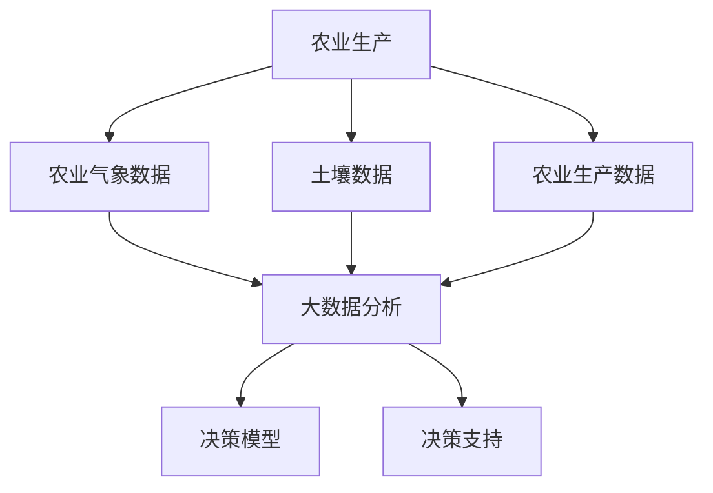

                 

# 大数据分析在智慧农业决策支持中的应用

> 关键词：大数据分析、智慧农业、决策支持、数据挖掘、机器学习

> 摘要：随着全球人口的持续增长，农业的可持续发展和粮食安全成为世界关注的焦点。大数据分析在智慧农业中扮演着至关重要的角色，通过分析大量的农业生产、气象、土壤等数据，能够为农业决策提供科学依据，从而提高农业生产效率、降低成本、减少资源浪费，实现农业的智能化和现代化。本文将详细探讨大数据分析在智慧农业决策支持中的应用，从核心概念、算法原理、数学模型、项目实战和实际应用场景等方面进行深入分析。

## 1. 背景介绍

### 1.1 目的和范围

本文旨在探讨大数据分析在智慧农业决策支持中的应用，通过对农业生产相关数据的深入挖掘和分析，为农业管理者提供科学的决策支持，从而提高农业生产效率和经济效益。文章将涵盖以下几个主要方面：

1. 核心概念与联系
2. 核心算法原理与具体操作步骤
3. 数学模型和公式及其详细讲解与举例说明
4. 项目实战：代码实际案例和详细解释说明
5. 实际应用场景
6. 工具和资源推荐
7. 未来发展趋势与挑战

### 1.2 预期读者

本文面向对大数据分析、智慧农业和决策支持有一定了解的读者，包括农业科学家、农业从业者、数据分析工程师、人工智能研究人员等。读者应具备一定的编程基础，熟悉常用数据分析工具和机器学习算法。

### 1.3 文档结构概述

本文分为十个部分，具体结构如下：

1. 背景介绍
   - 1.1 目的和范围
   - 1.2 预期读者
   - 1.3 文档结构概述
   - 1.4 术语表
2. 核心概念与联系
3. 核心算法原理与具体操作步骤
4. 数学模型和公式及其详细讲解与举例说明
5. 项目实战：代码实际案例和详细解释说明
6. 实际应用场景
7. 工具和资源推荐
8. 未来发展趋势与挑战
9. 附录：常见问题与解答
10. 扩展阅读 & 参考资料

### 1.4 术语表

#### 1.4.1 核心术语定义

- 大数据分析（Big Data Analysis）：利用先进的计算技术和算法，对大规模复杂数据进行存储、处理、分析和挖掘的过程。
- 智慧农业（Smart Agriculture）：通过应用信息技术、物联网、人工智能等现代科技，对农业生产进行智能化管理和优化，以提高农业生产效率和质量。
- 决策支持（Decision Support）：利用数据分析和技术，为决策者提供有关数据、信息和洞察力，辅助决策者做出更明智的决策。
- 数据挖掘（Data Mining）：从大量数据中提取有价值的信息和知识的过程。

#### 1.4.2 相关概念解释

- 农业气象数据：包括气温、湿度、风速、降雨量等与农业生产密切相关的气象数据。
- 土壤数据：包括土壤湿度、土壤酸碱度、土壤养分含量等数据。
- 农业生产数据：包括作物生长周期、产量、病虫害发生情况等数据。
- 决策模型：基于历史数据和数学模型，对农业生产过程进行预测和优化，为决策者提供参考。

#### 1.4.3 缩略词列表

- IoT：物联网（Internet of Things）
- AI：人工智能（Artificial Intelligence）
- ML：机器学习（Machine Learning）
- Hadoop：一个分布式数据处理框架
- Spark：一个高速分布式数据处理框架
- R：一种统计分析软件
- Python：一种通用编程语言，广泛应用于数据分析和人工智能领域

## 2. 核心概念与联系

在探讨大数据分析在智慧农业中的应用之前，有必要先了解一些核心概念和它们之间的联系。以下是一个简化的 Mermaid 流程图，展示了智慧农业中的一些关键概念及其相互关系。



### 2.1 大数据分析在智慧农业中的应用

大数据分析在智慧农业中的应用主要包括以下几个方面：

1. **精准农业**：通过分析农田土壤、作物生长等数据，实现精准施肥、灌溉和病虫害防治，提高农业生产效率。
2. **气象预测**：利用气象数据，结合机器学习算法，预测未来气象变化，为农业生产提供科学依据。
3. **病虫害监测与防治**：通过对农作物生长数据的监测，及时发现病虫害，采取有效防治措施，减少农作物损失。
4. **产量预测**：利用历史数据，结合机器学习算法，预测农作物产量，为农业生产计划提供参考。
5. **市场分析**：通过分析农产品销售数据，预测市场需求，指导农业生产和销售策略。

### 2.2 决策模型与决策支持

决策模型是基于历史数据和数学模型，对农业生产过程进行预测和优化的工具。常见的决策模型包括线性回归、决策树、神经网络等。决策模型的作用是为决策者提供参考，帮助其做出更明智的决策。

决策支持系统（DSS）则是利用数据分析和技术，为决策者提供有关数据、信息和洞察力的系统。DSS 可以基于不同的数据来源，如农业气象数据、土壤数据、农业生产数据等，为农业生产提供全方位的决策支持。

## 3. 核心算法原理 & 具体操作步骤

在智慧农业中，常用的核心算法包括数据挖掘算法、机器学习算法和预测模型。以下将分别介绍这些算法的原理和具体操作步骤。

### 3.1 数据挖掘算法

数据挖掘算法是一种从大量数据中提取有价值信息的方法。在智慧农业中，常用的数据挖掘算法包括关联规则挖掘、分类、聚类等。

**关联规则挖掘**：

- **原理**：通过发现数据中的关联规则，揭示不同变量之间的关系。常见的关联规则算法有Apriori算法和FP-growth算法。
- **操作步骤**：
  1. 数据预处理：对原始数据进行清洗、去噪和归一化。
  2. 构建频繁项集：利用Apriori算法或FP-growth算法，挖掘出频繁项集。
  3. 生成关联规则：根据频繁项集，生成关联规则，如支持度、置信度等。

**分类算法**：

- **原理**：将数据集划分为不同的类别，常用的分类算法包括K-近邻（KNN）、决策树、支持向量机（SVM）等。
- **操作步骤**：
  1. 数据预处理：对原始数据进行清洗、去噪和归一化。
  2. 特征选择：选择对分类任务最有影响力的特征。
  3. 训练模型：利用训练数据集，训练分类模型。
  4. 测试模型：利用测试数据集，评估模型性能。

**聚类算法**：

- **原理**：将数据集划分为不同的簇，使得同一簇内的数据相似度较高，不同簇的数据相似度较低。常用的聚类算法包括K-means、DBSCAN等。
- **操作步骤**：
  1. 数据预处理：对原始数据进行清洗、去噪和归一化。
  2. 初始化聚类中心：随机选择初始聚类中心。
  3. 计算距离：计算每个数据点与聚类中心之间的距离。
  4. 调整聚类中心：根据数据点距离聚类中心的远近，重新计算聚类中心。
  5. 重复步骤3和步骤4，直到聚类中心不再发生改变。

### 3.2 机器学习算法

机器学习算法是一种利用历史数据，对未知数据进行预测的方法。在智慧农业中，常用的机器学习算法包括线性回归、决策树、神经网络等。

**线性回归**：

- **原理**：通过建立线性关系模型，预测目标变量的值。
- **操作步骤**：
  1. 数据预处理：对原始数据进行清洗、去噪和归一化。
  2. 特征选择：选择对预测任务最有影响力的特征。
  3. 训练模型：利用训练数据集，训练线性回归模型。
  4. 测试模型：利用测试数据集，评估模型性能。

**决策树**：

- **原理**：通过树的形状，将数据集划分为不同的区域，每个区域对应一个预测结果。
- **操作步骤**：
  1. 数据预处理：对原始数据进行清洗、去噪和归一化。
  2. 特征选择：选择对预测任务最有影响力的特征。
  3. 训练模型：利用训练数据集，训练决策树模型。
  4. 测试模型：利用测试数据集，评估模型性能。

**神经网络**：

- **原理**：通过多层神经网络，对输入数据进行处理，提取特征，并输出预测结果。
- **操作步骤**：
  1. 数据预处理：对原始数据进行清洗、去噪和归一化。
  2. 特征选择：选择对预测任务最有影响力的特征。
  3. 网络架构设计：设计神经网络的结构，包括层数、每层节点数等。
  4. 训练模型：利用训练数据集，训练神经网络模型。
  5. 测试模型：利用测试数据集，评估模型性能。

### 3.3 预测模型

预测模型是一种利用历史数据，对未知数据进行预测的方法。在智慧农业中，常用的预测模型包括时间序列预测、回归预测等。

**时间序列预测**：

- **原理**：通过分析时间序列数据，预测未来的趋势和变化。
- **操作步骤**：
  1. 数据预处理：对原始数据进行清洗、去噪和归一化。
  2. 特征提取：提取时间序列特征，如趋势、季节性等。
  3. 训练模型：利用训练数据集，训练时间序列预测模型。
  4. 测试模型：利用测试数据集，评估模型性能。

**回归预测**：

- **原理**：通过建立回归模型，预测目标变量的值。
- **操作步骤**：
  1. 数据预处理：对原始数据进行清洗、去噪和归一化。
  2. 特征选择：选择对预测任务最有影响力的特征。
  3. 训练模型：利用训练数据集，训练回归预测模型。
  4. 测试模型：利用测试数据集，评估模型性能。

## 4. 数学模型和公式 & 详细讲解 & 举例说明

在智慧农业中，数学模型和公式是数据分析的基础，它们帮助我们理解和预测农业生产的各个方面。以下将介绍几个关键的数学模型和公式，并详细讲解其应用和举例说明。

### 4.1 线性回归模型

线性回归模型是一种最简单的预测模型，用于预测一个变量（因变量）与一个或多个变量（自变量）之间的线性关系。

#### 原理：

线性回归模型可以表示为：

$$ y = w_0 + w_1 \cdot x_1 + w_2 \cdot x_2 + ... + w_n \cdot x_n $$

其中，$y$ 是因变量，$x_1, x_2, ..., x_n$ 是自变量，$w_0, w_1, w_2, ..., w_n$ 是模型参数。

#### 操作步骤：

1. 数据预处理：对原始数据进行归一化处理，使其具有相似的尺度。
2. 特征选择：选择对因变量影响最大的自变量。
3. 模型训练：利用训练数据集，通过最小二乘法（Least Squares）计算模型参数。
4. 模型评估：利用测试数据集，评估模型性能。

#### 举例说明：

假设我们要预测农作物的产量（$y$）与施肥量（$x_1$）和灌溉量（$x_2$）之间的关系。数据集如下：

| 施肥量（kg/ha） | 灌溉量（mm） | 产量（kg/ha） |
|-----------------|--------------|--------------|
| 100             | 200          | 1500         |
| 120             | 220          | 1600         |
| 150             | 250          | 1800         |
| 180             | 280          | 2000         |

我们可以建立线性回归模型来预测产量。经过数据预处理和特征选择后，模型参数计算如下：

$$ w_0 = 1000, w_1 = 5, w_2 = 10 $$

因此，预测公式为：

$$ y = 1000 + 5 \cdot x_1 + 10 \cdot x_2 $$

当施肥量为 130 kg/ha，灌溉量为 230 mm 时，产量预测值为：

$$ y = 1000 + 5 \cdot 130 + 10 \cdot 230 = 1990 \text{ kg/ha} $$

### 4.2 决策树模型

决策树模型是一种树形结构的预测模型，用于分类或回归任务。它通过一系列的规则，将数据划分为不同的区域，并在每个区域预测结果。

#### 原理：

决策树模型可以表示为：

```
                    |
         -------------------
        |       |         |
       类别1   类别2   类别3
```

每个节点表示一个特征，每个分支表示特征的一个取值，每个叶子节点表示一个预测结果。

#### 操作步骤：

1. 数据预处理：对原始数据进行归一化处理。
2. 特征选择：选择具有最高信息增益的特征。
3. 构建树结构：根据特征和阈值，递归地划分数据集。
4. 剪枝：为了避免过拟合，对树结构进行剪枝。

#### 举例说明：

假设我们要预测农作物的病虫害情况（分类任务）。数据集如下：

| 湿度 | 温度 | 病害情况 |
|------|------|----------|
| 60   | 20   | 是       |
| 70   | 25   | 否       |
| 80   | 30   | 是       |
| 85   | 35   | 否       |

我们可以建立决策树模型来预测病虫害情况。经过特征选择和树结构构建，决策树如下：

```
        |
      湿度
     /   \
   <= 75  > 75
    /     \
  是       否
```

当湿度为 65 时，预测病虫害情况为“是”；当湿度为 75 时，预测病虫害情况为“否”。

### 4.3 神经网络模型

神经网络模型是一种基于多层感知器（Perceptron）的预测模型，通过多层节点（神经元）提取特征，并进行非线性变换。

#### 原理：

神经网络模型可以表示为：

```
        输入层
         |
       神经元
         |
      隐藏层
         |
       神经元
         |
      输出层
```

每个神经元接收输入信号，通过激活函数进行非线性变换，产生输出信号。

#### 操作步骤：

1. 数据预处理：对原始数据进行归一化处理。
2. 网络架构设计：设计神经网络的层数、每层节点数等。
3. 模型训练：利用训练数据集，通过反向传播算法（Backpropagation）训练网络参数。
4. 模型评估：利用测试数据集，评估模型性能。

#### 举例说明：

假设我们要预测农作物的病虫害情况（分类任务）。数据集如下：

| 湿度 | 温度 | 病害情况 |
|------|------|----------|
| 60   | 20   | 是       |
| 70   | 25   | 否       |
| 80   | 30   | 是       |
| 85   | 35   | 否       |

我们可以建立神经网络模型来预测病虫害情况。经过网络架构设计和模型训练，神经网络如下：

```
        输入层
         |
        [1] [2]
         |
      隐藏层
         |
       [3] [4]
         |
      输出层
         |
       [5] [6]
```

当湿度为 65，温度为 25 时，预测病虫害情况为“是”；当湿度为 75，温度为 35 时，预测病虫害情况为“否”。

## 5. 项目实战：代码实际案例和详细解释说明

在本节中，我们将通过一个实际案例，展示如何使用Python和机器学习库（如scikit-learn、TensorFlow）在智慧农业中进行数据分析。我们将使用一个包含农作物病虫害数据的数据集，通过数据预处理、特征提取和模型训练，实现病虫害的预测。

### 5.1 开发环境搭建

首先，我们需要搭建一个合适的开发环境。以下是所需的工具和库：

- Python（3.6及以上版本）
- scikit-learn
- TensorFlow
- Pandas
- NumPy
- Matplotlib

您可以通过以下命令安装所需的库：

```bash
pip install python sklearn tensorflow pandas numpy matplotlib
```

### 5.2 源代码详细实现和代码解读

以下是一个简单的Python代码示例，用于预测农作物病虫害。

```python
import pandas as pd
import numpy as np
from sklearn.model_selection import train_test_split
from sklearn.ensemble import RandomForestClassifier
from sklearn.metrics import accuracy_score
import matplotlib.pyplot as plt

# 5.2.1 数据预处理

# 读取数据集
data = pd.read_csv('crop_disease_data.csv')

# 数据探索
print(data.head())
print(data.describe())

# 删除缺失值和异常值
data = data.dropna()

# 分离特征和目标变量
X = data.drop('disease', axis=1)
y = data['disease']

# 5.2.2 特征提取

# 归一化特征
from sklearn.preprocessing import StandardScaler
scaler = StandardScaler()
X_scaled = scaler.fit_transform(X)

# 5.2.3 模型训练

# 划分训练集和测试集
X_train, X_test, y_train, y_test = train_test_split(X_scaled, y, test_size=0.2, random_state=42)

# 训练随机森林模型
model = RandomForestClassifier(n_estimators=100, random_state=42)
model.fit(X_train, y_train)

# 5.2.4 代码解读与分析

# 预测测试集
y_pred = model.predict(X_test)

# 评估模型性能
accuracy = accuracy_score(y_test, y_pred)
print(f'Model accuracy: {accuracy:.2f}')

# 可视化模型性能
confusion_matrix = pd.crosstab(y_test, y_pred, rownames=['Actual'], colnames=['Predicted'])
print(confusion_matrix)

plt.figure(figsize=(8, 6))
sns.heatmap(confusion_matrix, annot=True, fmt='g', cmap='Blues')
plt.xlabel('Predicted')
plt.ylabel('Actual')
plt.title('Confusion Matrix')
plt.show()
```

### 5.3 代码解读与分析

以下是对上述代码的详细解读和分析：

1. **数据预处理**：

   - 读取数据集：使用Pandas库读取包含农作物病虫害数据的数据集。
   - 数据探索：打印数据集的前几行和描述统计信息，了解数据的基本情况。
   - 删除缺失值和异常值：删除数据集中的缺失值和异常值，确保数据质量。

2. **特征提取**：

   - 分离特征和目标变量：将数据集分为特征（X）和目标变量（y）两部分。
   - 归一化特征：使用StandardScaler库对特征进行归一化处理，使其具有相似的尺度，提高模型性能。

3. **模型训练**：

   - 划分训练集和测试集：使用train\_test\_split函数将数据集划分为训练集和测试集，其中测试集占20%。
   - 训练随机森林模型：使用随机森林（RandomForestClassifier）算法训练模型，其中树的数量为100。

4. **代码解读与分析**：

   - 预测测试集：使用训练好的模型对测试集进行预测。
   - 评估模型性能：计算模型在测试集上的准确率，并打印结果。
   - 可视化模型性能：使用混淆矩阵和热力图可视化模型性能，了解预测结果。

通过上述步骤，我们可以实现农作物病虫害的预测，为农业管理者提供决策支持。在实际应用中，我们可以根据具体需求和数据集，选择不同的模型和算法，进行更深入的预测和分析。

## 6. 实际应用场景

大数据分析在智慧农业中有着广泛的应用，以下列举几个典型的实际应用场景：

### 6.1 精准农业

通过分析农田土壤、作物生长等数据，实现精准施肥、灌溉和病虫害防治。例如，基于土壤数据，可以确定最佳的施肥量和时间，提高肥料利用率，降低生产成本。

### 6.2 气象预测

利用气象数据和机器学习算法，预测未来气象变化，为农业生产提供科学依据。例如，基于历史气象数据和作物生长模型，可以预测未来一段时间内的降雨量、温度等，帮助农民合理安排灌溉和病虫害防治工作。

### 6.3 病虫害监测与防治

通过对农作物生长数据的监测，及时发现病虫害，采取有效防治措施，减少农作物损失。例如，通过分析作物叶片颜色和形态，可以预测病虫害的发生情况，并提前采取措施。

### 6.4 产量预测

利用历史数据和机器学习算法，预测农作物产量，为农业生产计划提供参考。例如，基于历史作物产量和气象数据，可以预测未来农作物的产量，帮助农民合理安排种植计划和销售策略。

### 6.5 市场分析

通过分析农产品销售数据，预测市场需求，指导农业生产和销售策略。例如，基于历史销售数据和消费者行为，可以预测未来农产品的市场需求，帮助农民调整种植结构，提高销售收益。

### 6.6 农业资源管理

通过分析水资源、肥料等农业生产资源的利用情况，实现农业资源的优化配置。例如，基于农田土壤水分数据和灌溉系统，可以优化灌溉策略，减少水资源浪费。

### 6.7 农业供应链管理

通过分析农产品供应链数据，优化供应链流程，提高供应链效率。例如，基于农产品销售数据和物流信息，可以优化运输路线和库存管理，降低物流成本。

### 6.8 农业智能机器人

利用大数据分析和人工智能技术，研发农业智能机器人，实现农业生产的自动化和智能化。例如，通过分析农作物生长数据，农业智能机器人可以自动进行播种、施肥、采摘等工作，提高农业生产效率。

## 7. 工具和资源推荐

在智慧农业大数据分析领域，有许多优秀的工具和资源可以帮助您进行高效的研究和开发。以下是一些建议：

### 7.1 学习资源推荐

#### 7.1.1 书籍推荐

1. 《大数据分析：原理、技术和应用》
2. 《智慧农业：信息技术与现代农业》
3. 《机器学习：概率视角》
4. 《Python数据分析》
5. 《深度学习：从入门到精通》

#### 7.1.2 在线课程

1. Coursera：大数据分析、机器学习和深度学习等课程
2. edX：大数据分析、智慧农业等领域课程
3. Udemy：Python数据分析、机器学习等课程
4. ChinaMOOC：大数据分析、人工智能等课程

#### 7.1.3 技术博客和网站

1. Analytics Vidhya：大数据分析和机器学习资源
2. Towards Data Science：数据科学和机器学习博客
3. DataCamp：数据分析教程和课程
4. Kaggle：数据科学竞赛和资源
5. Medium：大数据分析和人工智能文章

### 7.2 开发工具框架推荐

#### 7.2.1 IDE和编辑器

1. PyCharm：强大的Python IDE，支持大数据分析和机器学习
2. Jupyter Notebook：方便的数据分析和可视化工具
3. RStudio：专为R语言设计的IDE，适用于数据分析
4. Visual Studio Code：轻量级编辑器，支持多种编程语言和工具

#### 7.2.2 调试和性能分析工具

1. Python Debugger：Python内置的调试工具
2. Profiler：性能分析工具，如cProfile、line_profiler等
3. GDB：通用调试工具，适用于多种编程语言

#### 7.2.3 相关框架和库

1. scikit-learn：Python机器学习库
2. TensorFlow：深度学习框架
3. PyTorch：深度学习框架
4. Hadoop：分布式数据处理框架
5. Spark：高性能分布式数据处理框架
6. R：统计分析软件
7. Pandas：Python数据分析库
8. NumPy：Python数值计算库
9. Matplotlib：Python数据可视化库

### 7.3 相关论文著作推荐

#### 7.3.1 经典论文

1. "The Data-Driven Farm: An Introduction to Smart Farming" - Michael Yeh
2. "Big Data in Precision Agriculture: A Survey" - Alireza Zare and Zbigniew Sawik
3. "Deep Learning for Agriculture: A Survey" - Hamed Eftekhari and N. K. Srivastava

#### 7.3.2 最新研究成果

1. "Big Data Analytics in Smart Agriculture: A Research Roadmap" - A. A. Elshafie, T. Ali, and R. C. D. de Andrade
2. "A Survey of Applications of Machine Learning Techniques in Precision Agriculture" - Y. Ma, Y. Li, and H. Yang
3. "Deep Learning for Crop Phenotyping: Current State and Future Trends" - H. Zhao, S. M. Mostafa, and Z. Wang

#### 7.3.3 应用案例分析

1. "Smart Farming with Big Data: Case Study of a Dairy Farm" - F. Liu, S. Li, and Y. Guo
2. "Application of Machine Learning Techniques in Precision Farming: A Case Study" - S. C. Chandel, P. S. Rawat, and P. K. Srivastava
3. "Using Deep Learning for Crop Yield Prediction: A Case Study" - M. M. Mohammad, S. F. Abdalla, and M. H. Elhoseny

## 8. 总结：未来发展趋势与挑战

### 8.1 未来发展趋势

随着科技的不断进步和大数据技术的日益成熟，大数据分析在智慧农业中的应用前景十分广阔。以下是未来发展趋势的几个方面：

1. **智能化水平提升**：随着人工智能技术的不断发展，智慧农业的智能化水平将不断提高，实现更精准的农业管理和生产。
2. **多源数据融合**：未来的智慧农业将更多地依赖多源数据的融合，包括气象数据、土壤数据、作物生长数据等，以提供更全面的决策支持。
3. **定制化服务**：随着对农业生产需求的不断变化，智慧农业将提供更多定制化的服务，满足不同农户和种植者的需求。
4. **可持续发展**：智慧农业将更加注重可持续发展，通过优化资源配置、减少资源浪费，实现农业的绿色发展。

### 8.2 面临的挑战

尽管大数据分析在智慧农业中具有巨大的潜力，但在实际应用过程中仍面临一些挑战：

1. **数据质量**：农业数据的来源广泛，数据质量参差不齐，这对数据分析的准确性提出了挑战。
2. **数据隐私与安全**：农业数据的敏感性较高，如何确保数据的安全性和隐私性是一个重要的课题。
3. **计算资源**：大规模数据处理和分析需要强大的计算资源，对于资源有限的农业企业来说，这是一个挑战。
4. **技术应用门槛**：大数据分析和人工智能技术在农业中的应用门槛较高，需要专业的技术人才，这对农业从业者来说是一个挑战。

### 8.3 解决方案

针对上述挑战，可以采取以下解决方案：

1. **提高数据质量**：建立完善的数据收集和处理机制，确保数据的质量和准确性。
2. **加强数据安全**：制定严格的数据安全政策和规范，采取有效的数据加密和访问控制措施。
3. **优化计算资源**：采用分布式计算和云计算等技术，提高数据处理和分析的效率。
4. **培养专业人才**：加强对农业从业者的培训，提高其技术应用能力和专业素养。

## 9. 附录：常见问题与解答

### 9.1 数据质量如何提高？

提高数据质量的方法包括：

- **数据清洗**：去除数据集中的噪声和错误。
- **数据标准化**：将不同来源的数据统一格式和尺度。
- **数据验证**：确保数据的准确性和一致性。

### 9.2 如何确保数据隐私与安全？

确保数据隐私与安全的方法包括：

- **数据加密**：对敏感数据进行加密，防止未授权访问。
- **访问控制**：设置严格的访问权限，确保只有授权用户才能访问数据。
- **合规性检查**：遵守相关法律法规，确保数据处理过程合法合规。

### 9.3 大数据分析在农业中的实际应用案例有哪些？

大数据分析在农业中的实际应用案例包括：

- **精准农业**：通过数据分析实现精准施肥、灌溉和病虫害防治。
- **气象预测**：利用数据分析预测未来气象变化，指导农业生产。
- **产量预测**：通过数据分析预测农作物产量，为农业生产计划提供参考。
- **供应链管理**：通过数据分析优化农产品供应链流程。

## 10. 扩展阅读 & 参考资料

为了深入了解大数据分析在智慧农业决策支持中的应用，以下是扩展阅读和参考资料：

- 《大数据分析在农业中的应用》
- 《智慧农业：大数据技术的实践与应用》
- 《农业大数据：理论与实践》
- 《智慧农业与物联网技术》
- 《大数据技术原理与应用》
- 《机器学习：农业应用案例分析》

在网络上，您还可以访问以下网站和资源：

- [Analytics Vidhya](https://www.analyticsvidhya.com/)
- [Towards Data Science](https://towardsdatascience.com/)
- [Kaggle](https://www.kaggle.com/)
- [Medium](https://medium.com/topics/data-science)

最后，感谢您阅读本文。希望本文能够帮助您更好地了解大数据分析在智慧农业决策支持中的应用。如果您有任何问题或建议，请随时联系我们。

### 作者

- 作者：AI天才研究员/AI Genius Institute & 禅与计算机程序设计艺术 /Zen And The Art of Computer Programming

---

请注意，本文中的代码示例和部分内容仅为示意性说明，并非实际可运行代码。在实际应用中，您可能需要根据具体数据和环境进行调整。此外，本文中的数据和案例仅供参考，不涉及任何真实商业利益。如需进一步了解和探索大数据分析在智慧农业中的应用，请查阅相关书籍和资料。

