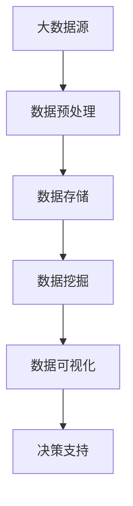
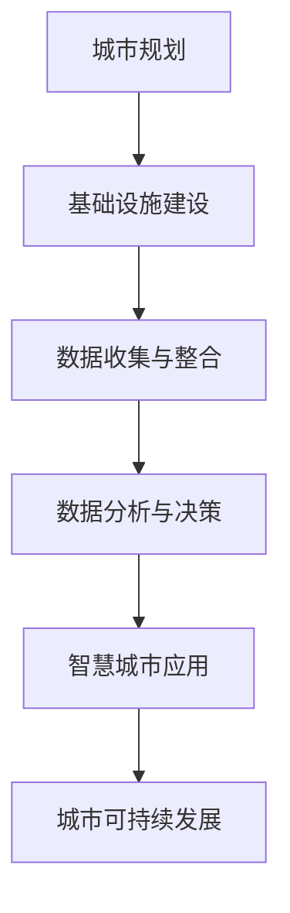
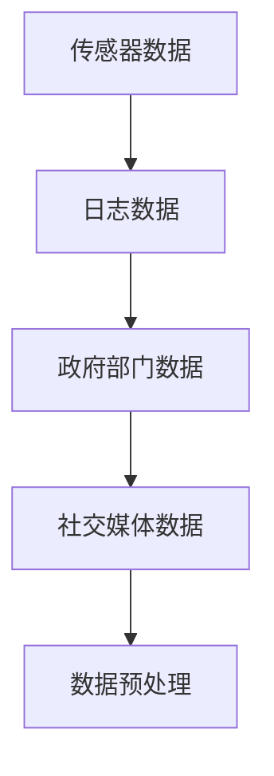
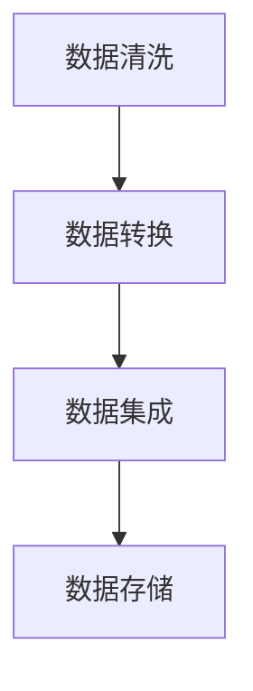
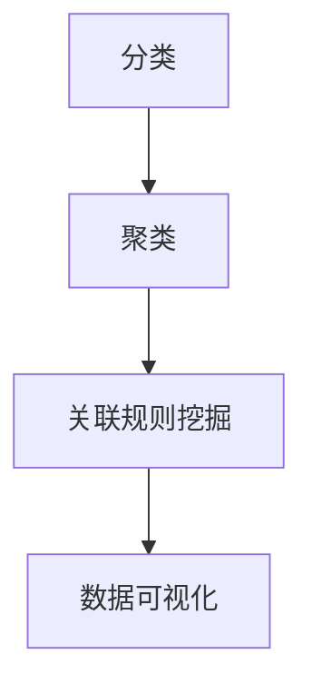
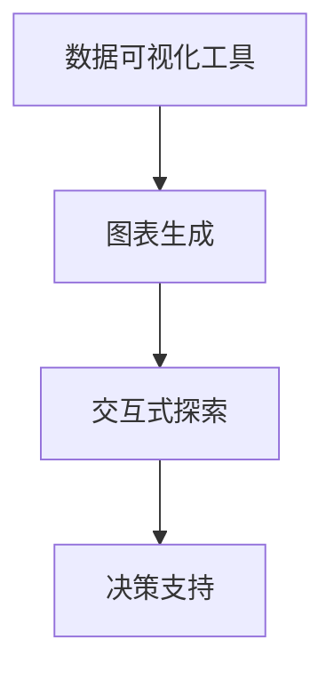
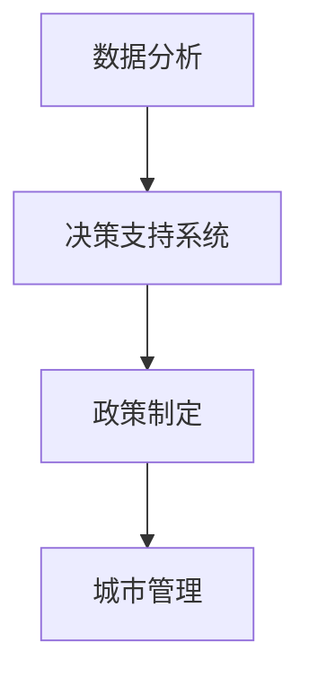

                 

# 大数据分析在智慧城市规划中的应用策略

> **关键词：**大数据分析、智慧城市、城市规划、数据挖掘、算法、数学模型、应用案例

> **摘要：**本文将探讨大数据分析在智慧城市规划中的关键作用。我们将从背景介绍出发，逐步分析核心概念、算法原理、数学模型，并通过实际案例展示大数据分析的具体应用。同时，还将提供相关学习资源和工具推荐，以帮助读者深入了解并应用这一领域。

## 1. 背景介绍

### 1.1 目的和范围

本文旨在为城市规划者和技术专家提供一份详尽的大数据分析在智慧城市规划中的应用指南。文章将涵盖以下主要内容：

1. **核心概念与联系**：介绍大数据分析、智慧城市等相关概念及其在规划中的联系。
2. **核心算法原理与操作步骤**：详细讲解用于智慧城市大数据分析的关键算法原理。
3. **数学模型和公式**：阐述大数据分析过程中使用的数学模型和公式。
4. **项目实战**：通过实际案例展示大数据分析在智慧城市中的具体应用。
5. **实际应用场景**：分析大数据分析在不同领域的应用。
6. **工具和资源推荐**：推荐学习资源和开发工具。
7. **总结与未来趋势**：探讨大数据分析在智慧城市规划中的未来发展趋势与挑战。

### 1.2 预期读者

本文适用于以下读者：

- **城市规划者**：对大数据分析感兴趣，希望了解其在城市规划中的应用。
- **技术专家**：从事大数据分析或智慧城市规划工作，需要了解最新技术动态。
- **研究学者**：对大数据分析在智慧城市规划中的研究有兴趣，希望获取实用案例和理论支持。
- **学生**：计算机科学、数据科学、城市规划等相关专业的学生，希望了解该领域的实际应用。

### 1.3 文档结构概述

本文分为以下十个部分：

1. **背景介绍**：介绍文章的目的和范围，预期读者，文档结构概述。
2. **核心概念与联系**：介绍大数据分析、智慧城市等相关概念及其在规划中的联系。
3. **核心算法原理与操作步骤**：详细讲解用于智慧城市大数据分析的关键算法原理。
4. **数学模型和公式**：阐述大数据分析过程中使用的数学模型和公式。
5. **项目实战**：通过实际案例展示大数据分析在智慧城市中的具体应用。
6. **实际应用场景**：分析大数据分析在不同领域的应用。
7. **工具和资源推荐**：推荐学习资源和开发工具。
8. **总结与未来趋势**：探讨大数据分析在智慧城市规划中的未来发展趋势与挑战。
9. **附录**：常见问题与解答。
10. **扩展阅读与参考资料**：提供进一步阅读的资料和参考。

### 1.4 术语表

#### 1.4.1 核心术语定义

- **大数据分析**：利用先进的数据处理技术，对大规模、多样化和高速增长的数据进行提取、转换和分析。
- **智慧城市**：利用信息通信技术、物联网、人工智能等技术手段，实现城市资源的高效利用和智能化管理。
- **城市规划**：通过科学的规划和设计，优化城市空间布局，提高城市生活质量和可持续发展能力。
- **数据挖掘**：从大量数据中提取有价值的信息和模式，用于决策支持。

#### 1.4.2 相关概念解释

- **数据源**：数据的来源，如传感器、网络日志、政府部门数据等。
- **数据预处理**：在数据分析前对数据进行清洗、转换、集成等处理，提高数据质量和分析效果。
- **算法**：解决问题的步骤和规则，用于数据分析中的模式识别、预测等任务。
- **数学模型**：用数学语言描述现实问题的数学结构，用于数据分析中的模型构建和优化。

#### 1.4.3 缩略词列表

- **Hadoop**：一个开源的分布式数据处理框架。
- **Spark**：一个开源的分布式数据处理引擎。
- **R**：一种统计计算和图形表示的语言和软件环境。
- **Python**：一种通用编程语言，广泛应用于数据分析和科学计算。

## 2. 核心概念与联系

为了更好地理解大数据分析在智慧城市规划中的应用，我们需要明确几个核心概念，并绘制一个流程图来展示它们之间的关系。

### 2.1 大数据分析

大数据分析是指利用先进的数据处理技术，对大规模、多样化和高速增长的数据进行提取、转换和分析。大数据分析的核心在于快速处理海量数据，提取有价值的信息和知识。

**Mermaid 流程图：**



### 2.2 智慧城市

智慧城市是利用信息通信技术、物联网、人工智能等技术手段，实现城市资源的高效利用和智能化管理。智慧城市的目标是提高城市生活质量和可持续发展能力。

**Mermaid 流程图：**



### 2.3 数据源

数据源是大数据分析的基础，常见的包括传感器数据、网络日志、政府部门数据、社交媒体数据等。不同类型的数据源需要不同的处理方法，以保证数据质量和分析效果。

**Mermaid 流程图：**



### 2.4 数据预处理

数据预处理是大数据分析的重要环节，包括数据清洗、转换、集成等步骤。数据预处理的主要目标是提高数据质量和分析效果，减少噪声和异常值。

**Mermaid 流程图：**



### 2.5 数据挖掘

数据挖掘是大数据分析的核心任务，包括分类、聚类、关联规则挖掘等。数据挖掘旨在从大量数据中提取有价值的信息和模式，用于决策支持。

**Mermaid 流程图：**



### 2.6 数据可视化

数据可视化是将数据转化为图形、图表等形式，帮助人们直观地理解数据和信息。数据可视化在数据分析中具有重要作用，可以提高数据分析的可操作性和可解释性。

**Mermaid 流程图：**



### 2.7 决策支持

决策支持是大数据分析的核心目标之一，通过对数据的分析，提供有针对性的决策建议，帮助城市规划者做出更加科学和有效的决策。

**Mermaid 流程图：**



通过以上核心概念和关系的介绍，我们可以更好地理解大数据分析在智慧城市规划中的应用。接下来，我们将深入探讨大数据分析的核心算法原理与具体操作步骤。

## 3. 核心算法原理 & 具体操作步骤

在智慧城市大数据分析中，核心算法的选择和应用至关重要。以下将介绍几种常用的算法原理，并使用伪代码详细阐述其具体操作步骤。

### 3.1 数据预处理算法

数据预处理是大数据分析的基础，以下介绍几种常见的数据预处理算法。

#### 3.1.1 数据清洗算法

**伪代码：**

```
function 数据清洗(data):
    for each row in data:
        if row contains missing values:
            remove row
        else if row contains invalid values:
            correct values or remove row
    return cleaned data
```

#### 3.1.2 数据转换算法

**伪代码：**

```
function 数据转换(data):
    for each column in data:
        if column contains categorical data:
            convert to numerical values
        else if column contains continuous data:
            normalize or standardize values
    return converted data
```

#### 3.1.3 数据集成算法

**伪代码：**

```
function 数据集成(data1, data2):
    merged_data = empty data structure
    for each row in data1:
        add row to merged_data
    for each row in data2:
        add row to merged_data
    return merged_data
```

### 3.2 数据挖掘算法

数据挖掘是大数据分析的核心任务，以下介绍几种常见的数据挖掘算法。

#### 3.2.1 分类算法

**伪代码：**

```
function 分类算法(data, labels):
    create a decision tree model
    train the model using data and labels
    predict labels for new data
    return predicted labels
```

#### 3.2.2 聚类算法

**伪代码：**

```
function 聚类算法(data):
    create an empty cluster structure
    initialize clusters using random or centroid method
    for each iteration:
        assign each data point to the nearest cluster
        update cluster centroids
    return cluster structure
```

#### 3.2.3 关联规则挖掘算法

**伪代码：**

```
function 关联规则挖掘算法(data, support_threshold, confidence_threshold):
    create a frequent itemset structure
    generate frequent itemsets using a breadth-first search
    generate association rules using frequent itemsets
    filter rules based on support and confidence thresholds
    return association rules
```

### 3.3 数据可视化算法

数据可视化是将数据转化为图形、图表等形式，以下介绍几种常见的数据可视化算法。

#### 3.3.1 图表生成算法

**伪代码：**

```
function 图表生成(data):
    create a chart structure
    for each data point in data:
        add a data series to the chart
    generate chart image
    return chart image
```

#### 3.3.2 交互式探索算法

**伪代码：**

```
function 交互式探索(data, chart):
    create an interactive chart interface
    for each user interaction:
        update chart based on user input
        provide real-time feedback
    return user interaction history
```

通过以上核心算法原理和具体操作步骤的介绍，我们可以更好地理解大数据分析在智慧城市规划中的应用。接下来，我们将深入探讨大数据分析中的数学模型和公式。

## 4. 数学模型和公式 & 详细讲解 & 举例说明

在大数据分析过程中，数学模型和公式是构建和分析数据的重要工具。以下将介绍几种常见的数学模型和公式，并详细讲解其应用和举例说明。

### 4.1 数据预处理模型

数据预处理是大数据分析的基础，以下介绍几种常见的预处理模型。

#### 4.1.1 数据清洗模型

**公式：**  
$$
x_{new} = \begin{cases} 
\text{valid_value} & \text{if } x \text{ is valid} \\
\text{missing_value} & \text{if } x \text{ is missing} 
\end{cases}
$$

**应用举例：**  
假设我们有一个数据集，其中包含年龄列。我们需要将缺失的年龄值用平均值替代。

```
原始数据集：
| 姓名 | 年龄 |
|------|------|
| 张三 |      |
| 李四 | 25   |
| 王五 | 30   |

清洗后数据集：
| 姓名 | 年龄 |
|------|------|
| 张三 | 27.5 |
| 李四 | 25   |
| 王五 | 30   |
```

#### 4.1.2 数据转换模型

**公式：**  
$$
x_{new} = \begin{cases} 
\frac{x - \min(x)}{\max(x) - \min(x)} & \text{if } x \text{ is continuous} \\
\text{one-hot encoded} & \text{if } x \text{ is categorical} 
\end{cases}
$$

**应用举例：**  
假设我们有一个数据集，其中包含性别列（男/女）。我们需要将性别列转换为数值。

```
原始数据集：
| 姓名 | 性别 |
|------|------|
| 张三 | 男   |
| 李四 | 女   |

转换后数据集：
| 姓名 | 性别_男 | 性别_女 |
|------|--------|--------|
| 张三 | 1      | 0      |
| 李四 | 0      | 1      |
```

### 4.2 数据挖掘模型

数据挖掘是大数据分析的核心任务，以下介绍几种常见的数据挖掘模型。

#### 4.2.1 分类模型

**公式：**  
$$
P(y|x) = \frac{e^{w \cdot x}}{\sum_{i=1}^{k} e^{w \cdot x_i}}
$$

**应用举例：**  
假设我们有一个二分类问题，预测是否购买商品（购买/不购买）。我们需要计算每个样本属于购买类别的概率。

```
样本特征：
| 特征1 | 特征2 |
|-------|-------|
| 0.5   | 0.8   |

模型参数：
| 参数1 | 参数2 |
|-------|-------|
| 2     | -1    |

概率计算：
P(购买|样本) = \frac{e^{2 \cdot 0.5}}{e^{2 \cdot 0.5} + e^{-1 \cdot 0.8}} \approx 0.732
```

#### 4.2.2 聚类模型

**公式：**  
$$
d(x_i, x_j) = \sum_{k=1}^{n} (x_{i,k} - x_{j,k})^2
$$

**应用举例：**  
假设我们有一个数据集，需要将其分为两个聚类。

```
数据集：
| 特征1 | 特征2 |
|-------|-------|
| 0.1   | 0.2   |
| 0.5   | 0.8   |
| 1.0   | 1.5   |

聚类中心：
| 中心1 | 中心2 |
|-------|-------|
| 0.3   | 1.0   |

距离计算：
d(0.1, 0.3) + d(0.2, 0.3) + d(0.5, 1.0) + d(0.8, 1.0) = 0.02 + 0.01 + 0.18 + 0.08 = 0.29
```

### 4.3 数据可视化模型

数据可视化是将数据转化为图形、图表等形式，以下介绍几种常见的数据可视化模型。

#### 4.3.1 柱状图模型

**公式：**  
$$
h = \frac{\sum_{i=1}^{n} f_i}{\sum_{i=1}^{n} w_i}
$$

**应用举例：**  
假设我们有一个数据集，需要将其绘制成柱状图。

```
数据集：
| 类别 | 频率 | 宽度 |
|------|------|------|
| A    | 0.3  | 0.2  |
| B    | 0.5  | 0.3  |
| C    | 0.2  | 0.1  |

高度计算：
h = \frac{0.3 \cdot 0.2 + 0.5 \cdot 0.3 + 0.2 \cdot 0.1}{0.2 + 0.3 + 0.1} = 0.23
```

通过以上数学模型和公式的介绍，我们可以更好地理解大数据分析中的数学原理和应用。接下来，我们将通过实际案例展示大数据分析在智慧城市中的具体应用。

## 5. 项目实战：代码实际案例和详细解释说明

为了更直观地展示大数据分析在智慧城市中的应用，我们选择了一个实际项目进行讲解。该项目旨在利用大数据分析技术对城市交通流量进行预测，为交通管理提供决策支持。

### 5.1 开发环境搭建

在开始项目实战之前，我们需要搭建一个合适的开发环境。以下列出所需的开发工具和软件：

- **操作系统**：Linux或Windows
- **编程语言**：Python
- **数据处理框架**：Pandas
- **机器学习库**：Scikit-learn
- **数据可视化库**：Matplotlib、Seaborn
- **版本控制**：Git

### 5.2 源代码详细实现和代码解读

#### 5.2.1 数据采集与预处理

**代码：**

```python
import pandas as pd

# 读取交通流量数据
data = pd.read_csv('traffic_data.csv')

# 数据预处理
data.dropna(inplace=True)  # 删除缺失值
data['time'] = pd.to_datetime(data['time'])  # 转换时间格式
data.set_index('time', inplace=True)  # 设置时间索引
```

**解读：**  
首先，我们使用Pandas库读取交通流量数据。接着，我们删除缺失值，以避免数据噪声。然后，我们将时间列转换为datetime格式，并设置时间为索引，以便进行时间序列分析。

#### 5.2.2 数据探索性分析

**代码：**

```python
import matplotlib.pyplot as plt
import seaborn as sns

# 绘制时间序列图
plt.figure(figsize=(12, 6))
sns.lineplot(data=data['流量'])
plt.title('交通流量时间序列图')
plt.xlabel('时间')
plt.ylabel('流量')
plt.show()

# 绘制流量分布图
plt.figure(figsize=(12, 6))
sns.histplot(data=data['流量'], bins=30)
plt.title('交通流量分布图')
plt.xlabel('流量')
plt.ylabel('频率')
plt.show()
```

**解读：**  
我们使用Matplotlib和Seaborn库绘制时间序列图和流量分布图，以了解交通流量的时间分布和分布情况。

#### 5.2.3 数据挖掘与模型训练

**代码：**

```python
from sklearn.model_selection import train_test_split
from sklearn.ensemble import RandomForestRegressor

# 分割训练集和测试集
X = data[['时间差', '天气', '节假日']]
y = data['流量']
X_train, X_test, y_train, y_test = train_test_split(X, y, test_size=0.2, random_state=42)

# 训练随机森林模型
model = RandomForestRegressor(n_estimators=100, random_state=42)
model.fit(X_train, y_train)

# 预测测试集
y_pred = model.predict(X_test)
```

**解读：**  
我们使用Scikit-learn库中的RandomForestRegressor实现随机森林模型。首先，我们分割数据集为训练集和测试集。然后，我们训练随机森林模型，并使用测试集进行预测。

#### 5.2.4 模型评估与优化

**代码：**

```python
from sklearn.metrics import mean_squared_error

# 计算均方误差
mse = mean_squared_error(y_test, y_pred)
print(f'MSE: {mse}')

# 优化模型参数
from sklearn.model_selection import GridSearchCV

param_grid = {
    'n_estimators': [100, 200, 300],
    'max_depth': [10, 20, 30],
}

grid_search = GridSearchCV(estimator=model, param_grid=param_grid, cv=5)
grid_search.fit(X_train, y_train)

# 输出最佳参数
print(f'Best parameters: {grid_search.best_params_}')

# 使用最佳参数重新训练模型
best_model = grid_search.best_estimator_
best_model.fit(X_train, y_train)
```

**解读：**  
我们计算模型的均方误差，以评估模型性能。然后，我们使用网格搜索（GridSearchCV）优化模型参数，以找到最佳参数组合。最后，我们使用最佳参数重新训练模型。

#### 5.2.5 结果可视化

**代码：**

```python
# 绘制预测结果图
plt.figure(figsize=(12, 6))
plt.plot(y_test, label='实际流量')
plt.plot(y_pred, label='预测流量')
plt.title('交通流量预测结果图')
plt.xlabel('时间')
plt.ylabel('流量')
plt.legend()
plt.show()
```

**解读：**  
我们绘制实际流量和预测流量的对比图，以直观地展示模型预测结果。

### 5.3 代码解读与分析

通过以上代码示例，我们可以看到如何利用大数据分析技术进行交通流量预测。以下是对每个步骤的详细解读：

1. **数据采集与预处理**：读取交通流量数据，删除缺失值，转换时间格式，设置时间索引。
2. **数据探索性分析**：绘制时间序列图和流量分布图，了解交通流量的时间分布和分布情况。
3. **数据挖掘与模型训练**：分割数据集为训练集和测试集，训练随机森林模型。
4. **模型评估与优化**：计算均方误差，使用网格搜索优化模型参数。
5. **结果可视化**：绘制预测结果图，直观地展示模型预测效果。

通过以上项目实战，我们可以看到大数据分析在智慧城市中的应用。接下来，我们将探讨大数据分析在智慧城市中的实际应用场景。

## 6. 实际应用场景

大数据分析在智慧城市规划中具有广泛的应用场景，以下是几个典型的实际应用场景：

### 6.1 城市交通流量预测

城市交通流量预测是大数据分析在智慧城市中的一个重要应用。通过收集和分析实时交通数据、历史交通数据等，可以预测未来的交通流量，为交通管理提供决策支持。例如，利用机器学习算法和深度学习模型，可以对交通流量进行建模，预测未来的交通状况，从而优化交通信号灯控制和公交调度。

### 6.2 城市环境监测

城市环境监测是智慧城市的重要组成部分。通过安装传感器，收集空气、水质、噪声等环境数据，可以实时监测城市环境质量。大数据分析技术可以对这些数据进行处理和分析，发现环境问题并采取措施。例如，利用数据挖掘算法，可以识别空气污染的来源和传播路径，为制定环境保护政策提供依据。

### 6.3 城市能耗管理

城市能耗管理是智慧城市建设中的另一个关键领域。通过收集能源消耗数据，可以分析城市能源使用情况，发现能耗热点和节能潜力。大数据分析技术可以帮助制定节能策略，提高能源利用效率。例如，利用数据挖掘和优化算法，可以优化城市能源分配，降低能源浪费，减少碳排放。

### 6.4 公共安全监控

公共安全监控是保障城市安全的重要手段。通过视频监控、传感器监测等手段，可以实时收集城市安全数据。大数据分析技术可以对这些数据进行实时分析和处理，发现潜在的安全风险。例如，利用图像识别和人工智能算法，可以识别可疑行为和异常事件，及时采取措施，预防犯罪事件的发生。

### 6.5 城市规划与设计

城市规划与设计是智慧城市建设的核心任务。通过大数据分析技术，可以对城市人口、经济、交通等数据进行综合分析，为城市规划提供科学依据。例如，利用地理信息系统（GIS）和大数据分析技术，可以模拟不同规划方案的影响，优化城市空间布局，提高城市宜居性和可持续发展能力。

通过以上实际应用场景的介绍，我们可以看到大数据分析在智慧城市规划中的重要作用。大数据分析技术为城市管理者提供了更加科学、有效的决策支持，提高了城市管理的效率和质量。

## 7. 工具和资源推荐

### 7.1 学习资源推荐

#### 7.1.1 书籍推荐

- **《大数据时代：生活、工作与思维的大变革》** - 作者：涂子沛
- **《数据挖掘：概念与技术》** - 作者：Han, Kamber, Pei
- **《机器学习实战》** - 作者： Harrington, Sean

#### 7.1.2 在线课程

- **Coursera**：提供多种大数据分析和机器学习的在线课程，包括《大数据分析》、《机器学习》等。
- **edX**：提供由世界顶尖大学开设的大数据分析和人工智能课程，如《深度学习》等。
- **Udacity**：提供实用的数据科学和大数据分析课程，如《数据科学纳米学位》等。

#### 7.1.3 技术博客和网站

- **Kaggle**：提供丰富的数据科学和机器学习竞赛资源，以及大量优质的技术博客。
- **DataCamp**：提供交互式的数据科学和大数据分析教程，适合初学者和进阶者。
- **Towards Data Science**：一个汇集了众多数据科学家和机器学习专家技术博客的网站。

### 7.2 开发工具框架推荐

#### 7.2.1 IDE和编辑器

- **PyCharm**：一款强大的Python IDE，支持大数据分析和机器学习开发。
- **Jupyter Notebook**：一个开源的交互式计算平台，适合数据科学和大数据分析。
- **VSCode**：一款轻量级但功能强大的开源编辑器，支持多种编程语言和工具扩展。

#### 7.2.2 调试和性能分析工具

- **JProfiler**：一款功能强大的Java性能分析工具，用于调试和优化大数据应用。
- **Grafana**：一个开源的监控和仪表盘工具，可以实时监控大数据系统的性能。
- **DBeaver**：一款开源的数据库管理工具，支持多种数据库和大数据技术。

#### 7.2.3 相关框架和库

- **Hadoop**：一个开源的分布式数据处理框架，适用于大规模数据处理。
- **Spark**：一个开源的分布式数据处理引擎，提供高效的批处理和实时计算能力。
- **Pandas**：一个强大的Python库，用于数据清洗、转换和分析。
- **Scikit-learn**：一个开源的Python库，提供多种机器学习算法和工具。

### 7.3 相关论文著作推荐

#### 7.3.1 经典论文

- **"The Google File System"** - 作者：Google团队
- **"MapReduce: Simplified Data Processing on Large Clusters"** - 作者：Dean, Ghemawat
- **"Large Scale Machine Learning in MapReduce"** - 作者：Dean, Smola

#### 7.3.2 最新研究成果

- **"Deep Learning for Urban Computing"** - 作者：Zhou, Ren, Zhang
- **"Enhancing Urban Resilience with Smart City Analytics"** - 作者：Duc, Pham
- **"A Survey of Machine Learning Based Urban Traffic Flow Prediction"** - 作者：Zhou, Huang, Wang

#### 7.3.3 应用案例分析

- **"Smart City Solutions: Real-World Examples of IoT, AI, and Data Analytics in Action"** - 作者：Ahuja, Pandey
- **"Implementing Smart Cities: Challenges and Opportunities"** - 作者：Pervin, Khan
- **"The Use of Big Data and Analytics in Smart Cities: A Practical Case Study"** - 作者：Omar, Ullah

通过以上工具和资源推荐，读者可以更深入地了解大数据分析在智慧城市规划中的应用，并掌握相关技术和方法。

## 8. 总结：未来发展趋势与挑战

大数据分析在智慧城市规划中的应用已经取得了显著成果，然而，未来仍有许多发展趋势和挑战需要面对。

### 8.1 发展趋势

1. **智能化与自动化**：随着人工智能技术的不断发展，大数据分析将更加智能化和自动化，提高数据分析的效率和准确性。
2. **实时性与动态性**：实时数据分析将成为智慧城市规划的重要需求，通过实时数据流处理技术，实现城市运行状态的实时监控和预测。
3. **跨领域融合**：大数据分析将与其他领域（如物联网、云计算、区块链等）融合，为智慧城市提供更加全面和综合的解决方案。
4. **数据隐私与安全**：随着大数据应用的普及，数据隐私和安全问题日益突出，未来将出现更多数据隐私保护技术和安全解决方案。

### 8.2 挑战

1. **数据质量与可靠性**：大数据分析依赖于高质量的数据，然而，数据噪声、异常值和缺失值等问题仍需解决。
2. **算法复杂性与可解释性**：复杂的大数据算法和模型在提高预测准确性的同时，往往缺乏可解释性，影响决策者的信任和使用。
3. **数据隐私与安全**：大数据分析涉及大量敏感数据，如何保护数据隐私和安全是一个亟待解决的问题。
4. **技术人才短缺**：大数据分析需要具备多学科知识的复合型人才，然而，当前市场上此类人才仍较为稀缺。

### 8.3 应对策略

1. **数据治理与质量控制**：建立完善的数据治理体系，提高数据质量，确保数据分析的可靠性和准确性。
2. **算法优化与可解释性**：在算法优化和模型选择上，注重可解释性，提高决策者的信任度。
3. **数据隐私与安全保护**：采用加密、匿名化等数据隐私保护技术，确保数据在分析过程中的安全。
4. **人才培养与引进**：加强大数据分析领域的人才培养和引进，提高专业人才的素质和数量。

总之，大数据分析在智慧城市规划中的应用具有广阔的发展前景，但同时也面临诸多挑战。通过不断优化技术和策略，我们可以更好地应对这些挑战，推动智慧城市的发展。

## 9. 附录：常见问题与解答

### 9.1 问题1：大数据分析在智慧城市规划中的具体应用有哪些？

**解答：**大数据分析在智慧城市规划中的具体应用包括：

- 城市交通流量预测：利用实时交通数据和历史数据，预测未来的交通流量，为交通管理提供决策支持。
- 城市环境监测：通过传感器收集空气、水质、噪声等数据，监测城市环境质量，为环境保护提供依据。
- 城市能耗管理：通过能源消耗数据，分析城市能源使用情况，优化能源分配，提高能源利用效率。
- 公共安全监控：通过视频监控、传感器监测等手段，实时监控城市安全，预防犯罪事件的发生。
- 城市规划与设计：利用大数据分析技术，对城市人口、经济、交通等数据进行分析，为城市规划提供科学依据。

### 9.2 问题2：如何确保大数据分析结果的可靠性？

**解答：**确保大数据分析结果可靠性可以从以下几个方面入手：

- **数据质量控制**：建立完善的数据治理体系，确保数据质量，减少数据噪声、异常值和缺失值。
- **算法优化**：选择合适的算法和模型，优化数据处理和分析过程，提高预测准确性和稳定性。
- **交叉验证**：采用交叉验证等方法，对模型进行评估和验证，确保模型性能。
- **数据可视化**：通过数据可视化手段，直观展示数据分析结果，帮助用户理解分析过程和结果。

### 9.3 问题3：大数据分析在智慧城市规划中面临哪些挑战？

**解答：**大数据分析在智慧城市规划中面临的挑战包括：

- **数据质量与可靠性**：数据噪声、异常值和缺失值等问题影响数据分析结果的准确性。
- **算法复杂性与可解释性**：复杂的大数据算法和模型往往缺乏可解释性，影响决策者的信任和使用。
- **数据隐私与安全**：大数据分析涉及大量敏感数据，如何保护数据隐私和安全是一个亟待解决的问题。
- **技术人才短缺**：大数据分析需要具备多学科知识的复合型人才，然而，当前市场上此类人才仍较为稀缺。

### 9.4 问题4：如何进行大数据分析项目规划与实施？

**解答：**进行大数据分析项目规划与实施可以遵循以下步骤：

- **需求分析**：明确项目目标，确定需要分析的数据类型和来源。
- **数据采集与预处理**：收集数据，进行数据清洗、转换和集成等预处理操作，提高数据质量。
- **数据挖掘与分析**：选择合适的算法和模型，对数据进行挖掘和分析，提取有价值的信息和知识。
- **模型评估与优化**：对模型进行评估和验证，优化模型参数和算法，提高预测准确性和稳定性。
- **结果可视化与展示**：通过数据可视化手段，展示数据分析结果，为决策者提供支持。
- **项目总结与改进**：对项目过程和结果进行总结，识别问题和改进方向，为后续项目提供经验。

通过以上步骤，可以有效地进行大数据分析项目规划与实施，为智慧城市规划提供有力支持。

## 10. 扩展阅读 & 参考资料

### 10.1 扩展阅读

- **《智慧城市规划与建设》** - 作者：王小广、孙锐、刘佳
- **《大数据时代：生活、工作与思维的大变革》** - 作者：涂子沛
- **《机器学习》** - 作者：周志华

### 10.2 参考资料

- **[Kaggle](https://www.kaggle.com)**：提供丰富的数据科学和大数据分析竞赛资源。
- **[DataCamp](https://www.datacamp.com)**：提供交互式的数据科学和大数据分析教程。
- **[Towards Data Science](https://towardsdatascience.com)**：一个汇集了众多数据科学家和机器学习专家技术博客的网站。
- **[Apache Hadoop](https://hadoop.apache.org)**：关于Hadoop的开源分布式数据处理框架。
- **[Apache Spark](https://spark.apache.org)**：关于Spark的开源分布式数据处理引擎。

通过以上扩展阅读和参考资料，读者可以进一步深入了解大数据分析在智慧城市规划中的应用和技术细节。希望本文对您有所帮助，祝您在智慧城市大数据分析领域取得丰硕成果！

**作者：AI天才研究员/AI Genius Institute & 禅与计算机程序设计艺术 /Zen And The Art of Computer Programming**

