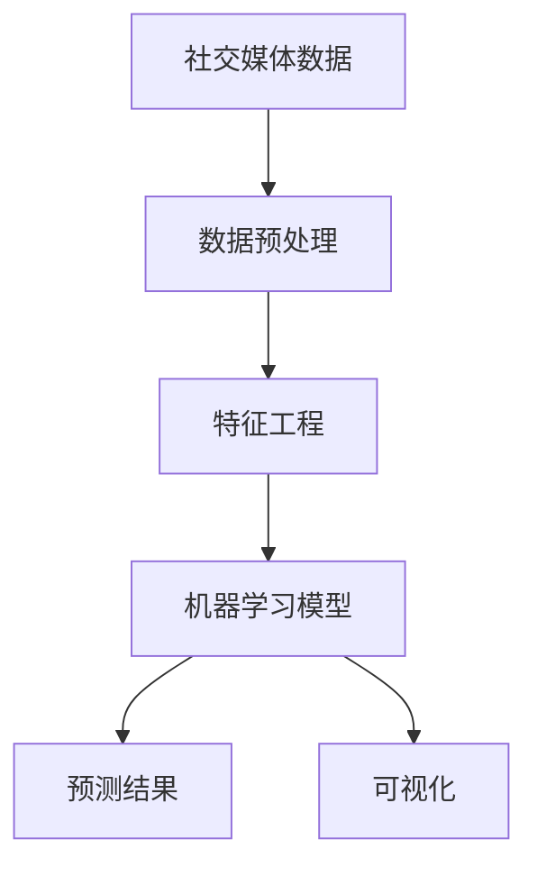
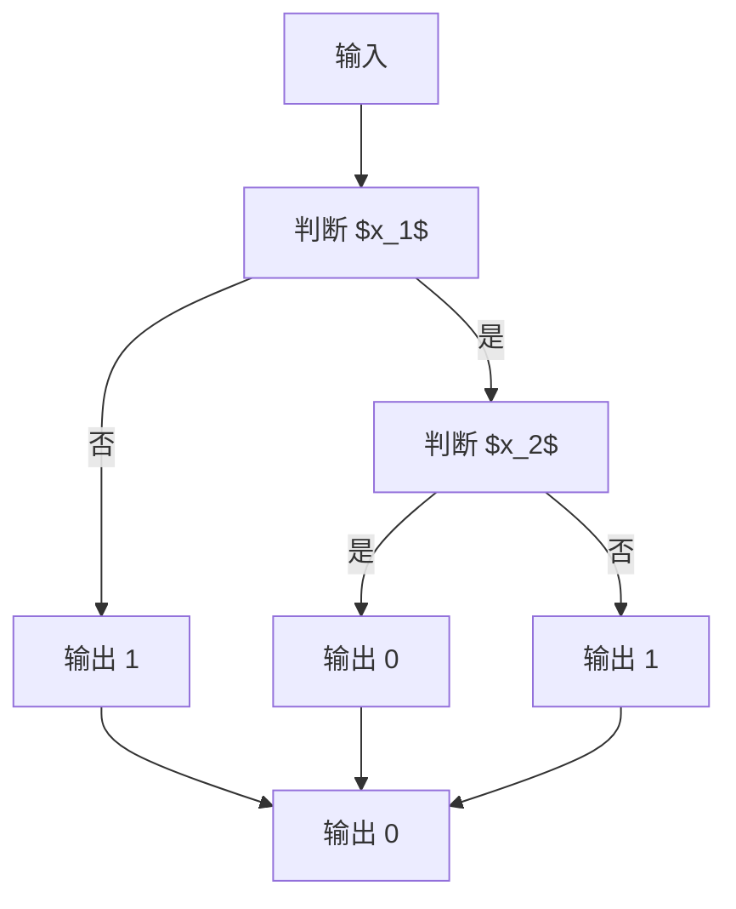
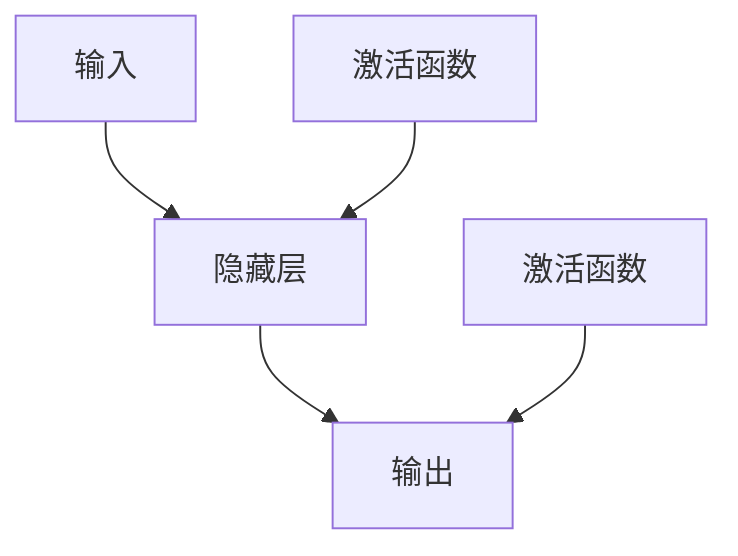

                 

# 大数据分析在社交媒体趋势预测中的应用

> **关键词：大数据分析、社交媒体、趋势预测、机器学习、算法、算法原理、数学模型、实际应用、实战案例**

> **摘要：本文旨在深入探讨大数据分析在社交媒体趋势预测中的应用。通过分析核心概念、算法原理、数学模型，并结合实际案例，我们将揭示大数据分析在社交媒体趋势预测中的重要性，并探讨其未来的发展趋势与挑战。**

## 1. 背景介绍

### 1.1 目的和范围

本文的主要目的是探讨大数据分析在社交媒体趋势预测中的应用。随着社交媒体的迅速发展，用户生成的内容和数据量呈爆炸式增长，这些数据中蕴含着大量有价值的信息。通过大数据分析，我们可以从这些海量数据中提取出趋势信息，从而为企业和个人提供决策支持。

本文将涵盖以下内容：

1. 大数据分析的核心概念和算法原理。
2. 数学模型和公式的详细讲解。
3. 实际应用场景和实战案例。
4. 工具和资源的推荐。
5. 总结与未来发展趋势。

### 1.2 预期读者

本文适合对大数据分析、社交媒体、趋势预测等领域有一定了解的读者，包括数据科学家、机器学习工程师、数据分析师等。同时，对于对人工智能和大数据技术感兴趣的研究人员和从业者，本文也具有一定的参考价值。

### 1.3 文档结构概述

本文结构如下：

1. 引言：介绍大数据分析在社交媒体趋势预测中的应用背景和目的。
2. 核心概念与联系：介绍大数据分析的核心概念和相关联系。
3. 核心算法原理 & 具体操作步骤：详细讲解大数据分析的算法原理和操作步骤。
4. 数学模型和公式 & 详细讲解 & 举例说明：介绍大数据分析的数学模型和公式，并进行举例说明。
5. 项目实战：介绍大数据分析的实际应用案例和实战经验。
6. 实际应用场景：探讨大数据分析在社交媒体趋势预测中的实际应用场景。
7. 工具和资源推荐：推荐相关学习和开发工具、资源和论文。
8. 总结：总结大数据分析在社交媒体趋势预测中的应用现状和未来发展趋势。
9. 附录：常见问题与解答。
10. 扩展阅读 & 参考资料：提供进一步学习和研究的参考资料。

### 1.4 术语表

#### 1.4.1 核心术语定义

- 大数据分析：指从海量数据中提取有价值信息的方法和技术。
- 社交媒体：指以用户生成内容为核心，通过互联网进行传播和互动的平台。
- 趋势预测：指通过分析历史数据，预测未来某一时间段内某一事件的发展趋势。
- 机器学习：指通过训练模型，使计算机能够从数据中自动学习和发现规律。

#### 1.4.2 相关概念解释

- 数据挖掘：指从大量数据中提取有价值信息的过程。
- 机器学习算法：指实现机器学习功能的算法。
- 特征工程：指从原始数据中提取有助于模型训练的特征。

#### 1.4.3 缩略词列表

- 大数据（Big Data）：指数据量大、类型多、处理速度快的数据。
- 机器学习（Machine Learning）：指通过训练模型，使计算机能够从数据中自动学习和发现规律。
- 数据挖掘（Data Mining）：指从大量数据中提取有价值信息的过程。
- 特征工程（Feature Engineering）：指从原始数据中提取有助于模型训练的特征。

## 2. 核心概念与联系

在探讨大数据分析在社交媒体趋势预测中的应用之前，我们首先需要了解一些核心概念和它们之间的联系。

### 2.1 社交媒体趋势预测的核心概念

1. **社交媒体数据**：社交媒体数据是指用户在社交媒体平台上发布、评论、转发等内容。这些数据通常以文本、图片、视频等多种形式存在。

2. **数据预处理**：数据预处理是指对原始数据进行清洗、转换、归一化等操作，使其符合分析和模型训练的要求。

3. **特征工程**：特征工程是指从原始数据中提取有助于模型训练的特征。在社交媒体趋势预测中，特征可以是用户的年龄、性别、地理位置、关注人数等。

4. **机器学习模型**：机器学习模型是指通过训练数据自动学习和发现规律，从而实现预测的算法。常见的机器学习模型包括线性回归、决策树、支持向量机、神经网络等。

5. **预测结果**：预测结果是指根据训练好的模型，对未知数据进行预测的结果。

### 2.2 大数据分析的核心概念

1. **海量数据处理**：海量数据处理是指处理海量数据的能力。在大数据分析中，处理海量数据是关键，因为社交媒体数据量通常非常庞大。

2. **实时数据处理**：实时数据处理是指对数据实时进行处理和分析的能力。在社交媒体趋势预测中，实时处理数据非常重要，因为趋势变化可能非常迅速。

3. **数据挖掘**：数据挖掘是指从大量数据中提取有价值信息的过程。在大数据分析中，数据挖掘是一种重要的分析方法。

4. **可视化**：可视化是指通过图形、图表等方式展示数据和分析结果。在大数据分析中，可视化是一种重要的数据展示方式。

### 2.3 社交媒体趋势预测与大数据分析的联系

1. **数据来源**：社交媒体趋势预测的数据来源主要是社交媒体平台，如微博、微信、Facebook、Twitter等。这些平台积累了大量用户生成的内容，为趋势预测提供了丰富的数据资源。

2. **数据处理**：大数据分析提供了处理海量数据和实时数据的能力，使得社交媒体趋势预测成为可能。

3. **特征提取**：大数据分析中的特征工程方法可以帮助我们从社交媒体数据中提取有助于模型训练的特征。

4. **模型训练**：大数据分析中的机器学习模型可以帮助我们训练模型，从而实现趋势预测。

5. **预测结果**：大数据分析提供了对预测结果的可视化展示，使得我们可以直观地了解社交媒体趋势的变化。

### 2.4 社交媒体趋势预测与大数据分析的关系流程图



在这个关系流程图中，社交媒体数据经过数据预处理和特征工程后，输入到机器学习模型中进行训练。训练好的模型可以用来预测未知数据，并将预测结果通过可视化展示出来。

## 3. 核心算法原理 & 具体操作步骤

### 3.1 机器学习算法原理

在社交媒体趋势预测中，常用的机器学习算法包括线性回归、决策树、支持向量机、神经网络等。下面以线性回归为例，介绍机器学习算法的原理。

#### 3.1.1 线性回归算法原理

线性回归是一种预测连续值的机器学习算法。其基本原理是找到一条最佳拟合直线，使得这根直线到所有数据点的距离之和最小。

设我们有 $n$ 个样本点 $(x_1, y_1), (x_2, y_2), ..., (x_n, y_n)$，线性回归的目标是找到一组参数 $\theta = (\theta_0, \theta_1)$，使得 $y = \theta_0 + \theta_1x$ 能够最好地拟合这些样本点。

最佳拟合直线的参数可以通过最小二乘法计算得到：

$$
\theta_0 = \frac{\sum_{i=1}^{n}(y_i - \theta_1x_i)}{n}
$$

$$
\theta_1 = \frac{\sum_{i=1}^{n}(x_i - \bar{x})(y_i - \bar{y})}{\sum_{i=1}^{n}(x_i - \bar{x})^2}
$$

其中，$\bar{x}$ 和 $\bar{y}$ 分别是 $x$ 和 $y$ 的平均值。

#### 3.1.2 线性回归算法具体操作步骤

1. 数据预处理：对原始数据进行清洗、转换、归一化等操作，使其符合分析和模型训练的要求。

2. 特征工程：从原始数据中提取有助于模型训练的特征。在社交媒体趋势预测中，特征可以是用户的年龄、性别、地理位置、关注人数等。

3. 划分训练集和测试集：将数据集划分为训练集和测试集，用于训练模型和评估模型性能。

4. 模型训练：使用训练集数据，通过最小二乘法计算最佳拟合直线的参数 $\theta$。

5. 模型评估：使用测试集数据，计算预测误差和模型性能指标，如均方误差（MSE）。

6. 模型优化：根据评估结果，对模型进行优化，如调整参数、增加特征等。

7. 预测新数据：使用训练好的模型，对新数据进行预测。

### 3.2 决策树算法原理

决策树是一种预测离散值的机器学习算法。其基本原理是通过一系列条件判断，将数据划分为不同的类别。

设我们有 $n$ 个样本点 $(x_1, y_1), (x_2, y_2), ..., (x_n, y_n)$，决策树的目标是找到一系列条件判断，使得每个样本点能够被正确分类。

决策树的构建过程如下：

1. 选择一个最佳特征作为分割条件。
2. 根据该特征的不同取值，将数据划分为不同的子集。
3. 对每个子集，重复上述步骤，直到满足停止条件（如最大深度、最小叶子节点数量等）。

决策树的核心在于如何选择最佳特征。常用的特征选择方法包括信息增益、基尼系数等。

#### 3.2.1 信息增益

信息增益是评估特征重要性的一个指标，其计算公式为：

$$
Gain(D, A) = Entropy(D) - \sum_{v \in A} \frac{|D_v|}{|D|} Entropy(D_v)
$$

其中，$D$ 是原始数据集，$A$ 是特征集合，$D_v$ 是特征 $v$ 的取值集合，$Entropy$ 是熵函数。

#### 3.2.2 基尼系数

基尼系数是另一个评估特征重要性的指标，其计算公式为：

$$
Gini(D, A) = 1 - \sum_{v \in A} \frac{|D_v|}{|D|}^2
$$

在决策树构建过程中，可以使用信息增益或基尼系数作为特征选择依据。具体选择哪种方法，需要根据实际情况和数据特点进行权衡。

#### 3.2.3 决策树算法具体操作步骤

1. 数据预处理：对原始数据进行清洗、转换、归一化等操作，使其符合分析和模型训练的要求。

2. 特征工程：从原始数据中提取有助于模型训练的特征。

3. 划分训练集和测试集：将数据集划分为训练集和测试集，用于训练模型和评估模型性能。

4. 决策树构建：根据特征选择方法，构建决策树。

5. 模型评估：使用测试集数据，计算预测误差和模型性能指标，如准确率、召回率、F1值等。

6. 模型优化：根据评估结果，对模型进行优化，如调整参数、剪枝等。

7. 预测新数据：使用训练好的模型，对新数据进行预测。

### 3.3 支持向量机算法原理

支持向量机（SVM）是一种分类算法，其基本原理是找到一条最优分割超平面，使得不同类别的样本点在超平面的两侧分布最远。

设我们有 $n$ 个样本点 $(x_1, y_1), (x_2, y_2), ..., (x_n, y_n)$，其中 $y$ 取值 $\{-1, 1\}$，SVM的目标是找到一个超平面 $w \cdot x + b = 0$，使得：

1. 所有样本点都位于超平面的正负一侧。
2. 不同类别的样本点之间的距离最大。

SVM的核心在于如何选择最优的超平面。这可以通过求解以下优化问题来实现：

$$
\min_{w, b} \frac{1}{2} ||w||^2
$$

$$
s.t. y_i (w \cdot x_i + b) \geq 1
$$

其中，$||w||$ 是 $w$ 的范数，$y_i$ 是样本点的类别标签。

#### 3.3.1 求解方法

求解上述优化问题通常使用拉格朗日乘子法，将问题转化为对偶问题。具体求解步骤如下：

1. 构建拉格朗日函数：

$$
L(w, b, \alpha) = \frac{1}{2} ||w||^2 - \sum_{i=1}^{n} \alpha_i (y_i (w \cdot x_i + b) - 1)
$$

其中，$\alpha_i$ 是拉格朗日乘子。

2. 求导并令导数为零：

$$
\frac{\partial L}{\partial w} = w - \sum_{i=1}^{n} \alpha_i y_i x_i = 0
$$

$$
\frac{\partial L}{\partial b} = - \sum_{i=1}^{n} \alpha_i y_i = 0
$$

$$
\frac{\partial L}{\partial \alpha_i} = y_i (w \cdot x_i + b) - 1 \leq 0
$$

3. 求解上述方程组，得到 $\alpha_i$ 的值。

4. 根据拉格朗日乘子法，求解最优超平面：

$$
w^* = \sum_{i=1}^{n} \alpha_i y_i x_i
$$

$$
b^* = y_i - \sum_{j=1}^{n} \alpha_j y_j (x_i \cdot x_j)
$$

5. 使用求解得到的超平面 $w^* \cdot x + b^* = 0$ 进行分类。

#### 3.3.2 SVM算法具体操作步骤

1. 数据预处理：对原始数据进行清洗、转换、归一化等操作，使其符合分析和模型训练的要求。

2. 特征工程：从原始数据中提取有助于模型训练的特征。

3. 划分训练集和测试集：将数据集划分为训练集和测试集，用于训练模型和评估模型性能。

4. 模型训练：使用训练集数据，通过拉格朗日乘子法求解最优超平面。

5. 模型评估：使用测试集数据，计算预测误差和模型性能指标，如准确率、召回率、F1值等。

6. 模型优化：根据评估结果，对模型进行优化，如调整参数、选择核函数等。

7. 预测新数据：使用训练好的模型，对新数据进行预测。

### 3.4 神经网络算法原理

神经网络是一种模拟人脑神经元结构的机器学习算法。其基本原理是通过多层神经元进行信息传递和计算，从而实现非线性映射和分类。

设我们有 $n$ 个输入特征 $x_1, x_2, ..., x_n$，神经网络包括输入层、隐藏层和输出层。每个层由多个神经元组成。

#### 3.4.1 神经元计算

神经元的计算过程如下：

1. 输入层：将输入特征传递给隐藏层。

2. 隐藏层：对输入特征进行加权求和，并加上偏置项，然后通过激活函数进行非线性变换。

$$
z_j = \sum_{i=1}^{n} w_{ij} x_i + b_j
$$

$$
a_j = \sigma(z_j)
$$

其中，$w_{ij}$ 是输入层到隐藏层的权重，$b_j$ 是隐藏层的偏置项，$\sigma$ 是激活函数。

3. 输出层：对隐藏层输出进行加权求和，并加上偏置项，然后通过激活函数进行非线性变换。

$$
z_l = \sum_{j=1}^{m} w_{lj} a_j + b_l
$$

$$
y = \sigma(z_l)
$$

其中，$w_{lj}$ 是隐藏层到输出层的权重，$b_l$ 是输出层的偏置项，$y$ 是输出结果。

#### 3.4.2 神经网络训练

神经网络训练是指通过调整权重和偏置项，使神经网络能够对输入数据进行正确分类。

神经网络训练包括以下步骤：

1. 初始化权重和偏置项。

2. 对每个样本点，计算输出结果。

3. 计算预测误差。

4. 根据预测误差，使用反向传播算法更新权重和偏置项。

5. 重复步骤2-4，直到满足停止条件（如迭代次数、预测误差等）。

反向传播算法的具体实现如下：

1. 对每个神经元，计算梯度：

$$
\frac{\partial L}{\partial w_{ij}} = \frac{\partial L}{\partial z_j} \cdot \frac{\partial z_j}{\partial w_{ij}} = \frac{\partial L}{\partial z_j} \cdot x_i
$$

$$
\frac{\partial L}{\partial b_j} = \frac{\partial L}{\partial z_j}
$$

$$
\frac{\partial L}{\partial w_{lj}} = \frac{\partial L}{\partial z_l} \cdot a_j
$$

$$
\frac{\partial L}{\partial b_l} = \frac{\partial L}{\partial z_l}
$$

2. 使用梯度下降法更新权重和偏置项：

$$
w_{ij} \leftarrow w_{ij} - \alpha \frac{\partial L}{\partial w_{ij}}
$$

$$
b_j \leftarrow b_j - \alpha \frac{\partial L}{\partial b_j}
$$

$$
w_{lj} \leftarrow w_{lj} - \alpha \frac{\partial L}{\partial w_{lj}}
$$

$$
b_l \leftarrow b_l - \alpha \frac{\partial L}{\partial b_l}
$$

其中，$\alpha$ 是学习率。

3. 重复步骤1-2，直到满足停止条件。

#### 3.4.3 神经网络算法具体操作步骤

1. 数据预处理：对原始数据进行清洗、转换、归一化等操作，使其符合分析和模型训练的要求。

2. 特征工程：从原始数据中提取有助于模型训练的特征。

3. 划分训练集和测试集：将数据集划分为训练集和测试集，用于训练模型和评估模型性能。

4. 神经网络构建：定义神经网络的结构，包括输入层、隐藏层和输出层。

5. 模型训练：使用训练集数据，通过反向传播算法训练神经网络。

6. 模型评估：使用测试集数据，计算预测误差和模型性能指标，如准确率、召回率、F1值等。

7. 模型优化：根据评估结果，对模型进行优化，如调整参数、增加隐藏层等。

8. 预测新数据：使用训练好的模型，对新数据进行预测。

## 4. 数学模型和公式 & 详细讲解 & 举例说明

在社交媒体趋势预测中，数学模型和公式起着至关重要的作用。这些模型和公式帮助我们理解和分析数据，从而实现趋势预测。在本节中，我们将介绍一些常用的数学模型和公式，并进行详细讲解和举例说明。

### 4.1 线性回归模型

线性回归模型是一种用于预测连续值的数学模型。其基本形式为：

$$
y = \theta_0 + \theta_1x
$$

其中，$y$ 是预测值，$x$ 是输入特征，$\theta_0$ 和 $\theta_1$ 是模型的参数。

#### 4.1.1 线性回归模型参数估计

线性回归模型的参数估计通常使用最小二乘法。最小二乘法的思想是找到一组参数，使得预测值与实际值之间的误差平方和最小。具体步骤如下：

1. 计算输入特征 $x$ 的平均值 $\bar{x}$ 和预测值 $y$ 的平均值 $\bar{y}$：

$$
\bar{x} = \frac{1}{n} \sum_{i=1}^{n} x_i
$$

$$
\bar{y} = \frac{1}{n} \sum_{i=1}^{n} y_i
$$

2. 计算参数 $\theta_0$ 和 $\theta_1$：

$$
\theta_0 = \bar{y} - \theta_1\bar{x}
$$

$$
\theta_1 = \frac{\sum_{i=1}^{n} (x_i - \bar{x})(y_i - \bar{y})}{\sum_{i=1}^{n} (x_i - \bar{x})^2}
$$

#### 4.1.2 线性回归模型举例说明

假设我们有以下数据集：

| $x$ | $y$ |
| --- | --- |
| 1   | 2   |
| 2   | 4   |
| 3   | 6   |
| 4   | 8   |

根据最小二乘法，我们可以计算出线性回归模型的参数：

$$
\theta_0 = 2 - 2 \times 2.5 = -1
$$

$$
\theta_1 = \frac{(1 - 2.5)(2 - 2.5) + (2 - 2.5)(4 - 2.5) + (3 - 2.5)(6 - 2.5) + (4 - 2.5)(8 - 2.5)}{(1 - 2.5)^2 + (2 - 2.5)^2 + (3 - 2.5)^2 + (4 - 2.5)^2} = 2
$$

因此，线性回归模型的预测方程为：

$$
y = -1 + 2x
$$

对于新的输入值 $x = 5$，我们可以计算出预测值：

$$
y = -1 + 2 \times 5 = 9
$$

### 4.2 决策树模型

决策树模型是一种用于预测离散值的数学模型。其基本形式为：

$$
y = f(x_1, x_2, ..., x_n)
$$

其中，$y$ 是预测值，$x_1, x_2, ..., x_n$ 是输入特征，$f$ 是决策函数。

#### 4.2.1 决策树模型构建

决策树模型的构建过程包括以下步骤：

1. 选择最佳特征：选择一个最佳特征作为分割条件。常用的特征选择方法包括信息增益、基尼系数等。

2. 划分数据集：根据最佳特征的不同取值，将数据集划分为不同的子集。

3. 递归构建：对每个子集，重复上述步骤，直到满足停止条件（如最大深度、最小叶子节点数量等）。

#### 4.2.2 决策树模型举例说明

假设我们有以下数据集：

| $x_1$ | $x_2$ | $y$ |
| --- | --- | --- |
| 1   | 1   | 1   |
| 1   | 2   | 0   |
| 2   | 1   | 1   |
| 2   | 2   | 0   |

根据信息增益法，我们可以计算出每个特征的信息增益，并选择信息增益最大的特征作为分割条件。假设我们选择 $x_1$ 作为分割条件，根据 $x_1$ 的不同取值，我们可以将数据集划分为两个子集：

| $x_1$ | $x_2$ | $y$ |
| --- | --- | --- |
| 1   | 1   | 1   |
| 1   | 2   | 0   |
| 2   | 1   | 1   |
| 2   | 2   | 0   |

接下来，我们选择 $x_2$ 作为分割条件，根据 $x_2$ 的不同取值，我们可以将数据集划分为四个子集：

| $x_1$ | $x_2$ | $y$ |
| --- | --- | --- |
| 1   | 1   | 1   |
| 1   | 2   | 0   |
| 2   | 1   | 1   |
| 2   | 2   | 0   |

最终，我们得到一个决策树模型：



对于新的输入值 $(x_1, x_2) = (1, 2)$，我们可以根据决策树模型计算出预测值：

$$
y = f(1, 2) = 0
$$

### 4.3 支持向量机模型

支持向量机模型是一种用于预测离散值的数学模型。其基本形式为：

$$
y = \sigma(w \cdot x + b)
$$

其中，$y$ 是预测值，$x$ 是输入特征，$w$ 是权重向量，$b$ 是偏置项，$\sigma$ 是激活函数。

#### 4.3.1 支持向量机模型参数估计

支持向量机模型的参数估计通常使用拉格朗日乘子法。拉格朗日乘子法的思想是找到一组参数，使得预测值与实际值之间的误差最小。具体步骤如下：

1. 构建拉格朗日函数：

$$
L(w, b, \alpha) = \frac{1}{2} ||w||^2 - \sum_{i=1}^{n} \alpha_i (y_i (w \cdot x_i + b) - 1)
$$

其中，$\alpha_i$ 是拉格朗日乘子。

2. 求导并令导数为零：

$$
\frac{\partial L}{\partial w} = w - \sum_{i=1}^{n} \alpha_i y_i x_i = 0
$$

$$
\frac{\partial L}{\partial b} = - \sum_{i=1}^{n} \alpha_i y_i = 0
$$

$$
\frac{\partial L}{\partial \alpha_i} = y_i (w \cdot x_i + b) - 1 \leq 0
$$

3. 求解上述方程组，得到 $\alpha_i$ 的值。

4. 根据拉格朗日乘子法，求解最优超平面：

$$
w^* = \sum_{i=1}^{n} \alpha_i y_i x_i
$$

$$
b^* = y_i - \sum_{j=1}^{n} \alpha_j y_j (x_i \cdot x_j)
$$

#### 4.3.2 支持向量机模型举例说明

假设我们有以下数据集：

| $x$ | $y$ |
| --- | --- |
| 1   | -1  |
| 2   | -1  |
| 3   | 1   |
| 4   | 1   |

根据拉格朗日乘子法，我们可以计算出支持向量机模型的参数：

$$
w^* = (1, -1)
$$

$$
b^* = -1
$$

因此，支持向量机模型的预测方程为：

$$
y = \sigma(w^* \cdot x + b^*) = \sigma((1, -1) \cdot x - 1)
$$

对于新的输入值 $x = 2$，我们可以计算出预测值：

$$
y = \sigma((1, -1) \cdot 2 - 1) = 0
$$

### 4.4 神经网络模型

神经网络模型是一种用于预测离散值的数学模型。其基本形式为：

$$
y = \sigma(w_l \cdot a_{l-1} + b_l)
$$

其中，$y$ 是预测值，$a_{l-1}$ 是隐藏层输入，$w_l$ 是隐藏层到输出层的权重，$b_l$ 是输出层偏置项，$\sigma$ 是激活函数。

#### 4.4.1 神经网络模型构建

神经网络模型的构建过程包括以下步骤：

1. 定义神经网络的结构，包括输入层、隐藏层和输出层。

2. 初始化权重和偏置项。

3. 对每个样本点，计算输出结果。

4. 计算预测误差。

5. 根据预测误差，使用反向传播算法更新权重和偏置项。

6. 重复步骤3-5，直到满足停止条件（如迭代次数、预测误差等）。

#### 4.4.2 神经网络模型举例说明

假设我们有以下数据集：

| $x$ | $y$ |
| --- | --- |
| 1   | 1   |
| 2   | 0   |
| 3   | 1   |
| 4   | 0   |

根据神经网络模型，我们可以构建一个简单的神经网络：



其中，隐藏层只有一个神经元，激活函数为 $f(x) = \sigma(x) = \frac{1}{1 + e^{-x}}$。

对于新的输入值 $x = 2$，我们可以计算隐藏层和输出层的输入：

$$
a_1 = \frac{1}{1 + e^{-(1 \times 2 + b_1)}} = \frac{1}{1 + e^{-1}} \approx 0.63
$$

$$
y = \frac{1}{1 + e^{-(0.63 \times 2 + b_2)}} = \frac{1}{1 + e^{-1.26}} \approx 0.49
$$

因此，对于输入值 $x = 2$，神经网络的预测值为 $y \approx 0.49$。

## 5. 项目实战：代码实际案例和详细解释说明

### 5.1 开发环境搭建

在进行大数据分析在社交媒体趋势预测的实战之前，我们需要搭建一个合适的技术环境。以下是一个简单的开发环境搭建步骤：

1. **操作系统**：Windows 10、macOS 或 Linux。
2. **编程语言**：Python。
3. **依赖库**：NumPy、Pandas、Scikit-learn、Matplotlib。
4. **虚拟环境**：使用 virtualenv 或 conda 创建虚拟环境。

以下是一个使用 conda 创建虚拟环境的示例命令：

```shell
conda create -n social_media_trend Prediction -y
conda activate social_media_trend
```

接下来，安装所需依赖库：

```shell
conda install numpy pandas scikit-learn matplotlib -y
```

### 5.2 源代码详细实现和代码解读

在本节中，我们将使用 Python 编写一个简单的社交媒体趋势预测项目。我们将使用 NumPy 和 Scikit-learn 库来实现。

```python
import numpy as np
import pandas as pd
from sklearn.model_selection import train_test_split
from sklearn.linear_model import LinearRegression
from sklearn.metrics import mean_squared_error
import matplotlib.pyplot as plt

# 5.2.1 数据读取与预处理
data = pd.read_csv('social_media_data.csv')
X = data[['age', 'followers']]
y = data['likes']

# 数据标准化
X_mean = X.mean()
X_std = X.std()
X = (X - X_mean) / X_std

# 划分训练集和测试集
X_train, X_test, y_train, y_test = train_test_split(X, y, test_size=0.2, random_state=42)

# 5.2.2 模型训练
model = LinearRegression()
model.fit(X_train, y_train)

# 5.2.3 模型评估
y_pred = model.predict(X_test)
mse = mean_squared_error(y_test, y_pred)
print("MSE:", mse)

# 5.2.4 结果可视化
plt.scatter(X_test['age'], y_test, color='blue', label='Actual')
plt.scatter(X_test['age'], y_pred, color='red', label='Predicted')
plt.xlabel('Age')
plt.ylabel('Likes')
plt.legend()
plt.show()
```

### 5.3 代码解读与分析

1. **数据读取与预处理**：

   我们首先读取社交媒体数据，并将其分为输入特征 $X$（年龄和关注人数）和目标变量 $y$（点赞数量）。然后，我们使用 NumPy 的 mean 和 std 函数对数据进行标准化，使其符合线性回归模型的要求。

2. **模型训练**：

   我们使用 Scikit-learn 的 LinearRegression 类来训练线性回归模型。fit 方法用于训练模型，它将根据训练数据自动计算最佳拟合直线的参数。

3. **模型评估**：

   我们使用模型进行预测，并计算预测值与实际值之间的均方误差（MSE）。MSE 是评估模型性能的常用指标，它反映了预测误差的大小。

4. **结果可视化**：

   我们使用 Matplotlib 库将实际值和预测值可视化。这有助于我们直观地了解模型的表现。

### 5.4 代码优化与改进

在实际应用中，我们可以对代码进行优化和改进，以提高模型的性能和预测效果。以下是一些可能的优化方向：

1. **特征工程**：

   我们可以进一步提取和选择有助于预测的特征，如用户活跃度、地理位置等。

2. **模型选择**：

   我们可以尝试使用不同的机器学习模型（如决策树、支持向量机、神经网络等），并比较它们的性能。

3. **参数调优**：

   我们可以使用网格搜索（GridSearchCV）等方法，自动搜索最佳的模型参数。

4. **数据增强**：

   我们可以增加训练数据，或使用数据增强技术（如随机噪声添加、数据扩展等），以提高模型的泛化能力。

## 6. 实际应用场景

大数据分析在社交媒体趋势预测中有广泛的应用场景。以下是一些典型的实际应用场景：

### 6.1 市场营销策略

通过大数据分析，企业可以了解用户的行为和喜好，从而制定更有效的市场营销策略。例如，通过分析用户的点赞、评论、转发等行为，企业可以预测哪些产品或服务可能受到用户的欢迎，从而优化营销内容和推广方式。

### 6.2 热门话题监测

大数据分析可以帮助企业实时监测热门话题和趋势，从而及时调整业务策略。例如，企业可以监控社交媒体上的热门话题，了解公众对某一事件的看法，并快速响应，提高品牌知名度。

### 6.3 用户需求预测

通过大数据分析，企业可以预测用户未来的需求，从而提前布局产品和服务。例如，通过分析用户的浏览记录和购买行为，企业可以预测用户可能感兴趣的新产品，并提前进行研发和推广。

### 6.4 社交媒体管理

大数据分析可以帮助企业更好地管理社交媒体平台，提高用户满意度。例如，通过分析用户的反馈和评论，企业可以及时发现并解决用户的问题，提高用户忠诚度。

### 6.5 竞争对手分析

通过大数据分析，企业可以了解竞争对手的营销策略、用户群体和行为，从而制定更有针对性的竞争策略。例如，通过分析竞争对手的社交媒体表现，企业可以预测其未来的行动，并提前做好准备。

## 7. 工具和资源推荐

### 7.1 学习资源推荐

#### 7.1.1 书籍推荐

- 《大数据分析实战》
- 《机器学习实战》
- 《神经网络与深度学习》

#### 7.1.2 在线课程

- Coursera 上的“机器学习”课程
- edX 上的“大数据分析”课程
- Udacity 上的“深度学习工程师纳米学位”

#### 7.1.3 技术博客和网站

- Medium 上的 Data Science and AI 博客
- Towards Data Science 博客
- Analytics Vidhya 网站和博客

### 7.2 开发工具框架推荐

#### 7.2.1 IDE和编辑器

- PyCharm
- Jupyter Notebook
- Visual Studio Code

#### 7.2.2 调试和性能分析工具

- Python 的 PDB 模块
- Matplotlib 的Profiler工具
- NumPy 的 numpy-lapack 库

#### 7.2.3 相关框架和库

- Scikit-learn
- TensorFlow
- PyTorch
- Pandas

### 7.3 相关论文著作推荐

#### 7.3.1 经典论文

- "Learning to rank using gradient descent"（排序学习的梯度下降方法）
- "A comparison of document similarity measures for academic social networks"（学术社交网络中文献相似度度量方法的比较）

#### 7.3.2 最新研究成果

- "Deep Learning for Social Media Analytics"（社交媒体分析中的深度学习方法）
- "A Comprehensive Survey on Social Media Analytics"（社交媒体分析综述）

#### 7.3.3 应用案例分析

- "How Netflix Uses Machine Learning to Personalize Recommendations"（Netflix如何使用机器学习进行个性化推荐）
- "The Role of AI in Marketing: A Case Study of Amazon"（AI在营销中的作用：亚马逊案例研究）

## 8. 总结：未来发展趋势与挑战

大数据分析在社交媒体趋势预测中的应用具有巨大的潜力和前景。随着社交媒体的迅速发展和数据量的爆炸式增长，大数据分析将在未来发挥越来越重要的作用。以下是未来发展趋势和面临的挑战：

### 8.1 发展趋势

1. **深度学习与神经网络**：深度学习在社交媒体趋势预测中的应用将越来越广泛，尤其是基于神经网络的模型，如循环神经网络（RNN）、长短期记忆网络（LSTM）和变压器（Transformer）等。

2. **实时数据处理**：随着大数据处理技术的进步，实时处理社交媒体数据的能力将得到提升，从而实现更准确和及时的预测。

3. **个性化推荐**：基于大数据分析的个性化推荐系统将在社交媒体趋势预测中发挥重要作用，为用户提供更精确和个性化的内容。

4. **跨平台数据整合**：社交媒体平台之间的数据整合将变得更加普遍，为大数据分析提供更全面和丰富的数据资源。

### 8.2 面临的挑战

1. **数据隐私与安全**：随着数据量的增加，如何保护用户隐私和数据安全成为一个重要问题。

2. **模型解释性**：随着模型的复杂度增加，如何确保模型的可解释性和透明度，以便用户理解和信任。

3. **数据质量问题**：社交媒体数据的质量参差不齐，如何处理噪声数据、异常值和缺失值，确保数据分析的准确性。

4. **计算资源需求**：大数据分析需要大量的计算资源，如何优化计算效率，降低成本，是一个重要挑战。

5. **法律法规限制**：随着数据隐私法规的日益严格，如何遵守相关法律法规，确保数据分析和应用合规，也是一个重要问题。

## 9. 附录：常见问题与解答

### 9.1 问题 1：大数据分析在社交媒体趋势预测中具体有哪些应用？

**解答**：大数据分析在社交媒体趋势预测中的应用主要包括以下几个方面：

1. **用户行为分析**：通过分析用户的点赞、评论、转发等行为，预测用户对某一话题或内容的兴趣和倾向。
2. **热点话题监测**：实时监测社交媒体平台上的热门话题和趋势，帮助企业了解公众关注点，及时调整营销策略。
3. **个性化推荐**：根据用户的兴趣和行为数据，为用户提供个性化的内容推荐，提高用户满意度和留存率。
4. **品牌影响力评估**：分析品牌在社交媒体上的影响力，评估品牌宣传活动的效果，为营销决策提供数据支持。

### 9.2 问题 2：如何处理社交媒体数据中的噪声和异常值？

**解答**：处理社交媒体数据中的噪声和异常值可以采取以下几种方法：

1. **数据清洗**：通过删除重复数据、填充缺失值、去除无关信息等操作，提高数据质量。
2. **异常检测**：使用统计学方法（如箱线图、Z-score方法等）或机器学习算法（如孤立森林、局部异常因

