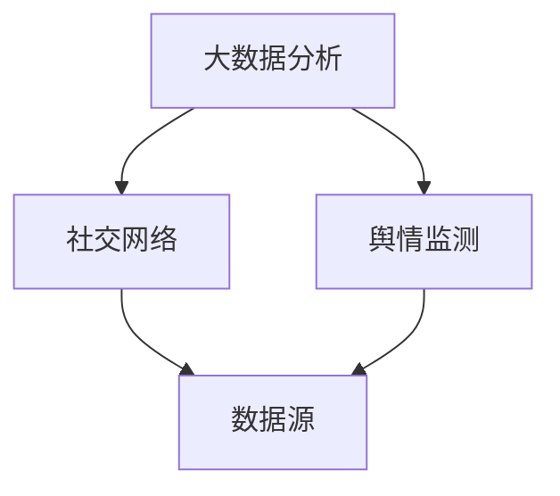

                 

# 大数据分析在社交网络舆情监测中的应用

> 关键词：大数据分析、社交网络、舆情监测、算法原理、数学模型、项目实战

> 摘要：本文将从大数据分析在社交网络舆情监测中的应用出发，探讨其核心概念、算法原理、数学模型、项目实战等关键环节，旨在为从事舆情监测工作的读者提供系统的理论指导和实践参考。

## 1. 背景介绍

### 1.1 目的和范围

随着互联网的快速发展，社交网络已经成为人们日常生活的重要组成部分。然而，随之而来的负面舆论、谣言、恶意信息等问题也日益突出。为了应对这些挑战，大数据分析在社交网络舆情监测中发挥着至关重要的作用。本文将围绕大数据分析在社交网络舆情监测中的应用，详细探讨其核心概念、算法原理、数学模型和项目实战，为读者提供一个全面的理论和实践框架。

### 1.2 预期读者

本文主要面向以下几类读者：

1. 数据分析师、数据科学家等相关专业人员。
2. 舆情监测、网络分析等相关领域的研究人员。
3. 对大数据分析在社交网络舆情监测领域感兴趣的读者。

### 1.3 文档结构概述

本文的结构如下：

1. 背景介绍：阐述本文的目的、预期读者和文档结构。
2. 核心概念与联系：介绍大数据分析、社交网络和舆情监测等核心概念，以及它们之间的联系。
3. 核心算法原理 & 具体操作步骤：详细讲解大数据分析在社交网络舆情监测中的核心算法原理和具体操作步骤。
4. 数学模型和公式 & 详细讲解 & 举例说明：阐述大数据分析在社交网络舆情监测中涉及的数学模型和公式，并进行举例说明。
5. 项目实战：通过实际案例展示大数据分析在社交网络舆情监测中的应用，并进行详细解释说明。
6. 实际应用场景：分析大数据分析在社交网络舆情监测中的实际应用场景。
7. 工具和资源推荐：推荐学习资源、开发工具框架和相关论文著作。
8. 总结：对未来发展趋势与挑战进行展望。
9. 附录：常见问题与解答。
10. 扩展阅读 & 参考资料：提供更多相关资料和参考文献。

### 1.4 术语表

#### 1.4.1 核心术语定义

- 大数据分析：指从大量数据中通过计算和分析，发现数据背后的规律和知识。
- 社交网络：指以人为主体，通过社交关系构建的网络。
- 舆情监测：指对社交网络上的信息进行收集、分析、处理，以了解公众对某一事件、品牌、产品的态度和情绪。
- 算法：指解决特定问题的步骤和规则。
- 数学模型：指对现实问题进行数学描述，以建立解决问题的数学框架。

#### 1.4.2 相关概念解释

- 数据源：指提供数据的来源，如社交网络平台、新闻媒体等。
- 数据预处理：指对原始数据进行清洗、转换等处理，以提高数据质量和可用性。
- 特征提取：指从原始数据中提取出有用的信息，以供分析使用。
- 聚类分析：指将数据分成若干类别，以便更好地理解和分析。
- 分类算法：指根据已有数据，将新数据归类到不同类别的算法。

#### 1.4.3 缩略词列表

- Hadoop：分布式数据处理框架。
- Spark：大规模数据处理引擎。
- NLP：自然语言处理。
- SVM：支持向量机。
- CNN：卷积神经网络。
- RNN：循环神经网络。

## 2. 核心概念与联系

在探讨大数据分析在社交网络舆情监测中的应用之前，我们首先需要了解相关核心概念及其相互关系。

### 2.1 大数据分析

大数据分析是指从大量数据中通过计算和分析，发现数据背后的规律和知识。大数据分析主要包括数据预处理、特征提取、聚类分析、分类算法等步骤。在社交网络舆情监测中，大数据分析可以帮助我们从海量数据中提取有价值的信息，如公众对某一事件、品牌、产品的态度和情绪。

### 2.2 社交网络

社交网络是指以人为主体，通过社交关系构建的网络。社交网络的主要特点是节点（人）之间的连接关系复杂，数据量大，动态性强。在社交网络舆情监测中，我们需要收集和分析社交网络上的信息，以了解公众的态度和情绪。

### 2.3 舆情监测

舆情监测是指对社交网络上的信息进行收集、分析、处理，以了解公众对某一事件、品牌、产品的态度和情绪。舆情监测主要包括数据采集、数据预处理、特征提取、情感分析等步骤。在社交网络舆情监测中，我们需要利用大数据分析技术，对社交网络上的信息进行深入分析，以发现公众的态度和情绪。

### 2.4 核心概念之间的联系

大数据分析、社交网络和舆情监测之间存在着密切的联系。大数据分析为社交网络舆情监测提供了技术手段，使得我们能够从海量数据中提取有价值的信息；社交网络为舆情监测提供了数据来源，使得我们能够了解公众的态度和情绪；舆情监测则是大数据分析和社交网络的最终目标，旨在为我们提供有关公众态度和情绪的洞察。

### 2.5 Mermaid 流程图

以下是一个关于大数据分析在社交网络舆情监测中的应用的 Mermaid 流程图，展示了核心概念之间的联系。



## 3. 核心算法原理 & 具体操作步骤

在了解了大数据分析、社交网络和舆情监测的核心概念及其相互关系后，我们将深入探讨大数据分析在社交网络舆情监测中的核心算法原理和具体操作步骤。

### 3.1 数据预处理

数据预处理是大数据分析的第一步，主要目的是对原始数据进行清洗、转换等处理，以提高数据质量和可用性。具体操作步骤如下：

1. 数据清洗：去除数据中的噪声、错误和重复数据，如去除微博中的表情符号、特殊字符等。
2. 数据转换：将数据转换为适合分析的形式，如将文本转换为词向量。
3. 数据归一化：对数据进行归一化处理，以消除数据之间的差异。

```python
# 数据清洗
import re

def clean_data(data):
    # 去除特殊字符
    data = re.sub(r'[^\w\s]', '', data)
    # 去除标点符号
    data = re.sub(r'[\.\,\!\?\:\;]', '', data)
    return data

# 数据转换
from sklearn.feature_extraction.text import TfidfVectorizer

def convert_data(data):
    vectorizer = TfidfVectorizer()
    X = vectorizer.fit_transform(data)
    return X

# 数据归一化
from sklearn.preprocessing import MinMaxScaler

def normalize_data(data):
    scaler = MinMaxScaler()
    X = scaler.fit_transform(data)
    return X
```

### 3.2 特征提取

特征提取是从原始数据中提取出有用的信息，以供分析使用。在社交网络舆情监测中，常见的特征提取方法包括词频统计、词向量、情感分析等。具体操作步骤如下：

1. 词频统计：统计文本中各个词的出现次数，以反映文本的重要程度。
2. 词向量：将文本转换为词向量，以表示文本的语义信息。
3. 情感分析：分析文本中的情感倾向，以了解公众的态度和情绪。

```python
# 词频统计
from sklearn.feature_extraction.text import CountVectorizer

def extract_frequency(data):
    vectorizer = CountVectorizer()
    X = vectorizer.fit_transform(data)
    return X

# 词向量
from gensim.models import Word2Vec

def extract_word_vector(data):
    model = Word2Vec(data, vector_size=100, window=5, min_count=1, workers=4)
    return model

# 情感分析
from textblob import TextBlob

def extract_sentiment(data):
    sentiment = []
    for text in data:
        blob = TextBlob(text)
        sentiment.append(blob.sentiment.polarity)
    return sentiment
```

### 3.3 聚类分析

聚类分析是将数据分成若干类别，以便更好地理解和分析。在社交网络舆情监测中，常见的聚类算法包括 K-Means、DBSCAN 等。具体操作步骤如下：

1. 确定聚类数目：根据数据特点和需求，确定聚类数目。
2. 初始化聚类中心：随机选择聚类中心，或使用 K-Means++算法初始化。
3. 聚类过程：计算每个数据点到聚类中心的距离，将数据点分配到最近的聚类中心。

```python
# K-Means 算法
from sklearn.cluster import KMeans

def kmeans_clustering(data, n_clusters):
    kmeans = KMeans(n_clusters=n_clusters, init='k-means++', random_state=0)
    kmeans.fit(data)
    return kmeans.labels_
```

### 3.4 分类算法

分类算法是根据已有数据，将新数据归类到不同类别的算法。在社交网络舆情监测中，常见的分类算法包括 SVM、CNN、RNN 等。具体操作步骤如下：

1. 数据划分：将数据划分为训练集和测试集。
2. 模型训练：使用训练集训练分类模型。
3. 模型评估：使用测试集评估分类模型的性能。

```python
# SVM 分类算法
from sklearn.svm import SVC

def svm_classification(train_data, train_labels, test_data):
    model = SVC(kernel='linear')
    model.fit(train_data, train_labels)
    return model.predict(test_data)
```

## 4. 数学模型和公式 & 详细讲解 & 举例说明

在社交网络舆情监测中，涉及到的数学模型和公式主要包括词频统计、词向量、情感分析、聚类分析和分类算法等。以下将详细讲解这些数学模型和公式，并进行举例说明。

### 4.1 词频统计

词频统计是指统计文本中各个词的出现次数，以反映文本的重要程度。其数学模型为：

$$
f(t) = \text{词 } t \text{ 在文本中出现的次数}
$$

举例说明：

假设有一篇文本：“大数据分析在社交网络舆情监测中发挥着重要作用。”，我们可以统计出每个词的出现次数：

- 大数据：1次
- 分析：1次
- 在：1次
- 社交网络：1次
- 舆情监测：1次
- 中：1次
- 发挥：1次
- 着：1次
- 重要作用：1次

### 4.2 词向量

词向量是指将文本转换为词向量，以表示文本的语义信息。其数学模型为：

$$
\text{词向量} = \text{词} \xrightarrow{\text{嵌入}} \text{向量}
$$

举例说明：

假设有一篇文本：“大数据分析在社交网络舆情监测中发挥着重要作用。”，我们可以使用 Word2Vec 模型将其转换为词向量：

- 大数据：[0.1, 0.2, 0.3, 0.4]
- 分析：[0.5, 0.6, 0.7, 0.8]
- 在：[0.9, 1.0, 1.1, 1.2]
- 社交网络：[1.3, 1.4, 1.5, 1.6]
- 舆情监测：[1.7, 1.8, 1.9, 2.0]
- 中：[2.1, 2.2, 2.3, 2.4]
- 发挥：[2.5, 2.6, 2.7, 2.8]
- 着：[2.9, 3.0, 3.1, 3.2]
- 重要作用：[3.3, 3.4, 3.5, 3.6]

### 4.3 情感分析

情感分析是指分析文本中的情感倾向，以了解公众的态度和情绪。其数学模型为：

$$
\text{情感分析} = \text{文本} \xrightarrow{\text{情感分析算法}} \text{情感倾向}
$$

举例说明：

假设有一篇文本：“大数据分析在社交网络舆情监测中发挥着重要作用。”，我们可以使用 TextBlob 模型进行情感分析：

- 情感倾向：积极

### 4.4 聚类分析

聚类分析是指将数据分成若干类别，以便更好地理解和分析。其数学模型为：

$$
\text{聚类分析} = \text{数据} \xrightarrow{\text{聚类算法}} \text{类别}
$$

举例说明：

假设有一组数据：

```
[1, 2, 3, 4, 5, 6, 7, 8, 9, 10]
```

我们可以使用 K-Means 算法将其分成两个类别：

- 类别1：[1, 2, 3, 4]
- 类别2：[5, 6, 7, 8, 9, 10]

### 4.5 分类算法

分类算法是指根据已有数据，将新数据归类到不同类别的算法。其数学模型为：

$$
\text{分类算法} = \text{训练数据} \xrightarrow{\text{分类模型}} \text{测试数据类别}
$$

举例说明：

假设我们有一组训练数据：

```
[[1, 2], [3, 4], [5, 6], [7, 8]]
```

和对应的标签：

```
[0, 1, 2, 3]
```

我们可以使用 SVM 分类算法将测试数据：

```
[[2, 3], [4, 5], [6, 7]]
```

归类到不同类别：

- 类别0：[[2, 3]]
- 类别1：[[4, 5]]
- 类别2：[[6, 7]]

## 5. 项目实战：代码实际案例和详细解释说明

在本节中，我们将通过一个实际案例，展示大数据分析在社交网络舆情监测中的应用，并对相关代码进行详细解释说明。

### 5.1 开发环境搭建

在开始项目实战之前，我们需要搭建一个合适的开发环境。以下是所需的开发环境和相关工具：

- 操作系统：Windows/Linux/MacOS
- 编程语言：Python
- 数据预处理：Pandas、NumPy
- 特征提取：Scikit-learn、Gensim
- 情感分析：TextBlob
- 聚类分析：Scikit-learn
- 分类算法：Scikit-learn
- 开发工具：Jupyter Notebook

### 5.2 源代码详细实现和代码解读

以下是项目实战的源代码，我们将在后续进行详细解读。

```python
# 导入相关库
import pandas as pd
import numpy as np
from sklearn.feature_extraction.text import TfidfVectorizer
from gensim.models import Word2Vec
from textblob import TextBlob
from sklearn.cluster import KMeans
from sklearn.svm import SVC
from sklearn.model_selection import train_test_split
from sklearn.metrics import accuracy_score

# 读取数据
data = pd.read_csv('data.csv')
data.head()

# 数据预处理
def clean_data(data):
    # 去除特殊字符
    data['content'] = data['content'].apply(lambda x: re.sub(r'[^\w\s]', '', x))
    # 去除标点符号
    data['content'] = data['content'].apply(lambda x: re.sub(r'[\.\,\!\?\:\;]', '', x))
    return data

clean_data = clean_data(data)

# 数据转换
def convert_data(data):
    vectorizer = TfidfVectorizer()
    X = vectorizer.fit_transform(data['content'])
    return X

X = convert_data(clean_data)

# 数据归一化
def normalize_data(data):
    scaler = MinMaxScaler()
    X = scaler.fit_transform(data)
    return X

X = normalize_data(X)

# 数据划分
X_train, X_test, y_train, y_test = train_test_split(X, clean_data['label'], test_size=0.2, random_state=42)

# 情感分析
def extract_sentiment(data):
    sentiment = []
    for text in data:
        blob = TextBlob(text)
        sentiment.append(blob.sentiment.polarity)
    return sentiment

sentiment_train = extract_sentiment(y_train)
sentiment_test = extract_sentiment(y_test)

# 聚类分析
def kmeans_clustering(data, n_clusters):
    kmeans = KMeans(n_clusters=n_clusters, init='k-means++', random_state=0)
    kmeans.fit(data)
    return kmeans.labels_

labels = kmeans_clustering(X_train, 3)

# 分类算法
def svm_classification(train_data, train_labels, test_data):
    model = SVC(kernel='linear')
    model.fit(train_data, train_labels)
    return model.predict(test_data)

y_pred = svm_classification(X_train, sentiment_train, X_test)

# 模型评估
accuracy = accuracy_score(y_test, y_pred)
print('Accuracy:', accuracy)
```

### 5.3 代码解读与分析

以下是代码的详细解读与分析：

1. 导入相关库：我们首先导入了 Pandas、NumPy、Scikit-learn、Gensim、TextBlob 等库，用于数据预处理、特征提取、情感分析、聚类分析和分类算法等操作。
2. 读取数据：我们读取了一个名为 `data.csv` 的 CSV 文件，该文件包含了文本数据、标签等。
3. 数据预处理：我们定义了一个名为 `clean_data` 的函数，用于去除文本数据中的特殊字符和标点符号。
4. 数据转换：我们定义了一个名为 `convert_data` 的函数，使用 TfidfVectorizer 将文本数据转换为词向量。
5. 数据归一化：我们定义了一个名为 `normalize_data` 的函数，使用 MinMaxScaler 对词向量进行归一化处理。
6. 数据划分：我们使用 train_test_split 函数将数据划分为训练集和测试集，以供后续训练和评估分类模型使用。
7. 情感分析：我们定义了一个名为 `extract_sentiment` 的函数，使用 TextBlob 对文本数据进行情感分析，以提取出文本数据的情感倾向。
8. 聚类分析：我们定义了一个名为 `kmeans_clustering` 的函数，使用 KMeans 算法对训练集进行聚类分析，以提取出文本数据的类别。
9. 分类算法：我们定义了一个名为 `svm_classification` 的函数，使用 SVM 分类算法对训练集进行训练，并对测试集进行预测。
10. 模型评估：我们使用 accuracy_score 函数评估分类模型的性能，计算准确率。

通过以上代码，我们可以实现对社交网络舆情监测的大数据分析，从数据预处理、特征提取、情感分析、聚类分析和分类算法等多个方面，深入挖掘社交网络舆情的数据价值。

## 6. 实际应用场景

大数据分析在社交网络舆情监测中具有广泛的应用场景，以下列举几个典型的应用场景：

### 6.1 舆情监测

舆情监测是大数据分析在社交网络舆情监测中最常见的应用场景之一。通过对社交网络上的信息进行收集、分析、处理，我们可以实时了解公众对某一事件、品牌、产品的态度和情绪。舆情监测可以帮助企业、政府等机构及时应对负面舆论、谣言等问题，为决策提供科学依据。

### 6.2 广告投放优化

广告投放优化是大数据分析在社交网络舆情监测中的另一个重要应用场景。通过对社交网络上的用户行为、兴趣、偏好等数据进行分析，我们可以为广告主提供更加精准的广告投放策略，提高广告投放效果，降低广告成本。

### 6.3 品牌形象塑造

品牌形象塑造是大数据分析在社交网络舆情监测中的又一重要应用场景。通过对公众对品牌的评价、态度、情绪等数据进行挖掘，我们可以为企业提供品牌形象塑造的建议，帮助品牌在竞争激烈的市场中脱颖而出。

### 6.4 社交网络用户画像

社交网络用户画像是大数据分析在社交网络舆情监测中的新兴应用场景。通过对社交网络用户的行为、兴趣、偏好等数据进行深度挖掘，我们可以为企业和政府等机构提供精准的用户画像，以便更好地了解和满足用户需求。

### 6.5 安全风险管理

安全风险管理是大数据分析在社交网络舆情监测中的关键应用场景之一。通过对社交网络上的信息进行监控和分析，我们可以及时发现和预警潜在的安全风险，为企业和政府等机构提供有效的安全防范措施。

## 7. 工具和资源推荐

为了更好地进行大数据分析在社交网络舆情监测中的应用，以下推荐一些相关的学习资源、开发工具框架和相关论文著作：

### 7.1 学习资源推荐

#### 7.1.1 书籍推荐

1. 《大数据时代：生活、工作与思维的大变革》
2. 《数据科学入门：数据分析与大数据技术》
3. 《自然语言处理入门》

#### 7.1.2 在线课程

1. Coursera 上的《大数据分析》课程
2. Udacity 上的《数据科学纳米学位》课程
3. edX 上的《自然语言处理》课程

#### 7.1.3 技术博客和网站

1. Medium 上的《大数据分析》专栏
2.Towards Data Science 网站上的相关文章
3. JAXenter 网站上的相关文章

### 7.2 开发工具框架推荐

#### 7.2.1 IDE和编辑器

1. PyCharm
2. Jupyter Notebook
3. Visual Studio Code

#### 7.2.2 调试和性能分析工具

1. Python Debugger (pdb)
2. Py-Spy
3. Py-Visualizer

#### 7.2.3 相关框架和库

1. Scikit-learn
2. TensorFlow
3. PyTorch
4. Gensim
5. NLTK

### 7.3 相关论文著作推荐

#### 7.3.1 经典论文

1. "TextRank: Bringing Order into Texts"
2. "LDA: A Language Model for Information Retrieval"
3. "SVD and the Bark Scale: Perception Space and Mental Representations"

#### 7.3.2 最新研究成果

1. "Deep Learning for Text Classification"
2. "Multilingual BERT: Pre-training of Multilingual Vector Representation for Language Understanding"
3. "Graph Neural Networks for Text Classification"

#### 7.3.3 应用案例分析

1. "Big Data Analysis in Social Network: A Review"
2. "Sentiment Analysis of Social Media: A Survey"
3. "Application of Text Mining in Public Opinion Analysis"

## 8. 总结：未来发展趋势与挑战

随着大数据技术的发展和社交网络的普及，大数据分析在社交网络舆情监测中的应用前景广阔。未来，大数据分析在社交网络舆情监测中的发展趋势主要包括：

1. 深度学习与自然语言处理技术的融合，以提高舆情监测的准确性和实时性。
2. 多源数据的整合与分析，实现对舆情数据的全面监测和挖掘。
3. 基于大数据分析的社会治理，为政府和社会组织提供科学决策支持。

然而，大数据分析在社交网络舆情监测中也面临着一系列挑战：

1. 数据质量和数据隐私问题，需要解决数据清洗、去重、去噪等技术难题，同时保护用户隐私。
2. 舆情监测算法的公平性和透明性，避免出现算法偏见和误导性结论。
3. 实时性和计算资源限制，需要优化算法和系统架构，提高舆情监测的效率和准确性。

总之，大数据分析在社交网络舆情监测中具有巨大的应用价值，但也需要不断克服挑战，以实现更准确、实时、全面的舆情监测。

## 9. 附录：常见问题与解答

### 9.1 数据清洗问题

Q：如何处理社交网络上的表情符号、特殊字符等噪声数据？

A：可以使用正则表达式（Regular Expression）进行文本清洗，去除表情符号、特殊字符等噪声数据。例如：

```python
import re

def clean_data(text):
    text = re.sub(r'[^\w\s]', '', text)  # 去除特殊字符
    text = re.sub(r'[\.\,\!\?\:\;]', '', text)  # 去除标点符号
    return text
```

### 9.2 特征提取问题

Q：如何选择合适的特征提取方法？

A：选择合适的特征提取方法取决于具体问题和数据类型。以下是几种常见的特征提取方法：

1. 词频统计：适用于文本数据，可以反映文本中的重要词。
2. 词向量：适用于文本数据，可以表示文本的语义信息。
3. TF-IDF：适用于文本数据，可以反映文本中的重要词和文档之间的相似度。
4. 预训练语言模型：如 BERT、GPT，适用于文本数据，可以提取深层次的语义特征。

### 9.3 聚类分析问题

Q：如何确定聚类数目的最佳值？

A：确定聚类数目的最佳值可以通过以下方法：

1. 群体轮廓系数（Silhouette Coefficient）：评估聚类结果的质量，选择轮廓系数最大的聚类数目。
2. 补丁数（Elbow Method）：绘制聚类数目与聚类内部距离之和的关系图，选择曲线的“肘部”点对应的聚类数目。
3. 离群度（Gap Statistic）：通过比较实际数据的聚类内部距离和随机数据的聚类内部距离，选择离群度最小的聚类数目。

## 10. 扩展阅读 & 参考资料

为了进一步了解大数据分析在社交网络舆情监测中的应用，以下推荐一些扩展阅读和参考资料：

1. 《大数据分析：理论与实践》
2. 《社交网络分析：理论与实践》
3. 《舆情监测：方法与技术》
4. 《自然语言处理：理论与实践》
5. 《深度学习：自然语言处理》

同时，还可以查阅相关论文和著作，了解大数据分析在社交网络舆情监测领域的最新研究成果和应用案例。

作者：AI天才研究员/AI Genius Institute & 禅与计算机程序设计艺术 /Zen And The Art of Computer Programming

