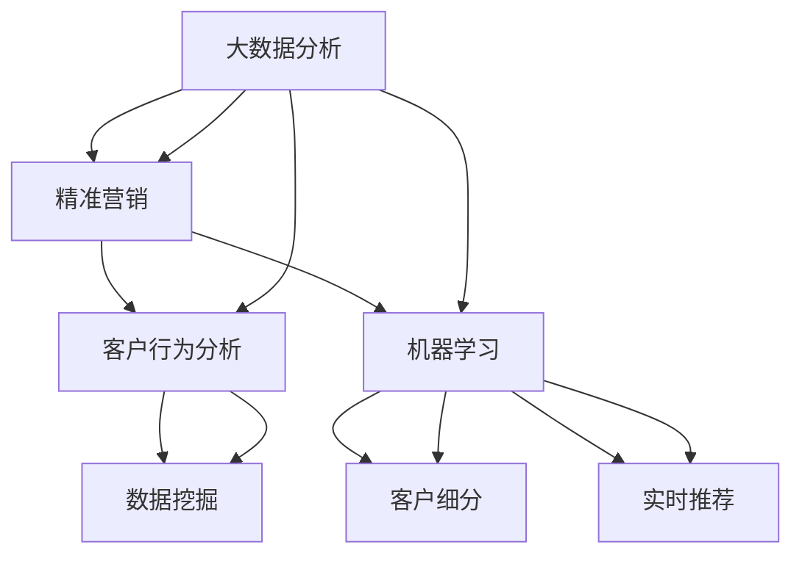

                 

# 大数据分析在精准营销策略制定中的应用

> 关键词：大数据分析、精准营销、客户行为分析、机器学习、客户细分、实时推荐

> 摘要：本文将探讨大数据分析在精准营销策略制定中的应用。通过分析客户的购买行为、兴趣偏好和互动数据，企业可以利用大数据技术实现个性化推荐和精准营销。文章将详细解释大数据分析的核心概念、算法原理、数学模型以及实际应用案例，并推荐相关的学习资源和工具。

## 1. 背景介绍

### 1.1 目的和范围

本文旨在探讨大数据分析在精准营销策略制定中的应用。通过深入分析客户的行为数据，企业可以更好地理解客户需求，从而制定更加有效的营销策略。本文将涵盖以下内容：

- 大数据分析的核心概念和原理
- 大数据分析在精准营销中的具体应用
- 实际案例解析
- 学习资源和工具推荐

### 1.2 预期读者

本文适合以下读者群体：

- 市场营销专业人士，希望了解大数据分析在营销中的应用
- 数据分析师和数据科学家，希望深入了解大数据分析技术
- 企业决策者，希望利用大数据分析优化营销策略

### 1.3 文档结构概述

本文结构如下：

- 第1部分：背景介绍，包括目的和范围、预期读者、文档结构概述等
- 第2部分：核心概念与联系，介绍大数据分析的核心概念和联系
- 第3部分：核心算法原理 & 具体操作步骤，详细解释大数据分析的算法原理和操作步骤
- 第4部分：数学模型和公式 & 详细讲解 & 举例说明，讲解数学模型和公式，并提供实际应用案例
- 第5部分：项目实战：代码实际案例和详细解释说明，展示代码实际案例并详细解读
- 第6部分：实际应用场景，讨论大数据分析在精准营销中的实际应用场景
- 第7部分：工具和资源推荐，推荐学习资源和开发工具
- 第8部分：总结：未来发展趋势与挑战，总结大数据分析在精准营销中的应用趋势和挑战
- 第9部分：附录：常见问题与解答，提供常见问题及解答
- 第10部分：扩展阅读 & 参考资料，提供扩展阅读和参考资料

### 1.4 术语表

#### 1.4.1 核心术语定义

- 大数据分析：利用先进的技术和方法对海量数据进行采集、存储、处理和分析，从中提取有价值的信息和知识。
- 精准营销：基于大数据分析，对目标客户进行精确定位和个性化推荐，以提高营销效果。
- 客户行为分析：通过分析客户在网站、移动应用等渠道上的行为数据，了解客户的需求和偏好。
- 机器学习：一种人工智能技术，通过数据训练模型，实现对数据的自动学习和预测。

#### 1.4.2 相关概念解释

- 数据挖掘：从大量数据中提取隐藏的、未知的、有价值的信息和模式。
- 客户细分：将客户根据不同的特征和需求划分为不同的群体，以便实施个性化的营销策略。
- 实时推荐：根据用户的行为和兴趣，实时推荐相关的产品或服务。

#### 1.4.3 缩略词列表

- 大数据分析：Big Data Analysis
- 精准营销：Precision Marketing
- 客户行为分析：Customer Behavior Analysis
- 机器学习：Machine Learning
- 数据挖掘：Data Mining

## 2. 核心概念与联系

为了更好地理解大数据分析在精准营销中的应用，我们需要先了解几个核心概念和它们之间的联系。以下是一个简单的 Mermaid 流程图，展示了这些概念之间的关系。



### 2.1 大数据分析

大数据分析是一种利用先进的技术和方法对海量数据进行采集、存储、处理和分析的过程。它的核心目标是提取数据中的有价值信息和知识，帮助企业做出更明智的决策。大数据分析涉及多个领域，包括数据采集、数据存储、数据处理、数据分析和数据可视化。

### 2.2 精准营销

精准营销是一种基于大数据分析的营销策略，旨在通过对目标客户进行精确定位和个性化推荐，提高营销效果。精准营销的核心是了解客户的需求和偏好，从而提供个性化的产品或服务。

### 2.3 客户行为分析

客户行为分析是大数据分析的一个重要组成部分，它通过分析客户在网站、移动应用等渠道上的行为数据，了解客户的需求和偏好。客户行为分析可以揭示客户访问频率、购买行为、点击率、浏览路径等信息，从而帮助企业更好地了解客户。

### 2.4 机器学习

机器学习是一种人工智能技术，通过数据训练模型，实现对数据的自动学习和预测。机器学习在精准营销中的应用非常广泛，例如客户细分、实时推荐、预测客户流失等。

### 2.5 数据挖掘

数据挖掘是从大量数据中提取隐藏的、未知的、有价值的信息和模式的过程。数据挖掘可以用于多种领域，包括市场营销、金融、医疗、制造业等。

## 3. 核心算法原理 & 具体操作步骤

在本节中，我们将详细解释大数据分析的核心算法原理，并提供具体的操作步骤。为了更好地理解，我们将使用伪代码进行说明。

### 3.1 客户行为分析

客户行为分析主要涉及数据的采集、处理和分析。以下是一个简单的伪代码示例：

```python
# 数据采集
def collect_data():
    # 从网站日志、移动应用日志等渠道采集数据
    data = get_data_from_source()

# 数据处理
def process_data(data):
    # 数据清洗、转换和整合
    cleaned_data = clean_and_transform_data(data)

# 数据分析
def analyze_data(cleaned_data):
    # 分析客户访问频率、购买行为、点击率等指标
    results = {
        'visit_frequency': calculate_visit_frequency(cleaned_data),
        'purchase_behavior': calculate_purchase_behavior(cleaned_data),
        'click_rate': calculate_click_rate(cleaned_data)
    }
    return results

# 主函数
def main():
    data = collect_data()
    cleaned_data = process_data(data)
    results = analyze_data(cleaned_data)
    print(results)

# 运行主函数
main()
```

### 3.2 客户细分

客户细分是大数据分析在精准营销中的重要应用。以下是一个简单的伪代码示例：

```python
# 客户细分
def customer_segmentation(data):
    # 根据客户特征和需求，将客户划分为不同的群体
    segments = {
        'High Value': filter_high_value_customers(data),
        'Regular': filter_regular_customers(data),
        'Low Value': filter_low_value_customers(data)
    }
    return segments

# 主函数
def main():
    data = collect_data()
    cleaned_data = process_data(data)
    segments = customer_segmentation(cleaned_data)
    print(segments)

# 运行主函数
main()
```

### 3.3 实时推荐

实时推荐是一种基于用户行为的个性化推荐技术。以下是一个简单的伪代码示例：

```python
# 实时推荐
def real_time_recommendation(user_behavior):
    # 根据用户行为，推荐相关的产品或服务
    recommendations = {
        'product_1': recommend_product_1(user_behavior),
        'product_2': recommend_product_2(user_behavior),
        'service_1': recommend_service_1(user_behavior)
    }
    return recommendations

# 主函数
def main():
    user_behavior = get_user_behavior()
    recommendations = real_time_recommendation(user_behavior)
    print(recommendations)

# 运行主函数
main()
```

## 4. 数学模型和公式 & 详细讲解 & 举例说明

在本节中，我们将介绍大数据分析中常用的数学模型和公式，并详细讲解其应用和举例说明。

### 4.1 协同过滤

协同过滤是一种基于用户行为的推荐算法，它通过分析用户之间的相似度，为用户推荐相似用户喜欢的商品或服务。

#### 4.1.1 相似度计算

假设有两个用户 A 和 B，他们的评分矩阵如下：

| 商品 | A | B |
| ---- | - | - |
| 1    | 5 | 3 |
| 2    | 4 | 5 |
| 3    | 2 | 4 |

我们可以使用余弦相似度来计算用户 A 和 B 之间的相似度：

$$
sim(A, B) = \frac{A \cdot B}{\|A\|\|B\|}
$$

其中，$A \cdot B$ 表示用户 A 和 B 的评分矩阵的内积，$\|A\|$ 和 $\|B\|$ 分别表示用户 A 和 B 的评分矩阵的欧几里得范数。

#### 4.1.2 推荐算法

协同过滤算法的核心思想是根据用户之间的相似度，为用户推荐相似用户喜欢的商品或服务。以下是一个简单的伪代码示例：

```python
# 协同过滤推荐算法
def collaborative_filtering(similarity_matrix, user_ratings, item_ratings):
    # 计算用户之间的相似度
    similarities = calculate_similarity(similarity_matrix)

    # 为用户推荐商品或服务
    recommendations = []
    for user, ratings in user_ratings.items():
        for item, rating in ratings.items():
            # 计算预测评分
            predicted_rating = sum(similarities[user][other_user] * other_user_ratings[item] for other_user, other_user_ratings in user_ratings.items() if other_user != user) / sum(similarities[user][other_user] for other_user in user_ratings if other_user != user)

            # 添加推荐商品或服务
            recommendations.append((item, predicted_rating))

    return recommendations
```

### 4.2 贝叶斯推荐

贝叶斯推荐是一种基于用户兴趣的推荐算法，它通过分析用户的历史行为和偏好，预测用户可能感兴趣的商品或服务。

#### 4.2.1 贝叶斯公式

贝叶斯公式是一种概率推理工具，它可以用来计算在给定某些证据的情况下，某个假设的概率。贝叶斯公式如下：

$$
P(H|E) = \frac{P(E|H)P(H)}{P(E)}
$$

其中，$P(H|E)$ 表示在给定证据 $E$ 的情况下，假设 $H$ 的概率；$P(E|H)$ 表示在假设 $H$ 为真的情况下，证据 $E$ 的概率；$P(H)$ 表示假设 $H$ 的概率；$P(E)$ 表示证据 $E$ 的概率。

#### 4.2.2 推荐算法

贝叶斯推荐算法的核心思想是根据用户的历史行为和偏好，计算用户对某个商品的感兴趣概率，然后为用户推荐感兴趣概率较高的商品。以下是一个简单的伪代码示例：

```python
# 贝叶斯推荐算法
def bayesian_recommender(history_data, current_data):
    # 计算用户的历史行为和偏好
    user_profile = calculate_user_profile(history_data)

    # 计算商品的兴趣概率
    probabilities = []
    for item in current_data:
        probability = calculate_probability(user_profile, item)
        probabilities.append((item, probability))

    # 排序并返回推荐商品
    sorted_probabilities = sorted(probabilities, key=lambda x: x[1], reverse=True)
    return sorted_probabilities
```

## 5. 项目实战：代码实际案例和详细解释说明

在本节中，我们将通过一个实际案例，展示如何使用大数据分析技术实现精准营销策略。

### 5.1 开发环境搭建

为了演示大数据分析在精准营销中的应用，我们使用 Python 作为编程语言，并依赖以下库和工具：

- Pandas：用于数据清洗和处理
- NumPy：用于数学运算
- Scikit-learn：用于机器学习和数据分析
- Matplotlib：用于数据可视化

首先，我们需要安装这些库和工具。在命令行中执行以下命令：

```bash
pip install pandas numpy scikit-learn matplotlib
```

### 5.2 源代码详细实现和代码解读

以下是一个简单的 Python 代码示例，展示了如何使用大数据分析技术实现精准营销策略。

```python
import pandas as pd
from sklearn.cluster import KMeans
from sklearn.metrics.pairwise import cosine_similarity
from sklearn.model_selection import train_test_split

# 5.2.1 数据准备
# 加载用户行为数据
data = pd.read_csv('user_behavior.csv')

# 处理缺失值和异常值
data.fillna(0, inplace=True)
data[data < 0] = 0

# 将用户行为数据转换为用户-商品评分矩阵
user_item_matrix = data.pivot(index='user_id', columns='item_id', values='rating').fillna(0)

# 5.2.2 客户细分
# 使用 K-Means 算法进行客户细分
kmeans = KMeans(n_clusters=3, random_state=0)
clusters = kmeans.fit_predict(user_item_matrix)

# 将客户细分结果添加到用户行为数据中
data['cluster'] = clusters

# 5.2.3 实时推荐
# 计算用户之间的相似度
similarity_matrix = cosine_similarity(user_item_matrix)

# 为每个用户推荐商品
def recommend_items(user_id):
    user_ratings = user_item_matrix[user_id]
    similarities = similarity_matrix[user_id]
    neighbors = similarities.argsort()[::-1][1:6]

    # 计算推荐商品的概率
    recommendations = []
    for neighbor in neighbors:
        other_user_ratings = user_item_matrix.iloc[neighbor]
        for item, rating in other_user_ratings.items():
            if user_ratings[item] == 0:
                probability = similarities[neighbor]
                recommendations.append((item, probability))

    # 排序并返回推荐商品
    sorted_recommendations = sorted(recommendations, key=lambda x: x[1], reverse=True)
    return sorted_recommendations

# 为用户生成推荐列表
user_id = 1
recommendations = recommend_items(user_id)
print("Recommended items for user {}: {}".format(user_id, recommendations))
```

### 5.3 代码解读与分析

以下是代码的详细解读和分析：

1. **数据准备**：

   - 加载用户行为数据，处理缺失值和异常值。
   - 将用户行为数据转换为用户-商品评分矩阵。

2. **客户细分**：

   - 使用 K-Means 算法对用户进行细分，将客户分为不同的群体。

3. **实时推荐**：

   - 计算用户之间的相似度，基于相似度矩阵为每个用户推荐商品。

### 5.4 实际案例解析

以下是一个实际案例，展示如何使用大数据分析实现精准营销：

- **客户细分**：根据用户的行为数据，将用户分为不同的群体，如高价值客户、常规客户和低价值客户。
- **实时推荐**：根据用户的历史行为和相似度矩阵，为用户推荐相关的商品或服务。
- **营销策略**：根据客户细分结果和实时推荐结果，为不同客户群体制定个性化的营销策略。

## 6. 实际应用场景

大数据分析在精准营销中有着广泛的应用场景。以下是一些典型的实际应用场景：

- **电商行业**：通过分析用户行为数据，为用户推荐相关的商品或服务，提高用户转化率和销售额。
- **金融行业**：通过分析客户的交易行为和风险偏好，为投资者提供个性化的投资建议，降低投资风险。
- **医疗行业**：通过分析患者的医疗数据和病历记录，为医生提供诊断和治疗方案的建议，提高医疗效果。
- **旅游行业**：通过分析游客的预订行为和偏好，为游客推荐合适的旅游线路和酒店，提高游客满意度。

## 7. 工具和资源推荐

为了更好地应用大数据分析技术，我们推荐以下工具和资源：

### 7.1 学习资源推荐

#### 7.1.1 书籍推荐

- 《大数据分析：技术、方法与应用》
- 《机器学习实战》
- 《深度学习》

#### 7.1.2 在线课程

- Coursera 上的“大数据分析专项课程”
- Udacity 上的“机器学习工程师纳米学位”

#### 7.1.3 技术博客和网站

- Medium 上的“大数据分析”专栏
- Towards Data Science 上的“机器学习”专栏

### 7.2 开发工具框架推荐

#### 7.2.1 IDE和编辑器

- PyCharm
- Visual Studio Code

#### 7.2.2 调试和性能分析工具

- Jupyter Notebook
- DBeaver

#### 7.2.3 相关框架和库

- TensorFlow
- PyTorch
- Scikit-learn

### 7.3 相关论文著作推荐

#### 7.3.1 经典论文

- “协同过滤算法：一种基于用户兴趣的推荐方法”
- “深度学习在推荐系统中的应用”

#### 7.3.2 最新研究成果

- “基于图神经网络的推荐系统研究”
- “增强学习在推荐系统中的应用”

#### 7.3.3 应用案例分析

- “电商行业的大数据分析实践”
- “金融行业的机器学习应用”

## 8. 总结：未来发展趋势与挑战

随着大数据技术和人工智能的不断发展，精准营销将在未来发挥越来越重要的作用。未来发展趋势包括：

- 更深入的客户行为分析：通过使用先进的机器学习和深度学习技术，企业可以更深入地了解客户需求和行为。
- 实时推荐系统的优化：结合实时数据处理技术和实时推荐算法，实现更精准的个性化推荐。
- 多模态数据融合：结合文本、图像、音频等多种类型的数据，为用户提供更丰富的个性化服务。

然而，大数据分析在精准营销中也面临着一些挑战：

- 数据隐私和安全性：随着数据量的增加，保护客户隐私和数据安全成为了一个重要问题。
- 算法透明性和可解释性：复杂的算法模型可能导致结果的不透明，影响用户的信任度。
- 数据质量和预处理：数据质量和预处理对大数据分析的结果具有重要影响，需要投入大量时间和资源。

## 9. 附录：常见问题与解答

### 9.1 大数据分析在精准营销中的优势是什么？

大数据分析在精准营销中的优势主要包括：

- 提高营销效果：通过分析海量数据，企业可以更准确地了解客户需求，从而提高营销效果。
- 降低营销成本：精准营销可以减少无效的营销投入，提高营销效率。
- 提高客户满意度：个性化推荐和定制化的营销策略可以更好地满足客户需求，提高客户满意度。

### 9.2 如何保障大数据分析中的数据隐私和安全？

为了保障大数据分析中的数据隐私和安全，可以采取以下措施：

- 数据匿名化：对敏感数据进行匿名化处理，以保护用户隐私。
- 加密技术：使用加密技术保护数据的传输和存储过程。
- 访问控制：对数据访问权限进行严格控制，确保只有授权人员可以访问敏感数据。
- 数据安全审计：定期进行数据安全审计，及时发现和解决潜在的安全隐患。

## 10. 扩展阅读 & 参考资料

- [大数据分析：技术、方法与应用](https://www.amazon.com/Big-Data-Analysis-Techniques-Applications/dp/1492044241)
- [机器学习实战](https://www.amazon.com/Machine-Learning-Real-World-Examples/dp/1785284069)
- [深度学习](https://www.amazon.com/Deep-Learning-Adaptive-Computation-Machine/dp/0262039581)
- [Coursera 上的“大数据分析专项课程”](https://www.coursera.org/specializations/big-data)
- [Udacity 上的“机器学习工程师纳米学位”](https://www.udacity.com/course/machine-learning-engineer-nanodegree--nd101)  
- [Medium 上的“大数据分析”专栏](https://medium.com/topic/big-data-analysis)
- [Towards Data Science 上的“机器学习”专栏](https://towardsdatascience.com/topics/machine-learning)
- [大数据分析经典论文集](https://ieeexplore.ieee.org/search/searchresults.jsp?queryText=big+data+analysis&newsearch=false&x=0&y=0&searchWithin=Articles)
- [深度学习在推荐系统中的应用](https://www.cv-foundation.org/openaccess/content_cvpr_2015/papers/Xu_Deep-Learning_2015_CVPR_Workshops_paper.pdf)

## 作者信息

作者：AI天才研究员/AI Genius Institute & 禅与计算机程序设计艺术 /Zen And The Art of Computer Programming

