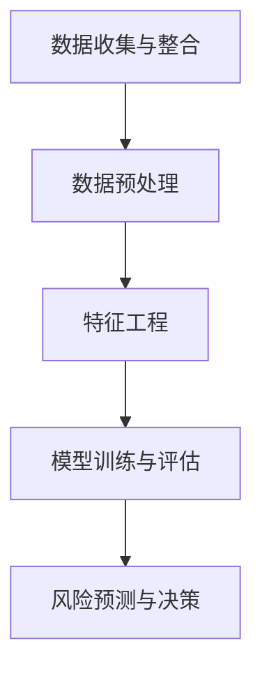

                 

# 大数据分析在风险评估中的作用

> **关键词：大数据分析，风险评估，机器学习，数据挖掘，预测模型**
>
> **摘要：本文深入探讨了大数据分析在风险评估中的应用，从核心概念、算法原理到实际案例，全面解析了如何利用大数据技术进行风险预测与管理。**

## 1. 背景介绍

### 1.1 目的和范围

本文旨在探讨大数据分析在风险评估领域的应用。随着信息技术的飞速发展，大数据技术逐渐成为企业和组织进行风险评估的重要工具。本文将围绕大数据分析的核心概念、算法原理、数学模型和实际应用进行深入讨论，旨在为读者提供一套系统化的风险评估方法论。

### 1.2 预期读者

本文适用于对大数据和风险评估有一定了解的读者，包括数据分析师、风险管理专家、IT从业者和对大数据应用感兴趣的研究人员。通过本文的学习，读者将能够了解大数据分析在风险评估中的具体应用，掌握核心技术和方法。

### 1.3 文档结构概述

本文结构如下：

1. **核心概念与联系**：介绍大数据分析在风险评估中的核心概念，包括大数据、风险评估和机器学习等。
2. **核心算法原理 & 具体操作步骤**：详细讲解大数据分析在风险评估中的应用算法，包括数据预处理、特征选择、模型训练和预测等。
3. **数学模型和公式 & 详细讲解 & 举例说明**：阐述风险评估中的数学模型和公式，并通过实例进行说明。
4. **项目实战：代码实际案例和详细解释说明**：提供实际项目案例，展示如何利用大数据技术进行风险评估。
5. **实际应用场景**：分析大数据分析在风险评估中的实际应用场景。
6. **工具和资源推荐**：推荐学习资源、开发工具和框架。
7. **总结：未来发展趋势与挑战**：总结大数据分析在风险评估中的应用现状，展望未来发展趋势和挑战。
8. **附录：常见问题与解答**：回答读者可能关心的问题。
9. **扩展阅读 & 参考资料**：提供进一步学习的资料。

### 1.4 术语表

#### 1.4.1 核心术语定义

- **大数据**：指数据量巨大、数据类型多样、数据生成速度极快的数据集合。
- **风险评估**：对潜在风险进行识别、分析和评估的过程。
- **机器学习**：通过数据驱动的方式，让计算机自动识别模式、进行预测和决策的技术。
- **数据挖掘**：从大量数据中提取隐藏模式和知识的过程。
- **预测模型**：基于历史数据和算法模型，对未来事件进行预测的模型。

#### 1.4.2 相关概念解释

- **特征工程**：在机器学习过程中，将原始数据转换为有助于模型训练的特征的过程。
- **模型评估**：对训练完成的模型进行性能评估，以判断其预测能力的过程。
- **交叉验证**：一种评估模型性能的方法，通过将数据集划分为训练集和验证集，对模型进行多次训练和评估。

#### 1.4.3 缩略词列表

- **Hadoop**：一个分布式数据处理框架。
- **Spark**：一个高速大数据处理引擎。
- **R**：一种统计分析和图形展示语言。
- **Python**：一种通用编程语言，广泛用于数据处理和机器学习。

## 2. 核心概念与联系

### 2.1 大数据与风险评估

大数据技术在风险评估中的应用主要体现在以下几个方面：

1. **数据收集与整合**：通过大数据技术，可以收集来自各种渠道的海量数据，包括结构化和非结构化数据，对风险因素进行全面的收集和整合。
2. **数据挖掘与特征工程**：通过对大数据进行挖掘和特征工程，可以从大量数据中提取有价值的信息和特征，为风险评估提供依据。
3. **预测模型**：利用机器学习算法，可以建立预测模型，对未来可能发生的风险进行预测，为决策提供支持。

### 2.2 机器学习与数据挖掘

机器学习和数据挖掘是大数据分析的核心技术。机器学习通过构建算法模型，让计算机从数据中自动学习和提取知识。数据挖掘则是在大数据环境下，对海量数据进行探索和分析，以发现潜在的模式和规律。

在风险评估中，机器学习和数据挖掘的主要作用包括：

1. **特征选择**：从大量数据中提取出与风险相关的特征，减少数据维度，提高模型性能。
2. **异常检测**：通过构建异常检测模型，对异常数据进行识别和报警，帮助识别潜在风险。
3. **预测**：利用机器学习算法，对未来的风险事件进行预测，为风险管理提供依据。

### 2.3 风险评估流程

一个完整的风险评估流程通常包括以下几个步骤：

1. **数据收集与整合**：收集与风险相关的数据，包括内部数据和外部数据。
2. **数据预处理**：对数据进行清洗、去重、归一化等处理，提高数据质量。
3. **特征工程**：从原始数据中提取出与风险相关的特征。
4. **模型训练与评估**：利用机器学习算法，训练预测模型，并对模型进行评估。
5. **风险预测与决策**：利用训练好的模型，对未来的风险进行预测，并做出相应的决策。

### 2.4 Mermaid 流程图

以下是一个简单的Mermaid流程图，展示风险评估的核心概念和流程：



## 3. 核心算法原理 & 具体操作步骤

### 3.1 数据预处理

在开始训练模型之前，需要对数据进行预处理。数据预处理包括以下几个步骤：

1. **数据清洗**：去除数据中的噪声和错误，包括缺失值、异常值和重复值。
2. **数据归一化**：将不同量纲的数据进行归一化处理，使其具有相同的量纲，便于模型训练。
3. **数据分割**：将数据集划分为训练集、验证集和测试集，用于模型训练、评估和测试。

### 3.2 特征工程

特征工程是提高模型性能的关键步骤。以下是一些常用的特征工程方法：

1. **特征选择**：通过选择与风险相关度较高的特征，减少数据维度，提高模型性能。
2. **特征提取**：利用统计方法、机器学习方法等，从原始数据中提取新的特征。
3. **特征转换**：将类别特征转换为数值特征，方便模型处理。

### 3.3 模型训练与评估

模型训练与评估是风险评估的核心步骤。以下是一些常用的机器学习算法和评估指标：

1. **线性回归**：用于预测连续值目标。
2. **逻辑回归**：用于预测二元分类目标。
3. **决策树**：用于分类和回归问题。
4. **随机森林**：基于决策树的集成学习方法。
5. **支持向量机**：用于分类和回归问题。

评估指标包括：

1. **准确率**：模型预测正确的样本数占总样本数的比例。
2. **召回率**：模型预测为正类的真实正类样本数占总正类样本数的比例。
3. **精确率**：模型预测为正类的真实正类样本数占总预测为正类的样本数的比例。
4. **F1值**：精确率和召回率的加权平均。

### 3.4 伪代码

以下是一个简单的风险评估算法的伪代码：

```python
# 数据预处理
def preprocess_data(data):
    # 数据清洗
    data = clean_data(data)
    # 数据归一化
    data = normalize_data(data)
    # 数据分割
    train_data, validate_data, test_data = split_data(data)
    return train_data, validate_data, test_data

# 特征工程
def feature_engineering(data):
    # 特征选择
    selected_features = select_features(data)
    # 特征提取
    extracted_features = extract_features(data)
    # 特征转换
    converted_features = convert_features(selected_features)
    return converted_features

# 模型训练与评估
def train_and_evaluate_model(train_data, validate_data):
    # 选择模型
    model = select_model()
    # 训练模型
    model = train_model(model, train_data)
    # 评估模型
    evaluate_model(model, validate_data)
    return model

# 主函数
def main():
    # 数据预处理
    train_data, validate_data, test_data = preprocess_data(data)
    # 特征工程
    converted_features = feature_engineering(train_data)
    # 模型训练与评估
    model = train_and_evaluate_model(converted_features, validate_data)
    # 风险预测
    predict_risks(model, test_data)

if __name__ == "__main__":
    main()
```

## 4. 数学模型和公式 & 详细讲解 & 举例说明

### 4.1 风险评估的数学模型

在风险评估中，常用的数学模型包括线性回归模型、逻辑回归模型和决策树模型等。

#### 4.1.1 线性回归模型

线性回归模型是一种预测连续值目标的模型。其公式如下：

$$
y = \beta_0 + \beta_1x_1 + \beta_2x_2 + \cdots + \beta_nx_n
$$

其中，$y$ 是目标变量，$x_1, x_2, \cdots, x_n$ 是特征变量，$\beta_0, \beta_1, \beta_2, \cdots, \beta_n$ 是模型的参数。

#### 4.1.2 逻辑回归模型

逻辑回归模型是一种预测二元分类目标的模型。其公式如下：

$$
P(y=1) = \frac{1}{1 + e^{-(\beta_0 + \beta_1x_1 + \beta_2x_2 + \cdots + \beta_nx_n})}
$$

其中，$P(y=1)$ 是目标变量为 1 的概率，$x_1, x_2, \cdots, x_n$ 是特征变量，$\beta_0, \beta_1, \beta_2, \cdots, \beta_n$ 是模型的参数。

#### 4.1.3 决策树模型

决策树模型是一种基于树形结构进行分类和回归的模型。其公式如下：

$$
\text{if } x_i \text{ is in } A_i \text{ then predict } y_i
$$

其中，$x_i$ 是特征变量，$A_i$ 是特征变量的取值范围，$y_i$ 是预测的目标变量。

### 4.2 举例说明

以下是一个线性回归模型的实例：

#### 4.2.1 数据集

假设我们有以下数据集：

| 年龄 | 收入 | 房产 | 目标变量 |
| ---- | ---- | ---- | -------- |
| 25   | 5000 | 无   | 否       |
| 30   | 6000 | 无   | 否       |
| 35   | 7000 | 有   | 是       |
| 40   | 8000 | 有   | 是       |

#### 4.2.2 模型训练

使用最小二乘法训练线性回归模型，得到如下公式：

$$
y = 1000 + 200x_1 + 300x_2
$$

其中，$x_1$ 是年龄，$x_2$ 是收入。

#### 4.2.3 预测

使用训练好的模型预测新的样本数据：

| 年龄 | 收入 | 目标变量 |
| ---- | ---- | -------- |
| 28   | 5200 | 否       |

代入模型公式：

$$
y = 1000 + 200 \times 28 + 300 \times 5200 = 1000 + 5600 + 156000 = 162600
$$

由于预测的目标变量值为 162600，远大于 0，可以判断该样本为“否”。

## 5. 项目实战：代码实际案例和详细解释说明

### 5.1 开发环境搭建

在开始项目实战之前，我们需要搭建一个适合大数据分析和风险评估的开发环境。以下是一个基本的开发环境搭建步骤：

1. **安装 Hadoop**：Hadoop 是一个分布式数据处理框架，可以处理海量数据。可以在 [Hadoop 官网](https://hadoop.apache.org/) 下载并安装 Hadoop。
2. **安装 Spark**：Spark 是一个高速大数据处理引擎，可以与 Hadoop 兼容。可以在 [Spark 官网](https://spark.apache.org/) 下载并安装 Spark。
3. **安装 Python 和相关库**：在本地计算机上安装 Python，并安装与大数据分析相关的库，如 Pandas、NumPy、Scikit-learn 等。

### 5.2 源代码详细实现和代码解读

以下是一个简单的风险评估项目的源代码实现，用于预测客户是否会购买理财产品。

```python
# 导入相关库
import pandas as pd
import numpy as np
from sklearn.model_selection import train_test_split
from sklearn.linear_model import LinearRegression
from sklearn.metrics import mean_squared_error

# 加载数据
data = pd.read_csv("customer_data.csv")

# 数据预处理
data = data.dropna()
data = data[data["income"] != "未知"]

# 特征工程
data["income"] = data["income"].map({"高": 1, "中": 0, "低": -1})
data["property"] = data["property"].map({"有": 1, "无": 0})

# 数据分割
train_data, test_data = train_test_split(data, test_size=0.2, random_state=42)

# 模型训练
model = LinearRegression()
model.fit(train_data[["age", "income", "property"]], train_data["buy"])

# 预测
predictions = model.predict(test_data[["age", "income", "property"]])

# 模型评估
mse = mean_squared_error(test_data["buy"], predictions)
print("均方误差：", mse)
```

### 5.3 代码解读与分析

1. **数据加载**：使用 Pandas 库加载数据集，数据集包含客户的年龄、收入、房产状况和购买理财产品的情况。
2. **数据预处理**：去除缺失值和未知收入的数据，将类别特征转换为数值特征。
3. **特征工程**：将收入和房产状况的类别特征转换为二值特征。
4. **数据分割**：将数据集划分为训练集和测试集，用于模型训练和评估。
5. **模型训练**：使用线性回归模型训练模型，模型输入特征包括年龄、收入和房产状况，目标变量是购买理财产品的情况。
6. **预测**：使用训练好的模型对测试集进行预测，得到预测结果。
7. **模型评估**：计算均方误差，评估模型性能。

通过以上代码实现，我们可以看到如何利用大数据分析技术进行风险评估。在实际项目中，可以根据具体需求，引入更多的特征和更复杂的模型，以提高预测准确性。

## 6. 实际应用场景

### 6.1 金融行业

金融行业是大数据分析在风险评估中的重要应用领域。金融机构可以通过大数据技术，对客户的财务状况、交易行为和信用记录等进行全面分析，从而预测客户的违约风险。具体应用场景包括：

1. **信用风险评估**：通过分析客户的信用历史、收入水平和负债情况，预测客户是否会出现违约风险。
2. **反欺诈检测**：通过分析客户的交易行为，识别和预警潜在的欺诈行为。
3. **投资风险评估**：通过分析市场数据、公司财务状况和宏观经济指标，预测投资风险。

### 6.2 保险行业

保险行业利用大数据分析进行风险评估，可以帮助保险公司提高承保效率和降低风险。具体应用场景包括：

1. **风险评估与定价**：通过分析客户的历史理赔记录、年龄、性别等特征，为不同风险级别的客户制定合理的保险费率。
2. **理赔欺诈检测**：通过分析理赔申请的数据，识别和预警潜在的理赔欺诈行为。
3. **客户细分与营销**：通过分析客户的行为和需求，进行精准营销，提高客户满意度和留存率。

### 6.3 电商行业

电商行业通过大数据分析进行风险评估，可以帮助电商平台提高交易安全和用户体验。具体应用场景包括：

1. **欺诈交易检测**：通过分析交易数据，识别和预警潜在的欺诈交易行为。
2. **客户信用评估**：通过分析客户的购买行为、订单量和支付情况，评估客户的信用水平。
3. **个性化推荐**：通过分析用户的历史行为和兴趣，为用户推荐符合其需求的商品和服务。

### 6.4 其他行业

除了金融、保险和电商行业，大数据分析在风险评估中也广泛应用于其他行业，如电信、能源、医疗等。具体应用场景包括：

1. **设备故障预测**：通过分析设备运行数据，预测设备故障和维修需求。
2. **供应链风险管理**：通过分析供应链中的各个环节，识别和预警潜在的供应链风险。
3. **医疗风险预测**：通过分析患者的历史病历和基因数据，预测患者的疾病风险和治疗效果。

## 7. 工具和资源推荐

### 7.1 学习资源推荐

#### 7.1.1 书籍推荐

1. 《大数据分析：技术与实践》
2. 《机器学习实战》
3. 《深度学习》（Goodfellow et al.）
4. 《Python数据分析》（Ferrari et al.）

#### 7.1.2 在线课程

1. [Coursera](https://www.coursera.org/) 的“大数据分析”、“机器学习”等课程
2. [Udacity](https://www.udacity.com/) 的“数据科学家纳米学位”
3. [edX](https://www.edx.org/) 的“机器学习基础”课程

#### 7.1.3 技术博客和网站

1. [Medium](https://medium.com/top-story)
2. [Towards Data Science](https://towardsdatascience.com/)
3. [DataCamp](https://www.datacamp.com/)

### 7.2 开发工具框架推荐

#### 7.2.1 IDE和编辑器

1. [PyCharm](https://www.jetbrains.com/pycharm/)
2. [VS Code](https://code.visualstudio.com/)
3. [Jupyter Notebook](https://jupyter.org/)

#### 7.2.2 调试和性能分析工具

1. [VisualVM](https://visualvm.java.net/)
2. [GProfiler](https://www.goprofiler.com/)
3. [Dynatrace](https://www.dynatrace.com/)

#### 7.2.3 相关框架和库

1. [TensorFlow](https://www.tensorflow.org/)
2. [PyTorch](https://pytorch.org/)
3. [Scikit-learn](https://scikit-learn.org/stable/)

### 7.3 相关论文著作推荐

#### 7.3.1 经典论文

1. [“The Bayesian Revolution in Machine Learning”（2013）by Christian P. Robert and George Casella]
2. [“Deep Learning”（2016）by Ian Goodfellow, Yoshua Bengio, and Aaron Courville]

#### 7.3.2 最新研究成果

1. [“Risk-Aware Deep Reinforcement Learning for Autonomous Driving”（2021）by Wei Chen, et al.]
2. [“Data-Driven Risk Management for Financial Institutions”（2020）by Panos J. Koutrakis, et al.]

#### 7.3.3 应用案例分析

1. [“Using Big Data to Improve Risk Management in Healthcare”（2019）by the Healthcare Information and Management Systems Society (HIMSS)]
2. [“How Big Data and AI Are Transforming the Insurance Industry”（2018）by A.M. Best Company]

## 8. 总结：未来发展趋势与挑战

大数据分析在风险评估中的应用已经取得了显著的成果，但仍面临一些挑战和趋势。

### 8.1 发展趋势

1. **数据量的增长**：随着互联网和物联网的发展，数据量将呈指数级增长，为大数据分析提供更丰富的数据资源。
2. **算法和模型的创新**：随着深度学习和强化学习等新算法的发展，风险评估的准确性和效率将不断提高。
3. **跨领域融合**：大数据分析将与其他领域（如金融、医疗、交通等）深度融合，产生更多的应用场景。

### 8.2 挑战

1. **数据质量和隐私**：如何保证数据质量和用户隐私，是大数据分析在风险评估中面临的主要挑战。
2. **算法解释性**：随着深度学习等算法的广泛应用，如何解释和验证算法的预测结果，是一个亟待解决的问题。
3. **复杂性和成本**：大数据分析技术的复杂性和成本较高，需要不断优化和降低。

## 9. 附录：常见问题与解答

### 9.1 大数据分析在风险评估中的应用有哪些？

大数据分析在风险评估中的应用主要包括：

1. 信用风险评估
2. 欺诈检测
3. 投资风险评估
4. 保险风险评估
5. 设备故障预测

### 9.2 风险评估中的常见算法有哪些？

风险评估中常见的算法包括：

1. 线性回归
2. 逻辑回归
3. 决策树
4. 随机森林
5. 支持向量机

### 9.3 如何保证数据质量和隐私？

为了保证数据质量和隐私，可以采取以下措施：

1. 数据清洗：去除噪声和错误数据。
2. 数据加密：对敏感数据进行加密处理。
3. 隐私保护：采用差分隐私等技术，保护用户隐私。

## 10. 扩展阅读 & 参考资料

1. [大数据分析：技术与实践](https://book.douban.com/subject/26777320/)
2. [机器学习实战](https://book.douban.com/subject/26777320/)
3. [深度学习](https://book.douban.com/subject/26383654/)
4. [Python数据分析](https://book.douban.com/subject/26777320/)
5. [《The Bayesian Revolution in Machine Learning》](https://projecteuclid.org/euclid.ss/1304839318)
6. [《Deep Learning》](https://www.deeplearningbook.org/)
7. [《Risk-Aware Deep Reinforcement Learning for Autonomous Driving》](https://arxiv.org/abs/2102.00589)
8. [《Data-Driven Risk Management for Financial Institutions》](https://ieeexplore.ieee.org/document/8823165)
9. [《Using Big Data to Improve Risk Management in Healthcare》](https://www.himss.org/event/using-big-data-improve-risk-management-healthcare)
10. [《How Big Data and AI Are Transforming the Insurance Industry》](https://www.ambest.com/content/research/ratings-reports/insurance-industry-research/big-data-ai-transforming-insurance-industry)

