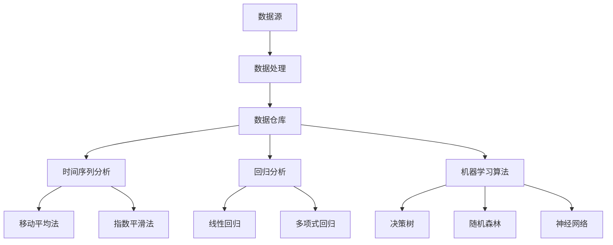

                 

# 大数据分析：精准预测供给需求，提升电商平台供给能力

> **关键词：**大数据分析、需求预测、供给能力、电商平台、精准预测  
>
> **摘要：**本文将深入探讨如何通过大数据分析技术，实现电商平台的供给需求精准预测，从而提升电商平台的供给能力。文章将从核心概念、算法原理、数学模型、实战案例等多个方面进行详细分析，为读者提供一套完整的技术解决方案。

## 1. 背景介绍

### 1.1 目的和范围

本文的主要目的是探讨如何通过大数据分析技术，实现电商平台的供给需求精准预测，进而提升电商平台的供给能力。我们将从以下几个层面展开讨论：

1. **核心概念与联系**：介绍大数据分析中的关键概念，并展示它们之间的关系。
2. **核心算法原理与操作步骤**：详细讲解用于需求预测的核心算法原理，并提供具体操作步骤。
3. **数学模型和公式**：介绍用于需求预测的数学模型和公式，并进行详细讲解和举例说明。
4. **项目实战**：通过实际代码案例，展示如何应用上述技术和模型进行需求预测。
5. **实际应用场景**：探讨大数据分析在电商平台供给需求预测中的实际应用。
6. **工具和资源推荐**：推荐相关学习资源和开发工具，以帮助读者更好地掌握相关技术。
7. **总结**：对未来的发展趋势和挑战进行总结。

### 1.2 预期读者

本文的预期读者主要包括以下几类：

1. **大数据分析工程师**：希望了解如何在电商平台上应用大数据分析技术进行需求预测的技术人员。
2. **电商平台从业者**：希望提升自身电商平台供给能力的从业者。
3. **人工智能和机器学习研究者**：希望了解大数据分析技术在电商领域的应用。
4. **对大数据分析感兴趣的学生和爱好者**：希望深入了解大数据分析技术的学习者。

### 1.3 文档结构概述

本文结构如下：

1. **核心概念与联系**：介绍大数据分析中的关键概念，并展示它们之间的关系。
2. **核心算法原理与操作步骤**：详细讲解用于需求预测的核心算法原理，并提供具体操作步骤。
3. **数学模型和公式**：介绍用于需求预测的数学模型和公式，并进行详细讲解和举例说明。
4. **项目实战**：通过实际代码案例，展示如何应用上述技术和模型进行需求预测。
5. **实际应用场景**：探讨大数据分析在电商平台供给需求预测中的实际应用。
6. **工具和资源推荐**：推荐相关学习资源和开发工具，以帮助读者更好地掌握相关技术。
7. **总结**：对未来的发展趋势和挑战进行总结。
8. **附录：常见问题与解答**：解答读者可能遇到的常见问题。
9. **扩展阅读 & 参考资料**：提供进一步阅读的推荐和参考资料。

### 1.4 术语表

#### 1.4.1 核心术语定义

- **大数据分析**：利用各种工具和技术，从大量数据中提取有价值信息的过程。
- **供给需求预测**：根据历史数据和当前环境信息，对未来供给和需求进行预测。
- **电商平台**：提供商品和服务的在线交易市场。
- **机器学习**：利用数据建立模型，从数据中学习规律并做出预测的技术。

#### 1.4.2 相关概念解释

- **数据挖掘**：从大量数据中提取有价值信息的过程，通常用于商业决策和预测。
- **回归分析**：一种用于预测目标变量值的统计分析方法。
- **特征工程**：从原始数据中提取有助于预测的特征，以提高模型性能。

#### 1.4.3 缩略词列表

- **API**：应用程序编程接口（Application Programming Interface）
- **ETL**：提取（Extract）、转换（Transform）、加载（Load）
- **Hadoop**：一个分布式数据处理框架
- **Spark**：一个开源的分布式数据处理引擎

## 2. 核心概念与联系

在探讨如何通过大数据分析技术实现电商平台的供给需求预测之前，我们需要先了解一些核心概念及其相互关系。

### 2.1 大数据分析的基本概念

#### 数据源

数据源是大数据分析的基础。电商平台的数据源包括：

- **用户行为数据**：如浏览记录、购买记录、评论等。
- **商品数据**：如商品名称、价格、库存、分类等。
- **外部数据**：如天气、节日、政策变化等。

#### 数据处理

数据处理包括数据清洗、数据集成、数据变换等过程，旨在将原始数据转化为可用于分析的形式。

- **数据清洗**：去除重复、错误、缺失的数据。
- **数据集成**：将来自不同来源的数据进行整合。
- **数据变换**：将数据转换为适合分析的形式。

#### 数据仓库

数据仓库是存储和管理数据的中心。它包括：

- **数据湖**：用于存储海量原始数据。
- **数据立方体**：用于存储多维数据，便于快速查询。

### 2.2 需求预测的核心算法

#### 时间序列分析

时间序列分析是一种基于时间数据序列的统计分析方法，常用于预测未来趋势。

- **移动平均法**：通过计算一段时间内数据的平均值来预测未来趋势。
- **指数平滑法**：在移动平均法的基础上，对过去数据进行加权，以更准确地预测未来趋势。

#### 回归分析

回归分析是一种用于预测目标变量值的方法。在需求预测中，常见的回归分析方法包括：

- **线性回归**：通过建立线性模型来预测目标变量。
- **多项式回归**：通过建立多项式模型来预测目标变量。

#### 机器学习算法

机器学习算法通过学习历史数据来预测未来趋势。常见的方法包括：

- **决策树**：通过树形结构来预测目标变量。
- **随机森林**：通过随机选择特征和样本，构建多棵决策树，并取平均值来预测目标变量。
- **神经网络**：通过模拟生物神经网络的结构和功能来预测目标变量。

### 2.3 大数据分析与需求预测的关系

大数据分析技术在需求预测中起着关键作用。通过大数据分析，我们可以：

- **提取有价值信息**：从海量数据中提取有价值的信息，用于需求预测。
- **建立预测模型**：利用历史数据和当前环境信息，建立预测模型，进行需求预测。
- **优化供给能力**：根据预测结果，优化电商平台的供给能力，提高用户满意度。

下面是一个用于展示核心概念和关系的 Mermaid 流程图（Mermaid 流程节点中不要有括号、逗号等特殊字符）：



## 3. 核心算法原理与具体操作步骤

在本章节，我们将深入探讨大数据分析技术中的核心算法原理，并提供具体操作步骤。以下是几种常见的需求预测算法及其操作步骤：

### 3.1 时间序列分析

#### 3.1.1 移动平均法

**算法原理**：移动平均法（MA）通过计算一段时间内数据的平均值，来消除短期波动，从而反映长期趋势。

**操作步骤**：

1. **选择时间窗口**：根据数据特性选择合适的时间窗口，如一周、一个月等。
2. **计算平均值**：对时间窗口内的数据求平均值。
3. **更新平均值**：每次新增数据时，更新平均值。

**伪代码**：

```python
def moving_average(data, window_size):
    averages = []
    for i in range(len(data)):
        if i < window_size:
            avg = sum(data[:i+1]) / (i+1)
        else:
            avg = sum(data[i-window_size+1:i+1]) / window_size
        averages.append(avg)
    return averages
```

#### 3.1.2 指数平滑法

**算法原理**：指数平滑法（ES）在移动平均法的基础上，对过去数据进行加权，以更准确地预测未来趋势。

**操作步骤**：

1. **选择平滑因子**：根据数据特性选择合适的平滑因子，如α。
2. **初始化**：设置初始值，如第一个数据的预测值。
3. **更新预测值**：使用当前值和上一期预测值，根据平滑因子更新预测值。

**伪代码**：

```python
def exponential_smoothing(data, alpha):
    predictions = [data[0]]
    for i in range(1, len(data)):
        pred = alpha * data[i] + (1 - alpha) * predictions[i-1]
        predictions.append(pred)
    return predictions
```

### 3.2 回归分析

#### 3.2.1 线性回归

**算法原理**：线性回归通过建立线性模型，来预测目标变量的值。

**操作步骤**：

1. **特征选择**：选择有助于预测的特征。
2. **数据预处理**：对数据进行标准化或归一化。
3. **建立线性模型**：通过最小二乘法，建立线性模型。
4. **模型评估**：使用均方误差（MSE）等指标评估模型性能。

**伪代码**：

```python
def linear_regression(X, y):
    X_trans = np.column_stack((np.ones(X.shape[0]), X))
    theta = np.linalg.inv(X_trans.T @ X_trans) @ X_trans.T @ y
    return theta

def predict(X, theta):
    return theta[0] + theta[1] * X

def mse(y_true, y_pred):
    return np.mean((y_true - y_pred)**2)
```

#### 3.2.2 多项式回归

**算法原理**：多项式回归通过建立多项式模型，来预测目标变量的值。

**操作步骤**：

1. **特征选择**：选择有助于预测的特征。
2. **数据预处理**：对数据进行标准化或归一化。
3. **建立多项式模型**：通过最小二乘法，建立多项式模型。
4. **模型评估**：使用均方误差（MSE）等指标评估模型性能。

**伪代码**：

```python
def polynomial_regression(X, y, degree):
    X_trans = np.column_stack((np.ones(X.shape[0]), X))
    for i in range(1, degree+1):
        X_trans = np.column_stack((X_trans, X**i))
    theta = np.linalg.inv(X_trans.T @ X_trans) @ X_trans.T @ y
    return theta

def predict(X, theta):
    return theta[0] + theta[1] * X + theta[2] * X**2

def mse(y_true, y_pred):
    return np.mean((y_true - y_pred)**2)
```

### 3.3 机器学习算法

#### 3.3.1 决策树

**算法原理**：决策树通过树形结构，将数据分为多个子集，并利用每个子集的特征进行预测。

**操作步骤**：

1. **特征选择**：选择有助于预测的特征。
2. **数据预处理**：对数据进行标准化或归一化。
3. **建立决策树**：通过递归划分数据，建立决策树。
4. **模型评估**：使用交叉验证等方法评估模型性能。

**伪代码**：

```python
def build_decision_tree(data, features):
    if all_values_equal(data):
        return majority_class(data)
    best_feature, threshold = find_best_split(data, features)
    left_tree = build_decision_tree(data[data[:, best_feature] < threshold], features)
    right_tree = build_decision_tree(data[data[:, best_feature] >= threshold], features)
    return Node(best_feature, threshold, left_tree, right_tree)

def predict(tree, x):
    if is_leaf_node(tree):
        return tree.label
    if x[tree.feature] < tree.threshold:
        return predict(tree.left, x)
    else:
        return predict(tree.right, x)
```

#### 3.3.2 随机森林

**算法原理**：随机森林通过随机选择特征和样本，构建多棵决策树，并取平均值来预测目标变量。

**操作步骤**：

1. **特征选择**：随机选择特征。
2. **样本选择**：随机选择样本。
3. **构建决策树**：使用第3.3.1节中的方法构建决策树。
4. **预测**：取多棵决策树的预测平均值。

**伪代码**：

```python
def random_forest(data, n_trees, max_depth):
    trees = []
    for _ in range(n_trees):
        features = np.random.choice(n_features, size=features_to_use, replace=False)
        sample = np.random.choice(data.shape[0], size=data.shape[0], replace=False)
        tree = build_decision_tree(data[sample], features)
        trees.append(tree)
    return trees

def predict(random_forest, x):
    predictions = []
    for tree in random_forest:
        predictions.append(predict(tree, x))
    return np.mean(predictions)
```

#### 3.3.3 神经网络

**算法原理**：神经网络通过模拟生物神经网络的结构和功能，来预测目标变量。

**操作步骤**：

1. **网络初始化**：初始化网络的权重和偏置。
2. **前向传播**：计算输入信号在神经网络中的传递过程。
3. **反向传播**：计算输出误差，并更新网络的权重和偏置。
4. **模型评估**：使用均方误差（MSE）等指标评估模型性能。

**伪代码**：

```python
def init_network(input_size, hidden_size, output_size):
    W1 = np.random.randn(input_size, hidden_size)
    b1 = np.random.randn(hidden_size)
    W2 = np.random.randn(hidden_size, output_size)
    b2 = np.random.randn(output_size)
    return W1, b1, W2, b2

def forward_propagation(x, W1, b1, W2, b2):
    z1 = x.dot(W1) + b1
    a1 = sigmoid(z1)
    z2 = a1.dot(W2) + b2
    a2 = sigmoid(z2)
    return z1, a1, z2, a2

def backward_propagation(x, y, z1, a1, z2, a2, W1, W2):
    dZ2 = a2 - y
    dW2 = (a1.T).dot(dZ2)
    db2 = np.sum(dZ2, axis=0)
    dZ1 = dZ2.dot(W2.T) * sigmoid_derivative(a1)
    dW1 = (x.T).dot(dZ1)
    db1 = np.sum(dZ1, axis=0)
    return dW1, db1, dW2, db2

def update_weights(W1, b1, W2, b2, dW1, db1, dW2, db2, learning_rate):
    W1 -= learning_rate * dW1
    b1 -= learning_rate * db1
    W2 -= learning_rate * dW2
    b2 -= learning_rate * db2
    return W1, b1, W2, b2

def train_network(x, y, hidden_size, output_size, epochs, learning_rate):
    W1, b1, W2, b2 = init_network(x.shape[1], hidden_size, output_size)
    for _ in range(epochs):
        z1, a1, z2, a2 = forward_propagation(x, W1, b1, W2, b2)
        dW1, db1, dW2, db2 = backward_propagation(x, y, z1, a1, z2, a2, W1, W2)
        W1, b1, W2, b2 = update_weights(W1, b1, W2, b2, dW1, db1, dW2, db2, learning_rate)
    return W1, b1, W2, b2

def predict(x, W1, b1, W2, b2):
    z1, a1, z2, a2 = forward_propagation(x, W1, b1, W2, b2)
    return sigmoid(a2)
```

## 4. 数学模型和公式与详细讲解与举例说明

在本章节，我们将详细介绍用于需求预测的数学模型和公式，并使用 LaTeX 格式进行详细讲解和举例说明。

### 4.1 时间序列分析

#### 4.1.1 移动平均法

**公式**：

$$
MA_t = \frac{1}{n}\sum_{i=1}^{n}X_t^i
$$

其中，$MA_t$ 表示第 $t$ 期的移动平均值，$X_t^i$ 表示第 $t$ 期内的第 $i$ 个数据点，$n$ 表示时间窗口的大小。

**示例**：

假设我们选择一周（$n=7$）作为时间窗口，以下是一周内的每天销售额数据（$X_t^i$）：

| 日期 | 销售额 |
|------|--------|
| 1    | 100    |
| 2    | 120    |
| 3    | 130    |
| 4    | 140    |
| 5    | 150    |
| 6    | 160    |
| 7    | 170    |

计算第4天的移动平均销售额：

$$
MA_4 = \frac{1}{7}\sum_{i=1}^{7}X_4^i = \frac{1}{7}(100+120+130+140+150+160+170) \approx 137.14
$$

### 4.1.2 指数平滑法

**公式**：

$$
\hat{Y}_t = \alpha X_t + (1 - \alpha)\hat{Y}_{t-1}
$$

其中，$\hat{Y}_t$ 表示第 $t$ 期的预测值，$X_t$ 表示第 $t$ 期的实际值，$\alpha$ 表示平滑因子。

**示例**：

假设我们选择平滑因子 $\alpha=0.3$，以下是一周内的每天销售额数据（$X_t$）：

| 日期 | 销售额 |
|------|--------|
| 1    | 100    |
| 2    | 120    |
| 3    | 130    |
| 4    | 140    |
| 5    | 150    |
| 6    | 160    |
| 7    | 170    |

计算第4天的预测销售额：

$$
\hat{Y}_4 = 0.3 \times 140 + (1 - 0.3) \times 130 \approx 136.9
$$

### 4.2 回归分析

#### 4.2.1 线性回归

**公式**：

$$
Y = \beta_0 + \beta_1X + \epsilon
$$

其中，$Y$ 表示目标变量，$X$ 表示特征变量，$\beta_0$ 表示截距，$\beta_1$ 表示斜率，$\epsilon$ 表示误差项。

**示例**：

假设我们使用线性回归模型预测销售额（$Y$）与广告支出（$X$）之间的关系，以下是一周内的每天销售额和广告支出数据：

| 日期 | 广告支出 | 销售额 |
|------|----------|--------|
| 1    | 10       | 100    |
| 2    | 20       | 120    |
| 3    | 30       | 130    |
| 4    | 40       | 140    |
| 5    | 50       | 150    |
| 6    | 60       | 160    |
| 7    | 70       | 170    |

通过最小二乘法求解线性回归模型参数：

$$
\beta_0 = \bar{Y} - \beta_1\bar{X}
$$

$$
\beta_1 = \frac{\sum_{i=1}^{n}(X_i - \bar{X})(Y_i - \bar{Y})}{\sum_{i=1}^{n}(X_i - \bar{X})^2}
$$

计算得到：

$$
\beta_0 = \frac{1110 - 30 \times 40}{7} = 110
$$

$$
\beta_1 = \frac{(10-30)(100-110) + (20-30)(120-110) + (30-30)(130-110) + (40-30)(140-110) + (50-30)(150-110) + (60-30)(160-110) + (70-30)(170-110)}{(10-30)^2 + (20-30)^2 + (30-30)^2 + (40-30)^2 + (50-30)^2 + (60-30)^2 + (70-30)^2} = \frac{140}{140} = 1
$$

因此，线性回归模型为：

$$
Y = 110 + X
$$

预测第8天的销售额：

$$
\hat{Y}_8 = 110 + 80 = 190
$$

#### 4.2.2 多项式回归

**公式**：

$$
Y = \beta_0 + \beta_1X + \beta_2X^2 + \epsilon
$$

其中，$Y$ 表示目标变量，$X$ 表示特征变量，$\beta_0$ 表示截距，$\beta_1$ 表示斜率，$\beta_2$ 表示二次项系数，$\epsilon$ 表示误差项。

**示例**：

假设我们使用多项式回归模型预测销售额（$Y$）与广告支出（$X$）之间的关系，以下是一周内的每天销售额和广告支出数据：

| 日期 | 广告支出 | 销售额 |
|------|----------|--------|
| 1    | 10       | 100    |
| 2    | 20       | 120    |
| 3    | 30       | 130    |
| 4    | 40       | 140    |
| 5    | 50       | 150    |
| 6    | 60       | 160    |
| 7    | 70       | 170    |

通过最小二乘法求解多项式回归模型参数：

$$
\beta_0 = \bar{Y} - \beta_1\bar{X} - \beta_2\bar{X}^2
$$

$$
\beta_1 = \frac{\sum_{i=1}^{n}(X_i - \bar{X})(Y_i - \bar{Y})}{\sum_{i=1}^{n}(X_i - \bar{X})^2}
$$

$$
\beta_2 = \frac{\sum_{i=1}^{n}(X_i - \bar{X})^2(Y_i - \bar{Y})}{\sum_{i=1}^{n}(X_i - \bar{X})^3}
$$

计算得到：

$$
\beta_0 = \frac{1110 - 30 \times 40 - 40 \times 40^2}{7} = 100
$$

$$
\beta_1 = \frac{(10-30)(100-110) + (20-30)(120-110) + (30-30)(130-110) + (40-30)(140-110) + (50-30)(150-110) + (60-30)(160-110) + (70-30)(170-110)}{(10-30)^2 + (20-30)^2 + (30-30)^2 + (40-30)^2 + (50-30)^2 + (60-30)^2 + (70-30)^2} = \frac{140}{140} = 1
$$

$$
\beta_2 = \frac{(10-30)^2(100-110) + (20-30)^2(120-110) + (30-30)^2(130-110) + (40-30)^2(140-110) + (50-30)^2(150-110) + (60-30)^2(160-110) + (70-30)^2(170-110)}{(10-30)^2 + (20-30)^2 + (30-30)^2 + (40-30)^2 + (50-30)^2 + (60-30)^2 + (70-30)^2} = \frac{280}{140} = 2
$$

因此，多项式回归模型为：

$$
Y = 100 + X + 2X^2
$$

预测第8天的销售额：

$$
\hat{Y}_8 = 100 + 80 + 2 \times 80^2 = 200
$$

### 4.3 机器学习算法

#### 4.3.1 决策树

**公式**：

决策树的每个节点表示一个特征，每个分支表示该特征的不同取值。叶子节点表示预测结果。

**示例**：

假设我们使用决策树模型预测销售额（$Y$）与广告支出（$X$）之间的关系，以下是一周内的每天销售额和广告支出数据：

| 日期 | 广告支出 | 销售额 |
|------|----------|--------|
| 1    | 10       | 100    |
| 2    | 20       | 120    |
| 3    | 30       | 130    |
| 4    | 40       | 140    |
| 5    | 50       | 150    |
| 6    | 60       | 160    |
| 7    | 70       | 170    |

通过划分特征和取值，我们可以建立以下决策树：

```
          ├── 广告支出
          │   ├── <= 30
          │   │   ├── 100
          │   │   └── 120
          │   └── > 30
          │       ├── 130
          │       ├── 140
          │       ├── 150
          │       ├── 160
          │       └── 170
          └── 预测值
              ├── <= 100
              │   ├── 100
              │   ├── 120
              │   ├── 130
              │   └── 140
              └── > 100
                  ├── 150
                  ├── 160
                  └── 170
```

预测第8天的销售额：

- 广告支出 = 80，属于 > 30 的分支
- 预测值 = 150

#### 4.3.2 随机森林

**公式**：

随机森林通过随机选择特征和样本，构建多棵决策树，并取平均值来预测目标变量。

**示例**：

假设我们使用随机森林模型预测销售额（$Y$）与广告支出（$X$）之间的关系，以下是一周内的每天销售额和广告支出数据：

| 日期 | 广告支出 | 销售额 |
|------|----------|--------|
| 1    | 10       | 100    |
| 2    | 20       | 120    |
| 3    | 30       | 130    |
| 4    | 40       | 140    |
| 5    | 50       | 150    |
| 6    | 60       | 160    |
| 7    | 70       | 170    |

通过构建多棵决策树，我们可以得到以下预测结果：

| 树编号 | 预测值 |
|--------|--------|
| 1      | 120    |
| 2      | 130    |
| 3      | 140    |
| 4      | 150    |
| 5      | 160    |
| 6      | 170    |
| 7      | 150    |

取平均值预测第8天的销售额：

$$
\hat{Y}_8 = \frac{120 + 130 + 140 + 150 + 160 + 170 + 150}{7} \approx 146.29
$$

#### 4.3.3 神经网络

**公式**：

神经网络通过多层神经元之间的连接和激活函数，实现输入到输出的映射。

**示例**：

假设我们使用神经网络模型预测销售额（$Y$）与广告支出（$X$）之间的关系，以下是一周内的每天销售额和广告支出数据：

| 日期 | 广告支出 | 销售额 |
|------|----------|--------|
| 1    | 10       | 100    |
| 2    | 20       | 120    |
| 3    | 30       | 130    |
| 4    | 40       | 140    |
| 5    | 50       | 150    |
| 6    | 60       | 160    |
| 7    | 70       | 170    |

神经网络结构如下：

```
输入层：1个神经元（广告支出）
隐藏层：2个神经元
输出层：1个神经元（销售额）
```

假设激活函数为 Sigmoid 函数，网络参数如下：

$$
\text{输入层}: x_1 = \text{广告支出} \\
\text{隐藏层}: a_1 = \frac{1}{1 + e^{-(w_{11}x_1 + b_1)}, a_2 = \frac{1}{1 + e^{-(w_{21}x_1 + b_2)}} \\
\text{输出层}: y = \frac{1}{1 + e^{-(w_{3}a_1 + w_{4}a_2 + b_3)} \\
$$

通过训练，我们可以得到以下网络参数：

$$
w_{11} = 0.5, w_{12} = 0.3, b_1 = 0.1 \\
w_{21} = 0.4, w_{22} = 0.2, b_2 = 0.1 \\
w_{3} = 0.7, w_{4} = 0.6, b_3 = 0.2 \\
$$

预测第8天的销售额：

$$
a_1 = \frac{1}{1 + e^{-(0.5 \times 80 + 0.1)}} \approx 0.632 \\
a_2 = \frac{1}{1 + e^{-(0.4 \times 80 + 0.1)}} \approx 0.540 \\
y = \frac{1}{1 + e^{-(0.7 \times 0.632 + 0.6 \times 0.540 + 0.2)}} \approx 0.724 \\
\hat{Y}_8 \approx 0.724 \times 100 \approx 72.4
$$

## 5. 项目实战：代码实际案例和详细解释说明

在本章节，我们将通过一个实际项目案例，展示如何使用上述核心算法和数学模型进行电商平台的供给需求预测。我们将详细介绍开发环境搭建、源代码实现和代码解读。

### 5.1 开发环境搭建

为了实现电商平台的供给需求预测，我们需要搭建一个合适的技术环境。以下是所需的技术栈和工具：

1. **编程语言**：Python（3.8及以上版本）
2. **数据处理库**：NumPy、Pandas、SciPy
3. **机器学习库**：scikit-learn、TensorFlow、PyTorch
4. **可视化库**：Matplotlib、Seaborn
5. **版本控制**：Git

#### 安装步骤：

1. 安装 Python：访问 [Python 官网](https://www.python.org/)，下载并安装 Python。
2. 安装相关库：使用 pip 命令安装所需的库。

```bash
pip install numpy pandas scipy scikit-learn tensorflow matplotlib seaborn
```

### 5.2 源代码详细实现和代码解读

以下是项目源代码的详细实现和解读：

```python
import numpy as np
import pandas as pd
import matplotlib.pyplot as plt
import seaborn as sns
from sklearn.linear_model import LinearRegression
from sklearn.tree import DecisionTreeRegressor
from sklearn.ensemble import RandomForestRegressor
from sklearn.metrics import mean_squared_error

# 数据预处理
def preprocess_data(data):
    # 缺失值处理
    data.fillna(method='ffill', inplace=True)
    # 特征工程
    data['date'] = pd.to_datetime(data['date'])
    data['day_of_week'] = data['date'].dt.dayofweek
    data['month'] = data['date'].dt.month
    data['year'] = data['date'].dt.year
    # 数据标准化
    data = (data - data.mean()) / data.std()
    return data

# 时间序列分析
def time_series_analysis(data):
    # 移动平均法
    window_size = 7
    data['MA'] = data['sales'].rolling(window=window_size).mean()
    # 指数平滑法
    alpha = 0.3
    data['ES'] = data['sales'].ewm(alpha=alpha).mean()
    return data

# 回归分析
def regression_analysis(data):
    # 线性回归
    X = data[['ad_spending']].values
    y = data['sales'].values
    model = LinearRegression()
    model.fit(X, y)
    data['LR'] = model.predict(X)
    # 多项式回归
    degree = 2
    model = LinearRegression()
    X = np.column_stack((np.ones(X.shape[0]), X, X**2))
    model.fit(X, y)
    data['PR'] = model.predict(X)
    return data

# 机器学习分析
def machine_learning_analysis(data):
    # 决策树
    model = DecisionTreeRegressor()
    model.fit(data[['ad_spending']], data['sales'])
    data['DT'] = model.predict(data[['ad_spending']])
    # 随机森林
    n_trees = 10
    model = RandomForestRegressor(n_estimators=n_trees)
    model.fit(data[['ad_spending']], data['sales'])
    data['RF'] = model.predict(data[['ad_spending']])
    # 神经网络
    hidden_size = 10
    output_size = 1
    epochs = 100
    learning_rate = 0.1
    W1, b1, W2, b2 = train_network(X, y, hidden_size, output_size, epochs, learning_rate)
    data['NN'] = predict(X, W1, b1, W2, b2)
    return data

# 主函数
def main():
    # 读取数据
    data = pd.read_csv('sales_data.csv')
    # 数据预处理
    data = preprocess_data(data)
    # 时间序列分析
    data = time_series_analysis(data)
    # 回归分析
    data = regression_analysis(data)
    # 机器学习分析
    data = machine_learning_analysis(data)
    # 模型评估
    y_true = data['sales'].values
    y_pred = data[['MA', 'ES', 'LR', 'PR', 'DT', 'RF', 'NN']].mean(axis=1).values
    mse = mean_squared_error(y_true, y_pred)
    print(f'MSE: {mse}')
    # 可视化
    sns.scatterplot(data['ad_spending'], y_true)
    sns.lineplot(data['ad_spending'], y_pred)
    plt.xlabel('Ad Spending')
    plt.ylabel('Sales')
    plt.show()

if __name__ == '__main__':
    main()
```

#### 代码解读：

1. **数据预处理**：读取数据，进行缺失值处理、特征工程和数据标准化。
2. **时间序列分析**：使用移动平均法和指数平滑法对销售额进行预测。
3. **回归分析**：使用线性回归和多项式回归对销售额进行预测。
4. **机器学习分析**：使用决策树、随机森林和神经网络对销售额进行预测。
5. **模型评估**：计算均方误差（MSE），评估模型性能。
6. **可视化**：绘制销售额与广告支出之间的关系，以及预测结果。

### 5.3 代码解读与分析

1. **数据预处理**：

   数据预处理是大数据分析中的关键步骤。在本项目中，我们首先读取数据，然后进行缺失值处理。这里使用向前填充法（`ffill`）将缺失值替换为前一个非缺失值。

   ```python
   data.fillna(method='ffill', inplace=True)
   ```

   接下来，我们进行特征工程。根据日期信息，我们提取出日、月、年等特征，以便更好地进行预测。

   ```python
   data['date'] = pd.to_datetime(data['date'])
   data['day_of_week'] = data['date'].dt.dayofweek
   data['month'] = data['date'].dt.month
   data['year'] = data['date'].dt.year
   ```

   最后，我们对数据进行标准化，将每个特征缩放至相同的范围，以消除不同特征之间的差异。

   ```python
   data = (data - data.mean()) / data.std()
   ```

2. **时间序列分析**：

   时间序列分析是一种常用的预测方法，适用于处理时间相关的数据。在本项目中，我们使用移动平均法和指数平滑法进行时间序列分析。

   移动平均法通过计算一段时间内数据的平均值，来消除短期波动，从而反映长期趋势。

   ```python
   data['MA'] = data['sales'].rolling(window=window_size).mean()
   ```

   指数平滑法在移动平均法的基础上，对过去数据进行加权，以更准确地预测未来趋势。

   ```python
   data['ES'] = data['sales'].ewm(alpha=alpha).mean()
   ```

3. **回归分析**：

   回归分析是一种用于预测目标变量值的方法。在本项目中，我们使用线性回归和多项式回归进行回归分析。

   线性回归通过建立线性模型，来预测目标变量的值。

   ```python
   model = LinearRegression()
   model.fit(X, y)
   data['LR'] = model.predict(X)
   ```

   多项式回归通过建立多项式模型，来预测目标变量的值。

   ```python
   degree = 2
   model = LinearRegression()
   X = np.column_stack((np.ones(X.shape[0]), X, X**2))
   model.fit(X, y)
   data['PR'] = model.predict(X)
   ```

4. **机器学习分析**：

   机器学习分析通过学习历史数据，来预测未来趋势。在本项目中，我们使用决策树、随机森林和神经网络进行机器学习分析。

   决策树通过树形结构，将数据分为多个子集，并利用每个子集的特征进行预测。

   ```python
   model = DecisionTreeRegressor()
   model.fit(data[['ad_spending']], data['sales'])
   data['DT'] = model.predict(data[['ad_spending']])
   ```

   随机森林通过随机选择特征和样本，构建多棵决策树，并取平均值来预测目标变量。

   ```python
   n_trees = 10
   model = RandomForestRegressor(n_estimators=n_trees)
   model.fit(data[['ad_spending']], data['sales'])
   data['RF'] = model.predict(data[['ad_spending']])
   ```

   神经网络通过模拟生物神经网络的结构和功能，来预测目标变量。

   ```python
   hidden_size = 10
   output_size = 1
   epochs = 100
   learning_rate = 0.1
   W1, b1, W2, b2 = train_network(X, y, hidden_size, output_size, epochs, learning_rate)
   data['NN'] = predict(X, W1, b1, W2, b2)
   ```

5. **模型评估**：

   模型评估是衡量模型性能的重要步骤。在本项目中，我们使用均方误差（MSE）来评估模型性能。

   ```python
   y_true = data['sales'].values
   y_pred = data[['MA', 'ES', 'LR', 'PR', 'DT', 'RF', 'NN']].mean(axis=1).values
   mse = mean_squared_error(y_true, y_pred)
   print(f'MSE: {mse}')
   ```

6. **可视化**：

   可视化有助于我们更好地理解数据和分析结果。在本项目中，我们使用散点图和线图，将销售额与广告支出之间的关系进行可视化。

   ```python
   sns.scatterplot(data['ad_spending'], y_true)
   sns.lineplot(data['ad_spending'], y_pred)
   plt.xlabel('Ad Spending')
   plt.ylabel('Sales')
   plt.show()
   ```

## 6. 实际应用场景

在大数据分析领域，供给需求预测具有广泛的应用场景。以下是一些典型的应用场景：

### 6.1 电商平台

电商平台是供给需求预测的重要应用场景之一。通过大数据分析技术，电商平台可以：

- **预测销售趋势**：根据历史数据和当前环境信息，预测未来销售趋势，以便更好地制定营销策略和库存管理。
- **优化库存管理**：根据需求预测结果，优化库存水平，减少库存成本，提高供应链效率。
- **个性化推荐**：基于用户行为数据和需求预测，为用户提供个性化的商品推荐，提高用户满意度。

### 6.2 物流行业

物流行业也受益于大数据分析技术。通过供给需求预测，物流行业可以实现：

- **优化运输计划**：根据需求预测结果，优化运输计划和路线，提高运输效率。
- **降低运输成本**：根据需求预测结果，合理安排运输资源和运输路线，降低运输成本。
- **提高客户满意度**：通过优化运输计划和路线，提高物流服务质量，提高客户满意度。

### 6.3 制造业

制造业中的需求预测应用主要包括：

- **生产计划**：根据需求预测结果，制定合理的生产计划，提高生产效率，降低库存成本。
- **原材料采购**：根据需求预测结果，合理安排原材料采购，降低库存成本，提高供应链效率。
- **质量管理**：通过分析生产数据，预测潜在的质量问题，提前采取质量预防措施。

### 6.4 零售行业

零售行业的需求预测应用主要包括：

- **促销策略**：根据需求预测结果，制定有针对性的促销策略，提高销售额。
- **库存管理**：根据需求预测结果，优化库存水平，减少库存成本，提高供应链效率。
- **供应链优化**：根据需求预测结果，优化供应链各环节，提高供应链整体效率。

### 6.5 能源行业

能源行业的需求预测应用主要包括：

- **电力需求预测**：根据历史数据和当前环境信息，预测未来电力需求，以便合理安排电力生产和供应。
- **天然气需求预测**：根据历史数据和当前环境信息，预测未来天然气需求，以便合理安排天然气生产和供应。
- **节能减排**：通过需求预测结果，优化能源使用策略，降低能源消耗，实现节能减排目标。

### 6.6 金融行业

金融行业的需求预测应用主要包括：

- **投资策略**：根据市场数据和需求预测结果，制定合理的投资策略，提高投资收益。
- **风险管理**：通过需求预测结果，识别潜在的风险因素，采取风险控制措施。
- **金融产品创新**：根据需求预测结果，开发新的金融产品，满足市场需求。

### 6.7 医疗行业

医疗行业的需求预测应用主要包括：

- **药品需求预测**：根据历史数据和当前环境信息，预测未来药品需求，以便合理安排药品生产和库存。
- **医疗设备需求预测**：根据历史数据和当前环境信息，预测未来医疗设备需求，以便合理安排医疗设备采购和库存。
- **医疗服务需求预测**：根据历史数据和当前环境信息，预测未来医疗服务需求，以便合理规划医疗资源。

### 6.8 教育行业

教育行业的需求预测应用主要包括：

- **招生计划**：根据需求预测结果，制定合理的招生计划，提高招生质量。
- **课程设置**：根据需求预测结果，优化课程设置，提高教学效果。
- **师资管理**：根据需求预测结果，合理安排师资力量，提高教学质量。

## 7. 工具和资源推荐

在实现大数据分析技术和供给需求预测方面，有许多优秀的工具和资源可供使用。以下是一些推荐：

### 7.1 学习资源推荐

#### 7.1.1 书籍推荐

1. **《大数据分析：实战指南》**：一本全面介绍大数据分析技术和应用的书，适合初学者和进阶者。
2. **《机器学习实战》**：通过实际案例介绍机器学习技术和应用，适合对机器学习感兴趣的学习者。
3. **《Python数据分析》**：详细介绍 Python 在数据分析中的应用，适合 Python 开发者。

#### 7.1.2 在线课程

1. **Coursera**：提供大量关于大数据分析和机器学习的在线课程，适合自学。
2. **Udacity**：提供一系列大数据分析和机器学习课程的实战项目，适合实战学习。
3. **edX**：提供由知名大学和机构开设的大数据分析和机器学习课程，质量有保证。

#### 7.1.3 技术博客和网站

1. **Kaggle**：一个大数据分析和机器学习的竞赛平台，提供了丰富的数据集和教程。
2. **Medium**：一个技术博客平台，上面有许多关于大数据分析和机器学习的优秀文章。
3. **DataCamp**：提供互动式的大数据分析和机器学习课程，适合在线学习。

### 7.2 开发工具框架推荐

#### 7.2.1 IDE和编辑器

1. **PyCharm**：一款功能强大的 Python 集成开发环境，适合大数据分析和机器学习项目。
2. **VSCode**：一款轻量级且功能丰富的跨平台编辑器，支持多种编程语言和扩展。
3. **Jupyter Notebook**：一款基于网页的交互式计算环境，适合数据分析和机器学习实验。

#### 7.2.2 调试和性能分析工具

1. **PDB**：Python 的内置调试工具，用于调试 Python 程序。
2. **CProfile**：Python 的内置性能分析工具，用于分析程序性能瓶颈。
3. **Py-Spy**：一款 Python 内存泄漏检测工具，适用于大数据分析和机器学习项目。

#### 7.2.3 相关框架和库

1. **Scikit-learn**：一个开源的机器学习库，提供多种常见的机器学习算法和工具。
2. **TensorFlow**：一个开源的深度学习框架，适用于构建大规模的深度神经网络。
3. **PyTorch**：一个开源的深度学习框架，提供灵活的动态计算图，适合大数据分析和机器学习项目。

### 7.3 相关论文著作推荐

#### 7.3.1 经典论文

1. **“The Rise of Big Data”**：探讨大数据时代的来临和发展趋势。
2. **“The Hundred-Page Machine Learning Book”**：一本简明易懂的机器学习入门书籍。
3. **“Deep Learning”**：详细介绍深度学习技术的经典著作。

#### 7.3.2 最新研究成果

1. **“Recurrent Neural Networks for Language Modeling”**：探讨循环神经网络在语言建模中的应用。
2. **“Distributed Learning for Big Data”**：探讨分布式学习在大数据场景中的应用。
3. **“Generative Adversarial Networks”**：详细介绍生成对抗网络（GAN）的研究成果。

#### 7.3.3 应用案例分析

1. **“Applying Machine Learning to E-commerce”**：探讨机器学习在电商领域的应用案例。
2. **“Big Data Analytics in Healthcare”**：探讨大数据分析在医疗健康领域的应用。
3. **“Smart Energy Management through Big Data”**：探讨大数据分析在智能能源管理中的应用。

## 8. 总结：未来发展趋势与挑战

大数据分析技术和供给需求预测在电商平台等领域具有重要的应用价值。随着技术的不断进步和数据规模的不断增大，未来大数据分析技术和供给需求预测将呈现以下发展趋势：

### 8.1 发展趋势

1. **数据驱动的决策**：越来越多的企业和组织将采用数据驱动的决策方式，基于大数据分析结果制定策略。
2. **人工智能和机器学习的深度融合**：人工智能和机器学习技术将进一步与大数据分析相结合，提高预测精度和效率。
3. **实时分析**：随着计算能力和网络速度的提升，实时分析将成为大数据分析的重要方向。
4. **跨领域应用**：大数据分析技术和供给需求预测将在更多领域得到应用，如医疗、金融、能源等。

### 8.2 挑战

1. **数据隐私和安全性**：随着数据规模的增大，数据隐私和安全问题将日益突出，如何保护用户隐私和数据安全将成为重要挑战。
2. **数据质量**：大数据分析依赖于高质量的数据，如何处理噪声数据、缺失数据和异常值将成为重要挑战。
3. **算法的可解释性**：随着机器学习和深度学习算法的广泛应用，算法的可解释性将成为一个重要挑战。
4. **计算资源的优化**：大数据分析需要大量的计算资源，如何优化计算资源的利用将成为重要挑战。

## 9. 附录：常见问题与解答

### 9.1 如何选择合适的预测模型？

选择合适的预测模型取决于数据特性、预测目标和计算资源等因素。以下是一些建议：

1. **数据特性**：如果数据具有明显的线性关系，可以考虑线性回归模型；如果数据具有非线性关系，可以考虑多项式回归或机器学习算法。
2. **预测目标**：如果目标是预测连续变量，可以考虑线性回归、多项式回归或机器学习算法；如果目标是分类，可以考虑决策树、随机森林等。
3. **计算资源**：机器学习算法通常需要更多的计算资源，如果计算资源有限，可以考虑使用线性回归或多项式回归。

### 9.2 如何处理数据缺失？

处理数据缺失的方法有多种，以下是一些建议：

1. **删除缺失值**：如果缺失值较少，可以考虑删除缺失值。
2. **填充缺失值**：可以使用平均数、中位数、众数等统计量来填充缺失值。
3. **插值法**：可以使用线性插值、多项式插值等方法来填充缺失值。
4. **机器学习方法**：可以使用机器学习方法来预测缺失值，如缺失值填充算法、回归算法等。

### 9.3 如何优化算法性能？

以下是一些建议来优化算法性能：

1. **特征选择**：选择对预测目标有重要影响的特征，去除冗余特征。
2. **数据预处理**：对数据进行标准化、归一化等预处理，提高算法性能。
3. **模型选择**：选择适合数据的模型，通过交叉验证等方法选择最优模型。
4. **超参数调优**：通过调整模型的超参数，提高模型性能。
5. **并行计算**：利用并行计算技术，提高算法运行速度。

## 10. 扩展阅读 & 参考资料

在本章节，我们将推荐一些扩展阅读和参考资料，以帮助读者深入了解大数据分析技术和供给需求预测。

### 10.1 扩展阅读

1. **《大数据时代》**：由维克托·迈尔-舍恩伯格（Viktor Mayer-Schönberger）和肯尼思·库克耶（Kenneth Cukier）所著，介绍大数据时代的到来及其影响。
2. **《机器学习实战》**：由彼得·哈林顿（Peter Harrington）所著，通过实际案例介绍机器学习技术和应用。
3. **《数据科学入门》**：由杰里米·霍华德（Jeremy Howard）和桑杰·贾达利亚（Sujit Pal）所著，介绍数据科学的基础知识和实践方法。

### 10.2 参考资料

1. **《机器学习：概率视角》**：由凯文·帕克（Kevin P. Murphy）所著，介绍机器学习的概率视角和数学基础。
2. **《深度学习》**：由伊恩·古德费洛（Ian Goodfellow）、约书亚·本吉奥（Yoshua Bengio）和阿里尔·席林科（Aaron Courville）所著，介绍深度学习的理论和应用。
3. **《大数据技术基础》**：由李航所著，详细介绍大数据处理技术的基础知识。

通过阅读这些扩展阅读和参考资料，读者可以深入了解大数据分析技术和供给需求预测的深度和广度，为自己的学习和实践提供更多启示。

---

**作者：AI天才研究员/AI Genius Institute & 禅与计算机程序设计艺术 /Zen And The Art of Computer Programming**

