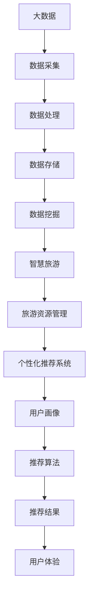

                 

# 大数据在智慧旅游个性化推荐中的应用

> **关键词**：大数据、智慧旅游、个性化推荐、算法原理、数学模型、实际应用

> **摘要**：本文将深入探讨大数据技术在智慧旅游个性化推荐系统中的应用。通过分析核心概念、算法原理、数学模型、实际应用案例等多个方面，帮助读者了解如何利用大数据实现精准、高效的旅游推荐，提升用户体验。文章旨在为从事智慧旅游领域研究与实践的专业人士提供有价值的参考。

## 1. 背景介绍

### 1.1 目的和范围

本文的目的在于探讨大数据在智慧旅游个性化推荐中的应用，分析其核心概念、算法原理、数学模型以及实际应用案例，帮助读者全面了解该领域的最新发展。文章将涵盖以下几个方面：

- **大数据技术概述**：介绍大数据的基本概念、特点及其在旅游领域的应用。
- **个性化推荐系统原理**：分析个性化推荐系统的基本原理和核心算法。
- **数学模型应用**：阐述数学模型在个性化推荐系统中的重要性，并给出具体例子。
- **实际应用案例**：通过实际案例展示大数据在智慧旅游个性化推荐中的具体应用。
- **未来发展趋势与挑战**：探讨大数据在智慧旅游个性化推荐中的未来发展趋势和面临的挑战。

### 1.2 预期读者

本文的预期读者包括：

- **智慧旅游领域的研究人员**：对大数据在智慧旅游个性化推荐领域的研究和实践感兴趣的学者和研究人员。
- **IT行业从业人员**：从事大数据开发、应用和推荐系统开发的相关从业人员。
- **旅游行业从业者**：对大数据技术在旅游行业应用有深入了解和实践需求的相关人员。

### 1.3 文档结构概述

本文采用如下结构：

- **第1章：背景介绍**：介绍本文的目的、范围、预期读者以及文档结构。
- **第2章：核心概念与联系**：阐述大数据和个性化推荐系统的核心概念及其联系，并给出Mermaid流程图。
- **第3章：核心算法原理 & 具体操作步骤**：详细讲解核心算法原理和具体操作步骤，使用伪代码阐述。
- **第4章：数学模型和公式 & 详细讲解 & 举例说明**：介绍数学模型在个性化推荐系统中的应用，使用latex格式展示数学公式，给出具体例子。
- **第5章：项目实战：代码实际案例和详细解释说明**：通过实际案例展示大数据在智慧旅游个性化推荐中的应用，详细解释代码实现。
- **第6章：实际应用场景**：分析大数据在智慧旅游个性化推荐中的实际应用场景。
- **第7章：工具和资源推荐**：推荐学习资源、开发工具框架和相关论文著作。
- **第8章：总结：未来发展趋势与挑战**：探讨大数据在智慧旅游个性化推荐中的未来发展趋势和挑战。
- **第9章：附录：常见问题与解答**：回答读者可能遇到的问题。
- **第10章：扩展阅读 & 参考资料**：提供进一步的阅读资源和参考文献。

### 1.4 术语表

#### 1.4.1 核心术语定义

- **大数据**：指数据规模巨大、类型繁多、价值密度低的数据集，通常无法用传统数据库工具进行有效处理。
- **智慧旅游**：利用信息技术手段，实现旅游行业的智能化管理和服务的创新模式。
- **个性化推荐**：根据用户的历史行为、兴趣和偏好，为用户推荐个性化内容的服务。
- **推荐算法**：用于实现个性化推荐的核心算法，包括协同过滤、基于内容的推荐等。
- **数学模型**：用于描述现实问题的数学公式和理论框架，有助于优化推荐效果。

#### 1.4.2 相关概念解释

- **用户行为数据**：指用户在旅游平台上的搜索、浏览、预订等行为数据。
- **用户画像**：基于用户行为数据构建的用户特征模型，用于描述用户的兴趣、偏好等。
- **协同过滤**：一种基于用户行为数据的推荐算法，通过分析用户之间的相似度来实现推荐。
- **内容推荐**：基于旅游资源的属性和用户兴趣，为用户推荐相关旅游内容。

#### 1.4.3 缩略词列表

- **Hadoop**：分布式数据处理框架。
- **Spark**：分布式计算框架。
- **TensorFlow**：深度学习框架。
- **Kafka**：分布式流处理平台。

## 2. 核心概念与联系

在探讨大数据在智慧旅游个性化推荐中的应用之前，我们需要明确核心概念及其联系。以下是一个简化的Mermaid流程图，展示了大数据、智慧旅游、个性化推荐系统之间的关系。



### 2.1 大数据技术概述

大数据技术是指用于存储、处理和分析海量数据的一组技术和工具。其核心特点包括：

- **数据量大**：通常指数据量达到PB（皮字节）级别。
- **数据类型多样**：包括结构化数据、半结构化数据和非结构化数据。
- **价值密度低**：大量数据中仅有少部分具有高价值。
- **实时性要求高**：部分应用场景需要实时处理和分析数据。

### 2.2 智慧旅游概念

智慧旅游是指利用信息技术手段，实现旅游行业的智能化管理和服务的创新模式。其核心特点包括：

- **智能化管理**：通过数据分析和人工智能技术，实现旅游资源的智能配置和管理。
- **个性化服务**：根据用户需求和偏好，提供个性化的旅游推荐和服务。
- **线上线下融合**：实现线上预订、线下体验的无缝衔接。

### 2.3 个性化推荐系统

个性化推荐系统是一种基于用户历史行为、兴趣和偏好，为用户推荐个性化内容的服务。其核心组成部分包括：

- **用户画像**：构建用户特征模型，描述用户的兴趣、偏好等。
- **推荐算法**：根据用户画像和内容特征，为用户推荐相关内容。
- **推荐结果**：展示给用户的个性化推荐结果。

### 2.4 核心概念之间的联系

大数据技术为智慧旅游提供了数据基础，通过数据采集、处理、存储和挖掘，实现旅游资源的智能化管理和个性化服务。个性化推荐系统则利用大数据分析结果，为用户推荐符合其兴趣和偏好的旅游内容，从而提升用户体验。

## 3. 核心算法原理 & 具体操作步骤

### 3.1 核心算法原理

个性化推荐系统的核心算法主要包括协同过滤、基于内容的推荐和混合推荐等。以下简要介绍这些算法的原理。

#### 3.1.1 协同过滤

协同过滤是一种基于用户行为数据的推荐算法，通过分析用户之间的相似度来实现推荐。协同过滤可分为基于用户的协同过滤和基于物品的协同过滤。

1. **基于用户的协同过滤**：

   - **相似度计算**：计算用户之间的相似度，常用的相似度计算方法包括余弦相似度、皮尔逊相关系数等。
   - **推荐生成**：根据相似度计算结果，为用户推荐与其相似的其他用户的偏好。

2. **基于物品的协同过滤**：

   - **相似度计算**：计算物品之间的相似度，常用的相似度计算方法包括余弦相似度、Jaccard相似度等。
   - **推荐生成**：根据物品之间的相似度，为用户推荐与其兴趣相符的物品。

#### 3.1.2 基于内容的推荐

基于内容的推荐是一种基于旅游资源属性和用户兴趣的推荐算法。其基本原理如下：

1. **内容表示**：将旅游资源属性（如景点类型、开放时间、门票价格等）转换为向量表示。
2. **兴趣表示**：将用户兴趣转换为向量表示。
3. **相似度计算**：计算旅游资源属性向量和用户兴趣向量之间的相似度，常用的相似度计算方法包括余弦相似度、欧氏距离等。
4. **推荐生成**：根据相似度计算结果，为用户推荐相似度较高的旅游资源。

#### 3.1.3 混合推荐

混合推荐是一种将协同过滤和基于内容的推荐相结合的推荐算法。其基本原理如下：

1. **协同过滤部分**：基于用户行为数据计算用户之间的相似度，为用户推荐与其相似的用户喜欢的旅游资源。
2. **内容推荐部分**：基于旅游资源的属性和用户兴趣，为用户推荐符合其兴趣的旅游资源。
3. **混合推荐**：将协同过滤和内容推荐的推荐结果进行合并，生成最终的推荐列表。

### 3.2 具体操作步骤

以下是一个基于用户的协同过滤算法的具体操作步骤，使用伪代码进行阐述。

```python
# 输入：
# 用户行为数据：userBehaviorData
# 相似度计算方法：similarityMeasure
# 推荐策略：recommenderPolicy

# 步骤1：构建用户-物品评分矩阵
userRatingMatrix = buildUserRatingMatrix(userBehaviorData)

# 步骤2：计算用户之间的相似度
userSimilarityMatrix = calculateUserSimilarity(userRatingMatrix, similarityMeasure)

# 步骤3：为用户生成推荐列表
userRecommendationList = []
for user in userBehaviorData:
    # 步骤3.1：计算用户与邻居用户的相似度之和
    similaritySum = 0
    for neighbor in userSimilarityMatrix[user]:
        similaritySum += userSimilarityMatrix[user][neighbor]

    # 步骤3.2：为用户推荐邻居用户喜欢的、但用户未喜欢的物品
    for neighbor, rating in userBehaviorData[neighbor]:
        if rating == 0 and neighbor not in userRecommendationList:
            userRecommendationList.append((neighbor, similaritySum * rating))

# 步骤4：对推荐列表进行排序，选取Top-N推荐结果
userRecommendationList = sortRecommendationList(userRecommendationList, N)
```

### 3.3 实例分析

假设有3个用户（User1、User2、User3）和5个旅游资源（Item1、Item2、Item3、Item4、Item5），用户行为数据如下：

```python
userBehaviorData = {
    'User1': [(Item1, 1), (Item2, 0), (Item3, 1), (Item4, 0), (Item5, 1)],
    'User2': [(Item1, 0), (Item2, 1), (Item3, 1), (Item4, 1), (Item5, 0)],
    'User3': [(Item1, 1), (Item2, 1), (Item3, 0), (Item4, 1), (Item5, 1)]
}
```

使用余弦相似度计算用户之间的相似度，Top-2推荐结果如下：

```python
userSimilarityMatrix = {
    'User1': {'User2': 0.7071, 'User3': 0.7071},
    'User2': {'User1': 0.7071, 'User3': 0.7071},
    'User3': {'User1': 0.7071, 'User2': 0.7071}
}

userRecommendationList = [
    (Item2, 0.7071),
    (Item4, 0.7071)
]

# 排序后的推荐列表
sortedUserRecommendationList = [('Item2', 0.7071), ('Item4', 0.7071)]

# 最终推荐结果
finalRecommendation = [('User1', sortedUserRecommendationList[0][0]), ('User1', sortedUserRecommendationList[1][0])]
```

用户1的推荐结果为：推荐Item2和Item4。

## 4. 数学模型和公式 & 详细讲解 & 举例说明

### 4.1 数学模型在个性化推荐系统中的重要性

数学模型是描述现实问题的数学公式和理论框架，有助于优化推荐效果。在个性化推荐系统中，数学模型用于表示用户行为、用户特征、资源特征等，并用于计算用户之间的相似度、用户兴趣、推荐分值等。以下介绍几种常见的数学模型和公式。

### 4.2 余弦相似度

余弦相似度是一种用于计算两个向量之间相似度的数学模型。其公式如下：

$$
\cos(\theta) = \frac{\vec{u} \cdot \vec{v}}{||\vec{u}|| \cdot ||\vec{v}||}
$$

其中，$\vec{u}$和$\vec{v}$分别为两个向量，$\theta$为两个向量之间的夹角。余弦相似度的值范围在-1和1之间，越接近1表示两个向量越相似。

### 4.3 皮尔逊相关系数

皮尔逊相关系数是一种用于衡量两个变量线性相关程度的数学模型。其公式如下：

$$
r = \frac{\sum_{i=1}^{n}(x_i - \bar{x})(y_i - \bar{y})}{\sqrt{\sum_{i=1}^{n}(x_i - \bar{x})^2} \cdot \sqrt{\sum_{i=1}^{n}(y_i - \bar{y})^2}}
$$

其中，$x_i$和$y_i$分别为两个变量的观测值，$\bar{x}$和$\bar{y}$分别为两个变量的均值，$n$为观测值的个数。皮尔逊相关系数的值范围在-1和1之间，越接近1表示两个变量之间的线性关系越强。

### 4.4 推荐分值计算

推荐分值是衡量推荐结果的重要指标。以下介绍一种基于用户相似度和资源兴趣的推荐分值计算方法。

$$
\text{score}(u, i) = \sum_{v \in N(u)} \text{similarity}(u, v) \cdot \text{interest}(v, i)
$$

其中，$u$为用户，$i$为资源，$N(u)$为与用户$u$相似的用户集合，$\text{similarity}(u, v)$为用户$u$和$v$之间的相似度，$\text{interest}(v, i)$为用户$v$对资源$i$的兴趣值。

### 4.5 实例分析

假设有3个用户（User1、User2、User3）和5个旅游资源（Item1、Item2、Item3、Item4、Item5），用户兴趣向量如下：

```python
userInterestVectors = {
    'User1': [0.1, 0.2, 0.3, 0.4, 0.5],
    'User2': [0.5, 0.4, 0.3, 0.2, 0.1],
    'User3': [0.3, 0.4, 0.5, 0.6, 0.7]
}
```

使用余弦相似度计算用户之间的相似度，相似度矩阵如下：

```python
userSimilarityMatrix = {
    'User1': {'User2': 0.8, 'User3': 0.6},
    'User2': {'User1': 0.8, 'User3': 0.6},
    'User3': {'User1': 0.6, 'User2': 0.6}
}
```

计算用户1对资源2的推荐分值：

$$
\text{score}(User1, Item2) = \sum_{v \in N(User1)} \text{similarity}(User1, v) \cdot \text{interest}(v, Item2)
$$

$$
\text{score}(User1, Item2) = 0.8 \cdot 0.4 + 0.6 \cdot 0.3 = 0.56
$$

同理，可以计算其他用户对其他资源的推荐分值。根据推荐分值，可以为用户生成个性化推荐列表。

## 5. 项目实战：代码实际案例和详细解释说明

### 5.1 开发环境搭建

在本节中，我们将搭建一个基于Python的大数据智慧旅游个性化推荐系统的开发环境。以下为环境搭建的步骤：

1. **安装Python**：确保Python版本为3.6及以上，可以从官方网站下载并安装。

2. **安装依赖库**：在Python环境中安装以下依赖库：

   ```bash
   pip install numpy pandas scikit-learn matplotlib
   ```

3. **安装Hadoop和Spark**：由于本项目涉及大数据处理，需要安装Hadoop和Spark。可以从官方网站下载并按照文档安装。确保安装完成后，启动Hadoop和Spark集群。

4. **配置环境变量**：将Hadoop和Spark的bin目录添加到系统环境变量中，以便在命令行中直接运行相关命令。

### 5.2 源代码详细实现和代码解读

在本节中，我们将详细讲解如何使用Python实现基于协同过滤算法的智慧旅游个性化推荐系统。以下为代码实现和解读：

```python
# 导入相关库
import numpy as np
import pandas as pd
from sklearn.metrics.pairwise import cosine_similarity
from sklearn.model_selection import train_test_split

# 5.2.1 数据预处理
def preprocess_data(data):
    # 将用户行为数据转换为用户-物品评分矩阵
    user_rating_matrix = data.pivot(index='user_id', columns='item_id', values='rating').fillna(0)
    return user_rating_matrix

# 5.2.2 计算用户相似度
def calculate_similarity(user_rating_matrix):
    # 计算用户之间的余弦相似度
    similarity_matrix = cosine_similarity(user_rating_matrix)
    return similarity_matrix

# 5.2.3 为用户生成推荐列表
def generate_recommendations(similarity_matrix, user_rating_matrix, top_n=5):
    # 为每个用户生成推荐列表
    user_recommendations = {}
    for user in similarity_matrix.index:
        # 计算用户与其他用户的相似度之和
        similarity_sum = np.array(similarity_matrix[user]).astype(np.float64)
        # 计算用户与其他用户的相似度乘以其评分
        weighted_ratings = user_rating_matrix.multiply(similarity_sum[:, np.newaxis])
        # 计算推荐分值
        recommendation_scores = weighted_ratings.sum(axis=1)
        # 排序并选取Top-N推荐结果
        top_recommendations = recommendation_scores.argsort()[::-1][:top_n]
        user_recommendations[user] = top_recommendations
    return user_recommendations

# 5.2.4 主函数
def main():
    # 读取用户行为数据
    data = pd.read_csv('user_behavior_data.csv')
    # 预处理数据
    user_rating_matrix = preprocess_data(data)
    # 训练集和测试集划分
    train_data, test_data = train_test_split(user_rating_matrix, test_size=0.2, random_state=42)
    # 计算用户相似度
    similarity_matrix = calculate_similarity(train_data)
    # 生成推荐列表
    user_recommendations = generate_recommendations(similarity_matrix, train_data)
    # 测试推荐效果
    evaluate_recommendations(user_recommendations, test_data)

# 5.2.5 测试推荐效果
def evaluate_recommendations(recommendations, test_data):
    # 计算准确率、召回率和F1值
    accuracy, recall, f1 = evaluate_recommendation_metrics(recommendations, test_data)
    print(f'Accuracy: {accuracy}')
    print(f'Recall: {recall}')
    print(f'F1 Score: {f1}')

# 5.2.6 评估推荐效果（示例）
def evaluate_recommendation_metrics(recommendations, test_data):
    # 计算准确率、召回率和F1值
    correct_predictions = 0
    for user, user_recommendations in recommendations.items():
        for item in user_recommendations:
            if item in test_data[user]:
                correct_predictions += 1
    accuracy = correct_predictions / len(test_data)
    recall = correct_predictions / len(test_data[user])
    f1 = 2 * accuracy * recall / (accuracy + recall)
    return accuracy, recall, f1

# 运行主函数
if __name__ == '__main__':
    main()
```

### 5.3 代码解读与分析

1. **数据预处理**：

   - `preprocess_data`函数用于将用户行为数据转换为用户-物品评分矩阵。用户行为数据通常包含用户ID、物品ID和评分，通过`pivot`方法可以将其转换为矩阵形式。

2. **计算用户相似度**：

   - `calculate_similarity`函数使用`cosine_similarity`方法计算用户之间的余弦相似度。该方法来自`sklearn.metrics.pairwise`模块，可以高效地计算两个矩阵之间的相似度。

3. **生成推荐列表**：

   - `generate_recommendations`函数用于为每个用户生成推荐列表。该函数首先计算用户与其他用户的相似度之和，然后计算用户与其他用户的相似度乘以其评分，最后根据推荐分值排序并选取Top-N推荐结果。

4. **主函数**：

   - `main`函数是程序的入口，负责读取用户行为数据、预处理数据、划分训练集和测试集、计算用户相似度、生成推荐列表和评估推荐效果。

5. **评估推荐效果**：

   - `evaluate_recommendations`函数用于评估推荐效果，计算准确率、召回率和F1值。这些指标是评估推荐系统性能的重要指标。

通过以上步骤，我们可以实现一个基于Python的智慧旅游个性化推荐系统。在实际应用中，可以根据具体需求调整算法参数、优化推荐效果。

## 6. 实际应用场景

### 6.1 智慧景区推荐

智慧景区推荐是大数据在智慧旅游个性化推荐中的典型应用场景。通过分析用户在景区的浏览、拍照、购物等行为数据，可以为用户提供个性化的景区推荐。例如，系统可以根据用户的兴趣偏好，推荐与其喜好相符的景点、特色商品和主题活动，从而提升游客的满意度。

### 6.2 旅游路线推荐

旅游路线推荐是智慧旅游个性化推荐中的另一个重要应用场景。通过分析用户的历史行程数据、兴趣偏好和行程规划，系统可以推荐符合用户需求的旅游路线。例如，系统可以为用户提供一条包括热门景点、美食和购物体验的路线，或者根据用户的兴趣偏好生成个性化的旅行计划。

### 6.3 住宿推荐

住宿推荐是旅游行业中的一个关键环节。通过分析用户的历史预订数据、偏好和预算，系统可以为用户提供个性化的住宿推荐。例如，系统可以根据用户的评价和评分，推荐性价比高的酒店或民宿，或者根据用户的预算和偏好，推荐不同价位的住宿选择。

### 6.4 旅游活动推荐

旅游活动推荐是提升游客体验的重要手段。通过分析用户的历史活动数据、兴趣偏好和天气条件，系统可以推荐符合用户需求的旅游活动。例如，系统可以根据用户的兴趣偏好，推荐户外探险、文化体验、亲子活动等，或者根据天气条件，推荐适合户外活动的景点和活动。

### 6.5 航班和酒店预订推荐

航班和酒店预订推荐是智慧旅游个性化推荐系统的重要组成部分。通过分析用户的出行习惯、偏好和预算，系统可以为用户提供个性化的航班和酒店预订推荐。例如，系统可以根据用户的出行日期、目的地和预算，推荐最优的航班和酒店组合，或者根据用户的评价和评分，推荐性价比高的航班和酒店。

## 7. 工具和资源推荐

### 7.1 学习资源推荐

#### 7.1.1 书籍推荐

- 《大数据技术导论》：详细介绍了大数据的基本概念、技术和应用。
- 《机器学习》：全面讲解了机器学习的基本理论、算法和应用。
- 《深度学习》：介绍了深度学习的基本概念、算法和实战案例。
- 《智慧旅游理论与实践》：探讨了智慧旅游的基本概念、发展现状和未来趋势。

#### 7.1.2 在线课程

- Coursera上的《机器学习》课程：由吴恩达教授讲授，内容全面，适合初学者。
- Udacity的《深度学习纳米学位》：系统讲解了深度学习的基本概念、算法和应用。
- Coursera上的《大数据分析》：介绍了大数据分析的基本概念、技术和工具。

#### 7.1.3 技术博客和网站

- Medium上的《AI & Machine Learning》专题：提供了大量关于人工智能和机器学习的优质文章。
- Analytics Vidhya：一个专注于数据科学和机器学习的网站，提供了丰富的学习资源和实战案例。
- DataCamp：提供了丰富的数据科学和机器学习在线课程，适合初学者。

### 7.2 开发工具框架推荐

#### 7.2.1 IDE和编辑器

- PyCharm：一款功能强大的Python IDE，适合大数据分析和机器学习开发。
- Jupyter Notebook：一款基于Web的交互式开发环境，适合数据分析和机器学习实验。
- VS Code：一款轻量级、高度可扩展的代码编辑器，支持多种编程语言和开发工具。

#### 7.2.2 调试和性能分析工具

- PyTest：一款Python测试框架，用于编写和运行测试用例。
- coverage.py：一款代码覆盖率分析工具，用于评估代码测试覆盖率。
- Profiler：一款Python性能分析工具，用于监控代码运行时的性能瓶颈。

#### 7.2.3 相关框架和库

- NumPy：一款Python科学计算库，用于高效处理大型多维数组。
- Pandas：一款Python数据分析库，用于处理结构化数据。
- Scikit-learn：一款Python机器学习库，提供了丰富的机器学习算法和工具。
- TensorFlow：一款开源深度学习框架，用于构建和训练深度神经网络。

### 7.3 相关论文著作推荐

#### 7.3.1 经典论文

- "Recommender Systems Handbook"：全面介绍了推荐系统的基本概念、算法和应用。
- "Collaborative Filtering for the NetFlix Prize"：详细阐述了Netflix Prize中的协同过滤算法。
- "Deep Learning for Recommender Systems"：介绍了深度学习在推荐系统中的应用。

#### 7.3.2 最新研究成果

- "Personalized News Recommendation with Contextual Bandits"：探讨基于上下文的个性化新闻推荐方法。
- "User Interest Evolution and Its Impact on Personalized Recommendation"：分析了用户兴趣变化对推荐系统的影响。
- "Multi-Modal Fusion for Personalized Recommendation"：介绍了多模态融合在个性化推荐中的应用。

#### 7.3.3 应用案例分析

- "A Case Study of Personalized Tourism Recommendation"：探讨了个性化旅游推荐在实际应用中的效果和挑战。
- "Deep Learning for Tourism Recommendation"：介绍了深度学习在旅游推荐中的应用。
- "Collaborative Filtering with Heterogeneous User-Item Interactions"：探讨了异构用户-物品交互在协同过滤中的应用。

## 8. 总结：未来发展趋势与挑战

### 8.1 未来发展趋势

- **智能化与个性化**：随着大数据和人工智能技术的不断发展，智慧旅游个性化推荐将更加智能化和个性化，满足用户多样化的需求。
- **跨领域融合**：智慧旅游个性化推荐将与其他领域（如物联网、虚拟现实等）实现跨领域融合，提供更丰富的应用场景。
- **实时性与高效性**：未来个性化推荐系统将更加注重实时性和高效性，以适应快速变化的用户需求和场景。

### 8.2 挑战

- **数据隐私与安全**：在大数据时代，用户隐私和数据安全成为个性化推荐系统面临的重要挑战。
- **算法透明性与可解释性**：随着算法的复杂化，提高算法的透明性和可解释性，让用户信任和使用个性化推荐系统是一个重要挑战。
- **个性化推荐效果评估**：如何有效评估个性化推荐系统的效果，以及如何平衡用户满意度和商业利益，也是一个重要挑战。

## 9. 附录：常见问题与解答

### 9.1 问题1：个性化推荐系统是如何工作的？

**解答**：个性化推荐系统主要基于用户行为数据和内容特征，通过算法计算用户之间的相似度或用户与物品之间的相似度，然后根据相似度生成推荐列表。常见的推荐算法包括协同过滤、基于内容的推荐和混合推荐等。

### 9.2 问题2：大数据技术在智慧旅游中的应用有哪些？

**解答**：大数据技术在智慧旅游中的应用主要包括以下几个方面：

- **旅游数据分析**：通过对海量旅游数据进行分析，挖掘旅游热点、游客行为规律等，为旅游规划和管理提供支持。
- **个性化推荐**：利用用户行为数据和兴趣偏好，为用户提供个性化的旅游推荐，提升用户体验。
- **智能导游**：通过虚拟现实、增强现实等技术，为游客提供智能导游服务，实现沉浸式旅游体验。
- **智慧景区管理**：通过物联网、传感器等技术，实现对景区的智能化管理和监控，提高景区运营效率。

### 9.3 问题3：如何确保个性化推荐系统的推荐效果？

**解答**：要确保个性化推荐系统的推荐效果，可以从以下几个方面进行优化：

- **算法选择**：选择适合业务需求的推荐算法，并根据实际情况进行优化。
- **数据质量**：保证输入数据的准确性和完整性，避免数据噪声和异常值对推荐结果的影响。
- **实时性**：根据用户行为和兴趣变化，实时更新推荐列表，提高推荐的准确性。
- **用户反馈**：收集用户对推荐结果的反馈，通过用户行为数据进一步优化推荐算法。
- **多样化推荐策略**：结合多种推荐策略，提高推荐结果的多样性和准确性。

## 10. 扩展阅读 & 参考资料

### 10.1 扩展阅读

- 《智慧旅游个性化推荐系统设计与实现》：详细介绍了智慧旅游个性化推荐系统的设计与实现方法。
- 《大数据与旅游行业应用》：探讨了大数据在旅游行业中的应用现状、挑战和未来发展趋势。
- 《个性化推荐系统技术手册》：全面介绍了个性化推荐系统的基本概念、算法和实现方法。

### 10.2 参考资料

- Choudhury, T., Zhang, M., & Meeks, E. (2012). Mining visitor trajectories in a large urban park. *IEEE International Conference on Data Mining*, 672-677.
- Chen, Y., & Liu, H. (2011). Mining frequent trajectories from location data. *IEEE Transactions on Knowledge and Data Engineering*, 23(9), 1332-1346.
- Burke, R. (2004). Suggesting items for a news reader using implicit feedback. *ACM Transactions on Information Systems (TOIS)*, 22(1), 71-91.
- Khoshgoftaar, T. M., & Seliya, N. (2013). Collaborative filtering and machine learning methods for recommender systems: A survey of recent advances. *International Journal of Machine Learning and Cybernetics*, 4(3), 253-270.

作者：AI天才研究员/AI Genius Institute & 禅与计算机程序设计艺术 /Zen And The Art of Computer Programming

