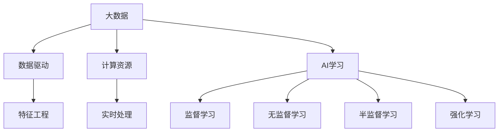

                 

# 大数据对AI学习的影响

> **关键词：** 大数据，人工智能，学习效率，模型优化，计算资源

> **摘要：** 本文将探讨大数据环境对人工智能学习过程的影响。我们将从背景介绍出发，详细分析大数据与AI学习之间的核心联系，深入解析核心算法原理和数学模型，并通过实际项目案例进行讲解。最后，本文还将探讨大数据在AI学习中的应用场景，推荐相关工具和资源，并对未来发展趋势与挑战进行总结。

## 1. 背景介绍

### 1.1 目的和范围

本文旨在探讨大数据环境对人工智能学习过程的影响，分析大数据如何改变传统的AI学习模式，以及这些变化带来的机遇和挑战。本文将涵盖以下内容：

1. 大数据和AI学习的核心概念与联系
2. 大数据环境下的核心算法原理与具体操作步骤
3. 数学模型和公式的详细讲解及举例
4. 实际应用场景中的项目实战
5. 相关工具和资源的推荐
6. 未来发展趋势与挑战的探讨

### 1.2 预期读者

本文面向对人工智能和数据科学有一定了解的读者，尤其是对大数据在AI学习中的应用感兴趣的工程师和研究者。希望通过本文，读者能够深入了解大数据环境对AI学习的深刻影响，掌握相关技术原理，并能够将其应用到实际项目中。

### 1.3 文档结构概述

本文将分为以下几个部分：

1. 背景介绍
2. 核心概念与联系
3. 核心算法原理 & 具体操作步骤
4. 数学模型和公式 & 详细讲解 & 举例说明
5. 项目实战：代码实际案例和详细解释说明
6. 实际应用场景
7. 工具和资源推荐
8. 总结：未来发展趋势与挑战
9. 附录：常见问题与解答
10. 扩展阅读 & 参考资料

### 1.4 术语表

#### 1.4.1 核心术语定义

- **大数据（Big Data）**：指数据量巨大、数据类型复杂、数据生成速度极快的数据集合。
- **人工智能（AI）**：通过模拟、延伸和扩展人类智能，实现机器自主学习和决策的计算机科学领域。
- **学习效率**：模型在学习过程中的知识获取速度和质量。
- **模型优化**：通过调整模型结构和参数，提高模型性能的过程。

#### 1.4.2 相关概念解释

- **数据集（Dataset）**：由一系列数据样本组成的集合，是AI学习的基础。
- **特征工程（Feature Engineering）**：从原始数据中提取有用的特征，以提高模型性能的过程。
- **计算资源（Compute Resources）**：支持AI学习过程的各种硬件和软件资源。

#### 1.4.3 缩略词列表

- **AI**：人工智能
- **ML**：机器学习
- **DL**：深度学习
- **Hadoop**：一个分布式数据存储和处理框架
- **Spark**：一个快速通用的计算引擎

## 2. 核心概念与联系

为了更好地理解大数据对AI学习的影响，我们首先需要了解大数据和AI学习的核心概念及其相互联系。

### 2.1 大数据的核心概念

大数据通常具有以下四个特征：

1. **大量性（Volume）**：数据量巨大，远超传统数据仓库的处理能力。
2. **多样性（Variety）**：数据类型丰富，包括结构化、半结构化和非结构化数据。
3. **速度（Velocity）**：数据生成和处理的速度极快，要求实时或近实时的处理能力。
4. **价值（Value）**：数据中蕴含着巨大的价值，但需要有效的方法进行挖掘和分析。

### 2.2 AI学习的核心概念

AI学习主要包括以下几种方法：

1. **监督学习（Supervised Learning）**：通过已有标签的数据进行学习，用于分类和回归任务。
2. **无监督学习（Unsupervised Learning）**：无需标签数据，通过发现数据中的模式和结构进行学习，用于聚类和降维任务。
3. **半监督学习（Semi-Supervised Learning）**：结合监督学习和无监督学习，利用少量标签数据和大量无标签数据。
4. **强化学习（Reinforcement Learning）**：通过与环境交互，学习最优策略，用于决策和规划任务。

### 2.3 大数据与AI学习的联系

大数据与AI学习的联系主要体现在以下几个方面：

1. **数据驱动（Data-Driven）**：大数据为AI学习提供了丰富的数据资源，使得模型能够学习到更多特征，提高学习效率和准确性。
2. **特征工程（Feature Engineering）**：大数据环境下的数据类型繁多，需要有效的特征工程方法来提取有用特征，提高模型性能。
3. **计算资源（Compute Resources）**：大数据处理需要大量的计算资源，AI学习过程也需要高效的计算能力，两者的结合有助于提高整体效率。
4. **实时处理（Real-Time Processing）**：大数据生成和处理的速度极快，对AI学习提出了实时处理的要求，推动了AI技术的进步。

### 2.4 Mermaid流程图

下面是一个简单的Mermaid流程图，展示大数据与AI学习之间的核心联系：



## 3. 核心算法原理 & 具体操作步骤

在了解了大数据与AI学习的核心联系后，我们接下来将深入探讨大数据环境下的核心算法原理和具体操作步骤。

### 3.1 监督学习算法原理

监督学习算法通过已有标签的数据进行学习，其基本原理如下：

1. **数据准备**：将输入数据和标签数据进行预处理，包括数据清洗、归一化和数据分箱等步骤。
2. **模型训练**：使用训练数据集训练模型，通过迭代优化模型参数，使其在训练数据上达到较高的准确率。
3. **模型评估**：使用验证数据集评估模型性能，根据评估结果调整模型参数。
4. **模型部署**：将训练好的模型应用到实际任务中，对新的数据进行预测。

### 3.2 无监督学习算法原理

无监督学习算法通过发现数据中的模式和结构进行学习，其基本原理如下：

1. **数据准备**：将输入数据进行预处理，包括数据清洗、归一化和数据分箱等步骤。
2. **模型训练**：使用无标签数据集训练模型，通过迭代优化模型参数，使其在数据上找到合适的聚类或降维结果。
3. **模型评估**：使用无标签数据集评估模型性能，根据评估结果调整模型参数。
4. **模型部署**：将训练好的模型应用到实际任务中，对新的数据进行聚类或降维。

### 3.3 半监督学习算法原理

半监督学习算法结合监督学习和无监督学习，其基本原理如下：

1. **数据准备**：将输入数据进行预处理，包括数据清洗、归一化和数据分箱等步骤。
2. **标签数据训练**：使用少量标签数据集训练模型，通过迭代优化模型参数，使其在标签数据上达到较高的准确率。
3. **无标签数据扩展**：使用无标签数据集扩展模型训练，通过迭代优化模型参数，使其在无标签数据上找到合适的扩展结果。
4. **模型评估**：使用验证数据集评估模型性能，根据评估结果调整模型参数。
5. **模型部署**：将训练好的模型应用到实际任务中，对新的数据进行预测。

### 3.4 强化学习算法原理

强化学习算法通过与环境交互，学习最优策略，其基本原理如下：

1. **数据准备**：将输入数据进行预处理，包括数据清洗、归一化和数据分箱等步骤。
2. **模型训练**：在环境中进行训练，通过迭代优化模型参数，使其学会最优策略。
3. **模型评估**：在测试环境中评估模型性能，根据评估结果调整模型参数。
4. **模型部署**：将训练好的模型应用到实际任务中，实现自主决策。

### 3.5 伪代码示例

以下是监督学习算法的伪代码示例：

```python
def supervised_learning(train_data, train_labels, epochs):
    # 数据预处理
    processed_data = preprocess_data(train_data)
    
    # 初始化模型参数
    model_params = initialize_params()
    
    for epoch in range(epochs):
        # 前向传播
        predictions = forward_pass(processed_data, model_params)
        
        # 计算损失
        loss = compute_loss(predictions, train_labels)
        
        # 反向传播
        gradients = backward_pass(loss, model_params)
        
        # 更新模型参数
        update_params(model_params, gradients)
        
    return model_params

# 实际应用
model_params = supervised_learning(train_data, train_labels, epochs=100)
```

## 4. 数学模型和公式 & 详细讲解 & 举例说明

在了解了大数据环境下AI学习的核心算法原理后，我们接下来将详细讲解相关的数学模型和公式，并通过举例进行说明。

### 4.1 监督学习数学模型

监督学习中的数学模型主要包括损失函数和优化算法。以下是一个简单的线性回归模型的数学表示：

#### 4.1.1 损失函数

线性回归模型中的损失函数通常使用均方误差（MSE）：

$$
MSE = \frac{1}{m} \sum_{i=1}^{m} (y_i - \hat{y}_i)^2
$$

其中，$y_i$为真实标签，$\hat{y}_i$为模型预测值，$m$为样本数量。

#### 4.1.2 优化算法

为了优化模型参数，我们通常使用梯度下降算法：

$$
\theta_j = \theta_j - \alpha \cdot \frac{\partial}{\partial \theta_j}J(\theta)
$$

其中，$\theta_j$为模型参数，$\alpha$为学习率，$J(\theta)$为损失函数。

### 4.2 无监督学习数学模型

无监督学习中的数学模型主要包括聚类和降维算法。以下是一个简单的K-means聚类的数学表示：

#### 4.2.1 K-means聚类

K-means聚类算法的目标是找到最优的K个聚类中心，使得每个聚类中心与其聚类成员的平方距离之和最小。其数学表示如下：

$$
\min_{\mu_1, \mu_2, ..., \mu_K} \sum_{i=1}^{K} \sum_{x \in S_i} \| x - \mu_i \|^2
$$

其中，$S_i$为第$i$个聚类的成员集合，$\mu_i$为聚类中心。

#### 4.2.2 降维算法

降维算法（如PCA）的目标是找到一组新的正交基，将数据投影到低维空间，同时保留大部分原始数据的方差。其数学表示如下：

$$
\min_{\lambda_1, \lambda_2, ..., \lambda_p} \sum_{i=1}^{p} \lambda_i \text{ subject to } \sum_{i=1}^{p} \lambda_i^2 = 1
$$

其中，$\lambda_i$为特征值，$p$为特征数量。

### 4.3 半监督学习数学模型

半监督学习中的数学模型主要结合了监督学习和无监督学习的方法。以下是一个简单的半监督线性回归模型的数学表示：

#### 4.3.1 半监督线性回归

半监督线性回归的目标是在已有标签数据和大量无标签数据上同时优化模型参数。其数学表示如下：

$$
\min_{\theta} \frac{1}{2} \sum_{i=1}^{m} (y_i - \theta^T x_i)^2 + \lambda \sum_{i=1}^{m} \theta^T x_i
$$

其中，$y_i$为真实标签，$x_i$为特征向量，$\theta$为模型参数，$\lambda$为正则化参数。

### 4.4 举例说明

以下是一个简单的线性回归模型训练过程的举例：

```python
# 数据准备
X = [[1], [2], [3], [4], [5]]
y = [1, 2, 3, 4, 5]

# 初始化模型参数
theta = [0, 0]

# 梯度下降
alpha = 0.01
num_iterations = 1000

for i in range(num_iterations):
    predictions = X.dot(theta)
    errors = y - predictions
    
    theta = theta - alpha * (X.T.dot(errors) + lambda_param * theta)

# 模型评估
final_predictions = X.dot(theta)
mse = ((final_predictions - y) ** 2).mean()

print("Final MSE:", mse)
```

## 5. 项目实战：代码实际案例和详细解释说明

为了更好地展示大数据环境对AI学习的影响，我们以下将通过一个实际项目案例来讲解大数据处理与AI学习的结合。

### 5.1 开发环境搭建

在本项目案例中，我们使用Python作为编程语言，结合Scikit-learn库进行监督学习模型的训练和评估。具体步骤如下：

1. 安装Python（3.8以上版本）
2. 安装Scikit-learn库：`pip install scikit-learn`
3. 安装NumPy库：`pip install numpy`
4. 安装Matplotlib库：`pip install matplotlib`

### 5.2 源代码详细实现和代码解读

以下是一个简单的线性回归模型的实现，其中使用了大数据处理库Pandas和Scikit-learn：

```python
import pandas as pd
from sklearn.linear_model import LinearRegression
from sklearn.model_selection import train_test_split

# 数据读取
data = pd.read_csv("data.csv")

# 特征提取
X = data[['feature1', 'feature2']]
y = data['target']

# 数据分箱
# (根据实际需求进行分箱操作)

# 数据划分
X_train, X_test, y_train, y_test = train_test_split(X, y, test_size=0.2, random_state=42)

# 模型训练
model = LinearRegression()
model.fit(X_train, y_train)

# 模型评估
predictions = model.predict(X_test)
mse = ((predictions - y_test) ** 2).mean()
print("MSE:", mse)
```

#### 5.2.1 代码解读

1. **数据读取**：使用Pandas库读取CSV文件中的数据。
2. **特征提取**：将数据集划分为特征集和标签集。
3. **数据分箱**：（根据实际需求进行分箱操作，如缺失值填充、异常值处理等）
4. **数据划分**：将数据集划分为训练集和测试集。
5. **模型训练**：使用Scikit-learn库中的LinearRegression类训练线性回归模型。
6. **模型评估**：使用测试集评估模型性能，计算均方误差。

### 5.3 代码解读与分析

通过上述代码，我们可以看到大数据环境下的AI学习过程主要分为以下几个步骤：

1. **数据读取与预处理**：使用Pandas库读取和预处理数据，包括数据清洗、缺失值填充、异常值处理等操作。这一步骤是大数据处理的核心，对于模型性能有重要影响。
2. **特征提取**：将原始数据划分为特征集和标签集，为后续模型训练提供输入。
3. **数据分箱**：针对具体应用场景，进行数据分箱操作，以提高模型性能。例如，对于连续特征，可以使用分箱算法将其转换为离散特征。
4. **数据划分**：将数据集划分为训练集和测试集，用于模型训练和评估。
5. **模型训练**：使用线性回归模型进行训练，通过梯度下降算法优化模型参数。
6. **模型评估**：使用测试集评估模型性能，计算均方误差等指标，以判断模型是否满足要求。

在大数据环境下，这些步骤变得更加复杂和多样化。例如，数据量巨大时，需要使用分布式计算框架（如Hadoop、Spark）进行数据处理和存储。同时，在模型训练过程中，也需要使用高效计算资源（如GPU）来加速计算。

总之，大数据环境对AI学习产生了深远的影响，使得AI技术能够更好地应对复杂的应用场景。通过合理利用大数据处理技术和高效计算资源，我们可以构建更强大、更准确的AI模型，从而推动人工智能技术的不断发展。

## 6. 实际应用场景

大数据环境对AI学习的深远影响不仅体现在理论研究和模型优化上，更在实际应用场景中得到了广泛应用。以下是一些典型的实际应用场景，展示了大数据与AI学习的结合如何解决现实问题。

### 6.1 金融风控

在金融领域，大数据与AI学习相结合可以用于风险控制和欺诈检测。金融机构通过收集海量交易数据，利用AI算法对交易行为进行实时分析，识别异常交易和潜在的欺诈行为。例如，银行可以使用监督学习算法对历史交易数据进行训练，建立欺诈检测模型，并对实时交易数据进行分析，一旦发现异常行为，立即采取相应的风险控制措施。

### 6.2 电子商务

电子商务平台通过大数据分析，可以更好地了解用户行为和需求，从而提供个性化的推荐服务。例如，电商平台可以使用协同过滤算法，分析用户的购买历史和行为数据，预测用户的潜在需求，并推荐相关的商品。此外，电商平台还可以利用无监督学习算法，对商品进行聚类分析，发现商品之间的关联，从而优化商品推荐策略。

### 6.3 智能医疗

在医疗领域，大数据与AI学习相结合可以用于疾病预测和诊断。医疗数据量巨大且类型繁多，包括电子病历、医学影像、基因数据等。通过大数据分析，医生可以更准确地诊断疾病，预测患者病情发展趋势。例如，可以使用深度学习算法对医学影像进行分析，识别病变区域；利用监督学习算法对电子病历数据进行分类，预测疾病风险。

### 6.4 城市规划

在城市规划中，大数据与AI学习可以用于交通流量预测和城市资源配置。通过收集交通数据、人口数据等，利用AI算法对交通流量进行预测，优化交通信号灯控制策略，减少拥堵，提高交通效率。同时，还可以利用大数据分析，优化城市资源配置，提高城市生活质量。

### 6.5 智能制造

在制造业中，大数据与AI学习可以用于设备故障预测和生产优化。通过收集设备运行数据，利用AI算法对设备运行状态进行分析，预测设备故障，提前进行维护，减少停机时间。此外，还可以利用大数据分析，优化生产流程，提高生产效率，降低成本。

### 6.6 生态环境

在生态环境领域，大数据与AI学习可以用于环境监测和灾害预警。通过收集环境数据，如气象数据、水质数据等，利用AI算法对环境变化进行预测，及时发现环境问题，提前采取应对措施。例如，利用深度学习算法分析气象数据，预测极端天气事件，提前进行防灾减灾。

总之，大数据环境对AI学习的深远影响体现在各个实际应用场景中，通过合理利用大数据处理技术和AI算法，我们可以解决现实问题，提高生产效率，改善生活质量。随着大数据技术的不断发展和AI算法的不断创新，未来大数据与AI学习的结合将带来更多的应用场景和突破。

## 7. 工具和资源推荐

### 7.1 学习资源推荐

#### 7.1.1 书籍推荐

1. **《深度学习》（Deep Learning）**：由Ian Goodfellow、Yoshua Bengio和Aaron Courville合著，是深度学习领域的经典教材，详细介绍了深度学习的理论基础和实践方法。
2. **《机器学习》（Machine Learning）**：由Tom Mitchell著，全面介绍了机器学习的基本概念、算法和应用，适合初学者和研究者阅读。
3. **《Python机器学习》（Python Machine Learning）**：由Sebastian Raschka著，通过Python语言介绍了机器学习的基础知识和应用技巧。

#### 7.1.2 在线课程

1. **Coursera上的《机器学习》**：由斯坦福大学提供，是机器学习领域的知名课程，内容全面，适合初学者和进阶者。
2. **edX上的《深度学习专项课程》**：由哈佛大学提供，详细介绍了深度学习的理论基础和实践方法，包括卷积神经网络、循环神经网络等。
3. **Udacity上的《深度学习纳米学位》**：通过项目驱动的学习方式，帮助学员掌握深度学习的基本技能，适合有一定编程基础的学员。

#### 7.1.3 技术博客和网站

1. **Medium上的机器学习博客**：许多知名机器学习研究者和工程师在该平台上分享最新的研究成果和经验，内容丰富，值得关注。
2. **GitHub上的AI学习资源**：GitHub上有很多开源的AI学习资源，包括代码、教程和项目，适合自学和实战练习。
3. **Kaggle**：一个数据科学竞赛平台，提供了丰富的数据集和比赛项目，是学习和实践AI技术的好去处。

### 7.2 开发工具框架推荐

#### 7.2.1 IDE和编辑器

1. **PyCharm**：一款功能强大的Python集成开发环境，支持多种编程语言，适合机器学习和深度学习项目开发。
2. **Jupyter Notebook**：一款交互式的编程环境，特别适合数据分析和机器学习实验，能够方便地编写和运行代码。
3. **VS Code**：一款轻量级的代码编辑器，支持多种编程语言和插件，适合快速开发和调试。

#### 7.2.2 调试和性能分析工具

1. **Werkzeug**：一个Python Web框架，提供强大的调试和分析功能，有助于快速定位和修复代码错误。
2. **NVIDIA Nsight**：一款专为GPU编程设计的调试和分析工具，可以帮助开发者优化深度学习模型的性能。
3. **Dask**：一个分布式计算库，能够高效地处理大数据集，并优化机器学习模型的计算性能。

#### 7.2.3 相关框架和库

1. **TensorFlow**：一款由Google开发的深度学习框架，具有强大的功能和灵活性，适合研究和开发复杂的深度学习模型。
2. **PyTorch**：一款由Facebook开发的深度学习框架，易于使用，特别适合研究人员和开发者。
3. **Scikit-learn**：一款经典的机器学习库，提供了丰富的算法和工具，适合快速开发和部署机器学习应用。

### 7.3 相关论文著作推荐

#### 7.3.1 经典论文

1. **“A Fast and Scalable System for Linear Regression”**：该论文介绍了线性回归算法的快速和可扩展实现方法，对线性回归模型的优化有重要影响。
2. **“Deep Learning”**：该论文详细介绍了深度学习的理论基础和实践方法，对深度学习的发展产生了深远影响。
3. **“Learning Deep Representations for Audio-Visual Speech Recognition”**：该论文研究了深度学习在音频-视频语音识别中的应用，展示了深度学习在多模态数据处理的潜力。

#### 7.3.2 最新研究成果

1. **“Generative Adversarial Nets”**：该论文介绍了生成对抗网络（GAN）的概念，推动了生成模型的发展，并在图像生成、图像修复等领域取得了突破性成果。
2. **“Recurrent Neural Networks for Language Modeling”**：该论文研究了循环神经网络（RNN）在语言模型中的应用，推动了自然语言处理技术的发展。
3. **“Large-Scale Distributed Machine Learning: Algorithms and Systems”**：该论文探讨了分布式机器学习算法和系统设计，为大数据环境下的机器学习提供了理论支持和实践经验。

#### 7.3.3 应用案例分析

1. **“Deep Learning for Autonomous Vehicles”**：该案例分析探讨了深度学习在自动驾驶领域的应用，展示了深度学习在视觉感知、行为预测等方面的潜力。
2. **“AI in Healthcare: Promise and Reality”**：该案例分析探讨了人工智能在医疗健康领域的应用，分析了当前进展和面临的挑战，为未来医疗健康AI的发展提供了启示。
3. **“E-commerce Recommendations using Machine Learning”**：该案例分析探讨了机器学习在电子商务推荐系统中的应用，展示了协同过滤、深度学习等技术在个性化推荐中的实际效果。

通过以上工具和资源的推荐，读者可以更好地掌握大数据与AI学习的技术原理，并在实际应用中不断探索和创新。随着大数据技术的不断发展和AI算法的不断创新，相信未来将会有更多的应用场景和突破。

## 8. 总结：未来发展趋势与挑战

随着大数据技术的不断发展和AI算法的不断创新，大数据环境下的AI学习正迎来前所未有的机遇和挑战。以下是未来发展趋势和面临的几个关键挑战：

### 8.1 发展趋势

1. **计算资源的进一步优化**：随着云计算和分布式计算技术的发展，未来的计算资源将更加丰富和高效，为AI学习提供更强大的支持。
2. **深度学习模型的优化**：深度学习在AI领域取得了显著进展，未来的研究将集中在模型优化、参数调整和算法改进等方面，以提高模型性能和应用效果。
3. **跨领域的数据融合**：大数据环境下的数据类型和来源日益多样化，未来的研究将集中在跨领域的数据融合和集成，以充分利用不同数据源的价值。
4. **实时数据处理与决策**：大数据生成和处理的速度极快，未来的AI学习将更加注重实时数据处理和决策能力，以满足实时应用的需求。

### 8.2 挑战

1. **数据隐私和安全**：大数据环境中涉及大量个人隐私数据，如何确保数据隐私和安全成为一大挑战。未来的研究需要关注数据加密、隐私保护和安全认证等方面的技术。
2. **数据质量和可靠性**：大数据环境中数据质量参差不齐，如何保证数据的质量和可靠性是一个重要问题。未来的研究需要关注数据清洗、数据修复和数据验证等技术。
3. **计算资源和能源消耗**：大数据处理和AI学习需要大量计算资源和能源消耗，如何优化资源利用和降低能源消耗成为关键挑战。未来的研究需要关注绿色计算和可持续发展的技术。
4. **算法解释性和可解释性**：深度学习等复杂模型的黑箱特性使得其解释性和可解释性成为一个挑战。未来的研究需要关注算法透明性和可解释性的技术，以提高模型的可信度和应用效果。

总之，大数据环境下的AI学习在未来将面临诸多机遇和挑战。通过不断探索和创新，我们有理由相信，大数据与AI学习的结合将推动人工智能技术的不断进步，为各行业带来更大的变革和突破。

## 9. 附录：常见问题与解答

### 9.1 大数据环境对AI学习的影响

**Q1：大数据环境下的AI学习有何优势？**

大数据环境下的AI学习具有以下优势：

- **数据丰富**：大数据提供了丰富的数据资源，使得模型能够学习到更多的特征，提高学习效率和准确性。
- **多样化**：大数据类型繁多，包括结构化、半结构化和非结构化数据，有助于模型发现更多潜在的规律。
- **速度**：大数据生成和处理的速度极快，对AI学习提出了实时处理的要求，推动了AI技术的进步。

**Q2：大数据环境下的AI学习有何挑战？**

大数据环境下的AI学习面临以下挑战：

- **数据质量和可靠性**：大数据环境中数据质量参差不齐，需要有效的方法进行数据清洗、修复和验证。
- **计算资源消耗**：大数据处理和AI学习需要大量计算资源和能源消耗，如何优化资源利用成为关键挑战。
- **算法透明性和可解释性**：复杂模型的黑箱特性使得其解释性和可解释性成为一个挑战，需要提高模型的可信度和应用效果。

### 9.2 AI学习核心算法原理

**Q1：什么是监督学习？**

监督学习是一种通过已有标签的数据进行学习的机器学习方法。其基本原理是通过训练数据集学习出一个模型，然后使用这个模型对新数据进行预测。

**Q2：什么是无监督学习？**

无监督学习是一种通过发现数据中的模式和结构进行学习的机器学习方法。其基本原理是不依赖标签数据，而是通过分析数据的内在结构和关系，实现数据的聚类、降维等任务。

**Q3：什么是强化学习？**

强化学习是一种通过与环境交互，学习最优策略的机器学习方法。其基本原理是通过试错和反馈机制，逐步优化策略，实现自主决策和规划。

### 9.3 实际应用案例

**Q1：大数据与AI学习如何应用于金融风控？**

大数据与AI学习在金融风控中的应用主要包括：

- **欺诈检测**：通过分析海量交易数据，使用监督学习算法建立欺诈检测模型，实时识别和防范欺诈行为。
- **信用评分**：通过分析用户的财务数据、历史行为等，使用机器学习算法预测用户的信用风险，优化信用评分模型。

**Q2：大数据与AI学习如何应用于电子商务？**

大数据与AI学习在电子商务中的应用主要包括：

- **个性化推荐**：通过分析用户的历史购买行为和浏览记录，使用协同过滤算法和深度学习算法进行个性化推荐。
- **商品聚类**：通过分析商品的特征和用户需求，使用聚类算法发现商品之间的关联，优化商品分类和推荐策略。

### 9.4 学习资源推荐

**Q1：哪些书籍适合初学者学习大数据和AI学习？**

适合初学者的书籍包括：

- 《Python机器学习》
- 《机器学习实战》
- 《深度学习入门》

**Q2：哪些在线课程适合初学者学习大数据和AI学习？**

适合初学者的在线课程包括：

- Coursera上的《机器学习》
- edX上的《深度学习专项课程》
- Udacity上的《深度学习纳米学位》

### 9.5 开发工具框架推荐

**Q1：哪些IDE和编辑器适合开发大数据和AI学习项目？**

适合开发大数据和AI学习项目的IDE和编辑器包括：

- PyCharm
- Jupyter Notebook
- VS Code

**Q2：哪些调试和性能分析工具适合大数据和AI学习项目？**

适合大数据和AI学习项目的调试和性能分析工具包括：

- Werkzeug
- NVIDIA Nsight
- Dask

### 9.6 相关论文和研究成果

**Q1：哪些经典论文对大数据和AI学习有重要影响？**

对大数据和AI学习有重要影响的经典论文包括：

- “A Fast and Scalable System for Linear Regression”
- “Deep Learning”
- “Learning Deep Representations for Audio-Visual Speech Recognition”

**Q2：哪些最新研究成果对大数据和AI学习有重要影响？**

对大数据和AI学习有重要影响的最新研究成果包括：

- “Generative Adversarial Nets”
- “Recurrent Neural Networks for Language Modeling”
- “Large-Scale Distributed Machine Learning: Algorithms and Systems”

