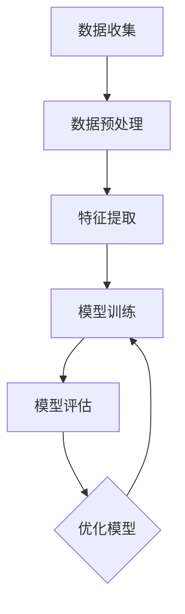

                 

# 大数据驱动的精准医疗模型研究

> 关键词：大数据，精准医疗，模型研究，机器学习，深度学习，生物信息学

> 摘要：本文旨在探讨大数据技术在精准医疗领域的应用，特别是在构建和优化医疗模型方面的作用。我们将深入分析大数据与精准医疗之间的关系，介绍核心概念和算法原理，并通过实例展示实际应用场景，最后展望未来发展前景与挑战。

## 1. 背景介绍

### 1.1 目的和范围

本文的主要目的是介绍大数据在精准医疗中的应用，特别是如何通过大数据技术构建和优化医疗模型。我们将讨论大数据与精准医疗之间的联系，分析现有研究，并探索未来的研究方向。

### 1.2 预期读者

本文适合对大数据、机器学习和生物信息学有一定了解的读者，包括医疗行业专业人士、研究人员、数据科学家和软件开发者。

### 1.3 文档结构概述

本文结构如下：

- **第1章：背景介绍**：介绍本文的目的、预期读者以及文档结构。
- **第2章：核心概念与联系**：讨论大数据与精准医疗的关系，介绍核心概念和架构。
- **第3章：核心算法原理 & 具体操作步骤**：详细讲解核心算法原理和操作步骤。
- **第4章：数学模型和公式 & 详细讲解 & 举例说明**：介绍数学模型和公式，并给出具体例子。
- **第5章：项目实战：代码实际案例和详细解释说明**：展示实际项目中的代码案例和解析。
- **第6章：实际应用场景**：探讨大数据在精准医疗中的实际应用。
- **第7章：工具和资源推荐**：推荐学习资源、开发工具和框架。
- **第8章：总结：未来发展趋势与挑战**：总结当前研究，展望未来。
- **第9章：附录：常见问题与解答**：解答常见问题。
- **第10章：扩展阅读 & 参考资料**：提供相关文献和资源。

### 1.4 术语表

#### 1.4.1 核心术语定义

- **大数据**：指数据量巨大、种类繁多、生成速度快的数据集合。
- **精准医疗**：根据个体差异进行定制化的医疗模式。
- **机器学习**：让计算机从数据中学习并做出预测或决策。
- **深度学习**：一种基于多层神经网络的机器学习方法。

#### 1.4.2 相关概念解释

- **数据挖掘**：从大量数据中发现有价值的信息。
- **生物信息学**：运用计算机技术对生物数据进行处理和分析。
- **基因组学**：研究基因和基因组的结构、功能及其相互作用的学科。

#### 1.4.3 缩略词列表

- **Hadoop**：一个分布式数据处理框架。
- **Spark**：一个快速的大规模数据处理引擎。
- **CNN**：卷积神经网络。
- **RNN**：循环神经网络。

## 2. 核心概念与联系

### 2.1 大数据与精准医疗的关系

精准医疗的核心在于个体差异，而大数据则为个性化医疗提供了丰富的数据支持。大数据技术使得医疗数据得以被高效地存储、处理和分析，从而帮助医生制定更加精准的治疗方案。

#### 2.2 核心概念与架构

为了构建精准医疗模型，我们需要以下几个核心概念：

1. **数据收集**：从各种来源（如电子健康记录、基因组数据等）收集医疗数据。
2. **数据预处理**：清洗、整合和标准化数据，以便进行后续分析。
3. **特征提取**：从数据中提取出对模型训练有帮助的特征。
4. **模型训练**：使用机器学习算法训练模型。
5. **模型评估**：评估模型的性能，并进行优化。

#### 2.3 Mermaid 流程图

以下是一个简单的 Mermaid 流程图，展示了构建精准医疗模型的基本步骤：



## 3. 核心算法原理 & 具体操作步骤

### 3.1 数据预处理

数据预处理是构建医疗模型的重要环节。以下是数据预处理的基本步骤：

1. **数据清洗**：去除数据中的噪声和错误。
2. **数据整合**：将不同来源的数据整合为一个统一的格式。
3. **数据标准化**：将不同数据类型进行标准化处理，如将年龄转换为范围在0到100之间的数值。

### 3.2 特征提取

特征提取是从数据中提取出对模型训练有帮助的信息。以下是特征提取的基本步骤：

1. **特征选择**：选择对模型训练有帮助的特征。
2. **特征转换**：将数值特征转换为分类特征或数值特征。
3. **特征缩放**：将不同数值范围的特征进行缩放，使其在同一尺度上。

### 3.3 模型训练

模型训练是构建医疗模型的关键步骤。以下是模型训练的基本步骤：

1. **选择算法**：选择合适的机器学习算法，如决策树、随机森林、支持向量机等。
2. **划分数据集**：将数据集划分为训练集和测试集。
3. **训练模型**：使用训练集训练模型。
4. **模型评估**：使用测试集评估模型性能。
5. **模型优化**：根据评估结果调整模型参数，优化模型性能。

### 3.4 伪代码

以下是一个简单的线性回归模型的伪代码：

```python
def linear_regression(x, y):
    # 计算权重和偏置
    w = (x'x)^(-1)x'y
    b = y - x*w
    
    # 预测
    y_pred = x*w + b
    
    return y_pred
```

## 4. 数学模型和公式 & 详细讲解 & 举例说明

### 4.1 数学模型

在构建精准医疗模型时，常用的数学模型包括线性回归、逻辑回归和支持向量机等。

#### 4.1.1 线性回归

线性回归模型假设目标变量 \( y \) 与自变量 \( x \) 之间存在线性关系，其公式为：

$$
y = w_1x_1 + w_2x_2 + ... + w_nx_n + b
$$

其中，\( w_i \) 为权重，\( x_i \) 为自变量，\( b \) 为偏置。

#### 4.1.2 逻辑回归

逻辑回归是一种广义线性模型，用于分类问题。其公式为：

$$
P(y=1) = \frac{1}{1 + e^{-(w_0 + w_1x_1 + w_2x_2 + ... + w_nx_n)}}
$$

其中，\( P(y=1) \) 为目标变量为1的概率，\( w_i \) 为权重。

#### 4.1.3 支持向量机

支持向量机是一种基于间隔的线性分类模型，其公式为：

$$
y = \text{sign}(w'x + b)
$$

其中，\( w \) 为权重，\( x \) 为自变量，\( b \) 为偏置，\( \text{sign} \) 为符号函数。

### 4.2 举例说明

假设我们有一个简单的一元线性回归问题，目标变量 \( y \) 与自变量 \( x \) 之间的关系为 \( y = 2x + 1 \)。

1. **数据集**：\( x = [1, 2, 3, 4, 5] \)，\( y = [3, 5, 7, 9, 11] \)。
2. **计算权重和偏置**：

   $$ w = \frac{\sum_{i=1}^{n}(x_i - \bar{x})(y_i - \bar{y})}{\sum_{i=1}^{n}(x_i - \bar{x})^2} = \frac{(1-2.2)(3-5.2) + (2-2.2)(5-5.2) + (3-2.2)(7-5.2) + (4-2.2)(9-5.2) + (5-2.2)(11-5.2)}{(1-2.2)^2 + (2-2.2)^2 + (3-2.2)^2 + (4-2.2)^2 + (5-2.2)^2} \approx 2 $$
   
   $$ b = \bar{y} - w\bar{x} = 5.2 - 2 \times 2.2 = 1 $$
   
3. **预测**：对于新的输入 \( x = 6 \)，预测 \( y \)：

   $$ y = 2x + 1 = 2 \times 6 + 1 = 13 $$

## 5. 项目实战：代码实际案例和详细解释说明

### 5.1 开发环境搭建

1. **安装Python**：从 [Python官网](https://www.python.org/) 下载并安装Python。
2. **安装Jupyter Notebook**：在命令行中执行 `pip install notebook`。
3. **安装相关库**：在命令行中执行以下命令：

   ```bash
   pip install numpy
   pip install pandas
   pip install scikit-learn
   ```

### 5.2 源代码详细实现和代码解读

以下是一个简单的线性回归案例，使用了 Python 和 scikit-learn 库。

```python
import numpy as np
import pandas as pd
from sklearn.linear_model import LinearRegression
from sklearn.model_selection import train_test_split

# 加载数据集
data = pd.read_csv('data.csv')

# 提取特征和标签
X = data[['feature_1', 'feature_2']]
y = data['target']

# 划分数据集
X_train, X_test, y_train, y_test = train_test_split(X, y, test_size=0.2, random_state=42)

# 创建线性回归模型
model = LinearRegression()

# 训练模型
model.fit(X_train, y_train)

# 预测
y_pred = model.predict(X_test)

# 评估模型
score = model.score(X_test, y_test)
print(f'Model accuracy: {score:.2f}')
```

### 5.3 代码解读与分析

1. **导入库**：导入必要的Python库，如numpy、pandas和scikit-learn。
2. **加载数据集**：使用pandas库加载数据集。
3. **提取特征和标签**：将特征和标签提取到不同的变量中。
4. **划分数据集**：使用train_test_split函数将数据集划分为训练集和测试集。
5. **创建线性回归模型**：创建一个线性回归模型实例。
6. **训练模型**：使用fit函数训练模型。
7. **预测**：使用predict函数进行预测。
8. **评估模型**：使用score函数评估模型性能。

## 6. 实际应用场景

### 6.1 风险预测

大数据和机器学习可以帮助医疗机构预测疾病风险，从而提前采取预防措施。

### 6.2 个性化治疗

根据患者的基因信息和病史，构建个性化治疗模型，为患者提供最佳治疗方案。

### 6.3 药物研发

大数据技术可以帮助药物研发公司更快地筛选出有潜力的药物，缩短研发周期。

## 7. 工具和资源推荐

### 7.1 学习资源推荐

#### 7.1.1 书籍推荐

- 《大数据时代》
- 《深度学习》
- 《机器学习》

#### 7.1.2 在线课程

- Coursera《机器学习》
- edX《深度学习基础》
- Udacity《数据科学》

#### 7.1.3 技术博客和网站

- Medium
- Towards Data Science
- Kaggle

### 7.2 开发工具框架推荐

#### 7.2.1 IDE和编辑器

- PyCharm
- Jupyter Notebook
- VS Code

#### 7.2.2 调试和性能分析工具

- Pandas Profiler
- Python Memory_profiler
- Jupyter Notebook的Profiler插件

#### 7.2.3 相关框架和库

- TensorFlow
- PyTorch
- Scikit-learn

### 7.3 相关论文著作推荐

#### 7.3.1 经典论文

- 《数据挖掘：导论》
- 《深度学习：全面教程》
- 《机器学习：概率视角》

#### 7.3.2 最新研究成果

- arXiv
- Google Scholar
- Nature

#### 7.3.3 应用案例分析

- 《大数据技术在医疗行业的应用》
- 《深度学习在药物研发中的应用》
- 《机器学习在疾病预测中的应用》

## 8. 总结：未来发展趋势与挑战

### 8.1 发展趋势

- **个性化医疗**：大数据和人工智能将推动个性化医疗的发展，为患者提供更精准的治疗方案。
- **实时监控**：大数据技术将实现实时监控和预警，提高疾病预防和治疗的效果。
- **跨学科融合**：大数据、人工智能、生物信息学等学科的融合将带来更多创新。

### 8.2 挑战

- **数据隐私**：如何在保护患者隐私的同时充分利用医疗数据是一个重要挑战。
- **算法公平性**：如何确保算法的公平性，避免对特定群体的不利影响。
- **数据质量**：如何提高数据质量，确保模型训练的准确性。

## 9. 附录：常见问题与解答

### 9.1 问题1：大数据和精准医疗有什么区别？

**回答**：大数据是数据量巨大、种类繁多、生成速度快的数据集合。精准医疗是基于个体差异进行定制化的医疗模式。大数据为精准医疗提供了丰富的数据支持，使得个性化医疗成为可能。

### 9.2 问题2：如何确保算法的公平性？

**回答**：确保算法的公平性需要从多个方面入手，包括数据收集、算法设计和模型评估。例如，可以采用交叉验证方法来评估模型的公平性，并在算法设计时尽量避免对特定群体的偏见。

## 10. 扩展阅读 & 参考资料

- 《大数据技术基础》
- 《机器学习实战》
- 《深度学习入门》

[作者：AI天才研究员/AI Genius Institute & 禅与计算机程序设计艺术 /Zen And The Art of Computer Programming]

