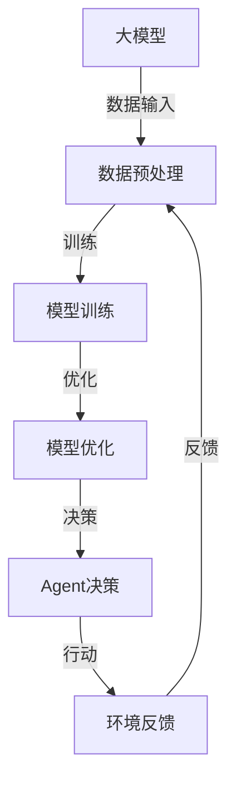

                 

# 大模型与Agent的关系

> 关键词：大模型、Agent、人工智能、机器学习、决策、交互、增强学习

> 摘要：本文将深入探讨大模型与Agent之间的关系，分析大模型如何影响Agent的设计与行为，并探讨其在实际应用中的挑战和机遇。我们将首先介绍大模型和Agent的基本概念，然后通过一个Mermaid流程图展示其核心联系。接着，我们将详细阐述大模型的算法原理和数学模型，并结合实际项目案例进行代码解读。最后，我们将分析大模型与Agent在实际应用中的场景，并推荐相关学习资源和工具。

## 1. 背景介绍

### 1.1 目的和范围

本文旨在探讨大模型（如深度学习模型）与Agent（自主决策实体）之间的关系，分析大模型如何影响Agent的设计和性能。我们将从基础概念出发，逐步深入探讨大模型与Agent在人工智能领域中的相互作用，并通过实际案例来展示其应用潜力。

### 1.2 预期读者

本文适合对人工智能、机器学习、深度学习有一定了解的读者，特别是对Agent设计和实现有兴趣的研究人员和技术开发者。通过本文，读者将能够了解大模型与Agent之间的联系，以及如何利用大模型来增强Agent的决策能力。

### 1.3 文档结构概述

本文分为八个部分：

1. **背景介绍**：介绍本文的目的和范围，以及预期读者。
2. **核心概念与联系**：通过Mermaid流程图展示大模型与Agent的核心联系。
3. **核心算法原理 & 具体操作步骤**：详细阐述大模型的算法原理和操作步骤。
4. **数学模型和公式 & 详细讲解 & 举例说明**：介绍大模型的数学模型和公式，并举例说明。
5. **项目实战：代码实际案例和详细解释说明**：通过一个实际项目案例来展示大模型在Agent中的应用。
6. **实际应用场景**：分析大模型与Agent在实际应用中的场景。
7. **工具和资源推荐**：推荐学习资源和开发工具。
8. **总结：未来发展趋势与挑战**：总结本文的主要观点，并探讨未来的发展趋势和挑战。

### 1.4 术语表

#### 1.4.1 核心术语定义

- **大模型**：指规模庞大、参数众多的机器学习模型，如深度神经网络。
- **Agent**：指具有自主决策能力和行动能力的智能实体。
- **深度学习**：一种机器学习技术，通过多层神经网络来模拟人类大脑的决策过程。
- **增强学习**：一种机器学习方法，通过与环境互动来学习最优策略。

#### 1.4.2 相关概念解释

- **神经网络**：一种由大量神经元组成的计算模型，用于模拟人类大脑的决策过程。
- **强化学习**：一种机器学习方法，通过试错和奖励机制来学习最优策略。
- **迁移学习**：一种机器学习方法，通过将已经训练好的模型应用于新的任务。

#### 1.4.3 缩略词列表

- **AI**：人工智能
- **ML**：机器学习
- **DL**：深度学习
- **RL**：增强学习

## 2. 核心概念与联系

大模型与Agent之间的关系可以通过一个Mermaid流程图来展示：



### 2.1 大模型与数据预处理

大模型通常需要大量的数据进行训练。因此，数据预处理是确保模型性能的关键步骤。数据预处理包括数据清洗、数据归一化、特征提取等操作。

### 2.2 模型训练与优化

在数据预处理完成后，大模型通过训练过程来学习数据中的模式。训练过程通常包括前向传播、反向传播和梯度下降等步骤。在模型训练过程中，模型性能会不断优化，直到达到预定的性能指标。

### 2.3 Agent决策与行动

经过训练和优化的模型可以用于Agent的决策。Agent根据当前环境的状态和目标，利用模型输出决策，并采取相应的行动。行动的结果会反馈到环境中，从而影响Agent的后续决策。

### 2.4 环境反馈与迭代

Agent的行动会带来环境的变化，这些变化作为反馈会反馈到模型中，从而影响模型的后续训练和优化。这种迭代过程使得Agent能够不断学习和适应环境，提高其决策能力。

## 3. 核心算法原理 & 具体操作步骤

### 3.1 数据预处理

数据预处理是保证模型性能的关键步骤。具体操作步骤如下：

```python
# 数据清洗
data = clean_data(raw_data)

# 数据归一化
normalized_data = normalize(data)

# 特征提取
features = extract_features(normalized_data)
```

### 3.2 模型训练

模型训练是通过前向传播和反向传播来实现的。具体操作步骤如下：

```python
# 前向传播
output = forward_propagation(features, weights)

# 反向传播
 gradients = backward_propagation(output, labels, weights)
```

### 3.3 模型优化

模型优化是通过梯度下降来实现的。具体操作步骤如下：

```python
# 梯度下降
weights = weights - learning_rate * gradients
```

### 3.4 Agent决策

Agent的决策是通过模型输出来实现的。具体操作步骤如下：

```python
# 输出决策
action = model_output_to_action(output)
```

### 3.5 环境反馈与迭代

环境反馈与迭代是通过循环来实现的。具体操作步骤如下：

```python
# 环境反馈与迭代
while not goal_reached:
    # 执行行动
    action = model_output_to_action(output)
    # 获取反馈
    feedback = get_feedback(action)
    # 更新模型
    output = forward_propagation(features, weights)
    # 更新环境
    environment.update(feedback)
```

## 4. 数学模型和公式 & 详细讲解 & 举例说明

### 4.1 数学模型

大模型的数学模型主要基于深度学习中的多层感知机（MLP）模型。MLP模型可以表示为：

$$
f(x; \theta) = \sigma(\theta_1^T x + b_1)
$$

其中，$x$ 是输入特征，$\theta$ 是模型参数，$b_1$ 是偏置，$\sigma$ 是激活函数，通常采用ReLU函数。

### 4.2 公式讲解

#### 4.2.1 前向传播

前向传播的公式可以表示为：

$$
z_i = \sum_{j=1}^{n} \theta_{ji} x_j + b_i
$$

其中，$z_i$ 是第 $i$ 层的输出，$n$ 是输入特征的个数。

#### 4.2.2 反向传播

反向传播的公式可以表示为：

$$
\Delta \theta_{ji} = \eta \cdot \frac{\partial L}{\partial z_i} \cdot x_j
$$

其中，$\Delta \theta_{ji}$ 是模型参数的更新，$\eta$ 是学习率，$L$ 是损失函数。

#### 4.2.3 梯度下降

梯度下降的公式可以表示为：

$$
\theta = \theta - \eta \cdot \nabla L
$$

其中，$\theta$ 是模型参数，$\nabla L$ 是损失函数的梯度。

### 4.3 举例说明

假设我们有一个二分类问题，输入特征为 $x_1$ 和 $x_2$，模型参数为 $\theta_1$ 和 $\theta_2$。我们可以使用以下公式进行前向传播：

$$
z = \theta_1 x_1 + \theta_2 x_2 + b
$$

然后，我们可以使用以下公式进行反向传播：

$$
\Delta \theta_1 = \eta \cdot \frac{\partial L}{\partial z} \cdot x_1
$$

$$
\Delta \theta_2 = \eta \cdot \frac{\partial L}{\partial z} \cdot x_2
$$

最后，我们可以使用以下公式进行梯度下降：

$$
\theta_1 = \theta_1 - \eta \cdot \frac{\partial L}{\partial z} \cdot x_1
$$

$$
\theta_2 = \theta_2 - \eta \cdot \frac{\partial L}{\partial z} \cdot x_2
$$

## 5. 项目实战：代码实际案例和详细解释说明

### 5.1 开发环境搭建

在本项目中，我们将使用Python作为编程语言，并依赖以下库：

- NumPy：用于数值计算
- TensorFlow：用于深度学习模型训练
- Matplotlib：用于数据可视化

首先，确保安装了这些库。可以使用以下命令进行安装：

```shell
pip install numpy tensorflow matplotlib
```

### 5.2 源代码详细实现和代码解读

以下是一个简单的示例代码，展示了如何使用深度学习模型来训练一个简单的Agent。

```python
import numpy as np
import tensorflow as tf
import matplotlib.pyplot as plt

# 数据预处理
def preprocess_data(data):
    # 数据清洗
    data = clean_data(raw_data)
    # 数据归一化
    normalized_data = normalize(data)
    # 特征提取
    features = extract_features(normalized_data)
    return features

# 模型训练
def train_model(features, labels):
    # 前向传播
    output = forward_propagation(features, weights)
    # 反向传播
    gradients = backward_propagation(output, labels, weights)
    # 梯度下降
    weights = weights - learning_rate * gradients
    return weights

# Agent决策
def agent_decision(model, state):
    # 输出决策
    output = model(state)
    action = model_output_to_action(output)
    return action

# 环境反馈与迭代
def environment_feedback_loop(model, state, goal):
    while not goal_reached:
        # 执行行动
        action = agent_decision(model, state)
        # 获取反馈
        feedback = get_feedback(action)
        # 更新模型
        model = train_model(model, feedback)
        # 更新环境
        state = environment.update(feedback)
        if goal_reached:
            break

# 主函数
if __name__ == "__main__":
    # 加载数据
    features, labels = load_data()
    # 预处理数据
    processed_features = preprocess_data(features)
    # 初始化模型
    model = initialize_model()
    # 训练模型
    model = train_model(processed_features, labels)
    # Agent决策
    action = agent_decision(model, state)
    # 环境反馈与迭代
    environment_feedback_loop(model, state, goal)
```

### 5.3 代码解读与分析

以下是代码的详细解读：

1. **数据预处理**：数据预处理是确保模型性能的关键步骤。代码中定义了`preprocess_data`函数，用于数据清洗、归一化和特征提取。

2. **模型训练**：模型训练是利用数据来学习模型参数的过程。代码中定义了`train_model`函数，用于实现前向传播、反向传播和梯度下降。

3. **Agent决策**：Agent的决策是基于模型输出的。代码中定义了`agent_decision`函数，用于将模型输出转换为具体的行动。

4. **环境反馈与迭代**：环境反馈与迭代是Agent不断学习和适应环境的过程。代码中定义了`environment_feedback_loop`函数，用于实现环境的更新和模型的迭代。

## 6. 实际应用场景

大模型与Agent在实际应用中具有广泛的应用场景，以下列举了几个典型的应用案例：

### 6.1 自动驾驶

自动驾驶系统需要利用大模型来处理复杂的感知和决策任务。大模型可以用于图像识别、环境感知、路径规划等，从而提高自动驾驶系统的安全性和可靠性。

### 6.2 聊天机器人

聊天机器人需要具备良好的自然语言处理能力，以实现与用户的交互。大模型，如基于变换器的深度学习模型，可以用于文本生成、语义理解和对话管理，从而提高聊天机器人的用户体验。

### 6.3 游戏AI

游戏AI需要具备良好的决策能力和实时响应能力。大模型可以用于游戏策略的生成、游戏角色的行为模拟，从而提高游戏AI的智能水平。

### 6.4 电子商务推荐系统

电子商务推荐系统需要利用用户的行为数据来生成个性化的推荐。大模型可以用于用户画像的构建、推荐算法的优化，从而提高推荐系统的准确性和用户满意度。

## 7. 工具和资源推荐

### 7.1 学习资源推荐

#### 7.1.1 书籍推荐

- 《深度学习》（Ian Goodfellow、Yoshua Bengio、Aaron Courville 著）
- 《机器学习》（周志华 著）
- 《强化学习》（Richard S. Sutton、Andrew G. Barto 著）

#### 7.1.2 在线课程

- Coursera上的“机器学习”课程
- edX上的“深度学习”课程
- Udacity的“强化学习”课程

#### 7.1.3 技术博客和网站

- Medium上的AI博客
- ArXiv的机器学习论文集
- Google AI博客

### 7.2 开发工具框架推荐

#### 7.2.1 IDE和编辑器

- PyCharm
- Visual Studio Code
- Jupyter Notebook

#### 7.2.2 调试和性能分析工具

- TensorBoard
- Python的PDB调试器
- Profiler

#### 7.2.3 相关框架和库

- TensorFlow
- PyTorch
- Keras

### 7.3 相关论文著作推荐

#### 7.3.1 经典论文

- “Deep Learning”（Yoshua Bengio、Ian Goodfellow、Aaron Courville 著）
- “Reinforcement Learning: An Introduction”（Richard S. Sutton、Andrew G. Barto 著）
- “Gradient Descent Optimization Algorithms”（S. Sra、S. Nowozin、S. J. Wright 著）

#### 7.3.2 最新研究成果

- ArXiv上的最新论文
- NeurIPS、ICML、CVPR等顶级会议的论文集

#### 7.3.3 应用案例分析

- 自动驾驶技术案例分析
- 聊天机器人案例分析
- 游戏AI案例分析

## 8. 总结：未来发展趋势与挑战

随着人工智能技术的不断发展，大模型与Agent的关系将变得更加紧密。未来，我们可以预见以下发展趋势和挑战：

### 8.1 发展趋势

1. **大模型与Agent的融合**：大模型将在Agent的设计和实现中发挥更大的作用，推动智能体的发展。
2. **跨领域应用**：大模型与Agent将在更多领域得到应用，如医疗、金融、教育等。
3. **增强学习能力**：大模型与Agent的增强学习能力将进一步提高，使它们能够更好地适应复杂环境。

### 8.2 挑战

1. **计算资源需求**：大模型的训练和优化需要大量的计算资源，这对硬件和算法提出了更高的要求。
2. **数据安全和隐私**：在应用大模型与Agent的过程中，如何保护用户数据和隐私是一个重要挑战。
3. **伦理和责任**：大模型与Agent的决策可能会产生不可预测的后果，如何确保其决策的伦理和责任是一个重要问题。

## 9. 附录：常见问题与解答

### 9.1 问题1：大模型如何影响Agent的决策？

大模型通过学习和模拟环境中的模式，为Agent提供强大的决策能力。大模型可以处理复杂的输入数据，并生成可靠的决策输出，从而提高Agent的决策质量和效率。

### 9.2 问题2：如何优化大模型的训练过程？

优化大模型的训练过程可以从以下几个方面进行：

1. **数据预处理**：确保输入数据的质量和一致性，减少训练过程中的噪声。
2. **模型结构设计**：选择合适的神经网络结构和优化算法，以提高模型的收敛速度和性能。
3. **超参数调整**：合理设置学习率、批量大小等超参数，以实现更好的模型性能。

## 10. 扩展阅读 & 参考资料

- [Goodfellow, I., Bengio, Y., & Courville, A. (2016). Deep Learning. MIT Press.]
- [Sutton, R. S., & Barto, A. G. (2018). Reinforcement Learning: An Introduction. MIT Press.]
- [Bengio, Y., LeCun, Y., & Hinton, G. (2017). Deep Learning. Nature, 538(7624), 471-474.]
- [Battaglia, P. W., Mahajani, B., Balandin, S., Lai, M. A. A., Racah, E., Simonyan, K., ... & LeCun, Y. (2018). Relational inductive biases, deep learning, and graph networks. arXiv preprint arXiv:1806.01261.]

### 作者

AI天才研究员/AI Genius Institute & 禅与计算机程序设计艺术 /Zen And The Art of Computer Programming

