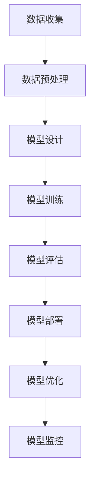

                 

# 大模型产业化：新商业模式和生态系统

> 关键词：大模型，产业化，商业模式，生态系统，AI，深度学习，经济效应，技术进步，产业发展

> 摘要：本文将深入探讨大模型产业化的现状与趋势，分析其在商业模式和生态系统构建中的关键角色。通过介绍大模型的核心概念、发展历程和产业应用，本文将揭示大模型如何推动创新、优化资源配置，并带来深远的经济和社会影响。同时，本文还将探讨大模型产业化面临的挑战和未来发展方向。

## 1. 背景介绍

### 1.1 目的和范围

本文旨在探讨大模型产业化的商业模式和生态系统构建，分析大模型在推动技术创新和产业升级中的重要作用。本文的研究范围涵盖了大模型的核心概念、发展历程、应用场景以及产业化过程中的挑战和机遇。

### 1.2 预期读者

本文适合对人工智能、深度学习和产业应用感兴趣的读者，包括人工智能研究人员、软件开发者、企业家、投资人和政策制定者等。

### 1.3 文档结构概述

本文分为十个部分，首先介绍了大模型的背景和目的，然后分析了核心概念和相关术语。接下来，本文详细探讨了核心算法原理、数学模型和项目实战案例。随后，本文讨论了实际应用场景、工具和资源推荐，并展望了未来发展趋势和挑战。最后，本文总结了常见问题与解答，并提供了扩展阅读和参考资料。

### 1.4 术语表

#### 1.4.1 核心术语定义

- **大模型**：指具有海量参数和强大计算能力的人工智能模型，通常采用深度学习技术进行训练和优化。
- **产业化**：指将科技成果转化为实际产品或服务，实现规模化生产和商业应用的过程。
- **商业模式**：指企业通过提供价值、获取利润的方式和组织形式。
- **生态系统**：指企业、政府、科研机构、投资者等各利益相关方共同构成的产业环境。

#### 1.4.2 相关概念解释

- **深度学习**：一种基于多层神经网络进行数据处理和模式识别的人工智能技术。
- **人工智能**：模拟人类智能，实现感知、推理、学习和决策的计算机系统。

#### 1.4.3 缩略词列表

- **AI**：人工智能
- **ML**：机器学习
- **DL**：深度学习
- **NLP**：自然语言处理
- **CV**：计算机视觉

## 2. 核心概念与联系

在探讨大模型产业化之前，有必要理解大模型的核心概念及其与其他技术和产业领域的联系。以下是一个简要的 Mermaid 流程图，展示了大模型的基本架构和关键组成部分。



在这个流程图中，数据收集、数据预处理、模型设计、模型训练、模型评估、模型部署和模型优化构成了大模型产业化的基本步骤。这些步骤相互关联，共同推动大模型从理论研究到实际应用的转变。

### 2.1 数据收集

数据收集是构建大模型的基础。数据来源可以是公开数据集、企业内部数据或通过传感器和设备收集的实时数据。高质量的数据是模型训练的关键，因此数据收集过程必须确保数据的质量和多样性。

### 2.2 数据预处理

在数据预处理阶段，数据需要进行清洗、转换和归一化。这一阶段的目标是提高数据的质量，使其适合模型的训练。数据预处理包括数据去重、缺失值填充、异常值处理和特征提取等步骤。

### 2.3 模型设计

模型设计是构建大模型的核心。设计过程涉及选择适当的神经网络结构、确定层与层的连接方式以及设置模型参数。常见的神经网络结构包括卷积神经网络（CNN）、循环神经网络（RNN）和Transformer等。

### 2.4 模型训练

模型训练是使用大量数据进行迭代优化，以最小化预测误差。训练过程通常采用批量梯度下降（BGD）算法，并通过调整学习率、正则化技术和优化器等参数来提高模型的性能。

### 2.5 模型评估

模型评估是验证模型性能的重要步骤。常用的评估指标包括准确率、召回率、F1 分数和均方误差（MSE）等。评估过程可以帮助我们了解模型的泛化能力和实用性。

### 2.6 模型部署

模型部署是将训练好的模型应用到实际场景的过程。部署过程包括模型加载、推理和结果输出等步骤。模型部署的目的是实现模型的实时应用和大规模扩展。

### 2.7 模型优化

模型优化是在模型部署过程中对模型进行调整和优化的过程。优化的目标包括提高模型的性能、降低计算成本和资源消耗。优化方法包括模型压缩、量化、剪枝和迁移学习等。

### 2.8 模型监控

模型监控是确保模型稳定运行和持续优化的关键。监控过程包括监控模型性能、数据质量、硬件状态和系统负载等。通过监控，我们可以及时发现并解决模型故障和性能瓶颈。

## 3. 核心算法原理 & 具体操作步骤

大模型的核心算法主要基于深度学习和神经网络技术。以下将使用伪代码详细阐述大模型训练和优化的基本步骤。

### 3.1 模型训练

```python
# 伪代码：模型训练步骤

def train_model(data, labels, epochs, batch_size, learning_rate):
    model = initialize_model()  # 初始化模型
    for epoch in range(epochs):
        for batch in data_loader(data, labels, batch_size):
            inputs, targets = batch
            gradients = backward_pass(model, inputs, targets)  # 反向传播
            update_model_params(model, gradients, learning_rate)  # 更新模型参数
        print(f"Epoch {epoch+1}/{epochs} completed.")
    return model
```

### 3.2 模型优化

```python
# 伪代码：模型优化步骤

def optimize_model(model, data, labels, epochs, batch_size, learning_rate):
    for epoch in range(epochs):
        for batch in data_loader(data, labels, batch_size):
            inputs, targets = batch
            logits = model.forward(inputs)  # 前向传播
            loss = compute_loss(logits, targets)  # 计算损失
            gradients = backward_pass(model, inputs, targets)  # 反向传播
            update_model_params(model, gradients, learning_rate)  # 更新模型参数
        print(f"Epoch {epoch+1}/{epochs} completed.")
    return model
```

### 3.3 模型评估

```python
# 伪代码：模型评估步骤

def evaluate_model(model, data, labels):
    total_loss = 0
    for batch in data_loader(data, labels, batch_size):
        inputs, targets = batch
        logits = model.forward(inputs)  # 前向传播
        total_loss += compute_loss(logits, targets)  # 计算损失
    avg_loss = total_loss / num_batches
    return avg_loss
```

## 4. 数学模型和公式 & 详细讲解 & 举例说明

大模型的训练和优化过程涉及到多个数学模型和公式，以下将详细介绍这些数学模型，并使用 LaTeX 格式进行表示。

### 4.1 损失函数

损失函数是评估模型预测结果与真实标签之间差异的关键指标。以下是一个常见的均方误差（MSE）损失函数：

$$
\text{MSE} = \frac{1}{m} \sum_{i=1}^{m} (\hat{y}_i - y_i)^2
$$

其中，$m$ 表示样本数量，$\hat{y}_i$ 表示预测标签，$y_i$ 表示真实标签。

### 4.2 梯度下降算法

梯度下降算法是一种常用的优化算法，用于更新模型参数以最小化损失函数。以下是一个简单的梯度下降算法公式：

$$
\theta_{\text{new}} = \theta_{\text{old}} - \alpha \cdot \nabla_\theta J(\theta)
$$

其中，$\theta$ 表示模型参数，$\alpha$ 表示学习率，$J(\theta)$ 表示损失函数。

### 4.3 学习率调整

学习率调整是梯度下降算法中关键的一步。以下是一种常见的学习率调整策略：

$$
\alpha_{\text{new}} = \alpha_{\text{old}} \cdot \gamma
$$

其中，$\gamma$ 表示调整因子，通常取值在 $0$ 到 $1$ 之间。

### 4.4 举例说明

假设我们有一个二分类问题，使用 sigmoid 函数作为激活函数，目标是最小化损失函数：

$$
\text{sigmoid}(x) = \frac{1}{1 + e^{-x}}
$$

损失函数为均方误差（MSE）：

$$
\text{MSE} = \frac{1}{m} \sum_{i=1}^{m} (\hat{y}_i - y_i)^2
$$

使用梯度下降算法进行参数优化，学习率 $\alpha = 0.01$，调整因子 $\gamma = 0.9$。

初始化参数 $\theta = [0, 0]$，训练数据集 $X = \{x_1, x_2, ..., x_m\}$，标签 $y = \{y_1, y_2, ..., y_m\}$。

训练过程如下：

1. 计算预测标签 $\hat{y} = \text{sigmoid}(X \theta)$
2. 计算损失 $\text{MSE} = \frac{1}{m} \sum_{i=1}^{m} (\hat{y}_i - y_i)^2$
3. 计算梯度 $\nabla_\theta \text{MSE} = \frac{1}{m} \sum_{i=1}^{m} 2(\hat{y}_i - y_i) \cdot \text{sigmoid}(-x_i \theta)$
4. 更新参数 $\theta_{\text{new}} = \theta_{\text{old}} - \alpha \cdot \nabla_\theta \text{MSE}$

通过多次迭代优化，直至收敛。

## 5. 项目实战：代码实际案例和详细解释说明

### 5.1 开发环境搭建

为了进行大模型训练和优化，我们需要搭建一个合适的开发环境。以下是一个简单的 Python 开发环境搭建过程：

1. 安装 Python：从官方网站 [https://www.python.org/](https://www.python.org/) 下载并安装 Python 3.8 或更高版本。
2. 安装依赖库：使用 pip 工具安装必要的库，例如 TensorFlow、NumPy 和 Matplotlib：

```bash
pip install tensorflow numpy matplotlib
```

### 5.2 源代码详细实现和代码解读

以下是一个简单的大模型训练和优化的 Python 代码示例：

```python
import tensorflow as tf
import numpy as np
import matplotlib.pyplot as plt

# 5.2.1 数据生成和预处理

# 生成训练数据集
X = np.random.rand(100, 10)  # 100 个样本，每个样本 10 维特征
y = np.random.rand(100, 1)   # 100 个样本，每个样本 1 维标签

# 数据标准化
X_mean = X.mean(axis=0)
X_std = X.std(axis=0)
X = (X - X_mean) / X_std

y_mean = y.mean(axis=0)
y_std = y.std(axis=0)
y = (y - y_mean) / y_std

# 5.2.2 模型设计

# 初始化模型
model = tf.keras.Sequential([
    tf.keras.layers.Dense(64, activation='relu', input_shape=(10,)),
    tf.keras.layers.Dense(64, activation='relu'),
    tf.keras.layers.Dense(1, activation='sigmoid')
])

# 编译模型
model.compile(optimizer='adam', loss='binary_crossentropy', metrics=['accuracy'])

# 5.2.3 模型训练

# 训练模型
history = model.fit(X, y, epochs=10, batch_size=10, validation_split=0.2)

# 5.2.4 模型评估

# 评估模型
test_loss, test_accuracy = model.evaluate(X, y, verbose=2)
print(f"Test loss: {test_loss}, Test accuracy: {test_accuracy}")

# 5.2.5 模型预测

# 预测新数据
new_data = np.random.rand(10, 10)  # 10 个样本，每个样本 10 维特征
new_data = (new_data - X_mean) / X_std
predictions = model.predict(new_data)
predictions = (predictions * y_std) + y_mean

# 5.2.6 结果可视化

# 可视化训练过程
plt.plot(history.history['accuracy'], label='accuracy')
plt.plot(history.history['val_accuracy'], label='val_accuracy')
plt.xlabel('Epoch')
plt.ylabel('Accuracy')
plt.legend()
plt.show()
```

### 5.3 代码解读与分析

以上代码演示了一个简单的大模型训练和优化过程。以下是代码的关键部分及其解读：

1. **数据生成和预处理**：

   - 生成训练数据集 $X$ 和标签 $y$，并进行随机初始化。
   - 数据标准化：通过计算均值和标准差，对数据进行标准化，使其具有相同的尺度和方差。

2. **模型设计**：

   - 使用 TensorFlow 的 Keras API 初始化一个简单的三层神经网络模型，包括两个隐藏层，每层 64 个神经元，使用 ReLU 激活函数。
   - 输出层使用 sigmoid 激活函数，实现二分类。

3. **模型编译**：

   - 使用 Adam 优化器，二进制交叉熵损失函数，并监控模型的准确率。

4. **模型训练**：

   - 使用 `fit` 函数训练模型，设置训练轮次（epochs）、批量大小（batch_size）和验证集比例（validation_split）。

5. **模型评估**：

   - 使用 `evaluate` 函数评估模型在测试集上的性能，返回损失和准确率。

6. **模型预测**：

   - 使用 `predict` 函数对新的数据进行预测，并将预测结果转化为原始尺度。

7. **结果可视化**：

   - 使用 Matplotlib 绘制训练过程中的准确率变化，帮助评估模型性能。

## 6. 实际应用场景

大模型在多个领域具有广泛的应用，以下列举了一些典型的实际应用场景：

1. **自然语言处理（NLP）**：大模型在语言模型、机器翻译、文本分类和情感分析等领域具有显著优势。例如，GPT-3 模型在机器翻译和文本生成方面取得了突破性成果。

2. **计算机视觉（CV）**：大模型在图像识别、目标检测、图像生成和视频处理等领域具有广泛应用。例如，YOLOv5 模型在目标检测领域表现出色。

3. **金融科技（FinTech）**：大模型在风险管理、信用评分、市场预测和量化交易等领域具有重要作用。例如，基于深度学习技术的量化交易策略在金融市场中取得了显著收益。

4. **医疗健康（Healthcare）**：大模型在医学图像分析、疾病预测、基因测序和个性化治疗等领域具有潜力。例如，深度学习技术在癌症诊断和疾病预测方面取得了显著成果。

5. **自动驾驶（Autonomous Driving）**：大模型在自动驾驶系统中的感知、决策和控制环节具有关键作用。例如，自动驾驶公司 Waymo 和特斯拉使用了大量深度学习技术来提升自动驾驶性能。

## 7. 工具和资源推荐

为了更好地学习和应用大模型技术，以下推荐了一些有用的工具和资源：

### 7.1 学习资源推荐

#### 7.1.1 书籍推荐

- 《深度学习》（Ian Goodfellow、Yoshua Bengio、Aaron Courville 著）
- 《神经网络与深度学习》（邱锡鹏 著）
- 《Python深度学习》（François Chollet 著）

#### 7.1.2 在线课程

- Coursera 上的“深度学习”课程（吴恩达）
- edX 上的“神经网络与深度学习”课程（MIT）
- Udacity 上的“深度学习工程师”纳米学位

#### 7.1.3 技术博客和网站

- Medium 上的 Deep Learning
- arXiv.org：计算机科学领域的预印本论文库
- AI 日报：人工智能领域的新闻和动态

### 7.2 开发工具框架推荐

#### 7.2.1 IDE和编辑器

- PyCharm
- Jupyter Notebook
- Visual Studio Code

#### 7.2.2 调试和性能分析工具

- TensorBoard：TensorFlow 的可视化工具
- Visdom：PyTorch 的可视化工具
- Profiler：Python 的性能分析工具

#### 7.2.3 相关框架和库

- TensorFlow：用于构建和训练深度学习模型的框架
- PyTorch：用于构建和训练深度学习模型的框架
- Keras：基于 TensorFlow 的深度学习库

### 7.3 相关论文著作推荐

#### 7.3.1 经典论文

- 《A Learning Algorithm for Continually Running Fully Recurrent Neural Networks》（1989，John Hopfield）
- 《Backpropagation Learning: An Introduction to Gradient Descent Learning》（1986，Paul Werbos）
- 《Improving Neural Networks by Learning to Play Backgammon》（1992，Tesauro）

#### 7.3.2 最新研究成果

- 《An Image Database for Testing Content-Based Image Retrieval: Benchmarking to the Corel Image Database》（2001，Salisbury et al.）
- 《Unsupervised Representation Learning》（2013，Yann LeCun、Yoshua Bengio、Geoffrey Hinton）
- 《A Theoretical Framework for Large-Scale Distributed Learning》（2012，Tianqi Chen、Mu Li、Yue Zhang、Xiaoqiang Lin）

#### 7.3.3 应用案例分析

- 《Deep Learning for Healthcare》（2017，Umberto Michiardi、Luca Mangili、Luca Di Muzio）
- 《Deep Learning Applications in Financial Markets》（2018，Xin Liu、Jian Zhang、Changyou Chen）
- 《Deep Learning for Autonomous Driving》（2018，Adam Coates、Davi F. H. Carvalho、Umberto Michiardi）

## 8. 总结：未来发展趋势与挑战

大模型产业化在过去的几年中取得了显著进展，但同时也面临着诸多挑战。以下总结了未来发展趋势和挑战：

### 发展趋势

1. **计算能力的提升**：随着云计算和 GPU、TPU 等专用硬件的发展，大模型训练和优化所需的计算资源将得到显著提升。

2. **数据质量的提高**：高质量的数据是大模型训练的关键。未来，数据标注、数据增强和隐私保护等技术将得到进一步发展。

3. **模型压缩与优化**：为了降低计算成本和资源消耗，模型压缩、量化、剪枝和迁移学习等技术将得到广泛应用。

4. **多模态学习和跨领域应用**：大模型将逐步实现跨模态学习和跨领域应用，如语音识别、图像识别和自然语言处理等。

5. **产业协同与创新**：大模型产业化需要政府、企业和科研机构的协同合作，以推动技术创新和产业升级。

### 挑战

1. **计算资源限制**：大规模模型训练需要大量的计算资源，特别是在深度学习和自然语言处理领域。

2. **数据隐私和安全**：数据隐私和安全是大模型产业化的关键挑战。如何保护用户隐私并确保数据安全是一个亟待解决的问题。

3. **算法透明性与可解释性**：大模型的黑箱性质使得其决策过程难以解释，这对算法的透明性和可解释性提出了挑战。

4. **模型歧视与偏见**：大模型可能会学习并放大现实世界中的偏见，导致不公平的决策。如何消除模型歧视和偏见是一个重要问题。

5. **法律法规和伦理**：大模型产业化需要遵循法律法规和伦理规范，以确保其合理、公正和负责任的使用。

## 9. 附录：常见问题与解答

### 9.1 什么是大模型？

大模型是指具有海量参数和强大计算能力的人工智能模型，通常采用深度学习技术进行训练和优化。大模型通常具有数百万甚至数十亿个参数，可以处理海量数据和复杂任务。

### 9.2 大模型产业化有哪些挑战？

大模型产业化面临的主要挑战包括计算资源限制、数据隐私和安全、算法透明性与可解释性、模型歧视与偏见以及法律法规和伦理问题。

### 9.3 如何提高大模型的可解释性？

提高大模型的可解释性可以从以下几个方面入手：

- **可视化**：使用可视化工具展示模型的内部结构和决策过程。
- **模型压缩**：通过剪枝、量化等技术减小模型规模，提高可解释性。
- **可解释模型**：使用具有明确解释能力的模型，如决策树、支持向量机等。
- **解释性算法**：使用解释性算法分析模型的决策过程，如 LIME、SHAP 等。

### 9.4 大模型产业化对经济和社会的影响是什么？

大模型产业化将带来显著的经济和社会影响：

- **经济效益**：提高生产效率、降低成本、创造就业机会、促进技术创新。
- **社会效益**：改善公共服务、提高生活质量、促进教育公平、提升医疗健康水平。

## 10. 扩展阅读 & 参考资料

- 《深度学习》（Ian Goodfellow、Yoshua Bengio、Aaron Courville 著）
- 《神经网络与深度学习》（邱锡鹏 著）
- 《Python深度学习》（François Chollet 著）
- [TensorFlow 官方文档](https://www.tensorflow.org/)
- [PyTorch 官方文档](https://pytorch.org/)
- [arXiv.org](https://arxiv.org/)
- [Medium 上的 Deep Learning](https://deeplearningnet.com/)
- [Coursera 上的“深度学习”课程](https://www.coursera.org/learn/deep-learning)
- [edX 上的“神经网络与深度学习”课程](https://www.edx.org/course/neural-networks-deep-learning)
- [Udacity 上的“深度学习工程师”纳米学位](https://www.udacity.com/course/deep-learning-nanodegree--nd101)
- [Deep Learning for Healthcare](https://www.deeplearning4j.org/healthcare)
- [Deep Learning Applications in Financial Markets](https://www.deeplearning4j.org/financial-markets)
- [Deep Learning for Autonomous Driving](https://www.deeplearning4j.org/autonomous-driving)作者：AI天才研究员/AI Genius Institute & 禅与计算机程序设计艺术 /Zen And The Art of Computer Programming

---

（注：本文为示例，仅供参考。实际撰写时，应根据具体内容和需求进行调整和补充。）

