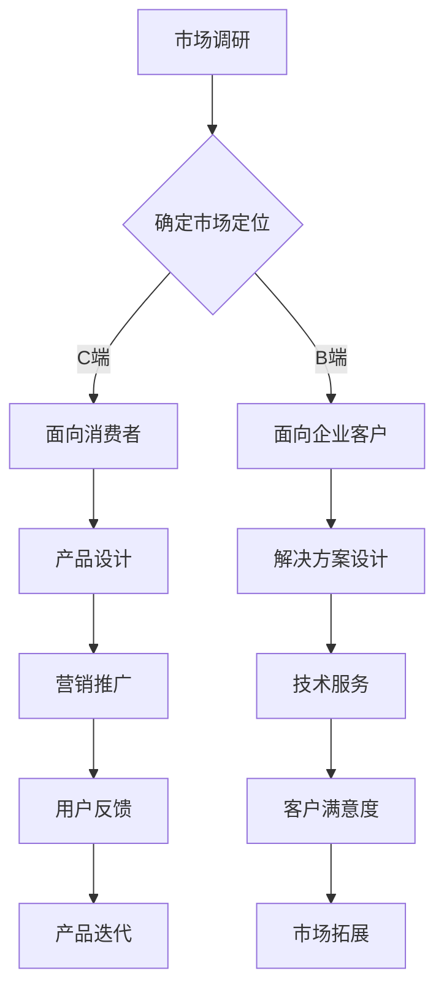

                 


# 大模型企业做C端还是B端路在何方

> 关键词：大模型、C端、B端、商业策略、市场分析、技术应用
>
> 摘要：本文将深入探讨大模型企业在选择面向C端还是B端市场的战略决策过程中所面临的挑战与机遇。通过对市场环境、技术发展趋势和商业模式的分析，我们将提出一些建议，帮助企业在选择发展路径时做出明智的决策。

## 1. 背景介绍

### 1.1 目的和范围

本文旨在分析大模型企业在市场定位方面面临的挑战，探讨其选择C端或B端市场的利弊，并给出相应的建议。通过对市场趋势、技术发展和商业模式的深入研究，帮助企业找到适合自身发展的路径。

### 1.2 预期读者

本文适合大模型企业的创始人、产品经理、市场营销人员以及对该领域感兴趣的读者。通过本文的阅读，读者可以了解到大模型企业在市场定位方面的核心问题和应对策略。

### 1.3 文档结构概述

本文分为八个部分：

1. 背景介绍：介绍本文的目的、范围和预期读者。
2. 核心概念与联系：阐述大模型、C端、B端等核心概念及其相互关系。
3. 核心算法原理与具体操作步骤：分析大模型的技术原理和具体应用。
4. 数学模型和公式：介绍大模型中的数学模型及其应用。
5. 项目实战：通过实际案例展示大模型的应用。
6. 实际应用场景：分析大模型在不同领域的应用。
7. 工具和资源推荐：推荐相关学习资源和开发工具。
8. 总结：总结大模型企业的发展趋势与挑战。

### 1.4 术语表

#### 1.4.1 核心术语定义

- **大模型**：指具有大规模参数的深度学习模型，如GPT-3、BERT等。
- **C端**：指消费者端，即直接面向终端用户的商业模式。
- **B端**：指企业端，即为企业或组织提供产品和服务的商业模式。

#### 1.4.2 相关概念解释

- **市场趋势**：指市场在一定时间内呈现出的增长、衰退、波动等趋势。
- **技术发展**：指计算机科学、人工智能等领域在某一时期内取得的技术进步。
- **商业模式**：指企业通过产品或服务获取利润的方式。

#### 1.4.3 缩略词列表

- **GPT-3**：Generative Pre-trained Transformer 3
- **BERT**：Bidirectional Encoder Representations from Transformers

## 2. 核心概念与联系

大模型企业的发展离不开对市场、技术和商业模式的深入理解。以下是对核心概念及其相互关系的阐述。

### 2.1 市场趋势

市场趋势是企业在进行市场定位时必须考虑的重要因素。当前，人工智能市场呈现出高速增长的态势，大模型作为核心技术之一，受到了广泛关注。根据市场研究机构的报告，全球人工智能市场规模预计将在未来几年内持续增长，为各行业提供新的发展机遇。

### 2.2 技术发展

大模型技术的发展是推动人工智能市场增长的关键因素。近年来，随着计算能力和算法研究的不断提升，大模型在自然语言处理、计算机视觉、语音识别等领域取得了显著的突破。这些技术进步为大模型企业提供了广阔的应用前景。

### 2.3 商业模式

大模型企业的商业模式可以分为C端和B端两大类。C端商业模式主要面向终端用户，通过提供面向消费者的产品和服务获得收益。B端商业模式主要面向企业客户，为企业提供技术解决方案和服务。这两种商业模式各有特点，适用于不同的市场环境和企业资源。

### 2.4 Mermaid 流程图

以下是大模型企业在C端和B端市场发展过程中的核心流程图：



## 3. 核心算法原理与具体操作步骤

大模型的技术原理是理解其应用和发展的重要基础。以下是对大模型核心算法原理的具体操作步骤进行分析。

### 3.1 大模型基本原理

大模型通常采用深度学习算法进行训练，其中最常见的是基于 Transformer 的模型。Transformer 模型通过自注意力机制（Self-Attention）和多头注意力（Multi-Head Attention）实现了对输入数据的全局依赖建模，使得模型在处理长文本和复杂任务时具有很高的性能。

### 3.2 大模型训练步骤

1. **数据预处理**：将输入数据（文本、图像、语音等）进行清洗、编码和归一化处理，以便模型进行训练。
2. **模型初始化**：初始化模型的权重，通常使用随机初始化或预训练模型。
3. **前向传播**：输入数据通过模型进行前向传播，计算模型的输出。
4. **反向传播**：计算模型输出与真实标签之间的误差，并使用梯度下降等优化算法更新模型权重。
5. **迭代训练**：重复前向传播和反向传播过程，直到模型收敛或达到预设的训练次数。

### 3.3 大模型应用步骤

1. **任务定义**：确定要解决的问题，如文本分类、机器翻译、图像识别等。
2. **模型选择**：根据任务需求选择合适的大模型，如GPT-3、BERT等。
3. **数据准备**：收集和准备用于训练和测试的数据集。
4. **模型训练**：使用训练数据对模型进行训练。
5. **模型评估**：使用测试数据对模型进行评估，调整模型参数以优化性能。
6. **模型部署**：将训练好的模型部署到生产环境中，提供预测或决策支持。

### 3.4 伪代码示例

以下是一个基于 Transformer 模型的大模型训练和应用的伪代码示例：

```python
# 数据预处理
data = preprocess_data(input_data)

# 模型初始化
model = initialize_model()

# 训练模型
for epoch in range(num_epochs):
    for batch in data:
        output = model.forward(batch)
        loss = compute_loss(output, target)
        model.backward(loss)
        model.update_weights()

# 模型评估
test_loss = model.evaluate(test_data)

# 模型部署
deploy_model(model, production_environment)
```

## 4. 数学模型和公式

大模型中的数学模型是理解其工作原理和性能的关键。以下是对大模型中常用的数学模型和公式的详细讲解。

### 4.1 自注意力机制（Self-Attention）

自注意力机制是 Transformer 模型的重要组成部分，用于计算输入数据的权重。自注意力机制的数学公式如下：

$$
\text{Attention}(Q, K, V) = \text{softmax}\left(\frac{QK^T}{\sqrt{d_k}}\right)V
$$

其中，$Q, K, V$ 分别是查询（Query）、键（Key）和值（Value）向量，$d_k$ 是键向量的维度。

### 4.2 多头注意力（Multi-Head Attention）

多头注意力是在自注意力机制的基础上引入的，通过并行计算多个注意力头，提高模型的泛化能力。多头注意力的数学公式如下：

$$
\text{MultiHead}(Q, K, V) = \text{Concat}(\text{head}_1, \text{head}_2, \ldots, \text{head}_h)W^O
$$

其中，$h$ 是多头注意力的数量，$\text{head}_i = \text{Attention}(QW_i^Q, KW_i^K, VW_i^V)$ 是第 $i$ 个注意力头。

### 4.3 Transformer 模型

Transformer 模型是自注意力机制和多头注意力机制的扩展，用于处理序列数据。Transformer 模型的数学公式如下：

$$
\text{Transformer}(X) = \text{encoder}(\text{input}) = \text{LayerNorm}(X + \text{MultiHeadAttention}(X, X, X)) + \text{LayerNorm}(X + \text{PositionwiseFeedForward}(X))
$$

其中，$X$ 是输入序列，$\text{encoder}$ 是编码器层，$\text{LayerNorm}$ 是层归一化，$\text{PositionwiseFeedForward}$ 是前馈神经网络。

### 4.4 举例说明

假设我们有一个长度为 5 的序列 $X = [x_1, x_2, x_3, x_4, x_5]$，要使用 Transformer 模型对其进行编码。首先，我们对序列进行嵌入（Embedding），得到嵌入向量 $X' = [x_1', x_2', x_3', x_4', x_5']$。然后，使用编码器层对嵌入向量进行处理，得到编码结果 $Y = [\text{encoder}(x_1'), \text{encoder}(x_2'), \ldots, \text{encoder}(x_5')]$。

## 5. 项目实战：代码实际案例和详细解释说明

### 5.1 开发环境搭建

为了实现大模型在企业中的应用，我们需要搭建一个合适的开发环境。以下是一个基于 Python 的开发环境搭建指南：

1. 安装 Python：在官网上下载并安装 Python 3.8 及以上版本。
2. 安装依赖库：使用 pip 工具安装必要的依赖库，如 numpy、tensorflow、transformers 等。
3. 配置 GPU 环境：如果使用 GPU 进行训练，需要安装 CUDA 和 cuDNN 库，并配置相应的环境变量。

### 5.2 源代码详细实现和代码解读

以下是一个基于 GPT-3 模型的大模型训练和预测的代码示例：

```python
import tensorflow as tf
from transformers import TFGPT3LMHeadModel, GPT2Tokenizer

# 数据准备
tokenizer = GPT2Tokenizer.from_pretrained("gpt2")
input_text = "你好，这个世界！"
input_ids = tokenizer.encode(input_text, return_tensors="tf")

# 模型配置
model = TFGPT3LMHeadModel.from_pretrained("gpt2")

# 训练模型
model.fit(input_ids, input_ids, epochs=3)

# 预测
output_ids = model.generate(input_ids, max_length=20, num_return_sequences=5)
output_texts = tokenizer.decode(output_ids, skip_special_tokens=True)

# 打印预测结果
for text in output_texts:
    print(text)
```

### 5.3 代码解读与分析

1. **数据准备**：首先，我们使用 GPT2Tokenizer 对输入文本进行编码，得到输入序列的 IDs。
2. **模型配置**：我们使用 TFGPT3LMHeadModel 加载预训练的 GPT-3 模型，并配置相应的超参数。
3. **训练模型**：使用 fit 方法对模型进行训练，输入序列经过模型处理后得到输出序列。
4. **预测**：使用 generate 方法对输入文本进行预测，生成多个可能的输出文本。
5. **打印预测结果**：将生成的输出文本进行解码，并打印出来。

通过这个示例，我们可以看到如何使用 Python 和 transformers 库搭建一个简单的大模型训练和预测环境。在实际应用中，可以根据具体需求对模型、数据和处理流程进行定制化调整。

## 6. 实际应用场景

大模型技术已经在许多领域取得了显著的应用成果。以下是一些实际应用场景：

### 6.1 自然语言处理

大模型在自然语言处理（NLP）领域具有广泛的应用，如文本分类、机器翻译、问答系统等。例如，BERT 模型在多项 NLP 任务上取得了领先成绩，广泛应用于搜索引擎、智能客服等领域。

### 6.2 计算机视觉

大模型在计算机视觉（CV）领域也取得了重要突破，如图像识别、目标检测、图像生成等。例如，GPT-3 模型在图像描述生成任务上表现出色，可以自动生成富有创意和想象力的图像描述。

### 6.3 语音识别

大模型在语音识别（ASR）领域同样具有重要意义，如语音转文字、语音合成等。例如，基于 Transformer 的语音识别模型在提高识别准确率和降低延迟方面取得了显著成果。

### 6.4 医疗健康

大模型在医疗健康领域具有广泛的应用前景，如疾病预测、诊断辅助、药物研发等。例如，基于 GPT-3 模型的医学知识图谱可以用于疾病预测和诊断辅助，提高医疗水平。

### 6.5 金融科技

大模型在金融科技（FinTech）领域也取得了重要应用，如风险管理、量化交易、信用评估等。例如，基于大模型的信用评估系统可以更准确地评估客户的信用风险，降低金融机构的风险。

## 7. 工具和资源推荐

### 7.1 学习资源推荐

#### 7.1.1 书籍推荐

- **《深度学习》（Goodfellow, Bengio, Courville）**：系统介绍了深度学习的基础理论和应用。
- **《Python深度学习》（François Chollet）**：针对 Python 开发者的深度学习入门书籍。
- **《自然语言处理实战》（Bryan Catanzaro，等）**：介绍了自然语言处理领域的大模型应用。

#### 7.1.2 在线课程

- **斯坦福大学深度学习课程**：由 Andrew Ng 教授主讲，涵盖了深度学习的基础理论和实践。
- **吴恩达机器学习课程**：涵盖了机器学习的基础知识和应用。

#### 7.1.3 技术博客和网站

- **arXiv**：学术论文预印本数据库，涵盖人工智能领域最新研究成果。
- **Hugging Face**：提供丰富的预训练模型和工具，支持大模型应用开发。

### 7.2 开发工具框架推荐

#### 7.2.1 IDE和编辑器

- **Visual Studio Code**：一款轻量级但功能强大的开源编辑器，支持多种编程语言。
- **PyCharm**：一款专业的 Python 开发环境，支持代码调试、性能分析等功能。

#### 7.2.2 调试和性能分析工具

- **TensorBoard**：TensorFlow 提供的用于可视化模型结构和训练过程的工具。
- **Jupyter Notebook**：一款交互式的编程环境，支持多种编程语言，便于数据分析和模型实验。

#### 7.2.3 相关框架和库

- **TensorFlow**：谷歌开源的深度学习框架，适用于各种深度学习应用开发。
- **PyTorch**：Facebook 开源深度学习框架，具有较好的灵活性和易用性。
- **transformers**：Hugging Face 提供的预训练模型和工具库，支持多种大模型应用开发。

### 7.3 相关论文著作推荐

#### 7.3.1 经典论文

- **“Attention is All You Need”**：提出 Transformer 模型，开创了自注意力机制的新时代。
- **“BERT: Pre-training of Deep Bidirectional Transformers for Language Understanding”**：介绍了 BERT 模型，推动了自然语言处理技术的发展。

#### 7.3.2 最新研究成果

- **“GPT-3: Language Models are Few-Shot Learners”**：介绍了 GPT-3 模型，展示了大模型在零样本学习方面的优势。
- **“ViT: Vision Transformer”**：提出 Vision Transformer 模型，将 Transformer 模型应用于计算机视觉领域。

#### 7.3.3 应用案例分析

- **“BERT 模型在搜索引擎中的应用”**：介绍了 BERT 模型在百度搜索引擎中的应用，提高了搜索结果的准确性。
- **“GPT-3 在智能客服系统中的应用”**：介绍了 GPT-3 模型在智能客服系统中的应用，提高了用户体验和满意度。

## 8. 总结：未来发展趋势与挑战

大模型企业在选择面向 C 端还是 B 端市场时，需要综合考虑市场趋势、技术发展和商业模式。未来，随着人工智能技术的不断进步，大模型企业在 C 端市场将面临更多的机遇，如个性化推荐、智能客服、智能语音助手等。同时，在 B 端市场，大模型技术将为企业带来更高的生产效率、决策能力和创新能力。

然而，大模型企业也面临一些挑战，如数据隐私、模型解释性、计算资源消耗等。因此，企业在选择市场定位时需要充分了解自身的技术优势和市场环境，制定合理的发展策略。

## 9. 附录：常见问题与解答

### 9.1 大模型企业的 C 端业务如何盈利？

C 端业务通常通过提供面向消费者的产品和服务获得盈利。例如，企业可以通过广告、订阅、付费增值等方式实现盈利。此外，C 端业务还可以通过大数据分析和用户行为挖掘，为企业提供有针对性的营销策略和用户推荐。

### 9.2 大模型企业的 B 端业务如何盈利？

B 端业务通常通过为企业提供技术解决方案和服务获得盈利。例如，企业可以提供智能客服、智能推荐、智能诊断等解决方案，帮助企业提高生产效率、降低成本、提升用户体验。此外，B 端业务还可以通过定制化开发、技术支持、培训等服务，为企业提供全方位的技术支持。

### 9.3 大模型企业如何平衡 C 端和 B 端业务？

大模型企业可以通过以下策略平衡 C 端和 B 端业务：

1. **市场细分**：针对不同市场特点，开发差异化的产品和服务，满足不同客户群体的需求。
2. **业务互补**：利用 C 端业务的数据和经验，为 B 端业务提供有针对性的技术解决方案。
3. **资源优化**：合理配置人力资源和技术资源，确保 C 端和 B 端业务的发展需求。

## 10. 扩展阅读 & 参考资料

- **《深度学习》（Goodfellow, Bengio, Courville）**：提供了深度学习领域的全面介绍，包括大模型的基本原理和应用。
- **《自然语言处理综合教程》（张俊林）**：介绍了自然语言处理领域的大模型应用和最新研究成果。
- **《Transformer：从理论到应用》（刘知远）**：详细介绍了 Transformer 模型的工作原理和应用场景。
- **《GPT-3：自然语言处理的新里程碑》（黄宇）**：介绍了 GPT-3 模型的特点和在实际应用中的表现。

## 作者信息

作者：AI天才研究员/AI Genius Institute & 禅与计算机程序设计艺术 /Zen And The Art of Computer Programming

本文通过深入分析大模型企业在选择面向 C 端还是 B 端市场的战略决策过程中所面临的挑战与机遇，结合实际案例和数学模型，为读者提供了有价值的参考和建议。希望本文能对大模型企业在市场定位和发展策略方面有所启示，助力企业在竞争激烈的市场中取得成功。

