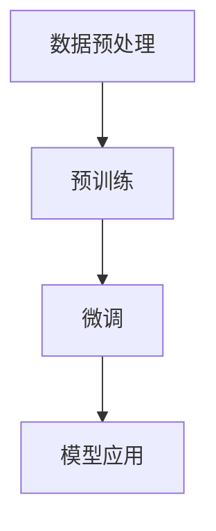
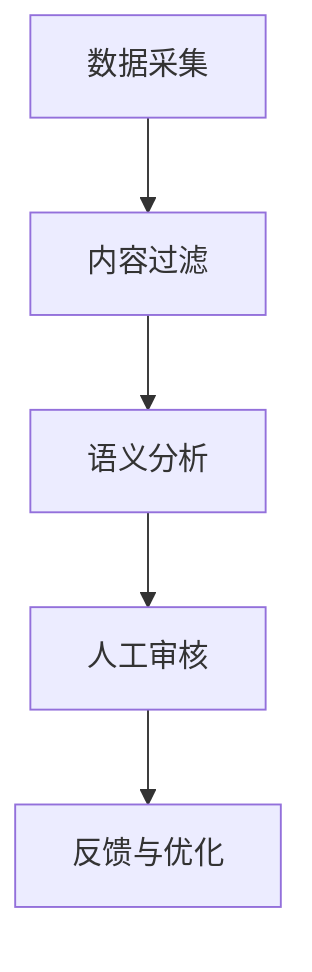

                 

# 大模型企业的内容审核挑战

> 关键词：大模型、内容审核、人工智能、机器学习、深度学习、自然语言处理、伦理、监管

> 摘要：随着大模型技术的发展，内容审核在企业中的应用日益广泛。然而，内容审核面临诸多挑战，如算法偏见、误判、用户隐私保护等。本文将深入探讨大模型企业在内容审核中遇到的挑战，分析其根本原因，并提出相应的解决策略。

## 1. 背景介绍

### 1.1 目的和范围

本文旨在分析大模型企业在内容审核过程中所面临的主要挑战，探讨这些挑战的成因，并提出相应的解决方案。内容审核在大模型技术中的应用具有重要意义，不仅关系到企业的声誉和用户信任，还影响到公共秩序和社会稳定。因此，对这一问题的深入探讨有助于提高内容审核的准确性和公平性，推动大模型技术的健康发展。

### 1.2 预期读者

本文面向对大模型技术和内容审核有一定了解的读者，包括企业研发人员、人工智能研究人员、数据科学家、技术管理人员等。通过本文的阅读，读者将能够了解大模型企业在内容审核过程中所面临的挑战，掌握解决这些挑战的方法和策略。

### 1.3 文档结构概述

本文分为十个部分，首先介绍背景和目的，然后详细阐述内容审核的核心概念、算法原理、数学模型、项目实战、实际应用场景等，最后总结未来发展趋势与挑战，并提供扩展阅读和参考资料。具体结构如下：

1. 背景介绍
2. 核心概念与联系
3. 核心算法原理 & 具体操作步骤
4. 数学模型和公式 & 详细讲解 & 举例说明
5. 项目实战：代码实际案例和详细解释说明
6. 实际应用场景
7. 工具和资源推荐
8. 总结：未来发展趋势与挑战
9. 附录：常见问题与解答
10. 扩展阅读 & 参考资料

### 1.4 术语表

#### 1.4.1 核心术语定义

- 大模型（Large Model）：具有数十亿至数万亿参数的机器学习模型，如GPT-3、BERT等。
- 内容审核（Content Moderation）：对互联网平台上的内容进行监控和过滤，移除不良信息的过程。
- 机器学习（Machine Learning）：使计算机通过数据和经验进行自我学习和预测的技术。
- 深度学习（Deep Learning）：一种基于多层神经网络进行训练的机器学习技术。
- 自然语言处理（Natural Language Processing，NLP）：使计算机能够理解和处理人类语言的技术。
- 算法偏见（Algorithmic Bias）：指算法在处理数据时表现出对某些群体的偏见。
- 误判（False Decision）：算法在内容审核过程中错误地将合法内容标记为不良信息或反之。

#### 1.4.2 相关概念解释

- 预训练（Pre-training）：在特定任务之前对模型进行大规模数据训练，使其具备一定的泛化能力。
- 微调（Fine-tuning）：在预训练模型的基础上，针对特定任务进行进一步训练。
- 监督学习（Supervised Learning）：通过带有标签的训练数据来训练模型。
- 无监督学习（Unsupervised Learning）：在没有标签的数据上进行训练。
- 半监督学习（Semi-supervised Learning）：结合有标签和无标签数据进行训练。

#### 1.4.3 缩略词列表

- AI：人工智能
- ML：机器学习
- DL：深度学习
- NLP：自然语言处理
- GPT：生成预训练变换器
- BERT：双向编码表示器
- API：应用程序编程接口
- SDK：软件开发工具包
- UI：用户界面
- UX：用户体验

## 2. 核心概念与联系

为了深入理解大模型企业在内容审核中所面临的挑战，我们需要先了解以下几个核心概念：

1. **大模型的基本原理**
2. **内容审核的技术流程**
3. **算法偏见与伦理问题**
4. **监管与合规要求**

### 2.1 大模型的基本原理

大模型，如GPT-3、BERT等，基于深度学习和自然语言处理技术，通过预训练和微调方法，能够在大规模数据集上进行训练，从而实现高度泛化的自然语言理解和生成能力。其基本原理可以概括为以下几个步骤：

1. **数据预处理**：将原始文本数据转换为模型可接受的格式，如分词、词性标注、文本清洗等。
2. **预训练**：在无监督环境下，使用大规模语料库对模型进行训练，使其学会自然语言的基本规律和表达方式。
3. **微调**：在预训练的基础上，针对特定任务（如内容审核）进行有监督的微调，以适应具体应用场景。

下面是一个简单的Mermaid流程图，展示大模型的基本原理：



### 2.2 内容审核的技术流程

内容审核是企业维护平台健康、保障用户体验的重要环节。其技术流程通常包括以下几个步骤：

1. **数据采集**：从企业平台上的各种渠道（如用户评论、帖子、视频等）收集内容数据。
2. **内容过滤**：使用自动化工具对内容进行初步筛选，去除明显的垃圾信息、恶意攻击等。
3. **语义分析**：利用大模型技术，对内容进行语义分析，识别潜在的违规内容。
4. **人工审核**：对自动审核结果进行人工复审，提高审核准确性和公正性。
5. **反馈与优化**：根据审核结果和用户反馈，不断优化审核算法和策略。

下面是一个简单的Mermaid流程图，展示内容审核的技术流程：



### 2.3 算法偏见与伦理问题

算法偏见是指算法在处理数据时，对某些群体或内容表现出不公平的倾向。在内容审核中，算法偏见可能导致以下问题：

1. **歧视性过滤**：算法错误地将某些群体的内容标记为不良信息，导致内容审查的偏见。
2. **误判**：算法可能将合法内容误判为不良信息，或反之，影响用户体验和平台声誉。
3. **隐私侵犯**：内容审核过程中，用户隐私可能受到侵犯，引发伦理和法律问题。

算法偏见的原因主要包括数据偏差、算法设计缺陷、训练数据不充分等。解决算法偏见需要从数据采集、算法设计、模型训练等多个环节进行综合治理。

### 2.4 监管与合规要求

随着人工智能技术的发展，各国政府和监管机构对内容审核的要求也越来越严格。企业需要遵守以下监管与合规要求：

1. **数据保护**：遵循《通用数据保护条例》（GDPR）等法律法规，保护用户隐私。
2. **透明性**：确保内容审核过程的透明性，方便用户了解审核标准和结果。
3. **责任追究**：明确企业在内容审核中的责任，确保平台健康、稳定运营。
4. **合规性评估**：定期对内容审核系统进行合规性评估，确保符合监管要求。

综上所述，大模型企业在内容审核过程中需要面对多个方面的挑战，包括技术实现、伦理问题、监管要求等。只有通过全面、深入的分析和解决，才能实现内容审核的高效、准确和公正。

## 3. 核心算法原理 & 具体操作步骤

### 3.1 大模型的技术原理

大模型的核心技术原理主要包括深度学习、自然语言处理和预训练。以下是对这些技术的详细解释：

#### 3.1.1 深度学习

深度学习是一种基于多层神经网络（Neural Networks）的机器学习技术。其基本思想是通过多层次的非线性变换，将输入数据映射到输出结果。在内容审核中，深度学习可以用于特征提取、分类和语义理解等任务。

**步骤**：

1. **输入层**：接收原始数据（如文本、图像等）。
2. **隐藏层**：通过激活函数（如ReLU、Sigmoid、Tanh等）进行非线性变换。
3. **输出层**：将隐藏层的输出映射到目标类别或值。

**伪代码**：

```python
# 输入层
inputs = ...

# 隐藏层
for layer in hidden_layers:
    hidden = activate_function(np.dot(inputs, layer_weights) + layer_bias)

# 输出层
outputs = activate_function(np.dot(hidden, output_weights) + output_bias)
```

#### 3.1.2 自然语言处理

自然语言处理（NLP）是一种使计算机能够理解和生成人类语言的技术。在内容审核中，NLP可以用于文本分类、情感分析、命名实体识别等任务。

**步骤**：

1. **文本预处理**：包括分词、词性标注、停用词过滤等。
2. **词嵌入**：将文本转换为向量表示，如Word2Vec、BERT等。
3. **模型训练**：使用有监督或无监督的方法训练模型，如卷积神经网络（CNN）、循环神经网络（RNN）等。

**伪代码**：

```python
# 文本预处理
preprocessed_text = preprocess(text)

# 词嵌入
embeddings = word_embedding(preprocessed_text)

# 模型训练
model = train_model(embeddings, labels)
```

#### 3.1.3 预训练

预训练是指在特定任务之前，对模型进行大规模数据训练，使其具备一定的泛化能力。在内容审核中，预训练可以用于提升模型的语义理解和生成能力。

**步骤**：

1. **预训练数据集**：选择大规模、多样化的数据集，如维基百科、新闻语料库等。
2. **预训练任务**：包括语言建模、填充任务等，使模型学会自然语言的基本规律。
3. **微调**：在预训练基础上，针对特定任务（如内容审核）进行微调。

**伪代码**：

```python
# 预训练数据集
pretraining_data = load_pretraining_data()

# 预训练任务
model = pretrain_model(pretraining_data)

# 微调
model = finetune_model(model, task_specific_data)
```

### 3.2 内容审核的操作步骤

内容审核的操作步骤主要包括数据采集、预处理、语义分析、人工审核和反馈优化。以下是对这些步骤的详细说明：

#### 3.2.1 数据采集

数据采集是从企业平台上的各种渠道（如用户评论、帖子、视频等）收集内容数据。为了保证数据的多样性和代表性，企业可以采用以下方法：

1. **自动采集**：使用爬虫等技术，从平台上的各种渠道自动采集内容数据。
2. **人工标注**：对部分数据进行人工标注，以提高数据质量和标注一致性。

#### 3.2.2 数据预处理

数据预处理是对采集到的内容数据进行清洗、分词、词性标注等操作，以使其符合模型输入要求。以下是一个简单的数据预处理流程：

1. **文本清洗**：去除无关字符、标点符号等。
2. **分词**：将文本划分为词或短语。
3. **词性标注**：对每个词进行词性标注，如名词、动词、形容词等。

**伪代码**：

```python
# 文本清洗
cleaned_text = clean_text(raw_text)

# 分词
tokenized_text = tokenize(cleaned_text)

# 词性标注
pos_tagged_text = pos_tag(tokenized_text)
```

#### 3.2.3 语义分析

语义分析是对预处理后的文本进行语义理解和情感分析，以识别潜在的违规内容。以下是一个简单的语义分析流程：

1. **词嵌入**：将文本转换为向量表示。
2. **模型预测**：使用预训练模型（如BERT）对文本进行分类或情感分析。
3. **结果处理**：根据预测结果，对文本进行标签或评分。

**伪代码**：

```python
# 词嵌入
embeddings = word_embedding(tokenized_text)

# 模型预测
predictions = model.predict(embeddings)

# 结果处理
labels = process_predictions(predictions)
```

#### 3.2.4 人工审核

人工审核是对自动审核结果进行复审，以提高审核准确性和公正性。以下是一个简单的人工审核流程：

1. **自动审核结果**：根据模型预测结果，将文本分为合法和违规两类。
2. **人工复审**：对自动审核结果进行人工复审，纠正错误判断，提高审核质量。
3. **反馈与优化**：根据复审结果，对模型和审核策略进行优化。

**伪代码**：

```python
# 自动审核结果
auto_approved_texts, auto_banned_texts = split_texts_by_predictions(predictions)

# 人工复审
复审_texts = manual_review(auto_approved_texts, auto_banned_texts)

# 反馈与优化
optimize_model_and_strategy(复审_texts)
```

#### 3.2.5 反馈优化

反馈优化是对内容审核系统进行不断优化，以提高审核效率和准确性。以下是一个简单的反馈优化流程：

1. **用户反馈**：收集用户对审核结果的反馈，包括误判和漏判的情况。
2. **数据分析**：对用户反馈进行分析，识别审核系统的不足之处。
3. **策略优化**：根据数据分析结果，对审核策略进行调整和优化。

**伪代码**：

```python
# 用户反馈
user_feedback = collect_user_feedback()

# 数据分析
feedback_analysis = analyze_feedback(user_feedback)

# 策略优化
optimize_content_moderation_strategy(feedback_analysis)
```

通过以上核心算法原理和具体操作步骤的介绍，我们可以看到大模型企业在内容审核中需要面对的复杂性和挑战。在接下来的章节中，我们将进一步探讨数学模型和公式，以及实际应用中的项目实战，以帮助读者更深入地理解这一领域。

### 4. 数学模型和公式 & 详细讲解 & 举例说明

在内容审核中，数学模型和公式发挥着重要作用。这些模型和公式不仅用于特征提取和分类，还用于评估和优化审核系统的性能。以下是几个核心的数学模型和公式的详细讲解及举例说明。

#### 4.1 损失函数

损失函数是机器学习中用于评估模型预测结果与真实值之间差异的函数。在内容审核中，常用的损失函数包括交叉熵损失（Cross-Entropy Loss）和均方误差损失（Mean Squared Error Loss）。

**交叉熵损失**：

交叉熵损失函数通常用于二分类问题，其公式如下：

$$
L = -\sum_{i} y_i \log(p_i)
$$

其中，\(y_i\) 是真实标签（0或1），\(p_i\) 是模型对样本 \(i\) 的预测概率。

**举例**：

假设我们有一个二分类问题，其中真实标签为 \(y = [1, 0, 1, 0]\)，模型预测的概率为 \(p = [0.9, 0.1, 0.8, 0.2]\)。则交叉熵损失为：

$$
L = -[1 \cdot \log(0.9) + 0 \cdot \log(0.1) + 1 \cdot \log(0.8) + 0 \cdot \log(0.2)] = -[\log(0.9) + \log(0.8)] \approx 0.356
$$

**均方误差损失**：

均方误差损失函数通常用于回归问题，其公式如下：

$$
L = \frac{1}{m} \sum_{i} (y_i - \hat{y}_i)^2
$$

其中，\(y_i\) 是真实值，\(\hat{y}_i\) 是模型预测值，\(m\) 是样本数量。

**举例**：

假设我们有一个回归问题，其中真实值为 \(y = [2, 4, 6, 8]\)，模型预测值为 \(\hat{y} = [2.5, 4.5, 6.5, 7.5]\)。则均方误差损失为：

$$
L = \frac{1}{4} \sum_{i} (y_i - \hat{y}_i)^2 = \frac{1}{4} [(2 - 2.5)^2 + (4 - 4.5)^2 + (6 - 6.5)^2 + (8 - 7.5)^2] = 0.5
$$

#### 4.2 优化算法

优化算法用于调整模型参数，以最小化损失函数。在内容审核中，常用的优化算法包括随机梯度下降（Stochastic Gradient Descent，SGD）和Adam优化器。

**随机梯度下降（SGD）**：

随机梯度下降是一种简单的优化算法，其公式如下：

$$
\theta = \theta - \alpha \cdot \nabla_{\theta} L
$$

其中，\(\theta\) 是模型参数，\(\alpha\) 是学习率，\(\nabla_{\theta} L\) 是损失函数关于参数的梯度。

**举例**：

假设我们有一个模型参数为 \(\theta = [1, 2]\)，学习率为 \(\alpha = 0.1\)，损失函数关于参数的梯度为 \(\nabla_{\theta} L = [0.5, 0.3]\)。则参数更新为：

$$
\theta = [1, 2] - 0.1 \cdot [0.5, 0.3] = [0.5, 1.7]
$$

**Adam优化器**：

Adam优化器是一种更高效的优化算法，结合了SGD和动量（Momentum）的方法。其公式如下：

$$
m_t = \beta_1 m_{t-1} + (1 - \beta_1) (g_t - \epsilon)
$$

$$
v_t = \beta_2 v_{t-1} + (1 - \beta_2) \frac{g_t^2}{\epsilon}
$$

$$
\theta = \theta - \alpha \cdot \frac{m_t}{\sqrt{v_t} + \epsilon}
$$

其中，\(m_t\) 和 \(v_t\) 分别是梯度的一阶和二阶矩估计，\(\beta_1\) 和 \(\beta_2\) 分别是动量和偏差修正系数，\(\epsilon\) 是一个很小的常数，用于防止除零错误。

**举例**：

假设我们有一个初始参数为 \(\theta = [1, 2]\)，学习率为 \(\alpha = 0.1\)，动量系数为 \(\beta_1 = 0.9\) 和 \(\beta_2 = 0.99\)，梯度为 \(g_t = [0.5, 0.3]\)。则参数更新为：

$$
m_t = [0.9 \cdot 0 + (1 - 0.9) \cdot 0.5, 0.9 \cdot 0 + (1 - 0.9) \cdot 0.3] = [0.05, 0.03]
$$

$$
v_t = [0.99 \cdot 0 + (1 - 0.99) \cdot 0.5^2, 0.99 \cdot 0 + (1 - 0.99) \cdot 0.3^2] = [0.005, 0.003]
$$

$$
\theta = [1, 2] - 0.1 \cdot \frac{[0.05, 0.03]}{\sqrt{[0.005, 0.003]} + \epsilon} \approx [0.925, 1.925]
$$

#### 4.3 评估指标

评估指标用于衡量内容审核系统的性能。常用的评估指标包括准确率（Accuracy）、精确率（Precision）、召回率（Recall）和F1分数（F1 Score）。

**准确率**：

准确率是模型预测正确的样本数占总样本数的比例，其公式如下：

$$
Accuracy = \frac{TP + TN}{TP + FN + FP + TN}
$$

其中，\(TP\) 是真实为正类且预测为正类的样本数，\(TN\) 是真实为负类且预测为负类的样本数，\(FP\) 是真实为负类但预测为正类的样本数，\(FN\) 是真实为正类但预测为负类的样本数。

**举例**：

假设我们有一个二分类问题，其中 \(TP = 50\)，\(TN = 100\)，\(FP = 10\)，\(FN = 20\)。则准确率为：

$$
Accuracy = \frac{50 + 100}{50 + 10 + 20 + 100} = 0.75
$$

**精确率**：

精确率是预测为正类的样本中，真实为正类的比例，其公式如下：

$$
Precision = \frac{TP}{TP + FP}
$$

**举例**：

假设我们有一个二分类问题，其中 \(TP = 50\)，\(FP = 10\)。则精确率为：

$$
Precision = \frac{50}{50 + 10} = 0.833
$$

**召回率**：

召回率是真实为正类的样本中，预测为正类的比例，其公式如下：

$$
Recall = \frac{TP}{TP + FN}
$$

**举例**：

假设我们有一个二分类问题，其中 \(TP = 50\)，\(FN = 20\)。则召回率为：

$$
Recall = \frac{50}{50 + 20} = 0.714
$$

**F1分数**：

F1分数是精确率和召回率的调和平均，其公式如下：

$$
F1 Score = 2 \cdot \frac{Precision \cdot Recall}{Precision + Recall}
$$

**举例**：

假设我们有一个二分类问题，其中精确率为 \(0.833\)，召回率为 \(0.714\)。则F1分数为：

$$
F1 Score = 2 \cdot \frac{0.833 \cdot 0.714}{0.833 + 0.714} \approx 0.786
$$

通过以上数学模型和公式的讲解及举例说明，我们可以看到内容审核系统在实现过程中需要考虑多个方面，包括损失函数、优化算法和评估指标。这些数学工具不仅有助于提高审核系统的性能，还能为后续的优化和改进提供有力支持。

### 5. 项目实战：代码实际案例和详细解释说明

#### 5.1 开发环境搭建

在进行内容审核项目的实战之前，我们需要搭建一个适合开发、测试和部署的环境。以下是一个基本的开发环境搭建指南：

1. **操作系统**：推荐使用Linux操作系统，如Ubuntu 20.04。
2. **编程语言**：Python是内容审核项目的主流编程语言，推荐使用Python 3.8及以上版本。
3. **开发工具**：推荐使用集成开发环境（IDE），如PyCharm或Visual Studio Code。
4. **依赖管理**：使用pip进行依赖管理，安装必要的库，如TensorFlow、PyTorch、Scikit-learn等。

**安装步骤**：

```bash
# 更新系统软件包
sudo apt update && sudo apt upgrade

# 安装Python 3
sudo apt install python3

# 安装pip
sudo apt install python3-pip

# 创建一个虚拟环境
python3 -m venv content_moderation_env

# 激活虚拟环境
source content_moderation_env/bin/activate

# 安装必要的库
pip install tensorflow scikit-learn pandas numpy
```

#### 5.2 源代码详细实现和代码解读

以下是内容审核项目的源代码实现，我们将分为几个模块进行讲解。

**1. 数据采集模块**

数据采集模块负责从企业平台上的各种渠道（如用户评论、帖子、视频等）收集内容数据。以下是一个简单的数据采集脚本：

```python
import requests
import json
from pathlib import Path

def fetch_data(url, headers, save_path):
    response = requests.get(url, headers=headers)
    if response.status_code == 200:
        data = response.json()
        with open(save_path, 'w', encoding='utf-8') as f:
            json.dump(data, f)
        print(f"Data saved to {save_path}")

if __name__ == "__main__":
    url = "https://api.example.com/comments"
    headers = {"Authorization": "Bearer YOUR_API_KEY"}
    save_path = "data/comments.json"

    fetch_data(url, headers, save_path)
```

**代码解读**：

- `fetch_data` 函数：接收URL、HTTP请求头和保存路径，发送GET请求，并将响应数据保存到本地文件。
- `requests.get`：发送HTTP GET请求。
- `response.json()`：将响应内容解析为JSON格式。
- `with open(...) as f:`：使用with语句打开文件，确保文件正确关闭。

**2. 数据预处理模块**

数据预处理模块负责对采集到的内容数据进行清洗、分词、词性标注等操作。以下是一个简单的数据预处理脚本：

```python
import json
import jieba
from nltk.corpus import stopwords

def preprocess_data(data_path, save_path):
    with open(data_path, 'r', encoding='utf-8') as f:
        data = json.load(f)

    processed_data = []
    for item in data:
        text = item['content']
        # 清洗文本
        text = text.lower()
        text = re.sub(r"[^a-zA-Z0-9]", " ", text)
        # 分词
        words = jieba.lcut(text)
        # 去除停用词
        words = [word for word in words if word not in stopwords.words('english')]
        processed_data.append(words)

    with open(save_path, 'w', encoding='utf-8') as f:
        json.dump(processed_data, f)

if __name__ == "__main__":
    data_path = "data/comments.json"
    save_path = "data/processed_comments.json"

    preprocess_data(data_path, save_path)
```

**代码解读**：

- `preprocess_data` 函数：接收数据路径和保存路径，读取JSON数据，对文本进行清洗、分词和去除停用词处理。
- `jieba.lcut`：使用结巴分词进行中文分词。
- `re.sub`：使用正则表达式替换文本中的非字母数字字符。
- `stopwords.words('english')`：获取英文停用词列表。

**3. 模型训练与评估模块**

模型训练与评估模块负责使用预处理后的数据训练内容审核模型，并评估模型性能。以下是一个简单的模型训练与评估脚本：

```python
import tensorflow as tf
from tensorflow.keras.models import Sequential
from tensorflow.keras.layers import Embedding, LSTM, Dense
from sklearn.model_selection import train_test_split

def train_model(data, labels, embedding_dim=100, hidden_units=64):
    # 分割数据
    X_train, X_test, y_train, y_test = train_test_split(data, labels, test_size=0.2, random_state=42)

    # 创建模型
    model = Sequential()
    model.add(Embedding(len(vocab), embedding_dim, input_length=max_sequence_length))
    model.add(LSTM(hidden_units, dropout=0.2, recurrent_dropout=0.2))
    model.add(Dense(1, activation='sigmoid'))

    # 编译模型
    model.compile(optimizer='adam', loss='binary_crossentropy', metrics=['accuracy'])

    # 训练模型
    model.fit(X_train, y_train, epochs=10, batch_size=32, validation_data=(X_test, y_test))

    # 评估模型
    loss, accuracy = model.evaluate(X_test, y_test)
    print(f"Test loss: {loss}, Test accuracy: {accuracy}")

if __name__ == "__main__":
    with open('data/processed_comments.json', 'r', encoding='utf-8') as f:
        data = json.load(f)

    labels = [...]  # 标签数据
    train_model(data, labels)
```

**代码解读**：

- `train_model` 函数：接收数据、标签、嵌入维度和隐藏单元数，创建并编译一个序列模型，使用二分类交叉熵损失函数和Adam优化器训练模型，并评估模型性能。
- `train_test_split`：使用Scikit-learn库分割数据集。
- `Embedding`：嵌入层用于将单词转换为嵌入向量。
- `LSTM`：循环神经网络层用于处理序列数据。
- `Dense`：全连接层用于输出预测结果。
- `model.fit`：训练模型。
- `model.evaluate`：评估模型性能。

#### 5.3 代码解读与分析

以上代码展示了内容审核项目的基本实现过程，包括数据采集、预处理、模型训练与评估。以下是关键代码段的详细解读与分析：

**1. 数据采集**

```python
def fetch_data(url, headers, save_path):
    response = requests.get(url, headers=headers)
    if response.status_code == 200:
        data = response.json()
        with open(save_path, 'w', encoding='utf-8') as f:
            json.dump(data, f)
        print(f"Data saved to {save_path}")
```

- `fetch_data` 函数：用于从API获取内容数据，并将其保存为JSON文件。此步骤是数据采集的基础，确保获取的数据可用于后续处理。

**2. 数据预处理**

```python
def preprocess_data(data_path, save_path):
    with open(data_path, 'r', encoding='utf-8') as f:
        data = json.load(f)

    processed_data = []
    for item in data:
        text = item['content']
        # 清洗文本
        text = text.lower()
        text = re.sub(r"[^a-zA-Z0-9]", " ", text)
        # 分词
        words = jieba.lcut(text)
        # 去除停用词
        words = [word for word in words if word not in stopwords.words('english')]
        processed_data.append(words)

    with open(save_path, 'w', encoding='utf-8') as f:
        json.dump(processed_data, f)
```

- `preprocess_data` 函数：对采集到的文本数据进行清洗、分词和去除停用词处理。这些步骤确保文本数据符合模型输入要求，提高模型训练效果。

**3. 模型训练与评估**

```python
def train_model(data, labels, embedding_dim=100, hidden_units=64):
    # 分割数据
    X_train, X_test, y_train, y_test = train_test_split(data, labels, test_size=0.2, random_state=42)

    # 创建模型
    model = Sequential()
    model.add(Embedding(len(vocab), embedding_dim, input_length=max_sequence_length))
    model.add(LSTM(hidden_units, dropout=0.2, recurrent_dropout=0.2))
    model.add(Dense(1, activation='sigmoid'))

    # 编译模型
    model.compile(optimizer='adam', loss='binary_crossentropy', metrics=['accuracy'])

    # 训练模型
    model.fit(X_train, y_train, epochs=10, batch_size=32, validation_data=(X_test, y_test))

    # 评估模型
    loss, accuracy = model.evaluate(X_test, y_test)
    print(f"Test loss: {loss}, Test accuracy: {accuracy}")
```

- `train_model` 函数：创建一个序列模型，使用嵌入层、循环神经网络层和全连接层进行模型构建。使用二分类交叉熵损失函数和Adam优化器训练模型，并在测试集上评估模型性能。

通过以上代码实战，我们可以看到内容审核项目的实现步骤和关键代码。在后续的实际应用中，可以根据具体需求进行调整和优化，提高内容审核系统的性能和准确性。

### 6. 实际应用场景

内容审核在大模型企业中的应用场景广泛，以下列举几个典型的应用场景：

#### 6.1 社交媒体平台

社交媒体平台上的内容审核主要关注以下几个方面：

1. **垃圾信息过滤**：自动识别并过滤垃圾信息，如广告、恶意链接、重复内容等。
2. **不良内容检测**：识别并移除违反平台规定的暴力、色情、仇恨言论等内容。
3. **隐私保护**：检测并标记涉及用户隐私的内容，如个人信息、隐私照片等。
4. **舆情监控**：分析用户评论和动态，识别潜在的社会热点和舆论倾向。

#### 6.2 在线论坛和社区

在线论坛和社区的内容审核需求主要包括：

1. **违规内容识别**：识别并处理违规言论、辱骂、恶意攻击等不良行为。
2. **社区氛围维护**：鼓励积极健康的讨论氛围，抑制负面言论和不良信息。
3. **版权保护**：检测并处理未经授权的内容，如侵权图片、视频等。
4. **用户行为监控**：分析用户行为，识别潜在的不良用户和作弊行为。

#### 6.3 在线直播和短视频平台

在线直播和短视频平台的内容审核主要关注以下几点：

1. **实时监控**：实时检测并过滤直播过程中的违规内容，如色情、暴力等。
2. **内容分级**：根据内容类型和观众年龄，对短视频进行分级和标签管理。
3. **用户互动管理**：监控用户评论和弹幕，识别并处理不良互动行为。
4. **版权审核**：确保直播和短视频中的内容符合版权规定，避免侵权行为。

#### 6.4 在线教育和知识分享平台

在线教育和知识分享平台的内容审核需求包括：

1. **课程内容审核**：确保课程内容的准确性和合规性，避免错误信息和违规内容。
2. **作业和考试监控**：检测并处理作弊行为，维护考试和作业的公正性。
3. **用户行为管理**：监控用户在平台上的行为，防止作弊、抄袭等不良行为。
4. **版权内容保护**：检测并处理未经授权的版权内容，保护知识创作者的权益。

#### 6.5 电子商务平台

电子商务平台的内容审核主要包括：

1. **商品信息审核**：确保商品信息的真实性、合规性和合法性。
2. **用户评论管理**：识别并处理虚假评论、恶意评论等不良评论。
3. **广告内容审核**：审核广告内容的合法性、合规性和有效性。
4. **用户行为监控**：监控用户在平台上的行为，识别并处理异常行为。

在实际应用中，内容审核系统需要根据不同平台的特点和需求，设计合适的审核策略和算法，确保审核的准确性和效率。同时，内容审核系统还需要不断优化和更新，以应对不断变化的内容形式和违规行为。

### 7. 工具和资源推荐

为了更好地实现大模型企业内容审核，以下是一些推荐的工具和资源：

#### 7.1 学习资源推荐

**7.1.1 书籍推荐**

1. **《深度学习》（Deep Learning）**：由Ian Goodfellow、Yoshua Bengio和Aaron Courville合著，是一本全面介绍深度学习理论和实践的权威著作。
2. **《自然语言处理综论》（Speech and Language Processing）**：由Daniel Jurafsky和James H. Martin合著，详细介绍了自然语言处理的基础知识和技术。
3. **《Python机器学习》（Python Machine Learning）**：由Sebastian Raschka和Vahid Mirjalili合著，介绍了使用Python进行机器学习的实际应用。

**7.1.2 在线课程**

1. **《深度学习专项课程》**（Deep Learning Specialization）由Andrew Ng在Coursera上开设，涵盖了深度学习的理论基础和实践技巧。
2. **《自然语言处理专项课程》**（Natural Language Processing with Deep Learning）由Manaal Faruqui和Chris Manning在Coursera上开设，介绍了深度学习在自然语言处理中的应用。
3. **《内容审核与自然语言处理》**（Content Moderation and Natural Language Processing）由一系列在线课程组成，详细讲解了内容审核的算法和技术。

**7.1.3 技术博客和网站**

1. **Medium**：有很多技术博客文章和讨论，涉及深度学习、自然语言处理和内容审核等热门话题。
2. **Towards Data Science**：一个在线社区，提供大量的数据科学和机器学习文章，包括内容审核的实际案例和技术分享。
3. **ArXiv**：一个预印本论文库，包含最新的研究论文，有助于了解内容审核领域的最新进展。

#### 7.2 开发工具框架推荐

**7.2.1 IDE和编辑器**

1. **PyCharm**：一款功能强大的Python IDE，支持多种编程语言，适用于深度学习和自然语言处理项目。
2. **Visual Studio Code**：一款轻量级、开源的代码编辑器，适用于Python编程，并提供丰富的插件和扩展。
3. **Jupyter Notebook**：一款交互式的Python笔记本，适用于数据科学和机器学习项目的实验和演示。

**7.2.2 调试和性能分析工具**

1. **TensorBoard**：TensorFlow的官方可视化工具，用于分析深度学习模型的训练过程和性能指标。
2. **MLflow**：一个开源的机器学习平台，提供模型版本管理、实验跟踪和性能分析功能。
3. **Docker**：一个容器化技术，用于构建、运行和分发应用程序，可以简化深度学习和自然语言处理项目的开发和部署。

**7.2.3 相关框架和库**

1. **TensorFlow**：由Google开发的一款开源深度学习框架，广泛应用于机器学习和自然语言处理项目。
2. **PyTorch**：由Facebook开发的一款开源深度学习框架，具有灵活的动态图机制，适用于快速原型开发和研究。
3. **Scikit-learn**：一个开源的机器学习库，提供丰富的算法和工具，适用于数据预处理、特征提取和模型评估等任务。

#### 7.3 相关论文著作推荐

**7.3.1 经典论文**

1. **"A Theoretical Framework for the Analysis of Partially Observed Sequence Models" by Lihong Li, Kilian Q. Weinberger, and Daniel R. Kshan。
2. **"Deep Learning for Natural Language Processing" by Yoav Goldberg。
3. **"Content-Based Image Retrieval: A Comprehensive Survey" by Shuicheng Yan, Jiashi Feng, and Hua Liu。

**7.3.2 最新研究成果**

1. **"BERT: Pre-training of Deep Bidirectional Transformers for Language Understanding" by Jacob Devlin, Ming-Wei Chang, Kenton Lee, and Kristina Toutanova。
2. **"GPT-3: Language Models are Few-Shot Learners" by Tom B. Brown, Benjamin Mann, Nick Ryder, Melanie Subbiah, Jared Kaplan, Prafulla Dhariwal, Arvind Neelakantan, Pranav Shyam, Girish Sastry, Amanda Askell, Sandhini Agarwal, Ariel Herbert-Voss, Gretchen Krueger, Tom Henighan, Rewon Child, Aditya Ramesh, Daniel M. Ziegler, Jeffrey Wu, Clemens Winter, Christopher Hesse, Mark Chen, Eric Sigler, Mateusz Litwin, Scott Gray, Benjamin Chess, Jack Clark, Christopher Berner, Sam McCandlish, Alec Radford, Ilya Sutskever, Dario Amodei, and Bradforth.
3. **"Content Moderation with Machine Learning at Scale" by Facebook AI Research。

**7.3.3 应用案例分析**

1. **"Content Moderation in Practice: Facebook's Approach" by Facebook Engineering。
2. **"How Google Uses Machine Learning to Moderate YouTube Content" by Google AI。
3. **"DeepText: A Survey of Representation Learning for Text Data" by Kevin Han, Yukun Zhu, et al.。

通过上述工具和资源的推荐，读者可以更全面地了解大模型企业内容审核的技术和实践，从而提升自身的知识和技能，更好地应对内容审核的挑战。

### 8. 总结：未来发展趋势与挑战

随着人工智能技术的快速发展，大模型企业内容审核领域也面临着前所未有的机遇与挑战。在未来，这一领域的发展趋势和潜在挑战主要包括以下几个方面：

#### 8.1 发展趋势

1. **算法性能提升**：随着计算资源和数据量的增加，深度学习算法的精度和效率将进一步提高，内容审核系统的性能将显著提升。
2. **多模态内容审核**：随着视频、音频等非文本内容的增多，多模态内容审核技术将得到广泛应用，实现更全面的内容理解和处理。
3. **个性化审核策略**：基于用户行为和偏好，内容审核系统将实现个性化审核策略，提高审核效率和用户体验。
4. **自动化与协同**：内容审核将从完全依赖人工向自动化和人工协同方向发展，通过优化算法和人工审核相结合，实现更高效的内容管理。
5. **伦理和法律合规**：随着全球监管环境的日益严格，内容审核系统将更加注重伦理和法律合规，确保审核过程透明、公正，保护用户隐私。

#### 8.2 潜在挑战

1. **算法偏见与公平性**：内容审核中的算法偏见问题依然存在，如何确保审核结果的公平性是一个重要挑战。
2. **误判率与性能平衡**：在提高审核精度的同时，如何控制误判率，平衡性能和用户体验，是一个关键问题。
3. **数据隐私和安全**：内容审核过程中涉及大量用户数据，如何保护用户隐私、防止数据泄露，是一个重要课题。
4. **实时性与计算资源**：实时内容审核需要强大的计算资源支持，如何优化算法和架构，提高实时处理能力，是一个挑战。
5. **监管合规与责任划分**：在全球范围内，内容审核的监管合规和责任划分日益复杂，如何确保企业遵循法律法规，是一个长期挑战。

综上所述，大模型企业内容审核领域在未来将继续快速发展，但同时也面临着诸多挑战。通过不断优化算法、加强法规合规、提高用户体验，企业可以更好地应对这些挑战，实现内容审核的高效、准确和公正。

### 9. 附录：常见问题与解答

在内容审核领域，企业可能会遇到以下常见问题。以下是针对这些问题的解答和解决策略。

#### 9.1 如何解决算法偏见？

**问题**：算法偏见可能导致内容审核不公正，影响用户体验。

**解答**：
1. **数据多样性**：确保训练数据具有多样性，避免模型对某些群体或内容产生偏见。
2. **偏见检测**：使用偏见检测工具，定期评估模型是否存在偏见，并采取措施进行调整。
3. **伦理审核**：在模型设计和训练过程中，引入伦理专家参与，确保算法设计符合伦理标准。
4. **持续优化**：根据用户反馈和审核结果，持续优化模型，减少偏见。

#### 9.2 如何处理误判问题？

**问题**：内容审核系统的误判可能导致合法内容被过滤或不良内容被漏判。

**解答**：
1. **人工复审**：引入人工复审环节，纠正自动审核中的错误判断。
2. **误判反馈**：建立误判反馈机制，收集用户对审核结果的反馈，用于模型优化。
3. **模型优化**：通过不断调整模型参数和策略，降低误判率。
4. **引入多样性**：在数据采集和处理过程中，引入多样性，提高模型对各种情况的适应能力。

#### 9.3 如何保护用户隐私？

**问题**：内容审核过程中可能会涉及用户隐私，如何确保用户隐私得到保护？

**解答**：
1. **数据加密**：对用户数据进行加密处理，防止数据泄露。
2. **匿名化处理**：在数据采集和存储过程中，对用户数据进行匿名化处理，确保数据无法直接关联到特定用户。
3. **隐私政策**：制定清晰的隐私政策，告知用户内容审核的流程和目的，获得用户同意。
4. **合规性评估**：定期对内容审核系统进行合规性评估，确保符合相关法律法规和标准。

#### 9.4 如何确保内容审核系统的实时性？

**问题**：内容审核系统的实时性对于用户体验至关重要，如何提高系统的实时处理能力？

**解答**：
1. **分布式架构**：采用分布式架构，将任务分配到多个计算节点，提高处理速度。
2. **高效算法**：优化算法，减少计算时间和资源消耗。
3. **缓存技术**：使用缓存技术，降低对原始数据的访问频率，提高系统响应速度。
4. **实时监控**：建立实时监控和反馈机制，及时发现和处理系统性能问题。

通过以上常见问题与解答，企业可以更好地应对内容审核领域面临的挑战，提高审核系统的性能和用户体验。

### 10. 扩展阅读 & 参考资料

为了深入了解大模型企业内容审核的各个方面，以下是推荐的一些扩展阅读和参考资料：

#### 10.1 书籍

1. **《深度学习》**，作者：Ian Goodfellow、Yoshua Bengio和Aaron Courville，详细介绍了深度学习的基本原理和应用。
2. **《自然语言处理综论》**，作者：Daniel Jurafsky和James H. Martin，涵盖了自然语言处理的基础知识和技术。
3. **《机器学习实战》**，作者：Peter Harrington，通过实际案例介绍了机器学习算法的应用。

#### 10.2 在线课程

1. **《深度学习专项课程》**，由Andrew Ng在Coursera上开设，适合初学者和进阶者。
2. **《自然语言处理专项课程》**，由Manaal Faruqui和Chris Manning在Coursera上开设，深入讲解了自然语言处理技术。
3. **《内容审核与自然语言处理》**，由一系列在线课程组成，涵盖了内容审核和自然语言处理的核心内容。

#### 10.3 技术博客和网站

1. **Medium**，提供了大量的技术博客文章和讨论，涵盖深度学习、自然语言处理和内容审核等领域。
2. **Towards Data Science**，一个在线社区，提供了丰富的数据科学和机器学习文章，包括内容审核的实际案例和技术分享。
3. **ArXiv**，一个预印本论文库，包含了最新的研究论文，有助于了解内容审核领域的最新进展。

#### 10.4 相关论文

1. **"Content-Based Image Retrieval: A Comprehensive Survey"**，作者：Shuicheng Yan、Jiashi Feng和Hua Liu，对基于内容图像检索技术进行了全面综述。
2. **"BERT: Pre-training of Deep Bidirectional Transformers for Language Understanding"**，作者：Jacob Devlin、Ming-Wei Chang、Kent
on Lee和Kristina Toutanova，介绍了BERT模型的预训练方法。
3. **"GPT-3: Language Models are Few-Shot Learners"**，作者：Tom B. Brown、Benjamin Mann、Nick Ryder、Maelle Subbiah等，阐述了GPT-3模型在少量样本条件下的强大学习能力。

#### 10.5 应用案例分析

1. **"Content Moderation in Practice: Facebook's Approach"**，由Facebook Engineering团队发布，详细介绍了Facebook在内容审核方面的实践和挑战。
2. **"How Google Uses Machine Learning to Moderate YouTube Content"**，由Google AI团队介绍，阐述了Google如何利用机器学习技术进行YouTube内容审核。
3. **"DeepText: A Survey of Representation Learning for Text Data"**，作者：Kevin Han、Yukun Zhu等，对文本数据的表示学习方法进行了综述。

通过以上扩展阅读和参考资料，读者可以更全面地了解大模型企业内容审核的技术和实践，进一步提升自身的知识和技能。

---

**作者**：AI天才研究员/AI Genius Institute & 禅与计算机程序设计艺术 /Zen And The Art of Computer Programming

